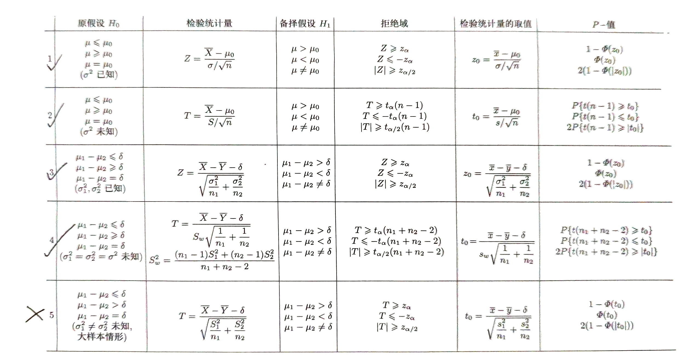
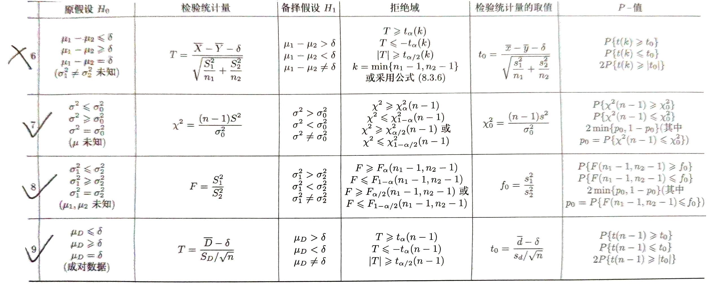

# 8 假设检验

<!-- !!! tip "说明"

    本文档正在更新中…… -->

!!! info "说明"

    1. 有些公式块因为已经有图片了，懒得打 $\KaTeX$ 了，所以就直接用图片替代了
    2. 本文档仅涉及部分内容，仅可用于复习重点知识

<figure markdown="span">
    { width="800" }
</figure>

<figure markdown="span">
    { width="800" }
</figure>