# 1 AVL Trees, Splay Trees and Amortized Analysis

<!-- !!! tip "说明"

    此文档正在更新中…… -->

!!! info "说明"

    本文档只涉及部分知识点，仅可用来复习重点知识

## 1 AVL Trees

用 $h(node)$ 表示树中一个结点的高度，==定义平衡因子 $BF(node) = h_L - h_R$==

### 定义

AVL Trees 是一个平衡二叉树，且具有以下性质：

1. $BF(any\ node) = -1, 0, 1$

### 插入操作

- RR / LL rotation 是 Single rotation
- LR / RL rotation 是 Double rotation

#### RR rotation

使得某结点 node 的 BF 值不符合要求的结点在 node 右结点的右子树上

??? example "RR rotation 具体示例"
    
    **step 0:**

    ```mermaid
    graph TD;
    A((5, BF = -1))
    B[NULL]
    C((6, BF = 0))
    A === B
    A === C
    ```

    插入新结点 7

    **step 1:**

    ```mermaid
    graph TD;
    A((5, BF = -2))
    B[NULL]
    C((6, BF = -1))
    D[NULL]
    E((7, BF = 0))
    A === B
    A === C
    C === D
    C === E
    ```

    结点 5 的 BF 值为 -2，不符合 AVL Trees 性质，RR rotation

    **step 2:**

    ```mermaid
    graph TD;
    A((5, BF = 0))
    C((6, BF = 0))
    E((7, BF = 0))
    C === A
    C === E
    ```

普遍情况下：

> 标红的结点表示 BF 值异常的结点，标蓝的结点表示引起异常的结点

<div class="grid" style="align-items: center;" markdown>

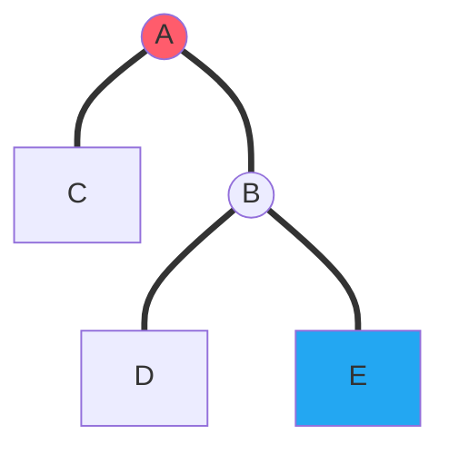

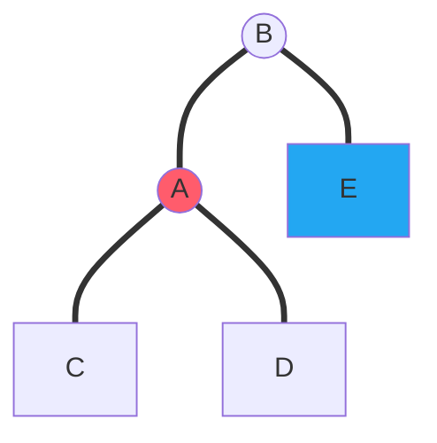

</div>

#### LL rotation

使得某结点 node 的 BF 值不符合要求的结点在 node 左结点的左子树上

普遍情况下：

> 标红的结点表示 BF 值异常的结点，标蓝的结点表示引起异常的结点

<div class="grid" style="align-items: center;" markdown>

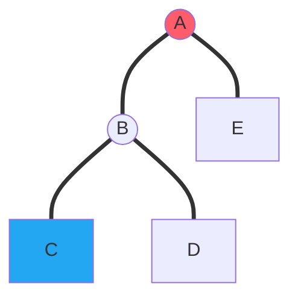

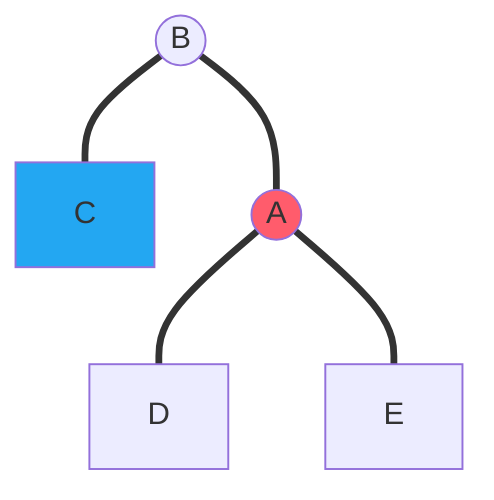

</div>

#### LR rotation

使得某结点 node 的 BF 值不符合要求的结点在 node 左结点的右子树上

普遍情况下：

> 标红的结点表示 BF 值异常的结点，标蓝的结点表示引起异常的结点

=== "情况 1"

    <div class="grid" style="align-items: center;" markdown>
    
    ```mermaid
    graph TD;
    A((A))
    B((B))
    E[E]
    D[D]
    C((C))
    F[F]
    G[G]
    A === B
    A === G
    B === D
    B === C
    C === E
    C === F
    style A fill: #ff5c6c
    style E fill: #23a7f2
    ```
    
    ```mermaid
    graph TD;
    D[D]
    A((A))
    C((C))
    B((B))
    E[E]
    F[F]
    G[G]
    C === B
    C === A
    B === D
    B === E
    A === F
    A === G
    style A fill: #ff5c6c
    style E fill: #23a7f2
    ```
    
    </div>

=== "情况 2"

    <div class="grid" style="align-items: center;" markdown>
    
    ```mermaid
    graph TD;
    A((A))
    B((B))
    E[E]
    D[D]
    C((C))
    F[F]
    G[G]
    A === B
    A === G
    B === D
    B === C
    C === E
    C === F
    style A fill: #ff5c6c
    style F fill: #23a7f2
    ```
    
    ```mermaid
    graph TD;
    D[D]
    A((A))
    C((C))
    B((B))
    E[E]
    F[F]
    G[G]
    C === B
    C === A
    B === D
    B === E
    A === F
    A === G
    style A fill: #ff5c6c
    style F fill: #23a7f2
    ```
    
    </div>

#### RL rotation

使得某结点 node 的 BF 值不符合要求的结点在 node 右结点的左子树上

普遍情况下：

> 标红的结点表示 BF 值异常的结点，标蓝的结点表示引起异常的结点

=== "情况 1"

    <div class="grid" style="align-items: center;" markdown>
    
    ```mermaid
    graph TD;
    A((A))
    D[D]
    B((B))
    C((C))
    E[E]
    F[F]
    G[G]
    A === D
    A === B
    B === C
    B === G
    C === E
    C === F
    style A fill: #ff5c6c
    style E fill: #23a7f2
    ```
    
    ```mermaid
    graph TD;
    D[D]
    A((A))
    C((C))
    B((B))
    E[E]
    F[F]
    G[G]
    C === A
    C === B
    B === F
    B === G
    A === D
    A === E
    style A fill: #ff5c6c
    style E fill: #23a7f2
    ```
    
    </div>

=== "情况 2"

    <div class="grid" style="align-items: center;" markdown>
    
    ```mermaid
    graph TD;
    A((A))
    D[D]
    B((B))
    C((C))
    E[E]
    F[F]
    G[G]
    A === D
    A === B
    B === C
    B === G
    C === E
    C === F
    style A fill: #ff5c6c
    style F fill: #23a7f2
    ```
    
    ```mermaid
    graph TD;
    D[D]
    A((A))
    C((C))
    B((B))
    E[E]
    F[F]
    G[G]
    C === A
    C === B
    B === F
    B === G
    A === D
    A === E
    style A fill: #ff5c6c
    style F fill: #23a7f2
    ```
    
    </div>

???+ question "PTA 1.1"

    Insert 2, 1, 4, 5, 9, 3, 6, 7 into an initially empty AVL tree.  Which one of the following statements is FALSE?

    A.4 is the root<br/>
    B.3 and 7 are siblings<br/>
    C.2 and 6 are siblings<br/>
    D.9 is the parent of 7

    ??? success "答案"

        B

        ---
        
        > [AVL树|算法数据结构可视化](https://algo.hufeifei.cn/AVLtree.html){:target="_blank"}

        <figure markdown="span">
            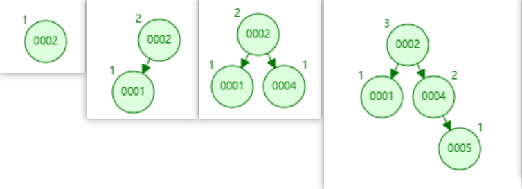{ width="600" }
        </figure>

        <figure markdown="span">
            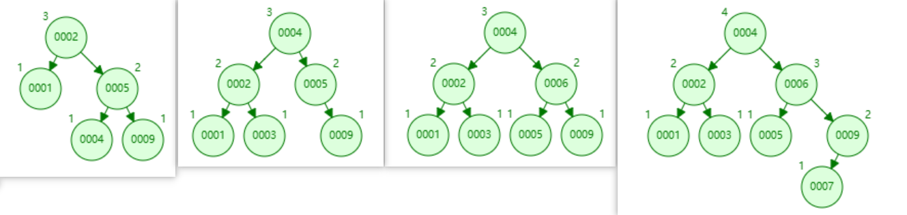{ width="700" }
        </figure>

### 小结论

在一个 AVL Tree 上，某节点 $n$ 的高度为 h，以此结点为根结点的树，此树的结点数量最小值为 $n_h$，$n_h$ 满足：
$$
n_h = F_{h+3} - 1,\ h\geqslant 0
$$
$F_i$ 是斐波那契数列，$F_0 = 0,\ F_1 = 1,\ F_i = F_{i-1} + F_{i-2}$

例如，$n_0 = 1,\ n_1 = 2$

???+ question "PTA 1.3"

    If the depth of an AVL tree is 6 (the depth of an empty tree is defined to be -1), then the minimum possible number of nodes in this tree is:

    A.13<br/>
    B.17<br/>
    C.20<br/>
    D.33

    ??? success "答案"

        D

        ---

        $n_6 = F_9 - 1 = 34 -1 = 33$

## 2 Splay Trees

### Splay 操作

对于任意一个节点 X，记其父节点为 P，其父节点的父节点为 G

当访问到某点 X 时：

1. 如果 P 是根节点，则直接进行一次 Single rotation，将 X 转到根节点
2. 如果 P 不是根节点
      1. 当情况为 LR / RL 时，进行一次 LR rotation 或 RL rotation，称之为 zig-zag
      2. 当情况为 LL / RR 时，进行两次 Single Rotation，称之为 zig-zig
3. 不断对 X 进行 Splay 操作，直到 X 成为根节点

#### zig

=== "情况 1"

    <div class="grid" style="align-items: center;" markdown>
    
    ```mermaid
    graph TD;
    P((P))
    X((X))
    C[C]
    A[A]
    B[B]
    P === X
    P === C
    X === A
    X === B 
    style X fill: #23a7f2
    ```
    
    ```mermaid
    graph TD;
    B[B]
    A[A]
    P((P))
    X((X))
    C[C]
    X === A
    X === P
    P === B
    P === C
    style X fill: #23a7f2
    ```
    
    </div>

=== "情况 2"

    <div class="grid" style="align-items: center;" markdown>
    
    ```mermaid
    graph TD;
    P((P))
    B[B]
    C[C]
    A[A]
    X((X))
    P === A
    P === X
    X === B
    X === C
    style X fill: #23a7f2
    ```
    
    ```mermaid
    graph TD;
    A[A]
    B[B]
    P((P))
    X((X))
    C[C]
    X === P
    X === C
    P === A
    P === B
    style X fill: #23a7f2
    ```
    
    </div>

#### zig-zig

=== "情况 1"

    <div class="grid" style="align-items: center;" markdown>
    
    ```mermaid
    graph TD;
    G((G))
    P((P))
    D[D]
    X((X))
    C[C]
    A[A]
    B[B]
    G === P
    G === D
    P === X
    P === C
    X === A
    X === B 
    style X fill: #23a7f2
    ```
    
    ```mermaid
    graph TD;
    B[B]
    G((G))
    A[A]
    P((P))
    D[D]
    X((X))
    C[C]
    X === A
    X === P
    P === B
    P === G
    G === C
    G === D
    style X fill: #23a7f2
    ```
    
    </div>

=== "情况 2"

    <div class="grid" style="align-items: center;" markdown>
    
    ```mermaid
    graph TD;
    G((G))
    A[A]
    P((P))
    D[D]
    B[B]
    X((X))
    C[C]
    G === A
    G === P
    P === B
    P === X
    X === C
    X === D 
    style X fill: #23a7f2
    ```
    
    ```mermaid
    graph TD;
    B[B]
    G((G))
    A[A]
    P((P))
    D[D]
    X((X))
    C[C]
    X === P
    X === D
    P === G
    P === C
    G === A
    G === B
    style X fill: #23a7f2
    ```
    
    </div>

#### zig-zag

=== "情况 1"

    <div class="grid" style="align-items: center;" markdown>
    
    ```mermaid
    graph TD;
    G((G))
    P((P))
    D[D]
    A[A]
    X((X))
    B[B]
    C[C]
    G === P
    G === D
    P === A
    P === X
    X === B
    X === C 
    style X fill: #23a7f2
    ```
    
    ```mermaid
    graph TD;
    A[A]
    B[B]
    P((P))
    G((G))
    C[C]
    D[D]
    X((X))
    X === P
    X === G
    P === A
    P === B
    G === C
    G === D
    style X fill: #23a7f2
    ```
    
    </div>

=== "情况 2"

    <div class="grid" style="align-items: center;" markdown>
    
    ```mermaid
    graph TD;
    G((G))
    A[A]
    P((P))
    X((X))
    D[D]
    B[B]
    C[C]
    G === P
    G === A
    P === D
    P === X
    X === B
    X === C 
    style X fill: #23a7f2
    ```
    
    ```mermaid
    graph TD;
    A[A]
    B[B]
    G((G))
    P((P))
    C[C]
    D[D]
    X((X))
    X === G
    X === P
    P === C
    P === D
    G === A
    G === B
    style X fill: #23a7f2
    ```
    
    </div>

???+ question "PTA 1.2"

    For the result of accessing the keys 3, 9, 1, 5 in order in the splay tree in the following figure, which one of the following statements is FALSE?

    <figure markdown="span">
        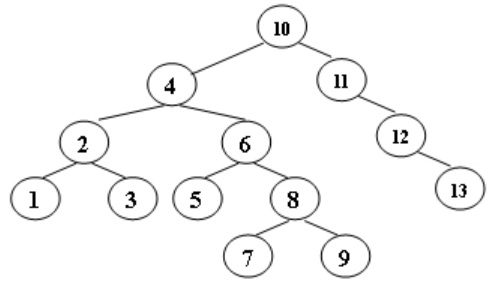{ width="400" }
    </figure>

    A.5 is the root<br/>
    B.1 and 9 are siblings<br/>
    C.6 and 10 are siblings<br/>
    D.3 is the parent of 4

    ??? success "答案"

        D

        ---

        > 为使图呈现二叉树效果，必须画出 NULL 结点，很抱歉影响到观感

        <div class="grid" style="align-items: center;" markdown>
    
        ```mermaid
        graph TD;
        a((10))
        b((3))
        c((11))
        d((2))
        e((4))
        f((12))
        g((1))
        h((6))
        i((13))
        j((5))
        k((8))
        l((7))
        m((9))
        n((NULL))
        o((NULL))
        p((NULL))
        a === b
        a === c
        b === d
        b === e
        d === g
        d === n
        e === o
        e === h
        h === j
        h === k
        k === l
        k === m
        c === p
        c === f
        f === q((NULL))
        f === i
        style b fill: #23a7f2
        ```
        
        ```mermaid
        graph TD;
        a((10))
        b((3))
        c((11))
        d((2))
        e((4))
        f((12))
        g((1))
        h((6))
        i((13))
        j((5))
        k((8))
        l((7))
        m((9))
        n((NULL))
        o((NULL))
        p((NULL))
        b === d
        b === a
        d === g
        d === n
        a === e
        a === c
        e === o
        e === h
        h === j
        h === k
        k === l
        k === m
        c === p
        c === f
        f === q((NULL))
        f === i
        style b fill: #23a7f2
        style m fill: #23a7f2
        ```

        ```mermaid
        graph TD;
        a((3)) === b((2))
        a === c((10))
        b === d((1))
        b === e((NULL))
        c === f((4))
        c === g((11))
        f === h((NULL))
        f === i((9))
        i === j((8))
        i === k((NULL))
        j === l((6))
        j === m((NULL))
        l === n((5))
        l === o((7))
        g === p((NULL))
        g === q((12))
        q === r((NULL))
        q === s((13))
        style i fill: #23a7f2
        ```

        ```mermaid
        graph TD;
        a((10))
        b((3))
        c((11))
        d((2))
        e((4))
        f((12))
        g((1))
        h((6))
        i((13))
        j((5))
        k((8))
        l((7))
        m((9))
        n((NULL))
        o((NULL))
        p((NULL))
        b === d
        b === m
        d === g
        d === n
        m === e
        m === a
        e === o
        e === k
        k === h
        k === p
        h === j
        h === l
        a === q((NULL))
        a === c
        c === r((NULL))
        c === f
        f === s((NULL))
        f === i
        style m fill: #23a7f2
        ```

        ```mermaid
        graph TD;
        a((10))
        b((3))
        c((11))
        d((2))
        e((4))
        f((12))
        g((1))
        h((6))
        i((13))
        j((5))
        k((8))
        l((7))
        m((9))
        n((NULL))
        o((NULL))
        p((NULL))
        m === b
        m === a
        b === d
        b === e
        d === g
        d === n
        e === o
        e === k
        k === h
        k === p
        h === j
        h === l
        a === q((NULL))
        a === c
        c === r((NULL))
        c === f
        f === s((NULL))
        f === i
        style m fill: #23a7f2
        style g fill: #23a7f2
        ```

        ```mermaid
        graph TD;
        a((10))
        b((3))
        c((11))
        d((2))
        e((4))
        f((12))
        g((1))
        h((6))
        i((13))
        j((5))
        k((8))
        l((7))
        m((9))
        n((NULL))
        o((NULL))
        p((NULL))
        q((NULL))
        r((NULL))
        s((NULL))
        t((NULL))
        u((NULL))
        m === g
        m === a
        g === n
        g === d
        d === o
        d === b
        b === p
        b === e
        e === r
        e === k
        k === h
        k === s
        h === j
        h === l
        a === q
        a === c
        c === t
        c === f
        f === u
        f === i
        style g fill: #23a7f2
        ```

        ```mermaid
        graph TD;
        a((10))
        b((3))
        c((11))
        d((2))
        e((4))
        f((12))
        g((1))
        h((6))
        i((13))
        j((5))
        k((8))
        l((7))
        m((9))
        n((NULL))
        o((NULL))
        p((NULL))
        q((NULL))
        r((NULL))
        s((NULL))
        t((NULL))
        u((NULL))
        g === n
        g === m
        m === d
        m === a
        d === o
        d === b
        b === p
        b === e
        e === r
        e === k
        k === h
        k === s
        h === j
        h === l
        a === q
        a === c
        c === t
        c === f
        f === u
        f === i
        style g fill: #23a7f2
        style j fill: #23a7f2
        ```

        ```mermaid
        graph TD;
        a((10))
        b((3))
        c((11))
        d((2))
        e((4))
        f((12))
        g((1))
        h((6))
        i((13))
        j((5))
        k((8))
        l((7))
        m((9))
        n((NULL))
        o((NULL))
        p((NULL))
        q((NULL))
        r((NULL))
        s((NULL))
        t((NULL))
        u((NULL))
        g === n
        g === m
        m === d
        m === a
        d === o
        d === b
        b === p
        b === e
        e === r
        e === j
        j === s
        j === h
        h === t
        h === k
        k === l
        k === u
        a === q
        a === c
        c === v((NULL))
        c === f
        f === w((NULL))
        f === i
        style j fill: #23a7f2
        ```

        ```mermaid
        graph TD;
        a((10))
        b((3))
        c((11))
        d((2))
        e((4))
        f((12))
        g((1))
        h((6))
        i((13))
        j((5))
        k((8))
        l((7))
        m((9))
        n((NULL))
        o((NULL))
        p((NULL))
        q((NULL))
        r((NULL))
        s((NULL))
        t((NULL))
        u((NULL))
        g === n
        g === m
        m === d
        m === a
        d === o
        d === j
        j === e
        j === h
        e === b
        e === p
        h === q
        h === k
        k === l
        k === r
        a === s
        a === c
        c === t
        c === f
        f === u
        f === i
        style j fill: #23a7f2
        ```

        ```mermaid
        graph TD;
        a((10))
        b((3))
        c((11))
        d((2))
        e((4))
        f((12))
        g((1))
        h((6))
        i((13))
        j((5))
        k((8))
        l((7))
        m((9))
        n((NULL))
        o((NULL))
        p((NULL))
        q((NULL))
        r((NULL))
        s((NULL))
        t((NULL))
        u((NULL))
        g === n
        g === j
        j === d
        j === m
        d === o
        d === e
        e === b
        e === p
        h === q
        h === k
        m === h
        m === a
        k === l
        k === r
        a === s
        a === c
        c === t
        c === f
        f === u
        f === i
        style j fill: #23a7f2
        ```

        ```mermaid
        graph TD;
        a((10))
        b((3))
        c((11))
        d((2))
        e((4))
        f((12))
        g((1))
        h((6))
        i((13))
        j((5))
        k((8))
        l((7))
        m((9))
        n((NULL))
        o((NULL))
        p((NULL))
        q((NULL))
        r((NULL))
        s((NULL))
        t((NULL))
        u((NULL))
        j === g
        j === m
        g === n
        g === d
        d === o
        d === e
        e === b
        e === p
        m === h
        m === a
        h === q
        h === k
        k === l
        k === r
        a === s
        a === c
        c === t
        c === f
        f === u
        f === i
        style j fill: #23a7f2
        ```

        </div>

## 3 Amortized Analysis

### 3.1 aggregate method

计算总的 worst 时间 $T(n)$，那么摊还时间就是 $\frac{T(n)}{n}$

### 3.2 accounting method

某些操作的 $\hat{c_i}$ 大于 $c_i$，大于的部分当作 credit，某些操作的 $\hat{c_i}$ 小于 $c_i$，小于的部分用于偿还 credit

<figure markdown="span">
    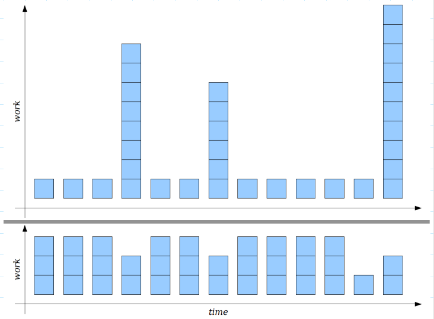{ width="600" }
</figure>

### 3.3 potential method

定义势能函数 $\Phi$，势能函数满足：

1. 势能函数反映了数据结构的“复杂度” 
2. $\Phi_{start} = 0$
3. $\Phi \geqslant 0$

$$
\hat{c_i} = c_i + k · \Delta\Phi
$$

其中，$\Delta\Phi = \Phi_{after} - \Phi_{before}$

普遍情况下，一个好的势能函数应该总是在操作序列开始时假设它的最小值

$$
\sum \hat{c_i} = \sum (c_i + k · \Delta\Phi)\\
\kern3.6em = \sum c_i + k · \sum \Delta\Phi\\
\kern6.6em = \sum c_i + k · (\Phi_{end} - \Phi_{start})\\
\kern-1.8em \geqslant \sum c_i
$$

???+ question "PTA 1.4"

    When doing amortized analysis, which one of the following statements is FALSE?

    A. Aggregate analysis shows that for all n, a sequence of n operations takes worst-case time $T(n)$ in total.  Then the amortized cost per operation is therefore $\frac{T(n)}{n}$ <br/>
    B. For potential method, a good potential function should always assume its maximum at the start of the sequence<br/>
    C. For accounting method, when an operation's amortized cost exceeds its actual cost, we save the difference as credit to pay for later operations whose amortized cost is less than their actual cost<br/>
    D. The difference between aggregate analysis and accounting method is that the later one assumes that the amortized costs of the operations may differ from each other

    ??? success "答案"

        B

        ---

        这 4 个选项上文均有提到，B 选项 maximum 应为 minimum
        
        普遍情况下，一个好的势能函数应该总是在操作序列开始时假设它的最小值

???+ question "PTA 1.5"

    Consider the following buffer management problem. Initially the buffer size (the number of blocks) is one. Each block can accommodate exactly one item. As soon as a new item arrives, check if there is an available block. If yes, put the item into the block, induced a cost of one. Otherwise, the buffer size is doubled, and then the item is able to put into. Moreover, the old items have to  be moved into the new buffer so it costs k+1 to make this insertion, where k is the number of old items. Clearly, if there are N items, the worst-case cost for one insertion can be $Ω(N)$.  To show that the average cost is $O(1)$, let us turn to the amortized analysis. To simplify the problem, assume that the buffer is full after all the N items are placed. Which of the following potential functions works?


    A. The number of items currently in the buffer<br/>
    B. The opposite number of items currently in the buffer<br/>
    C. The number of available blocks currently in the buffer<br/>
    D. The opposite number of available blocks in the buffer

    ??? success "答案"

        D

        ---

        正常分析时，应考虑两种情况，insert 前 buffer 没满和 buffer 满了，题目说为了简化问题，只考虑 buffer 满了的情况

        **A选项：**

        设 $k$ 是 insert 前 buffer 中 item 的数量

        $\hat{c_i} = c_i + \Phi_i - \Phi_{i-1} = k + 1 + k + 1 - k = k + 2$

        **B选项：**

        $\hat{c_i} = k + 1 - (k + 1) - (-k) = k$

        **C选项：**

        $\hat{c_i} = k + 1 + k - 1 - 0 = 2k$

        **D选项：**

        $\hat{c_i} = k + 1 -(k - 1) - 0 = 2$

        ---

        只有 D 选项最后是 $O(1)$

### Splay Trees 摊还分析

结论：在一个以 T 为根的树上 splay 一个结点 X 的摊还时间为
$$
T_{amortized time} \leqslant 3(R(T) - R(X)) + 1 = O(\log N)
$$
定义势能函数 $\Phi(T) = \sum\limits_{i \in T} Rank(i)$，其中 $Rank(i) = \log S(i)$，$S(i)$ 是 i 结点的 descendants 总个数（包括 i 自己）

!!! tip "引理"

    若 $a + b \leqslant c,\ a > 0,\ b > 0$，则：

    $$
    \log a + \log b \leqslant 2\log c - 2
    $$

#### zig

<div class="grid" style="align-items: center;" markdown>
    
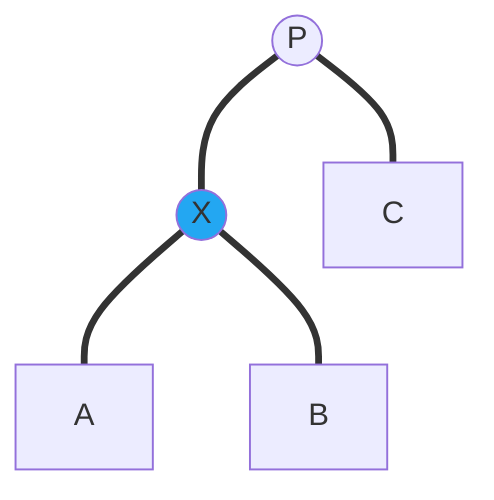

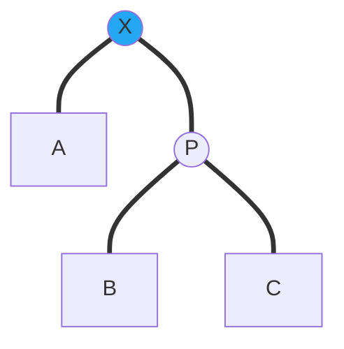
    
</div>

> $R_1(i)$ 表示 splay 前的结点 i 的 Rank， $R_2(i)$ 表示 splay 后的结点 i 的 Rank

$\hat{c_i} = 1 + R_2 (X) + R_2 (P) - R_1 (X) - R_1 (P)$

$\because R_1 (P)\geqslant R_2 (P)$

$\therefore \hat{c_i} \leqslant 1 + R_2 (X) - R_1 (X)$

$\because R_2(X) \geqslant R_1(X)$

$\therefore \hat{c_i} \leqslant 1 + 3(R_2 (X) - R_1 (X))$

#### zig-zig

<div class="grid" style="align-items: center;" markdown>
    
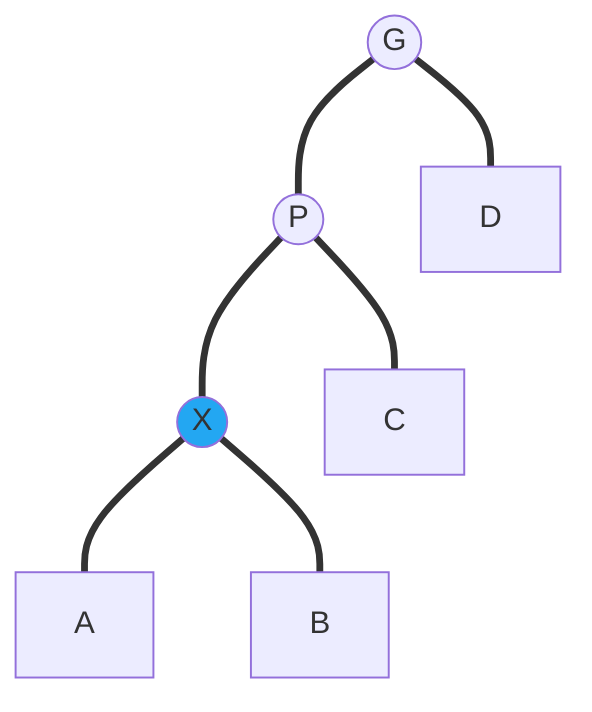

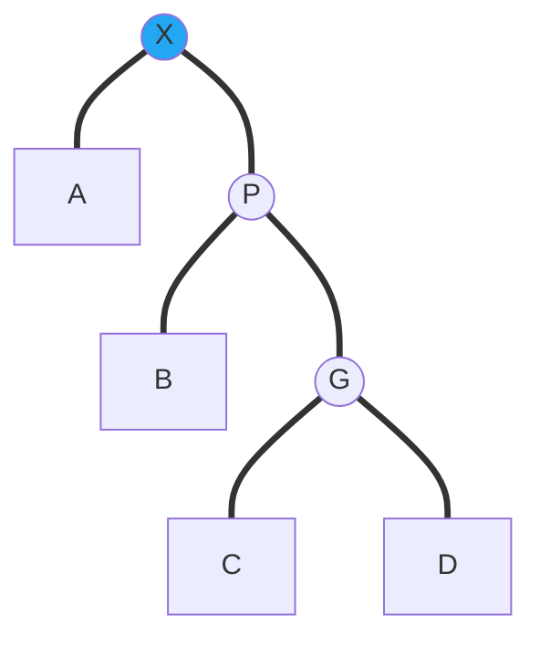

</div>

$\hat{c_i} = 2 + R_2(X) + R_2(P) + R_2(G) - R_1(X) - R_1(P) - R_1(G)$

$\because R_1(G) = R_2(X)$

$\therefore \hat{c_i} = 2 + R_2(P) + R_2(G) - R_1(X) - R_1(P)$

$\because R_1(X) \leqslant R_1(P)$

$\therefore \hat{c_i} \leqslant 2 + R_2(P) + R_2(G) - 2R_1(X)$

$\because R_2(X) \geqslant R_2(P)$

$\therefore \hat{c_i} \leqslant 2 + R_2(X) + R_2(G) - 2R_1(X) = 2 + R_2(X) + R_2(G) + R_1(X) - 3R_1(X)$

根据上面的引理：

$\because S_2(G) + S_1(X) \leqslant S_2(X)$

$\therefore R_2(G) + R_1(X) \leqslant 2R_2(X) - 2$

$\therefore \hat{c_i} \leqslant 3R_2(X) - 3R_1(X) = 3(R_2(X) - R_1(X)) \leqslant 1 + 3(R_2 (X) - R_1 (X))$

#### zig-zag

<div class="grid" style="align-items: center;" markdown>
    
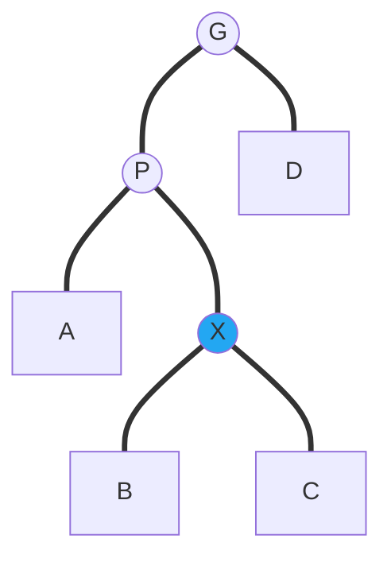

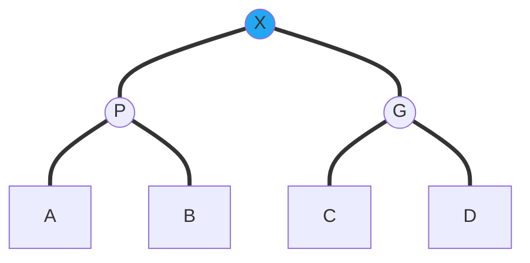

</div>

$\hat{c_i} = 2 + R_2(X) + R_2(P) + R_2(G) - R_1(X) - R_1(P) - R_1(G)$

$\because R_2(X) = R_1(G)$

$\therefore \hat{c_i} = 2 + R_2(P) + R_2(G) - R_1(X) - R_1(P)$

$\because R_1(X) \leqslant R_1(P)$

$\therefore \hat{c_i} \leqslant 2 + R_2(P) + R_2(G) - 2R_1(X)$

根据上面的引理：

$\because S_2(P) + S_2(G) \leqslant S_2(X)$

$\therefore R_2(P) + R_2(G) \leqslant 2R_2(X) - 2$

$\therefore \hat{c_i} \leqslant 2R_2(X) - 2R_1(X) \leqslant 1 + 3(R_2 (X) - R_1 (X))$

---

综上所述：

$\hat{c_i} \leqslant 1 + 3(R_2 (X) - R_1 (X))$

因为 splay 后的树的根结点就是 X，所以 $R_2 (X) = R_2(T) = R_1(T)$，则：
$$
T_{amortized time} \leqslant 3(R(T) - R(X)) + 1 = O(\log N)
$$
