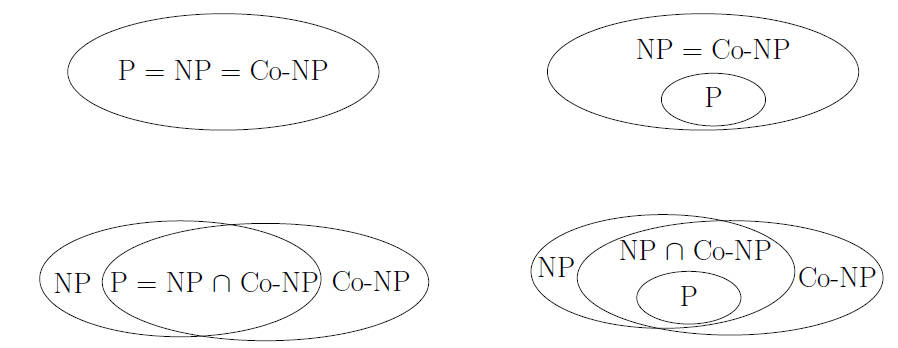
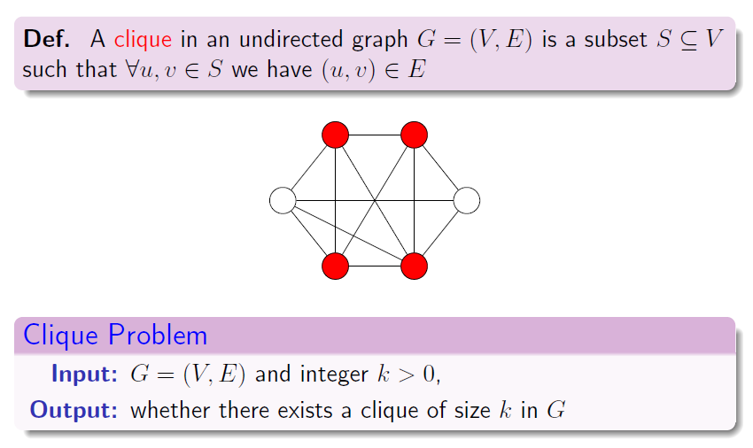
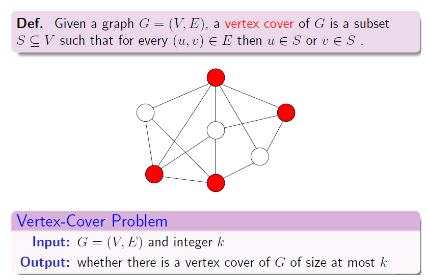

# 10 Intractability

<!-- !!! tip "说明"

    此文档正在更新中…… -->

!!! info "说明"

    本文档只涉及部分知识点，仅可用来复习重点知识

## 1 判定问题与最优化问题

很多问题都是 **最优化问题**（optimization problem）。==然而 NP 完全性不适合应用于最优化问题，但适合用于 **判定问题**（decision problem）==，因为这种问题的答案是简单的“是”或“否”。通常，==我们可以将一个给定的最优化问题转化为一个相关的判定问题==

???+ question "PTA 10.3"

    All the languages can be decided by a non-deterministic machine. 

    T F

    ??? success "答案"

        F

        ---

        非判定问题无法被解决

## 2 多项式时间

!!! abstract "class P"

    在多项式时间内可解的具体判定问题的集合

### 形式语言体系

**字母表**（alphabet）$\Sigma$ 是符号的有限集合。字母表 $\Sigma$ 上的 **语言**（language）$L$ 由表中符号组成的串的任意集合

!!! note "定理"

    $P=\lbrace L: L 能被一个多项式时间算法所接受 \rbrace$

## 3 多项式时间的验证

定义 **验证算法**（verification algorithm）为含两个自变量的算法 $A$，其中一个自变量是普通输入串 $x$，另一个是称为“证书”（certificate）的二进制串 $y$。如果存在一个证书 $y$ 满足 $A(x,y) = 1$，则该含两个自变量的算法 $A$ 验证了输入串 $x$

!!! abstract "class NP"

    1. 复杂类 NP 是能被一个多项式时间算法验证的语言类
    2. 复杂类 NP 是能被 non-deterministic machine 在多项式时间内解决的

???+ question "PTA 10.4"

    All NP problems can be solved in polynomial time in a non-deterministic machine. 

    T F

    ??? success "答案"

        T

        ---

        class NP 的定义

!!! note ""

    $P \subseteq NP$

    目前还不知道是否有 $P = NP$

!!! abstract "class co-NP"

    复杂类 co-NP 为满足 $\bar{L} \in NP$ 的语言 $L$ 构成的集合

!!! note ""

    $P \subseteq NP \cap co-NP$

    目前不知道是否有 $P = NP \cap co-NP$

<figure markdown="span">
    { width="600" }
</figure>

???+ question "PTA 10.5"

    If a problem can be solved by dynamic programming, it must be solved in polynomial time. 

    T F

    ??? success "答案"

        F

        ---

        反例：0-1 背包问题

## 4 NP 完全性与可归约性

### 可归约性

语言 $L_1$ 在多项式时间内可以规约为语言 $L_2$，记作 $L_1 \leqslant_P L_2$，如果存在一个多项式时间可计算的函数 $f:\lbrace 0,1 \rbrace^* \rightarrow \lbrace 0,1 \rbrace^*$，满足对所有的 $x \in \lbrace 0,1 \rbrace^*$，$x \in L_1 当且仅当 f(x) = L_2$，则称函数 $f$ 为 **规约函数**（reduction function），计算 $f$ 的多项式时间算法 $F$ 称为 **规约算法**（reduction algorithm）

!!! note "定理"

    如果 $L_1,L_2 \subseteq \lbrace 0,1 \rbrace^*$ 是满足 $L_1 \leqslant_P L_2$ 的语言，则 $L_2 \in P \Rightarrow L_1 \in P$

???+ question "PTA 10.1"

    If $L_1 \leqslant_P L_2$ and $L_2 \in NP$, then $L_1 \in NP$

    T F

    ??? success "答案"

        T

        ---

        $L_1$ 可规约为 $L_2$，$L_2$ 若为 NP 问题，那么 $L_1$ 也为 NP 问题

### NP 完全性

!!! abstract "NP-Completeness（NPC）"

    语言 $L \subseteq \lbrace 0,1 \rbrace^*$ 是 NP 完全的，如果：

    1. $L \in NP$
    2. 对每一个 $L' \in NP_2$，有 $L' \leqslant_P L$

???+ question "PTA 10.2"

    All NP-complete problems are NP problems. 

    T F

    ??? success "答案"

        T

        ---

        NP-complete 问题的定义

!!! abstract "NP-Hard"

    如果一种语言 $L$ 满足上面的性质 2，但不一定满足性质 1，则称 $L$ 是 NP 难度的

!!! note "定理"

    如果任何 NP 完全问题是多项式时间可解的，则 $P = NP$。等价地，如果存在某一 NP 中的问题不是多项式时间可求解的，则所有 NP 完全问题都不是多项式时间可求解的

### 电路可满足性

给定某一个由 AND、OR 和 NOT 门构成的布尔组合电路，它是可满足电路吗？

!!! note "定理"

    1. 电路可满足性问题属于 class NP
    2. 电路可满足性问题属于 NP-Hard
    3. 电路可满足性问题属于 NP-Completeness
    4. ==所有 NP 问题均可规约为 SAT（Satisfiability problem，满足性问题）==

???+ question "PTA 10.7"

    Suppose Q is a problem in NP, but not necessarily NP-complete.  Which of the following is FALSE?

    A. A polynomial-time algorithm for SAT would sufficiently imply a polynomial-time algorithm for Q. 
    B. A polynomial-time algorithm for Q would sufficiently imply a polynomial-time algorithm for SAT. 
    C. If $Q \notin P$, then $P \not ={NP}$ 
    D. f Q is NP-hard, then Q is NP-complete.

    ??? success "答案"

        B

        ---

        **A、B 选项：**

        任何 NP 问题均可规约为 SAT 问题，所以应该是 A 选项说法正确，B 错误

        **C 选项：**

        见上文定理。如果存在某一 NP 中的问题不是多项式时间可求解的，则所有 NP 完全问题都不是多项式时间可求解的

        **D 选项：**

        见上文定义。Q 是 NP，且是 NP-hard，则说明 Q 是 NP-complete
    
## 5 NP 完全性的证明

!!! note "定理"

    如果语言 $L$ 是一种满足对任意 $L' \in NPC$ 都有 $L' \leqslant_P L$ 的语言，则 $L$ 是 NP 难度的。此外，如果 $L\in NP$，则 $L \in NPC$

### 公式可满足性

我们已知历史上第一个被证明的 NP 完全问题

!!! note "定理"
    
    布尔公式的可满足性问题是 NP-Completeness

### 3-CNF 可满足性

3-SAT

!!! note "定理"

    3-CNF 形式的布尔公式的可满足性问题是 NP-Completeness

## 6 NP 完全问题

### 6.1 Clique Problem

**团问题**

<figure markdown="span">
    { width="600" }
</figure>

!!! note "定理"

    Clique Problem 是 NP-Completeness

### 6.2 Vertex Cover Problem

<figure markdown="span">
    { width="600" }
</figure>

!!! note "定理"

    1. Vertex Cover Problem 是 NP-Completeness
    2. Clique Problem $\leqslant_P$ Vertex Cover Problem

### 6.3 Hamiltonian cycle

!!! note "定理"

    Hamiltonian cycle 是 NP-Completeness

### 6.4 Traveling Salesman Problem

!!! note "定理"

    Traveling Salesman Problem 是 NP-Completeness

### 6.5 Subset-sum Problem

子集和问题：给定一个正整数的有限集 $S$ 和一个整数目标 $t > 0$，试问是否存在一个子集 $S' \subseteq S$，其元素和为 $t$

!!! note "定理"

    Subset-sum Problem 是 NP-Completeness

???+ question "PTA 10.6"

    Among the following problems, __ is NOT an NP-complete problem.

    A. Vertex cover problem 
    B. Hamiltonian cycle problem 
    C. Halting problem 
    D. Satisfiability problem

    ??? success "答案"

        C
        
        ---

        停机问题甚至都不是判定问题，更不可能是 NP-complete