# 11 Approximation Algorithms

<!-- !!! tip "说明"

    本文档正在更新中…… -->

!!! info "说明"

    1. 本文档仅涉及部分内容，仅可用于复习重点知识
    2. 本文档部分图片来源于教学课件

## 1 定义

解决 NP 完全问题至少有三种方法：

1. 如果实际输入数据规模较小，则用指数级运行时间的算法就能很好地解决问题
2. 对于一些能在多项式时间内解决的特殊情况，可以把它们单独列出来求解
3. 可以寻找一些能够在多项式时间内得到近似最优解的方法

在实际应用中，近似最优解一般都能满足要求，返回近似最优解的算法就称为 **近似算法**（approximation algorithm）

### Approximation Ratio

**近似算法的性能比**

如果对规模为 $n$ 的任意输入，近似算法所产生的近似解的代价 $C$ 与最优解的代价 $C^*$ 只差一个因子 $\rho(n)$：

$$
\max(\dfrac{C}{C^*},\dfrac{C^*}{C}) \leqslant \rho(n)
$$

（对于最大化问题，$0 < C \leqslant C^*$；对于最小化问题，$0 < C^* \leqslant C$）

则称该近似算法有近似比 $\rho(n)$。如果一个算法的近似比达到 $\rho(n)$，则称该算法为 **$\rho(n)$ 近似算法**（$\rho(n)$-approximation algorithm）。特别地，1 近似算法产生的解就是最优解

一个最优化问题的 **近似模式**（approximation scheme）就是这样一种近似算法，它的输入除了该问题的实例外，还有一个值 $\epsilon > 0$，使得对任何固定的 $\epsilon$，该模式是一个 **$(1+\epsilon)$ 近似算法**（$(1+ \epsilon)$-approximation algorithm）。对一个近似模式来说，如果对任何固定的 $\epsilon > 0$，该模式都以其输入实例规模 $n$ 的多项式时间运行，则称此模式为 **多项式时间近似模式**（polynomial-time approximation scheme (PTAS)）

对一个近似模式来说，如果其运行时间表达式即为 $\frac{1}{\epsilon}$ 的多项式，又为输入实例规模 $n$ 的多项式，则称其为 **完全多项式时间近似模式**（fully polynomial-time
approximation scheme 
(FPTAS)）。例如 $O((\dfrac{1}{\epsilon})^2n^3)$

???+ question "PTA 11.1"

    Suppose ALG is an α-approximation algorithm for an optimization problem Π whose approximation ratio is tight. Then for every ϵ>0 there is no (α−ϵ)-approximation algorithm for Π unless P = NP.  

    T<br/>F

    ??? success "答案"

        F

        ---

        这句话前后说的是两码事

        > 没看明白

## 2 Bin Packing

<figure markdown="span">
    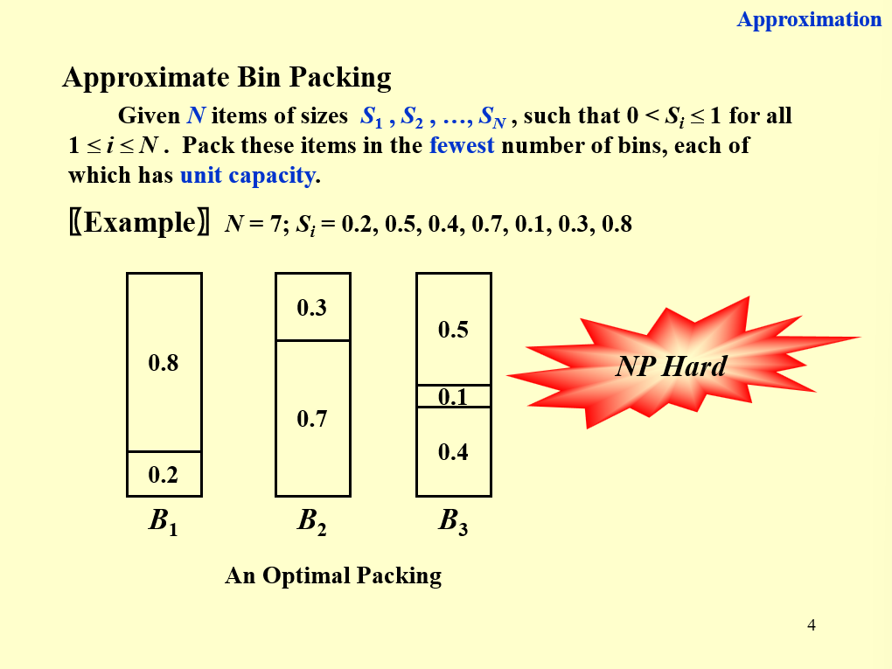{ width="600" }
</figure>

### Next Fit

<figure markdown="span">
    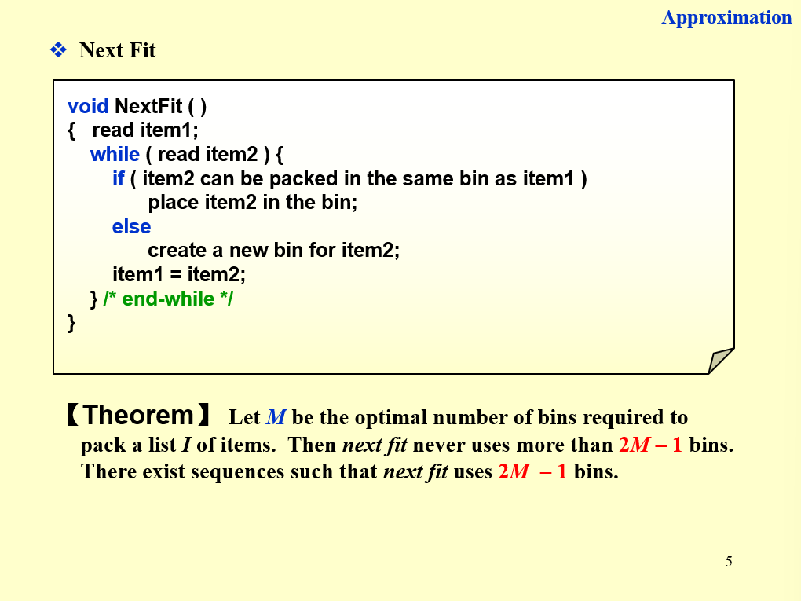{ width="600" }
</figure>

<figure markdown="span">
    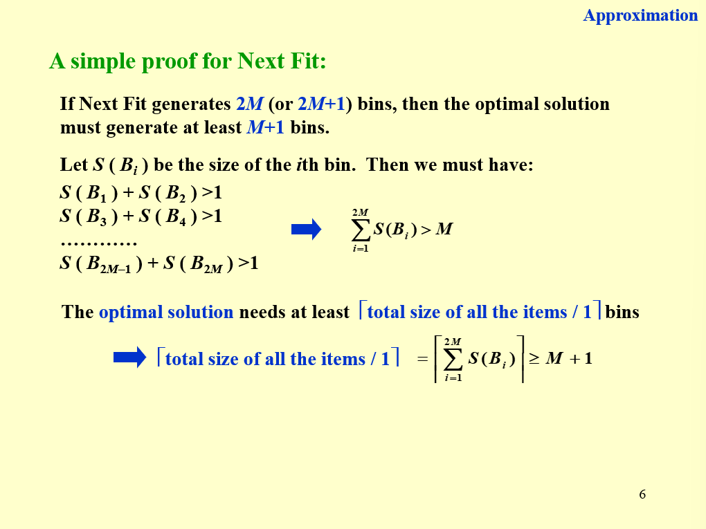{ width="600" }
</figure>

### First Fit and Best Fit

<figure markdown="span">
    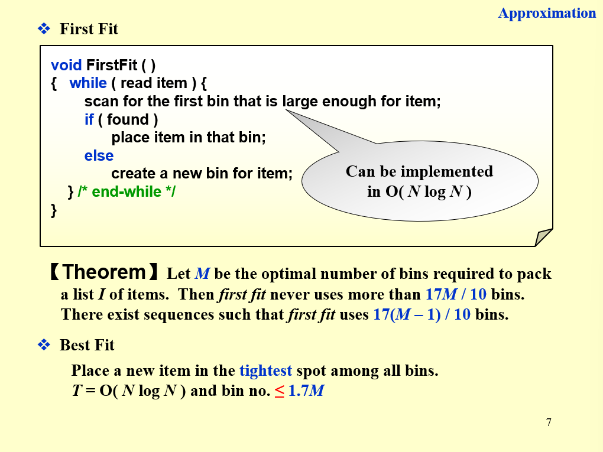{ width="600" }
</figure>

???+ question "PTA 11.3"

    For the bin-packing problem: let $S=\sum S_i$.  Which of the following statements is FALSE?

    A. The number of bins used by the next-fit heuristic is never more than ⌈2S⌉<br/>
    B. The number of bins used by the first-fit heuristic is never more than ⌈2S⌉<br/>
    C. The next-fit heuristic leaves at most one bin less than half full<br/>
    D. The first-fit heuristic leaves at most one bin less than half full

    ??? success "答案"

        C

        ---

        **A 选项：**

        上文图片中有结论，若 next-fit 产生 $2M$ 或 $2M + 1$ 个 bins，则 $\sum\limits_{i=1}^{2M}S(B_i) > M$，$\therefore 2S > 2M \Rightarrow \lceil 2S \rceil \geqslant 2M + 1$

        **B 选项：**

        first-fit 优于 next-fit，所以 B 肯定也对

        **C 选项：**

        两个少于半满的 bin 不相邻的情况可能出现，如 0.4，0.8，0.4。

        **D 选项：**

        如果存在两个少于半满的 bin，在放第二个 bin 时，一定会扫描到第一个 bin，将第二个 bin 放到第一个 bin 上面。所以 D 正确

### On-line Algorithms

在得到下一个 item 之前放置好当前的 item，而且之后不能再更改

没有一个 on-line algorithm 能够得到最优解，因为你无法得知输入什么时候停止

<figure markdown="span">
    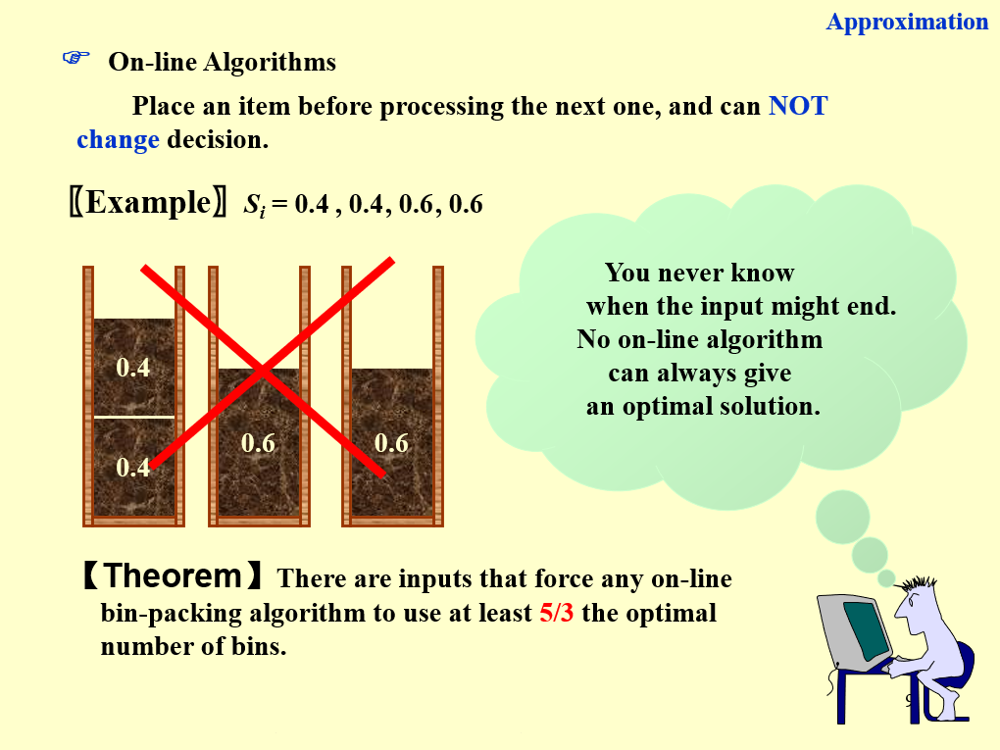{ width="600" }
</figure>

### Off-line Algorithms

能够看到所有的 item

将所有 items 从大到小排序，再使用 first / best fit，称为 first / best fit decreasing

<figure markdown="span">
    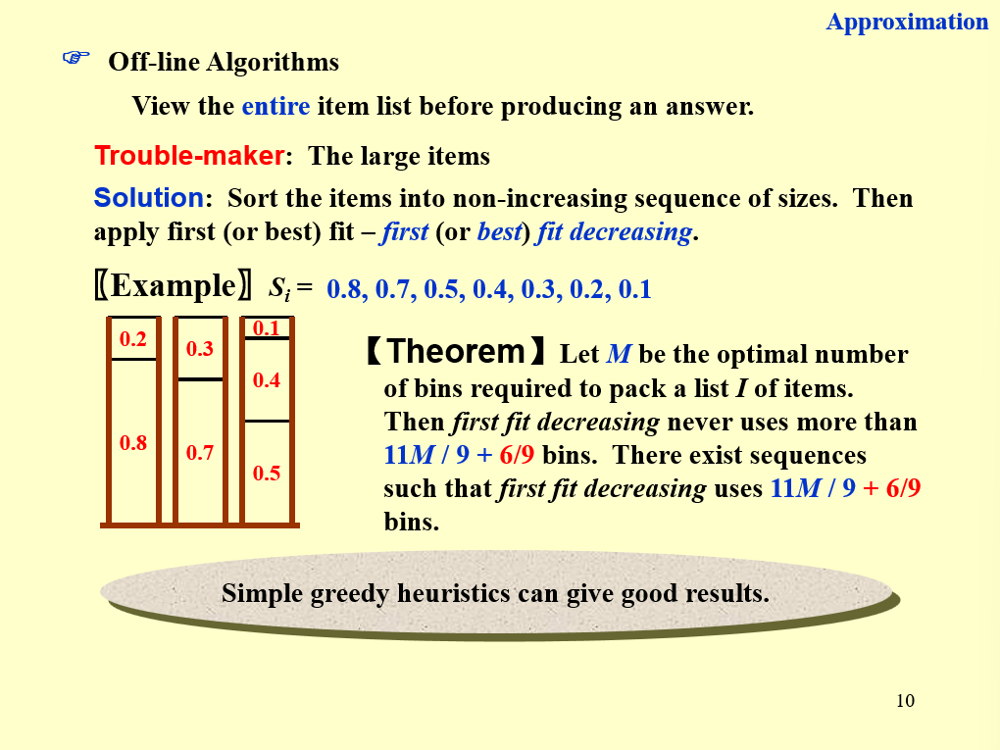{ width="600" }
</figure>

## 3 Knapsack Problem

### fractional version

看 $\dfrac{p_i}{w_i}$

### 0-1 version

!!! note ""

    存在 2-approximation algorithm

<figure markdown="span">
    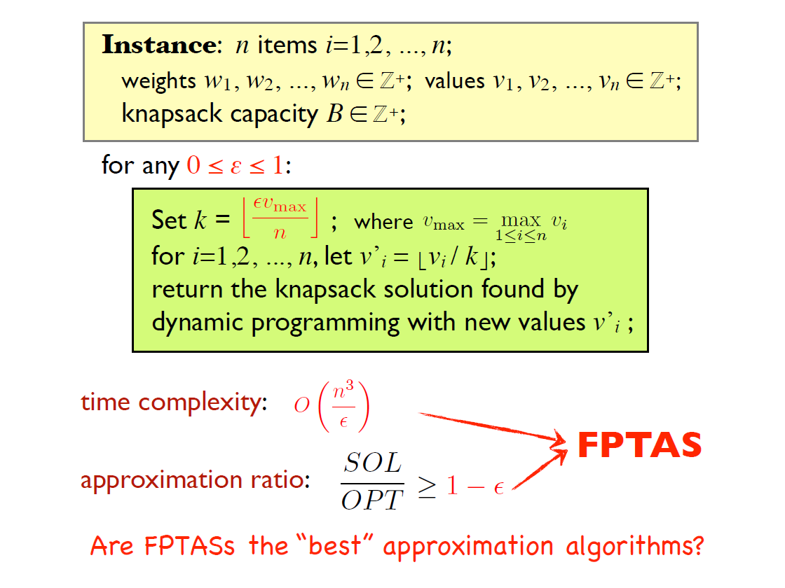{ width="600" }
</figure>

## 4 K-center Problem

<figure markdown="span">
    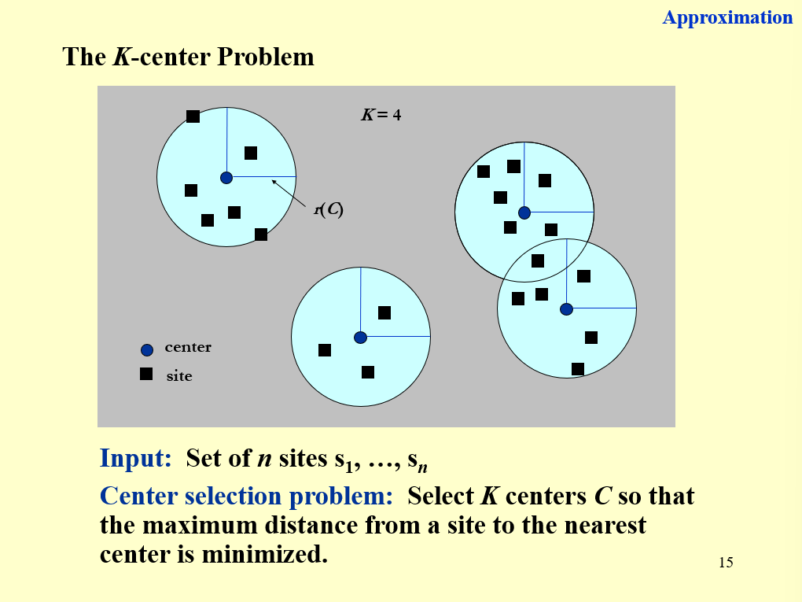{ width="600" }
</figure>

<figure markdown="span">
    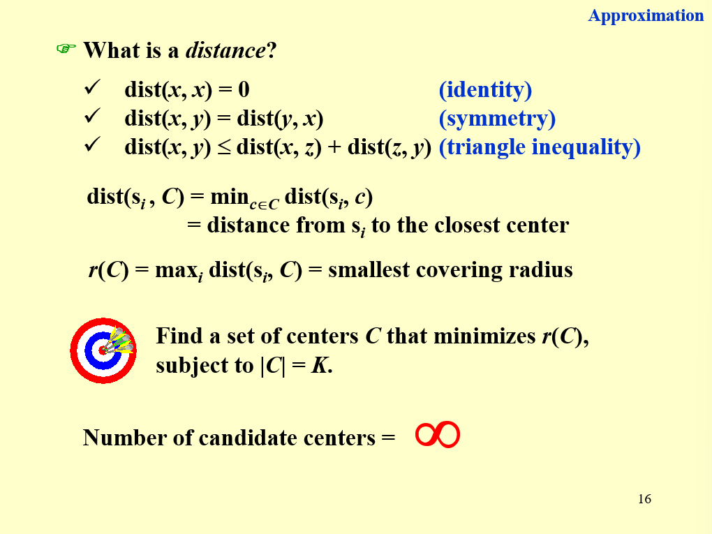{ width="600" }
</figure>

!!! note "定理"

    除非 $P = NP$，否则没有满足 $\rho < 2$ 的 $\rho$-approximation 解决 center-selection problem

## 5 Vertex Cover Problem

```c linenums="1" title="近似算法（输入无向图 G）"
C = ∅
E' = G.E
while (E' != ∅) {
    let (u,v) be an arbitrary edge of E'
    C = C ∪ {u,v}
    remove form E' every edge incident on either u or v
}
return C
```

!!! note "定理"

    此算法是一个多项式时间的 2-approximation algorithm

    ??? success "证明"

        <figure markdown="span">
            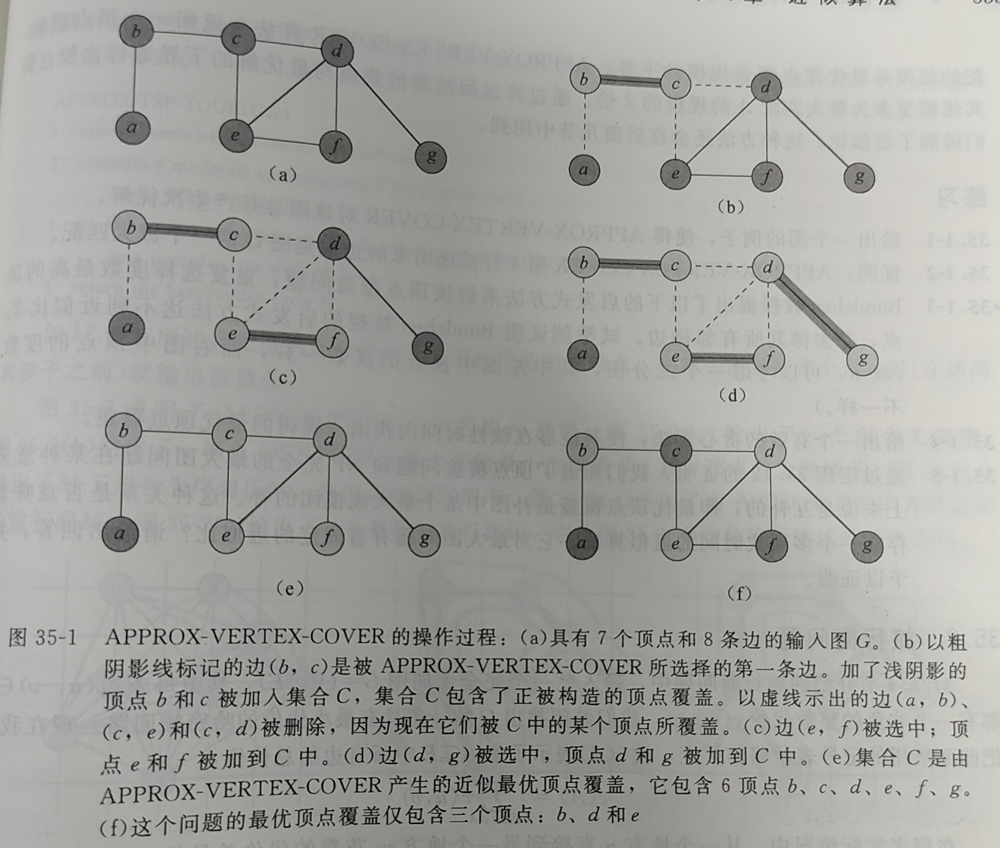{ width="600" }
        </figure>

        > 请结合此图理解证明过程

        设 $A$ 为此算法第 4 行选出的边的集合（如上图（d）加粗的边）。为了覆盖 $A$ 中的边，任意一个顶点覆盖（包括最优覆盖 $C^*$）都必须至少包含 $A$ 中每条边的一个端点。如果一条边在第 4 行中被选中，那么在第 6 行就会从 $E'$ 中删除所有与其端点关联的边。因此，$A$ 中不存在两条边具有共同的端点，从而 $A$ 中不会存在两条边由 $C^*$ 中的同一顶点所覆盖。于是，最优顶点覆盖的规模下界为：

        $$
        |C^*| \geqslant |A|
        $$

        算法第 4 行的每一次执行都会挑选出一条边，其两个端点都不在 $C$ 中，因此，所返回顶点覆盖的规模上界为：

        $$
        |C| = 2|A|
        $$

        则有：

        $$
        |C| = 2|A| \leqslant 2|C^*|
        $$

???+ question "PTA 11.2"

    As we know there is a 2-approximation algorithm for the Vertex Cover problem.  Then we must be able to obtain a 2-approximation algorithm for the Clique problem, since the Clique problem can be polynomially reduced to the Vertex Cover problem.  

    T<br/>F

    ??? success "答案"

        F

        ---

        虽然两者存在 $Clique \leqslant_P Vertex\ Cover$ 的关系，但它们的代价分析不同，题目的推断不成立

        两个问题的实例规模对应关系：$K_{Vertex\ in\ \bar{G}} = |V| - K_{Clique\ in\ G}$

        > 回顾两者的[对应关系](./ch10.md#ADS_ch10_CliqueAndVertex){:target="_blank"}

        设 Vertex Cover Problem 的 2-近似算法得到的顶点覆盖规模为 $K$，最优规模为 $K^*$，则

        $$
        \rho_{Vertex} = \dfrac{C_{Vertex}}{C_{Vertex}^*} = \dfrac{K}{K^*} = 2\\
        \rho_{Clique} = \dfrac{C_{Clique}^*}{C_{Clique}} = \dfrac{|V| - K^*}{|V| - K} = 1 + \dfrac{1}{\dfrac{|V|}{K^*} - 2} \not ={2}
        $$

???+ question "PTA 11.4"

    To approximate a maximum spanning tree T of an undirected graph G=(V,E) with distinct edge weights  w(u,v) on each edge (u,v)∈E, let's denote the set of maximum-weight edges incident on each vertex by S.  Also let $w(E') = \sum_{(u,v)\in E'}w(u,v)$ for any edge set E′.  Which of the following statements is TRUE?

    A. S=T for any graph G<br/>
    B. S≠T for any graph G<br/>
    C. w(T)≥w(S)/2 for any graph G<br/>
    D. None of the above

    ??? success "答案"

        C

        ---

        **A 选项：**

        <figure markdown="span">
            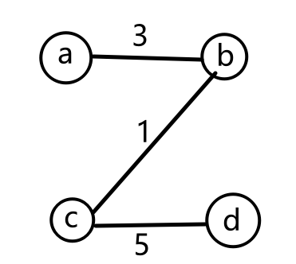{ width="200" }
        </figure>
        
        $S = ab,\ cd$，$T = ab,\ bc,\ cd$，存在 $S \not ={T}$，A 错误

        **B 选项：**

        <figure markdown="span">
            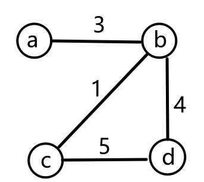{ width="200" }
        </figure>

        $S = ab,\ bd,\ cd$，$T = ab,\ bd,\ cd$，存在 $S = T$，B 错误

        **C 选项：**

        虽然答案是 C 选项，但其实 C 选项写反了，应该是 w(S)≥w(T)/2

        > 但是证明我是不会证的

## 6 Traveling Salesman Problem

### 满足三角不等式的旅行商问题

```c linenums="1" title="近似算法（输入无向图 G 和满足三角不等式的代价函数 c）"
select a vertex r∈G.V to be a "root" vertex
compute a minimum spanning tree T for G from root r
    using MST-PRIM(G,c,r)
let H be a list of vertices, ordered according to when they are first visited
    in a preorder tree walk of T
return the hamiltonian cycle H
```

!!! note "定理"

    此算法是一个用于解决满足三角不等式的旅行商问题的多项式时间 2-approximation algorithm

    ??? success "证明"

        <figure markdown="span">
            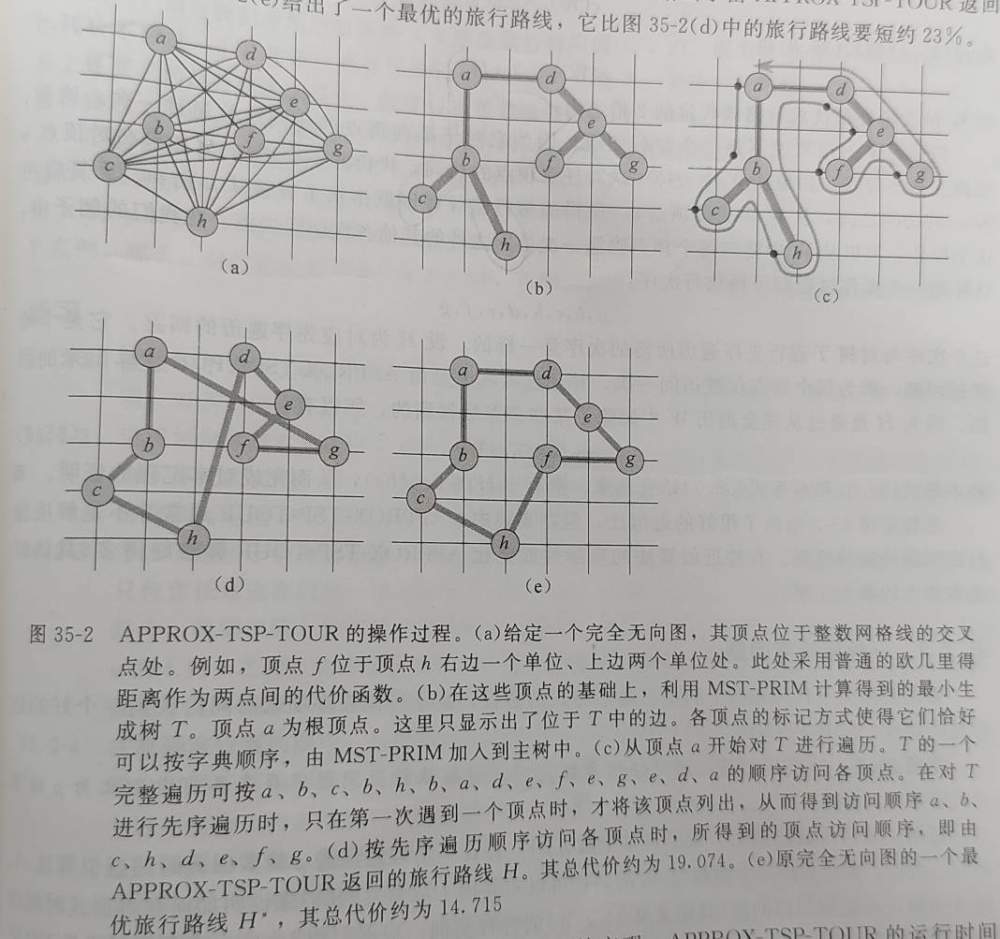{ width="600" }
        </figure>

        > 请结合此图理解证明过程
        
        设 $H^*$ 表示在给定顶点集合上的一个最优旅行路线。我们通过删除一个旅行路线中的任一条边而得到生成树，并且每条边的代价都是非负的。因此，由第2行得到的最小生成树 $T$ 的权值是最优旅行路线代价的一个下界：
        
        $$
        c(T) \leqslant c(H^*)
        $$

        对 $T$ 进行完全遍历时，在初次访问一个顶点时输出该顶点，并且在访问一棵子树返回后输出该顶点。我们称这个遍历为 $W$。对例子中的树进行完全遍历，得到次序 $a,b,c,b,h,b,a,d,e,f,e,g,e,d,a$ 因为该完全遍历恰经过了 $T$ 的每条边两次，所以有：

        $$
        c(W) = 2c(T)
        $$
        
        可得：

        $$
        c(W) \leqslant 2c(H^*)
        $$
        
        即 $W$ 的代价在最优旅行路线代价的 2 倍之内。
        但是，$W$ 一般来说不是一个旅行路线，因为它对于某些顶点的访问次数超过一次。然而，根据三角不等式，如果从 $W$ 中去掉一次对任意顶点的访问，代价并不会增加.反复应用这个操作，可以从 $W$ 中将对每个顶点除第一次访问之外的其他各次访问去掉。在我们的例子中，这样的一个操作过程即可得旅行次序 $a,b,c,h,d,e,f,g$ 这个次序与对树 $T $进行 **先序遍历** 所得的次序是一样的，设 $H$ 为对应先序遍历的回路。它是个哈密顿回路，因为每个顶点仅被访问一次，并且它实际上是由此算法计算出来的回路。因为 $H$ 是通过从完全遍历 $W$ 中删除了某些顶点后得到的，所以有：

        $$
        c(H) \leqslant c(W)
        $$

        则有 $c(H) \leqslant 2c(H^*)$

???+ question "PTA 11.4"

    Assume that you are a real world Chinese postman, which have learned an awesome course "Advanced Data Structures and Algorithm Analysis" (ADS). Given a 2-dimensional map indicating N positions $p_i(x_i,y_i)$ of your post office and all the addresses you must visit, you'd like to find a shortest path starting and finishing both at your post office, and visit all the addresses at least once in the circuit. Fortunately, you have a magic item "Bamboo copter & Hopter" from "Doraemon", which makes sure that you can fly between two positions using the directed distance (or displacement).

    However, reviewing the knowledge in the ADS course, it is an NPC problem! Wasting too much time in finding the shortest path is unwise, so you decide to design a 2−approximation algorithm as follows, to achieve an acceptable solution.

    ```
    Compute a minimum spanning tree T connecting all the addresses.
    Regard the post office as the root of T.
    Start at the post office.
    Visit the addresses in order of a _____ of T.
    Finish at the post office.
    ```

    There are several methods of traversal which can be filled in the blank of the above algorithm. Assume that P≠NP, how many methods of traversal listed below can fulfill the requirement?

    - Level-Order Traversal
    - Pre-Order Traversal
    - Post-Order Traversal

    A. 0<br/>
    B. 1<br/>
    C. 2<br/>
    D. 3

    ??? success "答案"

        C

        ---

        上面的定理证明说明 Preorder 是符合的。然后我感觉 Postorder 也是符合的，但是不会证

### 一般旅行商问题

!!! note "定理"

    如果 $P \not ={NP}$，则对任何常数 $\rho \geqslant 1$，一般旅行商问题不存在具有近似比为 $\rho$ 的多项式时间近似算法
