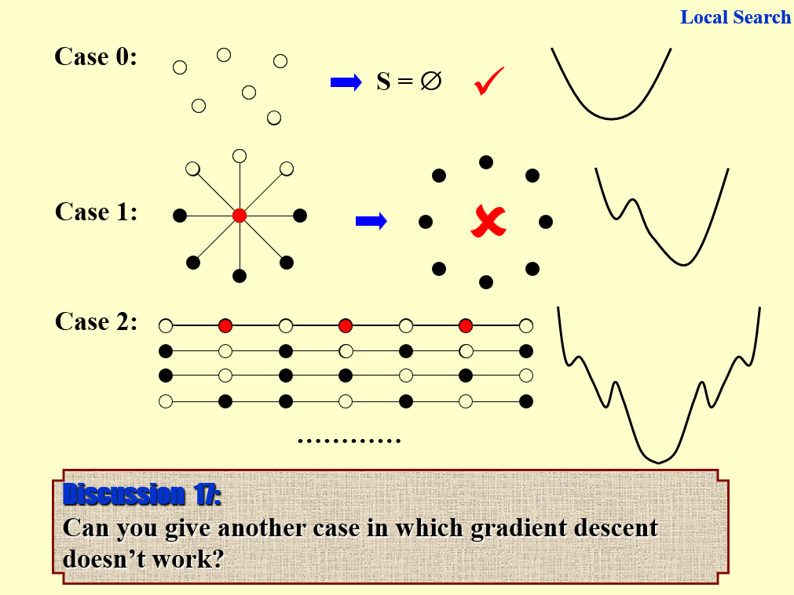
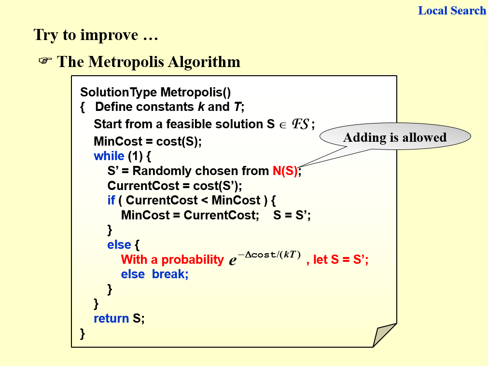

# 12 Local Search

!!! tip "说明"

    此文档正在更新中……

!!! info "说明"

    本文档只涉及部分知识点，仅可用来复习重点知识

局部搜索能够找到局部最优解，但不一定是全局最优解

> 有点深度学习中梯度下降的感觉

<figure markdown="span">
    { width="600" }
</figure>

先随机选取一个点，并在其 neighborhood 的当中找到更好的解并更新，直到找不到为止

## 1 Vertex Cover Problem

从 S = V 开始，不断删除一个 node 并检查 S’ 是否满足条件

<figure markdown="span">
    { width="600" }
</figure>

找到的解是局部最优解，不一定是全局最优解

<figure markdown="span">
    { width="600" }
</figure>

尝试跳出局部最优解

## 2 Hopfield Neural Networks

<figure markdown="span">
    { width="600" }
</figure>

<figure markdown="span">
    { width="600" }
</figure>

不断翻转 unstable 的 node

<figure markdown="span">
    { width="600" }
</figure>

???+ question "PTA 12.1"

    For the graph given in the following figure, if we start from deleting the black vertex, then local search can always find the minimum vertex cover. 

    <figure markdown="span">
        { width="100" }
    </figure>

    T<br/>F

    ???+ success "答案"

## 3 Maximum Cut Problem

属于 NP-hard

<figure markdown="span">
    { width="600" }
</figure>

local search：

<figure markdown="span">
    { width="600" }
</figure>

greedy algorithm：

<figure markdown="span">
    { width="600" }
</figure>

<figure markdown="span">
    { width="600" }
</figure>

???+ question "PTA 12.2"

    We are given a set of sites $S = \lbrace s_1,s_2,\cdots,s_n \rbrace$ in the plane, and we want to choose a set of k centers $C = \lbrace c_1,c_2,\cdots,c_k \rbrace$ so that the maximum distance from a site to the nearest center is minimized. Here $c_i$ can be an arbitrary point in the plane. 

    A local search algorithm arbitrarily choose k points in the plane to be the centers, then

    (1) divide S into k sets, where $S_i$ is the set of all sites for which $c_i$ is the nearest center; and

    (2) for each $S_i$, compute the central position as a new center for all the sites in $S_i$

    If steps (1) and (2) cause the covering radius to strictly decrease, we perform another iteration, otherwise the algorithm stops. 
    
    When the above local search algorithm terminates, the covering radius of its solution is at most 2 times the optimal covering radius. 

    T<br/>F

    ???+ success "答案"

???+ question "PTA 12.3"

    Local search algorithm can be used to solve lots of classic problems, such as SAT and N-Queen problems.  Define the configuration of SAT to be X = vector of assignments of N boolean variables, and that of N-Queen to be Y =  positions of the N queens in each column.  The sizes of the search spaces of SAT and N-Queen are $O(2^N)$ and $O(N^N)$, respectively.  

    T<br/>F

    ???+ success "答案"

???+ question "PTA 12.4"

    Spanning Tree Problem: Given an undirected graph G=(V,E), where ∣V∣=n and ∣E∣=m. Let F be the set of all spanning trees of G. Define d(u) to be the degree of a vertex u∈V. Define w(e) to be the weight of an edge e∈E.
    
    We have the following three variants of spanning tree problems:

    (1) Max Leaf Spanning Tree: find a spanning tree T∈F with a maximum number of leaves.
    (2) Minimum Spanning Tree: find a spanning tree T∈F with a minimum total weight of all the edges in T.
    (3) Minimum Degree Spanning Tree: find a spanning tree T∈F such that its maximum degree of all the vertices is the smallest.
    For a pair of edges $(e,e')$where e∈T and e'∈(G−T) such that e belongs to the unique cycle of T∪e', we define edge-swap(e,e') to be (T−e)∪e'

    Here is a local search algorithm:

    ```c linenums="1"
    T = any spanning tree in F;
    while (there is an edge-swap(e, e') which reduces Cost(T)) {
        T = T - e + e';
    }
    return T;
    ```
    
    Here Cost(T) is the number of leaves in T in Max Leaf Spanning Tree; or is the total weight of T in Minimum Spanning Tree; or else is the minimum degree of T in Minimum Degree Spanning Tree.

    Which of the following statements is TRUE?

    A. The local search always return an optimal solution for Max Leaf Spanning Tree<br/>
    B. The local search always return an optimal solution for Minimum Spanning Tree<br/>
    C. The local search always return an optimal solution for Minimum Degree Spanning Tree<br/>
    D. For neither of the problems that this local search always return an optimal solution
    
    ???+ success "答案"

???+ question "PTA 12.5"

    There are n jobs, and each job j has a processing time $t_j$. We will use a local search algorithm to partition the jobs into two groups A and B, where set A is assigned to machine $M_1$ and set B to $M_2$. The time needed to process all of the jobs on the two machines is $T_1 = \sum_{j \in A} t_j, T_2 = \sum_{j \in B} t_j$. The problem is to minimize $|T_1 - T_2|$

    Local search: Start by assigning jobs 1,…,n/2 to $M_1$, and the rest to $M_2$.

    The local moves are to move a single job from one machine to the other, and we only move a job if the move decreases the absolute difference in the processing times. Which of the following statement is true?

    A. The problem is NP-hard and the local search algorithm will not terminate.<br/>
    B. When there are many candidate jobs that can be moved to reduce the absolute difference, if we always move the job j with maximum $t_j$, then the local search terminates in at most n moves.<br/>
    C. The local search algorithm always returns an optimal solution.<br/>
    D. The local search algorithm always returns a local solution with $\dfrac{1}{2}T_1 \leqslant T_2 \leqslant 2T_1$.
    
    ???+ success "答案"

???+ question "PTA 12.5"

    Max-cut problem: Given an undirected graph G=(V,E) with positive integer edge weights $w_e$, find a node partition (A,B) such that w(A,B), the total weight of edges crossing the cut, is maximized.  Let us define S′ be the neighbor of S such that S′ can be obtained from S by moving one node from A to B, or one from B to A. We only choose a node which, when flipped, increases the cut value by at least w(A,B)/∣V∣. Then which of the following is true?

    A. Upon the termination of the algorithm,  the algorithm returns a cut (A,B) so that $2.5w(A,B) \geqslant w(A^*, B^*)$ where $(A^*, B^*)$ is an optimal partition.<br/>
    B. The algorithm terminates after at most O(log∣V∣logW) flips, where W is the total weight of edges.<br/>
    C. Upon the termination of the algorithm, the algorithm returns a cut (A,B) so that $2w(A,B) \geqslant w(A^*,B^*)$<br/>
    D. The algorithm terminates after at most $O(|V|^2)$ flips.

    ???+ success "答案"