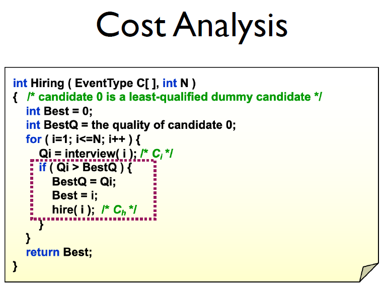
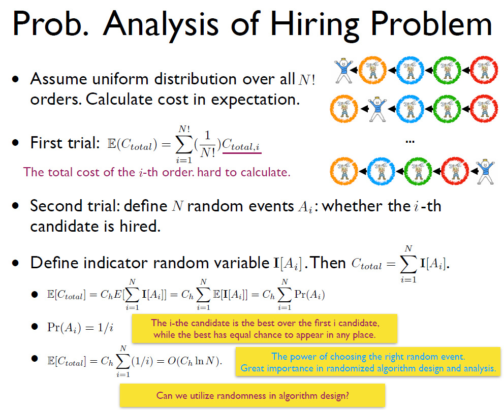
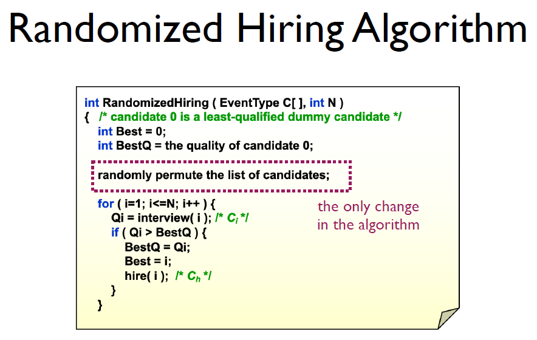
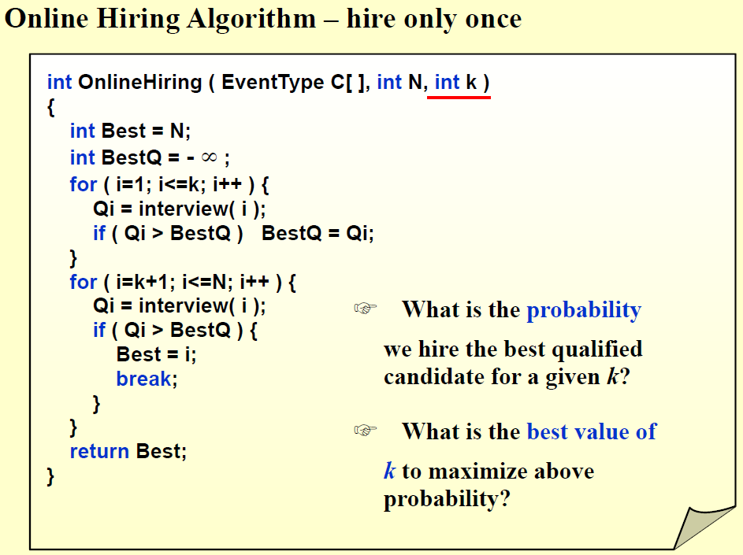
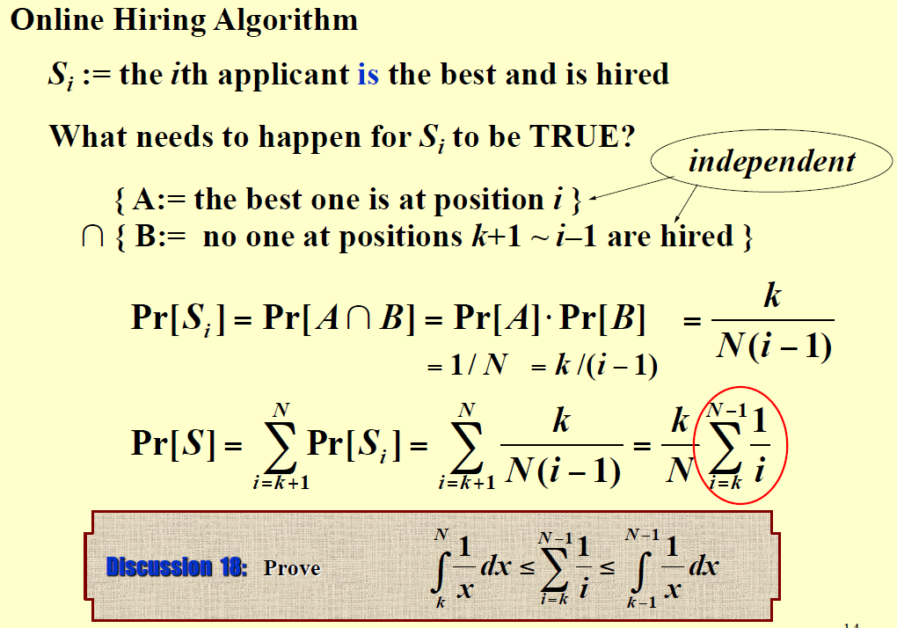
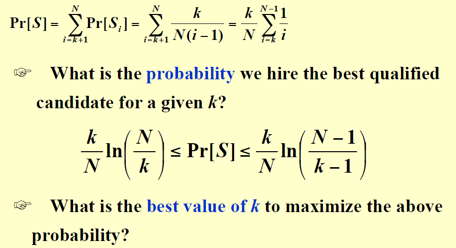
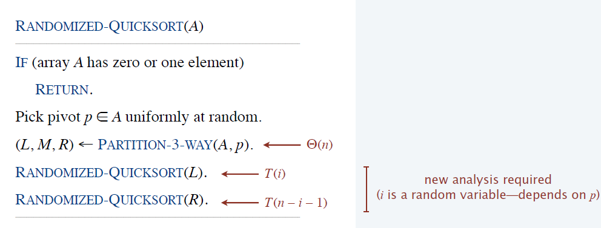
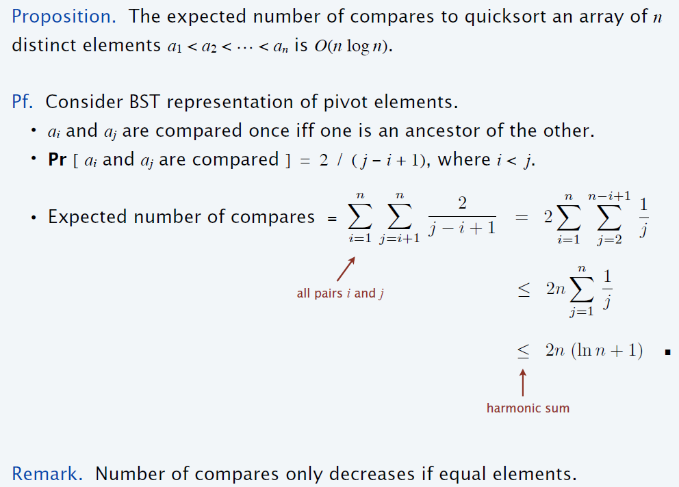
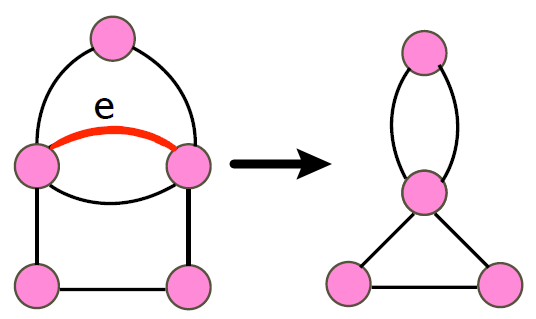
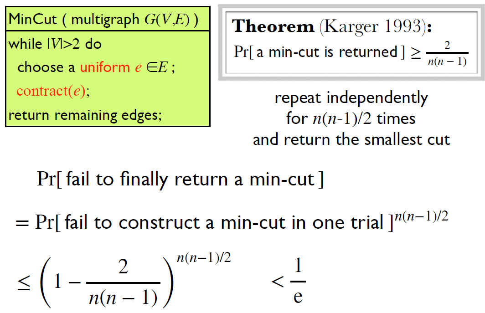

# 13 Randomized Algorithms

!!! tip "说明"

    此文档正在更新中……

!!! info "说明"

    本文档只涉及部分知识点，仅可用来复习重点知识

## 1 Hiring Problem

<figure markdown="span">
    { width="600" }
</figure>

<figure markdown="span">
    { width="600" }
</figure>

<figure markdown="span">
    { width="600" }
</figure>

## Online Hiring Algorithm

<figure markdown="span">
    { width="600" }
</figure>

<figure markdown="span">
    { width="600" }
</figure>

<figure markdown="span">
    { width="600" }
</figure>

让上述概率最大的 k 值取 $\dfrac{N}{e} \approx \dfrac{N}{3}$

???+ question "PTA 13.4"

    The Online Hiring Algorithm ( hire only once ) is described as the following:

    ```c linenums="1"
    int OnlineHiring ( EventType C[ ], int N, int k )
    {
        int Best = N;
        int BestQ = -INFINITY ;
        for ( i=1; i<=k; i++ ) {
            Qi = interview( i );
            if ( Qi > BestQ )   BestQ = Qi;
        }
        for ( i=k+1; i<=N; i++ ) {
            Qi = interview( i );
            if ( Qi > BestQ ) {
                Best = i;
                break;
            }
        }
        return Best;
    }
    ```
    
    A. 1/e<br/>
    B. 1/N<br/>
    C. $1/3$<br/>
    D. 1/k

    ??? success "答案"

## 2 Randomized quicksort

<figure markdown="span">
    { width="600" }
</figure>

<figure markdown="span">
    { width="600" }
</figure>

???+ question "PTA 13.1"

    Let $a = (a_1, a_2, \cdots, a_i, \cdots, a_l, \cdots, a_n)$ denote the list of elements we want to sort. In the quicksort algorithm, if the pivot is selected uniformly at random. Then any two elements get compared at most once and the probability of $a_i$ and $a_j$ being compared is 2/(j−i+1) for j>i, given that $a_i$ or $a_j$ is selected as the pivot. 

    T<br/>F

    ??? success "答案"

???+ question "PTA 13.2"

    Reviewing the randomized QuickSort in our course, we always select a central splitter as a pivot before recursions, make sure that each side contains at least n/4 elements. Hence, differing from the deterministic QuickSort, the worst case expected running time of the randomized QuickSort is Θ(NlogN).   

    T<br/>F

    ??? success "答案"

## 3 Cut Problem

### 3.1 Min-Cut

Contraction:

<figure markdown="span">
    { width="600" }
</figure>

<figure markdown="span">
    { width="600" }
</figure>

## 3.2 Max-Cut

???+ question "PTA 13.3"

    Given a linked list containg N nodes.  Our task is to remove all the nodes. At each step, we randomly choose one node in the current list, then delete the selected node together with all the nodes after it. Here we assume that each time we choose one node uniformly among all the remaining nodes. What is the expected number of steps to remove all the nodes?

    A. Θ(logN)<br/>
    B. N/e<br/>
    C. N/2<br/>
    D. N
    
    ??? success "答案"