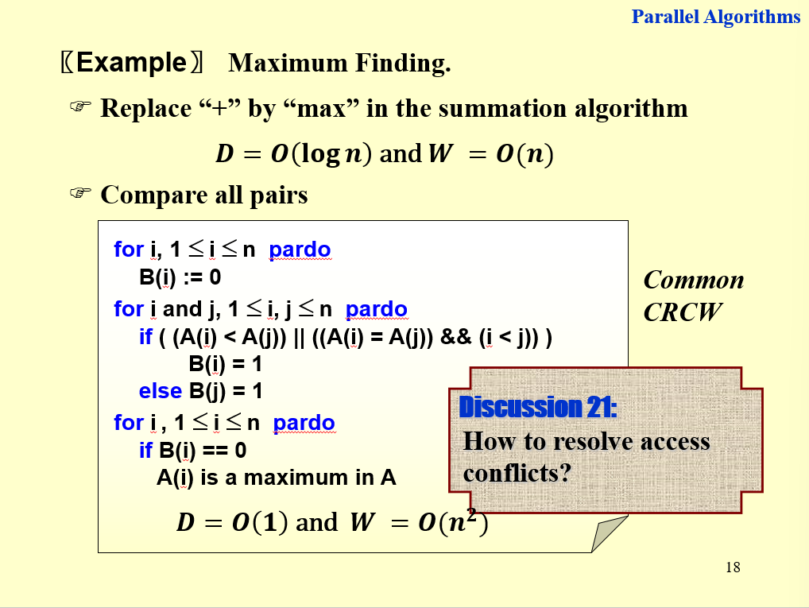

# 14 Parallel Algorithms

!!! tip "说明"

    此文档正在更新中……

!!! info "说明"

    本文档只涉及部分知识点，仅可用来复习重点知识

1. Parallel Random Access Machine (PRAM)
2. Work-depth measurement

## 1 The summation problem

<figure markdown="span">
    { width="600" }
</figure>

<figure markdown="span">
    { width="600" }
</figure>

在 Work-depth measurement 中，定义

$$
W = T_1 = \Theta(n)\\
D = T_{\infty} = \Theta(\log n)
$$

在此问题中，W 等于树中节点总数即 n，D 等于树的高度即 $\log n$

!!! note "Brent's theorem"

    下界：$\dfrac{W}{p} \leqslant T_p$

    上界：$T_p \leqslant \dfrac{W}{p} + D$

在此问题中，$\Theta(\dfrac{n}{p}) \leqslant T_p \leqslant \Theta(\dfrac{n}{p} + \log n)$

!!! question "PTA 14.3"

    To evaluate the sum of a sequence of 16 numbers by the parallel algorithm with Balanced Binary Trees, B(1,6) is found before B(2,1).

    T<br/>F

    ??? success "答案"

## 2 Prefix-Sums

<figure markdown="span">
    { width="600" }
</figure>

<figure markdown="span">
    { width="600" }
</figure>

!!! question "PTA 14.2"

    To evaluate the Prefix-Sums of a sequence of 16 numbers by the parallel algorithm with Balanced Binary Trees, C(4,1) is found before C(2,2).

    T<br/>F

    ??? success "答案"

!!! question "PTA 14.6"

    The prefix-min problem is to find for each i, 1≤i≤n, the smallest element among A(1), A(2), ⋯, A(i).  What is the run time and work load for the following algorithm?

    ```c linenums="1"
    for i, 1≤i≤n pardo
      B(0, i) = A(i)
    for h=1 to log(n)
      for i, 1≤i≤n/2^h pardo
        B(h, i) = min {B(h-1, 2i-1), B(h-1, 2i)}
    for h=log(n) to 0
      for i even, 1≤i≤n/2^h pardo
        C(h, i) = C(h+1, i/2)
      for i=1 pardo
        C(h, 1) = B(h, 1)
      for i odd, 3≤i≤n/2^h pardo
        C(h, i) = min {C(h + 1, (i - 1)/2), B(h, i)}
    for i, 1≤i≤n pardo
      Output C(0, i)
    ```
    
    A. O(n), O(n)<br/>
    B. O(logn), O(logn)<br/>
    C. O(logn), O(n)<br/>
    D. O(n), O(logn)
    
    ??? success "答案"

## 3 Merge two non-decreasing arrays

<figure markdown="span">
    { width="600" }
</figure>

<figure markdown="span">
    { width="600" }
</figure>

<figure markdown="span">
    { width="600" }
</figure>

<figure markdown="span">
    { width="600" }
</figure>

!!! question "PTA 14.9"

    Which one of the following statements about the Ranking problem is true? (Assume that both arrays contain N elements.)

    A. There exists a serial algorithm with time complexity being O(logN).<br/>
    B. Parallel binary search algorithm can solve the problem in O(1) time.<br/>
    C. When partitioning the problem into sub-problems and solving them in parallel, choosing loglogN as the size of each sub-problem can reduce the work load and the worst-case time complexity to O(logN).<br/>
    D. There is a parallel algorithm that can run in O(logN) time and O(N) work.

    ??? success "答案"

## 4 Maximum finding

<figure markdown="span">
    { width="600" }
</figure>

<figure markdown="span">
    { width="600" }
</figure>

<figure markdown="span">
    { width="600" }
</figure>

<figure markdown="span">
    { width="600" }
</figure>

<figure markdown="span">
    { width="600" }
</figure>

!!! question "PTA 14.4"

    In order to solve the maximum finding problem by a parallel  algorithm  with T(n)=O(1) , we need work load $W(n)=Ω(n^2)$ in return.

    T<br/>F

    ??? success "答案"

!!! question "PTA 14.5"

    To solve the Maximum Finding problem with parallel Random Sampling method, O(n) processors are required to get T(n)=O(1) and W(n)=O(n) with very high probability.   

    T<br/>F

    ??? success "答案"

!!! question "PTA 14.7"

    Which one of the following statements about the Maximum Finding problem is true?
    
    A. There exists a serial algorithm with time complexity being O(logN).<br/>
    B. No parallel algorithm can solve the problem in O(1) time.<br/>
    C. When partitioning the problem into sub-problems and solving them in parallel, compared with $\sqrt{N}$, choosing loglogN as the size of each sub-problem can reduce the work load and the worst-case time complexity.<br/>
    D. Parallel random sampling algorithm can run in O(1) time and O(N) work with very high probability.
    
    ??? success "答案"

!!! question "PTA 14.1"

    While comparing a serial algorithm with its parallel counterpart, we just concentrate on reducing the work load.   

    T<br/>F

    ??? success "答案"

!!! question "PTA 14.8"

    Sorting-by-merging is a classic serial algorithm.  It can be translated directly into a reasonably efficient parallel algorithm. A recursive description follows.

    MERGE−SORT( A(1), A(2), ..., A(n); B(1), B(2), ..., B(n) )
    
    Assume that $n = 2^l$ for some integer l≥0
    
    if n = 1 then return B(1) := A(1)
    
    else call, in parallel, MERGE−SORT( A(1), ..., A(n/2); C(1), ..., C(n/2) ) and
    
    - MERGE−SORT(A(n/2+1), ..., A(n); C(n/2+1), ..., C(n) )
    - Merge (C(1),...C(n/2)) and (C(n/2 + 1),...,C(n)) into (B(1), B(2), ..., B(n)) with time O(n)
    
    Then the MERGE−SORT runs in __ .
    
    A. O(nlogn) work and $O(\log^2 n)$ time<br/>
    B. O(nlogn) work and O(logn) time<br/>
    C. $O(n\log^2 n)$ work and $O(\log^2 n)$ time<br/>
    D. $O(n\log^2 n)$ work and O(logn) time
    
    ??? success "答案"