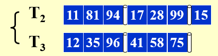
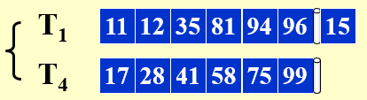
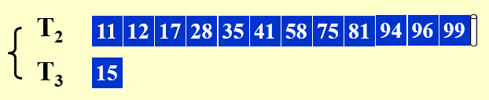
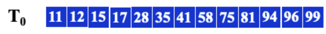
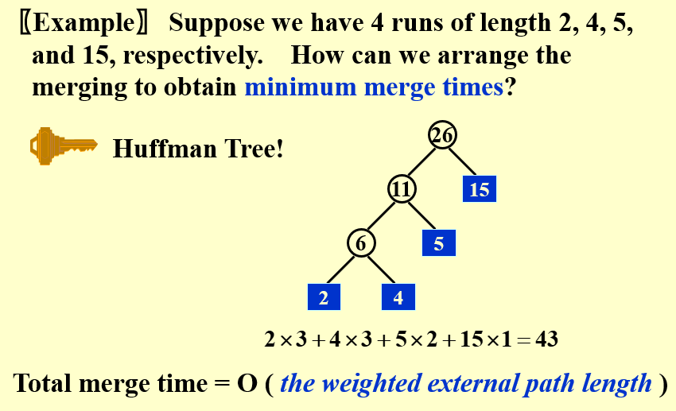
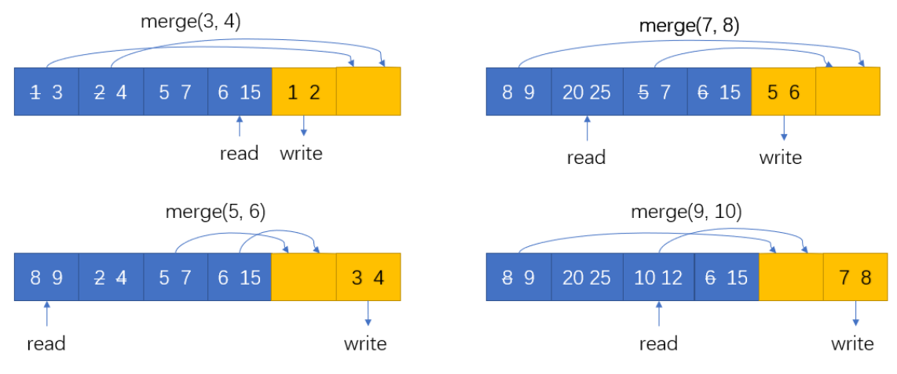

# 15 External Sorting

<!-- !!! tip "说明"

    此文档正在更新中…… -->

!!! info "说明"

    1. 本文档只涉及部分知识点，仅可用来复习重点知识
    2. 本文档部分图片来源于教学课件

假设内存一次只能处理 M = 3 个单位的数据

<figure markdown="span">
    { width="600" }
</figure>

k-way merge：将 k 个有序序列合并为 1 个有序序列。这里的有序序列被称为 run，而将 $k·c$ 个 run 合并成 $c$ 个 run 的过程，称为 1 个 pass

Pass 1：2-way merge，将 $T_1$ 的 5 段数据均分到两条 tape 上

<figure markdown="span">
    { width="600" }
</figure>

Pass 2：

<figure markdown="span">
    { width="600" }
</figure>

Pass 3：

<figure markdown="span">
    { width="600" }
</figure>

Pass 4：

<figure markdown="span">
    { width="600" }
</figure>

$number\ of\ passes\ = 1 + \lceil \log_k \dfrac{N}{M} \rceil$

使用 k-way merge 至少需要 2k 个 tape

???+ question "PTA 15.4"

    Given 100,000,000 records of 256 bytes each, and the size of the internal memory is 128MB.  If simple 2-way merges are used, how many passes do we have to do?

    A. 10 
    B. 9 
    C. 8 
    D. 7

    ??? success "答案"

        B

        ---

        $M = 2^{27} B, N = 10^{8} \times 2^8$

        $pass = 1 + \lceil \log_2 \dfrac{10^8 \times 2^8}{2^{27}} \rceil = 9$

## 减少 pass 的数量

增加 k 可以减少 pass 的数量

采用 Replacement Selection

???+ question "PTA 15.2"

    In external sorting, a k-way merging is usually used in order to reduce the number of passes and we will take the k as large as possible as long as we have enough amount of tapes. 

    T F

    ??? success "答案"

        F

        ---

        k 过大时，硬件错误率会上升

???+ question "PTA 15.6"

    In external sorting, in order to reduce the number of passes, minimizing the initial number of runs (i.e. generating longer runs ) is a good idea. Suppose the input record keys are (25, 74, 56, 34, 21, 11, 29, 80, 38, 53) and the internal memery can hold only 3 records, the minimum number of initial runs obtained by replacement selection is__ 。

    A. 1 
    B. 2 
    C. 3 
    D. 4

    ??? success "答案"

        2

        ---

        run1: 25 34 56 74

        run2: 11 21 29 38 53 80

???+ question "PTA 15.8"

    Suppose that the replacement selection is applied to generate longer runs with a priority queue of size 4. Given the sequence of numbers { 9, 75, 17, 12, 88, 91, 25, 22, 35, 41, 58, 96, 15 }.  Which of the following gives the second output run?

    A. 22 35 88 91 
    B. 22 35 41 58 88 91 96 
    C. 22 35 41 58 96 
    D. 22 35 41 58

    ??? success "答案"

        C

        ---

        run1: 9 12 17 25 75 88 91

        run2: 22 35 41 58 96

        run3: 15

## 减少 tape 的数量

如果 run 的数量是某个斐波那契数 $F_N$，那么最好的方法就是分成 $F_{N-1}$ 和 $F_{N-2}$ 两个 runs

对于 k-way merge，$F_N^k = F_{N-1}^k + \cdots F_{N-k}^k,\ F_N^k = 0(0\leqslant N \leqslant k-2),\ F_{k-1}^k = 1$

只需要 k + 1 个 tapes

假设 $T_1$ 有 34 个 runs 需要 merge，若采用 2-way merge，首先将其拆分成 21 和 13 两段

| $T_1$ | $T_2$ | $T_3$ | 说明 |
| :--: | :--: | :--: | :-- |
| 21 | 13 | - | |
| 8 | - | 13 | $T_1$ 的前 13 个 run 与 $T_2$ 合并，写入 $T_3$ |
| - | 8 | 5 | $T_3$ 的前 8 个 run 与 $T_1$ 合并，写入 $T_2$ |
| 5 | 3 | - | |
| 2 | - | 3 | |
| - | 2 | 1 | |
| 1 | 1 | - | |
| - | - | 1 | |

???+ question "PTA 15.1"

    To merge 55 runs using 3 tapes for a 2-way merge, the original distribution (34, 21) is better than (27, 28).

    T F

    ??? success "答案"

        T

        ---

        分成斐波那契数列最优

## k-way 内排序优化

可使用 Huffman 树

<figure markdown="span">
    { width="600" }
</figure>

???+ question "PTA 15.5"

    In external sorting, suppose we have 5 runs of lengths 2, 8, 9, 5, and 3, respectively.  Which of the following merging orders can obtain the minimum merge time?

    A. merge runs of lengths 2 and 3 to obtain Run#1; merge Run#1 with the one of length 5 to obtain Run#2; merge Run#2 with the one of length 8 to obtain Run#3; merge Run#3 with the one of length 9 
    B. merge runs of lengths 2 and 3 to obtain Run#1; merge Run#1 with the one of length 5 to obtain Run#2; merge runs of lengths 8 and 9 to obtain Run#3; merge Run#2 and Run#3 
    C. merge runs of lengths 2 and 3 to obtain Run#1; merge runs of lengths 5 and 8 to obtain Run#2; merge Run#1 and Run#2 to obtain Run#3; merge Run#3 with the one of length 9 
    D. merge runs of lengths 2 and 3 to obtain Run#1; merge runs of lengths 5 and 8 to obtain Run#2; merge Run#2 with the one of length 9 to obtain Run#3; merge Run#1 and Run#3

    ??? success "答案"

        B

        ---

        使用 huffman 树的策略即可

## 并行

通常对于 k-way merge，我们需要 2k 个 input buffers 和 2 个 output buffer

???+ question "PTA 15.3"

    In general, for a 3-way merge we need 6 input buffers and 2 output buffers for parallel operations.

    T F

    ??? success "答案"

        T

        ---

        见上面的结论

???+ question "PTA 15.7"

    Suppose we have the internal memory that can handle 12 numbers at a time, and the following two runs on the tapes:

    Run 1: 1, 3, 5, 7, 8, 9, 10, 12
    
    Run 2: 2, 4, 6, 15, 20, 25, 30, 32
    
    Use 2-way merge with 4 input buffers and 2 output buffers for parallel operations.  Which of the following three operations are NOT done in parallel?

    A. 1 and 2 are written onto the third tape; 3 and 4 are merged into an output buffer; 6 and 15 are read into an input buffer 
    B. 3 and 4 are written onto the third tape; 5 and 6 are merged into an output buffer; 8 and 9 are read into an input buffer 
    C. 5 and 6 are written onto the third tape; 7 and 8 are merged into an output buffer; 20 and 25 are read into an input buffer 
    D. 7 and 8 are written onto the third tape; 9 and 15 are merged into an output buffer; 10 and 12 are read into an input buffer

    ??? success "答案"

        D

        ---

        <figure markdown="span">
            { width="600" }
        </figure>

        > [图片来源](https://zhoutimemachine.github.io/note/courses/ads-hw-review/#hw15){:target="_blank"}