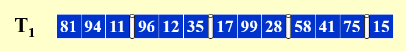

# 15 External Sorting

!!! tip "说明"

    此文档正在更新中……

!!! info "说明"

    本文档只涉及部分知识点，仅可用来复习重点知识

假设内存一次只能处理 M = 3 个单位的数据

<figure markdown="span">
    { width="600" }
</figure>

k-way merge：将 k 个有序序列合并为 1 个有序序列。这里的有序序列被称为 run，而将 $k·c$ 个 run 合并成 $c$ 个 run 的过程，称为 1 个 pass

Pass 1：2-way merge，将 $T_1$ 的 5 段数据均分到两条 tape 上

<figure markdown="span">
    { width="600" }
</figure>

Pass 2：

<figure markdown="span">
    { width="600" }
</figure>

Pass 3：

<figure markdown="span">
    { width="600" }
</figure>

Pass 4：

<figure markdown="span">
    { width="600" }
</figure>

$number\ of\ passes\ = 1 + \lceil \log_k \dfrac{N}{M} \rceil$

使用 k-way merge 至少需要 2k 个 tape

## 减少 pass 的数量

增加 k 可以减少 pass 的数量

采用 Replacement Selection

## 减少 tape 的数量

如果 run 的数量是某个斐波那契数 $F_N$，那么最好的方法就是分成 $F_{N-1}$ 和 $F_{N-2}$ 两个 runs

对于 k-way merge，$F_N^k = F_{N-1}^k + \cdots F_{N-k}^k,\ F_N^k = 0(0\leqslant N \leqslant k-2),\ F_{k-1}^k = 1$

只需要 k + 1 个 tapes

假设 $T_1$ 有 34 个 runs 需要 merge，若采用 2-way merge，首先将其拆分成 21 和 13 两段

| $T_1$ | $T_2$ | $T_3$ | 说明 |
| :--: | :--: | :--: | :-- |
| 21 | 13 | - | |
| 8 | - | 13 | $T_1$ 的前 13 个 run 与 $T_2$ 合并，写入 $T_3$ |
| - | 8 | 5 | $T_3$ 的前 8 个 run 与 $T_1$ 合并，写入 $T_2$ |
| 5 | 3 | - | |
| 2 | - | 3 | |
| - | 2 | 1 | |
| 1 | 1 | - | |
| - | - | 1 | |

## k-way 内排序优化

可使用 Huffman 树

<figure markdown="span">
    { width="600" }
</figure>

## 并行

通常对于 k-way merge，我们需要 2k 个 input buffers 和 2 个 output buffer