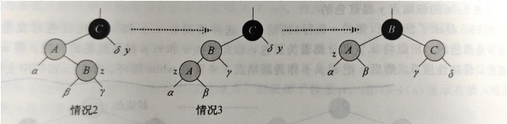
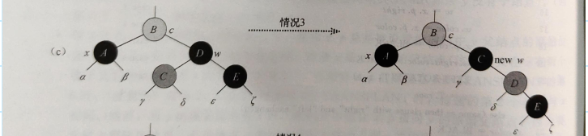

# 2 Red-Black Trees and B+ Trees

!!! tip "说明"

    此文档正在更新中……

!!! info "说明"

    本文档只涉及部分知识点，仅可用来复习重点知识

## 1 Red-Black Trees

### 定义

Red-Black tree 是一个 binary search tree，且满足以下性质：

1. 每个结点是 red 或 black
2. 根结点是 black
3. 每个叶结点（NIL）是 black
4. 如果一个结点是 red，则它的两个 children 都是 black
5. 对于每个结点，从一个结点到其 descendant 的所有叶结点的路径包含相同数量的 black 结点

<figure markdown="span">
    { width="400" }
</figure>

<figure markdown="span">
    { width="500" }
</figure>

!!! tip "引理"

    一棵有 n 个内部结点的红黑树的高度至多为 $2\lg (n + 1)$

### insertion

!!! tip "insertion 口诀"

    三红变色，二红旋转

==总是将新结点插入到树的底部，且颜色为 red。若 3 种 case遇到 z 为整棵树的根结点，则将 z 变为黑色==

我们设新结点为 z，z.p 表示 z 的父结点

#### case 1 z 的叔结点 y 是红色的 （三红变色）

<figure markdown="span">
    { width="500" }
</figure>

**三红变色：** z, z.p, y 均为红色

1. 将 z.p 和 y 变为黑色，z.p.p 变为红色
2. 将 z.p.p 作为新结点 z

进入 case 1 / case 2 / case 3

#### case 2 z 的叔结点 y 是黑色的且 z 处于 zig-zag 状态

#### case 3 z 的叔结点 y 是黑色的且 z 处于 zig-zig 状态 （二红旋转）

<figure markdown="span">
    { width="500" }
</figure>

**二红旋转：** z, z.p 均为红色

1. case 2：可以直接 double rotation
2. case 3：single rotation

???+ question "PTA 2.1"

    In the red-black tree that results after successively inserting the keys 41; 38; 31; 12; 19; 8 into an initially empty red-black tree, which one of the following statements is FALSE?

    A. 38 is the root<br/>
    B. 19 and 41 are siblings, and they are both red<br/>
    C. 12 and 31 are siblings, and they are both black<br/>
    D. 8 is red

    ??? success "答案"

        B

        ---

        > 具体过程动画模拟：[Red/Black Tree Visualizations](https://www.cs.usfca.edu/~galles/visualization/RedBlack.html){:target="_blank"}

        <figure markdown="span">
            { width="500" }
        </figure>

        <figure markdown="span">
            { width="500" }
        </figure>

### deletion

设删除的结点是 x

<div class="annotate" markdown>

1. x degree 为 0 (1)：
      1. 若 x 是 red，直接删除，即将 x 设置为 NIL 即可
      2. 若 x 是 black，将 x 变为双黑色 (2) NIL，进行双黑处理
2. x degree 为 1：
    找到 x 的孩子 c
      1. 若 x 是 red 且 c 是 black，用 c 替换掉 x
      2. 若 x 是 black 且 c 是 red，用 c 替换掉 x 并变为 black
      3. 若 x 是 black 且 c 是 black，用 c 替换掉 x，并将 c 标记为双黑色结点，进行双黑处理，重新标记删除结点，将 c 标记为新的 x
3. x degree 为 2：
    找到 x 右子树中的最小值结点 y (3)
      1. 交换 x 与 y 的值，重新标记删除结点，将 y 标记为新的 x，进入情况 1 / 情况 2

</div>

1. x 的两个子结点都是 NIL，认为 x 的 degree 为 0
2. 若直接删除 x，x 所在的路径的 black 数量会 -1，不满足第 5 个性质，所以将其标记为双黑 NIL 结点，即黑度为 2，以保证性质 5
3. 默认找右子树的最小值，当然也可以找左子树的最大值，一些题目两种找法都会考到

---

**双黑处理**

==此时 x 一定为双黑结点.若 4 种 case 遇到 x 为整棵树的根结点，则直接将 x 褪去一重黑色，变为黒结点即可==

!!! tip "双黑处理口诀"

    颜色不同换兄弟，一家三黑要褪色，远子不红近子上位，远子为红父亲上位

#### case 1 x 的兄弟结点 w 是红色的（颜色不同换兄弟）

<figure markdown="span">
    { width="500" }
</figure>

> 黑结点为 black，深阴影为 red，浅阴影颜色两种都可以

**颜色不同换兄弟：** x 与 w 的颜色不同

1. w 和 x.p 改变颜色
2. w 旋转
3. x 的兄弟结点 w 更新

进入 case 2 / case 3 / case 4

#### case 2 x 的兄弟结点 w 是黑色的，而且 w 的两个子结点都是黑色的（一家三黑要褪色）

<figure markdown="span">
    { width="500" }
</figure>

> 黑结点为 black，深阴影为 red，浅阴影颜色两种都可以

**一家三黑要褪色：** w 和 w 的两个孩子都是黑色

1. x 和 w 褪去一重黑色（即双黑结点变黒结点，黒结点变红结点）
2. x.p 增加一重黑色（即红结点变黒结点，黒结点变双黑结点）
3. 更新 x 为 x.p

进入 case 2 / case 3 / case 4

#### case 3 x 的兄弟结点 w 是黑色的，w 的两个孩子，离 x 远的孩子是黑色的，离 x 近的孩子是红色的（远子不红近子上位）

<figure markdown="span">
    { width="500" }
</figure>

> 黑结点为 black，深阴影为 red，浅阴影颜色两种都可以

**远子不红近子上位：** w 的两个孩子，离 x 远的不是红色，则离 x 近的旋转

1. 近子变黑，w 变红
2. 近子结点旋转
3. x 的兄弟结点 w 更新

进入 case 4

#### case 4 x 的兄弟结点 w 是黑色的，w 的两个孩子，离 x 远的孩子是红色的（远子为红父亲上位）

<figure markdown="span">
    { width="500" }
</figure>

**远子为红父亲上位：** w 的两个孩子，离 x 远的是红色，则 w 旋转

1. w，远子，x.p 均变黑
2. w 结点旋转

???+ question "PTA 2.2"

    After deleting 15 from the red-black tree given in the figure, which one of the following statements must be FALSE?
    
    <figure markdown="span">
        { width="200" }
    </figure>

    A. 11 is the parent of 17, and 11 is black<br/>
    B. 17 is the parent of 11, and 11 is red<br/>
    C. 11 is the parent of 17, and 11 is red<br/>
    D. 17 is the parent of 11, and 17 is black

    ??? success "答案"

        C

        ---

        这道题就是上文所说的两种找法都考

        按照上文的规则：x degree 为 2

        <div class="grid" style="align-items: center;" markdown>

        <div>

        1.如果找右子树的最小：

        ```mermaid
        graph TD;
        a((10))
        b((7))
        c((17))
        d((5))
        e((11))
        a === b
        a === c
        b === d
        b === f[NIL]
        c === e
        c === g[NIL]
        style a fill: #9f9f9f
        style b fill: #9f9f9f
        style e fill: #9f9f9f
        style c fill: #fe0000
        style d fill: #fe0000
        ```

        </div>
        <div>

        2.如果找左子树的最大：

        ```mermaid
        graph TD;
        a((10))
        b((7))
        c((11))
        d((5))
        e((17))
        a === b
        a === c
        b === d
        b === f[NIL]
        c === g[NIL]
        c === e
        style a fill: #9f9f9f
        style b fill: #9f9f9f
        style e fill: #9f9f9f
        style c fill: #fe0000
        style d fill: #fe0000
        ```

        </div>

        </div>

        ---

        但这道题所用的规则是：

        <div class="grid" style="align-items: center;" markdown>

        <div>

        1.如果找右子树的最小：

        ```mermaid
        graph TD;
        a((10))
        b((7))
        c((17))
        d((5))
        e((11))
        a === b
        a === c
        b === d
        b === f[NIL]
        c === e
        c === g[NIL]
        style a fill: #9f9f9f
        style b fill: #9f9f9f
        style e fill: #fe0000
        style c fill: #9f9f9f
        style d fill: #fe0000
        ```

        B、D 正确

        </div>
        <div>

        2.如果找左子树的最大：

        ```mermaid
        graph TD;
        a((10))
        b((7))
        c((11))
        d((5))
        e((17))
        a === b
        a === c
        b === d
        b === f[NIL]
        c === g[NIL]
        c === e
        style a fill: #9f9f9f
        style b fill: #9f9f9f
        style e fill: #fe0000
        style c fill: #9f9f9f
        style d fill: #fe0000
        ```
    
        A 正确、C 错误

        </div>

        </div>

        > 上文的规则是万能规则，只不过这棵树结构简单，用的规则不一样而已