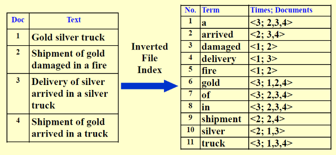
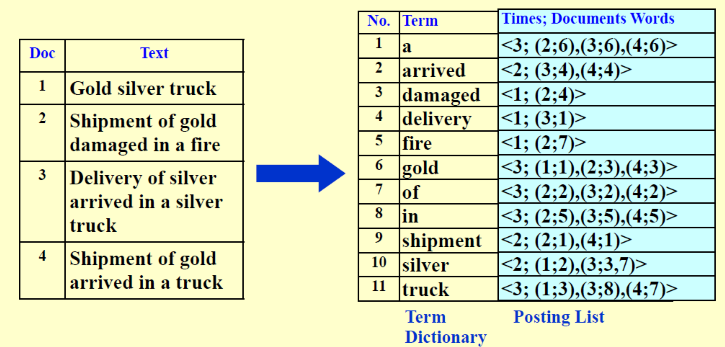
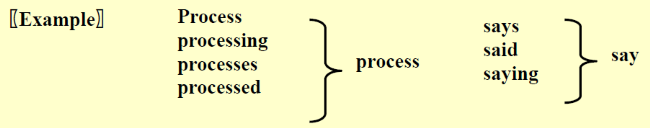
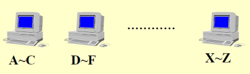
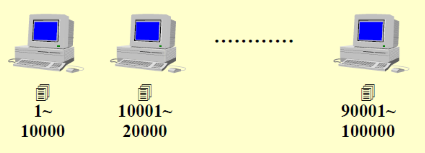
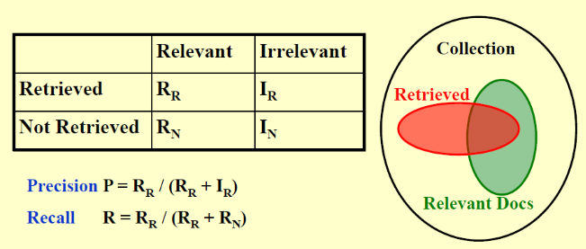
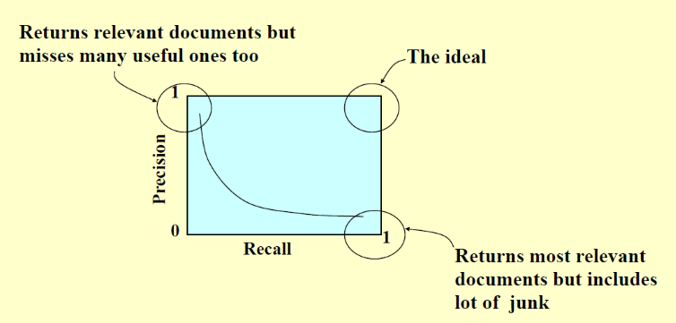

# 3 Inverted File Index

<!-- !!! tip "说明"

    此文档正在更新中…… -->

!!! info "说明"

    本文档只涉及部分知识点，仅可用来复习重点知识

## 定义

存储每个单词出现的次数，和出现过此单词的文档

<figure markdown="span">
    { width="600" }
</figure>

也可以存储单词在每个文档中的位置

<figure markdown="span">
    { width="600" }
</figure>

## word stemming

词干提取

处理单词时，只记录此单词的词干

<figure markdown="span">
    { width="600" }
</figure>

## stop words

停止词

一些单词非常常见，在搜索的过程中，这些单词对文档的选择作用不大，因此在倒排索引表中，不记录这些单词

## distributed indexing

### 1 term-partitioned index

<figure markdown="span">
    { width="600" }
</figure>

### 2 document-partitioned index

<figure markdown="span">
    { width="600" }
</figure>

## threshold

用户搜索后，根据某种规则将搜索到的文档排序，并只展示前 x 个文档给用户

## 搜索性能评估

1. 响应时间
2. 索引表大小
3. 文档相关性

### 相关性

<figure markdown="span">
    { width="600" }
</figure>

1. Precision 反映了在展示出的文档中，与用户搜索相关性大的文档的占比
2. Recall 反映了在与用户搜索相关性大的文档中，展示出的文档的占比

$$
Precision:\ P = \frac{R_R}{R_R + I_R}
$$

$$
Recall:\ R = \frac{R_R}{R_R + R_N}
$$

<figure markdown="span">
    { width="600" }
</figure>

1. Precision 大，Recall 小：展示给用户的文档相关性很大，但是也会漏掉其他有用的文档
2. Precision 小，Recall 大：展示给用户的文档中，相关性大的文档很多，但是也会包含很多没用的文档
3. Precision 大，Recall 大：理想情况

