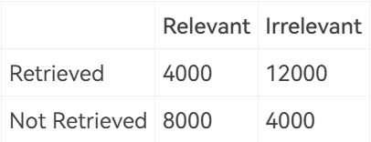

# 3 Inverted File Index

<!-- !!! tip "说明"

    此文档正在更新中…… -->

!!! info "说明"

    本文档只涉及部分知识点，仅可用来复习重点知识

## 定义

存储每个单词出现的次数，和出现过此单词的文档

<figure markdown="span">
    { width="600" }
</figure>

也可以存储单词在每个文档中的位置

<figure markdown="span">
    { width="600" }
</figure>

## word stemming

词干提取

处理单词时，只记录此单词的词干

<figure markdown="span">
    { width="600" }
</figure>

## stop words

停止词

一些单词非常常见，在搜索的过程中，这些单词对文档的选择作用不大，因此在倒排索引表中，不记录这些单词

## accessing terms

1. 使用 search tree
2. 使用 hash
      1. 搜索单个单词速度很快
      2. 范围搜索的开销很大

???+ question "PTA 3.4"

    While accessing a term by hashing in an inverted file index, range searches are expensive.  

    T 
    F

    ??? success "答案"

        T

        ---

        使用哈希表，范围搜索的开销很大

## distributed indexing

### 1 term-partitioned index

<figure markdown="span">
    { width="600" }
</figure>

### 2 document-partitioned index

<figure markdown="span">
    { width="600" }
</figure>

???+ question "PTA 3.1"

    In distributed indexing, document-partitioned strategy is to store on each node all the documents that contain the terms in a certain range.

    T 
    F

    ??? success "答案"

        F

        ---

        题目中描述的是 term-partitioned

## threshold

用户搜索后，根据某种规则将搜索到的文档排序，并只展示前 x 个文档给用户

## 评价搜索引擎

### 性能评估

1. 响应时间
2. 索引表大小

???+ question "PTA 3.2"

    When evaluating the performance of data retrieval, it is important to measure the relevancy of the answer set.

    T 
    F

    ??? success "答案"

        F

        ---

        搜索性能与答案集文档相关性无关。可以说文档相关性和搜索准确性有关，但是和搜索性能无关

### 答案集相关性

<figure markdown="span">
    { width="600" }
</figure>

1. Precision 反映了在展示出的文档中，与用户搜索相关性大的文档的占比
2. Recall 反映了在与用户搜索相关性大的文档中，展示出的文档的占比

$$
Precision:\ P = \frac{R_R}{R_R + I_R}
$$

$$
Recall:\ R = \frac{R_R}{R_R + R_N}
$$

<figure markdown="span">
    { width="600" }
</figure>

1. Precision 大，Recall 小：大多数展示的文档都是相关的，但仍会遗漏一些相关的文档
2. Precision 小，Recall 大：大多数相关的文档都展示了，但仍会包含一些不相关的文档
3. Precision 大，Recall 大：理想情况

???+ question "PTA 3.3"

    Precision is more important than recall when evaluating the explosive detection in airport security.

    T 
    F

    ??? success "答案"

        F

        ---

        机场安检时，为了安全起见，怀疑的东西都检查一下，即使会误判，Recall 反映了在所有爆炸品中，被检查的占比。所以 Recall 更重要一些

???+ question "PTA 3.5"

    When measuring the relevancy of the answer set, if the precision is high but the recall is low, it means that:

    A. most of the relevant documents are retrieved, but too many irrelevant documents are returned as well 
    B. most of the retrieved documents are relevant, but still a lot of relevant documents are missed 
    C. most of the relevant documents are retrieved, but the benchmark set is not large enough 
    D. most of the retrieved documents are relevant, but the benchmark set is not large enough

    ??? success "答案"

        B

        ---

        上文有提到。大多数展示的文档都是相关的，但仍会遗漏一些相关的文档

???+ question "PTA 3.6"

    Which of the following is NOT concerned for measuring a search engine?

    A. How fast does it index 
    B. How fast does it search 
    C. How friendly is the interface 
    D. How relevant is the answer set

    ??? success "答案"

        C

        ---

        构建索引表时的速度、搜索的速度和答案集的相关性都是评价一个搜索引擎的要素。能用就行，C 选项说的东西有空再弄（

???+ question "PTA 3.7"

    There are 28000 documents in the database. The statistic data for one query are shown in the following table. The recall is: __

    <figure markdown="span">
        { width="300" }
    </figure>

    A. 14% 
    B. 25% 
    C. 33% 
    D. 50%

    ??? success "答案"

        C

        ---

        $Recall = \frac{R_R}{R_R + R_N} = \frac{4000}{4000 + 8000} = \frac{1}{3} = 33\%$