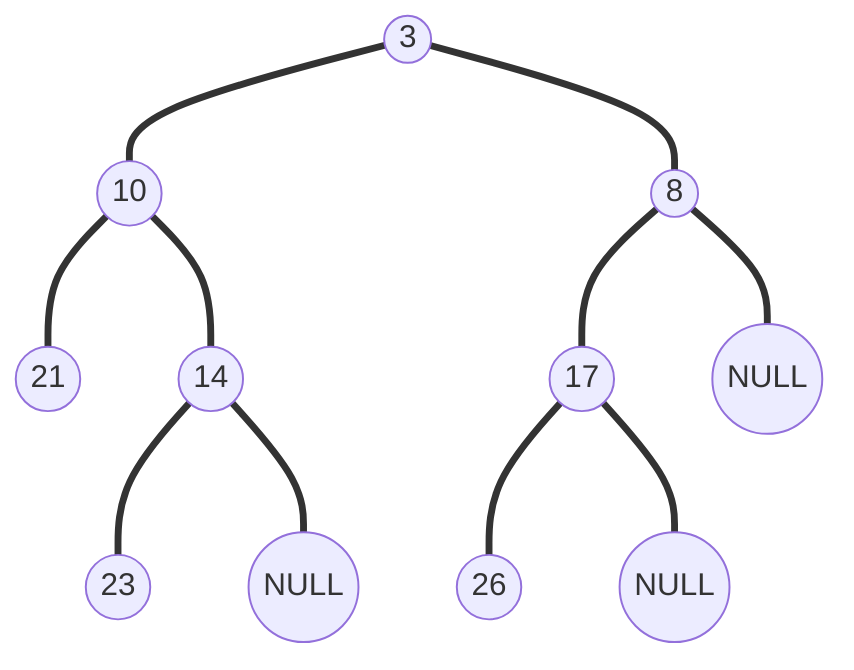
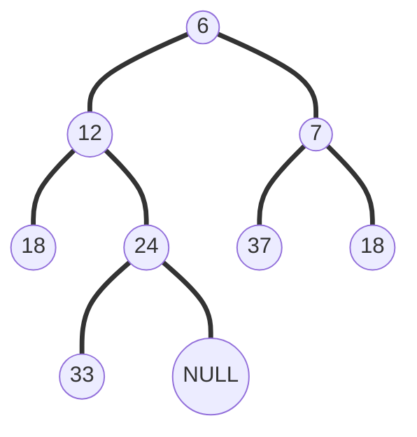

# 4 Leftist Heaps and Skew Heaps

!!! tip "说明"

    此文档正在更新中……

!!! info "说明"

    本文档只涉及部分知识点，仅可用来复习重点知识

## 1 Leftist Heaps

**左式堆**

定义 null path length，$Npl(X)$ 是从 X 至一个没有孩子的结点的路径的最短长度，规定 $Npl(NULL) = -1$
$$
Npl(X) = min \lbrace Npl(left\ child), Npl(right\ child)\rbrace + 1
$$

### 定义

左式堆具有以下性质：

1. 对于每个结点 X，X 左孩子的 Npl 值大于等于 X 右孩子的 Npl 值

<figure markdown="span">
    { width="600" }
</figure>

!!! tip "定理"

    一个左式堆，若其 right path 上有 r 个结点，则该左式堆一定至少有 $2^r - 1$ 个结点

### merge

#### 递归实现

**recursive version**

<figure markdown="span">
    { width="600" }
</figure>

??? example "递归实现模拟"

    

现有两个左式堆 H1，H2，模拟一下递归实现

H1

H2

---

<figure markdown="span">
    { width="600" }
</figure>

