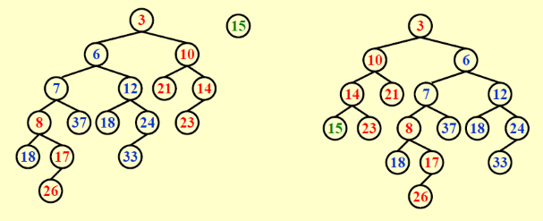

# 4 Leftist Heaps and Skew Heaps

<!-- !!! tip "说明"

    此文档正在更新中…… -->

!!! info "说明"

    本文档只涉及部分知识点，仅可用来复习重点知识

## 1 Leftist Heaps

**左式堆**

定义 null path length，$Npl(X)$ 是从 X 至一个没有孩子的结点的路径的最短长度，规定 $Npl(NULL) = -1$

$$
Npl(X) = min \lbrace Npl(left\ child), Npl(right\ child)\rbrace + 1
$$

### 定义

左式堆具有以下性质：

1. 对于每个结点 X，X 左孩子的 Npl 值大于等于 X 右孩子的 Npl 值

<figure markdown="span">
    { width="600" }
</figure>

!!! tip "定理"

    一个左式堆，若其 right path 上有 r 个结点，则该左式堆一定至少有 $2^r - 1$ 个结点

### merge

#### 递归实现

**recursive version**

<figure markdown="span">
    { width="600" }
</figure>

??? example "递归实现模拟"

    现有两个左式堆 H1，H2，模拟一下递归实现

    <div class="grid" id="grid-mid" markdown>
    <div>
    
    ```mermaid
    graph TD;
    a3((3))
    a10((10))
    a21((21))
    a14((14))
    a23((23))
    a8((8))
    a17((17))
    a26((26))
    a3 === a10
    a3 === a8
    a10 === a21
    a10 === a14
    a14 === a23
    a14 === n1((NULL))
    a8 === a17
    a8 === n2((NULL))
    a17 === a26
    a17 === n3((NULL))
    ```
    
    <p id="txt-mid">H1</p>
    </div>
    <div>
    
    ```mermaid
    graph TD;
    a6((6))
    a12((12))
    a18((18))
    a24((24))
    a33((33))
    a7((7))
    a37((37))
    a182((18))
    a6 === a12
    a6 === a7
    a12 === a18
    a12 === a24
    a24 === a33
    a24 === n1((NULL))
    a7 === a37
    a7 === a182
    ```
    
    <p id="txt-mid">H2</p>
    </div>
    </div>
    
    ---
    
    <figure markdown="span">
        { width="700" }
    </figure>
    
    <figure markdown="span">
        { width="700" }
    </figure>
    
    <figure markdown="span">
        { width="700" }
    </figure>
    
    <figure markdown="span">
        { width="700" }
    </figure>
    
    <figure markdown="span">
        { width="700" }
    </figure>
    
    <figure markdown="span">
        { width="700" }
    </figure>
    
    <figure markdown="span">
        { width="700" }
    </figure>
    
    ```mermaid
    graph TD;
    a3((3))
    a10((10))
    a21((21))
    a14((14))
    a23((23))
    a8((8))
    a37((37))
    a17((17))
    a26((26))
    a6((6))
    a18((18))
    a24((24))
    a33((33))
    a3 === a10
    a10 === a21
    a10 === a14
    a14 === a23
    a14 === n1((NULL))
    a12((12))
    a7((7))
    a182((18))
    a8 === a17
    a8 === a182
    a17 === a26
    a17 === n4((NULL))
    a7 === a8
    a7 === a37
    a6 === a12
    a6 === a7
    a12 === a18
    a12 === a24
    a24 === a33
    a24 === n2((NULL))
    a3 === a6
    ```

#### 迭代实现

**iterative version**

1. 根据 right paths 上结点值的大小 merge
2. 如果需要的话交换左右孩子

<figure markdown="span">
    { width="400" }
</figure>

<div class="grid" id="grid-mid" markdown>
<figure markdown="span">
    { width="300" }
</figure>
<figure markdown="span">
    { width="300" }
</figure>
<figure markdown="span">
    { width="300" }
</figure>
<figure markdown="span">
    { width="300" }
</figure>
<figure markdown="span">
    { width="300" }
</figure>

---

<figure markdown="span">
    { width="300" }
</figure>
<figure markdown="span">
    { width="300" }
</figure>
</div>

???+ question "PTA 4.3"

    Merge the two leftist heaps in the following figure.  Which one of the following statements is FALSE?

    <figure markdown="span">
        { width="300" }
    </figure>

    A. 2 is the root with 11 being its right child<br/>
    B. the depths of 9 and 12 are the same<br/>
    C. 21 is the deepest node with 11 being its parent<br/>
    D. the null path length of 4 is less than that of 2

    ??? success "答案"

        D

        ---

        <figure markdown="span">
            { width="300" }
        </figure>

        $Npl(4) = Npl(2) = 2$

???+ question "PTA 4.4"

    We can perform BuildHeap for leftist heaps by considering each element as a one-node leftist heap, placing all these heaps on a queue, and performing the following step: Until only one heap is on the queue, dequeue two heaps, merge them, and enqueue the result.  Which one of the following statements is FALSE?

    A. in the k-th run, $\lceil \frac{N}{2^k}\rceil$ leftist heaps are formed, each contains $2^k$ nodes<br/>
    B. the worst case is when $N=2^K$ for some integer K<br/>
    C. the time complexity $T(N) = O(\frac{N}{2}\log 2^0 + \frac{N}{2^2}\log 2^1 + \frac{N}{2^3}\log 2^2 + ··· + \frac{N}{2^K}\log 2^{K - 1})$ for some integer K so that $N = 2 ^ K$<br/>
    D. the worst case time complexity of this algorithm is $\Theta(N\log N)$

    ??? success "答案"

        D

        ---

        可以画出 $N = 4,\ N = 5$ 的情况来想

        **A 选项：**

        每次从 queue 中 dequeue 出所有 heap，两两 merge，再 enqueue 进 queue 中。那么第 k 次完成后，会有 $\lceil \frac{N}{2^k}\rceil$ 个新 heap 形成，每个新 heap 中有 $2^k$ 个结点

        **B 选项：**

        最坏情况就是 $N=2^K$，每次都会取出所有 heap

        **C 选项：**

        这么整齐的式子肯定是 $N = 2^K$

        第 k 次操作，有 $\dfrac{N}{2^{k -1}}$ 个结点需要 merge，需要 merge $\dfrac{N}{2^k}$ 次。这些 heap 当中，每个里面都有 $2 ^ {k-1}$ 个结点，所以 merge 一次需要 $T = O(\log 2^{k-1})$，那么 merge $\dfrac{N}{2^k}$ 次，$T = O(\frac{N}{2^k} \log 2^{k-1})$。再累加起来就是 C 选项中的式子

        **D 选项：**

        根据 C 选项：

        $$
        T = (\frac{1}{2^2} + \frac{2}{2^3} + \frac{3}{2^4} + ··· + \frac{K-1}{2^K})N\log 2\\
        2T = (\frac{1}{2} + \frac{2}{2^2} + \frac{3}{2^3} + ··· + \frac{K-1}{2^{K-1}})N\log 2\\
        $$

        两式相减：

        $$
        T = (\frac{1}{2} + \frac{1}{2^2} + \frac{1}{2^3} + ··· + \frac{1}{2^{K-1}} - \frac{K-1}{2^K})N\log 2\\
        = (1 - \frac{1}{2^{K-1}} - \frac{K-1}{2^K})N\log 2\\
        = (1 - \frac{K + 1}{2^K})N\log 2\\
        $$

        由 $N=2^K$：

        $$
        T = (N - \log N - 1)\log 2\\
        T = O(N)
        $$

        D 选项错误

### deletemin

1. 删除根结点
2. merge 两个子树

## 2 Skew Heaps

**斜堆**

???+ question "PTA 4.1"

    The right path of a skew heap can be arbitrarily long. 

    T<br/>
    F
    
    ??? success "答案"

        T

        ---

        不是很懂，我的理解是新东西进去会放在左子树上，而左子树上的东西总会交换到右子树上，所以 right path 任意长

### merge

根据 right paths 上的结点值的大小进行 merge，但是每次 merge 要交换左右孩子，除了 right paths 上值最大的那个结点

<figure markdown="span">
    { width="300" }
</figure>

???+ question "PTA 4.6"

    Merge the two skew heaps in the following figure.  Which one of the following statements is FALSE?

    <figure markdown="span">
        { width="400" }
    </figure>


    A. 15 is the right child of 8<br/>
    B. 14 is the right child of 6<br/>
    C. 1 is the root<br/>
    D. 9 is the right child of 3
    
    ??? success "答案"

        A

        ---

        <figure markdown="span">
            { width="400" }
        </figure>

### insert

把那个要 insert 进来的结点当作另一个 Heap，相当于做一次 merge

<figure markdown="span">
    { width="300" }
</figure>

???+ question "PTA 4.2"

    The result of inserting keys 1 to $2^{k−1}$ for any $k>4$ in order into an initially empty skew heap is always a full binary tree.

    T<br/>
    F
    
    ??? success "答案"

        T

        ---

        试一试发现确实是这样，当作一个小结论记住吧

???+ question "PTA 4.5"

    Insert keys 1 to 15 in order into an initially empty skew heap.  Which one of the following statements is FALSE?

    A. the resulting tree is a complete binary tree<br/>
    B. there are 6 leaf nodes<br/>
    C. 6 is the left child of 2<br/>
    D. 11 is the right child of 7
    
    ??? success "答案"

        B

        ---

        > Skew Heap 模拟：[Skew Heap Visualization](https://www.cs.usfca.edu/~galles/visualization/SkewHeap.html){:target="_blank"}

        <figure markdown="span">
            { width="700" }
        </figure>

        <figure markdown="span">
            { width="700" }
        </figure>

        <figure markdown="span">
            { width="700" }
        </figure>

        <figure markdown="span">
            { width="400" }
        </figure>

### 摊还分析

$$
T_{amortized} = O(\log N)
$$

定义：如果结点 p 右子树结点数量大于等于 p 后代数量（包括 p 自己）的一半（即 p 右子树结点数量大于 p 左子树结点数量），称 p 是 heavy 的。否则称 p 是 light 的