# 5 Binomial Queues

<!-- !!! tip "说明"

    此文档正在更新中…… -->

!!! info "说明"

    本文档只涉及部分知识点，仅可用来复习重点知识

**二项队列**

## 定义

二项队列是一群 heap 的集合，每个 heap 都是一个二项队列

$B_k$ 是将一个 $B_{k-1}$ 连接到另一个 $B_{k-1}$ 的根结点上形成的

<figure markdown="span">
    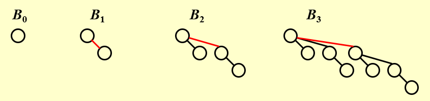{ width="600" }
</figure>

二项队列类比二进制数

<figure markdown="span">
    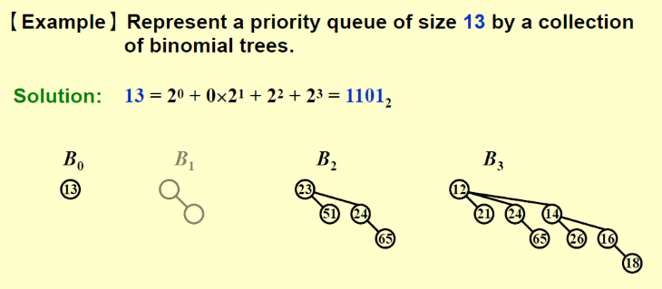{ width="600" }
</figure>

???+ question "PTA 5.1"

    Which of the following binomial trees can represent a binomial queue of size 42?

    A. $B_0\ B_1\ B_2\ B_3\ B_4\ B_5$ 
    B. $B_1\ B_3\ B_5$ 
    C. $B_1\ B_5$ 
    D. $B_2\ B_4$

    ??? success "答案"

        B

        ---

        $42 = 101010$

整个二项队列放在一个数组中，每个位置放相应的 heap，heap 用 left-child-next-sibling 实现

## findmin

最小值在其中一个根结点上

$T = O(\log N)$

## merge

类比二进制加法

<figure markdown="span">
    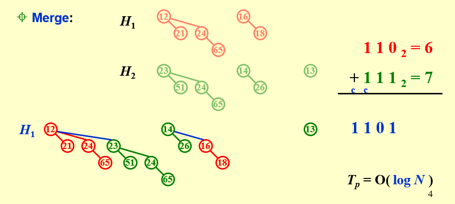{ width="600" }
</figure>

???+ question "PTA 5.3"

    Merge the two binomial queues in the following figure.  Which one of the following statements must be FALSE?

    <figure markdown="span">
        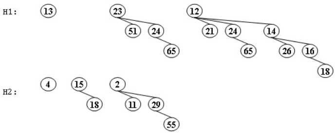{ width="400" }
    </figure>

    A. there are two binomial trees after merging, which are $B_2$ and $B_4$ 
    B. 13 and 15 are the children of 4 
    C. if 23 is a child of 2, then 12 must be another child of 2 
    D. if 4 is a child of 2, then 23 must be another child of 2

    ??? success "答案"

        D

        ---
        
        case 1:

        

        <figure markdown="span">
            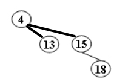{ width="200" }
        </figure>
        <figure markdown="span">
            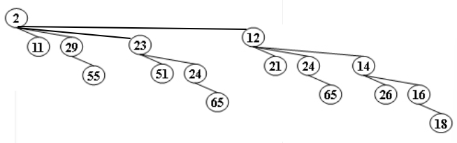{ width="600" }
        </figure>
        

        ---

        case 2:

        

        <figure markdown="span">
            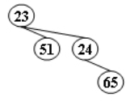{ width="200" }
        </figure>
        <figure markdown="span">
            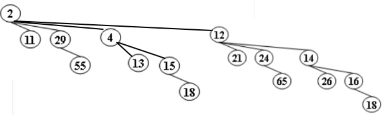{ width="600" }
        </figure>
        

## insert

当作 merge 处理

## deletemin

1. 找到 min 所在的 heap，剩下的 heap 当作 H'
2. 删除 min 结点后，该 heap 会分成一个新的二项队列 H''
3. 合并 H' 和 H''

<figure markdown="span">
    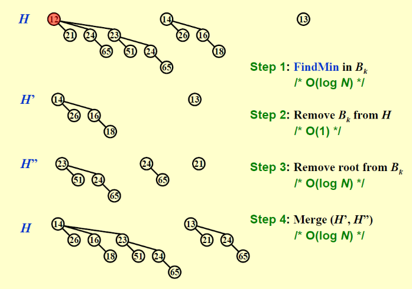{ width="600" }
</figure>

???+ question "PTA 5.4"

    Delete the minimum number from the given binomial queues in the following figure.  Which one of the following statements must be FALSE?

    <figure markdown="span">
        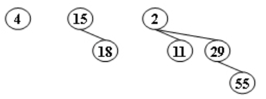{ width="400" }
    </figure>

    A. there are two binomial trees after merging, which are $B_1$ and $B_2$ 
    B. 11 and 15 can be the children of 4 
    C. 29 can never be the root of any resulting binomial tree 
    D. if 29 is a child of 4, then 15 must be the root of $B_1$

    ??? success "答案"

        C

        ---

        case 1:

        <figure markdown="span">
            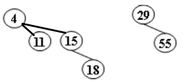{ width="300" }
        </figure>

        ---

        case 2:

        <figure markdown="span">
            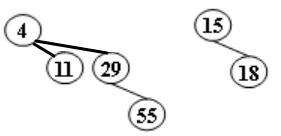{ width="300" }
        </figure>
        
## 摊还分析

N 个元素的二项队列可以通过 N 次 insert 形成，共 $T = O(N)$
$$
T_{amortized} = O(1)
$$

### aggregate

<figure markdown="span">
    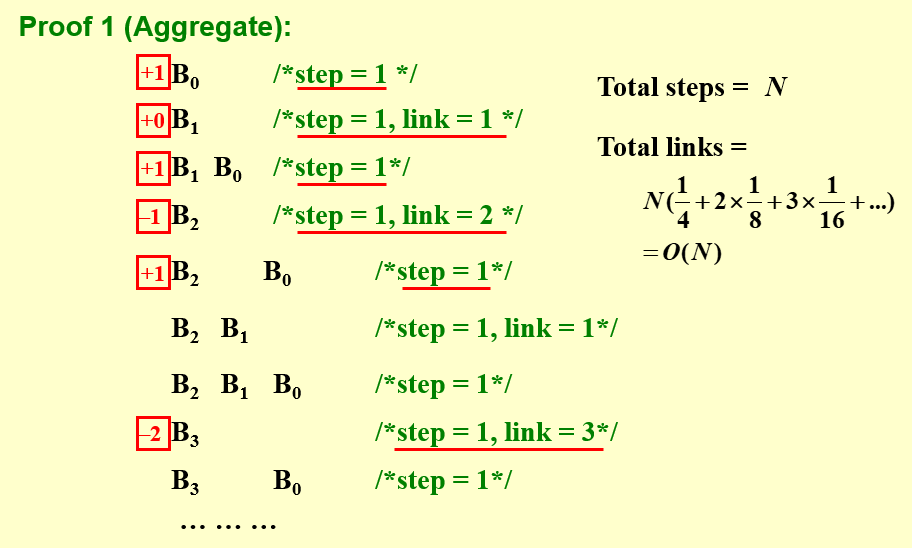{ width="600" }
</figure>

### potential

<figure markdown="span">
    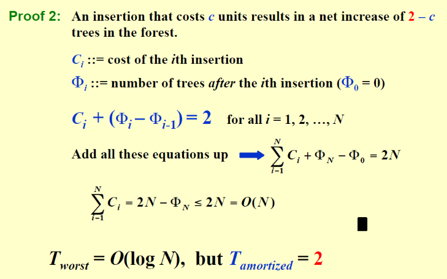{ width="600" }
</figure>

???+ question "PTA 5.2"

    For a binomial queue, __ takes a constant time on average.

    A. merging 
    B. find-max 
    C. delete-min 
    D. insertion

    ??? success "答案"

        D

        ---

        insert 摊还时间为 O(1)，平均时间也为 O(1)