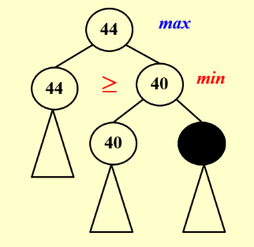

# 6 Backtracking

<!-- !!! tip "说明"

    此文档正在更新中…… -->

!!! info "说明"

    本文档只涉及部分知识点，仅可用来复习重点知识

<figure markdown="span">
    { width="600" }
</figure>

## Eight Queens

**八皇后**

<figure markdown="span">
    { width="600" }
</figure>

<figure markdown="span">
    { width="600" }
</figure>

<figure markdown="span">
    { width="600" }
</figure>

## Turnpike Reconstruction Problem

<figure markdown="span">
    { width="600" }
</figure>

<figure markdown="span">
    { width="600" }
</figure>

<figure markdown="span">
    { width="600" }
</figure>

## Tic-tac-toe

MinMax Strategy

<figure markdown="span">
    { width="600" }
</figure>

???+ question "PTA 6.1"

    In the Tic-tac-toe game, a "goodness" function of a position is defined as $f(P)=W_{computer}−W_{human}$ where W is the number of potential wins at position P.In the following figure, `O` represents the computer and `X` the human. What is the goodness of the position of the figure?

    <figure markdown="span">
        { width="200" }
    </figure>

    A. -1 
    B. 0 
    C. 4 
    D. 5

    ??? success "答案"

        B

        ---

        

        

        在这个位置，电脑赢的方式有 3 种
        <figure markdown="span">
            { width="200" }
        </figure>
        

        

        在这个位置，人赢的方式有 3 种
        <figure markdown="span">
            { width="200" }
        </figure>
        

        

## α - β pruning

1. min 结点更新 β
2. max 结点更新 α
3. 当 $\alpha \geqslant \beta$ 时，pruning

> 参考视频：[L10 - Alpha-Beta Pruning Algorithm](https://www.bilibili.com/video/BV1e7411y7mf/){:target="_blank"}

<figure markdown="span">
    { width="600" }
</figure>

### α pruning

<figure markdown="span">
    { width="400" }
</figure>

### β pruning

<figure markdown="span">
    { width="400" }
</figure>

???+ question "PTA 6.1"

    Given the following game tree, which node is the first one to be pruned with α-β pruning algorithm?

    <figure markdown="span">
        { width="400" }
    </figure>

    A. a 
    B. b 
    C. c 
    D. d

    ??? success "答案"

        C

        ---

        以一种方式遍历所有结点并更新 α β 值

        <figure markdown="span">
            { width="400" }
        </figure>

        1. 从 e 开始，e 值为 65，g 更新为 65
        2. f 值为 68，g 更新为 68
        3. h 更新为 68
        4. b 值为 86，a 更新为 86
        5. 因为 h 结点是 min，取 g a 两个中最小的那个值，a 现在已经是 86 了，a 是 max，a 的值只能大于等于 86，h 肯定不会更新成 a 结点的值，所以 c 结点不用遍历了，pruning 