# 8 Dynamic Programming

**动态规划**

<!-- !!! tip "说明"

    本文档正在更新中…… -->

!!! info "说明"

    1. 本文档仅涉及部分内容，仅可用于复习重点知识
    2. 本文档部分图片来源于教学课件

将一个问题拆分为一系列的 **子问题**，且这些子问题 **相互重叠**

通常按如下 4 个步骤来设计一个动态规划算法：

1. 刻画一个最优解的结构特征
2. 递归地定义最优解的值
3. 计算最优解的值，通常采用自底向上的方法
4. 利用计算出的信息构造一个最优解

如果仅需要一个最优解的值，可忽略步骤 4，如果需要步骤 4，有时就需要在执行步骤 3 的过程中维护一些额外信息，以便用来构造一个最优解

## 1 斐波那契数列

### 递归实现

```c linenums="1"
int Fib(int N) {
    if (N <= 1) {
        return 1;    
    } else {
        return Fib(N - 1) + Fib(N - 2);
    }
}
```

在递归实现中，有很多已经算过了，但是第二次碰到的时候还是会再算一次，浪费时间

### 循环实现

<figure markdown="span">
    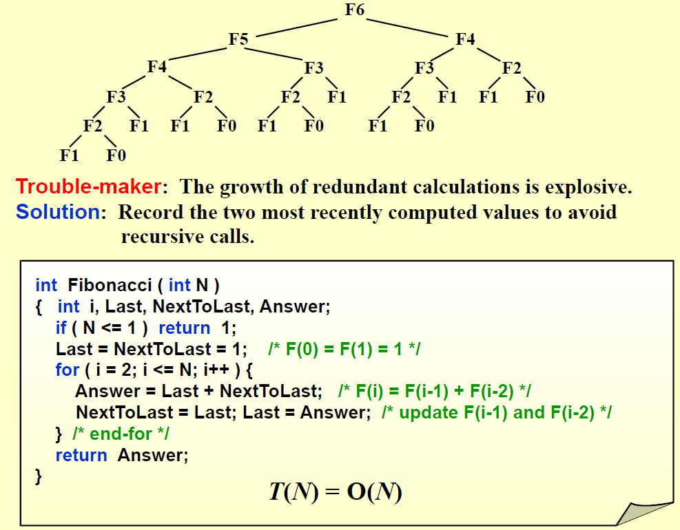{ width="600" }
</figure>

称为 **自底向上设计**

还有一种处理方式便是 **带备忘机制的自顶向下设计**，采用递归算法，但是我算出来一个值我就存到一个数组里，下次遇到的时候就可以直接取出来，不需要重复计算

## 2 Shortest Path in DAGs

<figure markdown="span">
    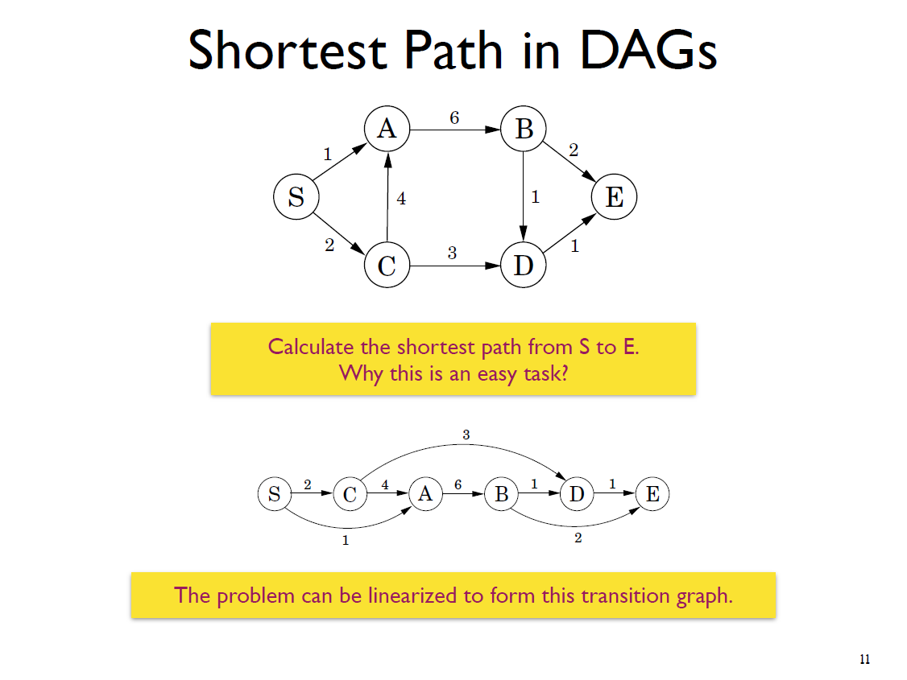{ width="600" }
</figure>

我们可以发现 `dist(D) = min{dist(B) + 1, dist(C) + 3}`

<figure markdown="span">
    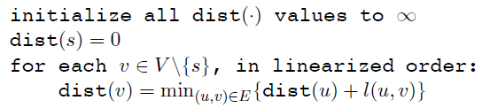{ width="600" }
</figure>

## 3 Maximum subsequence sum

> 参考：[算法复习——动态规划篇之最大子数组问题](https://blog.csdn.net/NickHan_cs/article/details/111714424){:target="_blank"}

<figure markdown="span">
    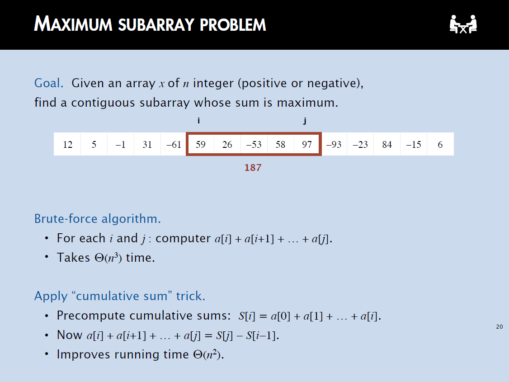{ width="600" }
</figure>

设原始数组为 `A`，设 `D[i]` 为以 `A[i]` 开头的最大子数组和

递推公式：

$$
D[i] = \begin{cases}
    A[i] + D[i + 1]& D[i + 1] > 0\\
    A[i]& D[i + 1] \leqslant 0
\end{cases}
$$

## 4 Optimal Binary Search Tree

<figure markdown="span">
    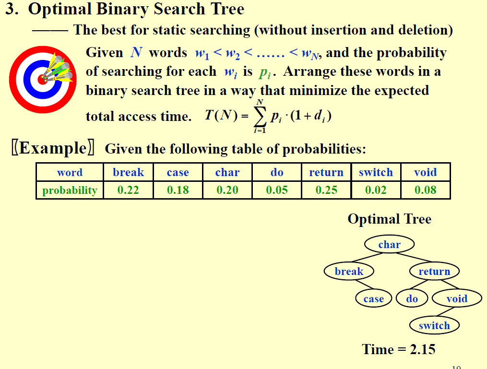{ width="600" }
</figure>

<figure markdown="span">
    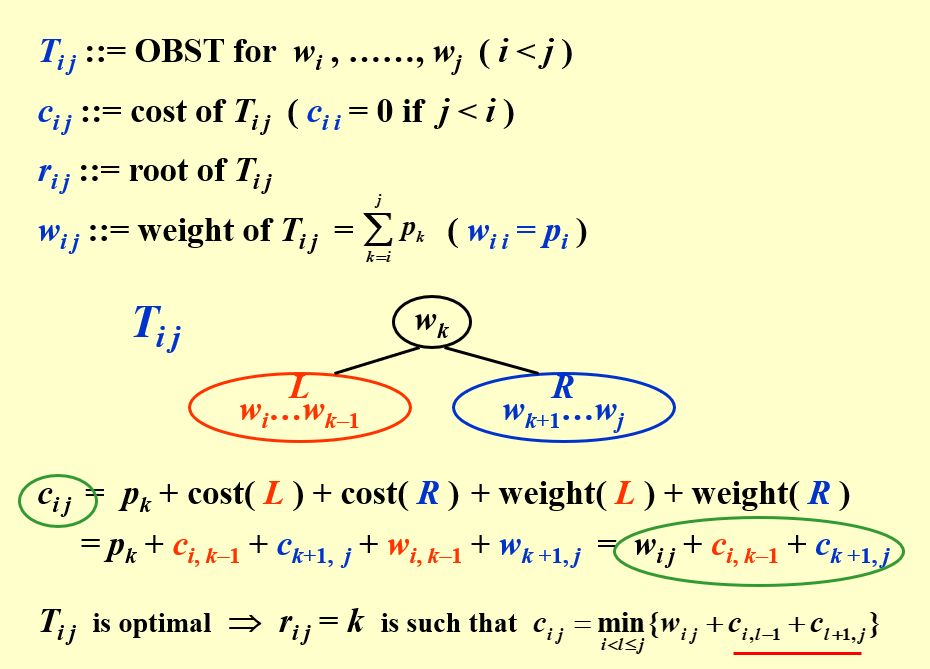{ width="600" }
</figure>

<figure markdown="span">
    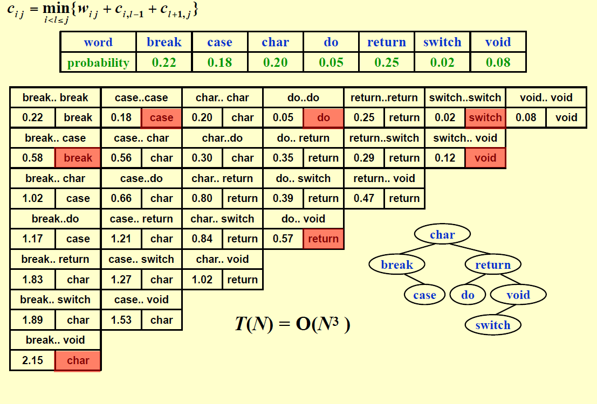{ width="600" }
</figure>

## 5 0-1 knapsack

<figure markdown="span">
    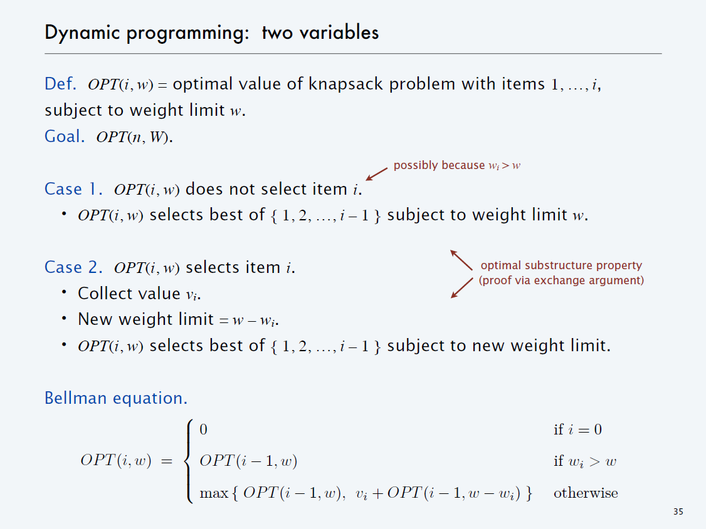{ width="600" }
</figure>

<figure markdown="span">
    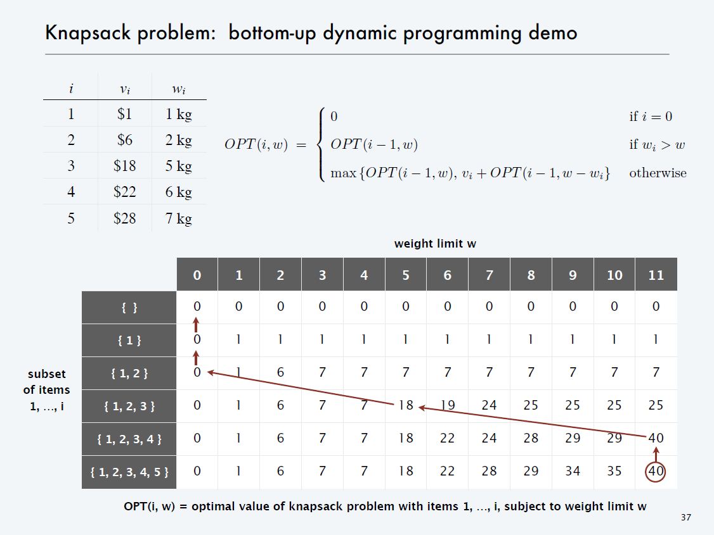{ width="600" }
</figure>

<figure markdown="span">
    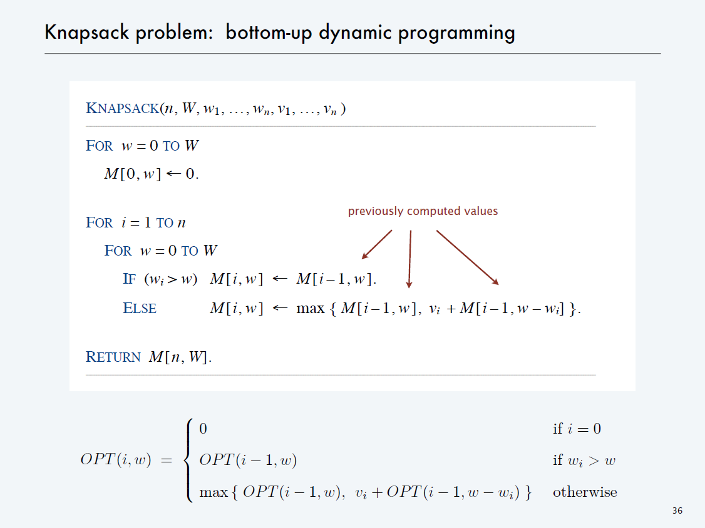{ width="600" }
</figure>

## 6 Product assembly

<figure markdown="span">
    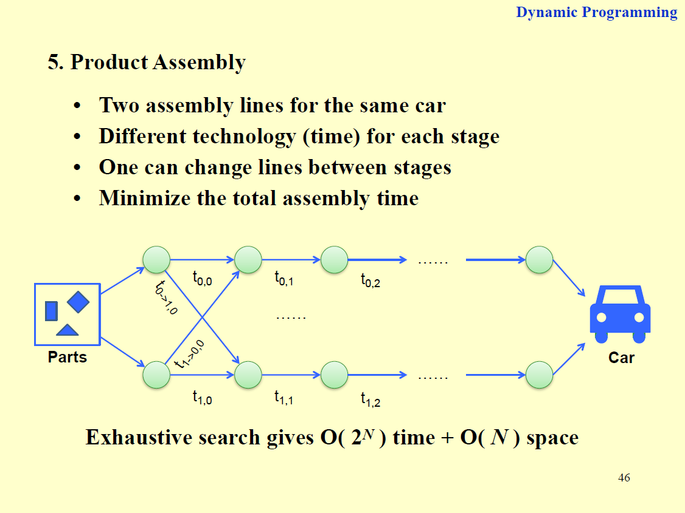{ width="600" }
</figure>

```c linenums="1"
f[0][0] = 0;
f[1][0] = 0;
L[0][0] = 0;
L[1][0] = 0;
for (stage = 1; stage <= n; stage++) {
    for (line = 0; line <= 1; line++) {
        f_stay = f[line][stage - 1] + t_process[line][stage - 1];
        f_move = f[1 - line][stage - 1] + t_transit[1 - line][stage - 1];
        if (f_stay < f_move) {
            f[line][stage] = f_stay;
            L[line][stage] = line;
        } else {
            f[line][stage] = f_move;
            L[line][stage] = 1 - line;
        }
    }
}

line = f[0][n] < f[1][n] ? 0 : 1;
for (stage = n; stage > 0; stage--) {
    plan[stage] = line;
    line = L[line][stage];
}
```

## 7 All-Pairs Shortest Path

<figure markdown="span">
    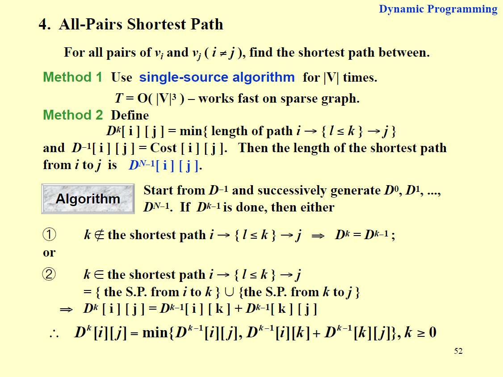{ width="600" }
</figure>

<figure markdown="span">
    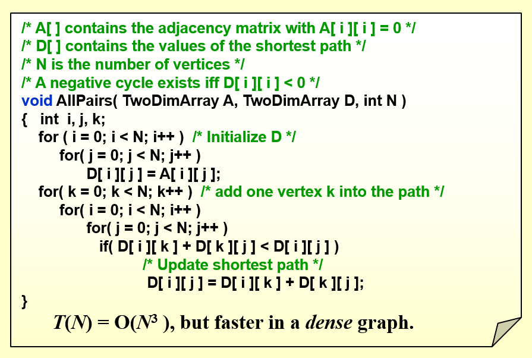{ width="600" }
</figure>

???+ question "PTA 8.1"

    Rod-cutting Problem: Given a rod of total length N inches and a table of selling prices $P_L$ for lengths L=1,2,⋯,M.  You are asked to find the maximum revenue $R_N$ obtainable by cutting up the rod and selling the pieces.  For example, based on the following table of prices, if we are to sell an 8-inch rod, the optimal solution is to cut it into two pieces of lengths 2 and 6, which produces revenue $R_8 = P_2 + P_6 = 5 + 17 = 22$. And if we are to sell a 3-inch rod, the best way is not to cut it at all.

    <figure markdown="span">
        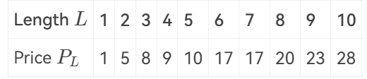{ width="400" }
    </figure>

    Which one of the following statements is FALSE?

    A. This problem can be solved by dynamic programming<br/>
    B. The time complexity of this algorithm is $O(N^2)$<br/>
    C. If $N \leqslant M$, we have $R_N = \max\lbrace P_N, \max_{1 \leqslant i < N}\lbrace R_i + R_{N - i} \rbrace \rbrace$<br/>
    D. If $N > M$, we have $R_N = \max_{1 \leqslant i < N}\lbrace R_i + R_{N - M}\rbrace$

    ??? success "答案"

        D

        ---

        D 选项应为 $R_N = \max_{1 \leqslant i < N}\lbrace R_i + R_{N - i}\rbrace$

        ```c linenums="1"
        let r[0..n] be a new array;
        r[0] = 0;
        for (j = 1 to n) {
            q = -∞;
            for (i = 1 to j) {
                q = max(q, p[i] + r[j - i]);
            }
            r[j] = q;
        }
        return r[n];
        ```

        时间复杂度为 $O(N^2)$

???+ question "PTA 8.2"

    In dynamic programming, we derive a recurrence relation for the solution to one subproblem in terms of solutions to other subproblems. To turn this relation into a bottom up dynamic programming algorithm, we need an order to fill in the solution cells in a table, such that all needed subproblems are solved before solving a subproblem. Among the following relations, which one is impossible to be computed?

    A. $A(i,j) = \min(A(i - 1,j), A(i, j -1),A(i-1,j-1))$<br/>
    B. $A(i,j) = F(A(\min\lbrace i,j\rbrace - 1, \min\lbrace i,j\rbrace - 1), A(\max\lbrace i,j\rbrace - 1, \max\lbrace i,j\rbrace - 1))$<br/>
    C. $A(i,j) = F(A(i,j-1),A(i-1,j-1),A(i-1,j+1))$<br/>
    D. $A(i,j) = F(A(i-2,j-2),A(i+2,j+2))$

    ??? success "答案"

        D

        ---

        **A、B、C 选项：**

        ```c linenums="1"
        for (i = 0 to n) {
            for (j = 0 to n) {

            }
        }
        ```

        **D 选项：**

        $A(i,j)$ 既依赖前面的数据，又依赖后面的数据，无法计算

???+ question "PTA 8.3"

    Given a recurrence equation $f_{i,j,k} = f_{i,j+1,k} + \min_{0 \leqslant l \leqslant k} \lbrace f_{i-1,j,l} + w_{j,l} \rbrace$. To solve this equation in an iterative way, we cannot fill up a table as follows:

    A. `for k in 0 to n: for i in 0 to n: for j in n to 0`<br/>
    B. `for i in 0 to n: for j in 0 to n: for k in 0 to n`<br/>
    C. `for i in 0 to n: for j in n to 0: for k in n to 0`<br/>
    D. `for i in 0 to n: for j in n to 0: for k in 0 to n`

    ??? success "答案"

        B

        ---

        B 选项，计算 $f_{i,j,k}$ 时，$f_{i,j+1,k}$ 无法得知