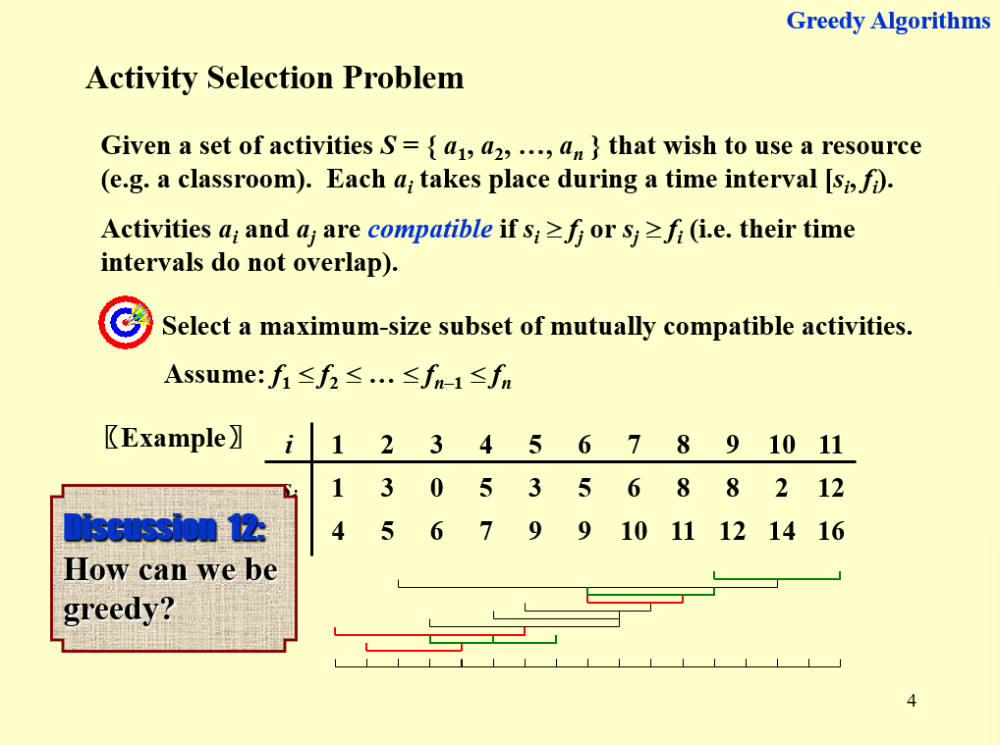

# 9 Greedy Algorithms

!!! tip "说明"

    此文档正在更新中……

!!! info "说明"

    本文档只涉及部分知识点，仅可用来复习重点知识

只有在局部最优解和全局最优解相等时，贪心算法得到的结果才是最优解

## 1 Activity Selection Problem

<figure markdown="span">
    { width="600" }
</figure>

按照结束最早来选择

???+ question "PTA 9.1"

    Let S be the set of activities in Activity Selection Problem.  Then the earliest finish activity $a_m$ must be included in all the maximum-size subset of mutually compatible activities of S.

    T F

    ??? success "答案"

        F

        ---
        
        贪心算法得到的结果包含 $a_m$，但实际的最优解不一定包含

## 2 Huffman Code

<figure markdown="span">
    { width="600" }
</figure>

<figure markdown="span">
    { width="600" }
</figure>

<figure markdown="span">
    { width="600" }
</figure>

???+ question "PTA 9.2"

    Let C be an alphabet in which each character c in C has frequency c.freq.  If the size of C is n,  the length of the optimal prefix code for any character c is not greater than n−1.   

    T F

    ??? success "答案"

        T

        ---

        <figure markdown="span">
            { width="200" }
        </figure>

        如果我们让 Huffman tree 一直向上生长，会发现最长编码长度确实不可能超过 n - 1

???+ question "PTA 9.3"

    Consider the problem of making change for n cents using the fewest number of coins. Assume that each coin's value is an integer.

    The coins of the lowest denomination（面额） is the cent.
    
    (I) Suppose that the available coins are quarters (25 cents), dimes (10 cents), nickels (5 cents), and pennies (1 cent). The greedy algorithm always yields an optimal solution.
    
    (II) Suppose that the available coins are in the denominations that are powers of c, that is, the denominations are $c^0,c^1,\cdots,c^k$ for some integers c>1 and k>=1. The greedy algorithm always yields an optimal solution.
    
    (III) Given any set of k different coin denominations which includes a penny (1 cent) so that there is a solution for every value of n, greedy algorithm always yields an optimal solution.
    
    Which of the following is correct?

    A. Statement (I) is false. 
    B. Statement (II) is false. 
    C. Statement (III) is false. 
    D. All of the three statements are correct.

    ??? success "答案"

        C

        ---

        C 选项一个很经典的反例是：有 1，3，4 面额的硬币，要凑出 6。贪心的解为 6 = 4 + 1 + 1，实际最优解为 6 = 3 + 3