# 高级数据结构与算法分析

<!-- !!! tip "说明"

    此文档正在更新中…… -->

## 课程介绍

!!! info "注意"

    此为 2024-2025 秋冬学期课程安排，仅供参考

dyx老师

### 考核方式

<embed src="../../../file/ADS/ADS_doc1.pdf" type="application/pdf" width="100%" height="500" />

??? info "project 题目描述"

    <figure markdown="span">
        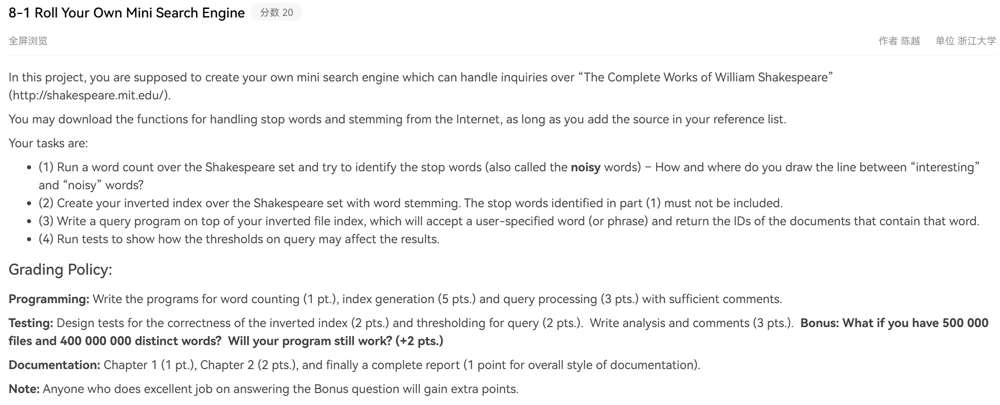{ width="800" }
    </figure>

    ---

    <figure markdown="span">
        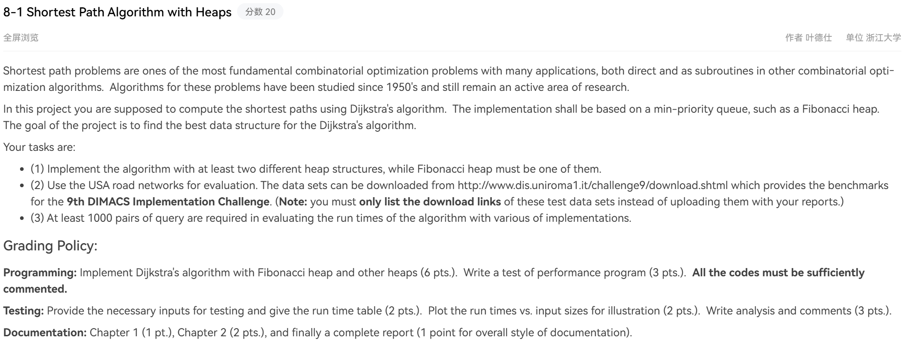{ width="800" }
    </figure>

    ---

    <figure markdown="span">
        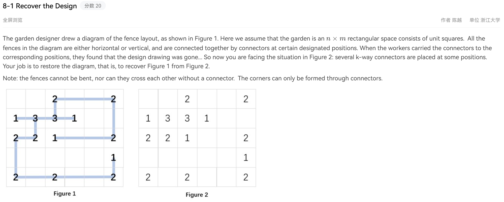{ width="800" }
    </figure>

    <figure markdown="span">
        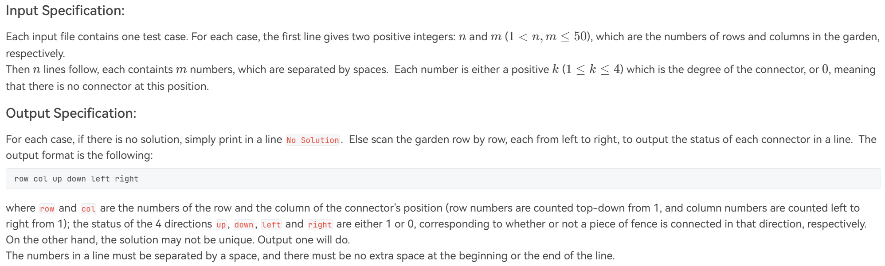{ width="800" }
    </figure>

    <figure markdown="span">
        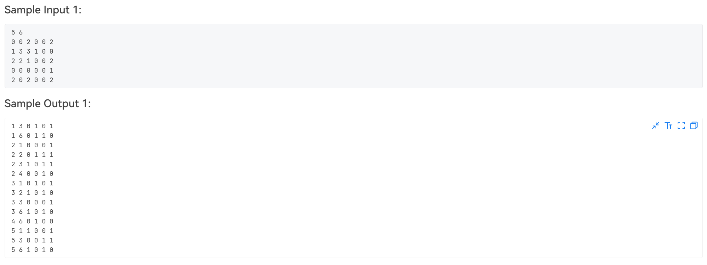{ width="800" }
    </figure>

    <figure markdown="span">
        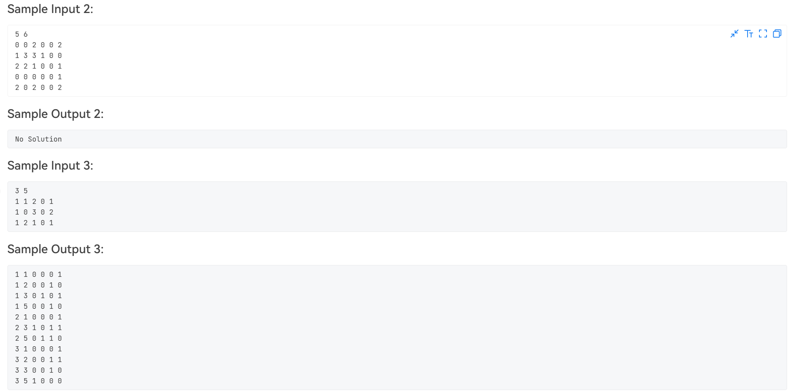{ width="800" }
    </figure>

    <figure markdown="span">
        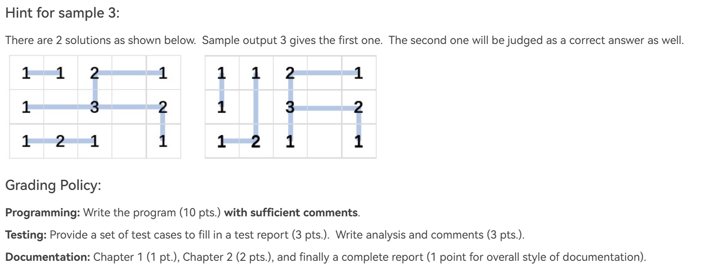{ width="800" }
    </figure>

    ---

    <figure markdown="span">
        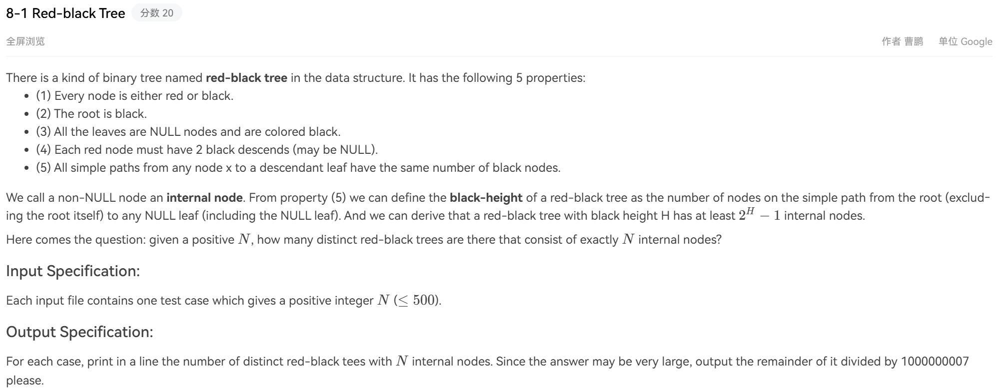{ width="800" }
    </figure>

    <figure markdown="span">
        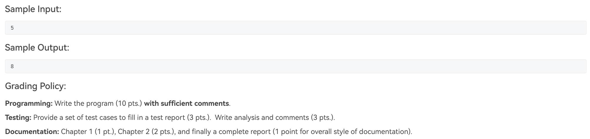{ width="800" }
    </figure>

    ---

    <figure markdown="span">
        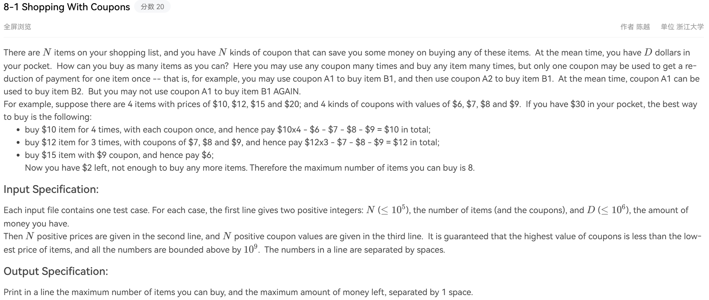{ width="800" }
    </figure>

    <figure markdown="span">
        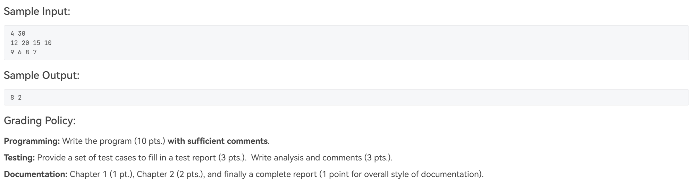{ width="800" }
    </figure>

    ---

    <figure markdown="span">
        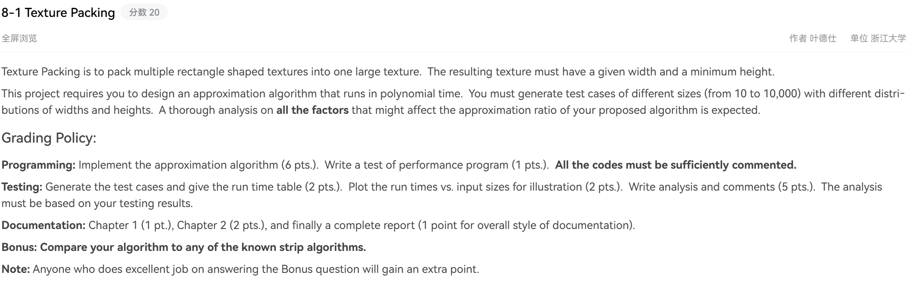{ width="800" }
    </figure>

    ---

    <figure markdown="span">
        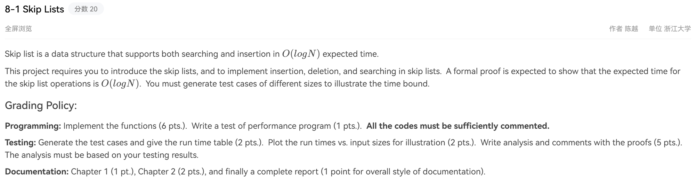{ width="800" }
    </figure>

    ---

    <figure markdown="span">
        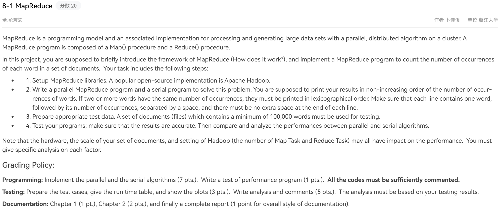{ width="800" }
    </figure>

### 期末考试

#### 题型

- 判断：13 x 2分
- 选择：20 x 3分
- 程序填空题：2空 x 3分
- 函数题：1 x 8分

程序填空题和函数题重点关注前半学期（Intractability）均为 C 语言

## 课本

[浙江大学课程攻略共享计划 - 高级数据结构与算法分析](https://qsctech.github.io/zju-icicles/%E9%AB%98%E7%BA%A7%E6%95%B0%E6%8D%AE%E7%BB%93%E6%9E%84%E4%B8%8E%E7%AE%97%E6%B3%95%E5%88%86%E6%9E%90/){:target="_blank"}

## 笔记

### 个人笔记及部分 PTA 习题详解

> 为什么部分习题有详解呢？因为我不会呀 😭

[1 AVL Trees, Splay Trees and Amortized Analysis](./ch1.md) 
[2 Red-Black Trees and B+ Trees](./ch2.md) 
[3 Inverted File Index](./ch3.md) 
[4 Leftist Heaps and Skew Heaps](./ch4.md) 
[5 Binomial Queues](./ch5.md) 
[6 Backtracking](./ch6.md) 
[7 Divide and Conquer](./ch7.md) 
[8 Dynamic Programming](./ch8.md) 
[9 Greedy Algorithms](./ch9.md) 
[10 Intractability](./ch10.md) 
[11 Approximation Algorithms](./ch11.md) 
[12 Local Search](./ch12.md) 
[13 Randomized Algorithms](./ch13.md) 
[14 Parallel Algorithms](./ch14.md) 
[15 External Sorting](./ch15.md)

### 其他

[浙江大学课程攻略共享计划 - 高级数据结构与算法分析](https://qsctech.github.io/zju-icicles/%E9%AB%98%E7%BA%A7%E6%95%B0%E6%8D%AE%E7%BB%93%E6%9E%84%E4%B8%8E%E7%AE%97%E6%B3%95%E5%88%86%E6%9E%90/){:target="_blank"}

[Isshiki修's Notebook - 💎 高级数据结构 | Advanced Data Structure](https://note.isshikih.top/cour_note/D2CX_AdvancedDataStructure/){:target="_blank"}

[Zhou Jianjun's Notebook - ADS Homework Review](https://zhoutimemachine.github.io/note/courses/ads-hw-review/){:target="_blank"}

### project 分享

> 当时 FDS 有个 Code of Academic Honesty，里面说“【真实案例】学生 A 把自己独立完成的作业代码放到开源社区，第二年被学生 B 抄袭。A 和 B 都应被判作弊”，所以我这里分享一下思路什么的

#### project 8 MapReduce

因为是新东西，弄这个 project 花了好长时间，尤其是环境配置折腾了老半天，但是编写代码的部分比较简单，所以感觉选择这个 project 可以少动脑子，而且可以自学到新东西

1. 搭建虚拟机：可以使用 VMware 这个软件
2. Hadoop 的配置以及官方 WordCount Jar 文件的使用：[黑马程序员大数据Hadoop入门视频教程，适合零基础自学的大数据Hadoop教程](https://www.bilibili.com/video/BV1CU4y1N7Sh/){:target="_blank"}
3. Java 代码编写：
      1. 根据这个视频初步了解一下如何创建 Java 工程和编写代码：[使用hadoop的Java接口编程进行HDFS文件读取](https://www.bilibili.com/video/BV1Wt42157Nn/){:target="_blank"}。可能还得自己在网上找找 vscode（或其他 IDE）中使用 Java 工程的教程，比如相关插件的下载，Java 版本的选择，Jar 文件的导出等等
      2. 根据这个视频了解类似官方 WordCount Jar 文件是怎么写的，怎么导出的：[【Task01-统计单词数量】Hadoop-MapReduce编程-idea打包](https://www.bilibili.com/video/BV1Bm421M75W/){:target="_blank"}
      3. 编写代码完成 PTA 上的要求（提示：可以写不止一个 MapReduce 程序，把它们串联起来），可参考文档：[Hadoop实现词频统计（按照词频降序排列以及相同词频的单词按照字母序排列）](https://blog.csdn.net/weixin_43622131/article/details/106794945){:target="_blank"}
4. 导出自己的 Jar 文件，在虚拟机上运行测试

## 历年题整理

[浙江大学课程攻略共享计划 - 高级数据结构与算法分析](https://qsctech.github.io/zju-icicles/%E9%AB%98%E7%BA%A7%E6%95%B0%E6%8D%AE%E7%BB%93%E6%9E%84%E4%B8%8E%E7%AE%97%E6%B3%95%E5%88%86%E6%9E%90/){:target="_blank"}

### 2024-2025 秋冬

#### 期中

<embed src="../../../file/ADS/ADS_doc2.pdf" type="application/pdf" width="100%" height="500" />

??? success "程序填空题 2 答案"

    1. `a, mid + 1, r`
    2. `a[i] < a[j]`
    3. `ans += j - mid - 1`
    4. `tmp[++cnt] = a[j++]`
    5. `a[i] = tmp[i - l + 1]`

#### 期末

<embed src="../../../file/ADS/ADS_doc3.pdf" type="application/pdf" width="100%" height="500" />

> 怎么会错这么多啊 😧

## 个人感受

期末考试一定要把 ppt 的每一页都认真看一遍啊

> 考试结束后经典：早知道把那个概念看一遍了