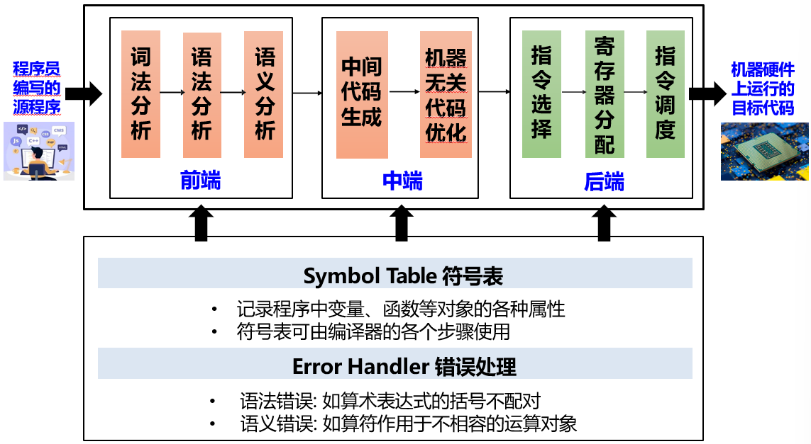
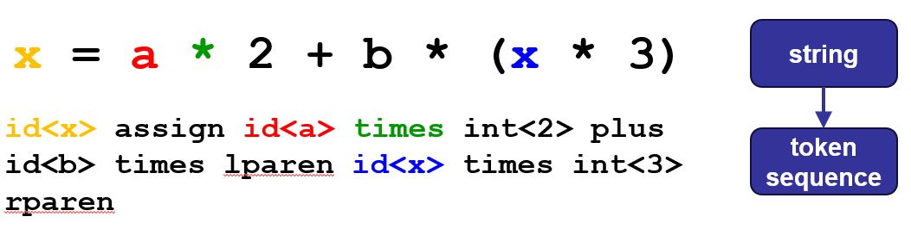
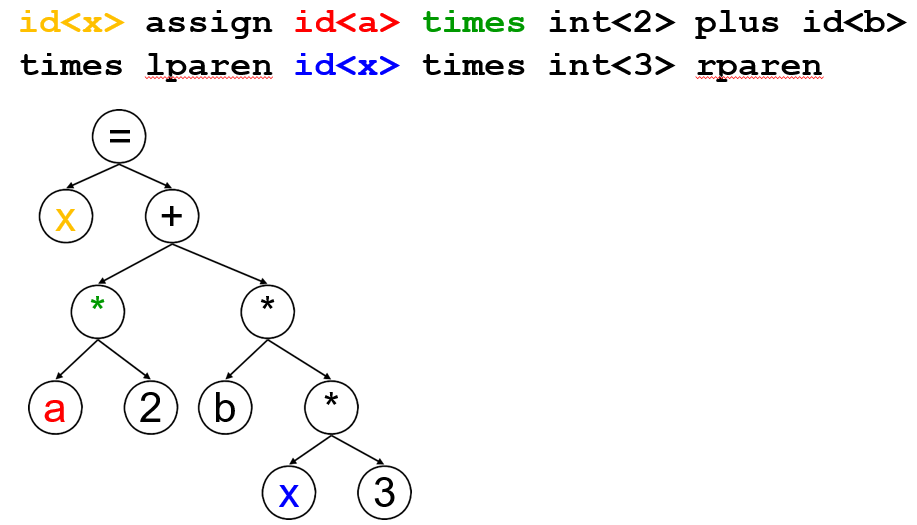
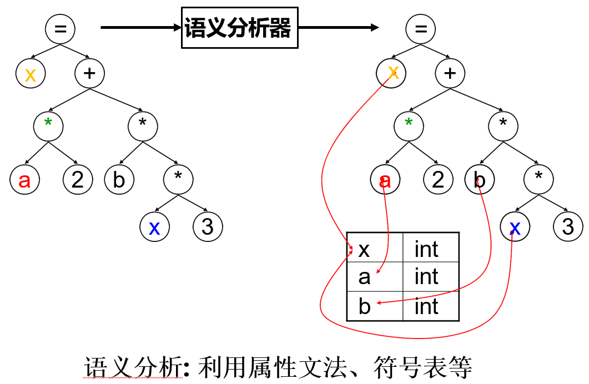
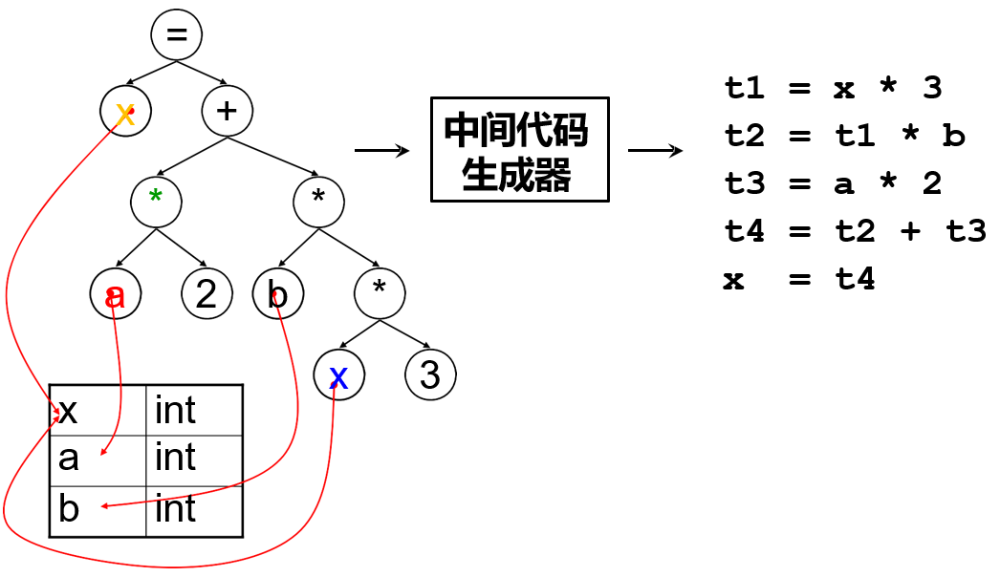
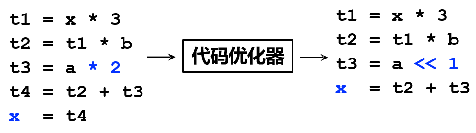
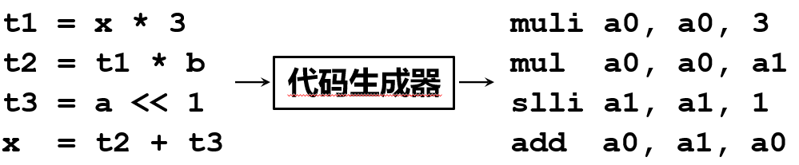
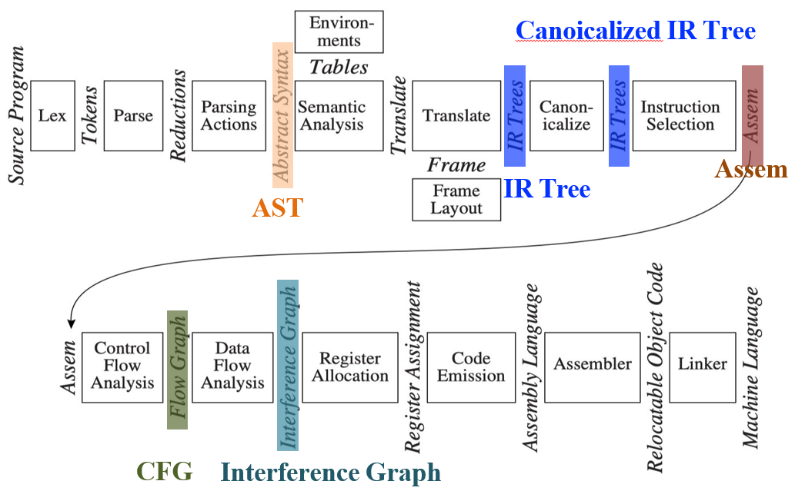

# 1 Introduction

<!-- !!! tip "说明"

    本文档正在更新中…… -->

## 1 Typical Workflow of a Compiler

<figure markdown="span">
  { width="600" }
</figure>

### 1.1 Lexical Analysis / Scanning

**词法分析**

1. 将程序字符流分解为 token 序列
2. 删除字符串中不必要的部分，如空格
3. 通常使用正则表达式匹配

<figure markdown="span">
  { width="600" }
</figure>

### 1.2 Syntax Analysis / Parsing

**语法分析**

1. 将 token 序列解析为语法结构
2. 去除不必要的 token，如括号
3. 一般使用抽象语法树（AST）定义

<figure markdown="span">
  { width="600" }
</figure>

### 1.3 Semantic Analysis

**语义分析**

决定语法结构的含义

<figure markdown="span">
  { width="600" }
</figure>

IR Tree：中间表示树。是对 AST 进行语义分析和初步转换后产生的

### 1.4 中间代码生成

源语言与目标语言之间的桥梁

<figure markdown="span">
  { width="600" }
</figure>

### 1.5 机器无关代码优化

基于中间表示进行分析与变换，降低执行时间，减少资源消耗等

<figure markdown="span">
  { width="600" }
</figure>

### 1.6 目标代码生成

把中间表示形式翻译到目标语言

<figure markdown="span">
  { width="600" }
</figure>

## 2 Modules and Interfaces in Tiger

<figure markdown="span">
  { width="600" }
</figure>

1. lex：**词法分析**。将源文件分解为独立的单词，即词法单元
2. parse：**语法分析**。分析程序的短语结构
3. parsing actions：针对每个短语，构建对应的抽象语法树片段
4. semantic analysis：**语义分析**。确定每个短语的含义，将变量的使用与其定义关联起来，检查表达式的类型，请求翻译每个短语
5. frame layout：以机器相关的方式，将变量、函数参数等放置到活动记录（栈帧）中
6. translate：生成中间表示树 IR Tree，它不绑定于任何特定的源语言或目标机器架构
7. canonicalize：将副作用从表达式中提升出来；清理条件分支，以便于后续阶段的处理
8. instruction selection：将 IR 树节点分组，形成与目标机器指令动作相对应的块
9. control flow analysis + dataflow analysis：将指令序列分析成控制流图，显示程序执行时所有可能的控制流路径。收集关于信息在程序变量中流动的信息。例如，活跃分析计算每个程序变量在哪些地方持有仍需要的值（即活跃的）
10. register allocation：选择寄存器来存放程序使用的每个变量和临时值；不同时活跃的变量可以共享同一个寄存器
11. code emission：用机器寄存器替换每条机器指令中的临时名称