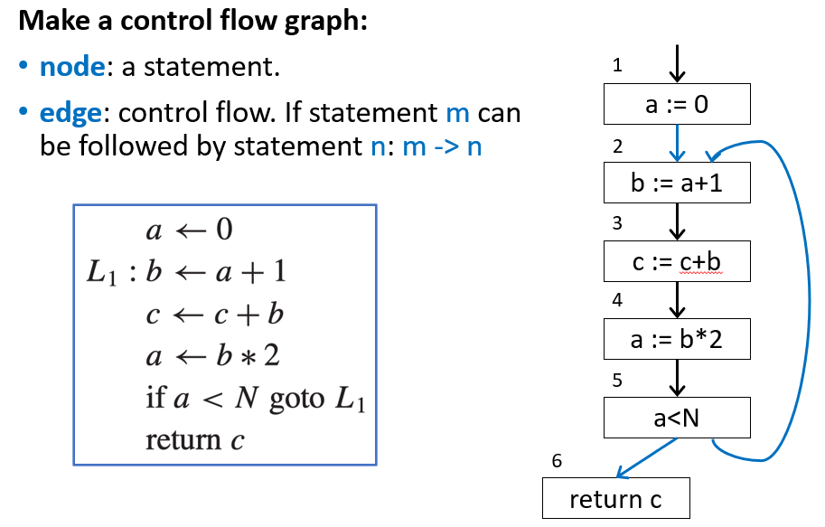
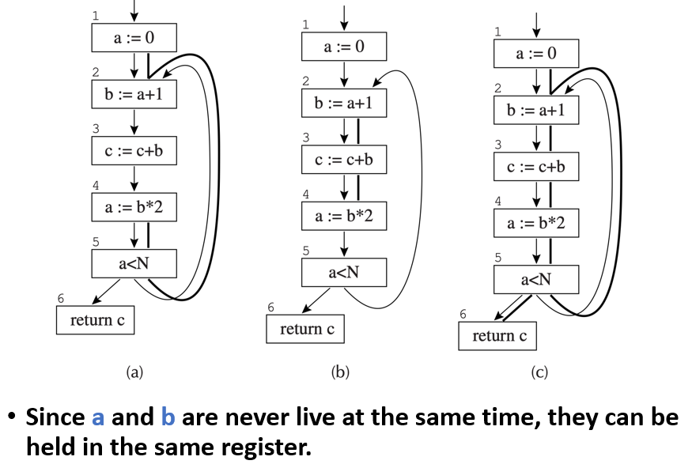
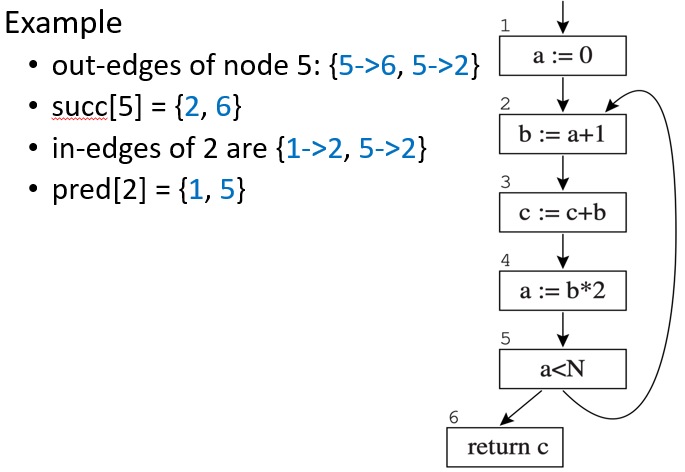
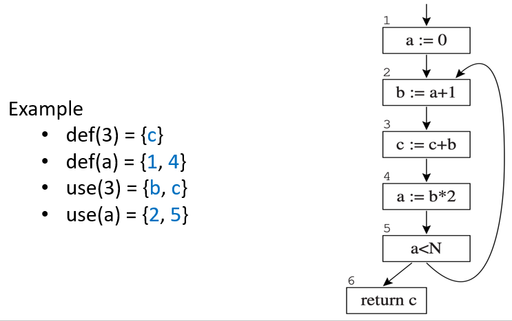
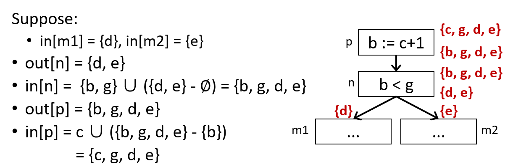
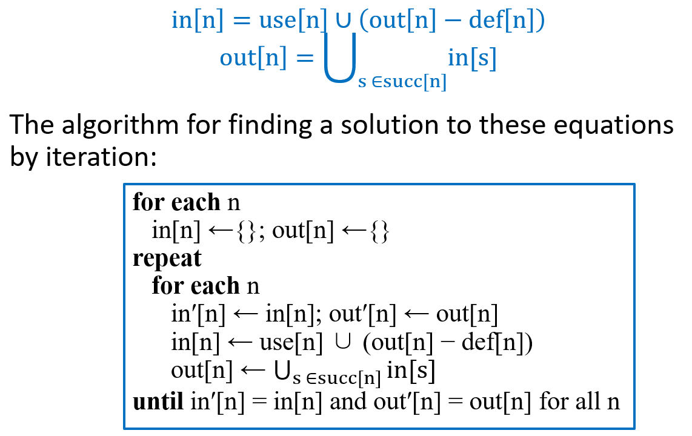
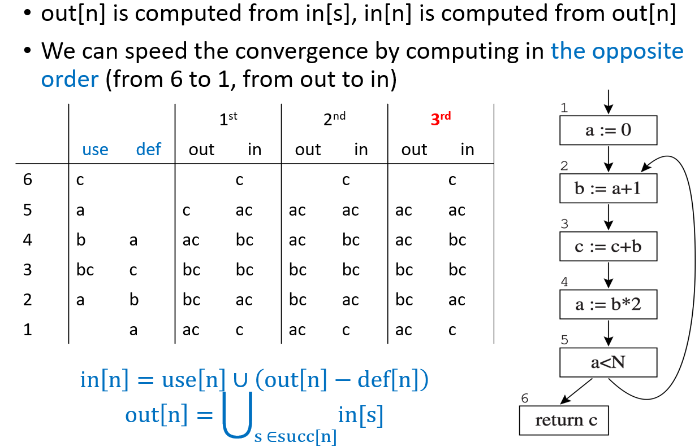
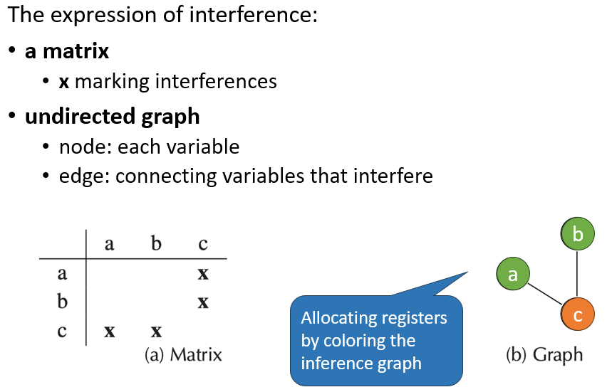

# 10 Liveness Analysis

<!-- !!! tip "说明"

    本文档正在更新中…… -->

!!! info "说明"

    本文档仅涉及部分内容，仅可用于复习重点知识

程序中会用到很多临时变量，寄存器数量有限，不能给每个变量都分配一个单独的寄存器。如果两个变量不会在同一时间段内被使用，那它们就可以共用一个寄存器。通过分析程序的控制流，确定每个变量在每个程序点的活跃状态，如果活跃，则必须保留在寄存器或内存中；如果不活跃，则可以覆盖或释放

<figure markdown="span">
  { width="600" }
</figure>

<figure markdown="span">
  { width="600" }
</figure>

## 1 Solution of Dataflow Equations

一个节点 n 有：

1. out-edges：指向后继节点
2. in-edges：从前驱节点指进来
3. pred[n]：前驱节点集合
4. succ[n]：后继节点集合

<figure markdown="span">
  { width="600" }
</figure>

1. def(variable)：定义此变量的节点集合
2. def(node)：此节点定义的变量集合
3. use(variable)：使用此变量的节点集合
4. use(node)：此节点使用的变量集合

<figure markdown="span">
  { width="600" }
</figure>

Liveness：如果存在一条从一条边出发的有向路径，能够到一个变量的一个 use，并且这条路径上没有经过任何对该变量的 def，那么这条边上的该变量是 live 的

1. live-in：如果一个变量在一个节点的任意 in-edges 上 live，那么该变量是该节点的 live-in
2. live-out：如果一个变量在一个节点的任意 out-edges 上 live，那么该变量是该节点的 live-out
3. in[n]：节点 n 的 live-in 集合
4. out[n]：节点 n 的 live-out 集合

计算活跃性：

1. 如果 m 是 n 的后继节点，且 a 是 m 的 live-in，那么 a 是 n 的 live-out
2. 如果 n use a，那么 a 是 n 的 live-in
3. 如果 a 是 n 的 live-out，且 n 没有 def a，那么 a 是 n 的 live-in

<figure markdown="span">
  { width="600" }
</figure>

可以得到计算活跃性的算法：

<figure markdown="span">
  { width="600" }
</figure>

<figure markdown="span">
  { width="600" }
</figure>

在计算活跃性时，可以做以下优化：

1. 基本块优化：一条语句就是一个单独的节点，这样做节点太多，分析效率低。如果一个节点只有一个前驱且只有一个后继，那么该节点就可以合并到它的前后节点中，形成一个更大的节点（基本块）。这样整个图的节点变少，分析速度会变快
2. one variable at a time：很多临时变量活跃范围极短，当需要某个变量时，只追踪它的活跃性即可

如何高效表示集合 in[n] 和 out[n]：

1. 位数组：给程序中的每个变量分配一个固定的位位置，一个集合用一个 N 位的位向量表示，第 i 位为 1 则表示第 i 个变量在这个集合中。集合的并集就是按位或操作
2. sorted lists（排序列表）：用有序列表存储集合中的变量，并按固定顺序排序。集合的并集就是将两个列表合并

如果一个变量是动态活跃的，那么它一定是静态活跃的：

1. dynamic liveness：如果某次程序执行从 n 出发，能够到达 a 的一个使用，并且沿途没有经过对 a 的任何定义，那么 a 在 n 处的动态活跃的（程序实际运行的情况）
2. static liveness：如果存在某条控制流边组成的路径从 n 出发，能够到达 a 的一个使用，并且沿途没有经过对 a 的定义，那么 a 在 n 处是静态活跃的（静态分析得出的结论）

!!! tip "interference graphs"

    冲突是指两个变量不能分配到同一个物理寄存器

    1. 活跃范围重叠：如果变量 a 和 b 的活跃范围在程序中的某个点重叠，那么它们在同一时刻都需要保存值，因此必须放入不同的寄存器
    2. 硬件指令限制：有些指令只能使用特定的寄存器。如果一个变量 a 必须由这类特殊指令生成，那么它必须占用那个特定寄存器，与其他任何试图用该寄存器的变量冲突

    <figure markdown="span">
      { width="600" }
    </figure>

!!! tip "MOVE 指令的特殊处理"

    复制指令如 `t = s`，在寄存器分配中，如果简单地按照活跃范围重叠规则，s 和 t 在复制指令之后都可能是活的，因此会认为它们冲突，必须用不同寄存器。但这其实是不必要的，因为复制指令之后，s 和 t 的值完全相同，它们完全可以共享同一个寄存器，甚至可以通过寄存器别名或消除复制来优化

    但是如果之后重新定义了 t 的值，并且此时 s 还活跃，那么这时两者就必须用不同的寄存器