# 11 Register Allocation

<!-- !!! tip "说明"

    本文档正在更新中…… -->

!!! info "说明"

    本文档仅涉及部分内容，仅可用于复习重点知识

## 1 Coloring by Simplification

共 4 个阶段：build、simplify、spill、select

!!! tip "build"

    通过 liveness analysis 画出 interference graphs

    <figure markdown="span">
      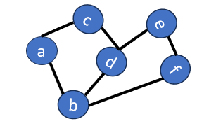{ width="200" }
    </figure>

!!! tip "simplify"

    我们要为一个图着色，颜色数量限制为 K（也就是有 K 个寄存器）。如果图中有一个节点 b 的邻居数 < K，那么可以先把 b 临时压栈，给剩下的图着色，由于 b 的邻居少于 K 种颜色，总能给 b 分配一个与邻居不同的颜色

    <figure markdown="span">
      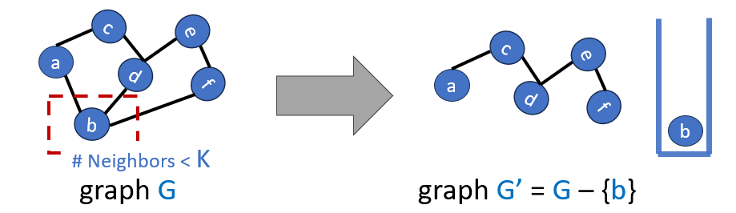{ width="600" }
    </figure>

!!! tip "spill"

    在简化过程中，我们不断移除度数 < K 的节点，当图中所有节点的度数都 ≥ K 时，简化无法继续。此时必须处理这些高度数的节点

    我们可以假设（乐观地）选中的节点其实可以不用寄存器，而是放在内存中。这样，这个溢出的节点不与其他节点争用寄存器。我们可以把它当作可移除的节点，压入栈中，继续简化剩下的图

    <figure markdown="span">
      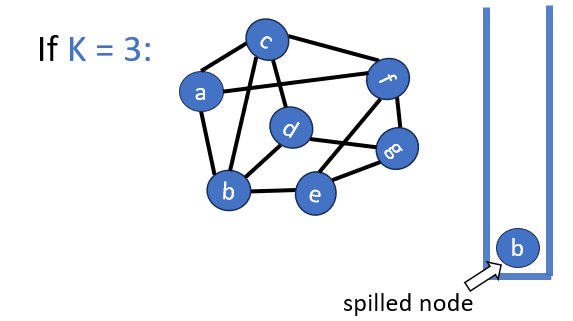{ width="600" }
    </figure>

!!! tip "select"

    从栈中弹出节点，重建图并尝试着色

    1. Simplified 节点：由于度数 < K，弹出时一定能着色
    2. Spill-heuristic 节点：由于度数 > K，弹出时不一定能着色。如果弹出时其邻居使用的颜色少于 K 种，那么我们可以为其着色，这一过程叫做 optimistic coloring（乐观着色）

如果在 select 阶段无法为某些节点找到颜色，那么程序必须被重写：在每个 use 之前从内存中 load 它们，并在每个 def 之后 store 内存

```c linenums="1"
// 原始代码
t = a + b;     // def
c = t + d;     // use

// 溢出后
t = a + b;     
STORE t, mem   // 定义后存回内存
LOAD t, mem    // 使用前加载
c = t + d;
```

t 原本的活动范围从 def 到最后一个 use。溢出后，t 被拆成多个新临时变量（例如 t_load, t_store），每个的活动范围非常短。这些新临时变量可能原本不与 t 冲突，但拆分后可能与原本的其他变量形成新的干涉关系。因此，旧的颜色分配无效，必须重新做图着色

实际经验表明：一次溢出迭代通常足够，第二次往往就能成功着色

<figure markdown="span">
  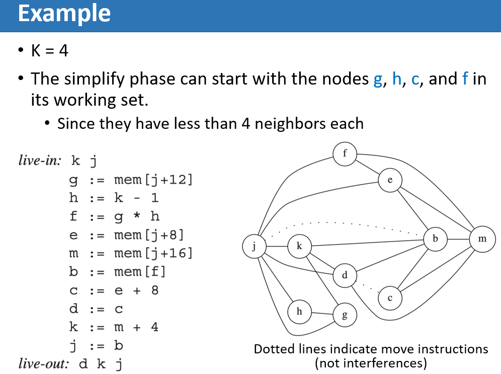{ width="600" }
</figure>

<figure markdown="span">
  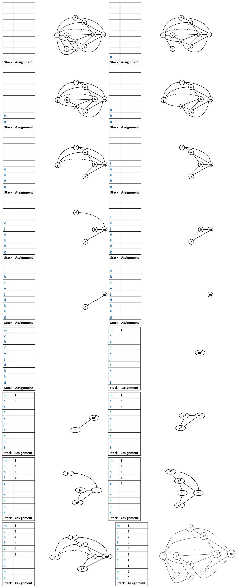{ width="800" }
</figure>

## 2 Coalescing

如果一条 MOVE 指令的源变量和目的变量在干涉图中没有边相连，那么这条 MOVE 指令就可以被消除。源节点和目标节点会被合并成一个新的节点，新节点的边是原来两个节点的边的并集

但合并后的新节点邻居是之前两个节点的并集，合并可能让图变得更难着色，甚至从可着色变成不可着色

<figure markdown="span">
  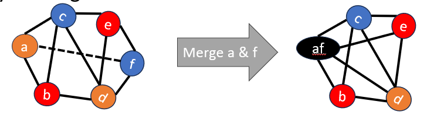{ width="600" }
</figure>

因此，我们希望只在安全的情况下进行合并。有两种安全的合并策略：

1. Briggs：如果新节点的度数 < K，则安全合并；如果新节点的度数 ≥ K，但它的高度数邻居数量 < K，也可以安全合并（因为即使发生溢出，也有足够选择）
2. George：如果合并前的节点 a 的所有邻居，都已经与 b 相邻，则合并成 ab 节点安全

### 2.1 Coloring with Coalescing

<figure markdown="span">
  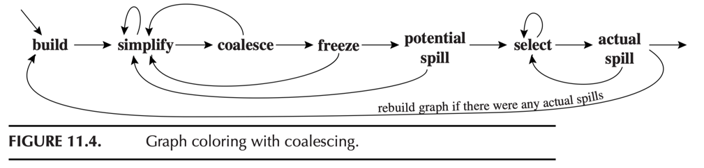{ width="600" }
</figure>

1. build：构造干涉图，将每个节点分类为与 MOVE 相关（它是某条 MOVE 指令的源或目的）或非 MOVE 相关的
2. simplify：每次从图中移除一个非 MOVE 相关且度数 < K 的节点（保留 MOVE 相关是因为后续它们可能合并）
3. coalesce：在简化后的图上执行保守合并，合并产生的新节点不再是 MOVE 相关，可用于下一轮简化。简化和合并会重复执行，直到图中只剩下高重度节点或与 MOVE 相关的节点
4. freeze：如果既无法执行简化也无法执行合并，我们就寻找一个低度数的与 MOVE 相关的节点。冻结与该节点相关的 MOVE 指令（放弃对这些 MOVE 指令合并的机会，将这些节点视为非 MOVE 相关），然后恢复执行简化和合并
5. spill：如果不存在低度数节点，我们就选择一个高度数节点作为潜在溢出节点，并将其压入栈中
6. select：弹出整个栈中的所有节点，为它们分配颜色

<figure markdown="span">
  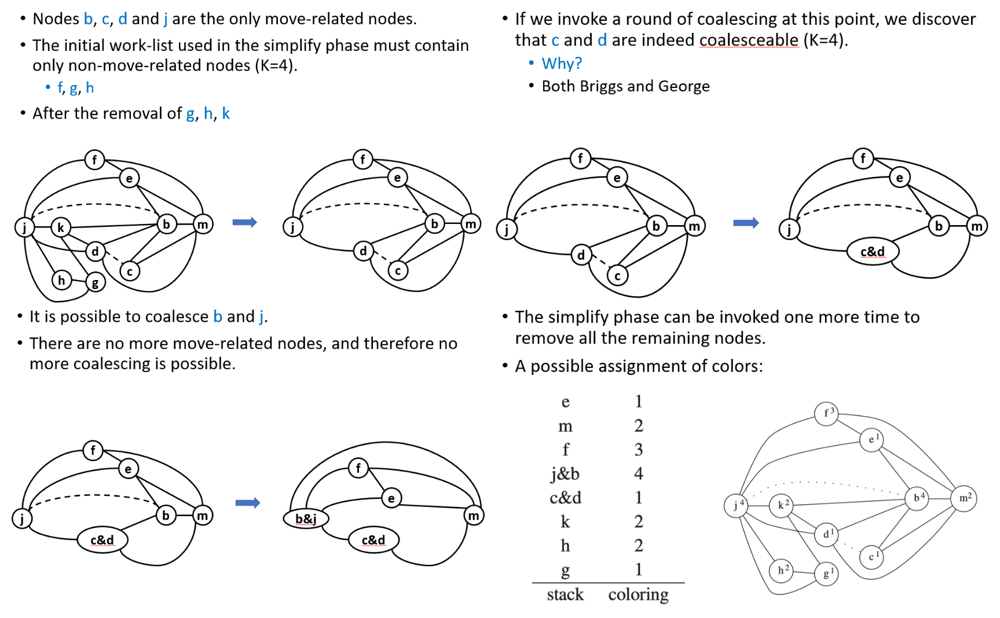{ width="800" }
</figure>

## 3 Precolored Nodes

在实际的机器架构中，某些寄存器有固定用途，这些寄存器不能随意分配，编译器必须遵守硬件和调用约定。这些特殊寄存器的颜色是预定的，且每个特殊寄存器对应一个固定颜色，每种颜色最多一个预着色节点。因此，所有预着色节点相互干涉，不能简化，不能溢出

一个普通临时量可以借用预着色寄存器的颜色，只要它不与那个预着色节点干涉

如果某个预着色寄存器在函数入口处被定义，在出口处被使用，那么它在整个函数中都是活跃的。这意味着它的生命周期覆盖整个函数，在干涉图中，它会与函数中几乎所有其他临时变量干涉，这会严重限制其他变量的寄存器分配

我们可以引入临时副本，打破过长的生命周期：在函数入口，将预着色寄存器的值复制到一个普通临时变量；在函数中，大部分操作使用该普通临时变量；在函数出口，将此临时变量的值复制回预着色寄存器

```c linenums="1"
Enter:    def(r7)   ← r7 在进入时被定义
...       (整个函数过程)
Exit:     use(r7)   ← r7 在退出时被使用


Enter:    def(r7)          ← r7 被定义
          t231 ← r7        ← 立即复制到临时变量
...       (使用 t231 做所有操作)
          r7 ← t231        ← 退出前复制回 r7
Exit:     use(r7)
```

!!! tip "caller-save and callee-save registers"

    ```c linenums="1"
    foo() {
        t = ...          // t 的定义
        ... = ... t ...  // t 的使用
        s = ...          // s 的定义
        f()              // 函数调用
        g()              // 另一个函数调用
        ... = ... s ...  // s 的使用
    }
    ```

    1. t：从定义到最后一次使用，不跨越任何函数调用。是 caller-save 类型的寄存器
    2. s：从定义到最后一次使用，跨越了两次函数调用。是 callee-save 类型的寄存器，因为callee 保存寄存器在调用后值被保留，不会因为 f() 或 g() 而丢失

    如果一个变量 x 在过程调用时保持活跃，那么它与所有 caller 保存的（预着色）寄存器产生干涉，并且它与为 callee 保存寄存器创建的所有新临时量（例如 t231）产生干涉，这时可能会发生溢出。我们使用常见的溢出代价启发式，溢出那些度数高但使用次数少的节点，即 t231

<figure markdown="span">
  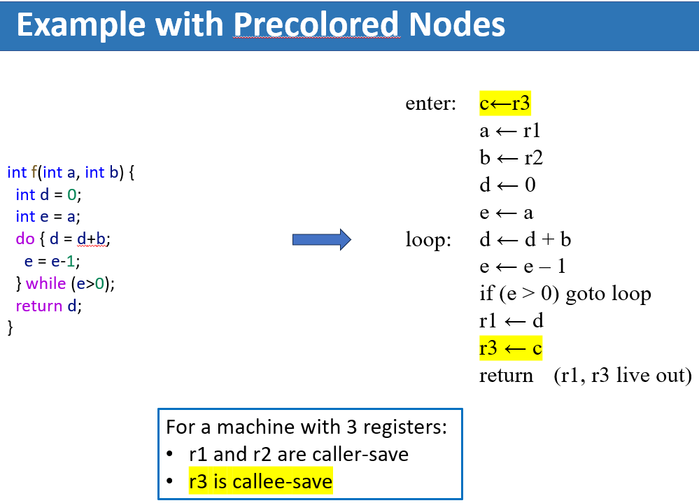{ width="600" }
</figure>

<figure markdown="span">
  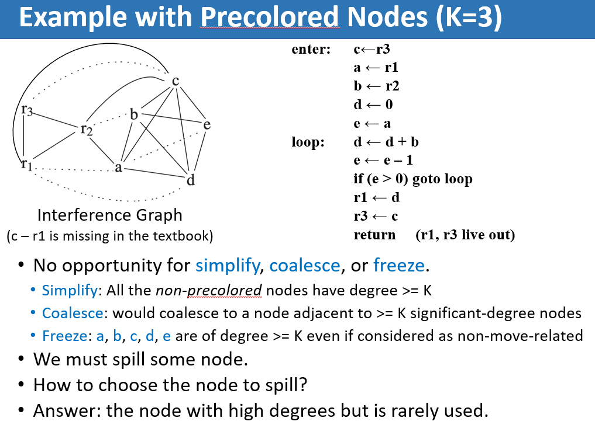{ width="600" }
</figure>

<figure markdown="span">
  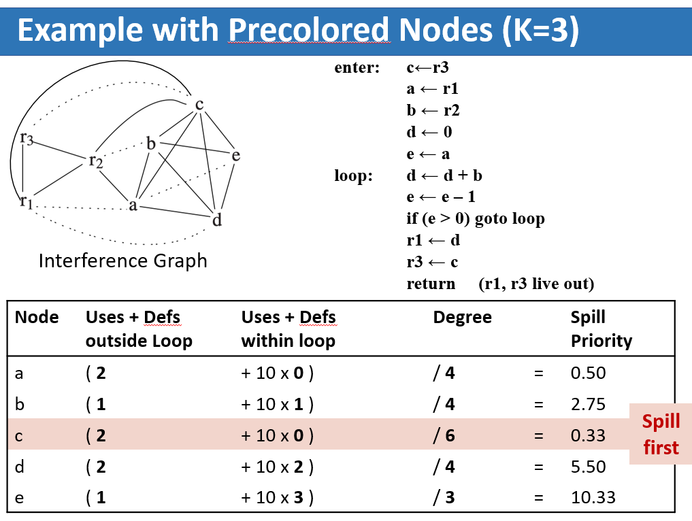{ width="600" }
</figure>

<figure markdown="span">
  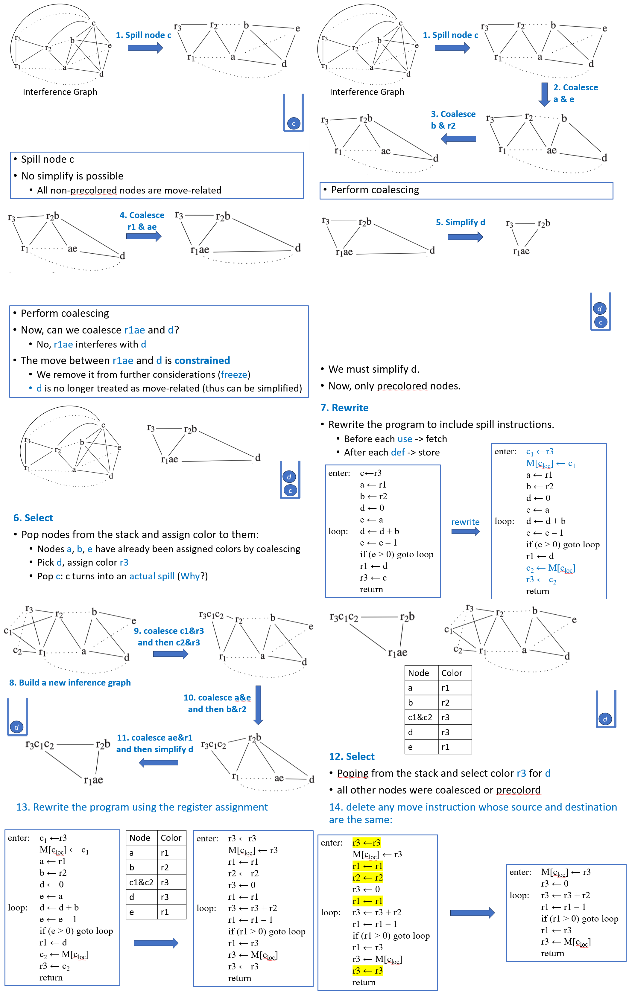{ width="800" }
</figure>