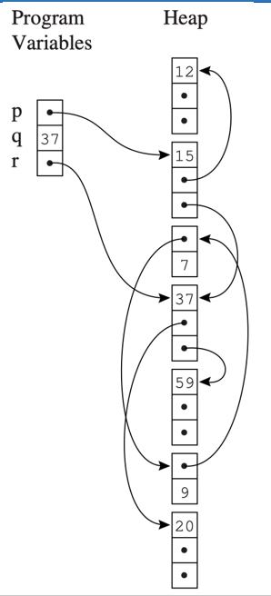
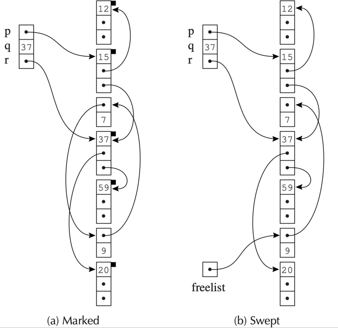
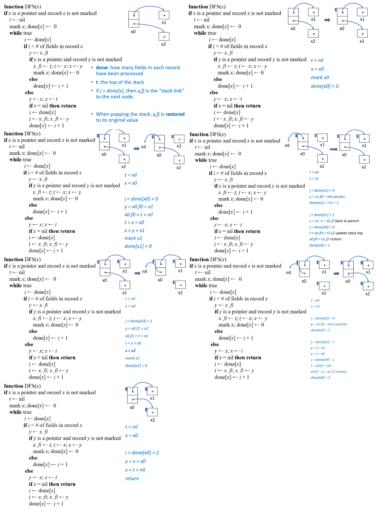
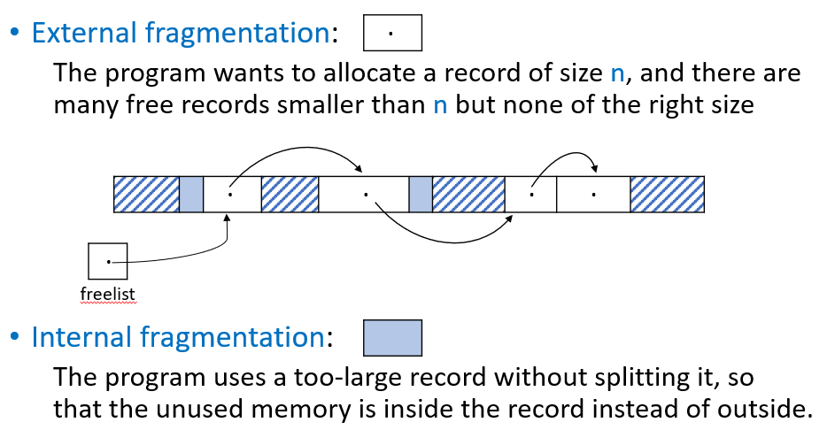
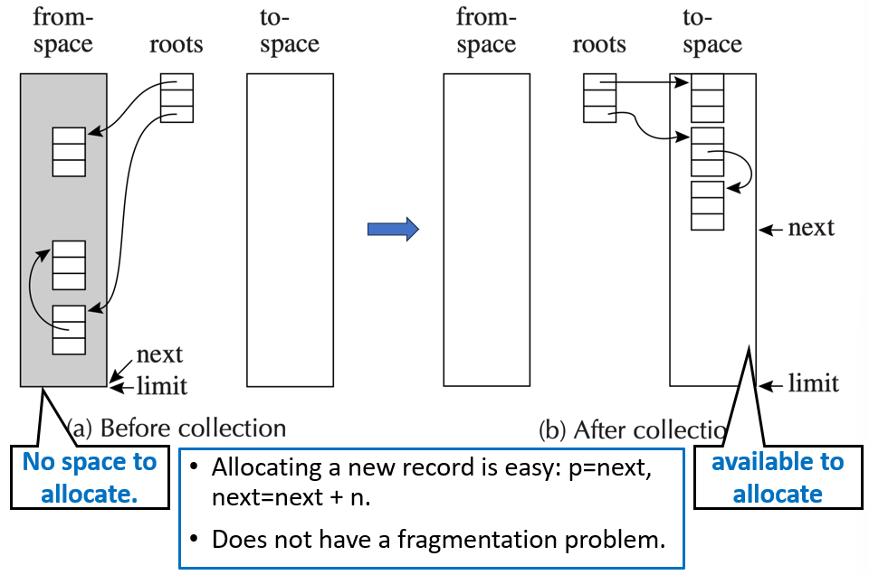
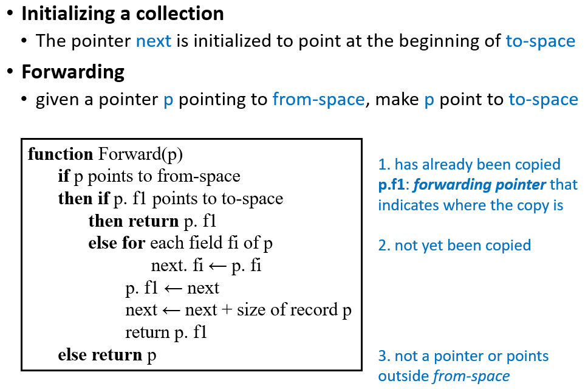
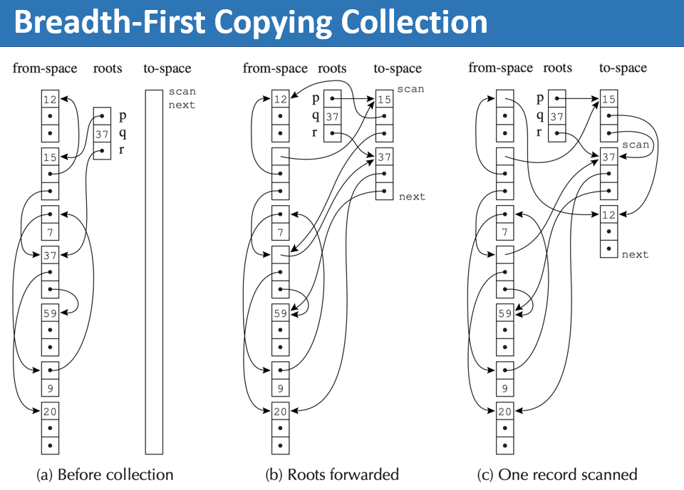
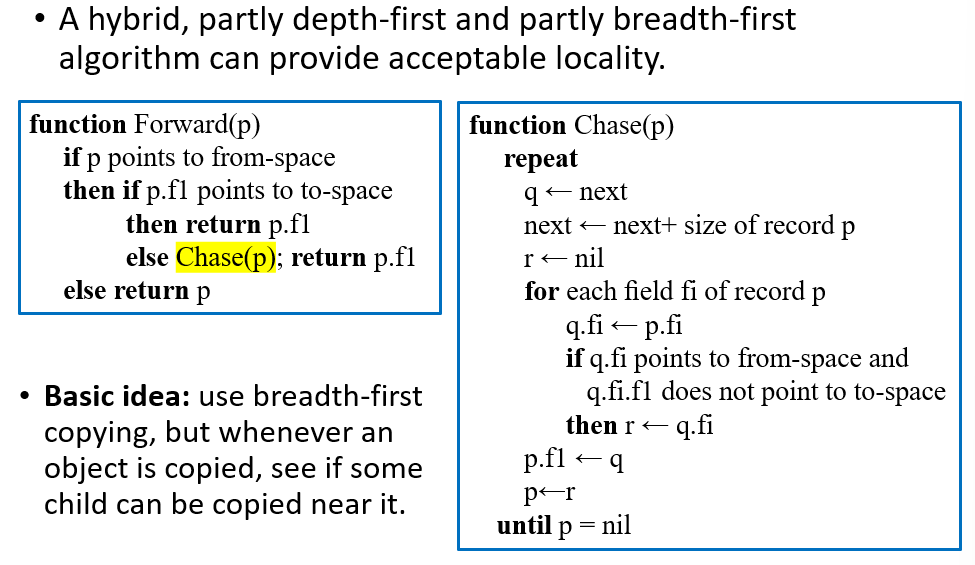

# 13 Garbage Collection

<!-- !!! tip "说明"

    本文档正在更新中…… -->

!!! info "说明"

    本文档仅涉及部分内容，仅可用于复习重点知识

automatic memory management 拥有自动内存管理，程序员不需要手动释放和分配内存

garbage 是指已经被分配但程序以后再也不会用到的内存对象。如果能准确知道一个对象未来是否会被使用，就可以完美回收，但是判断一个对象是否为垃圾是不可判定的，所以自动内存管理必须采用保守近似。实践中采用可达性来判断：从根（如全局变量、栈上的局部变量、寄存器）出发，沿着指针能访问到的对象即为可达，不可达的对象一定是垃圾

一个对象 x 是可达的，当且仅当：

1. 某个寄存器包含指向 x 的指针，或者：这是起点（根）。CPU 寄存器中存着对象 x 的地址
2. 另一个可达对象 y 包含指向 x 的指针：这是递归传播。如果 y 已经可达，且 y 里有一个字段指向 x，那么 x 也可达

garbage collection（垃圾回收）：在不显式调用释放函数的情况下，回收已分配但不再使用的存储空间的过程。垃圾回收不是由编译器执行，而是由运行时系统（与编译后的代码链接在一起的支撑程序）执行

## 1 Mark-and-Sweep Collection

<figure markdown="span">
  { width="300" }
</figure>

图的构成：

| 组成部分 | 对应实体 | 说明 |
| -- | -- | -- |
| 节点 | 堆上分配的对象（记录）+ 程序变量 | 每个对象和变量都是一个节点 |
| 有向边 | 指针引用 | 如果对象 A 中有一个指针指向对象 B，则画一条 A → B 的边 |
| 根 | 程序变量（包括栈上的局部变量、全局变量、寄存器等）| 这些是图的起点，不指向它们的节点（它们直接由程序持有）|

可以使用 DFS（深度优先搜索）从根节点出发遍历对象图，标记所有可达对象

```c linenums="1"
function DFS(x)
    if x 是一个指向堆内的指针
        if 记录 x 未被标记
            标记 x
            for 记录 x 的每个字段 f_i
                DFS(x.f_i)
```

任何未被标记的节点都一定是垃圾，应该被回收，sweep（清除）阶段的步骤：

1. 遍历整个堆：从堆的起始地址扫描到结束地址
2. 识别未标记节点：检查每个对象的标记位
3. 回收垃圾：将未标记的节点加入 freelist（空闲链表）
4. 清除标记：将所有已标记节点的标记位重置为未标记

空闲链表是用来管理可用内存空间的数据结构。每个被回收的垃圾节点变成空闲块，GC 把这些空闲块串成一个链表，后续分配新对象时，从空闲链表中取出一个足够大的块

<figure markdown="span">
  { width="600" }
</figure>

!!! tip "cost of garbage collection"

    时间成本：

    1. mark 阶段：DFS 搜索与标记的节点数量成正比
    2. sweep 阶段：与堆的大小（用 H 表示）成正比

    空间成本：递归 DFS 使用调用栈来保存返回地址和局部变量，每个函数调用会创建一个活动记录，最坏情况下，对象会形成一条长链表或深树。解决方法是使用 explicit stack（显式栈）：程序自己管理的一个数组 / 链表，用来模拟递归过程。这样空间开销就是 H 个字而不是 H 个活动记录

    ```c linenums="1"
    // t 是栈顶索引
    // stack 是工作列表
    function DFS(x)
        if x 是一个指针 且 记录 x 未被标记
            标记 x
            t ← 1
            stack[t] ← x
            while t > 0   // 栈非空
                x ← stack[t]; t ← t - 1
                for 记录 x 的每个字段 fi
                    if x.fi 是一个指针 且 记录 x.fi 未被标记
                        标记 x.fi
                        t ← t + 1; stack[t] ← x.fi
    ```

!!! tip "Pointer Reversal"

    指针反转的目标是：在 DFS 遍历过程中，不需要额外（或极少）栈空间，通过复用对象本身的指针字段来存储回溯信息

    在字段 x.fi 的内容被压入栈之后，算法将不会再访问原始位置 x.fi。一旦我们从对象 x 的某个字段 fi 出发，去访问它指向的子对象 y，在 DFS 过程中：我们会先深入处理 y 以及它的后代，在回到 x 之前，不会再访问 x.fi 的原值。因此，我们可以临时覆写 x.fi 的值，用来存储如何回到父节点的信息。等处理完子对象再恢复

    <figure markdown="span">
      { width="800" }
    </figure>

在动态内存管理中，内存会反复分配和释放，久而久之就会产生碎片问题。碎片降低了内存利用率，可能导致明明有足够的总空闲内存，却无法分配一个大对象。碎片分为两种：外部碎片和内部碎片

<figure markdown="span">
  { width="600" }
</figure>

## 2 Reference Counts

标记-清除垃圾回收，是从根出发遍历对象图，标记所有可达对象，然后扫描堆回收未标记的对象

引用计数是另一种完全不同的垃圾回收策略。我们可以直接记录每个对象被引用的次数，当引用计数降为 0 时立即回收

```c linenums="1"
// 遇到该指令
x.fi ← p
// 编译器会将其展开为以下步骤

// x.fi 原来指向的对象 z 的引用计数 - 1
z    ← x.fi
c    ← z.count
c    ← c − 1
z.count ← c
// 如果 z 的引用计数变为 0，立即回收 z
if c = 0 call putOnFreelist
// x.fi 新指向的对象 p 的引用计数 + 1
x.fi    ← p
c    ← p.count
c    ← c + 1
p.count ← c
```

当一个对象的引用计数降为 0 时，它会被立即回收（放到空闲链表）。而回收时，需要递归地减少它所指向的所有子对象的引用计数（因为这些子对象失去一个引用）。但我们可以延迟递归递减的工作，把它从“放进空闲链表时”推迟到“从空闲链表取出（重新分配）时”再做

```text linenums="1"
对象 Z 计数变为 0：
└── 只将 Z 加入空闲链表（不做递归递减）

后续：从空闲链表中取出 Z 重新分配时：
├── 对 Z 的每个字段 Z.fi：
│   ├── 减少 Z.fi 指向对象的计数
│   └── 如果其计数变为 0 → 放入空闲链表
└── 再将 Z 分配给新对象
```

这样做的优点：

1. 分散工作，减少暂停：如果立即递减，回收 1 个对象可能触发 N 个对象的递减，一次停顿 O(N)；如果延迟递减，会将这些工作平摊到未来的 N 次分配中 → 每次停顿 O(1)
2. 逻辑集中，易于维护：递归递减逻辑会统一放在分配器中。即分配器逻辑：取出空闲块 → 递归递减 → 分配使用

但引用计数存在两个问题：

1. reference cycle：当两个或多个对象互相引用，但没有外部指针指向它们时，每个对象的引用计数至少为 1，永远不会变成 0，因此永远无法被回收
2. 引用计数的增减开销大：每次指针赋值（包括参数传递、局部变量赋值、容器操作）都要修改引用计数，每次更新都要读写对象头部的引用计数字段（可能造成缓存未命中）等等

## 3 Copying Collection

复制式回收是一种同时解决碎片问题和循环引用问题的算法，它将堆内存逻辑上分为两个大小相等的半区：

1. From 空间：当前使用的区域
2. To 空间：空闲备用的区域

工作流程：

| 阶段 | From 空间 | To 空间 |
| -- | -- | -- |
| 正常运行 | 存放所有对象 | 完全空闲 |
| 触发 GC | 包含存活对象 + 垃圾 | 空闲 |
| 复制后 | 整个区域废弃 | 包含紧凑排列的存活对象副本 |
| GC 结束 | 清空（或等待下一次角色互换）| 成为新的 From 空间 |

算法步骤：

1. 从程序变量（根）出发，找到 From 空间中所有直接可达的对象
2. 从每个根开始，递归地遍历对象图：每遇到一个对象，在 To 空间中分配一个新副本，将原对象中的指针更新为指向 To 空间中的新地址，标记原对象已被复制（通常在原对象位置留下一个转发指针 forwarding pointer）
3. 将所有根指针从指向 From 空间改为指向 To 空间中的新对象
4. 原来的 From 空间整体变成不可达（因为所有根现在指向 To 空间），交换 From 和 To 的角色：现在的 To 空间变成下一次 GC 的 From 空间

<figure markdown="span">
  { width="600" }
</figure>

forward（转发）函数：让一个指向 From 空间的指针 p 指向 To 空间

<figure markdown="span">
  { width="600" }
</figure>

Cheney 算法复制式 GC 的一种经典实现，它使用广度优先搜索（BFS）来遍历对象图，并利用 To 空间本身作为 BFS 的队列，不需要额外的数据结构

1. scan：指向已扫描完的区域末尾（下一个要扫描的对象）
2. next：指向已复制的区域末尾（下一个新对象将放置的位置）
3. 队列 = [scan, next) 之间的区域（已复制但尚未扫描的对象）

```c linenums="1"
scan ← next ← to-space 的起始位置
对于每个根 r
    r ← Forward(r)
当 scan < next 时
    对于 scan 处记录的每个字段 fi
        scan.fi ← Forward(scan.fi)
    scan ← scan + scan 处记录的大小
```

<figure markdown="span">
  { width="600" }
</figure>

Cheney 算法使用广度优先遍历复制对象，导致逻辑上相关的对象（一个指向另一个）在物理内存中相距很远，该算法的局部性差

> 引用的局部性是指程序在短时间内倾向于访问相近的内存地址，分为时间局部性和空间局部性

有一种部分深度优先、部分广度优先的混合算法，可以提供可接受的局部性：

<figure markdown="span">
  { width="600" }
</figure>

若原始对象图为：

```text linenums="1"
A
├── B
│   ├── D
│   └── E
└── C
    └── F
```

标准 BFS（Cheney）布局：

```text linenums="1"
[A][B][C][D][E][F]
```

混合算法布局可能是：

```text linenums="1"
[A][B][D][C][E][F]
```

## 4 Interface to the Compiler

垃圾回收不是凭空工作的，它需要与编译器紧密配合。编译器在生成代码时，必须提供足够的信息和机制，让运行时垃圾回收器能够正确地识别对象、找到根，并在必要时与程序协同工作：

1. 生成分配记录的代码：创建对象时记录元数据（类型、大小等）
2. 描述根的位置：让 GC 能找到栈、寄存器、全局变量中的指针
3. 描述堆上数据记录的布局：让 GC 能遍历对象内部的指针字段
4. 生成读 / 写屏障（可选）：支持并发 / 增量 GC，保证正确性

---

分配一个大小为 N 的记录的步骤：

1. 调用 allocate 函数
2. 测试 next + N < limit（如果测试失败，调用 GC）
3. 将 next 移动到某个计算上有用的地方
4. 清零 M[next], M[next + 1], ..., M[next + N - 1]
5. next = next + N
6. 从 allocate 函数返回

其中第 1、6 步可以被内联优化；第 4 步可以通过存储关键信息来优化；而第 2、5 步是不可省略的

1. 第 2 步：必须确保分配不会超出 To 空间的边界，如果空间不足，必须触发 GC 来释放内存，这是安全性的保证
2. 第 5 步：next 必须始终指向下一个空闲位置，如果不更新，下次分配会覆盖刚分配的对象，这是正确性的保证

---

垃圾回收器需要确定每个记录中的字段数量，以及每个字段是否是指针。编译器需要向 GC 提供对象布局信息

对于静态类型语言（如 Tiger 或 Pascal）或面向对象语言（如 Java），让每个对象的第一个字指向一个特殊的类型描述符记录或类描述符记录（语义分析得到）。类型描述符或类描述符包含：对象的总大小、每个指针字段的位置

---

编译器需要为 GC 提供 Pointer Map（指针映射），指针映射是一份描述信息，告诉 GC：哪些变量包含指针、变量在哪里、哪些变量是活跃的。由于程序状态变化非常快，可以只在 GC-safe points（安全点）描述映射

安全点通常设在：调用 alloc 函数时或者任何函数调用时

---

GC 假设根指向对象的开头。但编译器优化可能会产生 Derived Pointer（派生指针，指向对象内部或对象外部的指针）