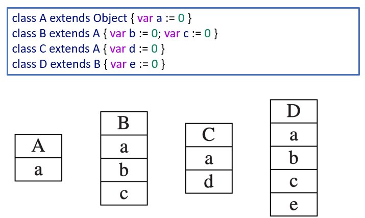
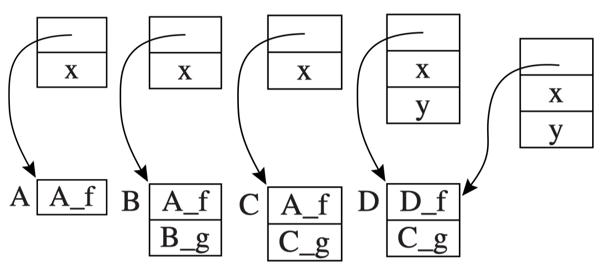
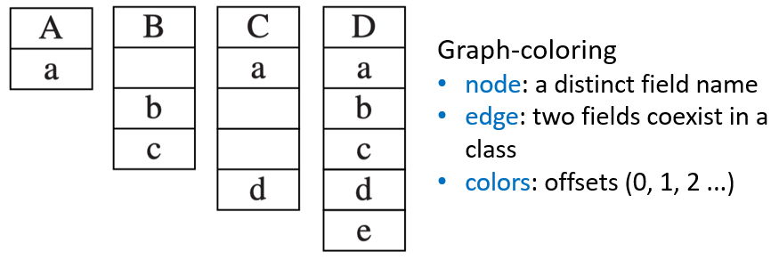
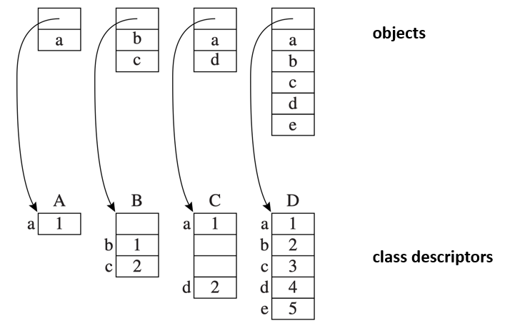

# 14 Object-Oriented Language

<!-- !!! tip "说明"

    本文档正在更新中…… -->

!!! info "说明"

    本文档仅涉及部分内容，仅可用于复习重点知识

## 1 Classes

```cpp linenums="1"
let start := 10
    class Vehicle extends Object {
        var position := start
        method move(int x) = (position := position + x)
    }

    class Truck extends Vehicle {
        method move(int x) =
            if x <= 55 
            then position := position + x
    }

    class Car extends Vehicle {
        var passengers := 0
        method await(v : Vehicle) =
            if (v.position < position)
            then v.move(position - v.position)
            else self.move(10)
    }

    var t := new Truck
    var c := new Car
    var v : Vehicle := c  // v 是 Vehicle 类型的变量，但实际指向 c
in
    c.passengers := 2; 
    c.move(60);
    v.move(70);
    c.await(t)
end
```

当我们写 `v.position` 时：编译器在编译时只知道 v 的静态类型是 Vehicle，它需要生成机器代码来从对象中读取 position 字段

如果编译器按最简单的方式处理，根据 position 在 Vehicle 对象中的偏移量生成代码，这在没有继承的语言中是可行的。但有了继承后，Car 继承自 Vehicle，但增加了自己的字段 passengers。对象的内存布局可能发生改变

## 2 Single Inheritance of Data Fields

对于字段来说，子类的内存布局将父类的部分放在前面，把自己的部分放在后面

<figure markdown="span">
  { width="600" }
</figure>

对于方法来说，方法本质上是函数，方法实例 Truck_move 的入口点位于机器代码标签 Truck_move 处

每个类描述符都包含一个指向其父类的指针，以及一个方法实例列表。当程序调用 `v.move(60)` 时，假设 v 实际指向一个 Car 对象，实际执行步骤是：

1. 从对象头部获取它的类描述符指针
2. 在类描述符的方法列表中查找 move 方法的入口地址
3. 如果找到了，就调用它
4. 如果没找到，就沿着父类指针往上找，直到找到为止

静态方法属于类本身，而不是属于某个对象实例

```cpp linenums="1"
class A extends Object {
    var x := 0
    static method f() { ... }

    class B extends A {
        method g() { ... }

        class C extends B {
            method g() { ... }
        }
    }
}
```

编译器处理 `c.f()` 调用时的步骤：

1. 找出 c 的静态类型（编译时已知的类）
2. 在 C 中查找 f
3. 如果没找到，向上查找父类 B，直到 Object
4. 一旦在某个祖先类 A 中找到 f，就编译成函数调用 A_f

调用动态方法时，实际执行哪个版本，取决于 c 运行时指向的对象类型，而不是编译时的静态类型

```cpp linenums="1"
class A extends Object {
    var x := 0
    method f() { ... }

    class B extends A {
        method g() { ... }

        class C extends B {
            method g() { ... }

            class D extends C {
                var y := 0
                method f() { ... }
            }
        }
    }
}
```

每个类的类描述符中都有一个方法表，它是一个数组/向量，按顺序存放该类所有非静态方法的入口地址。子类的方法表 = 父类的方法表 + 子类新增方法追加在后面

当执行 `c.f()` 时，编译后的代码执行以下指令：

1. 从对象 c 的偏移量 0 处获取类描述符 d
2. 从 d 的 f 偏移量处获取方法实例指针 p
3. 跳转到地址 p，同时保存返回地址

<figure markdown="span">
  { width="600" }
</figure>

## 3 Multiple Inheritance

对于字段来说，我们可以一次性静态分析所有类（使用图着色算法），为每个字段名找到一个在所有包含该字段的记录中都可以使用的偏移量

```cpp linenums="1"
class A extends Object { var a := 0 }
class B extends Object { var b := 0; var c := 0 }
class C extends A { var d := 0 }
class D extends A, B, C { var e := 0 }
```

<figure markdown="span">
  { width="600" }
</figure>

在类描述符的结构当中保留 empty slot，但在对象的结构中不保留空位

<figure markdown="span">
  { width="600" }
</figure>

对于方法来说，全局图着色方法同样适用，方法名可以与字段名一起混合，作为大型干涉图的节点。字段的描述符条目给出的是在对象内部的位置（偏移量），方法的描述符条目给出的是方法实例的机器代码地址

但全局图着色方案依赖于提前知道所有类，但许多现代语言运行时支持动态类加载，两者存在根本冲突

### 3.1 Hashing

哈希表方案的核心思想是：放弃编译时分配固定槽位，改为运行时通过哈希表动态查找

每个类的类描述符中包含两个哈希表：

1. Ktab (Key Table)：存储字段名的指针（字符串/符号）。用于冲突检测，确认哈希到的条目是否真的是要找的字段
2. Ftab (Field Table)：存储字段的偏移量或方法的入口地址。用于获取实际的访问信息

这两个表共享相同的哈希索引，配对使用

```text linenums="1"
Ktab 和 Ftab 按相同索引配对：
索引 0: Ktab[0] = "position"  ←→  Ftab[0] = 偏移量 4
索引 1: Ktab[1] = "passengers" ←→  Ftab[1] = 偏移量 8
索引 2: Ktab[2] = "move"      ←→  Ftab[2] = 方法地址
```

要获取对象 c 的字段 x，编译器生成如下代码：

1. 从对象 c 的偏移量 0 处获取类描述符 d
2. 从地址 d + Ktab + hash_x 处获取字段名 f
3. 测试 f 是否等于 ptr_x（即是否匹配）；如果匹配，则
4. 从 d + Ftab + hash_x 处获取字段偏移量 k
5. 从 c + k 处获取字段的值

## 4 Testing Class Membership

一些面向对象语言允许程序在运行过程中检查某个对象是否属于某个类

假设没有多重继承，实现 `x instanceof C` 的一种简单方法是在运行时生成执行以下循环的代码：

```cpp linenums="1"
t1 ← x.descriptor          // 获取 x 的类描述符
L1: if t1 = C goto true    // 如果当前类就是 C，返回 true
    t1 ← t1.super          // 否则沿着父类指针向上移动
    if t1 = nil goto false // 如果到达顶端（没有父类），返回 false
    goto L1                // 继续循环检查
```

但这个方法可能很慢。一种更快的方法是使用父类 Display 表

Display 表的思路：在类描述符中预先存储好整条继承链的快照，访问时直接通过索引获取任意祖先类，无需循环

每个类的类描述符中包含一个数组 `display[]`，按深度存储从根类 Object 到当前类的所有祖先

使用 Display 表判断 `x instanceof C`：

1. 获取 x 的类描述符 d
2. 获取 C 的深度 depth_C（编译时已知的常量）
3. 从 `d.display[depth_C]` 读取，如果等于 C 的描述符 → true，否则 false

关于 Type Coercions（类型强制转换），向上转型是安全的，而向下转型可能不安全

```cpp linenums="1"
b ← new B          // b 指向一个 B 对象
c ← b              // c 是 C 类型（C 继承 B），尝试把 B 赋值给 C
c.some_field_of_C_but_not_B  // 访问 C 独有的字段
```

## 5 Private Fields and Methods

私有性是在编译器的类型检查阶段静态地强制实施的。在类的符号表中，除了每个字段的偏移量和每个方法的偏移量之外，还有一个布尔标志，用于指示该字段或方法是否为私有的