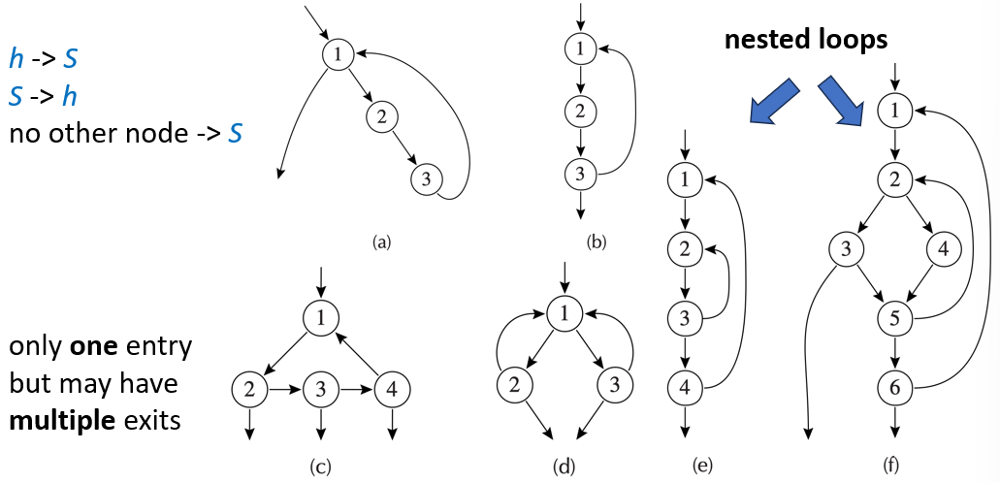
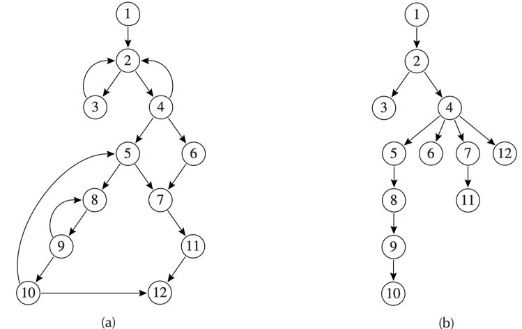
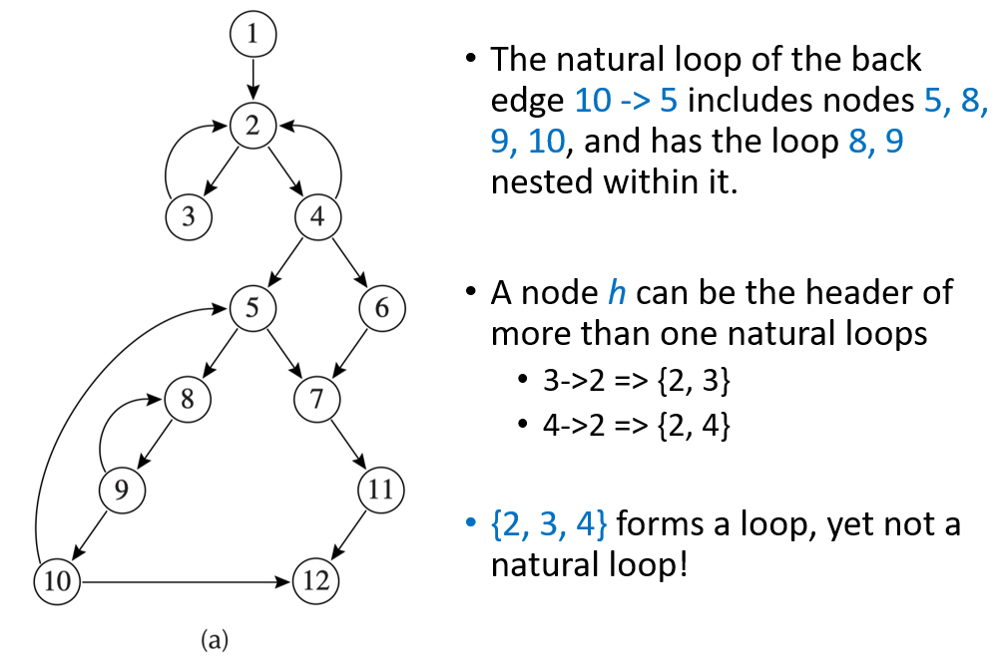
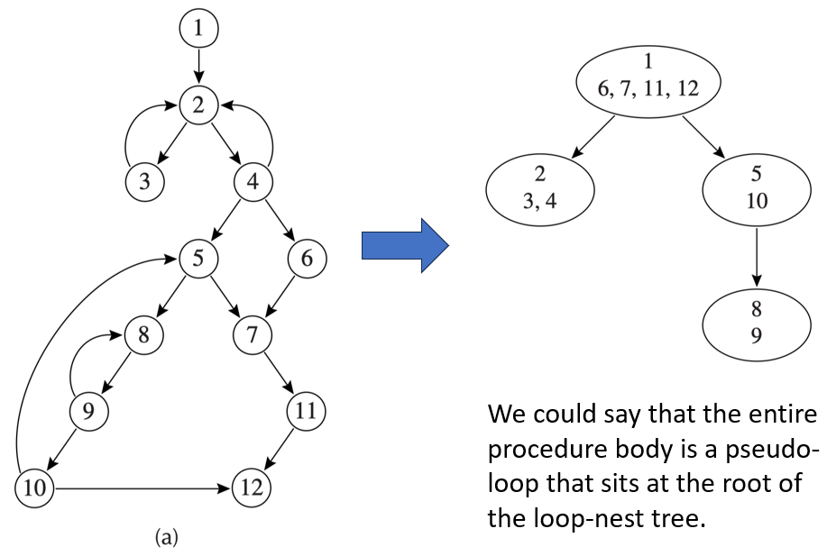
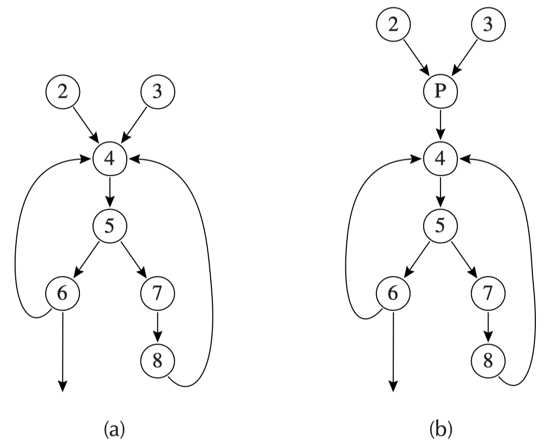
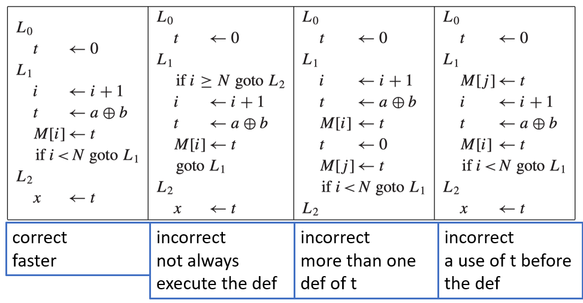

# 18 Loop Optimizations

!!! warning "注意"

    本文档已停止更新

!!! info "说明"

    本文档仅涉及部分内容，仅可用于复习重点知识

控制流图中的循环是包含一个头节点 h 的节点集合 S，且满足以下性质：

1. 从 S 中任意节点出发，都存在有向边的路径到达 h
2. 从 h 出发，存在有向边的路径到达 S 中任意节点
3. 不存在从 S 外部任意节点到 S 内部任意节点（除了 h 以外）的边

---

- loop entry 节点：其 predecessor 节点在 loop 之外
- loop exit 节点：其 successor 节点在 loop 之外

<figure markdown="span">
  { width="600" }
</figure>

## 1 Dominators

dominator：如果从起始节点 s0 到节点 n 的每一条有向边路径都必须经过节点 d，则称节点 d 支配节点 n

1. 入口节点支配所有节点
2. 每个节点都支配它自身
3. 一个节点 n 可以有多个支配节点

寻找支配节点的算法：

1. 对于起始节点：$D[s_0] = \lbrace s_0 \rbrace$
2. 对于其他节点，先假设所有节点都可能是它的支配者，然后通过迭代逐步删减：$D[n] = \lbrace n \rbrace \cup (\bigcap\limits_{p \in pred[n]} D[p])$

!!! tip "定理"

    在一个连通图中，如果节点 d 支配节点 n，并且节点 e 也支配节点 n，那么必然有：要么 d 支配 e，要么 e 支配 d

每个节点 n（除了起始节点 s0 之外）都恰好有一个 immediate dominator（直接支配节点），记作 idom(n)，它满足以下条件：

1. idom(n) 不是节点 n 本身
2. idom(n) 支配节点 n
3. idom(n) 不支配节点 n 的任何其他支配节点

<figure markdown="span">
  { width="600" }
</figure>

back edge（回边）：在流图中，从节点 n 到节点 h 的一条边，如果 h 支配 n，则称这条边为回边

一条回边 n → h 的 natural loop（该循环的头部就是 h），是指满足以下条件的节点 x 的集合：

1. h 支配 x
2. 存在一条从 x 到 n 的路径，且该路径不经过 h

<figure markdown="span">
  { width="600" }
</figure>

nested loop（嵌套循环）：如果 A 和 B 是两个循环，其头部分别为 a 和 b，且满足 a ≠ b，并且 b 属于 A（即 b 是 A 中的一个节点），那么 B 的所有节点都是 A 的节点的真子集。此时我们说，循环 B 嵌套在循环 A 内部，或者说 B 是内层循环

<figure markdown="span">
  { width="600" }
</figure>

很多优化技术需要在循环体之外、紧挨着循环之前的位置插入代码。最典型的例子就是 loop-invariant hoisting（循环不变式外提）：如果循环内部某个表达式的值在每次迭代中都不变，那么把它移到循环外面只计算一次，可以大幅提升性能

<figure markdown="span">
  { width="600" }
</figure>

## 2 Loop-Invariant Computations

在循环内部，有一条计算语句 $t=a⊕b$，如果参与运算的两个操作数 a 和 b 在循环的每一次迭代中值都不变，那么计算结果 t 也必然不变。既然 t 不变，就没有必要在循环内部重复计算，可以把它移到循环之前执行一次，这就是循环不变式外提

将语句 $d:t←a⊕b$ 外提到循环前置头末尾，需要满足以下条件：

1. d 支配所有 t 处于活跃状态的循环出口
2. 循环内对 t 的定值只有这一个
3. t 在循环前置头出口处不是活跃的

<figure markdown="span">
  { width="600" }
</figure>

## 3 Induction Variables

归纳变量是在循环中每次迭代都会按固定步长变化的变量

- 基本归纳变量：指在循环中只会通过固定的增量 / 减量进行更新的变量
- 派生归纳变量：指其值可以由基本归纳变量通过线性表达式计算得到的变量

```cpp linenums="1"
L₁: if i ≥ n goto L₂
    j ← i · 4          // 每次迭代都计算乘法
    k ← j + a          // 加法
    x ← M[k]           // 数组访问
    s ← s + x
    i ← i + 1
    goto L₁
L₂:
```

可以将乘法替换为加法

```cpp linenums="1"
L₁: if i ≥ n goto L₂
    x ← M[k]           // 直接用 k 访问数组
    s ← s + x
    i ← i + 1
    j ← j + 4          // 用加法代替乘法
    k ← k + 4          // 因为 j 增加 4，k 也增加 4
    goto L₁
L₂:
```

线性归纳变量：在循环的每次迭代中，该变量的增量是恒定的

线性归纳变量可以安全地进行强度削弱（将乘法替换为加法），非线性归纳变量不能简单地用增量加法替换，因为增量不是固定的

```cpp linenums="1"
// 如果走 L2 路径，j 不变，j 不是线性归纳变量
s ← 0
L₁ : if s > 0 goto L₂
     i ← i + b
     j ← i · 4
     x ← M[j]
     s ← s - x
     goto L₁
L₂ : i ← i + 1
     s ← s + j
     if i < n goto L₁
```

## 4 Array-Bounds Checks

## 5 Loop Unrolling