# 2 Lexical Analysis

!!! tip "说明"

    本文档正在更新中……

<figure markdown="span">
  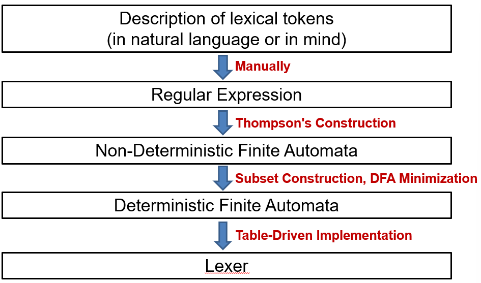{ width="600" }
</figure>

## 1 Lexical Token

词法单元：词法分析的结果。它是源代码中最小的、有独立意义的单位。在这里，词法单元就充当了终结符的角色，语法分析器会直接处理这些词法单元，而不会关心它们内部的单个字符

<figure markdown="span">
  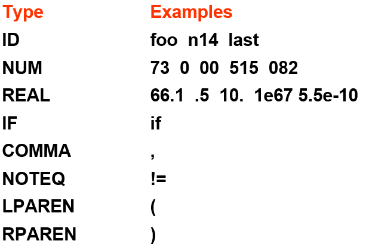{ width="600" }
</figure>

非词法单元：

1. 注释
2. 预处理指令：`#include<stdio.h>`
3. 宏定义
4. 空格、制表符和换行

<figure markdown="span">
  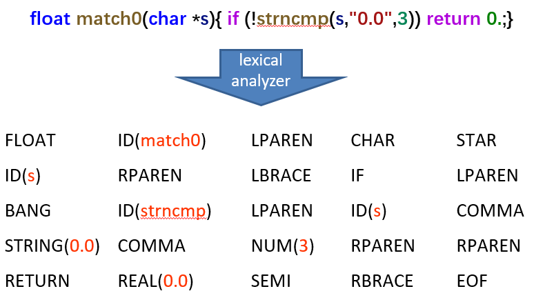{ width="600" }
</figure>

## 2 Regular Expression

<figure markdown="span">
  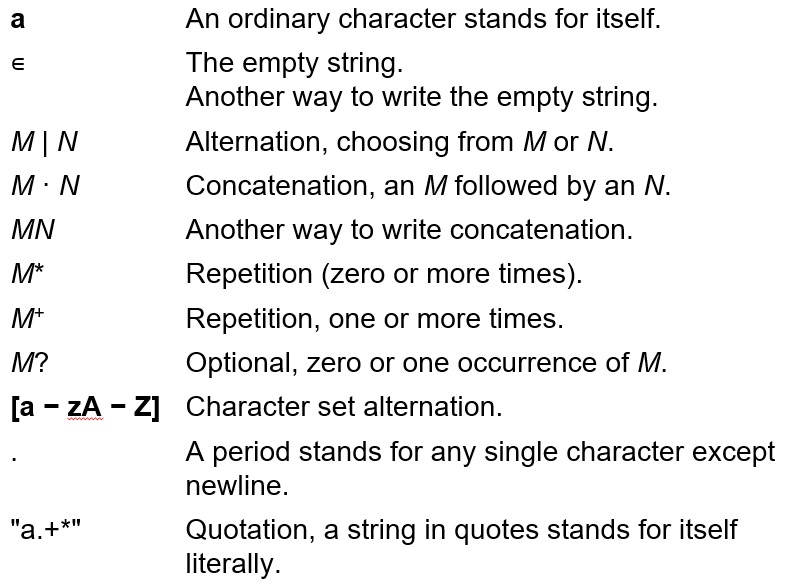{ width="600" }
</figure>

<figure markdown="span">
  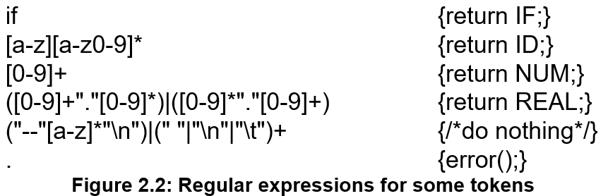{ width="600" }
</figure>

当输入字符串可能被多种规则匹配时，两条重要的歧义消除规则决定了最终的选择：

1. longest match：从输入的开头开始，能够与任意正则表达式匹配的最长初始子字符串，将被作为下一个词法单元
2. rule priority：对于某一个特定的最长初始子字符串，第一个能够匹配它的正则表达式决定了它的词法单元类型。这意味着编写正则表达式规则的顺序非常重要

对于 `if8` 来说，最长匹配规则会将 `if8` 视作一个 token，因此 `if8` 被识别为 ID

对于 `if` 来说，关键字规则 `if` 和标识符规则都能匹配，但关键字规则在前，所以会采用前者，将 `if` 识别为 IF

## 3 Finite Automata

<figure markdown="span">
  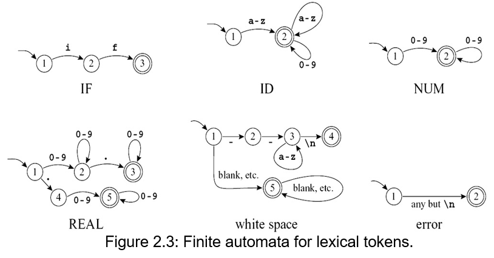{ width="600" }
</figure>

<figure markdown="span">
  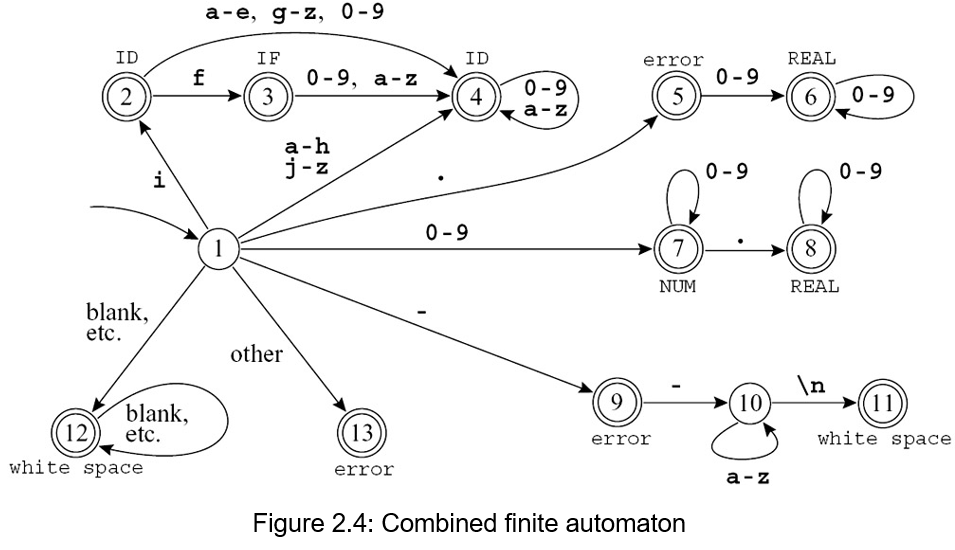{ width="600" }
</figure>

有了 DFA，我们就可以生成出 lexer（词法分析器）。使用一个 transition matrix

<figure markdown="span">
  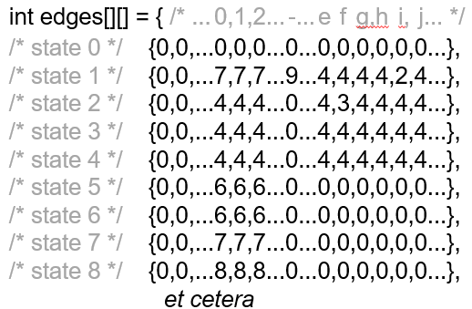{ width="600" }
</figure>

词法分析器如何做到识别最长匹配：词法分析器通常使用一个状态机，当它逐个读取输入字符并转换状态时，它会记录关键信息，维护两个变量来记住到目前为止找到的最长的有效 token

1. Last-Final：记录最近一次进入一个 **最终状态**（表示识别出一个完整 token，在 DFA 上表现为一个终止状态）的状态编号
2. Input-Position-at-Last-Final：记录当时读取到输入字符串的哪个位置

<figure markdown="span">
  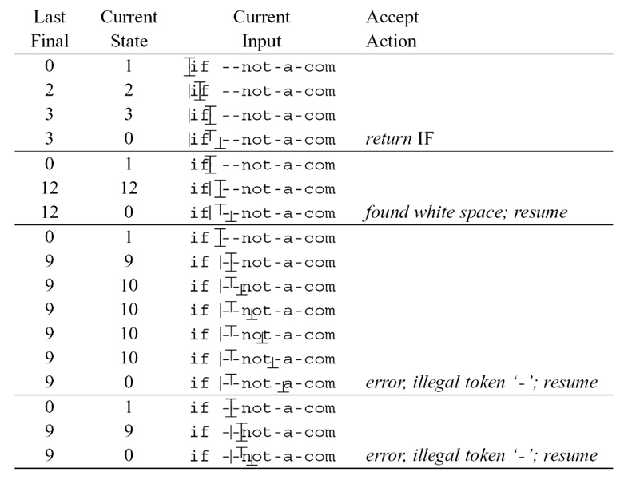{ width="600" }
</figure>

## 4 Nondeterministic Finite Automata

从 regular expression 转换到 NFA：

<figure markdown="span">
  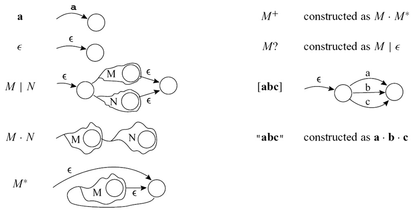{ width="600" }
</figure>

从 NFA 转换到 DFA：[计算理论 - 2 Finite Automata - 2 Nondeterministic Finite Automata](../computational_theory/ch2.md#2-nondeterministic-finite-automata){:target="_blank"}

化简 DFA 成 minimum-state DFA：

1. 首先将所有状态分成两组：终止状态和非终止状态。因为终止状态和非终止状态肯定不等价
2. 细化分组：重复此步骤，直到无法再进行任何分裂

    1. 对于组内的两个状态 s 和 t，如果在每一个可能的输入符号下，它们跳转到的状态都属于同一个分组，那么 s 和 t 目前看起来是等价的，可以暂时留在同一组
    2. 如果存在某个输入符号，使得 s 和 t 跳转到的状态属于不同的现有分组，那么 s 和 t 就是不等价的，必须将这个组分裂成更小的组

3. 此时，每个分组内部的所有状态对于所有输入符号的行为都完全一致。据此构建最小化 DFA

<figure markdown="span">
  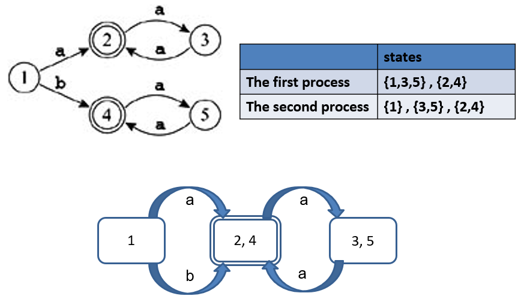{ width="600" }
</figure>

## 5 Lex

Lex 程序的输入是一个文本文件，通常以 `.l` 为后缀。这个文件主要包含两部分信息：

1. 正则表达式：用来描述词法规则
2. actions：与每个正则表达式相关联的 C 代码片段。当词法分析器识别出某个正则表达式匹配的字符串时，就会执行对应的动作

Lex 处理输入文件后，会生成一个名为 `lex.yy.c` 的 C 源代码文件。这个文件的核心是一个名为 `yylex` 的函数。`yylex` 函数的本质是一个由表格驱动的 DFA 的实现。这意味着 Lex 已经将用户提供的正则表达式转换成了一个高效的状态机，并嵌入到了生成的代码中。它的行为就像一个 getToken 过程：每当被调用时，它就从输入流中读取字符，运行这个状态机，找到匹配的最长字符串，然后执行相应的动作

```c linenums="1"
%{
/*
 * 声明区：这里包含直接的 C 代码，会被原样复制到生成的 lex.yy.c 文件的开头
 */
#include <stdio.h>
#include <stdlib.h>

/* 定义一些 Token 常量，通常放在单独的头文件中，这里为了示例直接定义 */
#define TOKEN_INTEGER 1000
#define TOKEN_PLUS    1001
#define TOKEN_MINUS   1002
#define TOKEN_MULT    1003
#define TOKEN_DIV     1004
#define TOKEN_UNKNOWN 1999

int line_num = 1;  /* 记录行号 */
%}

/* 定义区：这里用正则表达式定义一些名字，方便在规则区引用 */
digit       [0-9]
integer     {digit}+
whitespace  [ \t]+
newline     \n

%%

/* 规则区：格式为 "模式   { 动作 }" */

{integer}        {
                    printf("行 %d: 识别到整数 - %s (Token: %d)\n", 
                           line_num, yytext, TOKEN_INTEGER);
                    return TOKEN_INTEGER;
                 }

"+"              {
                    printf("行 %d: 识别到加号 (Token: %d)\n", 
                           line_num, TOKEN_PLUS);
                    return TOKEN_PLUS;
                 }

"-"              {
                    printf("行 %d: 识别到减号 (Token: %d)\n", 
                           line_num, TOKEN_MINUS);
                    return TOKEN_MINUS;
                 }

"*"              {
                    printf("行 %d: 识别到乘号 (Token: %d)\n", 
                           line_num, TOKEN_MULT);
                    return TOKEN_MULT;
                 }

"/"              {
                    printf("行 %d: 识别到除号 (Token: %d)\n", 
                           line_num, TOKEN_DIV);
                    return TOKEN_DIV;
                 }

{whitespace}     {
                    /* 忽略空格和制表符，不执行任何动作，也不返回 Token */
                    /* 留空即可 */
                 }

{newline}        {
                    line_num++;  /* 增加行号计数 */
                 }

.                {
                    /* 匹配任何其他单个字符（即无法识别的字符） */
                    printf("行 %d: 无法识别的字符: %s (Token: %d)\n", 
                           line_num, yytext, TOKEN_UNKNOWN);
                    return TOKEN_UNKNOWN;
                 }

%%

/*
 * 用户代码区：这里可以写任何 C 代码
 */

int main(int argc, char *argv[]) {
    if (argc < 2) {
        printf("用法: %s <输入文件>\n", argv[0]);
        return 1;
    }
    
    /* 打开输入文件，Lex 默认从 yyin 读取输入 */
    FILE *input_file = fopen(argv[1], "r");
    if (!input_file) {
        perror("无法打开文件");
        return 1;
    }
    yyin = input_file;
    
    /* 调用词法分析器，直到返回 0 表示文件结束 */
    int token;
    while ((token = yylex()) != 0) {
        /* 这里可以处理返回的 token，但已经在动作中打印了信息 */
        /* 如果 token 是错误或需要停止，可以加判断 */
    }
    
    fclose(input_file);
    printf("词法分析完成，共处理 %d 行。\n", line_num);
    return 0;
}

/* 
 * yywrap 函数：Lex 在文件结束时调用此函数
 * 返回 1 表示没有更多输入文件要处理
 */
int yywrap(void) {
    return 1;
}
```