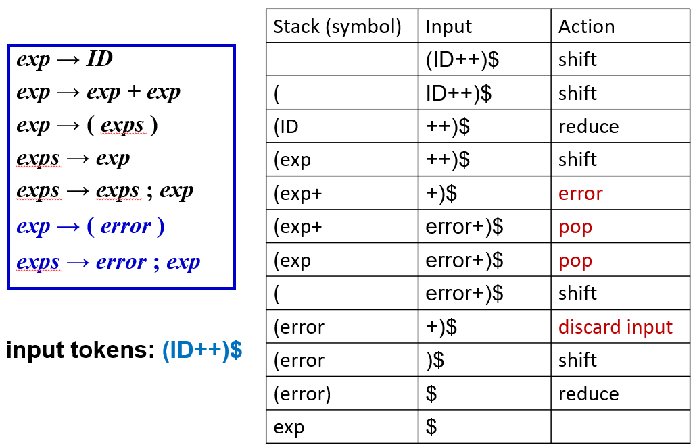
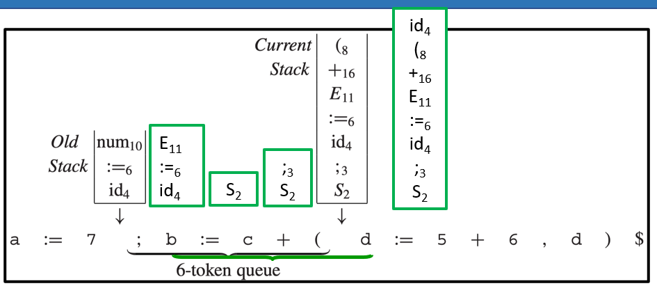
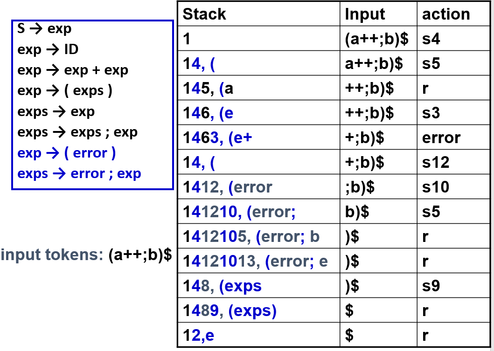

# 3 Parsing

<!-- !!! tip "说明"

    本文档正在更新中…… -->

!!! info "说明"

    本文档仅涉及部分内容，仅可用于复习重点知识

<figure markdown="span">
  { width="600" }
</figure>

## 1 Context-Free Grammars

### 1.1 Ambiguity

<figure markdown="span">
  { width="600" }
</figure>

一个 grammar 如果分析一个字符串能得到两个 parse trees，就说明它是 ambiguous

<figure markdown="span">
  { width="600" }
</figure>

## 2 Top-Down Parsing

通用的 CFG 解析算法虽然能处理所有文法，但效率很低，甚至占编译时间的 1/3，因此实际编译器中会使用针对特定文法的专用算法来提高效率

递归下降分析：从起始符号开始，尝试根据输入内容选择相应的产生式展开，递归地匹配输入。它是预测性的，意味着在每一步，只需看当前输入的一个符号就能决定用哪条产生式。虽然实现简单，但它只能处理 LL(1)（Left-to-right parse; Leftmost-derivation; 1 symbol lookahead）文法（即一种确定性的、无需回溯的文法）

<figure markdown="span">
  { width="600" }
</figure>

<figure markdown="span">
  { width="600" }
</figure>

但是存在一个问题：

<figure markdown="span">
  { width="600" }
</figure>

这就需要 predictive parsing

### 2.1 Predictive Parsing

预测性分析的基本要求：在自顶向下分析中，解析器需要根据当前输入的第一个符号来决定使用哪条产生式。这就要求，对于同一个非终结符的不同产生式，它们的首终结符集合（FIRST 集）必须互不相交。否则解析器就无法确定该选哪一条

为了让文法适用于预测性分析，需要先计算每条产生式的 FIRST 集（即该产生式可能推导出的第一个终结符）。如果冲突存在，就需要改写文法，通常的做法是消除左递归并进行左公因子提取，使得每个非终结符的各个产生式的 FIRST 集互不相交

#### 2.1.1 FIRST and FOLLOW Sets

1. FIRST 集：对于任意文法符号串 $γ$，FIRST($γ$) 是所有可能从 $γ$ 推导出的字符串的第一个终结符的集合
2. FOLLOW 集：对于非终结符 $X$，FOLLOW($X$) 是所有可能紧跟在 $X$ 后面出现的终结符的集合
3. NULLABLE 集：如果一个非终结符能推出空字符串，那么它就属于 NULLABLE 集

那么对于非终结符 $X$，产生式 $X → γ$，可能的首终结符可以是：

1. 来自 FIRST($γ$) 的终结符
2. 如果 $γ$ 可以推导出空串，那么 FOLLOW($X$) 中的任何记号也可以作为首终结符

$$
FIRST(X)=
\begin{cases}
    \lbrace X \rbrace & \text{如果} X \text{是终结符}\\
    FIRST(X) \cup FIRST(Y_1Y_2\cdots Y_k) & \text{如果} X \text{是非终结符并且} X \rightarrow Y_1Y_2\cdots Y_k
\end{cases}
$$

$$
FOLLOW(X)=
\begin{cases}
    FOLLOW(X) \cup FIRST(\beta) & \text{if } Y \rightarrow \alpha X\beta\\
    FOLLOW(X) \cup FOLLOW(Y)& \text{if } Y \rightarrow \alpha X \beta \text{ and } \beta \rightarrow \epsilon
\end{cases}
$$

<figure markdown="span">
  { width="800" }
</figure>

#### 2.1.2 Predictive Parsing Tables

<figure markdown="span">
  { width="800" }
</figure>

表中空白的格子即代表语法错误（syntax errors）

LL(1) 文法的核心特征是：预测分析表中每个格子最多只有一条产生式

如果一个格子里有两条或更多产生式，说明在某个非终结符下，仅凭一个向前看符号无法唯一确定使用哪条产生式，这样的文法就不是 LL(1)

LL(k) 分析表：当向前看符号数量增加到 k 时，列不再对应单个终结符，而是对应所有可能的长度为 k 的终结符序列。例如，如果文法有终结符 a、b、c，那么 LL(2) 分析表的列就会是：aa、ab、ac、ba、bb、bc、ca、cb、cc 等

如果某个文法是 LL(k)，那么它也是 LL(k + n) (n ≥ 0)

#### 2.1.3 Stack-Based Implementation

<figure markdown="span">
  { width="800" }
</figure>

#### 2.1.4 Eliminate Left-Recursion

<figure markdown="span">
  { width="600" }
</figure>

<figure markdown="span">
  { width="600" }
</figure>

<figure markdown="span">
  { width="600" }
</figure>

## 3 Bottom-Up Parsing

LL(k) 语法分析是一种自顶向下的解析方法，它从左到右扫描输入，进行最左推导，并向前看 k 个记号来决定使用哪条产生式。它的优点是效率高、易于手工实现

LL(k) 的局限性：它必须仅凭产生式右部的前 k 个记号来决定使用哪条产生式，无法回退或试探其他可能性。如果两条产生式的前 k 个记号相同，就会发生冲突

<figure markdown="span">
  { width="600" }
</figure>

LR(k)（Left-to-right parse, Rightmost derivation, k-token lookahead）解析是一种自底向上的语法分析方法。它从左到右读取输入，并尝试反向构造最右推导（即通过归约操作将输入串逐步规约为起始符号）。LR(k) 可以推迟决策，直到看到产生式右部的全部内容，因此能处理更多类型的文法，包括左递归文法

<figure markdown="span">
  { width="600" }
</figure>

### 3.1 LR(0) Parsing

<figure markdown="span">
  { width="600" }
</figure>

将 NFA 转换为 DFA：

<figure markdown="span">
  { width="600" }
</figure>

<figure markdown="span">
  { width="600" }
</figure>

<figure markdown="span">
  { width="800" }
</figure>

<figure markdown="span">
  { width="600" }
</figure>

<figure markdown="span">
  { width="600" }
</figure>

### 3.2 SLR Parsing

LR(0) 存在 shift-reduce conflicts

<figure markdown="span">
  { width="600" }
</figure>

SLR 仅当输入符号属于 FOLLOW(A) 时才放置归约动作

<figure markdown="span">
  { width="600" }
</figure>

但 SLR 仍存在一些冲突

<figure markdown="span">
  { width="600" }
</figure>

### 3.3 LR(1) Parsing

<figure markdown="span">
  { width="600" }
</figure>

<figure markdown="span">
  { width="600" }
</figure>

<figure markdown="span">
  { width="600" }
</figure>

### 3.4 LALR(1) Parsing

规范 LR(1) 解析器为每个项目（产生式加位置）记录不同的向前看符号，导致状态数量可能非常大。对于实际编程语言的文法，LR(1) 状态数可能成百上千，导致解析表占用大量内存

在 LR(1) 项目集族中，经常出现两个状态：它们的核心项目（产生式和点的位置）完全相同，只是向前看符号集不同。LALR(1) 将这些状态合并为一个状态，将向前看符号集取并集

合并后状态数大幅减少，与 SLR(1) 或 LR(0) 的状态数相当，内存占用更小，解析表更紧凑。但可能引入新的归约-归约冲突（原本因向前看符号不同而可区分的归约动作可能冲突），但在实际编程语言文法中这种情况极少发生

<figure markdown="span">
  { width="600" }
</figure>

<figure markdown="span">
  { width="600" }
</figure>

### 3.5 LR Parsing of Ambiguous Grammars

大多数编程语言的文法规则都包含类似这样的形式：

$$
S \rightarrow \text{if } E \text{ then } S \text{ else } S\\
S \rightarrow \text{if } E \text{ then } S\\
S \rightarrow \text{other}
$$

几乎所有主流语言都规定 `else` 与最近的未匹配 `then` 结合。因此在遇到 `if E then S` 后面跟着 `else` 产生的冲突时，通常会选择 shift，将 `else` 读入，与内层 `then` 匹配

<figure markdown="span">
  { width="600" }
</figure>

## 4 Yacc

Yet Another Compiler-Compiler 是一个自动生成解析器的工具。输入一个 `.y` 文件（语法规范文件），输出一个 C 源文件（通常是 `tab.c`），包含一个 LALR 解析器

```cpp linenums="1"
%{
#include <stdio.h>
#include <ctype.h>
int yylex(void);
int yyerror(char *s);
%}

%token NUMBER

%%
command : exp { printf("%d\n", $1); }
;

exp : exp '+' term { $$ = $1 + $3; }
    | exp '-' term { $$ = $1 - $3; }
    | term { $$ = $1; }
;

term : term '*' factor { $$ = $1 * $3; }
     | factor { $$ = $1; }
;

factor : NUMBER { $$ = $1; }
       | '(' exp ')' { $$ = $2; }
;
%%

int main() { return yyparse(); }
int yylex() { /* 词法分析实现 */ }
int yyerror(char *s) { fprintf(stderr, "%s\n", s); return 0; }
```

1. `yylex()`：词法分析器。Yacc 会调用 `yylex()` 获取下一个 token。返回 token 类型。全局变量 `yylval` 用于存储 token 的语义值
2. `yyparse()`：解析器入口。由 Yacc 自动生成。返回 0 表示成功，1 表示失败
3. ` yyerror()`：错误处理函数。当解析出错时被调用

每条规则后可以用 `{ ... }` 写 C 代码，使用伪变量：

1. `$$`：左部的语义值
2. `$1`、`$2`、...：右部第 `i` 个符号的语义值

返回的 token 类型可能不同（如整数、浮点数、操作符），可使用 `%union` 和 `%type`

1. `%union` 定义可存储的类型
2. `%type <类型名>` 指定非终结符的类型
3. `%token <类型名>` 指定终结符的类型

```cpp linenums="1"
%union {
    double val;
    char op;
}

%token <val> NUMBER
%type <val> exp term
%type <op> op
```

Embedded Actions（嵌入动作）在规则中间执行代码，用于记录上下文信息，比如变量类型

```cpp linenums="1"
decl : type { current_type = $1; } var_list ;
type : INT { $$ = INT_TYPE; }
     | FLOAT { $$ = FLOAT_TYPE; }
;
```

Yacc 的冲突处理：

1. shift-reduce 冲突：默认选择 shift
2. reduce-reduce 冲突：默认选择第一个规则

优先级与结合性指令：

```cpp linenums="1"
%left PLUS MINUS
%left TIMES DIV
%right EXP
%nonassoc EQ NEQ
```

1. `%left`：左结合，遇到冲突时 reduce
2. `%right`：右结合，遇到冲突时 shift
3. `%nonassoc`：不允许连续出现

`%prec` 指令：用于为规则显式指定优先级（如负号）

```cpp linenums="1"
// 在 -6 * 8 中，-6 会被优先结合成 (-6)，然后再与 8 进行乘法运算

%token INT PLUS MINUS TIMES UMINUS
%start exp
%left PLUS MINUS      // 左结合，优先级最低
%left TIMES           // 左结合，优先级中等
%left UMINUS          // 左结合，优先级最高（实际是占位符）
%% 
exp : INT
    | exp PLUS exp
    | exp MINUS exp
    | exp TIMES exp
    | MINUS exp %prec UMINUS   // 这条规则使用 UMINUS 的优先级
```

## 5 Error Recovery

### 5.1 Local Error Recovery

使用特殊 token `error`

```cpp linenums="1"
exp : '(' error ')'
exps : error ';' exp
```

解析器会：

1. 弹出栈直到可 shift `error`
2. shift `error`
3. 跳过输入直到同步点（如 `;` 或 `)`）

<figure markdown="span">
  { width="600" }
</figure>

### 5.2 Global Error Repair

Burke-Fisher 错误修复是一种局部错误修复策略：它只在错误位置之前最多 K 个词法单元的范围内尝试修复

1. 插入一个词法单元
2. 删除一个词法单元
3. 替换一个词法单元为另一个

且每次只改一个词法单元（单点修复）

修复的度量标准是修复后，解析器能继续前进多远。越过原始错误点之后解析的额外词法单元数越多，修复越好。如果给定阈值 $R=4$，意味着如果能继续解析 4 个以上的词法单元，就认为修复足够好，不再尝试其他修复

为了实现回退 K 个词法单元并重解析，我们需要维护两个栈和一个 token 队列

1. 当前栈：正常解析的主栈，代表现在的解析状态
2. 旧栈：保存过去的解析状态，用于错误发生后回退重试
3. token 队列：队列大小为 K，保存最近移入的 K 个词法单元。队列就像一个滑动窗口，新词法单元进入尾部，最老的词法单元从头部移出，进入旧栈

两个栈同步维护，但旧栈总是落后当前栈 K 个词法单元。这样，当错误发生时，我们可以从旧栈的状态开始，尝试不同的修复，而不影响当前解析

当解析器在当前词法单元处检测到语法错误时，析器不会报错退出，而是启动 Burke-Fisher 修复流程，在队列（大小为 K 的滑动窗口）中的任意位置进行尝试修复

<figure markdown="span">
  { width="600" }
</figure>

在 Burke-Fisher 修复过程中：解析器会反复尝试各种插入/删除/替换，每次尝试都会导致移入和归约（在副本上），归约动作通常关联语义动作，但有时语义动作会有副作用

```cpp linenums="1"
// 在语义动作中
{ nest++; $$ = $1 + $3; }   // nest + 1
{ nest--; $$ = $1 - $3; }   // nest - 1
```

如果这些动作在尝试性解析中被执行，尝试失败后，`nest` 的值已经改变了，无法撤销这些副作用，最终错误恢复时状态不一致

解决方案：当前栈上的归约只更新解析状态，不调用语义动作，这些归约被记录下来，当同一个归约后来在旧栈上执行时，才真正执行语义动作

当必须插入数字或标识符这类词法单元时，它们的语义值由 `%value` 指令指定：

```cpp linenums="1"
%value ID ("bogus")    // 插入 ID 时，使用 "bogus" 作为变量名
%value INT (1)         // 插入 INT 时，使用 1 作为数值
%value STRING ("")     // 插入 STRING 时，使用空字符串
```

有时，某一种特定的单词法单元插入或替换非常常见，应该优先尝试。`%change` 指令让程序员告诉解析器，这些修复应该优先尝试

```cpp linenums="1"
%change EQ -> ASSIGN
      | ASSIGN -> EQ
      | SEMICOLON ELSE -> ELSE
      | -> IN INT END  // 自动补全 Tiger 语言的 let ... end 结构
```

<figure markdown="span">
  { width="600" }
</figure>