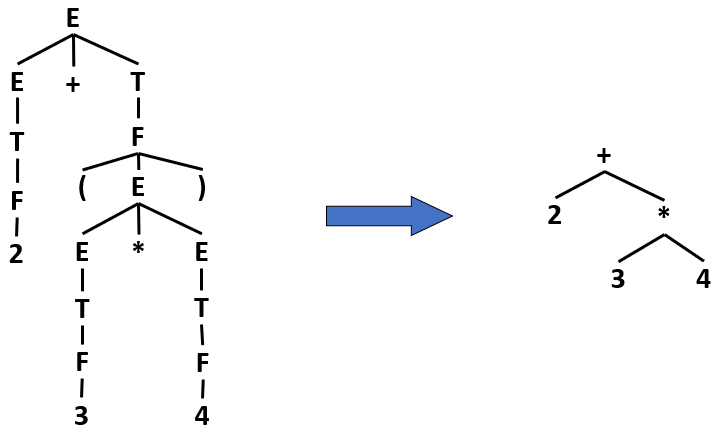
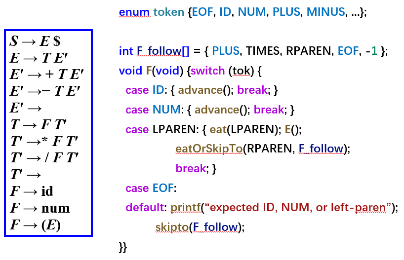
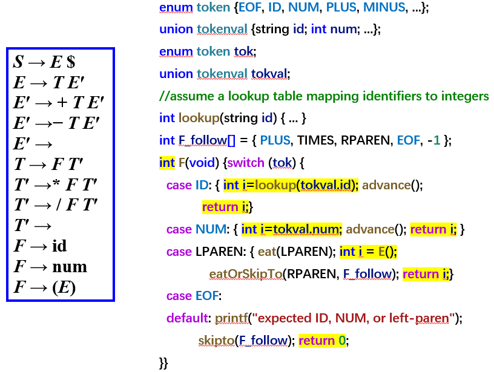
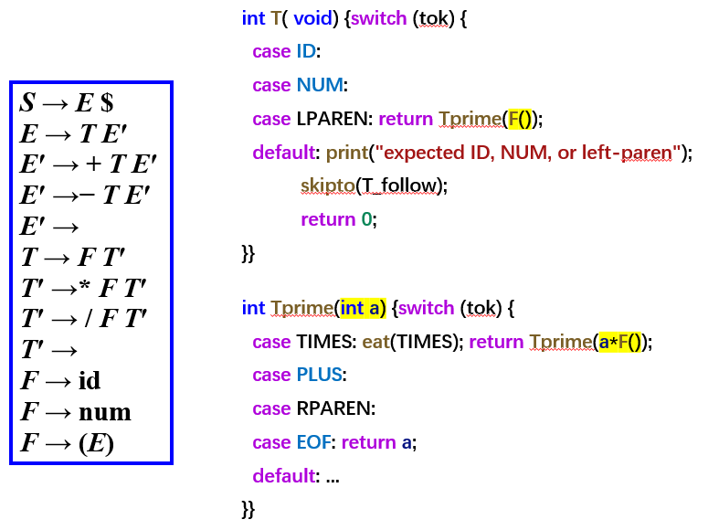
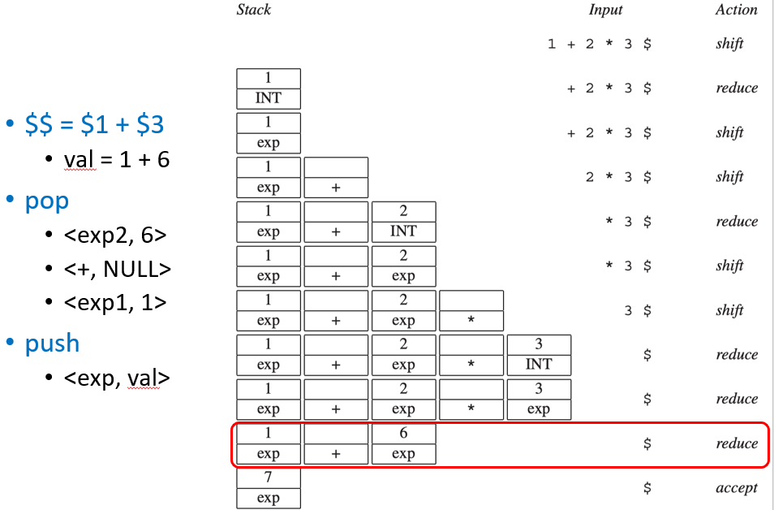
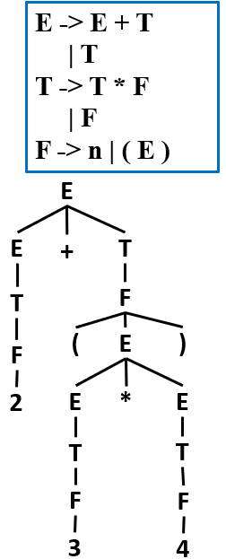
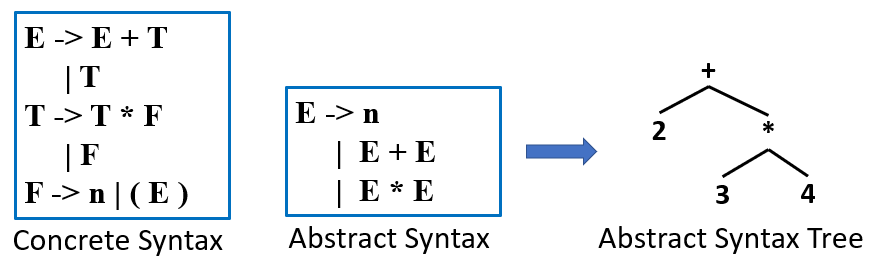
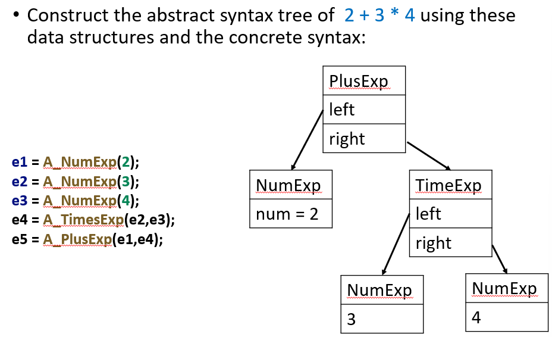
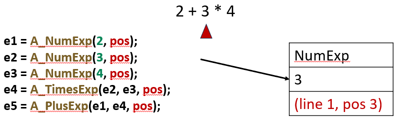

# 4 Abstract Syntax

<!-- !!! tip "说明"

    本文档正在更新中…… -->

!!! info "说明"

    本文档仅涉及部分内容，仅可用于复习重点知识

<figure markdown="span">
  { width="600" }
</figure>

## 1 Semantic Actions

解析器的作用是识别一个句子是否属于某个文法的语言。而编译器还需要：

1. 构建抽象语法树（AST）：将源代码转换为树状结构，便于后续处理
2. 语义分析：检查类型、作用域等语义是否正确（如变量是否定义、类型是否匹配）
3. 生成中间表示（IR）：将源代码转换为一种更接近机器语言但依然与平台无关的中间代码，便于优化和目标代码生成

语义动作是指在解析过程中嵌入的代码片段，当解析器识别出某个语法结构（如表达式、语句、函数定义）时，就执行相应的动作。这些动作可以用来构建 AST、检查类型、生成 IR 等

两种解析器实现方式：

1. recursive descent（递归下降解析器）：手工编写的一组递归函数，每个非终结符对应一个函数，函数内直接插入语义动作代码
2. Yacc 生成的解析器：使用 Yacc（或 GNU Bison）工具根据文法自动生成 LALR 解析器，文法规则中可以附带用 C/C++ 等语言写的语义动作代码

### 1.1 Recursive Descent

<figure markdown="span">
  { width="600" }
</figure>

1. `advance()`：读取下一个词法单元（表示匹配成功并前进）
2. `eat(LPAREN)`：匹配并消费左括号
3. `eatOrSkipTo(RPAREN, F_follow)`：尝试匹配右括号；若找不到，则跳过直到遇到 `F_follow` 中的词法单元（错误恢复）

如果我们想在解析的同时对输入字符串进行求值，就需要在语义动作中插入计算代码

<figure markdown="span">
  { width="600" }
</figure>

1. `union tokenval`：存储词法单元的值
2. `lookup()`：查找表中标识符对应的整数值

<figure markdown="span">
  { width="600" }
</figure>

1. `T()`：如果当前词元是 ID、NUM 或 LPAREN，则调用 `F()` 解析第一个因子，得到数值 `a`，将 `a` 传给 `Tprime()`（即 `T'`），继续处理后续的 `* F` 或 `/ F` 部分。直接返回 `Tprime()` 的结果
2. `Tprime(int a)`：`eat(TIMES)` 消费乘号，调用 `F()` 解析下一个因子，得到值 `F()`。递归调用 `Tprime(a * F())`，将当前的累积值 `a` 与刚解析的因子相乘，作为新的累积值继续处理后续可能的乘除运算

### 1.2 Yacc-Generated Parsers

Yacc 生成的解析器是一个移进-归约解析器。它维护两个核心栈：

1. 状态栈：存放解析状态（自动机状态编号）
2. 语义值栈：存放与符号关联的语义值（如数字、AST 节点指针、符号表条目等）

两个栈同步操作，每次移进或归约时，两个栈同时压入或弹出

当解析器根据规则 `A → Y₁ Y₂ ... Yₖ` 进行归约时：

1. 符号栈顶部 k 个符号正好是 Yₖ ... Y₁（栈顶是 Yₖ）
2. 语义值栈顶部 k 个值分别对应这 k 个符号的语义值
3. Yacc 用 `$1, $2, ..., $k` 来引用这些值，其中：`$1` 对应 Y₁ 的语义值；`$k` 对应 Yₖ 的语义值
4. 执行 C 语义动作代码（例如 `$$ = $1 + $3;`）
5. 弹出这 k 个符号和 k 个语义值
6. 压入非终结符 A 到符号栈，同时将动作代码的计算结果（`$$`）压入语义值栈

<figure markdown="span">
  { width="600" }
</figure>

---

在实际编译器中，不同语法成分的语义值类型往往不同：例如数字可能是 `int` 或 `float`

对于规则 `A → B C D`：B、C、D 已经归约并有了各自的语义值（分别是 `$1`、`$2`、`$3`），语义动作必须计算出一个值，其类型必须与 A 声明的类型一致，动作代码通过组合 `$1`、`$2`、`$3` 来构建 A 的值

LR 解析器是自底向上的移进-归约解析器。这意味着，归约操作的顺序 = 对语法树进行后序遍历的顺序

## 2 Abstract Pares Trees

理论上，可以在 Yacc 的语义动作中完成整个编译过程，但这样做会导致难以阅读、难以维护、顺序受限

我们需要将语法（parsing）与语义（semantics）分开处理：

1. 语法分析：检查语法结构，构建语法，输入源代码 token 流，输出语法树（AST）
2. 语义分析：类型检查、作用域分析、符号解析，输入语法树，输出带标注的语法树或 IR

Concrete Parse Tree（具体语法树，CST）严格遵循原始文法规则：叶子节点是输入中的每个 token；内部节点是每次归约使用的语法规则

<figure markdown="span">
  { width="200" }
</figure>

但具体语法树存在很多问题，例如冗余 token 等

抽象语法省略解析细节，只保留语义核心，供后续阶段使用。解析器在归约过程中，不构建具体语法树，而是直接构建抽象语法树

<figure markdown="span">
  { width="600" }
</figure>

编译器后续阶段（语义分析、优化、代码生成）需要表示和操作 AST，因此需要在 C 语言中设计合适的数据类型

```cpp linenums="1"
typedef struct A_exp *A_exp;

struct A_exp {
    // 节点是哪种类型
    enum {A_numExp, A_plusExp, A_timesExp} kind;
    union {
        int num;
        struct {A_exp left; A_exp right;} plus;
        struct {A_exp left; A_exp right;} times;
    } u;
};

A_exp A_NumExp(int num);
A_exp A_PlusExp(A_exp left, A_exp right);
A_exp A_TimesExp(A_exp left, A_exp right);

A_exp A_PlusExp(A_exp left, A_exp right) {
    A_exp e = checked_malloc(sizeof(*e));
    e->kind = A_plusExp;
    e->u.plus.left = left;
    e->u.plus.right = right;
    return e;
}
```

<figure markdown="span">
  { width="600" }
</figure>

Yacc 解析器在解析具体语法的同时，可以构建抽象语法树

```cpp linenums="1"
%left PLUS
%left TIMES

%%

exp : NUM            { $$ = A_NumExp($1); }
    | exp PLUS exp   { $$ = A_PlusExp($1, $3); }
    | exp TIMES exp  { $$ = A_TimesExp($1, $3); }
```

one-pass compiler（单遍编译器）指编译器在一次扫描源代码的过程中完成所有主要工作，词法分析、语法分析和语义分析同时进行。由于所有阶段同时进行，词法分析器维护一个 position（当前行号、列号），当语法分析或语义分析发现错误时，可以读取这个全局变量，此时解析器还没有超前太多，当前位置与错误发生的源代码位置非常接近

现代编译器通常采用多遍架构，词法分析已结束，语义分析尚未开始。如果在语义分析阶段发现类型错误，如何知道错误发生在源代码的哪个位置？解决方法是在 AST 节点中保存位置信息

```cpp linenums="1"
typedef struct A_exp *A_exp;

struct A_exp {
    int pos;  // 源代码位置（字符偏移量或行号）
    enum {A_numExp, A_plusExp, A_timesExp} kind;
    union {
        int num;
        struct {A_exp left; A_exp right;} plus;
        struct {A_exp left; A_exp right;} times;
    } u;
};
```

<figure markdown="span">
  { width="600" }
</figure>

设置 `pos` 字段需要两个环节：

1. 词法分析器传递位置信息：词法分析器读取字符时，需要记录每个 token 的起始行/列，将这些位置信息与 token 类型、语义值一起传递给解析器
2. 解析器维护位置栈：解析器需要为每个移进/归约的符号保存位置信息，语义动作需要能够访问这些位置

原始 Yacc 不支持位置栈，但可以通过一个特殊的非终结符 `pos` 来捕获位置信息

```cpp linenums="1"
%{ extern A_OpExp(A_exp, A_binop, A_exp, position); %}
%union { 
    int num; 
    string id; 
    position pos;   // 位置类型
    // ...
}
%type <pos> pos     // pos 非终结符的语义类型是 position

%%

// $3 就是 PLUS 符号的位置
exp : exp PLUS pos exp   { $$ = A_OpExp($1, A_plus, $4, $3); }
// pos 匹配空字符串（没有消耗任何输入）
// 语义动作将 $$ 设置为词法分析器中的全局变量 EM_tokpos
pos : { $$ = EM_tokpos; }
```