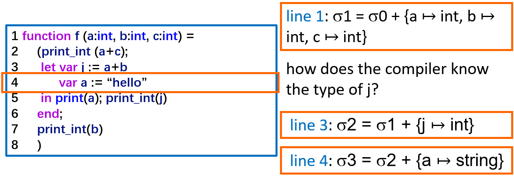
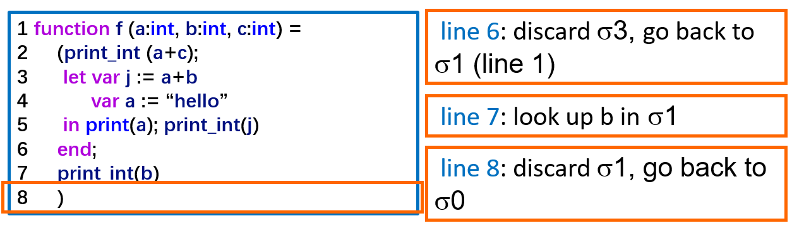
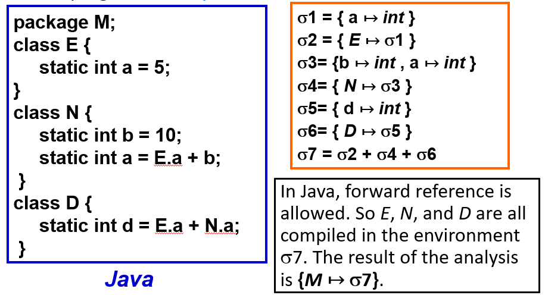
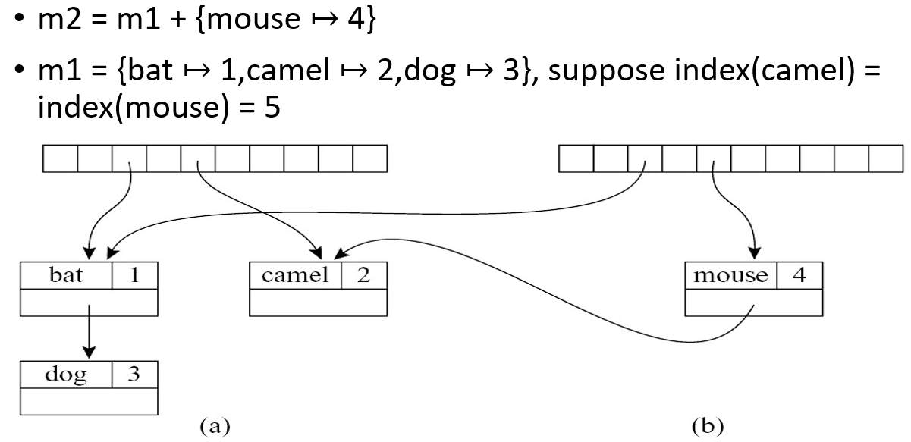
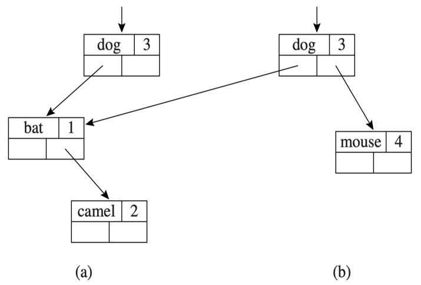

# 5 Semantic Analysis

<!-- !!! tip "说明"

    本文档正在更新中…… -->

!!! info "说明"

    本文档仅涉及部分内容，仅可用于复习重点知识

语义分析的作用：

1. 连接变量的定义与使用
2. 检查每个表达式的类型是否正确
3. 将抽象语法树（AST）转换为更简单的中间表示（为后续代码生成做准备）

## 1 Symbol Tables

符号表的作用：记录程序中变量、函数、类型等对象的属性（如类型、位置），在编译器的多个阶段都可以使用

environment 是一个从标识符到属性的 binding，例如 $σ_0 = \lbrace g ↦ \text{string}, a ↦ \text{int}\rbrace$

<figure markdown="span">
  { width="600" }
</figure>

上图中，$\sigma_3 = \sigma_2 + \lbrace a ↦ \text{string} \rbrace$，这时，$\sigma_3$ 中的 $a$ 会优先选择右侧的 string 类型

scope：每个局部变量有其可见范围，离开作用域时，局部绑定会被丢弃

<figure markdown="span">
  { width="600" }
</figure>

符号表的实现方式：

1. functional style：不修改原表，创建新表。易于恢复旧环境，但可能占用更多内存
2. imperative style：直接修改全局表，配合撤销栈。性能高，但需要手动管理作用域

### 1.1 Multiple Symbol Tables

不同模块、类、结构体可以有独立的符号表。例如 Java 中的类、ML 中的结构体

<figure markdown="span">
  { width="600" }
</figure>

### 1.2 Efficient Symbol Tables

#### 1.2.1 Imperative Style

使用哈希表 + 外部链。支持插入、查找、删除

$\sigma' = \sigma + \lbrace a ↦ \text{int} \rbrace$：原符号表 $\sigma$ 经过更新，增加一个映射 $a ↦ \text{int}$，实际操作就是在哈希表中插入键值对 `<a, int>`

外部链式法：`hash(a) -> <a, int> -> <a, string>`：假设 a 的哈希值对应某个桶。该桶链表中先有一个 `<a, string>` 节点，后面又有 `<a, int>` 节点。删除时只需从链表中移除对应节点，不影响其他条目

> 当 $\sigma$ 已经有 $a ↦ \text{string}$ 时，$\sigma + \lbrace a ↦ \text{int} \rbrace$，此时新环境中的 a 类型应该是 int，因此我们把 `<a, int>` 放到 `<a, string>` 的前面。所以是先有 `<a, string>`，后有 `<a, int>`

#### 1.2.2 Functional Style

可以复制一份哈希表实现保留原来的表

<figure markdown="span">
  { width="600" }
</figure>

但是更加高效的方法是使用二叉搜索树（BST）。插入时只复制路径上的节点，其余节点共享

<figure markdown="span">
  { width="600" }
</figure>

## 2 Tiger Compiler

### 2.1 Symbols in The Tiger Compiler

在传统的符号表实现中，哈希计算需要遍历字符串的每个字符，字符串越长开销越大。当发生哈希冲突时，需要将待查找的字符串与桶中的字符串逐字符比较才能确认是否相等。这也随字符串长度线性增长

改进思路：每个不同的字符串只在内存中存储一份副本，并用一个唯一的标识符（符号）来代替原始字符串进行操作。这个过程也称为字符串驻留（String Interning）

符号的三个重要特性：

1. 提取整数哈希键非常快：不再重新计算字符串的哈希值，而是直接使用符号指针本身的内存地址作为哈希键
2. 比较相等非常快：两个符号比较相等，只需要比较它们的指针或整数 ID 是否相同
3. 比较大小（顺序）非常快：对于需要有序结构的符号表（如二叉搜索树），可以维护一个全局计数器，每创建新符号时分配一个递增的整数 ID。比较两个符号的大小就变成比较这两个整数 ID

### 2.2 The Implementation of Symbol Tables

在编译器中，符号表需要支持嵌套作用域。当进入一个新作用域时，可以定义新的变量；退出作用域时，这些变量应该被删除，符号表恢复到进入之前的状态

我们可以在表中记录一个特殊的标记符号，用来分隔不同作用域的条目。整个表的行为类似于一个栈：每个作用域开始 → 压入一个标记；每个作用域结束 → 弹出条目直到遇到标记

```cpp linenums="1"
static struct S_symbol_ marksym = {"<mark>", 0};

void S_beginScope (S_table t) { 
    S_enter(t, &marksym, NULL); 
}

void S_endScope(S_table t) {
    S_symbol s;
    do 
        s = TAB_pop(t); 
    while (s != &marksym);
}
```

但是这个方法依赖于表能够按 LIFO 顺序弹出条目。普通的哈希表本身并不记录插入顺序，因此需要一个额外的数据结构来记住符号的插入顺序，即 auxiliary stack（辅助栈）

辅助栈中记录的是符号的插入顺序，每向符号表中插入一个符号，就把它也压入辅助栈。退出作用域时，从栈顶不断弹出符号，并同时从哈希表的对应桶中删除该符号的当前绑定，直到遇到作用域开始标记为止

也可以实现将辅助栈的功能直接整合进哈希表的每个条目中，而不是维护一个独立的栈

```cpp linenums="1"
struct TAB_table {
    binder table[TABSIZE];  // 哈希桶数组，每个桶是一个链表的头指针
    void *top;              // 指向最近插入的 binder（即辅助栈的栈顶）
};

static binder Binder(void *key, void *value, binder next, void *prevtop) {
    binder b = checked_malloc(sizeof(*b));
    b->key = key;
    b->value=value;
    b->next=next; 
    b->prevtop = prevtop; 
    return b;
}
```

假设按顺序插入 a、b，进入新作用域，插入 c。最后的结果是：`top -> marksym2 (prevtop -> c) -> c (prevtop -> marksym1) -> marksym1 (prevtop -> b) -> b (prevtop -> a) -> a (prevtop -> NULL)`

### 2.3 Bindings for The Tiger Compiler

Tiger 语言采用两个独立的命名空间：

1. Type Environment：类型定义。`type a = int`
2. Value Environment：变量、函数。`var a := 1`

这两个命名空间是平行且独立的。一个名字可以同时出现在两个命名空间中，而不会引起冲突

```cpp linenums="1"
let type a = int   (* 在类型环境中定义类型 a *)
    var a := 1     (* 在值环境中定义变量 a *)
in
    ...            (* 两个 a 可以同时使用 *)
end
```

在同一个命名空间中，同名标识符不能共存，后定义的会覆盖先定义的

```cpp linenums="1"
let function a (b: int) = ...   (* 在值环境中定义函数 a *)
    var a := 1                  (* 在值环境中定义变量 a（同名）*)
in
    ...
end
```

Tiger 语言的类型定义语法：

```cpp linenums="1"
tydec → type type-id = ty

ty → type-id            // 类型可以是一个已定义的类型名
     '{' tyfields '}'   // 类型可以是一个记录类型
     array of type-id   // 类型可以是一个数组类型，元素类型由 type-id 指定

tyfields → ε
           id : type-id { , id : type-id }
```

1. 内置类型：有 int、string
2. 构造类型，有 record、array

例如：

```cpp linenums="1"
type x = int;                          (* 简单类型别名 *)
type y = {a: int, b: string};          (* 记录类型：包含 a 和 b 两个字段 *)
type z = array of int;                 (* 数组类型：元素为 int 的数组 *)
```

Tiger 中每个记录类型定义语句都会创建一个全新的类型，即使它们的字段结构完全相同

```cpp linenums="1"
let type a = {x: int; y: int}    (* 创建记录节点 A，地址 0x1000 *)
    type b = {x: int; y: int}    (* 创建记录节点 B，地址 0x2000（不同）*)
    var i : a := ...             (* i 的类型标识 = 0x1000 *)
    var j : b := ...             (* j 的类型标识 = 0x2000 *)
in i := j                        (* 类型检查：0x1000 ≠ 0x2000 → 类型错误 *)
end
```

```cpp linenums="1"
let type a = {x: int; y: int}    (* 创建记录节点 A，地址 0x1000 *)
    type b = a                   (* b 是 a 的别名，指向同一个节点 0x1000 *)
    var i : a := ...             (* i 的类型标识 = 0x1000 *)
    var j : b := ...             (* j 的类型标识 = 0x1000（相同）*)
in i := j                        (* 类型检查：0x1000 = 0x1000 → 合法 *)
end
```

Tiger 在处理相互递归类型时，会使用 `Ty_Name(sym, NULL)` 作为占位符。例如：`type list = {first: int, rest: list}`。编译器需要创建一个 `Ty_record` 节点表示记录类型，记录中的 `rest` 字段的类型是 `list`，但 `list` 正在被定义中，尚未完成。这就需要 `Ty_Name` 这个占位符

1. 遇到 `type list = ...`，创建一个 `Ty_Name` 节点：`list_placeholder = Ty_Name(sym="list", ty=NULL)`，将 `list` 这个符号绑定到这个占位符
2. 字段 `first`: 类型为 int → 直接创建
3. 字段 `rest`: 类型为 `list` → 查找符号 `list`，找到占位符 `list_placeholder`，将 `rest` 字段的类型设为 `list_placeholder`
4. 记录体解析完成，创建 `Ty_record` 节点。将占位符的 `ty` 字段更新为实际的 `Ty_record` 节点

## 3 Type-Checking

Semant 模块负责语义分析，包括对抽象语法树的类型检查：

1. 表达式类型检查：需要确保操作数与操作符的类型兼容
2. 声明的类型检查：变量声明、类型声明、函数声明、递归声明

### 3.1 Type-Checking Expressions

语义分析模块使用四个递归函数分别处理不同类型的 AST 节点：

| 函数 | 处理的 AST 节点 | 返回值 | 说明 |
| -- | -- | -- | -- |
| `transVar` | `A_var` | `struct expty` | 处理变量访问 |
| `transExp` | `A_exp` | `struct expty` | 处理所有表达式 |
| `transDec` | `A_dec` | `void` | 处理变量/类型/函数声明，修改符号表 |
| `transTy` | `A_ty` | `Ty_ty` | 处理类型表达式，返回类型节点 |

每个函数都接收环境参数：

1. venv：值环境。变量和函数的类型绑定
2. tenv：类型环境。类型定义

返回值 `struct expty`：

```cpp linenums="1"
struct expty {
    Tr_exp exp;   // 翻译后的中间表示表达式
    Ty_ty ty;     // 该表达式的 Tiger 语言类型
};
```

### 3.2 Type-Checking Declarations

在 Tiger 语言中，声明只能出现在 `let` 表达式中

当 `transExp` 遇到一个 `let` 表达式时，它执行以下步骤：

1. 进入新作用域（为值环境和类型环境分别调用 `S_beginScope`）
2. 遍历所有声明，依次调用 `transDec` 处理
3. 在更新后的环境中递归处理 `let` 的主体（body）表达式
4. 退出作用域（调用 `S_endScope`）
5. 返回主体表达式的 `expty` 结果

#### 3.2.1 Variable Declarations

处理无类型约束的变量声明如 `var x := exp` 时：

```cpp linenums="1"
struct expty e = transExp(venv, tenv, d->u.var.init);
S_enter(venv, d->u.var.var, E_VarEntry(e.ty));
```

处理有类型约束的变量声明如 `var x : type-id := exp` 时，需要执行类型兼容性检查，也就是检查 `type-id` 和 `exp` 的类型是否匹配

#### 3.2.2 Type Declarations

只考虑非递归类型如 `type type-id = ty`

`transTy` 是语义分析模块中负责类型转换的函数，负责将语法分析阶段生成的类型抽象语法树，转换为编译器内部使用的类型表示

```cpp linenums="1"
case A_typeDec: {
    S_enter(tenv, 
            d->u.type->head->name,           // 类型名
            transTy(tenv, d->u.type->head->ty));  // 转换后的类型
}
```

#### 3.2.3 Function Declarations

Tiger 语言的函数声明语法为：

```cpp linenums="1"
function f(param1: type1, param2: type2, ...) : returnType = body
```

处理流程的一个简单例子：

```text linenums="1"
源代码: function add(x: int, y: int): int = x + y
                │
                ▼
┌─────────────────────────────────────────────────────────────┐
│ 1. 获取函数信息                                              │
│    f->name = "add"                                           │
│    f->params = [x: int, y: int]                              │
│    f->result = "int"                                         │
│    f->body = x + y                                           │
└─────────────────────────────────────────────────────────────┘
                │
                ▼
┌─────────────────────────────────────────────────────────────┐
│ 2. 查找返回类型                                              │
│    resultTy = S_look(tenv, "int") → Ty_Int()                 │
└─────────────────────────────────────────────────────────────┘
                │
                ▼
┌─────────────────────────────────────────────────────────────┐
│ 3. 构建参数类型列表                                          │
│    formalTys = makeFormalTyList(tenv, params)                │
│              → [Ty_Int(), Ty_Int()]                          │
└─────────────────────────────────────────────────────────────┘
                │
                ▼
┌─────────────────────────────────────────────────────────────┐
│ 4. 注册函数到值环境                                          │
│    S_enter(venv, "add", E_FunEntry([int,int], int))          │
└─────────────────────────────────────────────────────────────┘
                │
                ▼
┌─────────────────────────────────────────────────────────────┐
│ 5. 进入作用域，绑定参数                                      │
│    S_beginScope(venv)                                        │
│    S_enter(venv, "x", E_VarEntry(int))                       │
│    S_enter(venv, "y", E_VarEntry(int))                       │
└─────────────────────────────────────────────────────────────┘
                │
                ▼
┌─────────────────────────────────────────────────────────────┐
│ 6. 检查函数体                                                │
│    transExp(venv, tenv, x + y)                               │
│    返回类型: int                                              │
│    检查是否与 resultTy 匹配                                   │
└─────────────────────────────────────────────────────────────┘
                │
                ▼
┌─────────────────────────────────────────────────────────────┐
│ 7. 退出作用域                                                │
│    S_endScope(venv)  (删除 x 和 y 的绑定)                    │
└─────────────────────────────────────────────────────────────┘
```

#### 3.2.4 Recursive Declarations

考虑 Tiger 中的递归类型定义：`type list = {first: int, rest: list}`，解决方法：

1. 将所有类型名作为占位符先加入类型环境
2. 解析类型表达式，然后将实际类型填充到占位符中

Tiger 语言允许递归类型，但有一个核心限制，每个递归循环必须经过记录类型或数组类型

```cpp linenums="1" title="合法"
type list = {first: int, rest: list}        (* 经过记录类型 *)
type tree = {value: int, children: forest}  (* 经过记录类型 *)
type forest = array of tree                 (* 经过数组类型 *)
```

```cpp linenums="1" title="非法"
type a = b      (* 纯别名，没有记录或数组 *)
type b = a      (* 纯别名循环 *)

---

type a = b
type b = c
type c = a      (* 别名循环：a → b → c → a *)
```

如果遇到两个函数相互调用的情况，需要进行两遍扫描：

1. 收集头部信息：扫描所有函数声明，对每个函数：记录函数名、记录形式参数列表、记录返回类型，但不处理函数体
2. 处理函数体：再次扫描所有函数声明，对每个函数：将参数绑定到值环境（进入新作用域）、递归检查函数体、检查函数体类型是否与返回类型匹配、退出作用域
