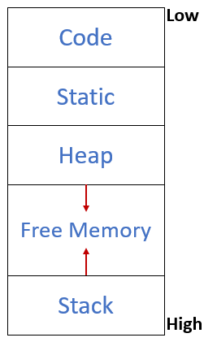
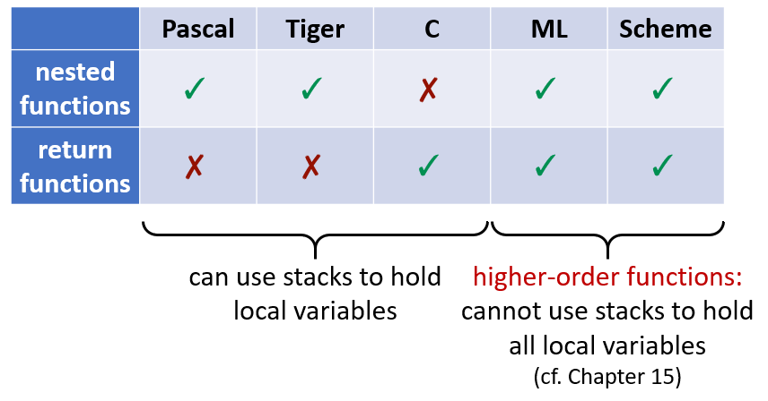
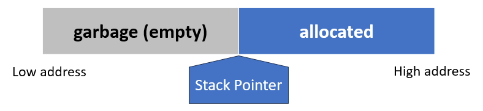
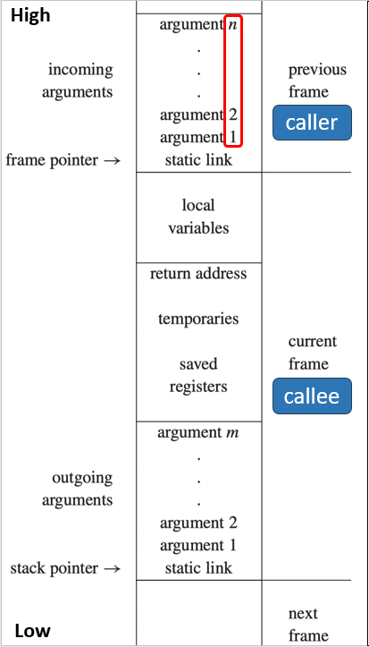
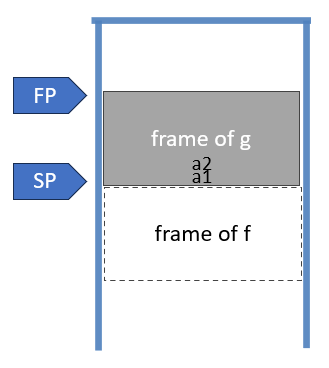
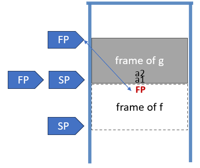
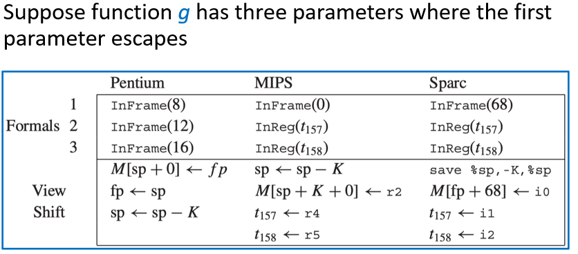
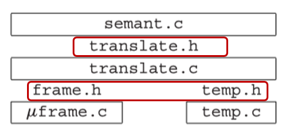

# 6 Activation Records

<!-- !!! tip "说明"

    本文档正在更新中…… -->

!!! info "说明"

    本文档仅涉及部分内容，仅可用于复习重点知识

## 1 Storage Organization

一种典型的内存划分方式是：

1. 代码区（Code）：存放可执行的目标代码
2. 静态区（Static）：存放编译时大小已知的数据对象
3. 栈区（Stack）：存放称为激活记录（Activation Record）的数据结构，在函数调用时生成
4. 堆区（Heap）：存放由程序显式分配和释放的数据

<figure markdown="span">
  { width="200" }
</figure>

## 2 Activation Records

control stack：是运行时系统维护的一个栈结构，专门用来管理函数调用和返回。它的工作方式就是标准的 LIFO

每次一个过程被调用时，用于存放其局部变量的空间就会被压入栈中。当该过程终止时，这块空间就会从栈中弹出。过程调用也被称为过程的激活（activation）。每一个活跃的激活都在控制栈上拥有一个激活记录（activation record），有时也称为栈帧（frame）

使用栈时，我们假设局部变量在函数 f 返回之后不会被使用。但在同时支持嵌套函数（nested functions）和函数作为返回值（function-valued variables）的语言中，可能需要在函数返回之后仍然保留它的局部变量

```cpp linenums="1"
fun f(x) =
  let fun g(y) = x + y
  in g
  end

val h = f(3)    (* h 是一个函数，它记住了 x = 3 *)
val j = f(4)    (* j 是一个函数，它记住了 x = 4 *)

val z = h(5)    (* z = 3 + 5 = 8 *)
val w = j(7)    (* w = 4 + 7 = 11 *)
```

<figure markdown="span">
  { width="600" }
</figure>

## 3 Stack Frame

通常，栈是一种 LIFO 的数据结构，只允许在栈顶（Stack Top）进行 push 和 pop 操作。但在实际编程中，函数调用时需要处理多个局部变量。这些变量需要成批地压入栈中，并且程序需要在函数执行期间持续访问这些位于栈深处的变量

为了能够像访问数组一样灵活地访问栈内的数据，引入了栈指针（SP）

<figure markdown="span">
  { width="600" }
</figure>

栈通常仅在进入函数时增长，增长的增量足以容纳该函数的所有局部变量；而在退出函数之前，栈会缩小相同的量

每次函数调用都会在栈上开辟一块独立的区域，称为栈帧或活动记录。它包含了该次函数调用所需的所有私有数据

<figure markdown="span">
  { width="300" }
</figure>

### 3.1 Frame Pointer

假设函数 g 调用函数 f(a1, ..., an)，g 是 caller，f 是 callee

当 g 调用 f 时：

1. SP 指向 g 传递给 f 的第一个参数
2. f 被分配一个大小为 framesize 的栈帧

<figure markdown="span">
  { width="200" }
</figure>

当进入 f 时：

1. 将旧的帧指针 FP 保存到内存中的栈帧内
2. 将当前的栈指针 SP 的值赋给 FP
3. 通过 SP = SP - framesize 移动栈指针

当离开 f 时：

1. 将 SP 重置为 FP 的值
2. 从栈中弹出之前保存的旧 FP

<figure markdown="span">
  { width="200" }
</figure>

这种使用 FP 的机制特别适用于变长栈帧（例如包含变长数组的函数）或栈帧不连续的情况，因为它提供了一个稳定的参考点来访问数据。如果栈帧大小是固定的，编译器可以通过 SP 加上一个固定的偏移量来直接计算 FP 的位置

### 3.2 Registers

当函数 f 正在使用某个寄存器 r 时，如果它调用了另一个函数 g，而 g 也需要使用同一个寄存器 r 进行计算，这就产生了冲突

1. caller-save register：如果 f 想要在以后继续用到寄存器 r 里的值，它必须在调用 g 之前自己把 r 的值存起来，并在 g 返回后自己恢复
2. callee-save register：如果 g 想要使用寄存器 r，它必须将 r 的值保存到栈中，并在自己返回之前将其恢复

### 3.3 Parameter Passing

如果所有参数都通过内存（栈）传递，会产生大量的内存读写操作。现代架构通常采用混合模式。前几个参数直接放入特定的通用寄存器中传递，剩下的参数才放入栈中。这大大减少了内存访问

函数 f 接收到了在寄存器 r1 中的参数，f 又调用了函数 h，而 f 需要给 h 传递参数，这个参数也需要用到寄存器 r1。这时，f 必须先把 r1 中原有的数据保存到栈帧里，腾出 r1 给 h 使用

使用寄存器相比内存是如何节省时间的：

1. 叶过程（Leaf procedures，指那些不调用其他过程的过程）无需将其参数写入内存
2. 一些优化编译器使用过程间寄存器分配（interprocedural register allocation），一次性分析整个程序中的所有函数。通过全局分析，编译器可以智能地为不同的函数分配不同的寄存器来存放参数和局部变量。这样可以减少函数调用时保存和恢复寄存器的开销
3. 如果在调用新函数时，当前函数的某个参数已经变成了死变量（Dead Variables，指在程序的某个点之后不再被使用的变量），那么存放该参数的寄存器就可以被安全地覆盖，用于传递新参数或临时计算，而无需先将其值备份到内存中
4. 一些架构拥有寄存器窗口（register windows）。当发生函数调用时，系统只需简单切换寄存器窗口指针，新函数就能获得一组全新的、干净的寄存器

### 3.4 Return Address

当函数 g 调用函数 f 时，CPU 需要知道 f 执行完后该回到哪里继续执行。通常，这个位置就是 g 中调用指令的下一条指令的地址（即 a+1 ）

在现代计算机中，执行 call 指令时，硬件会自动将这个返回地址保存到一个特定的寄存器中。在 MIPS 架构中，这个专用寄存器是 `$ra`

对于叶过程来说，因为它们不会覆盖 `$ra` 寄存器，所以不需要把返回地址保存到栈里；而对于非叶过程来说，因为嵌套调用会覆盖 `$ra`，所以它们必须先把当前的返回地址从 `$ra` 保存到栈中，以便之后能正确返回

### 3.5 Frame-Resident Variables

编译器会尝试将函数内部频繁使用的局部变量和计算过程中的中间结果尽可能保留在寄存器中，以减少访问内存的次数。当发生以下情况时，变量才会被写入到内存中

1. 如果代码中取了变量的地址，该变量必须位于内存中，因为寄存器没有内存地址
2. 如果内部嵌套的函数需要访问外部函数的局部变量，这些变量通常需要放在内存中以便通过帧指针偏移来访问。不过，现代编译器若采用跨过程寄存器分配优化，可能避免此开销
3. 如果数据类型的大小超过了单个寄存器的容量，它必须存储在内存中
4. 数组通常通过基地址加偏移量的方式进行索引访问，这要求数组数据位于内存中以便进行指针运算
5. 某些寄存器有特定用途。如果编译器需要在调用其他函数时保存当前变量的值，它必须先将该变量保存到栈中，腾出寄存器用于传参
6. 当活跃变量太多，物理寄存器不够用时，编译器必须选择一部分变量暂时存入内存。这一过程称为 spill（溢出）

变量 escape：通常，函数内的局部变量分配在栈上，函数结束时自动销毁。但如果发生以下情况，变量就被视为逃逸（也就是超出了当前函数作用域）：

1. 按引用传递：变量作为参数传给其他函数时，传递的是它的引用（指针），这意味着其他函数可能修改它
2. 取地址：代码中使用了取地址符，获取了变量的内存地址，这允许通过指针在函数外部访问该变量
3. 嵌套函数访问：在支持嵌套函数的语言中，内部函数可能捕获并访问外部函数的局部变量

而 escape 的变量必须被写入内存

### 3.6 Static Link

块结构 (Block Structure)：在允许嵌套函数声明的语言中，内部函数可以使用在外部函数中声明的变量

1. 而静态链是一种实现嵌套作用域的方法。每个函数调用时，除了返回地址和参数外，还会接收一个指向其“父函数”（静态外层函数）栈帧的指针。通过这个指针链，内层函数可以找到外层函数的变量
2. 显示表 (Display)：另一种优化方法。使用一个全局数组来记录每一层嵌套深度当前最活跃（最近进入）的函数栈帧地址。这样可以直接通过数组索引访问任意外层变量，而不需要遍历链表
3. Lambda 提升 (Lambda Lifting)：一种将嵌套函数转换为顶层函数的技术。通过将外层函数的变量作为额外参数显式传递给内层函数，从而消除对嵌套作用域的依赖

```cpp linenums="1"
type tree = {key: string, left: tree, right: tree}
function pretryprint(tree: tree): string =
    let
        var output := ""
        function write(s: string) =
            output := concat(output, s)
    
        function show(n: int, t: tree) =
            let function indent(s: string) =
                // 通过 indent 的 static link 找到 show 的 FP
                // 然后在该栈帧的特定位置读取变量 n 的值
                (for i := 1 to n
                    do write(" "));
                // 通过 indent 的 static link 找到 show 的 FP
                // 找到 show 的 static link 也就是 pp 的 FP
                // 然后找到 output 变量
                output := concat(output, s);
                // 定义位置决定静态链
                // write 的 static link = pp 的 FP
                write("\n")
            in  if t = nil
                // indent 的 static link = show 的 FP
                then indent(".")
                else (indent(t.key);
                // show 的 static link = pp 的 FP
                // 这里 show 直接将自己的 static link 传递给这个 show 就行
                      show(n+1, t.left);
                      show(n+1, t.right))
            end
    // show 的 static link = pp 的 FP
    in show(0, tree); output
    end
```

## 4 Frames in The Tiger Compiler

```cpp linenums="1"
/* frame.h */
typedef struct F_frame *F_frame;
typedef struct F_access *F_access;
typedef struct F_accessList *F_accessList;
struct F_accessList { F_access head; F_accessList tail; };
// 创建一个新的栈帧，name 是函数名标签，formals 是形式参数的逃逸情况
// 如果是 true 则参数会逃逸，必须存放在栈上
F_frame F_newFrame(Temp_label name, U_boolList formals);
// 返回栈帧对应的函数名
Temp_label F_name(F_frame f);
// 返回该栈帧中所有形式参数的访问方式列表
F_accessList F_formals(F_frame f);
// 在栈帧中分配一个局部变量，返回其访问方式；escape 表示该变量是否会逃逸（是否需要在栈上分配）
F_access F_allocLocal(F_frame f, bool escape);
```

1. F_frame：表示一个函数栈帧
2. F_access：表示一个变量在栈帧中的访问方式（例如在栈上的位置或在寄存器中）
3. F_accessList：访问方式的链表

```cpp linenums="1"
/* mipsframe.c */
#include "frame.h"
struct F_access {
    enum {inFrame, inReg} kind;
    union {
        // inFrame: 相对于帧指针的偏移量
        int offset;     /* InFrame 时使用 */
        // inReg: 存放变量的寄存器临时变量
        Temp_temp reg;  /* InReg 时使用 */
    } u;
};
static F_access InFrame(int offset);
static F_access InReg(Temp_temp reg);
```

`F_formals(f)` 返回一个 F_accessList，表示函数 f 的所有形式参数在被调用函数内部如何访问。返回的访问方式是“被调用者视角”的，而不是“调用者视角”的

调用者和被调用者对参数的“看法”可能不同：

1. 参数通过栈传递时：

    1. 调用者的视角：相对于栈指针（SP）的偏移
    2. 被调用者的视角：相对于帧指针（FP）的偏移

2. 参数通过寄存器传递时：

    1. 调用者的视角：寄存器 6
    2. 被调用者的视角：寄存器 13

这就是 shift of view（视角的转换）。这种“视角转换”依赖于目标机器的调用约定。它必须由 Frame 模块处理，从 newFrame 开始

对于每个形式参数，newFrame 必须计算两件事：

1. 该参数在函数内部将如何被看到
2. 必须生成哪些指令来实现这个“视角转换”

### 4.1 Representation of Frame Descriptions

F_frame 是一个数据结构，包含以下信息：

1. 所有形式参数的位置
2. 实现“视角转换”所需的指令
3. 目前已分配的局部变量数量
4. 该函数机器代码起始位置的标签

<figure markdown="span">
  { width="600" }
</figure>

### 4.2 Local Variables

```cpp linenums="1"
void f() {  
    int v = 6;  
    print(v);  
    { int v = 7;  
      print(v); }  
    print(v);  
    { int v = 8;  
      print(v); }  
    print(v);  
}
```

在处理过程中，每次遇到一个变量声明，都会调用 F_allocLocal 为这个变量分配一个新的栈帧槽位或临时寄存器，建立名称 v 到该位置的关联（符号表）。遇到 end 时，符号表中与 v 的关联被移除（作用域结束），但栈帧中分配的空间仍然保留

寄存器分配器会使用尽可能少的寄存器来表示临时变量。例如第二个和第三个变量 v 可以放在同一个临时寄存器中。类似地，如果变量存放在栈上，也可以共享栈槽位

### 4.3 Calculating Escapes

调用 allocLocal 时，知道变量是否逃逸非常重要。一个 findEscape 函数可以查找逃逸变量，并将这些信息记录在抽象语法树的逃逸字段中：

1. 遍历 AST：访问每个变量声明和变量使用
2. 检测逃逸模式
3. 记录信息：在变量的 escape 字段设置 TRUE 或 FALSE

```cpp linenums="1"
/* escape.h */
void Esc_findEscape(A_exp exp);

/* escape.c */
static void traverseExp(S_table env, int depth, A_exp e);
static void traverseDec(S_table env, int depth, A_dec d);
static void traverseVar(S_table env, int depth, A_var v);
```

例如：每当在静态函数嵌套深度 d 处发现一个变量或形式参数声明 `x = A_VarDec(pos, symbol("a"), typ, init, escape)`，则将 `<a, EscapeEntry(d, &(x->u.var.escape))>` 加入到环境中，每当 a 在深度 > d 处被使用时，设置 `x->u.var.escape=True`

### 4.4 Temporaries and Labels

编译器的语义分析阶段会想要为参数和局部变量选择寄存器，以及为函数体选择机器代码地址。但在此时无法精确地确定。编译器引入两种符号化的名称作为占位符：

1. 临时变量（Temporary）：临时保存在寄存器中的一个值
2. 标签（Label）：某个机器语言位置，其确切地址尚未确定

```cpp linenums="1"
/* temp.h */
typedef struct Temp_temp_ *Temp_temp;
// 创建一个新的临时变量
Temp_temp Temp_newtemp(void);

typedef S_symbol Temp_label;
// 创建一个匿名标签
Temp_label Temp_newlabel(void);
// 创建一个命名标签
Temp_label Temp_namedlabel(string name);
// 返回标签的字符串表示
string Temp_labelstring(Temp_label s);

typedef struct Temp_tempList_ *Temp_tempList;
// 临时变量列表
struct Temp_tempList {Temp_temp head; Temp_tempList tail;}
Temp_tempList Temp_TempList(Temp_temp head, Temp_tempList tail);

typedef struct Temp_labelList_ *Temp_labelList;
// 标签列表
struct Temp_labelList {Temp_label head; Temp_labelList tail;}
Temp_labelList Temp_labelList(Temp_label head, Temp_labelList tail);
```

### 4.5 Two Layers of Abstraction

1. frame.h + temp.h 这两个模块共同提供机器无关的存储视图，我们只需要通过 Temp_temp 和 F_access 句柄来操作
2. Translate 模块在存储抽象之上，增加了对嵌套作用域的支持

<figure markdown="span">
  { width="400" }
</figure>

```cpp linenums="1"
/* translate.h */
typedef struct Tr_access_ *Tr_access;
typedef ... Tr_accessList ...
Tr_accessList Tr_AccessList(Tr_access head, Tr_accessList tail);
Tr_level Tr_outermost(void);
Tr_level Tr_newLevel(Tr_level parent, Temp_label name, U_boolList formals);
Tr_accessList Tr_formals(Tr_level level);
Tr_access Tr_allocLocal(Tr_level level, bool escape);
```

transDec 通过调用 Tr_newLevel 为每个函数创建一个新的 nest level（嵌套层级）

将嵌套层级与每个函数关联：将每个函数的嵌套层级保存在其 FunEntry 中（存储在环境中）

将嵌套层级与每个变量关联：当 Semant 在处理深度为 lev 的局部变量声明时，它调用 `Tr_allocLocal(lev, esc)` 在该层级中创建变量，Semant 将 Tr_access 记录在值环境中的每个 VarEntry 里

```cpp linenums="1"
struct E_enventry_ {
    enum {E_varEntry, E_funEntry} kind;
    union {
        struct {Tr_access access; Ty_ty ty;} var;
        struct {Tr_level level; Temp_label label;
                Ty_tyList formals; Ty_ty result;} fun;
    } u;
};

E_enventry E_VarEntry(Tr_access access, Ty_ty ty);
E_enventry E_FunEntry(Tr_level level, Temp_label label,
                      Ty_tyList formals, Ty_ty result);

// translate.c
struct Tr_access {Tr_level level; F_access access;};
```

### 4.6 Managing Static Links

我们使用 Translate 模块来管理静态链。Frame 模块提供与目标机器相关的栈帧抽象，但不关心源语言的特性。Translate 知道每个栈帧中包含一个静态链。静态链通过寄存器传递给函数，并存储到栈帧中，就像一个参数一样。我们将把静态链当作一个参数来处理

当 Semant 调用 `Tr_formals(level)` 时，它将获得原始参数的访问值。原始参数指的是用户在源代码中声明的函数参数，不包括编译器自动添加的参数（例如静态链）

### 4.7 Keeping Track of Levels

Tr_outermost 返回最外层，最外层是所有嵌套层级的根，它不是一个真正的函数，而是一个虚拟的顶层作用域。所有“库函数”都在这个最外层声明，该层不包含栈帧或形式参数列表