# 7 Intermediate Code

<!-- !!! tip "说明"

    本文档正在更新中…… -->

!!! info "说明"

    本文档仅涉及部分内容，仅可用于复习重点知识

编译器在将源代码（如 C、Java）转换为机器码（如 x86、ARM）的过程中，会先生成一种“中间形式”。这种形式既不像源代码那样依赖具体语言特性（如面向对象、闭包），也不像机器码那样依赖具体硬件（如寄存器数量、指令集）。因此 IR 起到 桥梁 作用，方便进行各种优化和后续代码生成

不同的编译阶段和分析任务对 IR 的要求不同：

1. AST 适合语法分析和初步语义检查
2. TAC 适合进行简单的指令选择和数据流分析。
3. SSA 可以简化很多优化算法（如常量传播、死代码删除）
4. CFG 用于分析程序的控制结构（循环、分支）
5. 表达式树适合进行表达式层面的优化和代码生成

<figure markdown="span">
  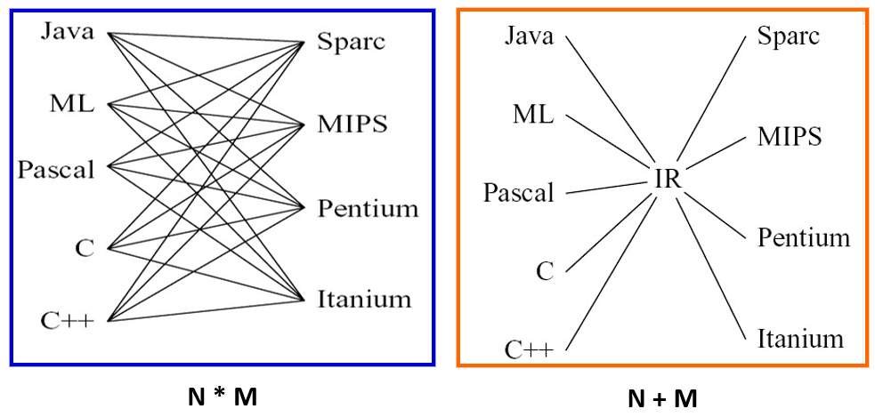{ width="600" }
</figure>

## 1 Three-Address Code

每条指令最多三个地址（例如 `a = b + c`），接近许多真实机器指令，但忽略具体寄存器

<figure markdown="span">
  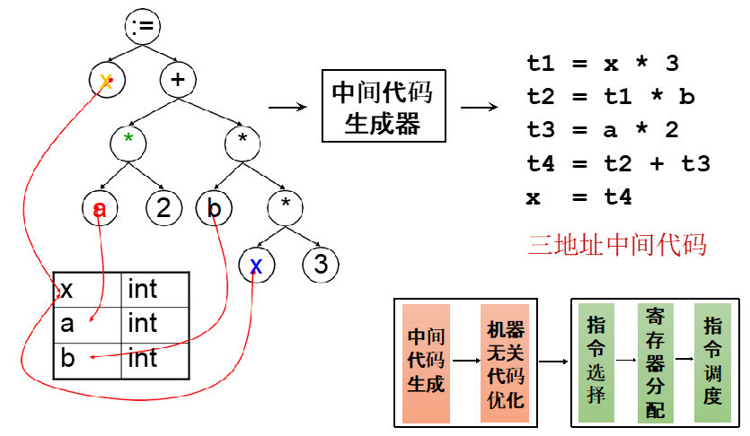{ width="600" }
</figure>

但是并非所有操作都适合 `x = y op z` 这种二元形式。例如一元运算等等

三地址码并不是一种严格标准化的 IR，不同编译器会根据自己的需要设计不同“方言”。当源语言引入特殊特性（如异常处理、协程、闭包、SIMD 向量操作等）时，可能需要发明新的三地址指令形式来合理表达这些语义。这种灵活性使三地址码能够适应各种源语言和目标机，但也导致不同编译器之间的三地址码不通用

<figure markdown="span">
  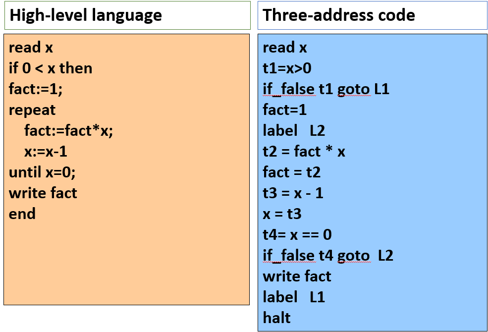{ width="600" }
</figure>

三地址码是一个指令序列，通常存储在数组或链表中，便于顺序遍历、插入和修改。每条指令用一个包含四个字段的记录表示：

1. op：操作符
2. arg1：第一操作数
3. arg2：第二操作数
4. result：结果存放位置

对于不需要全部三个地址的指令，用占位符（如 `_` 或 `null`）填充

<figure markdown="span">
  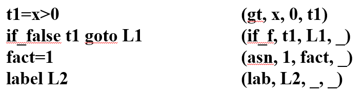{ width="600" }
</figure>

## 2 Intermediate Representation Tree

一个好的中间表示（IR）具有以下几个品质：

1. 便于语义分析阶段生成
2. 便于翻译到所有目标机器语言
3. 每种构造必须有清晰简单的含义

<figure markdown="span">
  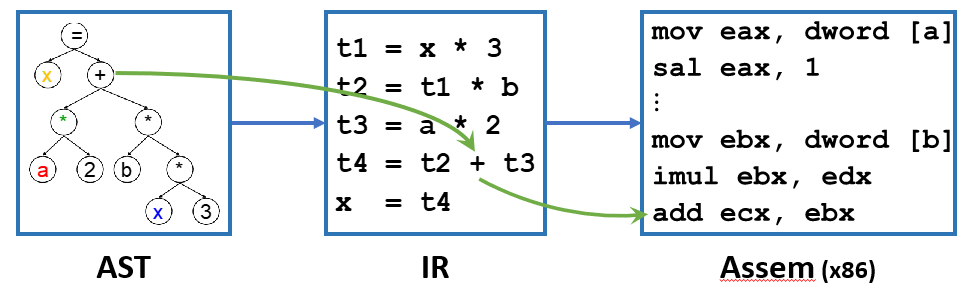{ width="600" }
</figure>

抽象语法（通常是 AST 节点）中的指令可能具有复杂副作用（Complex Effects, CE），机器语言同样如此。但是两者的效果不是一一对应的。IR 将 AST 中那些一条顶多条、副作用复杂的指令，拆解成一系列语义简单、副作用清晰的微小操作。在代码生成阶段，优化器和后端可以将这些简单的 IR 指令重新组合成高效的目标机器指令

## 3 Translation into IR Trees

### 3.1 Expressions

三种表达式分类

| 类别 | 名称 | 对应的 IR | 说明 |
| -- | -- | -- | -- |
| 有返回值的表达式 | Ex | `T_exp` | 计算后得到一个值，如 `a + b`、`3 * f(x)` |
| 无返回值的表达式 | Nx | `T_stm` | 仅为了副作用而执行，不返回值，如 `while` 循环、无返回值的 `call` |
| 布尔表达式 | Cx | 条件跳转结构 | 如 `a > b`，不直接返回 `true`/`false`，而是根据真假跳转到不同标号 |

Tr_Cx 结构：

```cpp linenums="1"
// stm：一条 IR 语句，通常是一个条件跳转，如 CJUMP(>, a, b, true_label, false_label)
// patchList true / patchList false：记录哪些跳转目标尚未确定
// 例如，当 a > b 作为更大表达式的一部分时，true/false 的目标地址可能还未生成
// 后续可以回填
Tr_Cx (patchList true, patchList false, T_stm stm);
```

> 假设 AST 表达式：`(a > b) && (c < d)`
>
> 1. 对 `a > b` 生成 Cx：如果成立则继续检查 `c < d`，否则直接跳转到整个表达式的 false 目标
> 2. 对 `c < d` 生成 Cx：如果成立则跳转到整个表达式的 true 目标，否则跳转到 false 目标
> 3. 通过 patchList 机制，可以在生成完所有代码后，将实际的跳转地址回填到这些条件跳转指令中

<figure markdown="span">
  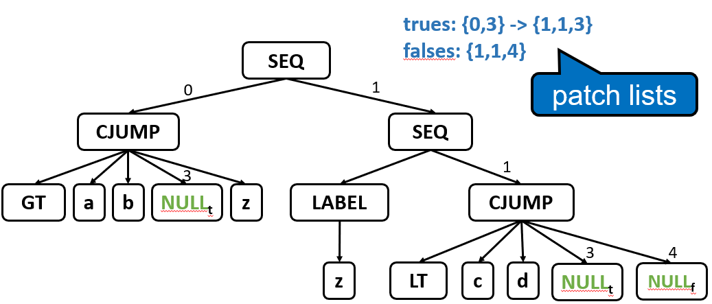{ width="600" }
</figure>

有时三种 IR 表达式类型之间需要相互转换。例如 `flag := (a > b | c < d)`，需要将 Cx 转换成 Ex。我们可以实现 `toEx(Cx)` 函数：

1. 创建两个新的标号：`true_label` 和 `false_label`
2. 生成一个临时变量 `t`（例如 `TEMP(t1)`）
3. 先给 `t` 赋值为 0（假定 0 表示 `false`）
4. 执行原来的 Cx 条件跳转：如果条件成立，跳转到 `true_label`，在那里将 `t` 赋值为 1（假定 1 表示 `true`），然后跳转到后续代码；否则继续执行到 `false_label`（`t` 保持为 0）
5. 最终 `t` 的值就是布尔条件的值（0 或 1），返回 `t` 作为 Ex

```cpp linenums="1"
flag := (a > b | c < d)

// 最终生成的 IR
e = Cx(true, false, stm)
MOVE(TEMP(flag), toEx(e))
```

### 3.2 Simple Variables

局部变量存储在栈帧中，通过帧指针（FP）加上偏移量来访问。每个变量在栈帧中都有一个固定的偏移量（offset） k，表示它相对于帧起始地址的位置

<figure markdown="span">
  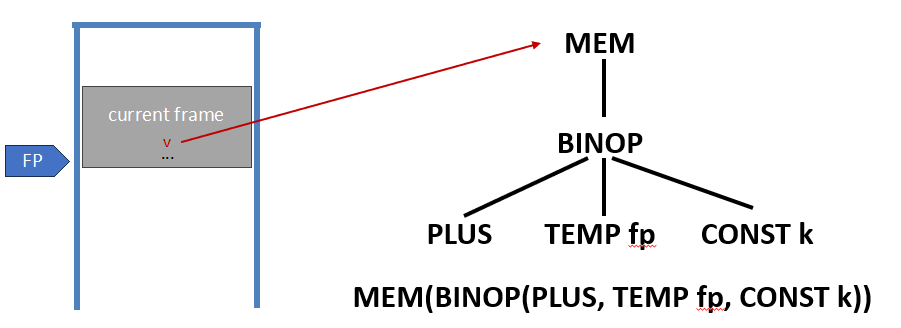{ width="600" }
</figure>

### 3.3 Array Variable

Tiger 中的数组变量本质上是指针，指向堆上分配的数组数据

<figure markdown="span">
  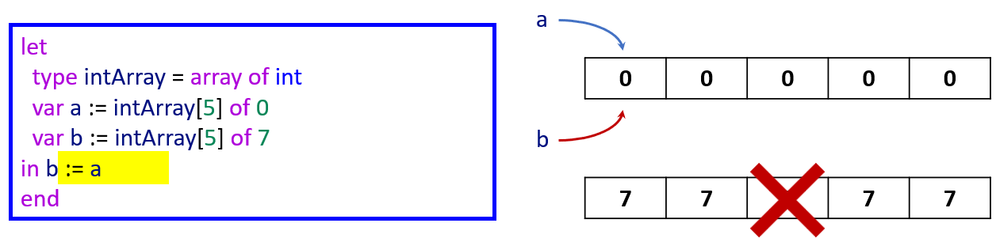{ width="600" }
</figure>

### 3.4 Structured L-Values

- 标量左值：只包含一个分量，大小固定为 1 个字。例如整数、指针、Tiger 的数组变量
- 结构化左值：包含多个分量，大小可能超过 1 个字。例如 C 的 `struct`

Tiger 中的变量永远是标量，包括基本类型、数组变量、记录变量。因此 Tiger 的 左值始终是 1 个字大小，不需要处理“整个结构体”作为左值的情况

而结构化左值翻译成 IR 时，MEM 不能只读取 1 个字，而需要读取/写入多个字节，为了支持结构化左值，T_Mem 需要扩展为携带 size 参数：

```cpp linenums="1"
// 表示从 address 开始的连续 size 字节内存
T_exp T_Mem(T_exp address, int size);
```

### 3.5 Subscripting and Field SSelection

对于数组 `a`，元素 `a[i]` 的地址由以下公式给出：

$addr = (i - l) \times s + a$

1. `a`：数组的基地址（第一个元素的地址）
2. `l`：数组索引的下界
3. `i`：要访问的索引（运行时值）
4. `s`：每个元素占用的字节数

如果数组 `a` 是全局变量（地址在链接时或编译时确定），公式中的 $a - l \times s$ 可以在编译时预先计算

对于记录（结构体）`a` 的字段 `f`：$addr = \text{offset}(f) + a$

### 3.6 Arithmetic

Tree 语言提供了丰富的二元运算符，但没有一元运算符节点。可以通过二元运算符来模拟一元运算符：

1. `-n`：`0 - n`。`BINOP(MINUS, CONST(0), n)`
2. `~n`：`n XOR (-1)`。`BINOP(XOR, n, CONST(-1))`

这两种模拟在整数语义上是完全正确的，但对于浮点数来说可能不正确，因为存在正零和负零

### 3.7 Conditionals

比较表达式会被翻译成一个 Cx。CJUMP 指令会比较两个操作数，根据结果跳转到真目标或假目标。此时真目标和假目标尚未确定（用 `NULL` 或占位符表示），后续通过 `patchList` 回填

Cx 的设计初衷就是为了高效支持短路求值的布尔运算符：

1. `&`：`e1 & e2`。先判断 `e1`，如果为假则整个为假
2. `|`：`e1 | e2`。先判断 `e1`，如果为真则整个为真

例如翻译 `x < 5 & y > 6`：将 `x < 5` 翻译成 Cx1，将 `y > 6` 翻译成 Cx2，组合成 Cx1 & Cx2。那么 Cx1 的真目标指向 Cx2 的入口，Cx1 的假目标指向整个表达式的假目标；Cx2 的真目标指向整个表达式的真目标，Cx2 的假目标指向整个表达式的假目标

<figure markdown="span">
  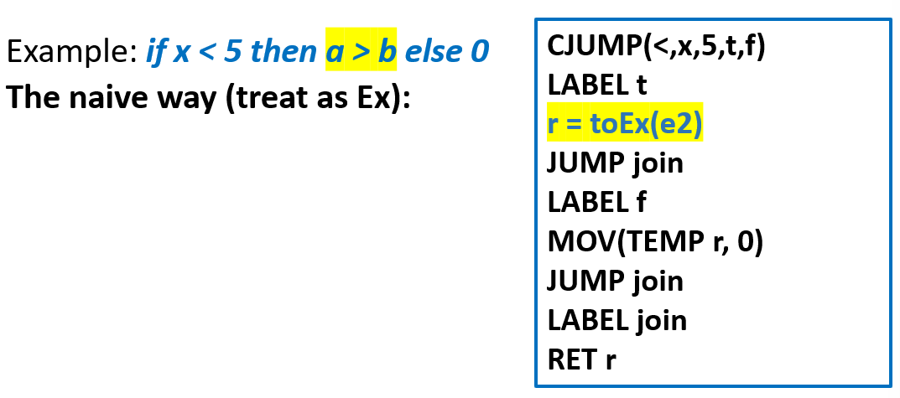{ width="600" }
</figure>

<figure markdown="span">
  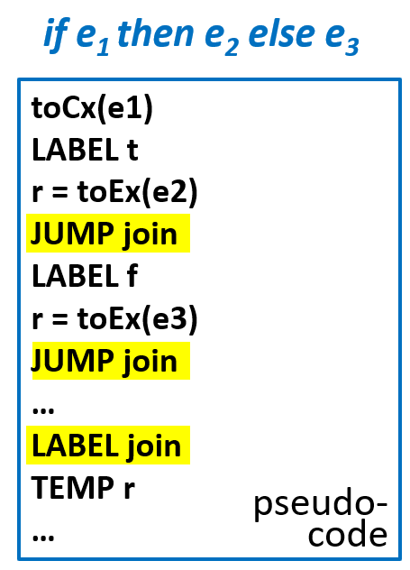{ width="400" }
</figure>

如果 e2 或者 e3 是 Cx 的话，最好能特殊处理

<figure markdown="span">
  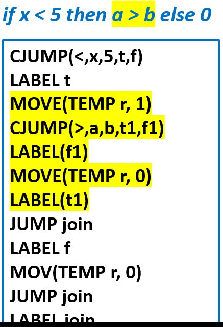{ width="400" }
</figure>

### 3.8 While Loops

一个 `while (condition) body` 循环被翻译成如下控制流结构：

```cpp linenums="1"
test:                         // 循环测试标号
    if not(condition) goto done   // 条件不满足则退出
    body                          // 循环体（可能包含 break）
    goto test                     // 跳回测试
done:                         // 循环结束标号
```

`break` 出现在循环体内，且没有内层循环嵌套。直接翻译成 `JUMP done`，跳转到当前循环的结束标号。如果存在嵌套循环，内层循环的 `break` 应该跳出内层循环，而不是外层循环

为了知道正确的 `done` 标号，编译器在翻译循环时需要跟踪当前最近的循环的 `done` 标号，向翻译循环体的函数传递一个额外的参数（或维护一个栈），表示当前循环的 `done` 标号

### 3.9 For Loops

最简单的方法就是将 `for` 循环改写成 `while` 循环

```cpp linenums="1"
for i := lo to hi
do body

i := lo
limit := hi
test:
    body
    if i >= limit goto done
    i := i + 1
    goto test
done:
```

### 3.10 Function Call

翻译函数调用 `f(a1, ..., an)` 很简单，只需要将静态链作为一个隐式的额外参数添加进去

```cpp linenums="1"
CALL(NAME(f), [sl, e1, e2, ..., en])
```

## 4 Translation of Declarations

局部变量（在函数内部声明的变量）需要在运行时分配存储空间。这些空间分配在当前函数的栈帧中。编译器在翻译函数时，会：

1. 遍历函数体内的所有变量声明
2. 计算每个变量所需的空间（Tiger 中所有变量大小相同，一个字）
3. 在栈帧中为每个变量分配一个偏移量（offset）
4. 生成 IR 时，变量访问就通过 `MEM(FP + offset)` 来表示

每个函数声明（包括主函数 `main`）会产生一个独立的代码片段，一个 fragment 包含：

1. 该函数的入口标号（`NAME(label)`）
2. 该函数的 IR 树（函数体的语句序列）
3. 该函数的栈帧信息（参数、局部变量偏移量等）

!!! tip "fragment"

    ```cpp linenums="1"
    /* frame.h */
    typedef struct F_frag_ * F_frag;
    struct F_frag {
        // F_stringFrag 是字符串字面量片段
        // F_procFrag 是函数过程片段
        enum {F_stringFrag, F_procFrag} kind;
        union {
            struct {Temp_label label; string str;} stringg;
            struct {T_stm body; F_frame frame;} proc;
        } u;
    };
    F_frag F_StringFrag(Temp_label label, string str);
    F_frag F_ProcFrag(T_stm body, F_frame frame);
    typedef struct F_fragList * F_fragList;
    struct F_fragList {F_frag head; F_fragList tail;}
    F_fragList F_FragList(F_frag head, F_fragList tail);
    
    /* translate.h */
    // 处理一个函数的入口和出口
    // level 是当前函数的嵌套层次（静态链信息）
    void Tr_procEntryExit(Tr_level level, Tr_exp body, Tr_accessList formals);
    F_fragList Tr_getResult(void);
    ```

### 4.1 Variable Definition

`transDec` 是语义分析/翻译阶段的一个函数，用于处理 `let` 中的每条声明：

1. 更新环境

    1. 值环境：记录变量名 → 其存储位置（如栈帧偏移量）的映射
    2. 类型环境：记录类型名 → 类型定义

2. 翻译初始化：变量声明 `var name := init` 中的 `init` 表达式被翻译成 Tree 表达式，并生成一个赋值操作（将 `init` 的值存入变量的内存位置）
3. 生成初始化代码的位置：这些赋值表达式必须放在 `let` 的 `in` 体之前执行。也就是说，在进入 `in` 部分的表达式之前，先执行所有变量声明的初始化

对于函数声明和类型声明来说，`transDec` 返回一个“空操作”表达式，如 `Ex(CONST(0))`

### 4.2 Function Definition

每个函数被分为三个部分：

1. Prologue（序言）：函数入口处执行的代码，用于建立栈帧、保存寄存器等
2. Body（函数体）：函数的核心逻辑，由翻译函数体语句得到的指令序列
3. Epilogue（尾声）：函数出口处执行的代码，用于恢复寄存器、返回调用者

序言的详细步骤：

1. 伪指令标记函数开始
2. 函数名的标号定义：为函数定义汇编标号（如 `f:`），使得其他代码可以通过 `CALL f` 跳转到这里
3. 调整栈指针分配栈帧：为当前函数分配一块栈空间，用于存放局部变量、逃逸的参数、保存的寄存器等
4. 处理参数

    1. 逃逸参数：那些可能被内层嵌套函数访问的参数。这些参数必须保存在栈帧中，因为内层函数需要通过静态链访问它们
    2. 非逃逸参数：只在当前函数内部使用，不会逃逸到嵌套函数。这些参数可以直接存放在临时寄存器（类似虚拟寄存器）中，后续的寄存器分配会处理它们
    3. 静态链：如果当前函数是嵌套函数，静态链本身也是一个逃逸参数，同样需要保存到栈帧

5. 保存被调用者保存寄存器：如果函数体内使用了这些寄存器，就需要在序言中把它们原来的值保存到栈帧中，并在尾声里恢复

在 Tiger 语言中，函数体是一个表达式。这意味着函数体本身会产生一个值，这个值就是函数的返回值

尾声的详细步骤：

1. 移动返回值到寄存器：将函数体计算得到的结果移动到返回值寄存器
2. 恢复被调用者保存寄存器：从栈帧中加载之前保存的寄存器值
3. 重置栈指针：将栈指针加回之前减去的帧大小，释放栈帧
4. 返回指令：跳转到返回地址
5. 结束伪指令
