# 8 Blocks and Traces

<!-- !!! tip "说明"

    本文档正在更新中…… -->

!!! info "说明"

    本文档仅涉及部分内容，仅可用于复习重点知识

语义分析之后，编译器需要把高级语言转换成低级语言。IR 树作为中间层，其操作符设计得足够通用，能适配多种不同架构的机器。但 IR 树中的某些操作在真实机器上可能没有直接对应的指令，因此翻译时需要拆分成多条机器指令。IR 树中的某些表示方式会让编译器难以进行一些底层优化。我们需要对中间代码进行优化

我们需要对 IR tree 进行三个阶段的转换

<figure markdown="span">
  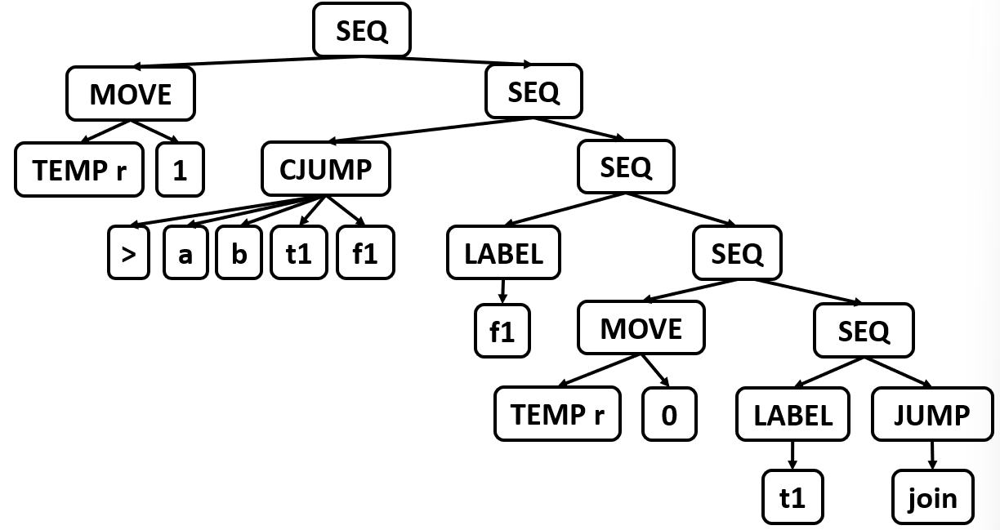{ width="600" }
</figure>

**1.将 IR tree 重写成一系列没有 SEQ 或者 ESEQ 节点的 canonical tree**

<figure markdown="span">
  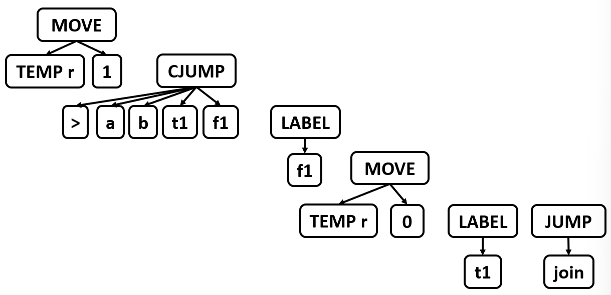{ width="600" }
</figure>

**2.将这些 canonical tree 分成一组一组的基本块，每组基本块之间没有 jump**

<figure markdown="span">
  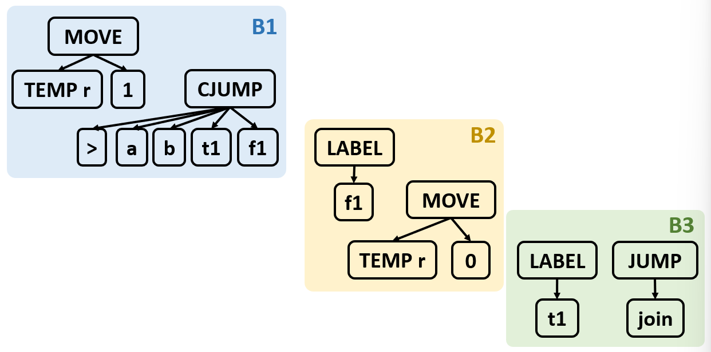{ width="600" }
</figure>

**3.将各个基本块排序并放到一组一组的 trace 当中，CJUMP 的 false 标签紧跟着 CJUMP 所在的 trace**

<figure markdown="span">
  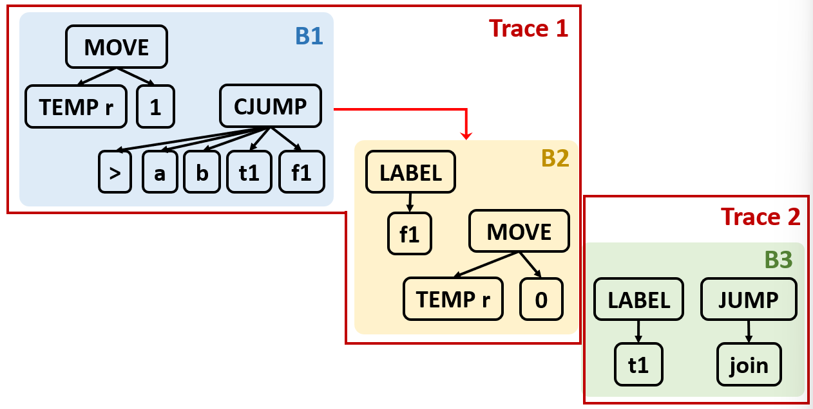{ width="600" }
</figure>

## 1 Canonical Trees

规范树的性质：

1. 没有 SEQ 或 ESEQ 节点：规范树中，只有根节点是语句节点，其余节点都必须是纯表达式（无副作用、无嵌套语句）
2. 每个 CALL 节点和其父节点的结构必须是 `EXP(CALL(...))` 或者 `MOVE(TEMP t, CALL(...))`：CALL 是有副作用的（可能修改内存、寄存器等），因此它不能出现在任意表达式中，它只能出现在上述的结构中。该性质与性质一结合得到，一个规范树只能有一个 CALL 节点

为了得到这些规范树，我们需要：

1. 消除 ESEQ 节点
2. 移动 CALL 节点到顶层
3. 消除 SEQ 节点

### 1.1 Transformations on ESEQ

将 ESEQ 在树中不断向上提升，直到它的父节点是一个语句节点，此时它就可以转换成一个 SEQ 节点

<figure markdown="span">
  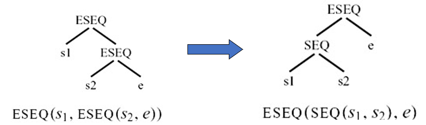{ width="600" }
</figure>

<figure markdown="span">
  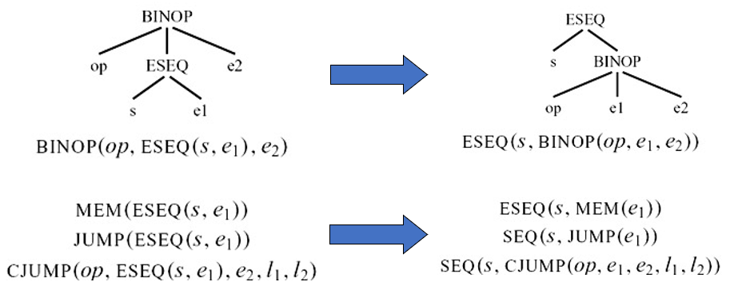{ width="600" }
</figure>

如果 s 在 e1 之后：

<figure markdown="span">
  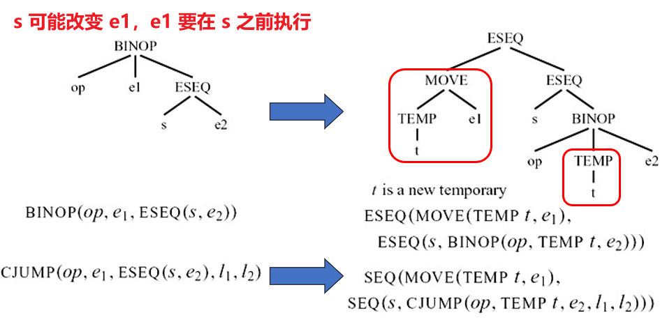{ width="600" }
</figure>

s 与 e1 commute：如果 s 写入的临时变量和内存位置不被 e1 引用，并且 s 与 e1 不同时进行外部 I/O 操作，那么 s 与 e1 可交换，这时就可以按照一般的方法来做

<figure markdown="span">
  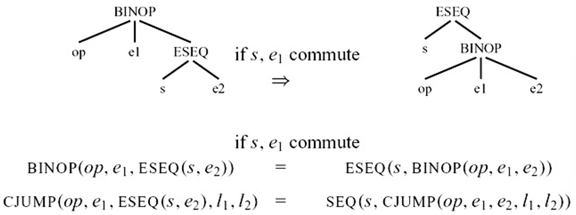{ width="600" }
</figure>

!!! tip "如何判断 s 与 e 可交换"

    假如 `s = MOVE(MEM(x), y)`，`e = MEM(z)`。表达式 e 中访问的内存地址 z，与语句 s 中写入的内存地址 x，在编译时可能无法确定是否指向同一位置。编译器不能在不确定的情况下假设它们不相等，否则会错误地交换顺序，改变程序语义

    只有当编译器可以肯定交换顺序是安全的时候，才认为 commutes。如果不确定，就认为不可交换（即使实际上可能安全）

    1. 常量表达式 `CONST(i)`，`NAME(n)` 与任何语句都可交换
    2. 空语句 `EXP(CONST(i))` 与任何语句都可交换

    其他任何情况均视为不可交换

<figure markdown="span">
  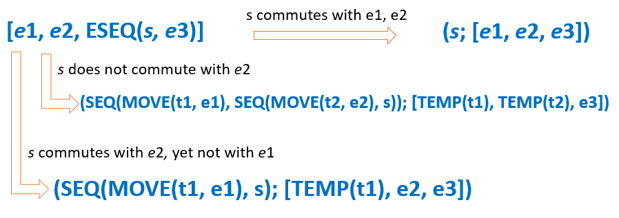{ width="600" }
</figure>

<figure markdown="span">
  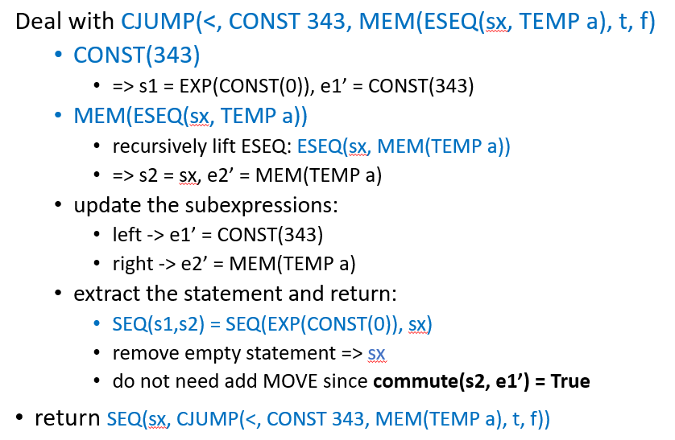{ width="600" }
</figure>

### 1.2 Move CALLs to TOP Level

引入临时变量，把原来的 CALL 节点替换成一个 ESEQ

```cpp linenums="1"
CALL(fun, args) -> ESEQ(MOVE(TEMP t, CALL(fun, args)), TEMP t)
```

然后消除 ESEQ 即可

### 1.3 Eliminate SEQs

在应用了前面所有变换（消除 ESEQ、提升 CALL 等）之后，函数体变成一棵以 SEQ 为根节点的树。这棵树的结构是左倾的：所有的 SEQ 都嵌套在左子节点中，例如：

```cpp linenums="1"
SEQ(SEQ(SEQ(..., sₓ), sᵧ), s₂)
```

我们通过反复应用重写规则：

```cpp linenums="1"
SEQ(SEQ(a, b), c)  →  SEQ(a, SEQ(b, c))
```

将嵌套从左边向右转移，最终得到右倾的形式：

```cpp linenums="1"
SEQ(s₁, SEQ(s₂, SEQ(s₃, ..., sₙ)))
```

这种形式等价于一个列表，只是用 SEQ 模拟了顺序执行。因此可以直接去掉 SEQ 的括号，当成一个列表：

```cpp linenums="1"
[s₁, s₂, s₃, ..., sₙ]
```

列表中的每个 sᵢ 自身是规范树，通常是一个 MOVE、EXP、CJUMP、JUMP、LABEL 等叶子语句

## 2 Taming Conditional Branches

### 2.1 Basic Blocks

在平坦的语句列表中，大部分是指令，它们除了计算和存取数据外，不改变程序执行方向。重要的只有分支指令（CJUMP、JUMP）和标签（LABEL），它们决定下一步执行哪条指令。为了提高分析效率，可以把没有分支的连续指令打包起来，当作一个整体处理

控制流关心的只是：程序执行去哪一条指令，而不是计算什么值。因此分析时可以忽略数据计算部分

基本块是一个满足以下条件的最大指令序列：

1. 入口唯一：只能从块的第一条指令进入（不能从中间跳入）
2. 出口唯一：只能从块的最后一条指令离开（通常是 JUMP、CJUMP，或无条件落入下一块）
3. 内部无分支：块内没有跳转指令（除了可能的最后一条指令）
4. 内部无标签：块内没有其他标签（除了可能的块首标签）

<figure markdown="span">
  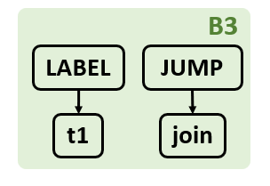{ width="200" }
</figure>

将一个长的语句序列划分为基本块的算法如下：

1. 扫描语句列表，跟踪当前块
2. 遇到 LABEL → 结束当前块，开启新块
3. 遇到 JUMP / CJUMP → 结束当前块，开启新块
4. 扫描结束，若某块末尾不是跳转，则补一条 JUMP 到末尾，并指向下一个块
5. 若某块开头无标签，则创建一个新标签并插入块首

<figure markdown="span">
  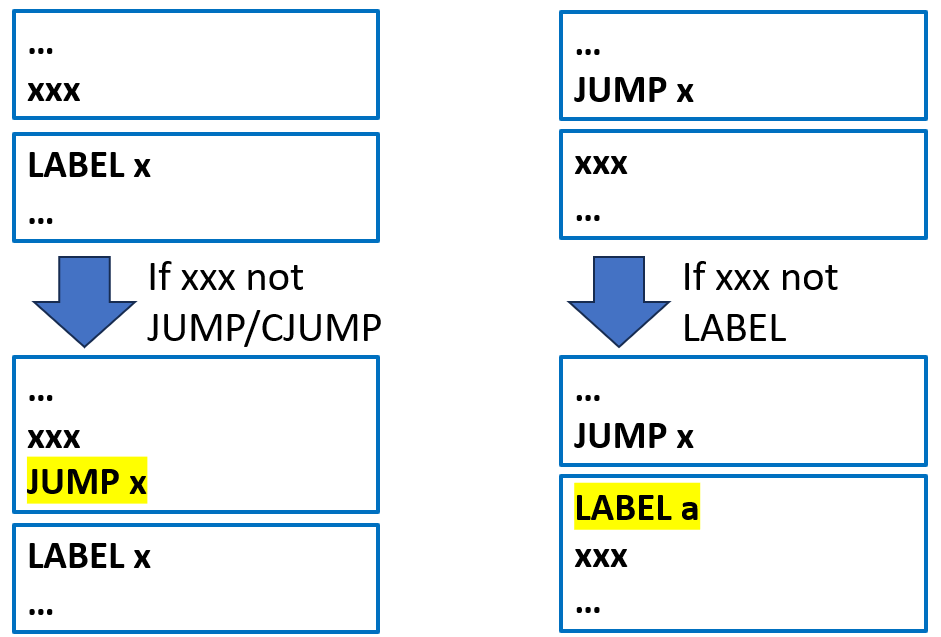{ width="600" }
</figure>

<figure markdown="span">
  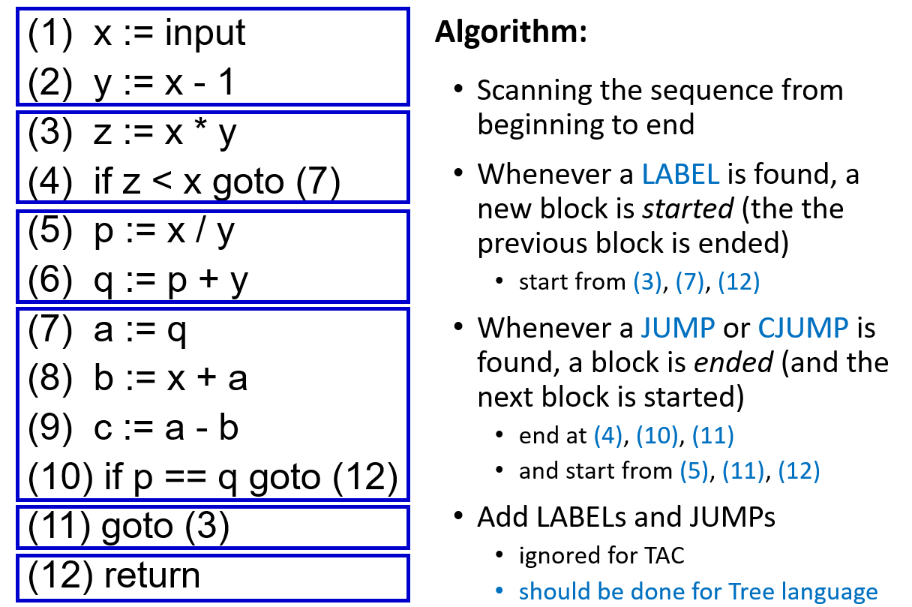{ width="600" }
</figure>

### 2.2 Traces

基本块划分完成后，控制流图中的基本块在内存中通常按照原始顺序排列。但在实际执行中，基本块可以放在任何位置，只要跳转指令的目标地址正确即可。利用这一自由度，可以重排基本块，使控制流更平顺，减少跳转

1. 让 CJUMP 后紧跟 false 标签
2. 如果一个无条件跳转 `JUMP(NAME next)` 之后紧接着就是 `LABEL(next)`，可以删除这个 JUMP

trace 是连续的、不包含冗余跳转的基本块序列。通过重排基本块，使得：每个 CJUMP 的 false 分支块紧随其后；每个 JUMP 的目标块紧随其后

<figure markdown="span">
  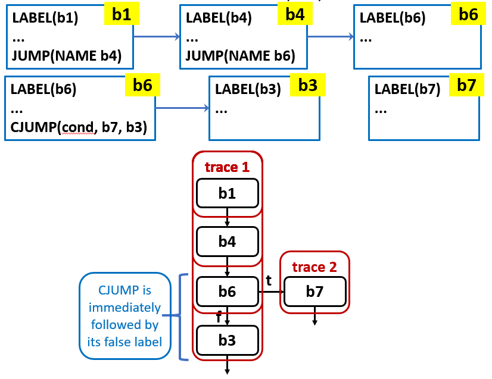{ width="600" }
</figure>

重排算法不一定能完美满足上面的两个条件，因为控制流图中可能存在循环、多个前驱等约束。因此最后我们需要对不理想的 CJUMP 进行局部改写

如果 CJUMP 后紧跟 true 标签：交换 CJUMP 中的 true 和 false 标签，并对条件取反

```cpp linenums="1"
CJUMP(>=, a, b, L_true, L_false)
L_true: ...

修改为

CJUMP(<, a, b, L_false, L_true)
L_true: ...
```

如果 CJUMP 后既不是 true 也不是 false 标签：插入一个新标签 If' 和一个 JUMP，使 CJUMP 后紧跟 If'

```cpp linenums="1"
CJUMP(>=, a, b, L_true, L_false)
...（其他语句，既不是 L_true 也不是 L_false）

修改为

CJUMP(>=, a, b, L_true, L_false')
L_false':   # 新标签
JUMP(NAME L_false)
...（原来的其他语句）
```

程序中的某些代码序列会频繁执行，比如：循环体、函数中的主要执行路径、分支预测中大概率走的那一侧。编译器可以通过性能分析或静态启发式规则识别这些热点。将这些频繁执行的指令序列放入同一条连续轨迹中，可以使它们在内存中连续放置，执行时无需在中间插入无条件跳转
