# 9 Instruction Selection

!!! tip "说明"

    本文档正在更新中……

!!! info "说明"

    本文档仅涉及部分内容，仅可用于复习重点知识

## 1 Tree Patterns

树模式就是用来描述“哪些 IR 树的子树可以一次性被翻译成一条机器指令”。例如，LOAD 指令就是专门用来处理“基址+偏移量”这种内存访问模式的

<figure markdown="span">
  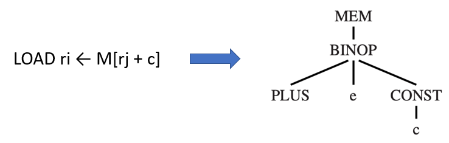{ width="600" }
</figure>

instruction selection：通过用最小的树模式集合来 tile（覆盖）整棵 IR 树

为了阐述指令选择，我们使用 Jouette（法语中意为“玩具”）架构指令集

<figure markdown="span">
  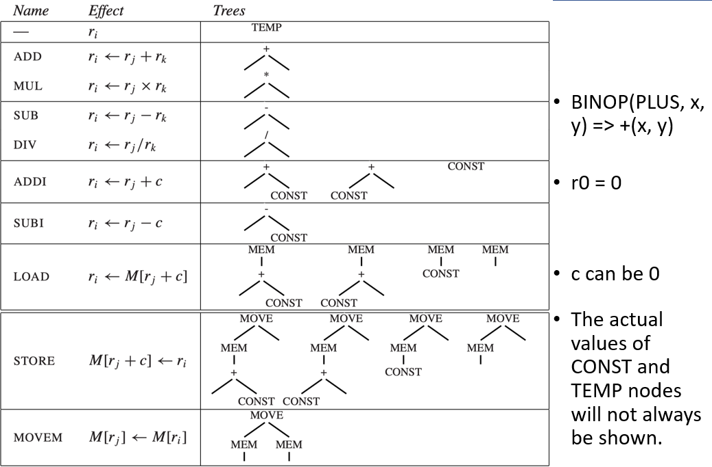{ width="600" }
</figure>

有些指令可能对应不止一个 tree pattern

<figure markdown="span">
  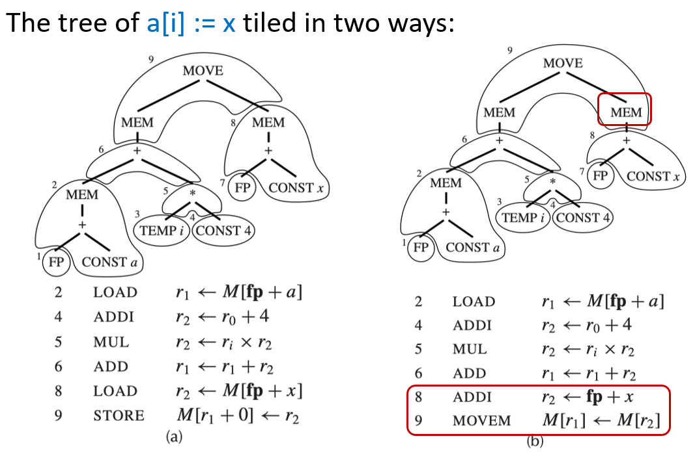{ width="600" }
</figure>

我们总是可以用 tiny tiles（微小砖块）来覆盖整棵树，每个砖块只覆盖一个节点（MOVE 节点除外）。微小砖块是指最简单、最基础的机器指令

<figure markdown="span">
  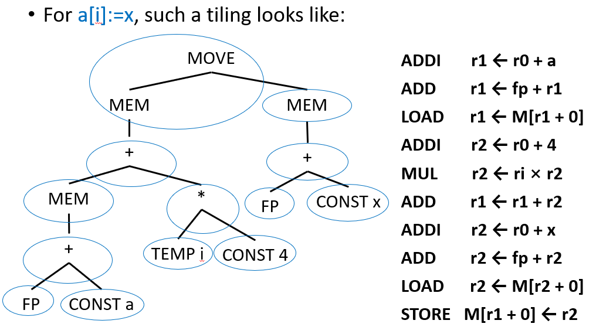{ width="600" }
</figure>

不同的铺砖方式会导致不同的代码性能：

1. best tiling：在给定 CPU 下，耗时最短的那一段汇编代码
2. optimum tiling（全局最优覆盖）：全局最优是在所有可能的“布砖”组合里，选出总成本最低的那一种。它只是一个理论上的最优
3. optimal tiling（局部最优覆盖）：编译器实际会使用的算法

<figure markdown="span">
  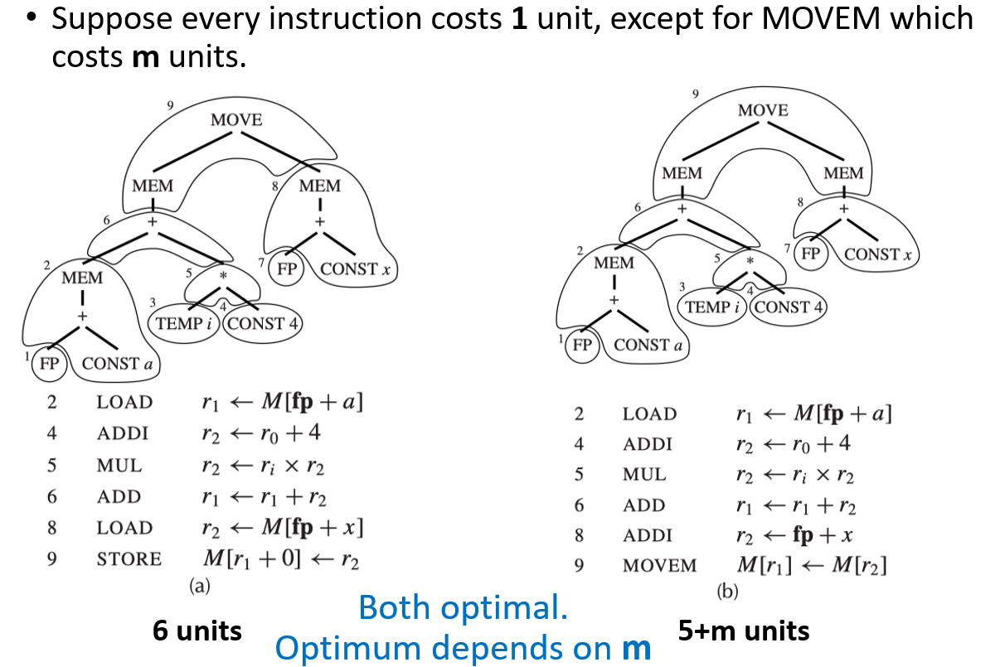{ width="600" }
</figure>

## 2 Algorithms for Instruction Selection

实现 optimal tiling 的算法比实现 optimum tiling 的算法更为简单

- 对于 CISC（复杂指令集计算机）而言，optimal tiling 和 optimum tiling 之间的区别是显著的。因为某些 CISC 指令可以单条完成多个操作
- 对于 RISC（精简指令集计算机）而言，optimal tiling 和 optimum tiling 之间通常没有任何区别。因为 RISC 的指令都很基础，且成本基本一致

因此，对于 RISC 架构，只需要用简单的贪心算法（寻找局部最优 Optimal）即可

### 2.1 Maximal Munch

maximal munch 是一种用于实现 optimal tiling 的贪心算法

1. 从树的根节点开始，寻找能够匹配的最大的砖块（指包含节点数量最多的树模式）。如果根节点匹配到了两个大小相等的砖块，那么任选其中一个即可
2. 用这个砖块覆盖根节点，或许还能覆盖根节点附近的几个其他节点，然后留下几个独立的子树
3. 对剩下的每一个子树，重复执行上述同样的算法

由于该算法是自顶向下的，因此最后生成的指令是逆序的

使用两个递归函数：

1. munchStm：处理语句
2. munchExp：处理表达式

<figure markdown="span">
  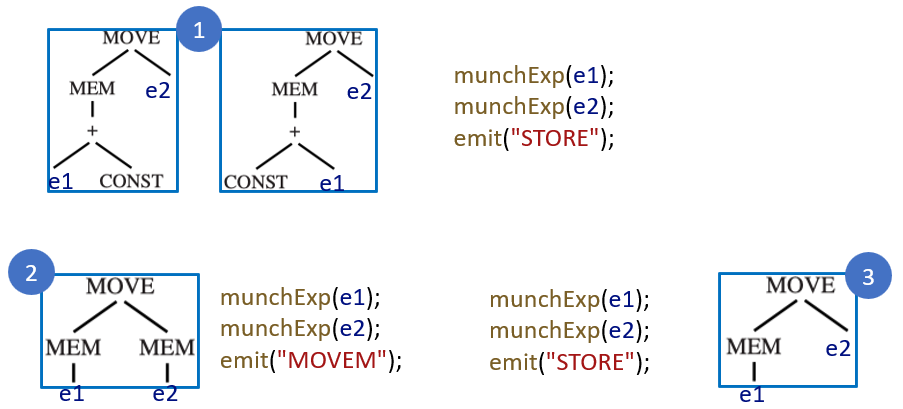{ width="600" }
</figure>

### 2.2 Dynamic Programming

动态规划基于每个子问题的全局最优解，找到整棵树的全局最优解。它自底向上进行分析，为树中每一个节点都分配一个成本值

给定一棵以节点 n 为根的中间表示树：

1. 自底向上递归地算出节点 n 的所有子节点（以及孙子节点等）的成本
2. 尝试将每一个树模式（即不同的砖块类型）与节点 n 进行匹配
3. 每一个砖块都有零个或多个叶子节点，这些叶子节点是用来挂载子树的位置
4. 对于每一个能在节点 n 匹配上的砖块 t，当在该节点选择这个砖块 t 时，总成本的计算公式为 $c_{\text{tile\_total}} = c_t + \sum\limits_i c_i$。其中所有叶子子树的成本 $\sum\limits_i c_i$ 是已经计算出的最优解
5. 最后选择成本最低的那个方案

<figure markdown="span">
  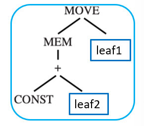{ width="200" }
</figure>

<figure markdown="span">
  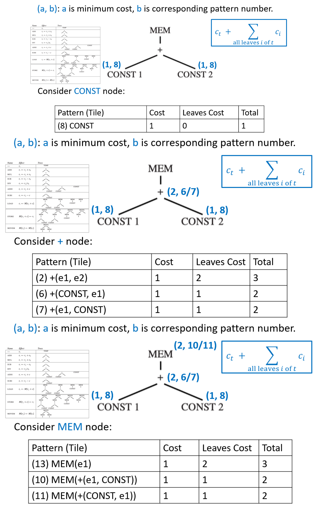{ width="600" }
</figure>

DP 阶段是决策阶段，我们用公式算出了成本，选定了具体用哪一条指令。但它还没真的生成代码。而发射阶段是执行阶段，我们要把选定的指令 emit 出来

Emission(n)：

1. 对于在节点 n 所选定的砖块的每一个叶子节点 li，先执行 Emission(li)
2. 然后再输出节点 n 处匹配到的指令

<figure markdown="span">
  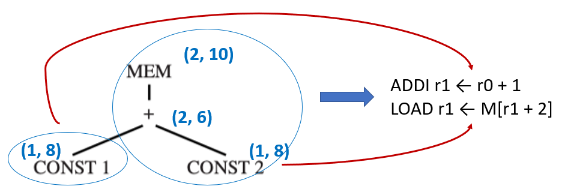{ width="600" }
</figure>

### 2.3 Tree Grammars

对于具有复杂指令集以及多类寄存器和多种寻址模式的机器，存在一个对动态规划算法的推广，树文法本质上是使用形式化规则来描述什么样的树结构可以匹配到什么样的指令。这很像“正则表达式”对文本的描述，只不过树文法是针对树结构的

<figure markdown="span">
  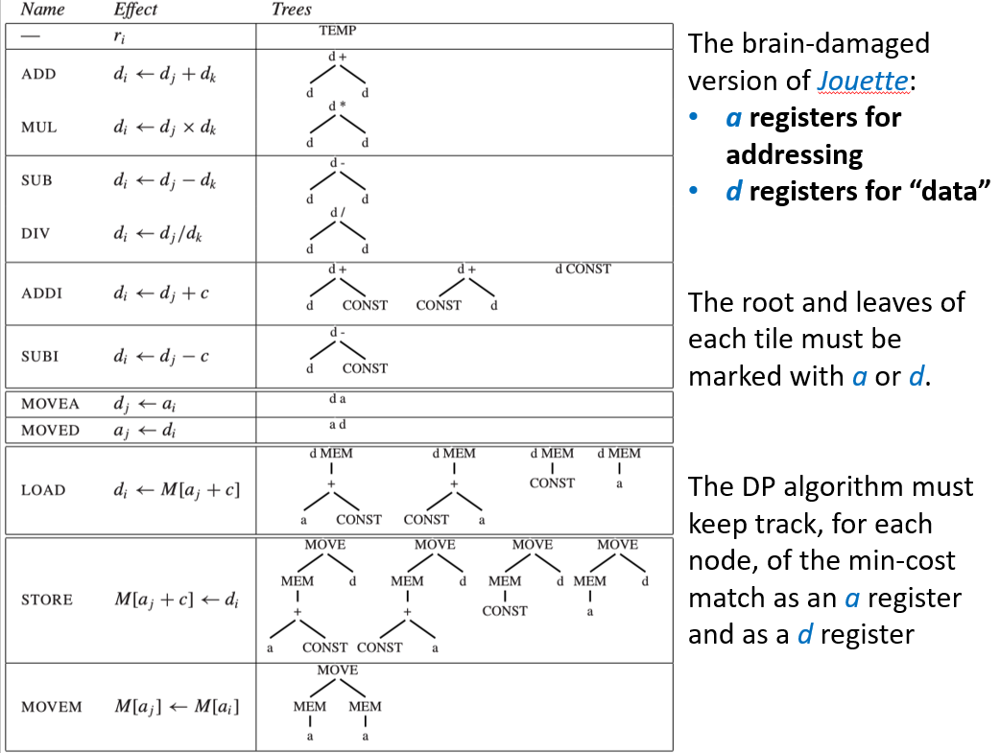{ width="600" }
</figure>

可以使用上下文无关文法来描述砖块，该文法将包含以下非终结符：

1. s：表示语句
2. a：表示计算结果放入 a 寄存器的表达式
3. d：表示计算结果放入 d 寄存器的表达式

<figure markdown="span">
  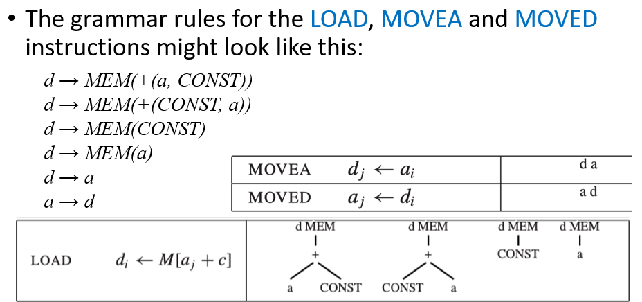{ width="600" }
</figure>

这样的文法是 highly ambiguous（高度二义性）的，因为存在许多不同的指令序列来实现同一个表达式。我们可以使用 DP 的思想来计算每个非终结符的最小代价

!!! tip "Fast Matching"

    由于一个节点可能匹配多个砖块，我们需要快速知道对于给定标签，可能有哪些砖块。可以根据节点的标签进行分类。使用 switch 语句或跳转表，直接跳转到对该标签适用的砖块检查代码，而不需要遍历所有砖块

    ```cpp linenums="1"
    switch (label(n)) {
        case MEM:
            // 检查所有以 MEM 为根的模式
            check_mem_tiles(n);
            break;
        case BINOP:
            // 检查所有以 BINOP 为根的模式
            check_binop_tiles(n);
            break;
        case CONST:
            // 常量节点
            check_const_tiles(n);
            break;
    }
    ```

    这相当于构建了一个决策树，根节点的第一层分叉就是节点的标签

!!! tip "Efficiency of Tiling Algorithms"

    假设：

    1. T：不同砖块的总数
    2. K：平均每个砖块包含 K 个非叶节点
    3. K'：在某个给定子树处，为判断哪些砖块能够匹配而需要检查的最大节点数
    4. T'：在每个树节点处，平均能够匹配的不同砖块模式数量
    5. N：输入树中的节点总数

    Maximal Munch：运行时间正比于 $(K' + T')\cdot N/K$

    DP：运行时间正比于 $(K' + T')\cdot N$

    由于 K、K' 和 T' 都是常数，所有这些算法的运行时间都是线性的（$O(N)$）

## 3 CISC Machines

CISC 寄存器数量少，中间结果可能不够放：在指令选择阶段随意生成 TEMP 节点，然后在后面的寄存器分配阶段，把这些虚拟寄存器映射到有限的物理寄存器上，必要时插入 spill（溢出到内存）

在奔腾（Pentium）处理器上进行乘法运算：左操作数必须放在 eax 寄存器中，结果的高 32 位放入 edx，低 32 位留在 eax 中。对于 Tiger 语言程序来说，高 32 位通常是无用的。我们可以显示移动数据

> 例如实现 t1 ← t2 x t3
>
> ```text linenums="1"
> Mov eax, t2
> Mul t3
> Mov t1, eax
> ```

CISC 使用二地址指令（目标寄存器同时也是第一个源操作数）：可以添加额外的 move 指令

> 例如实现 t1 ← t2 + t3
>
> ```text linenums="1"
> mov t1, t2  // t1 ← t2
> add t1, t3  // t1 ← t1 + t3
> ```
>
> 如果 t1 和 t2 最终在分配时使用同一个物理寄存器，那这条 move 就完全不需要

在指令选择阶段，我们使用虚拟寄存器（TEMP 节点），假装有无穷多的寄存器可用。但在后续的寄存器分配阶段，由于物理寄存器数量有限，很多 TEMP 会被溢出（spill）到内存中。可以在运算之前将所有操作数加载到寄存器中，运算之后再将其存回内存

```text linenums="1"
mov eax, [ebp - 8]
add eax, ecx
mov [ebp - 8], eax
```

在 CISC 架构（如 x86）中，许多算术指令允许一个操作数在内存中。因此也可以直接用一条指令完成。这个方法和上一个方法速度相同，同时更加的简洁。另外，上一个方法有一个缺点，会破坏 eax 的值

```text linenums="1"
add [ebp - 8], ecx
```

CISC 架构的一条指令可以包含复杂的寻址模式，这一条指令可能会被拆成多个步骤执行，因此写成多个简单指令的执行速度并不会变快。复杂寻址模式破坏的寄存器更少，而且指令编码更短。理论上，可以用树匹配的方法来生成 CISC 指令，但使用简单 RISC 风格指令也能达到同样快的速度。因此很多编译器选择生成简单指令，让后续的微指令融合或硬件优化来提升性能

CISC 架构的指令长度不固定，但对于编译器来说，编译器不需要知道具体每条指令的编码长度，它只需生成汇编指令。汇编器则需要考虑指令长度

某些机器具有一种“自动递增”的内存读取指令，其效果为：`r2 ← M[r1]`, `r1 ← r1 + 4`。使用树模式来建模这类指令比较困难。有三种解决方案：

1. 忽略：不生成自动递增指令，只用普通 load + add
2. 特设匹配（ad hoc way）：在代码生成器中硬编码识别特定模式（如 `*p++`）
3. DAG 模式：使用有向无环图（DAG）代替树，允许节点共享