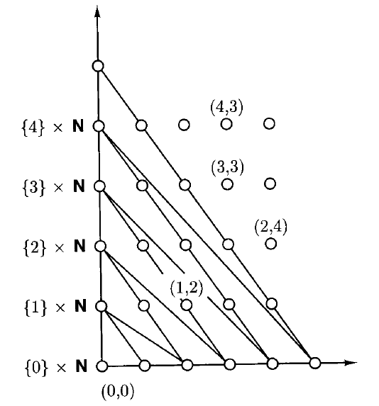

# 1 Sets, Relations, and Languages

!!! tip "说明"

    本文档正在更新中……

!!! info "说明"

    本文档仅涉及部分内容，仅可用于复习重点知识

## 1 Sets

!!! quote ""

    就是[离散数学](../../basic_courses/discrete_math.md){:target="_blank"}学的那些

A **set** is a collection of objects. 例如，四个字母 a, b, c, d 的 collection 是一个 set，常记作 $L = \lbrace a,b,c,d \rbrace$。构成一个 set 的 objects 被称为 **elements** / **members**. 例如，b 是 $L$ 的一个 element，记作 $b \in L$，称为 b is in $L$ 或 $L$ contains b. z 不是 $L$ 的 element，记作 $z \notin L$

两个集合 equal 当且仅当它们拥有相同的元素（互异性、无序性）

- **singleton**：单元素集合 / 单例
- **empty set**：空集，$\emptyset$

A set $A$ is a **subset** of a set **B**，记作 $A \subseteq B$

**proper subset**：真子集，记作 $A \subset B$

!!! tip ""

    $A \subseteq B, B \subseteq A \iff A = B$

- **union**：并集 $\cup$
- **intersection**：交集 $\cap$
- **difference**：差集 $A - B$

!!! tip "集合运算律"

    1. Idempotency
    2. Commutativity
    3. Associativity
    4. Distributivity
    5. Absorption

        1. $(A \cup B)\cap A = A$ 
        2. $(A \cap B)\cup A = A$

    6. DeMorgan's laws

        1. $A - (B \cup C) = (A - B) \cap (A - C)$
        2. $A - (B \cap C) = (A - B) \cup (A - C)$

!!! example "证明 De Morgan's laws"

    <figure markdown="span">
      { width="800" }
    </figure>

Two sets are **disjoint** if they have no element in common

如果 $S$ 是任意 sets 的 set，则集合 $\bigcup S$ 的 elements 是 $S$ 中所有 sets 的 elements

例如，$S = \lbrace \lbrace a,b \rbrace,\lbrace b,c \rbrace,\lbrace c,d \rbrace\rbrace$，$\bigcup S = \lbrace a,b,c,d \rbrace$

相似的，还有 $\bigcap S$

集合 $A$ 所有 subsets 的 collection 也是一个 set，称为 **power set** of $A$，记作 $2^A$

例如，$2^{\lbrace c,d\rbrace} = \lbrace \lbrace c,d\rbrace,\lbrace c\rbrace,\lbrace d\rbrace,\emptyset \rbrace$

$\Pi$ is a **partition** of A if $\Pi$ is a set of subsets of A such that

1. $\emptyset \notin \Pi$
2. distinct members of $\Pi$ are disjoint ($\forall S, T \in \Pi, S \not ={T}, S \cap T = \emptyset$)
3. $\bigcup \Pi = A$

例如，$\lbrace \lbrace a,b \rbrace,\lbrace c \rbrace,\lbrace d \rbrace\rbrace$ is a partition of $\lbrace a,b,c,d\rbrace$

## 2 Relations and Functions

**ordered pair**：顺序对
**components**：顺序对的元素

1. $(a,b)$ 和 $(b,a)$ 是 different
2. 顺序对的两个 components 可以不一样

The **Cartesian product** of two sets $A$ and $B$, denoted by $A \times B$, is the set of all ordered pairs $(a,b)$ with $a \in A$ and $b \in B$

A **binary relation** on two sets $A$ and $B$ is a subset of $A \times B$

一般的，$(a_1, \cdots, a_n)$ is an **ordered tuple**（元素不一定互不相同）

- ordered 2-tuples = ordered pairs
- ordered 3-tuples = ordered triples
- ordered 4-tuples = ordered quadruples
- ordered 5-tuples = ordered quintuples
- ordered 6-tuples = ordered sextuples

**sequence**：更通用的术语，指一个具有特定长度 n 的有序元组

**n-fold Cartesian product**：n 重笛卡尔积

$A$ 自身的 n-fold Cartesian product 记作 $A^n$

**n-ary relation** on sets $A_1, \cdots, A_n$ is a subsets of $A_1 \times \cdots \times A_n$

- 1-ary = unary
- 2-ary = binary
- 3-ary = ternary

A **function** from a set $A$ to a set $B$ is a binary relation $R$ on $A$ and $B$ with the following special property: for each element $a \in A$, there is *exactly one* ordered pair in $R$ with first component $a$

> 不能一对多，可以多对一

$f: A \mapsto B$

1. call $A$ the **domain** of $f$
2. $f(a)$ is called the **image** of $a$ under $f$
3. $f(a_1, \cdots, a_n) = b$, call $a_i$ the **arguments** of $f$, call $b$ the corresponding **value** of $f$

- **one-to-one**：单射（这个英文称呼感觉有点歧义）
- $f: A \mapsto B$ is **onto** $B$ if each element of $B$ is the image under $f$ of some element of $A$. 满射
- $f: A \mapsto B$ is a **bijection** between $A$ and $B$ if it is both one-to-one and onto $B$. 一一对应 / 双射

The **inverse** of a binary relation $R \subseteq A \times B$, denoted $R^{-1} \subseteq B \times A$, is the relation $\lbrace (b,a):(a,b) \in R \rbrace$

$Q \circ R = QR = \lbrace (a,b): \exist c\ (a,c) \in Q, (c,b) \in R \rbrace$

$(f \circ g)(a) = f(g(a))$

## 3 Special Types of Binary Relations

relation 可以用 **directed graph** 来表示

- **node**
- **edge**
- **path**：**length**（顶点数），**cycle**

例如：$R=\lbrace (a,b),(b,a),(a,d),(d,c),(c,c),(c,a) \rbrace$

<figure markdown="span">
  { width="200" }
</figure>

A relation $R \subseteq A \times A$ is

1. **reflexive** if $\forall a \in A,(a,a) \in R$
2. **symmetric** if $(a,b) \in R \implies (b,a) \in R$
3. **antisymmetric** if $(a,b) \in R \wedge a \not ={b} \implies (b,a) \notin R$
4. **transitive** if $(a,b) \in R, (b,c) \in R \implies (a,c) \in R$

一个不存在形如 $(a,a)$ 对的 symmetric relation 称作 **undirected graph**，简称 **graph**，例如：

<figure markdown="span">
  { width="600" }
</figure>

!!! tip ""

    一个 relation 可以既不是 symmetric 也不是 antisymmetric

一个 relation 如果是 reflexive，symmetric，transitive 的，称为 **equivalence relation**

The clusters of an equivalence relation are called its **equivalence classes**. $[a] = \lbrace b:(a,b) \in R \rbrace$

!!! tip ""

    Let $R$ be an equivalence relation on a nonempty set $A$. Then the equivalence classes of $R$ constitute a partition of $A$

!!! example "proof"

    <figure markdown="span">
      { width="800" }
    </figure>

一个 relation 如果是 reflexive，antisymmetric， transitive 的，称为 **partial order**

如果 $R \subseteq A \times A$ 是 partial order，则一个 element $a \in A$ 是 **minimal** 如果满足条件：当且仅当 $a = b$，有 $(b,a) \in R$

一个 partial order $R \subset A \times A$ 是 **total order** if $\forall a,b \in A$，either $(a, b ) \in R$ or $(b,a) \in R$

## 4 Finite and Infinite Sets

call two sets $A$ and $B$ **equinumerous** 当且仅当存在一个双射 $f: A \rightarrow B$

!!! tip ""

    等势关系是一种等价关系

我们称一个 set 是 **finite** 如果它与形如 $\lbrace 1,2,\cdots,n \rbrace,n \in N$ 的集合等势

!!! tip ""

    如果 $n = 0$，那么 $\lbrace 1,2,\cdots,n \rbrace$ 是 $\emptyset$，$\emptyset$ 和 $\emptyset$ 等势，因此 $\emptyset$ 是 finite

如果 $A$ 与 $\lbrace 1,2,\cdots,n \rbrace$ 等势，则称 cardinality of $A$ is $n$, $|A| = n$

一个 set **infinite** 如果它不 finite

A set is said to be **countably infinite** if ti is equinumerous with $N$

A set is said to be **countable** if it is finite or countably infinite

A set that is not countable is **uncountable**

!!! tip ""

    S is an uncountable set $\iff |S| > |N|$

!!! tip ""

    任意有限个可数无限集的并集仍然是可数无限的

!!! example "Dovetailing 证明 $A \cup B \cup C$ countably infinite"

    鸽尾法

    $A = \lbrace a_0,a_1,\cdots\rbrace$, $B = \lbrace b_0,b_1,\cdots\rbrace$, $C = \lbrace c_0,c_1,\cdots\rbrace$

    <figure markdown="span">
      { width="600" }
    </figure>

    因此，$A \cup B \cup C$ 的每个元素都能分配到一个唯一的自然数下标

!!! tip ""

    可数无限个可数无限集的并集也是可数无限的

!!! example "证明 $N \times N$ countably infinite"

    $N \times N$ 是 $\lbrace 0\rbrace \times N$, $\lbrace 1\rbrace \times N$ …… 这些集合的并集，因此它是一个可数无限个可数无限集的并集

    <figure markdown="span">
      { width="600" }
    </figure>

    $(i,j)$ 对是第 $m$ 次访问的，$m = \dfrac{1}{2}[(i+j)^2 + 3i +j]$，因此 $f(i,j) = \dfrac{1}{2}[(i+j)^2 + 3i +j]$ 就是一个 bijection 从 $N \times N$ 到 $N$

!!! tip ""

    $|R| > |N|$, $|R| = |(0,1)|$

!!! tip ""

    $|N| = \aleph_0$, $|R| = \aleph_1$

    $\aleph_0 < \aleph_1$

## 5 Three Fundamental Proof Techniques

### 5.1 The Principle of Mathematical Induction

**数学归纳法**

例：对于 finite set $A$，有 $|2^A| = 2^{|A|}$

<figure markdown="span">
  { width="800" }
</figure>

### 5.2 The Pigeonhole Principle

!!! tip "鸽巢原理"

    If $A$ and $B$ are finite sets and $|A| > |B|$, then there is no one-to-one function from $A$ to $B$

> 将 n + 1 个鸽子放到 n 个鸽巢里，至少有 1 个鸽巢中有至少 2 个鸽子

!!! tip ""

    Let $R$ be a binary relation on a finite set $A$, and let $a,b\in A$. If there is a path from $a$ to $b$ in $R$, then there is a path of length at most $|A|$

<figure markdown="span">
  { width="800" }
</figure>

### 5.3 The Diagonalization Principle

!!! tip "对角化原理"

    Let $R$ be a binary relation on a set $A$, and let $D$, the diagonal set for $R$, be $\lbrace a:a \in A\ and\ (a,a) \notin R \rbrace$. For each $a \in A$, let $R_n = \lbrace b:b \in A\ and\ (a,b) \in R \rbrace$. Then $D$ is distinct from each $R_a$

<figure markdown="span">
  { width="800" }
</figure>

!!! tip ""

    The set $2^N$ is uncountable

<figure markdown="span">
  { width="800" }
</figure>

## 6 Closures and Algorithms

Let $R \subseteq A^2$ be a directed graph defined on a set $A$. The **reflexive transitive closure** of $R$ is the relation 

$R^* = \lbrace (a,b):a,b\in A\ \text{and there is a path from}\ a\ \text{to}\ b\ \text{in}\ R \rbrace$

> 闭包：给一个原始对象添加最少的额外元素，使其具备某个我们期望的性质

The **order** of $f$, denoted $O(f)$

$g(n) \in O(f(n)) \iff$ 存在 $c>0, d>0$，对于所有 $n\in N$，都有 $g(n) \leqslant c \cdot f(n) + d$

如果 $f \in O(g)$, $g \in O(f)$，则记作 $f \asymp g$（两个函数的增长率相同）

**closure property**：描述了一个集合对于某种操作或规则的“完备性”

> 如果在集合中选取一些元素，并且根据规则这些元素可以“产生”或“决定”另一个元素，那么这个被产生的元素也必须已经在集合里面了

!!! tip ""

    Let $P$ be a closure property defined by relations on a set $D$, and let $A$ be a subset of $D$. Then there is a unique minimal set $B$ that contains $A$ and has property $P$

> 就是说，某个集合关于某个性质的闭包是一定存在的

## 7 Alphabets and Languages

**empty string** is denoted by $e$

The set of all strings, including the empty string, over an alphabet $\Sigma$ is denoted by $\Sigma^*$

**concatenation**：$x \circ y$ or simply $xy$, is the string $x$ followed by the string $y$

- **suffix**：后缀
- **prefix**：前缀

$w^i = \begin{cases}
    w^0 = e\\
    w^{i+1}=w^i \circ w & \text{for each } i \geqslant 0
\end{cases}$

the **reversal** of a string $w$, denoted by $w^R$

!!! tip ""

    $w = ua, a \in \Sigma \implies w^R = au^R$ 
    $(wx)^R = x^Rw^R$

any subset of $\Sigma^*$ will be called a **language**

$L = \lbrace w \in \Sigma^*: w \text{ has property } P \rbrace$

$L_1L_2 = \lbrace xy: x \in L_1\ and\ y \in L_2\rbrace$

!!! tip ""

    if $\Sigma$ is a finite alphabet, then $\Sigma^*$ is countably infinite set

    > 因为可以按照 **lexicographic** 进行枚举

the **complement** of $A$: $\bar{A}$

**Kleene star** of a language $L$, denoted by $L^*$

$L^* = \lbrace w\in \Sigma^*: w = w_1 \circ \cdots \circ w_k \text{ for some } k \geqslant 0 \text{ and some } w_1, \cdots , w_k \in L \rbrace = \bigcup^\infin_{i=0} L^i$

例如：$L = \lbrace 01,1,100\rbrace$，$110001110011 \in L^*$

> 之前遇到的 $\Sigma^*$ 也是同样的意思

!!! tip ""

    $\emptyset^* = \lbrace e\rbrace$ 
    $L_1 \subseteq L_2 \implies L_1^* \subseteq L_2^*$ 
    $(L^*)^* = L^*$ 
    $L\emptyset = \emptyset L = \emptyset$

$L^+ = LL^* = \lbrace w\in \Sigma^*: w = w_1 \circ \cdots \circ w_k \text{ for some } k \geqslant 1 \text{ and some } w_1, \cdots , w_k \in L \rbrace = \bigcup^\infin_{i=1} L^i$

在 concatenation 运算下，$L^+$ 可以看作是 $L$ 的 closure。$L^+$ 是最小的包含 $L$ 且包含 $L$ 中任意字符串的所有连接结果的 language