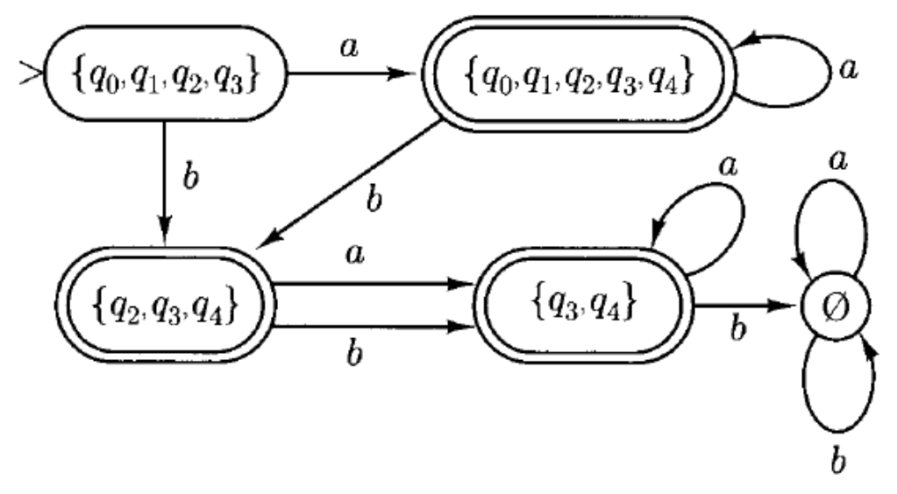

# 2 Finite Automata

!!! tip "说明"

    本文档正在更新中……

!!! info "说明"

    本文档仅涉及部分内容，仅可用于复习重点知识

## 1 Deterministic Finite Automata

A **deterministic finite automaton** is a quintuple $M = (K,\Sigma, \delta, s, F)$ where

1. $K$ is a finite set of **states**
2. $\Sigma$ is an alphabet
3. $s \in K$ is the **initial state**
4. $F \subseteq K$ is the set of **final states**
5. $\delta$, the **transition function**, is a function from $K \times \Sigma$ to $K$

**configuration** 描述了 DFA 在某个特定时刻的完整快照。一个配置被形式化地定义为 **当前状态** 和 **未读字符串** 的有序对，即属于笛卡尔积 $K \times \Sigma^*$

二元关系 $\vdash_M$ 在图灵机 $M$ 的两个配置之间成立，当且仅当机器可以通过一次移动从一个配置转换到另一个配置。因此，如果 $(q,w)$ 和 $(q',w')$ 是 $M$ 的两个配置，那么 $(q,w) \vdash_M (q', w')$ 当且仅当存在某个符号 $a \in \Sigma$，使得 $w = aw'$，并且转移函数满足 $\delta(q,a) = q'$。在这种情况下，我们说 **$(q,w)$ yields $(q',w')$ in one step**

实际上 $\vdash_M$ 是从 $K \times \Sigma^+$ 到 $K \times \Sigma^*$ 的一个函数，也就是说，除了形如 $(q,e)$ 的配置外，每个配置都有唯一确定的下一个配置。形如 $(q,e)$ 的配置表示图灵机 $M$ 已经消耗完所有输入，因此在此处停止运行

我们将 $\vdash_M$ 的 reflexive, transitive closure 记作 $\vdash_M^*$. $(q,w) \vdash_M^* (q', w')$ 被读作 **$(q,w)$ yields $(q',w')$**（在若干步（可能是零步）之后生成）

A string $w \in \Sigma^*$ is said to be **accepted** by $M$ 当且仅当存在某个状态 $q \in F$，使得 $(s,w) \vdash_M^*(q,e)$

the language accepted by $M$, $L(M)$, is the set of all strings accepted by $M$

<figure markdown="span">
  { width="800" }
</figure>

使用 **state diagram** 来方便的表示

<figure markdown="span">
  { width="200" }
</figure>

<figure markdown="span">
  { width="800" }
</figure>

## 2 Nondeterministic Finite Automata

$L = (ab\cup aba)^*$ 的 DFA 状态图

<figure markdown="span">
  { width="200" }
</figure>

> 这并不容易看懂

其 NFA 的状态图

<figure markdown="span">
  { width="200" }
  { width="200" }
</figure>

A **nondeterministic finite automaton** is a quintuple $M = (K,\Sigma, \Delta, s, F)$, where

1. $K$ is a finite set of **states**
2. $\Sigma$ is an alphabet
3. $s \in K$ is the **initial state**
4. $F \subseteq K$ is the set of **final states**
5. $\Delta$, the **transition relation**, is a subset of $K \times (\Sigma \cup \lbrace e\rbrace) \times K$

The relation $\vdash_M$ between configurations is defined as follows: $(q,w) \vdash_M (q', w')$ if and only if there is a $u \in \Sigma \cup \lbrace e\rbrace$ such that $w = uw'$ and $(q,u,q') \in \Delta$

$\vdash_M^*$ 同理

<figure markdown="span">
  { width="800" }
</figure>

由定义可知，DFA 是 NFA 的一种特殊情况

tow finite automata $M_1$ and $M_2$ are **equivalent** if and only if $L(M_1) = L(M_2)$

!!! tip ""

    每一个 NFA 都有和它 equivalent 的 DFA

令 $E(q) = \lbrace p \in K: (q,e) \vdash_M^* (p,e)\rbrace$

<figure markdown="span">
  { width="800" }
</figure>

现在定义一个和原状态机 $M$ 等价的状态机 $M' = (K',\Sigma,\delta',s',F')$

1. $K' = 2^K$
2. $s' = E(s)$
3. $F' = \lbrace Q \subseteq K: Q \cap F \not ={\emptyset}\rbrace$
4. $\delta'(Q,a)=\bigcup\lbrace E(p):p\in K \ and\ (q,a,p)\in \Delta\ for\ some\ q \in Q\rbrace$

> 这就是子集构造法

现在我们构造一个和 ^^Figure 2-9^^ 等价的 NFA：

**1.定义初始状态 $s'$**

$s' = E(q_0) = \lbrace q_0,q_1,q_2,q_3\rbrace$

**2.计算 $\delta'(s',a)$ 和 $\delta'(s',b)$**

$\delta'(s',a) = E(q_0) \cup E(q_4) = \lbrace q_0,q_1,q_2,q_3,q_4\rbrace$

$\delta'(s',b) = E(q_2) \cup E(q_4) = \lbrace q_2,q_3,q_4\rbrace$

**3.继续构建其他状态**

现在我们已经有了三个状态：

1. $s' = \lbrace q_0,q_1,q_2,q_3\rbrace$
2. $A = \lbrace q_0,q_1,q_2,q_3,q_4\rbrace$
3. $B = \lbrace q_2,q_3,q_4\rbrace$

继续不断计算它们的转移即可，得到

- $C = \lbrace q_3,q_4\rbrace$
- $\emptyset$

由于原 DFA 的 $q_4$ 是最终状态，所以这里的 NFA 的最终状态有 $A,B,C$

<figure markdown="span">
  { width="800" }
</figure>

## 3 Finite Automata and Regular Expressions

!!! tip ""

    The class of languages accepted by finite automata is closed under

    1. union
    2. concatenation
    3. Kleene star
    4. complementation
    5. intersection
    
    > 如果两个语言 $L_1, L_2$ 都能被某个有限自动机识别（即它们是正则语言），那么通过这些运算得到的新语言也仍然是正则语言。也就是说，正则语言对这些基本运算具有“封闭性”

给定两个 NFA $M_1, M_2$

**1.union**

构造一个新的 NFA $M$，使得 $L(M) = L(M_1) \cup L(M_2)$

构造方法：

1. 引入一个新的初始状态 $s$，该状态不在 $K_1$ 或 $K_2$ 中
2. 从 $s$ 出发，用空转移分别到达 $M_1$ 和 $M_2$ 的初始状态 $s_1$ 和 $s_2$
3. 接受状态（final state）集合为 $F_1 \cup F_2$
4. 状态转移函数为两个原自动机的并集，并加上新的 $e$ 转移

<figure markdown="span">
  { width="600" }
</figure>

**2.concatenation**

构造一个新的 NFA $M$，使得 $L(M) = L(M_1) \circ L(M_2)$

1. 先运行 $M_1$
2. 一旦 $M_1$ 到达某个接受状态，就通过 $e$ 转移到 $M_2$ 的初始状态 $s_2$
3. 然后运行 $M_2$

<figure markdown="span">
  { width="600" }
</figure>

**3.Kleene star**

构造一个新的 NFA $M$，使得 $L(M) = L(M_1)^*$

1. $M$ 在 $M_1$ 的基础上增加了一个状态 $s_1'$，同时这个状态也是 $M$ 的初始状态
2. 从 $s_1'$ 有一个 $e$ 转移到达 $s_1$，从这里运行 $M_1$
3. 到达 $M_1$ 的接受状态后，通过 $e$ 转移能够回到 $s_1$，以便重复运行

<figure markdown="span">
  { width="600" }
</figure>

**4.Complementation**

给定一个 DFA $M = (K,\Sigma,\delta,s,F)$，其补语言 $\bar{L} = \Sigma^* - L(M)$ 可以被另一个 DFA $\bar{M} = (K,\Sigma,\delta,s,K-F)$ 所接受

也就是说 $\bar{M}$ 和 $M$ 完全相同，只是终态和非终态互换了一下而已

**5.intersection**

$L_1 \cap L_2 = \Sigma^* - ((\Sigma^* - L_1) \cup (\Sigma^* - L_2))$

可以从 union 和 complementation 中推导出来

!!! tip ""

    A language is regular if and only if it is accepted by a finite automaton

<figure markdown="span">
  { width="800" }
</figure>

为 ^^Figure 2-15^^ 中的 DFA 所接受的语言构造一个正则表达式：

$\lbrace w \in\lbrace a,b\rbrace^*: w 包含 3k+1 个 b，其中 k \in N\rbrace$

<figure markdown="span">
  { width="200" }
</figure>

**简化条件**：

1. 只有一个终态，记作 $F = \lbrace f\rbrace$
2. 没有进入初始状态 $s$ 的转移
3. 没有从终态 $f$ 发出的转移

使用 **州消除法**：通过逐步删除中间状态的方式，将 DFA 转换为一个只包含初始状态和终态的状态，并用正则表达式标注边上的路径

1. 将原自动机改写为“特殊形式”——单初态、单终态，无入初态或出终态的转移
2. 编号状态为 $q_1,q_2,\cdots,q_n$，设 $s=q_{n-1},f=q_n$
3. 目标是求出从 $q_{n-1}$ 到 $q_n$ 的所有路径对应的正则表达式，即 $R(n-1,n,n)$
4. 使用递推公式计算 $R(i,j,k)$：表示从状态 $i$ 到 $j$，途中不经过编号大于 $k$ 的状态的所有路径组成的语言

**1.根据简化条件转换**

添加新初始状态 $q_4$，新终态 $q_5$，使满足简化条件

<figure markdown="span">
  { width="200" }
</figure>

**2.计算 $R(i,j,1)$：消除状态 $q_1$**

现在要消除状态 $q_1$，根据算法，我们考虑所有经过 $q_1$ 的路径，并将其替换为等价的正则表达式

1. $q_4 \rightarrow q_1 \rightarrow q_3$: $ea^*b = a^*b$
2. $q_2 \rightarrow q_1 \rightarrow q_3$: $ba^*b$

得到：

<figure markdown="span">
  { width="200" }
</figure>

**3.计算 $R(i,j,2)$：消除状态 $q_2$**

$q_3 \rightarrow q_2 \rightarrow q_3$: $ba^*ba^*b$

得到：

<figure markdown="span">
  { width="200" }
</figure>

**4.消除状态 $q_3$**

$q_4 \rightarrow q_3 \rightarrow q_5$: $a^*b(a \cup ba^*ba^*b)^*$

<figure markdown="span">
  { width="200" }
</figure>

最终答案就是 $a^*b(a \cup ba^*ba^*b)^*$

## 4 Languages That Are and Are Not Regular

