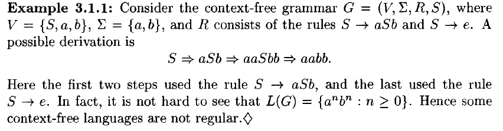
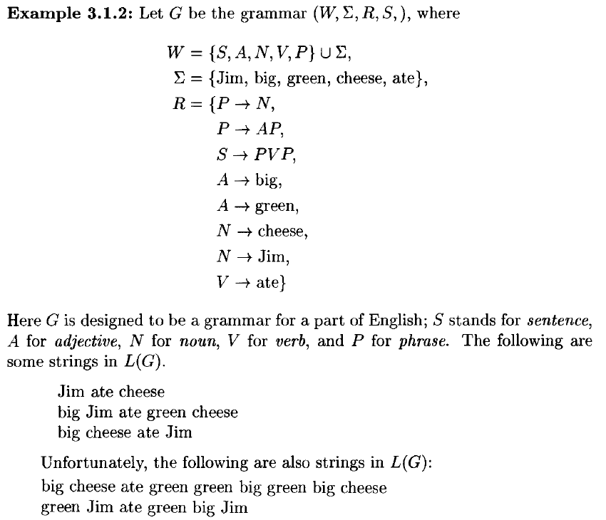
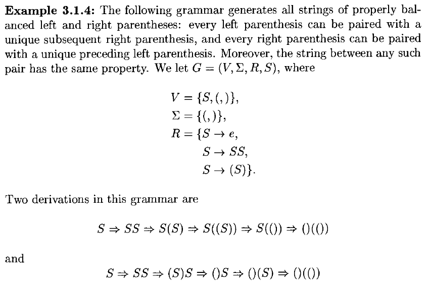
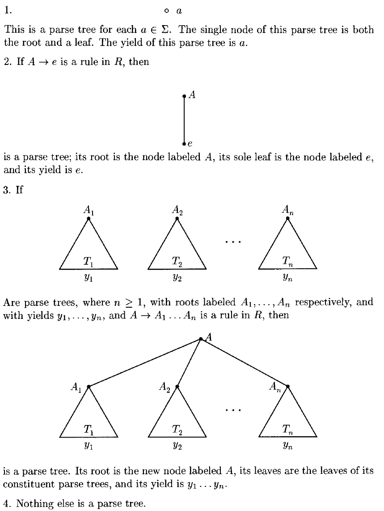
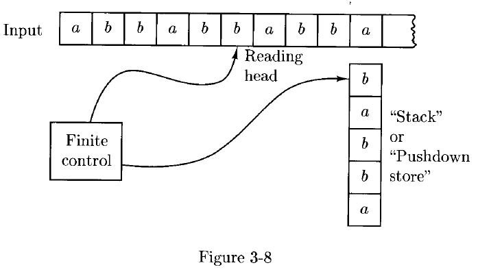
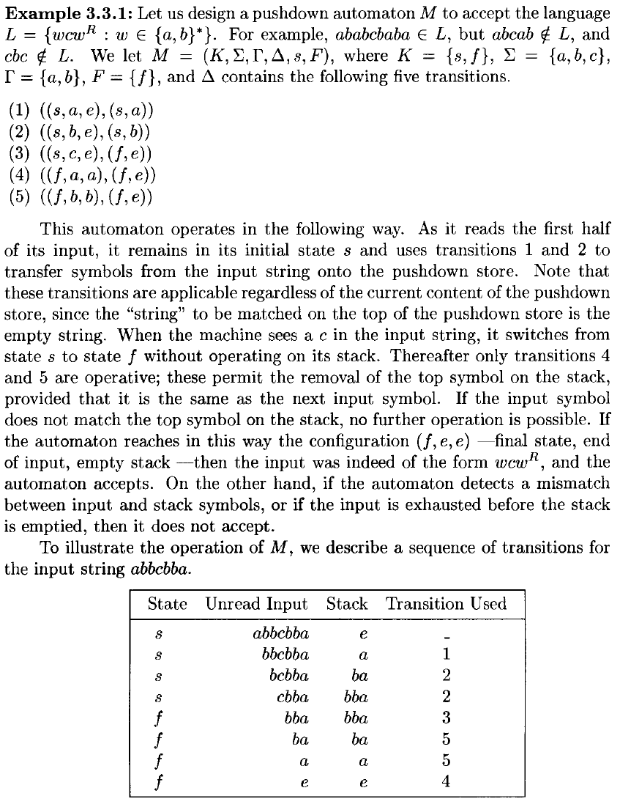
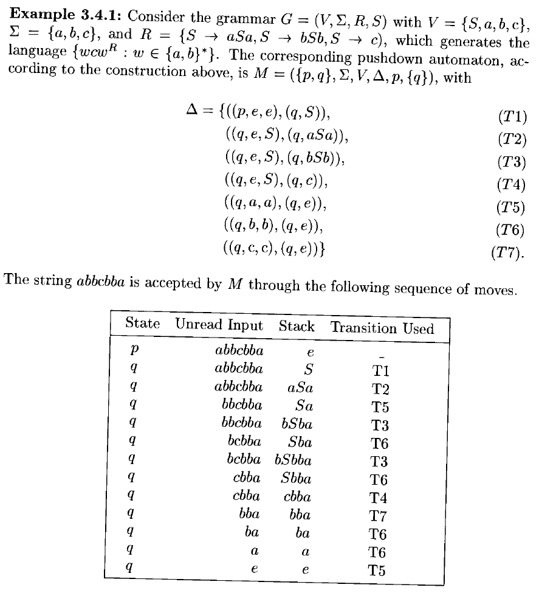

# 3 Context-Free Languages

<!-- !!! tip "说明"

    本文档正在更新中…… -->

!!! info "说明"

    本文档仅涉及部分内容，仅可用于复习重点知识

## 1 Context-Free Grammars

- **language recognizer**：一个接受有效字符串的装置
- **language generator**：一个生成有效字符串的装置

**context-free grammars**：一类更复杂的语言生成器

以 $a(a^* \cup b^*) b$ 为例

令 $S$ 表示语言中的一个字符串，$M$ 表示中间部分，那么

$S \rightarrow aMb$

$\rightarrow$ 读作 "can be"，我们称这样的表达式为一条 **rule**。中间部分 $M$ can be 什么？要么是一串 $a$，要么是一串 $b$。我们通过添加以下规则来表达这一点：

$M \rightarrow A$，$M \rightarrow B$

$A$ 和 $B$ 分别表示一串 $a$ 和 $b$。那么什么是一串 $a$？可以继续添加规则

$A \rightarrow e$ 或者 $A \rightarrow aA$

于是，由 $a(a^* \cup b^*) b$ 所表示的语言，也可以由以下语言生成器来定义：从仅包含单个符号 $S$ 的字符串开始。在上述规则中，找出当前字符串中出现在某个箭头 $→$ 左侧的符号。用该规则中箭头右侧的字符串替换这个符号。重复此过程，直到无法再找到这样的符号为止

例如，为了生成字符串 $aaab$：

1. $S \rightarrow aMb$
2. 应用规则 $M \rightarrow A$，得到 $aAb$
3. 然后应用两次规则 $A \rightarrow aA$，得到 $aaaAb$
4. 最后应用规则 $A \rightarrow e$，得到 $aaab$

A **context-free grammar**（上下文无关文法）是一种像上面那样工作的语言生成器，它由一组类似的规则构成

> 考虑中间阶段的字符串 $aaAb$，它是生成 $aaab$ 过程中的一个中间结果。自然地，我们可以称其左右两边的字符串 $aa$ 和 $b$ 为符号 $A$ 的 **context**。现在，规则 $A \rightarrow aA$ 表示：无论周围字符串是什么，都可以将 $A$ 替换为 $aA$；换句话说，independently of the context of A

在一个上下文无关文法中，有些符号出现在规则中箭头左侧，而另一些符号则不会。后者这类符号称为 **terminals**，因为当生成的字符串只由这些符号组成时，就标志着生成过程的终止

!!! info ""

    A context-free grammar $G$ is a quadruple $(V, \Sigma, R,S)$ where

    1. $V$ is an alphabet
    2. $\Sigma$ (the set of terminals) is a subset of $V$
    3. $R$ (the set of rules) is a finite subset of $(V - \Sigma) \times V^*$
    4. $S$ (the start symbol) is an element of $V - \Sigma$

    集合 $V - \Sigma$ 中的成员称为 nonterminals
    
    对于任意 $A \in V - \Sigma$ 和 $u \in V^*$，如果 $(A, u) \in R$，我们就写作 $A \rightarrow_G u$
    
    对于任意两个字符串 $u,v \in V^*$，我们写成 $u \Rightarrow_G v$ 当且仅当存在字符串 $x, y \in V^*$ 和非终结符 $A \in V - \Sigma$，使得 $u=xAy, v=xv'y$，且 $A \rightarrow_G v'$

    关系 $\Rightarrow^*_G$ 是 $\Rightarrow_G$ 的自反传递闭包

    记 $L(G)$ 为由 $G$ 生成的语言，即 $\lbrace w \in \Sigma^*: S \Rightarrow^*_G w \rbrace$。我们也说 $G$ **generates** $L(G)$ 中的每个字符串

    一个语言 $L$ 被称为 **context-free language**，当且仅当存在某个上下文无关文法 $G$ 使得 $L = L(G)$

将任何形如：$w_0 \rightarrow_G w_1 \rightarrow_G \cdots \rightarrow_G w_n$ 的序列称为在 $G$ 中从 $w_0$ 到 $w_n$ 的一个 **derivation**（推导）。这里 $w_0, \cdots, w_n$ 可以是 $V^*$ 中的任意字符串，并且 $n$（the **length** of the derivation）可以是任何自然数，包括 0。我们也说该推导有 $n$ 个 **steps**（步骤）

<figure markdown="span">
  { width="800" }
</figure>

<figure markdown="span">
  { width="800" }
</figure>

!!! tip ""

    - there are context-free languages that are not regular
    - all regular languages are context-free

## 2 Parse Trees

<figure markdown="span">
  { width="800" }
</figure>

the string ()() can be derived from $S$ by at least two distinct derivations, namely, 

$S \Rightarrow SS \Rightarrow (S)S \Rightarrow ()S \Rightarrow ()(S) \Rightarrow ()()$ $S \Rightarrow SS \Rightarrow S(S) \Rightarrow (S)(S) \Rightarrow (S)() \Rightarrow ()()$

both derivations can be pictured as in ^^Figure 3-2^^

<figure markdown="span">
  { width="400" }
</figure>

我们称这样的图为一个 **parse tree**（解析树）。图中的点称为 **nodes**；每个节点携带一个 **label**，该标签是集合 $V$ 中的一个符号。最顶层的节点称为 **root**，底部的节点称为 **leaves**。所有叶子节点都标记为 **terminals**，或者可能是空串 $ε$。将叶子节点的标签从左到右连接起来，得到的终结符串称为该解析树的 **yield**（产出）

更正式地，对于任意一个上下文无关文法 $G=(V,Σ,R,S)$，我们如下定义它的解析树、根节点、叶子节点以及产出：

<figure markdown="span">
  { width="800" }
</figure>

直观上，解析树是一种表示语言 $L(G)$ 中字符串推导的方式，使得由于规则应用顺序不同而导致的表面差异被忽略。换句话说，解析树代表了 equivalence classes of derivations（推导的等价类）

设两个推导 $D = x_1 \Rightarrow x_2 \Rightarrow \cdots \Rightarrow x_n$ 和 $D' = x_1' \Rightarrow x_2' \Rightarrow \cdots \Rightarrow x_n'$，我们说 $D$ **precedes**（先于）$D'$，记作 $D \prec D'$，当且仅当 $n > 2$ 且存在一个整数 $1 < k < n$ 满足：

1. 对所有 $i \not ={k}$，有 $x_i = x_i'$
2. $x_{k-1} = x_{k-1}' = uAvBw$，其中 $u,v,w \in V^*$，$A,B \in V - \Sigma$
3. $x_k = uyvBw$，其中 $A \rightarrow y \in R$
4. $x_k' = uAvzw$，其中 $B \rightarrow z \in R$
5. $x_{k+1} = x_{k+1}' = uyvzw$

换句话说，这两个推导在除两个连续步骤外完全相同，在这两个步骤中，相同的两个非终结符 A 和 B 被替换为相同的两个字符串，但替换的顺序相反：在其中一个推导中先替换 A，在另一个中先替换 B

> 先替换左边那个非终结符的推导被称为 precede 另一个推导

<figure markdown="span">
  { width="800" }
</figure>

我们说两个推导 $D$ 和 $D'$ 是 **similar**（相似的），如果这对 $(D,D')$ 属于关系 $\prec$ 的 reflexive, symmetric, transitive closure。由于任意关系的自反、对称、传递闭包根据定义是自反的、对称的和传递的，因此相似性是一种等价关系。换句话说，两个推导是相似的，当且仅当它们可以通过一系列规则应用顺序的交换相互转换。这样的一个交换可以将一个推导替换为另一个它先于的推导，或者被一个它先于的推导所替换

<figure markdown="span">
  { width="800" }
</figure>

每个在相似性下的推导等价类（即每棵解析树），都包含一个在 $≺$ 关系下是极大的推导；也就是说，它不被任何其他推导所先于。这个推导被称为 **leftmost derivation**。每棵解析树中都存在最左推导，它可以通过以下方式从解析树得到：从根节点标签 $A$ 开始，反复地根据解析树所建议的规则，替换当前字符串中最左边的非终结符

类似地，**rightmost derivation** 是指不被任何其他推导所先于的推导，它是通过总是扩展当前字符串中最右边的非终结符从解析树中得到的

每一棵解析树恰好有一个最左推导和一个最右推导。这是因为，在每一步中，只有一个非终结符可以被替换：对于最左推导来说是最左边的那个，对最右推导则是最右边的那个

我们将最左推导写成 $x \xrightarrow{L} y$，最右推导写成 $x \xrightarrow{R} y$。如果 $x_1 \Rightarrow x_2 \Rightarrow \cdots \Rightarrow x_n$ 是一个最左推导，那么 $x_1 \xrightarrow{L} x_2 \xrightarrow{L} \cdots \xrightarrow{L} x_n$

!!! tip ""

    设 $G=(V,Σ,R,S)$ 是一个上下文无关文法，令 $A \in V - \Sigma, w \in \Sigma^*$。则下列语句是等价的：

    1. $A \Rightarrow^* w$
    2. 存在一棵以 $A$ 为根、产出为 $w$ 的解析树
    3. 存在一个最左推导 $A \xrightarrow{L}^* w$
    4. 存在一个最右推导 $A \xrightarrow{R}^* w$

## 3 Pushdown Automata

并非每种上下文无关语言都能被有限自动机识别，因为我们已经看到，有些上下文无关语言不是正则语言。那么，什么样的更强大的设备可以用来识别任意的上下文无关语言呢？或者更具体地说，我们需要向有限自动机添加哪些额外功能，才能使其接受任何上下文无关语言？

考虑语言 $\lbrace ww^R: w \in \lbrace a,b\rbrace^* \rbrace$。这个语言是上下文无关的，但不是正则语言

看起来，任何能够从左到右读取该语言字符串的设备都必须记住输入字符串的前半部分，以便将其按相反顺序与后半部分进行匹配。因此，这种功能显然无法由有限自动机完成 —— 因为有限自动机没有足够的记忆能力来存储整个前半段字符串

然而，如果机器能够在读取输入的同时累积存储字符串，那么它就可以非确定性地猜测何时到达了输入的中心位置，然后逐个从内存中取出符号进行检查。这种存储设备不必是通用的。一种 stack 或 pushdown store，只允许对最顶部的符号进行读写访问，就非常合适

<figure markdown="span">
  { width="600" }
</figure>

!!! info ""

    定义 **pushdown automaton**（下推自动机，PDA）为一个六元组 $M = (K,\Sigma,\Gamma,\Delta,s,F)$，其中

    1. $K$ is a finite set of **states**
    2. $\Sigma$ is an alphabet (the **input symbols**)
    3. $\Gamma$ is an alphabet (the **stack symbols**)
    4. $s \in K$ is the **initial state**
    5. $F \subseteq K$ is the set of **final states**
    6. $\Delta$, the **transition relation**, is a finite subset of $(K \times (\Sigma \cup \lbrace e \rbrace) \times \Gamma^*) \times (K \times \Gamma^*)$

如果 $((p,a,\beta), (q,\gamma)) \in \Delta$，说明当机器处于状态 $p$，栈顶为 $\beta$ 时，它可以从输入带上读取符号 $a$，将栈顶的 $\beta$ 替换为 $\gamma$，进入状态 $q$

这样的一对 $((p,a,β),(q,γ))$ 被称为 $M$ 的一个 **transition**。由于在任意时刻可能有多个转移同时适用，我们所描述的机器是非确定性的

- 将一个符号 **push** 栈：$((p,a,e),(q,a))$
- 将一个符号 **pop** 栈：$((p,a,a),(q,e))$

正如有限自动机的情况一样，在计算过程中，已经读取的输入部分不会影响机器后续的操作。因此，一个下推自动机的 **configuration** 被定义为三元组 $K \times \Sigma^* \times \Gamma^*$ 的一个成员：

1. 第一个分量是机器的当前状态
2. 第二个分量是尚未读取的输入部分
3. 第三个分量是下推存储器（栈）的内容，按从上到下的顺序读取

> 如果配置是 $(q,w,abc)$，那么 $a$ 位于栈顶，$c$ 位于栈底

如果 $(p,x,α)$ 和 $(q,y,ζ)$ 是机器 $M$ 的两个配置，我们说 $(p,x,α)$ 在一步内产生（**yields in one step**）$(q,y,ζ)$，记作 $(p,x,α)⊢_M (q,y,ζ)$，当且仅当存在一条转移 $((p,a,β),(q,γ))∈Δ$，使得：

1. $x = ay$
2. $\alpha = \beta\eta$
3. $\zeta = \gamma\eta$，其中 $\eta \in \Gamma^*$

我们用 $\vdash_M^*$ 表示 $\vdash_M$ 的自反、传递闭包

我们说机器 $M$ **accept** 一个字符串 $w \in \Sigma^*$，当且仅当存在某个终态 $p \in F$，使得：$(s,w,e) \vdash_M^* (p,e,e)$

换句话说，$M$ 接受字符串 $w$，当且仅当存在一组配置序列 $C_0,C_1,\cdots,C_n(n>0)$，满足：

1. $C_0 = (s,w,e)$
2. $C_n = (p,e,e)$，其中 $p \in F$
3. 并且对所有 $i=0,\cdots,n-1$，有 $C_i \vdash_M C_{i+1}$

任意满足上述条件的配置序列称为由 $M$ 执行的一次 **computation**；其长度为 $n$，或称包含 $n$ 步

由 $M$ 接受的语言，记作 $L(M)$，是所有被 $M$ 接受的字符串的集合

<figure markdown="span">
  { width="800" }
</figure>

<figure markdown="span">
  { width="800" }
</figure>

<figure markdown="span">
  { width="800" }
</figure>

## 4 Pushdown Automata and Context-Free Grammars

!!! tip "Theorem 3.4.1"

    由下推自动机接受的语言类恰好是上下文无关语言类

!!! tip "Lemma 3.4.1"

    每个上下文无关语言都被某个下推自动机接受

    设 $G = (V, \Sigma,R,S)$ 是一个上下文无关文法，现在构造一个下推自动机 $M$ 使得 $L(M) = L(G)$。构造的机器只有两个状态，$p$ 和 $q$，并且在第一次移动后永久保持在状态 $q$。同时，$M$ 使用 $V$（即终结符和非终结符的集合）作为其栈字母表。令 $M = (\lbrace p,q \rbrace,\Sigma,V,\Delta,p,\lbrace q \rbrace)$，其中 $\Delta$ 包含：

    1. $((p,e,e),(q,S))$
    2. $((q,e,A),(q,x))$：对于 $R$ 中的每个规则 $A \rightarrow x$
    3. $((q,a,a),(q,e))$：对于每个 $a \in \Sigma$

<figure markdown="span">
  { width="800" }
</figure>

!!! tip "Lemma 3.4.2"

    如果一个语言被一个下推自动机接受，那么它就是一个上下文无关语言

> emmm，证明暂时不想看（其实看不懂）

## 5 Languages That Are and Are Not Context-Free

!!! tip ""

    上下文无关语言类在 union, concatenation 和 Kleene star 运算下是封闭的

!!! tip ""

    上下文无关语言与正则语言的交集是一个上下文无关语言

<figure markdown="span">
  { width="800" }
</figure>

设 $G = (V,\Sigma, R,S)$ 为一个上下文无关文法。$G$ 的 **fanout**，记作 $\Phi(G)$，是 $R$ 中任何规则右侧符号的最大数量。parse tree 中的一条 **path** 是一个由不同节点组成的序列，每个节点通过线段与前一个节点相连；第一个节点是根节点，最后一个节点是叶节点。路径的 **length** 是其中线段的数量。分析树的 **height** 是其中最长路径的长度

!!! tip ""

    高度为 $h$ 的 $G$ 的任何分析树的产物长度至多为 $\Phi(G)^h$

!!! tip ""

    设 $G = (V,\Sigma,R,S)$ 为一个上下文无关文法。那么任何长度大于 $\Phi(G)^{|V-\Sigma|}$ 的字符串 $w \in L(G)$ 都可以被重写为 $w = uvxyz$ 的形式，使得要么 $v$ 非空，要么 $y$ 非空，并且对于每个 $n \geqslant 0$，$uv^nxy^nz$ 都在 $L(G)$ 中

!!! tip ""

    上下文无关语言类在 intersection 和 complementation 下不是封闭的

<figure markdown="span">
  { width="800" }
</figure>
