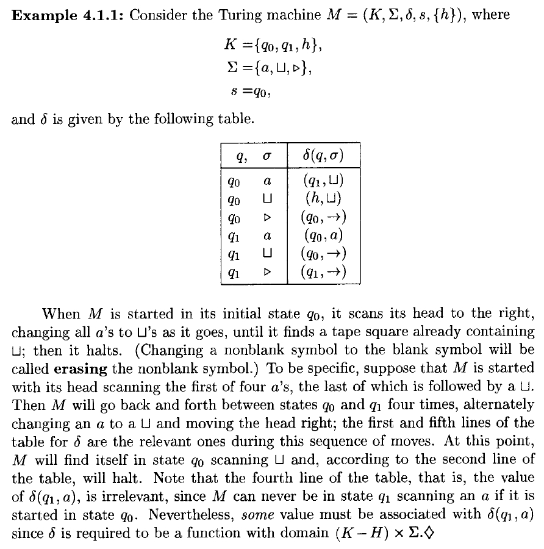
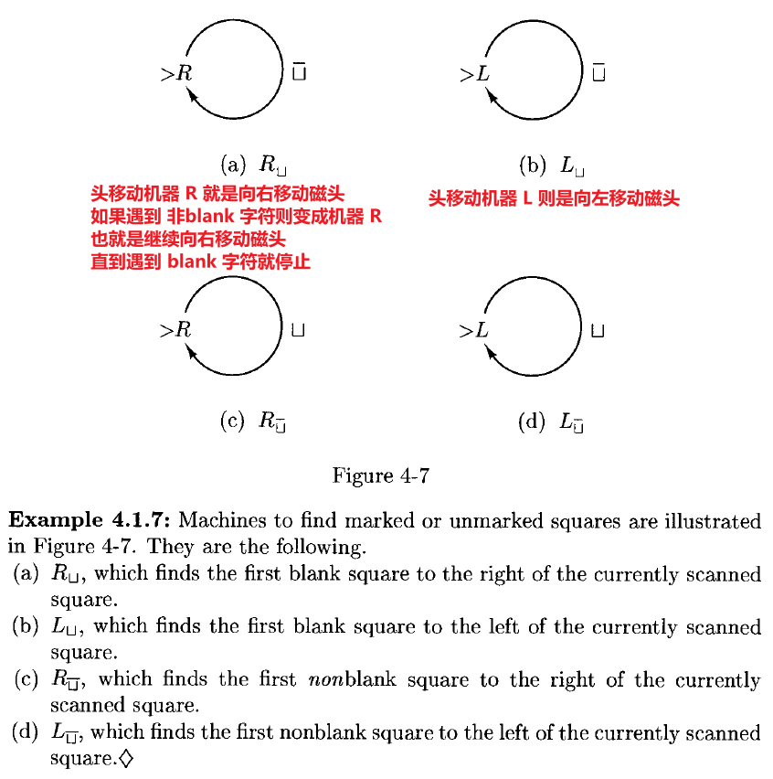
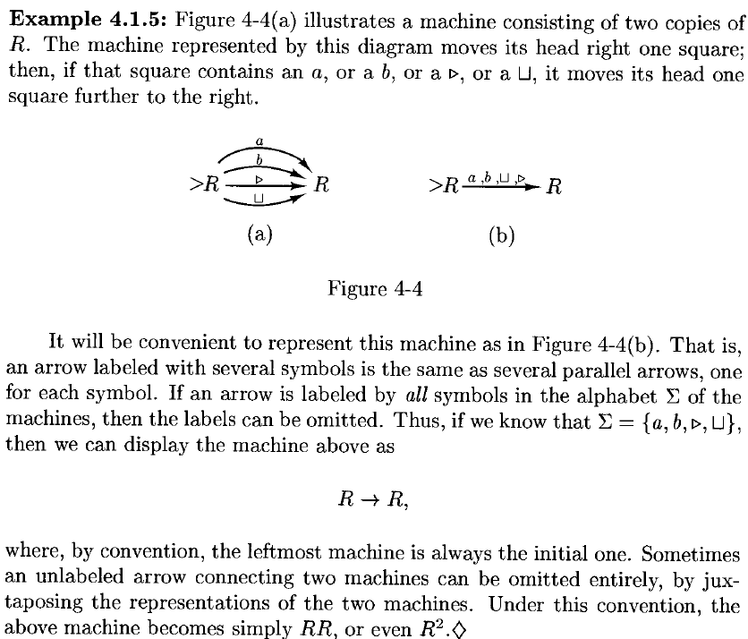
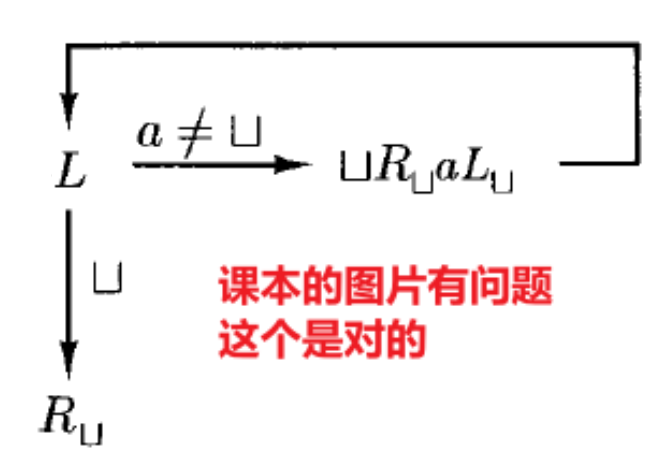
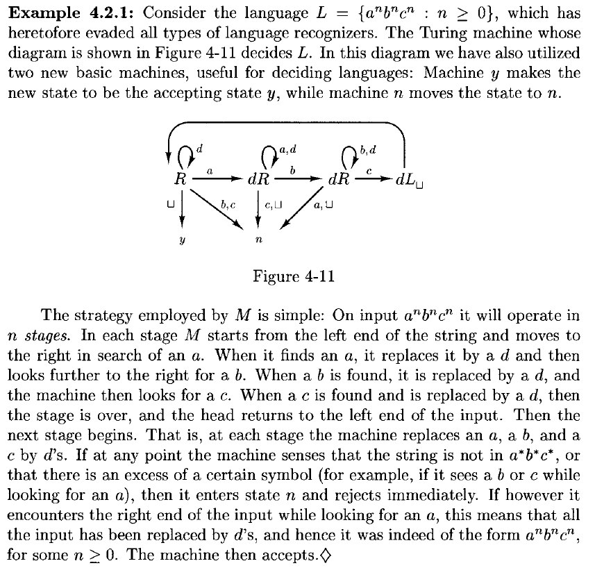
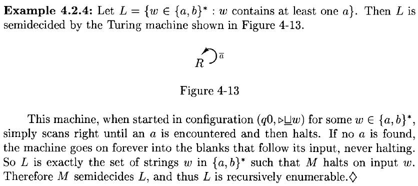
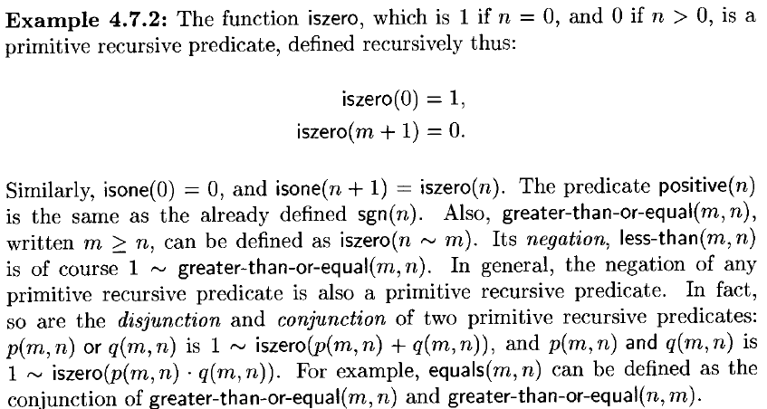
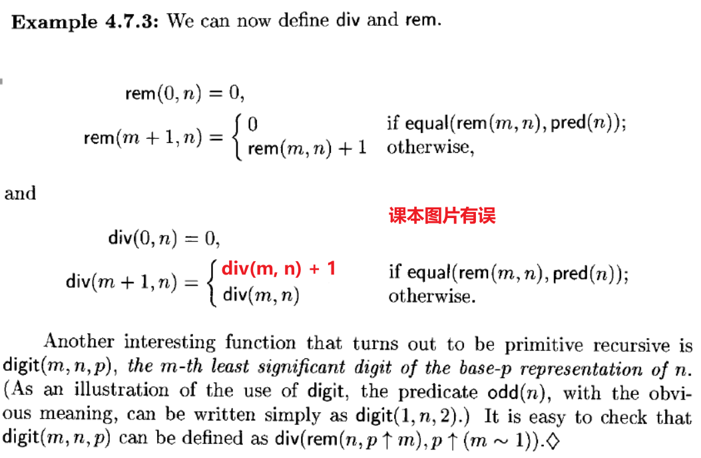

# 4 Turing Machines

!!! tip "说明"

    本文档正在更新中……

!!! info "说明"

    本文档仅涉及部分内容，仅可用于复习重点知识

## 1 The Definition of A Turing Machine

本质上，一台 **Turing machines** 由一个有限状态控制单元和一条纸带组成。两者之间的通信由一个单独的磁头提供，该磁头从纸带上读取符号，也用于更改纸带上的符号。控制单元以离散的步骤运行；在每一步，它根据其当前状态和读/写磁头当前扫描到的纸带符号来执行两个功能：

1. 将控制单元置于一个新状态
2. 执行以下操作之一：

    1. 在当前扫描的纸带方格中写入一个符号，替换掉已有的符号
    2. 将读/写磁头向左或向右移动一个纸带方格

纸带有一个左端，但向右无限延伸。为了防止机器将其磁头移出纸带的左端，我们假设纸带的最左端总是由一个特殊符号 $\rhd$ 标记；我们进一步假设，我们所有的图灵机都是这样设计的：每当磁头读到 $\rhd$ 时，它立即向右移动。此外，我们将使用不同的符号 ← 和 → 分别表示磁头向左或向右移动；我们假设这两个符号不属于我们考虑的任何字母表

通过将输入字符串刻写在纸带左端、紧邻 $\rhd$ 符号右侧的纸带方格上，为图灵机提供输入。纸带的其余部分最初包含 **blank** 符号，记为 $\sqcup$。机器可以按其认为合适的任何方式自由改变其输入，并可以在右侧无限的空白纸带部分进行写入。由于机器一次只能将其磁头移动一个方格，在任何有限次的计算之后，只有有限多个纸带方格会被访问到

<figure markdown="span">
  { width="600" }
</figure>

!!! info ""

    A Turing machine is a quintuple $(K,\Sigma,\delta,s,H)$, where

    1. $K$ is a finite set of **states**
    2. $\Sigma$ is an alphabet, containing the **blank symbol** $\sqcup$ and the **left end symbol** $\rhd$, but not containing the symbols $\leftarrow$ and $\rightarrow$
    3. $s \in K$ is the **initial state**
    4. $H \subseteq K$ is the set of **halting states**
    5. $\delta$, the **transition function**, is a function from $(K-H)\times \Sigma$ to $K \times (\Sigma \cup \lbrace\leftarrow, \rightarrow \rbrace)$ such that

        1. for all $q \in K - H$, if $\delta(q,\rhd) = (p,b)$, then $b = \rightarrow$
        2. for all $q \in K - H$ and $a \in \Sigma$, if $\delta(q,a) = (p,b)$, then $b \not ={ \rhd}$

<figure markdown="span">
  { width="800" }
</figure>

<figure markdown="span">
  { width="800" }
</figure>

A **configuration** of a Turing machine $M = (K,\Sigma,\delta,s,H)$ is a member of $K \times \rhd \Sigma^* \times (\Sigma^*(\Sigma - \lbrace \sqcup \rbrace) \cup \lbrace e\rbrace)$

1. 第一个位置：表示图灵机当前的状态
2. 第二个位置：表示从纸带左端开始，到当前磁头所在位置（包含该位置符号）为止的字符串
3. 第三个位置：表示从当前磁头所在位置的下一个位置开始，直到最后一个非空白符号为止的字符串

<figure markdown="span">
  { width="600" }
</figure>

> 上图中三个图灵机当前的配置如下
> 
> 1. $(q, \rhd a, aba)$
> 2. $(h, \rhd\sqcup\sqcup\sqcup, \sqcup a)$
> 3. $(q, \rhd \sqcup a \sqcup\sqcup, e)$

也可以这样表示配置：$(q, \rhd \underline{a}aba)$, $(h, \rhd\sqcup\sqcup \underline{\sqcup}\sqcup a)$, $(q, \rhd \sqcup a \sqcup \underline{\sqcup})$，下划线表示当前磁头所在的位置

考虑两个配置 $(q_1, w_1\underline{a_1}u_1)$, $(q_2, w_2\underline{a_2}u_2)$，那么 $(q_1, w_1\underline{a_1}u_1) \vdash_M (q_2, w_2\underline{a_2}u_2)$ 当且仅当对于某个 $b \in \Sigma \cup \lbrace\leftarrow,\rightarrow\rbrace$，有 $\delta(q_1, a_1) = (q_2, b)$，并且满足下列情况之一：

1. $b \in \Sigma, w_1 = w_2, u_1 = u_2, a_2 = b$
2. $b = \leftarrow, w_1 = w_2a_2$，并且

    1. $u_2 = a_1u_1$，如果 $a_1 \not ={\sqcup}$ 或 $u_1 \not ={e}$，或者
    2. $u_2 = e$，如果 $a_1 = \sqcup$ 且 $u_1 = e$

3. $b = \rightarrow, w_2 = w_1a_1$，并且

    1. $u_1 = a_2u_2$，或者
    2. $u_1 = u_2 = e$ 且 $a_2 = \sqcup$

<figure markdown="span">
  { width="800" }
</figure>

令 $\vdash_M^*$ 是 $\vdash_M$ 的 reflexive, transitive 闭包

我们说配置 $C_1$ **yield** 配置 $C_2$ 如果 $C_1 \vdash_M^* C_2$

一个 **computation** 是一些配置的序列 $C_0 \vdash_M C_1 \vdash_M \cdots \vdash_M C_n$。称这个计算 **length** 为 $n$ 或有 $n$ **steps**，写作 $C_0 \vdash_M^n C_n$

<figure markdown="span">
  { width="800" }
</figure>

### 1.1 A Notation for Turing Machines

定义一个非常简单的 basic machines 库，以及组合机器的规则

**symbol-writing machines** and **head-moving machines**：固定机器的字母表 $Σ$。对于每个 $a ∈ Σ ∪ \lbrace →, ← \rbrace − \lbrace\rhd\rbrace$，定义一台图灵机 $M_a = (\lbrace s, h \rbrace, Σ, δ, s, \lbrace h \rbrace)$，其中对每个 $b ∈ Σ − \lbrace \rhd\rbrace$，$δ(s,b) = (h,a)$。自然地，$δ(s,\rhd)$ 仍然是 $(s, →)$。也就是说，这台机器的作用只是执行动作 $a$：如果 $a ∈ Σ$，则写入符号 $a$；如果 $a ∈ \lbrace←, →\rbrace$，则按 $a$ 指示的方向移动，然后立即停止。当然，这个行为有一个例外情况：如果扫描到的符号是 $\rhd$，那么机器会向右移动

由于符号写入机器被频繁使用，我们简化其名称，直接用 $a$ 代替 $M_a$。也就是说，若 $a ∈ Σ$，则 a-writing machine 简记为 $a$。头移动机器 $M_←$ 和 $M_→$ 将分别简记为 $L$ 和 $R$

图灵机将以一种类似于有限自动机结构的方式进行组合。单个机器就像有限自动机的状态，机器之间可以像有限自动机的状态之间那样相互连接。然而，从一台机器到另一台机器的连接不会在第一台机器停止之前执行；只有当第一台机器停止后，第二台机器才会从其初始状态开始运行，此时磁带和读写头的位置由第一台机器留下的状态决定

因此，如果 $M₁$、$M₂$ 和 $M₃$ 是图灵机，则下图所示的机器按如下方式工作：从 $M₁$ 的初始状态开始；按照 $M₁$ 的方式运行，直到 $M₁$ 停止；然后，如果当前扫描的符号是 $a$，则启动 $M₂$ 并按照 $M₂$ 的方式运行；否则，如果当前扫描的符号是 $b$，则启动 $M₃$ 并按照 $M₃$ 的方式运行

<figure markdown="span">
  { width="400" }
</figure>

假设上图三个图灵机 $M₁$、$M₂$ 和 $M₃$ 分别为：$M₁ = (K₁, Σ, δ₁, s₁, H₁)$，$M₂ = (K₂, Σ, δ₂, s₂, H₂)$，$M₃ = (K₃, Σ, δ₃, s₃, H₃)$，那么上图所示的组合机器就是 $M = (K, Σ, δ, s, H)$

1. $K = K₁ ∪ K₂ ∪ K₃$
2. $s = s₁$
3. $H = H₂ ∪ H₃$

对于每个 $σ ∈ Σ$ 和 $q ∈ K − H$，$δ(q, σ)$ 的定义如下：

1. 如果 $q ∈ K₁ − H₁$，则 $δ(q, σ) = δ₁(q, σ)$
2. 如果 $q ∈ K₂ − H₂$，则 $δ(q, σ) = δ₂(q, σ)$
3. 如果 $q ∈ K₃ − H₃$，则 $δ(q, σ) = δ₃(q, σ)$
4. 如果 $q ∈ H₁$

    1. 若 $σ = a$，则 $δ(q, σ) = s₂$
    2. 若 $σ = b$，则 $δ(q, σ) = s₃$
    3. ==否则 $δ(q, σ) ∈ H$==（没得变了就停止机器）

> 实际上就是以数学形式描述了状态转换

<figure markdown="span">
  { width="800" }
</figure>

<figure markdown="span">
  { width="800" }
</figure>

<figure markdown="span">
  { width="800" }
</figure>

**copying machine** $C$：将 $\sqcup w \underline{\sqcup}$ 变成 $\sqcup w \sqcup  w \underline{\sqcup}$（$w$ 中不能有 $\sqcup$ 字符）

<figure markdown="span">
  { width="600" }
</figure>

**right-shifting machine** $S_\rightarrow$：将字符串 $\sqcup w \underline{\sqcup}$ 变成 $\sqcup \sqcup w \underline{\sqcup}$（$w$ 中不能有 $\sqcup$ 字符）

<figure markdown="span">
  { width="600" }
</figure>

同理有 left-shifting machine

<figure markdown="span">
  { width="800" }
</figure>

## 2 Computing with Turing Machines

我们采用以下策略来向图灵机提供输入：输入字符串（不含空白符号）写在最左侧符号 $\rhd$ 的右侧，其左侧有一个空白，右侧也有空白；读写头位于 $\rhd$ 与输入之间的空白方格上；机器从初始状态开始运行。如果 $M = (K, \Sigma, \delta, s, H)$ 是一台图灵机，且 $w \in (\Sigma - \lbrace \sqcup, \rhd\rbrace)^*$，那么 $M$ 在输入 $w$ 上的 **initial configuration** 是 $(s, \rhd  \underline{\sqcup}w)$

设 $M=(K,Σ,δ,s,H)$ 是一台图灵机，其中停机状态集合 $H=\lbrace y,n \rbrace$ 包含两个不同的停机状态（$y$ 表示是，$n$ 表示否）。任何停机配置，若其状态分量为 $y$，称为一个 **accepting configuration**；若其状态分量为 $n$，则称为一个 **rejecting configuration**。我们说 $M$ **accepting** 输入 $w∈(Σ−\lbrace⊔,▹\rbrace)^∗$，当且仅当 $(s,▹\underline{⊔}w)$ 导致一个接受配置；类似地，我们说 $M$ **reject** 输入 $w$，当且仅当 $(s,▹\underline{⊔}w)$ 导致一个拒绝配置

设 $\Sigma_0 \in \Sigma - \lbrace \sqcup, \rhd\rbrace$ 为一个字母表，称为 $M$ 的 **input alphabet**；通过将 $Σ_0$ 固定为 $Σ−\lbrace⊔,▹\rbrace$ 的一个子集，我们允许图灵机在计算过程中使用除输入中出现的符号之外的额外符号。我们说 $M$ **decide** 一个语言 $L⊆Σ_0^*$，当且仅当对于任意字符串 $w \in \Sigma_0^*$，满足以下条件：如果 $w∈L$，则 $M$ 接受 $w$；如果 $w\notin L$，则 $M$ 拒绝 $w$

称一个语言 L 为 **recursive**（递归的），如果存在一台图灵机能判定它

换句话说，一台图灵机判定一个语言 $L$，意味着当以输入 $w$ 启动时，它总是会停止，并且在正确的停机状态中停止：如果是 $y$，则 $w∈L$；如果是 $n$，则 $w\notin L$。请注意，如果输入包含空白或左端符号，则不保证会发生什么

<figure markdown="span">
  { width="800" }
</figure>

### 2.1 Recursive Functions

设 $M=(K,Σ,δ,s,\lbrace h\rbrace)$ 是一台图灵机，令 $Σ_0⊆Σ−\lbrace⊔,▹\rbrace$ 为一个字母表，且 $w∈Σ_0^∗$​。假设 $M$ 在输入 $w$ 上停止，并且存在某个 $y∈Σ_0^∗$，使得从初始配置 $(s,▹\underline{⊔}w)$ 出发，经过若干步后进入停机配置 $(h,▹\underline{⊔}y)$。那么称 $y$ 为 $M$ 在输入 $w$ 上的输出，记作 $M(w)$。注意，$M(w)$ 只有在 $M$ 在输入 $w$ 上停止时才被定义，而且实际上必须是在形如 $(h,▹\underline{⊔}y)$ 的配置中停止，其中 $y∈Σ_0^∗$

现在设 $f$ 是从 $\Sigma_0^*$ 到 $\Sigma_0^*$ 的任意函数。我们说图灵机 $M$ **compute** 函数 $f$，如果对所有 $w∈\Sigma_0^*$，都有 $M(w)=f(w)$。也就是说，对于所有 $w∈\Sigma_0^*$，当 $M$ 在输入 $w$ 上运行时，最终会停止，且其磁带包含字符串 $▹⊔f(w)$。若存在一台图灵机 $M$ 能计算函数 $f$，则称函数 $f$ 为 **recursive**

<figure markdown="span">
  { width="800" }
</figure>

集合 $\lbrace0,1\rbrace^∗$ 中的字符串可以用熟悉的二进制表示法来表示非负整数。任意字符串 $w = a_1a_2 \cdots a_n \in \lbrace 0,1 \rbrace^*$ 表示的数值为：$num(w) = a_1 \cdot 2^{n-1} + a_2 \cdot 2^{n-2} + \cdots + a_n$。并且，任何自然数都可以通过一个形如 $0∪1(0∪1)^∗$ 的字符串唯一地表示，也就是说，不包含前导零（即开头多余的 $0$）

因此，计算从 $\lbrace0,1\rbrace^∗$ 到 $\lbrace0,1\rbrace^∗$ 的函数的图灵机，可以被看作是计算从自然数到自然数的函数。事实上，具有多个参数的数值函数，例如加法和乘法，可以通过图灵机来计算，这些图灵机计算的是从 $\lbrace 0,1,; \rbrace^*$ 到 $\lbrace 0,1\rbrace^*$，其中 $;$ 是一个用于分隔二进制参数的符号

设 $M=(K,Σ,δ,s,\lbrace h\rbrace)$ 是一台图灵机，其中符号 $0,1,;∈Σ$，令 $f$ 是从 $N^k$ 到 $N$ 的任意函数（对某个 $k≥1$）。我们说图灵机 $M$ 计算函数 $f$，如果对于所有 $w_1, \cdots, w_k \in 0 \cup 1 (0 \cup 1)^*$（即，任何 $k$ 个整数的二进制编码字符串），都有：$num(M(w_1;\cdots;w_k)) = f(num(w_1), \cdots, num(w_k))$

也就是说，如果 $M$ 以整数 $n_1,\cdots,n_k$ 的二进制表示作为输入，则它最终会停止，并且当它停止时，其磁带上包含一个表示数值 $f(n_1,\cdots,n_k)$ 的字符串，即该函数的值。若存在一台图灵机 $M$ 能计算函数 $f$，则称函数 $f: N^k \rightarrow N$ 为 **recursive**

<figure markdown="span">
  { width="800" }
</figure>

### 2.2 Recursively Enumerable Languages

设 $M=(K,Σ,δ,s,H)$ 是一台图灵机，令 $Σ_0⊆Σ−{⊔,▹}$ 为一个字母表，并设 $L⊆Σ_0^∗$ 为一种语言。我们说 $M$ **semidecides**（半判定）语言 $L$，当且仅当对于任意字符串 $w∈Σ_0^∗$，以下条件成立：$w∈L$ 当且仅当 $M$ 在输入 $w$ 上停机

一个语言 $L$ 是 **recursively enumerable**（递归可枚举），当且仅当存在一台图灵机 $M$ 能够半判定 $L$

因此，当 $M$ 接收到输入 $w∈L$ 时，它必须最终停机。我们并不关心它具体进入哪个停机状态，只要它最终达到某个停机配置即可。然而，如果 $w∈Σ_0^∗ − L$，则 $M$ 永远不能进入停机状态

我们记 $M(w)=↗$ 表示 $M$ 在输入 $w$ 上无法停机。在此记法下，我们可以将图灵机 $M$ 半判定语言 $L⊆Σ_0^∗$ 的定义重述如下：对所有 $w∈Σ_0^∗$，有 $M(w)=↗$ 当且仅当 $w\notin L$

<figure markdown="span">
  { width="800" }
</figure>

!!! tip ""

    如果一个语言是 recursive 的，那么它也是 recursively enumerable 的

    > 存在 recursively enumerable 但是不 recursive 的语言

!!! example "证明"

    要构造一台半判定（而不是判定）该语言的图灵机，只需将原判定机中的拒绝状态变为非停机状态，从而确保机器永远不会停机。具体来说，给定任意一台判定语言 $L$ 的图灵机 $M=(K,Σ,δ,s,{y,n})$，我们可以定义一台半判定 $L$ 的新机器 $M'$ 如下：$M' = (K,Σ,\delta',s,\lbrace y\rbrace)$，其中 $\delta'$ 是 $δ$ 的扩展，增加如下转移规则：对所有 $a∈Σ$，有 $\delta'(n,a) = (n,a)$ —— 即状态 $n$ 不再是停机状态。显然，如果 $M$ 确实能判定 $L$，那么 $M'$ 就能半判定 $L$，因为 $M'$ 接受与 $M$ 相同的输入；此外，如果 $M$ 拒绝输入 $w$，则 $M'$ 在 $w$ 上不会停机（它在状态 $n$ 中永远循环）。换句话说，对于所有输入 $w$，有 $M'(w)=↗$ 当且仅当 $M(w)=n$

!!! tip ""

    如果语言 $L$ 是 recursive 的，那么 $\bar{L}$ 也是 recursive 的

## 3 Extensions of the Turing Machine

### 3.1 Multiple Tapes

可以设想具有多个磁带的图灵机，每条磁带通过一个读 / 写头与有限控制器相连（每条磁带有一个读 / 写头）。在一步操作中，机器可以读取所有读 / 写头所扫描的符号，然后根据这些符号及其当前状态，重写某些被扫描的方格，并将某些读 / 写头向左或向右移动，同时改变自身状态

<figure markdown="span">
  { width="600" }
</figure>

设 $k≥1$ 为一个整数。一个 **$k$ - tape Turing machine** 是一个五元组 $(K,Σ,δ,s,H)$，其中 $K$、$Σ$、$s$ 和 $H$ 的含义与普通图灵机的定义相同，而 $δ$（**transition function**）是从 $(K-H)\times \Sigma^k$ 到 $K\times(\Sigma\cup \lbrace \leftarrow,\rightarrow \rbrace)^k$ 的一个函数。也就是说，对于每个状态 $q$，以及每个由磁带符号组成的 $k$ - 元组 $(a_1, \cdots, a_k)$，有 $\delta(q,(a_1, \cdots, a_k)) = (p,(b_1, \cdots, b_k))$，其中 $p$ 是新的状态，而 $b_j$ 直观上表示机器在第 $j$ 条磁带上的动作。自然地，我们再次要求：如果对某个 $j≤k$ 有 $a_j = \rhd$，则必须有 $b_j = \rightarrow$

设 $M = (K,Σ,δ,s,H)$ 是一个 $k$-tape 图灵机，$M$ 的 **configuration** 是 $K \times (\rhd \Sigma^* \times (\Sigma^*(\Sigma-\lbrace \sqcup \rbrace) \cup \lbrace e\rbrace))^k$ 的一个成员

例如，$\delta(p,(a_1, \cdots, a_k)) = (b_1, \cdots, b_k)$，配置 $(q,(w_1\underline{a_1}u_1, \cdots, w_k\underline{a_k}u_k))$ yields in one step 配置 $(q,(w_1'\underline{a_1'}u_1', \cdots, w_k'\underline{a_k'}u_k'))$，其中 $a_i'$ 是 $a_i$ 经过操作 $b_i$ 后变成的

<figure markdown="span">
  { width="800" }
</figure>

!!! tip ""

    设 $M=(K,Σ,δ,s,H)$ 是一个 $k$-磁带图灵机，其中 $k≥1$。那么存在一台标准图灵机 $M' = (K',\Sigma',\delta',s',H)$，满足 $Σ⊆\Sigma'$，并且以下性质成立：对于任意输入字符串 $x\in \Sigma^*$，机器 $M$ 在输入 $x$ 上停机并输出 $y$（在第一条磁带上），当且仅当 $M'$ 在输入 $x$ 上停机、处于相同的停机状态，并在其磁带上输出相同的 $y$。此外，如果 $M$ 在输入 $x$ 上经过 $t$ 步后停机，则 $M'$ 在输入 $x$ 上经过的步数为 $O(t⋅(|x|+t))$

!!! tip ""

    任何由 $k$-磁带图灵机计算的函数，或由 $k$-磁带图灵机判定（或半判定）的语言，也分别可以由一台标准图灵机计算、判定（或半判定）

## 6 Grammars

一个 **grammar**（或 **unrestricted grammar**，或 **rewriting system**）是一个四元组 $G=(V,Σ,R,S)$，其中：

1. $V$ 是一个字母表
2. $Σ⊆V$ 是 **terminal symbols** 的集合，而 $V−Σ$ 被称为 **nonterminal symbols** 的集合
3. $S∈V−Σ$ 是 **start symbol**
4. $R$，即 **rules** 的集合，是 $(V^* (V−Σ)V^∗)×V^∗$的有限子集

我们写作 $u→v$ 如果 $(u,v)∈R$

我们写作 $u \Rightarrow_G v$ 当且仅当，对于某些 $w_1, w_2 \in V^*$ 和某个规则 $u' \rightarrow v' \in R$，有 $u = w_1u'w_2$ 且 $v = w_1v'w_2$

通常，$\Rightarrow^*_G$ 是 $\Rightarrow_G$ 的自反传递闭包。一个字符串 $w \in \Sigma^*$ 由 $G$ 生成，当且仅当 $S \Rightarrow_G^* w$

而 $L(G)$，即由 $G$ 生成的语言，是由 $G$ 生成的所有 $Σ^∗$ 中字符串的集合

我们也使用最初为上下文无关文法引入的其他术语；例如，一个 **derivation** 是一系列形式为 $w_0 \Rightarrow_G w_1 \Rightarrow_G \cdots \Rightarrow_G w_n$

<figure markdown="span">
  { width="800" }
</figure>

!!! tip ""

    A language is generated by a grammar if and only if it is recursively enumerable

设 $G=(V,Σ,R,S)$ 是一个文法，且设 $f:\Sigma^* \rightarrow \Sigma^*$ 是一个函数。我们说 $G$ 计算 $f$，如果对于所有 $w,v\in \Sigma^*$，以下条件成立：$SwS \Rightarrow^*_G v \text{ if and only if }v=f(w)$

也就是说，由输入字符串 $w$ 构成的字符串，其两边各有一个文法 $G$ 的开始符号 $S$，经过推导后恰好生成一个在 $\Sigma^*$ 中的字符串：即 $f(w)$ 的正确值

一个函数 $f:\Sigma^* \rightarrow \Sigma^*$ 被称为 **grammatically computable** ，当且仅当存在一个文法 $G$ 能够计算它

!!! tip ""

    A function $f:\Sigma^* \rightarrow \Sigma^*$ is recursive if and only if it is grammatically computable

## 7 Numerical Functions

我们首先定义一些从 $N^k$ 到 $N$ 的极其简单的函数，其中 $k≥0$（一个 0 元函数当然就是一个常数，因为它没有任何依赖变量）。这些 **basic functions** 包括以下几种：

1. 对任意 $k≥0$，**k-ary zero function** 定义为：$zero_k(n_1,\cdots,n_k) = 0$ 对所有 $n_1,\cdots,n_k \in N$ 成立
2. 对任意 $k≥j>0$，**j th k-ary identity function** 定义为：$id_{k,j}(n_1,\cdots,n_k) = n_j$ 对所有 $n_1,\cdots,n_k \in N$ 成立
3. **successor function** 定义为：$succ(n)=n+1$ 对所有 $n∈N$ 成立

接下来，我们引入两种简单的方法，通过组合函数来构造稍微复杂一些的函数：

1. 设 $k,ℓ≥0$，令 $g:N^k\rightarrow N$ 是一个 $k$ 元函数，且 $h_1,\cdots,h_k$ 是 $ℓ$ 元函数。那么，$g$ 与 $h_1,\cdots,h_k$ 的 **composition** 函数是一个 $ℓ$ 元函数，定义为：$f(n_1,\cdots,n_ℓ)=g(h_1(n_1,\cdots,n_ℓ),\cdots,h_k(n_1,\cdots,n_ℓ))$
2. 设 $k≥0$，令 $g$ 是一个 $k$ 元函数，$h$ 是一个 $(k+2)$ 元函数。那么，由 $g$ 和 $h$ **recursively** 定义的函数 $f$ 是一个 $(k+1)$ 元函数，定义如下：$f(n_1,\cdots,n_k, 0) = g(n_1,\cdots,n_k)$, $f(n_1,\cdots,n_k, m+1) = h(n_1,\cdots,n_k,m,f(n_1,\cdots,n_k,m))$ 对所有 $n_1,\cdots,n_k,m \in N$ 成立

**primitive recursive functions** 是指所有基本函数，以及通过任意多次应用复合和递归定义所得到的所有函数

<figure markdown="span">
  { width="800" }
</figure>

<figure markdown="span">
  { width="800" }
</figure>

为了方便，我们将一个 **primitive recursive predicate** 定义为仅取值 0 或 1 的原始递归函数。直观上，一个原始递归谓词（如 $\text{greater-than}(m,n)$）可以表达两个数 $m$ 和 $n$ 之间可能成立也可能不成立的关系。如果该关系成立，则原始递归谓词的值为 1；否则为 0

<figure markdown="span">
  { width="800" }
</figure>

此外，如果 $f$ 和 $g$ 是原始递归函数，$p$ 是一个原始递归谓词，且三者具有相同的元数 $k$，那么 **function defined by cases**

$$
f(n_1,\cdots,n_k) = 
\begin{cases}
    g(n_1,\cdots,n_k), &\text{if }p(n_1,\cdots,n_k)\\
    h(n_1,\cdots,n_k), & \text{otherwise}
\end{cases}
$$

也是原始递归的，因为它可以重写为：$f(n_1,\cdots,n_k) = p(n_1,\cdots,n_k)g(n_1,\cdots,n_k) + (1 \sim p(n_1,\cdots,n_k))h(n_1,\cdots,n_k)$

<figure markdown="span">
  { width="800" }
</figure>

<figure markdown="span">
  { width="800" }
</figure>

设 $g$ 是一个 $(k+1)$ 元函数，其中 $k≥0$。函数 $g$ 的 **minimalization** 是一个 $k$ 元函数 $f$，定义如下：

$$
f(n_1,\cdots,n_k) = 
\begin{cases}
    \text{the least }m\text{ such that }g(n_1,\cdots,n_k, m) = 1, & \text{if such an }m\text{ exists}\\
    0 & \text{otherwise}
\end{cases}
$$

我们将用符号 $μm[g(n_1,\cdots,n_k,m)=1]$ 表示 $g$ 的最小化

尽管一个函数 $g$ 的最小化总是有良好定义的，但目前并没有明显的方法来计算它，即使我们知道如何计算 $g$。显然的方法是：

```c linenums="1"
m := 0;
while g(n₁, ..., nₖ, m) ≠ 1 do m := m + 1;
output m
```

但这不是一个算法，因为它可能无法终止

因此，我们称一个函数 $g$ 是 **minimalizable** ，当且仅当上述方法总是能终止。也就是说，一个 $(k+1)$ 元函数 g 是可最小化的，当且仅当它具有以下性质：对于每一个 $n_1,\cdots,n_k\in N$，都存在某个 $m∈N$，使得 $g(n_1,\cdots,n_k,m)=1$

最后，我们称一个函数为 **$\mu$-recursive** ，如果它可以通过基本函数，经由复合、递归定义以及对可最小化函数的最小化操作而得到

!!! tip ""

    A function $f:N^k \mapsto N$ is $\mu$-recursive if and only if it is recursive (that is, computable by a Turing machine)
