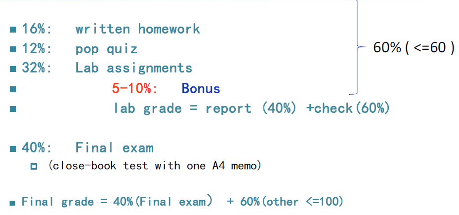
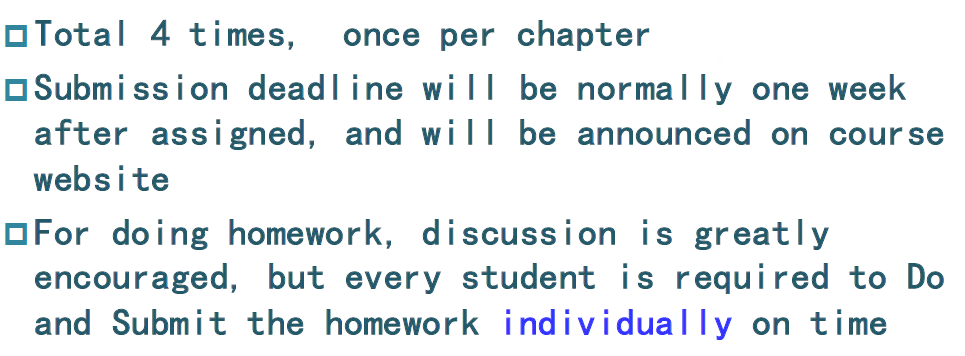
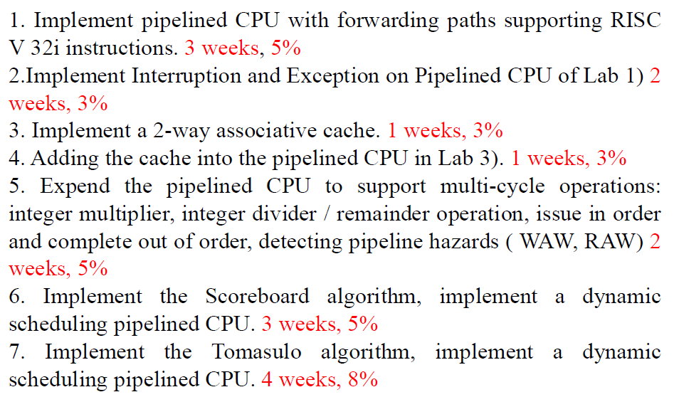

# 计算机体系结构

!!! tip "说明"

    本文档正在更新中……

## 课程介绍

!!! info "注意"

    此为 2024-2025 春夏学期课程安排，仅供参考

wzh老师

### 考核方式

<figure markdown="span">
  { width="600" }
</figure>

#### 作业（16 %）

<figure markdown="span">
  { width="600" }
</figure>

#### 实验部分（32 %）

<figure markdown="span">
  { width="600" }
</figure>

## 个人笔记

### 理论部分及课本部分习题详解

[1 Fundamentals of Quantitative Design and Analysis](./theory/ch1.md) 
[2 Pipelining: Basic and Intermediate Concepts](./theory/ch2.md) 
[3 Memory Hierarchy Design](./theory/ch3.md)

### [实验部分](./lab/index.md)
