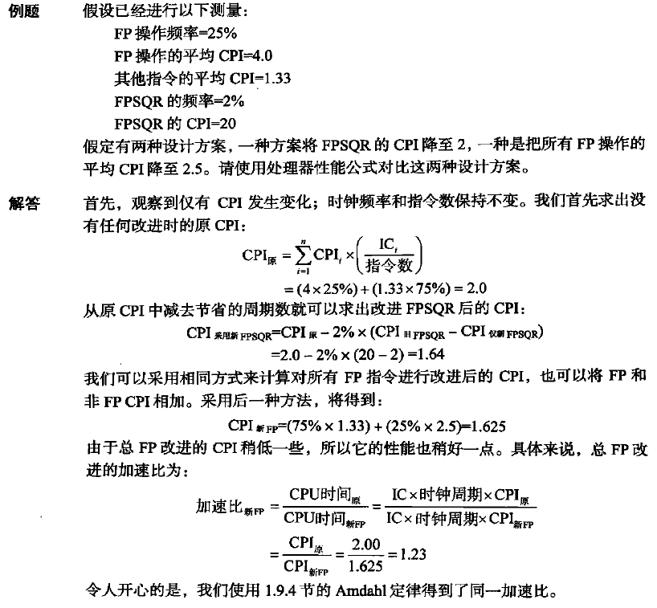
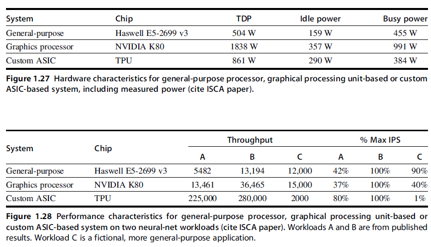
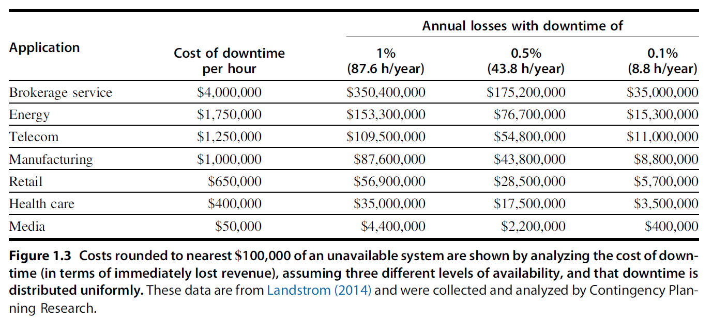
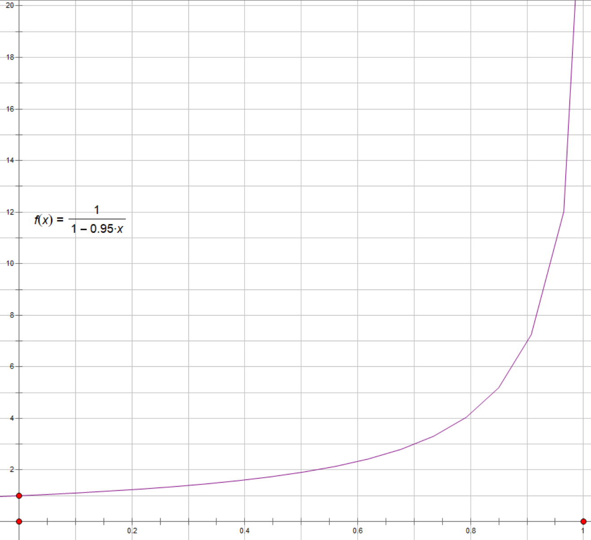
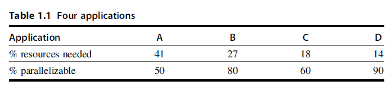

# 1 Fundamentals of Quantitative Design and Analysis

!!! tip "说明"

    本文档正在更新中……

!!! info "说明"

    本文档仅涉及部分内容，仅可用于复习重点知识

**量化设计与分析基础**

<ul>
<li>RISC：精简指令集计算机</li>
<li>CISC：复杂指令集计算机</li>
</ul>

## 1.2 计算机的分类

**Personal Mobile Device**（PMD）

- 基于 Web 应用、面向媒体
- 采用闪存作为存储方式
- 需求：成本、能耗效率

**Desktop Computing**

- 优化性价比

**Servers**

1. 首先，availability 是至关重要的
2. 第二个关键特征是 scalability
3. 最后一个特征是 efficient throughout

**Clusters/Warehouse-Scale Computers**

- 软件即服务（SaaS）应用
- 仓库级计算机（WSC）
- 需求：性价比、功耗

**Embedded systems**

- 性能要求
- 价格是关键因素

---

应用程序中主要有以下两种并行：

1. DLP：数据级并行
2. TLP：任务级并行

计算机硬件用以下 4 种主要方式来实现这两种：

1. 指令级并行
2. 向量体系结构和 GPUs
3. 线程级并行
4. 请求级并行

计算机的分类：

1. 单指令流、单数据流（SISD）
2. 单指令流、多数据流（SIMD）
3. MISD
4. MIMD

## 1.4 技术趋势

- 摩尔定律
- 带宽胜过延迟

## 1.5 集成电路中的功率和能耗趋势

### 1.5.2 微处理器内部的能耗和功率

**动态能耗**（dynamic energy）

- 晶体管一次转换的能耗：$energy_{dynamic} \propto \dfrac{1}{2} \times capacitive\ load \times voltage^2$
- 晶体管一次转换的功率：$power_{dynamic} \propto \dfrac{1}{2} \times capacitive\ load \times voltage^2 \times frequency\ switched$

**静态能耗**（static energy）

$power_{static} \propto current_{static} \times voltage$

## 1.6 成本趋势

### 1.6.2 集成电路的成本

$cost\ of\ integrated\ circuit = \dfrac{cost\ of\ die + cost\ of\ testing\ die + cost\ of\ packaging\ and\ final\ test}{final\ test\ yield}$

$cost\ of\ die = \dfrac{cost\ of\ wafer}{dies\ per\ wafer \times die\ yield}$

$dies\ per\ wafer = \dfrac{\pi \times (wafer\ diameter / 2)^2}{die\ area} - \dfrac{\pi \times wafer\ diameter}{\sqrt{2 \times die\ area}}$

$die\ yield = wafer\ yield \times \dfrac{1}{(1 + defects\ per\ unit\ area \times die\ area)^N}$

$N$ 是一个称为工艺复杂度因数的参数

## 1.7 可信任度

**Dependability**

- Service accomplishment（服务实现）：提供了指定服务
- Service interruption（服务中断）：所提供服务与 SLA（服务等级协议）不一致

可信任度的两种主要度量：

1. reliability（可靠性）：从一个参考初始时刻开始持续实现服务的度量
    - MTTF（平均无故障时间）
    - rate of failures（故障率）：MTTF 的倒数，用 FIT（运行 10 亿小时发生的故障数）衡量
    - MTTR（平均修复时间）
    - MTBF（平均间隔时间）：MTTF + MTTR
2. availability（可用性）：服务完成与服务中断两种状态之间切换时，对服务完成的度量
    - $availability = \dfrac{MTTF}{MTTF + MTTR}$

## 1.8 性能的测量、报告和汇总

**Measuring, Reporting, and Summarizing Performance**

- response time / execution time（响应时间 / 执行时间）：一个事件从启动到完成的时间
- throughput（吞吐量）：在给定时间内完成的总工作量

## 1.9 计算机设计的量化原理

### 1.9.1 充分利用并行

**Take Advantage of Parallelism**

- 系统层面：使用多处理器
- 指令层面：使用流水线
- 数据运算层面：组相联 cache

### 1.9.2 局限性原理

**Principle of Locality**

一个程序 90 % 的执行时间花费在仅 10 % 的代码中

- 时间局域性（temporal locality）：最近访问过的内容很可能会在短期内被再次访问
- 空间局域性（Spatial locality）：地址相互临近的项目很可能会在短时间内都被用到

### 1.9.3 Focus on the Common Case

优化 common case 对整体性能的提升很大

### 1.9.4 Amdahl 定律

$execution\ time_{new} = execution\ time_{old} \times ((1 - fraction_{enhanced}) + \dfrac{fraction_{enhanced}}{speedup_{enhanced}})$

$speedup_{overall} = \dfrac{execution\ time_{old}}{execution\ time_{new}}$

### 1.9.5 处理器性能公式

$CPU\ execution\ time\ for\ a\ program = CPU\ clock\ cycles\ for\ program \times Clock\ cycle\ time$

$CPU\ clock\ cycles = Instructions\ for\ a\ program \times Average\ clock\ cycles\ per\ instruction$

$CPU\ time = Instruction\ count \times CPI \times Clock\ cycle\ time$

??? example "例题"

    <figure markdown="span">
      { width="600" }
    </figure>

## Homework

<!-- ???+ question "课本 1.6"

    General-purpose processes are optimized for general-purpose computing. That is, they are optimized for behavior that is generally found across a large number of applications. However, once the domain is restricted somewhat, the behavior that is found across a large number of the target applications may be different from general-purpose applications. One such application is deep learning or neural networks. Deep learning can be applied to many different applications, but the fundamental building block of inference—using the learned information to make decisions—is the same across them all. Inference operations are largely parallel, so they are currently performed on graphics processing units, which are specialized more toward this type of computation, and not to inference in particular. In a quest for more performance per watt, Google has created a custom chip using tensor processing units to accelerate inference operations in deep learning.1 This approach can be used for speech recognition and image recognition, for example. This problem explores the trade-offs between this process, a general-purpose processor (Haswell E5-2699 v3) and a GPU (NVIDIA K80), in terms of performance and cooling. If heat is not removed from the computer efficiently, the fans will blow hot air back onto the computer, not cold air. Note: The differences are more than processor—on-chip memory and DRAMalso come into play. Therefore statistics are at a system level, not a chip level.

    <figure markdown="span">
      { width="600" }
    </figure>

    a. If Google’s data center spends 70% of its time on workload A and 30% of its time on workload B when running GPUs, what is the speedup of the TPU system over the GPU system? 
    b. If Google’s data center spends 70% of its time on workload A and 30% of its time on workload B when running GPUs, what percentage of Max IPS does it achieve for each of the three systems? 
    c. Building on (b), assuming that the power scales linearly from idle to busy power as IPS grows from 0% to 100%, what is the performance per watt of the TPU system over the GPU system? 
    d. If another data center spends 40% of its time on workload A, 10% of its time on workload B, and 50% of its time on workload C, what are the speedups of the GPU and TPU systems over the general-purpose system? 
    e. A cooling door for a rack costs $4000 and dissipates 14 kW (into the room; additional cost is required to get it out of the room). How many Haswell-, NVIDIA-, or Tensor-based servers can you cool with one cooling door, assuming TDP in Figures 1.27 and 1.28? 
    f. Typical server farms can dissipate a maximum of 200 Wper square foot. Given that a server rack requires 11 square feet (including front and back clearance), how many servers from part (e) can be placed on a single rack, and how many cooling doors are required?

    ??? success "答案"

        a

        TPU 相对于 GPU 在工作负载 A 上的加速比为 $\dfrac{225000}{13461} = 16.71$
        
        TPU 相对于 GPU 在工作负载 B 上的加速比为 $\dfrac{280000}{36465} = 7.68$
        
        总体加速比为 $0.7 \times 16.71 + 0.3 \times 7.68 = 14.00$
        
        所以是 14 倍

        ---
        
        b
        
        - TPU: $0.7 \times 0.8 + 0.3 \times 1 = 86\%$
        - GPU: $0.7 \times 0.37 + 0.3 \times 1 = 55.9\%$
        - Haswell: $0.7 \times 0.42 + 0.3 \times 1 = 59.4\%$
        
        ---
        
        c
        
        TPU 和 GPU 的功率消耗
        
        - TPU: $power = 290 + (384 - 290) \times 0.86 = 370.84\ W$
        - GPU: $power = 357 + (991 - 357) \times 0.559= 711.41\ W$
        
        计算 performance per matt
        
        - TPU: $\dfrac{0.86}{370.84} = 0.23\%$
        - GPU: $\dfrac{0.559}{711.41} = 0.079\%$
        
        所以 TPU 相对 GPU 的 performance per matt 比为 $\dfrac{0.23}{0.079} = 2.91$
        
        ---
        
        d
        
        - GPU: $0.4 \times \dfrac{13461}{5482} + 0.1 \times \dfrac{36465}{13194} + 0.5 \times \dfrac{15000}{12000} = 1.88$
        - TPU: $0.4 \times \dfrac{225000}{5482} + 0.1 \times \dfrac{280000}{13194} + 0.5 \times \dfrac{2000}{12000} = 18.62$
        
        ---
        
        e
        
        - Haswell: $\lfloor\dfrac{14000}{504}\rfloor = 27$
        - TPU: $\lfloor\dfrac{14000}{861}\rfloor = 16$
        - GPU: $\lfloor\dfrac{14000}{1838}\rfloor = 7$
        
        ---
        
        f
        
        每个机架的散热能力：$200 \times 11 = 2200\ W$
        
        - Haswell: $\lfloor\dfrac{2200}{504}\rfloor = 4$
        - TPU: $\lfloor\dfrac{2200}{861}\rfloor = 2$
        - GPU: $\lfloor\dfrac{2200}{1838}\rfloor = 1$
        
        都只需要 1 个 cooling doors

???+ question "课本 1.9"

    Server farms such as Google and Yahoo! provide enough compute capacity for the highest request rate of the day. Imagine that most of the time these servers operate at only 60% capacity. Assume further that the power does not scale linearly with the load; that is, when the servers are operating at 60% capacity, they consume 90% of maximum power. The servers could be turned off, but they would take too long to restart in response to more load. A new system has been proposed that allows for a quick restart but requires 20% of the maximum power while in this “barely alive” state.

    a. How much power savings would be achieved by turning off 60% of the servers? 
    b. How much power savings would be achieved by placing 60% of the servers in the “barely alive” state? 
    c. How much power savings would be achieved by reducing the voltage by 20% and frequency by 40%? 
    d. How much power savings would be achieved by placing 30% of the servers in the “barely alive” state and 30% off?

    ??? success "答案"

        a

        假设总共有 N 台服务器，每台服务器的最大功率为 1
        
        原来的总功率消耗：$0.9N$
        
        关闭 60% 后的总功率消耗：$0.4N\times0.9 = 0.36N$
        
        功率节省：$0.9N - 0.36N = 0.54N$

        ---
        
        b
        
        假设总共有 N 台服务器，每台服务器的最大功率为 1
        
        原来的总功率消耗：$0.9N$
        
        转换 60% 后的总功率消耗：$0.4N\times0.9 + 0.6N \times 0.2 = 0.48N$
        
        功率节省：$0.9N - 0.48N = 0.42N$

        ---
        
        c
        
        假设总共有 N 台服务器，每台服务器的最大功率为 1
        
        原来的总功率消耗：$P$
        
        现在的总功率消耗：$P \times 0.8^2 \times 0.6 = 0.384 P$
        
        功率节省比率：$\dfrac{P - 0.384P}{P} = 61.6\%$

        ---
        
        d
        
        假设总共有 N 台服务器，每台服务器的最大功率为 1
        
        原来的总功率消耗：$0.9N$
        
        现在的总功率消耗：$0.4N \times 0.9 + 0.3N \times 0.2 = 0.42N$
        
        功率节省：$0.9N - 0.42N = 0.48N$

???+ question "课本 1.11"

    In a server farm such as that used by Amazon or eBay, a single failure does not cause the entire system to crash. Instead, it will reduce the number of requests that can be satisfied at any one time.

    <figure markdown="span">
      { width="600" }
    </figure>

    a. If a company has 10,000 computers, each with an MTTF of 35 days, and it experiences catastrophic failure only if 1/3 of the computers fail, what is the MTTF for the system? 
    b. If it costs an extra $1000, per computer, to double the MTTF, would this be a good business decision? Show your work. 
    c. Figure 1.3 shows, on average, the cost of downtimes, assuming that the cost is equal at all times of the year. For retailers, however, the Christmas season is the most profitable (and therefore the most costly time to lose sales). If a catalog sales center has twice as much traffic in the fourth quarter as every other quarter, what is the average cost of downtime per hour during the fourth quarter and the rest of the year?

    ??? success "答案"

        a

        每个计算机的故障率：$\dfrac{1}{MTTF} = \dfrac{1}{35} /day$
        
        系统的故障率：$\dfrac{10000}{3} \times \dfrac{1}{35} = \dfrac{2000}{21}$
        
        系统的 MTTF：$\dfrac{21}{2000} = 0.0105\ day = 0.252\ hour$

        ---
        
        b
        
        每个计算机的故障率：$\dfrac{1}{70}/day$
        
        系统的故障率：$\dfrac{10000}{3} \times \dfrac{1}{70} = \dfrac{1000}{21}$
        
        系统的 MTTF：$\dfrac{21}{1000} = 0.021\ day = 0.504\ hour$
        
        需要额外花费的成本：$1000 \times 10000 = 10^7\ dollar$ 
        
        假设每次系统故障导致的损失为 L，每年预期的故障次数为：
        
        - 原来的：$\dfrac{365\times24}{0.252\ hour} = 34762\ times$
        - 现在的：$\dfrac{365\times24}{0.504\ hour} = 17381\ times$
        - 减少的次数：$34762 - 17381 = 17381\ times$
        
        如果每次故障的损失 L 满足：

        $$
        17381 \times L > 10^7\\
        L > \dfrac{10^7}{17381} = 575\ dollar
        $$

        那么花费 10000000 是值得的，否则不值得（花费的钱比减少故障损失的钱多，不如不花）

        ---
        
        c
        
        $\dfrac{2 \times 650000 + 3 \times 650000}{5} = 650000\ \$$

???+ question "课本 1.12"

    In this exercise, assume that we are considering enhancing a quad-core machine by adding encryption hardware to it. When computing encryption operations, it is 20 times faster than the normal mode of execution. We will define percentage of encryption as the percentage of time in the original execution that is spent performing encryption operations. The specialized hardware increases power consumption by 2%.

    a. Draw a graph that plots the speedup as a percentage of the computation spent performing encryption. Label the y-axis “Net speedup” and label the x-axis “Percent encryption.” 
    b. With what percentage of encryption will adding encryption hardware result in a speedup of 2? 
    c. What percentage of time in the new execution will be spent on encryption operations if a speedup of 2 is achieved? 
    d. Suppose you have measured the percentage of encryption to be 50%. The hardware design group estimates it can speed up the encryption hardware even more with significant additional investment. You wonder whether adding a second unit in order to support parallel encryption operations would be more useful. Imagine that in the original program, 90% of the encryption operations could be performed in parallel. What is the speedup of providing two or four encryption units, assuming that the parallelization allowed is limited to the number of encryption units?

    ??? success "答案"

        a

        设加密百分比为 $x$，其他则为 $1-x$，设当 $x=0$ 时，执行时间 $T = t$，那么
        
        $T = t(1-x+\dfrac{x}{20})$
        
        $Net\ Speedup = \dfrac{1}{1-x+\dfrac{x}{20}} = \dfrac{1}{1 - 0.95x}$
        
        <figure markdown="span">
          { width="600" }
        </figure>

        ---
        
        b
        
        令 $T = 2$，解得 $x = 52.63\%$

        ---
        
        c
        
        设原始执行的总时间为 1，原始执行加密操作的时间为 $P = 0.5263$，新执行加密操作时间为 $\dfrac{P}{20}$，新执行的总时间为 $\dfrac{1}{2}$，所以占比为 $\dfrac{\dfrac{P}{20}}{\dfrac{1}{2}} = 5.26\%$

        ---
        
        d
        
        - 1 个：$Speedup = \dfrac{1}{0.5 + \dfrac{0.5}{20}} = 1.905$
        - 2 个：$Speedup = \dfrac{1}{0.5 + \dfrac{0.5 \times 0.1}{20} + \dfrac{0.5 \times 0.9}{2 \times 20}} = 1.946$
        - 4 个：$Speedup = \dfrac{1}{0.5 + \dfrac{0.5 \times 0.1}{20} + \dfrac{0.5 \times 0.9}{4 \times 20}} = 1.968$

???+ question "课本 1.14"

    When making changes to optimize part of a processor, it is often the case that speeding up one type of instruction comes at the cost of slowing down something else. For example, if we put in a complicated fast floating-point unit, that takes space, and something might have to be moved farther away from the middle to accommodate it, adding an extra cycle in delay to reach that unit. The basic Amdahl’s Law equation does not take into account this trade-off.

    a. If the new fast floating-point unit speeds up floating-point operations by, on average, 2x, and floating-point operations take 20% of the original program’s execution time, what is the overall speedup (ignoring the penalty to any other instructions)? 
    b. Now assume that speeding up the floating-point unit slowed down data cache accesses, resulting in a 1.5x slowdown (or 2/3 speedup). Data cache accesses consume 10% of the execution time. What is the overall speedup now? 
    c. After implementing the new floating-point operations, what percentage of execution time is spent on floating-point operations? What percentage is spent on data cache accesses?

    ??? success "答案"

        a

        $Speedup = \dfrac{1}{0.8 + \dfrac{0.2}{2}} = 1.11$

        ---
        
        b
        
        $Speedup = \dfrac{1}{0.7 + \dfrac{0.2}{2} + 0.1 \times 1.5} = 1.05$

        ---
        
        c
        
        设原来总执行时间为 1，新的 floating-point operations 时间为 $\dfrac{0.2}{2} = 0.1$，新的 data cache accesses 时间为 $0.1 \times 1.5 = 0.15$，新的执行时间为 $0.7 + 0.1 + 0.15 = 0.95$那么占比为
        
        - FP：$\dfrac{0.1}{0.95} = 10.53\%$
        - DC：$\dfrac{0.15}{0.95} = 15.79\%$
  
???+ question "课本 1.15"

    Your company has just bought a new 22-core processor, and you have been tasked with optimizing your software for this processor. You will run four applications on this system, but the resource requirements are not equal. Assume the system and application characteristics listed in Table 1.1.

    <figure markdown="span">
      { width="600" }
    </figure>

    The percentage of resources of assuming they are all run in serial. Assume that when you parallelize a portion of the program by X, the speedup for that portion is X.

    a. How much speedup would result from running application A on the entire 22-core processor, as compared to running it serially? 
    b. How much speedup would result from running application D on the entire 22-core processor, as compared to running it serially? 
    c. Given that application A requires 41% of the resources, if we statically assign it 41% of the cores, what is the overall speedup if A is run parallelized but everything else is run serially? 
    d. What is the overall speedup if all four applications are statically assigned some of the cores, relative to their percentage of resource needs, and all run parallelized? 
    e. Given acceleration through parallelization, what new percentage of the resources are the applications receiving, considering only active time on their statically-assigned cores?

    ??? success "答案"

        a

        $\dfrac{1}{0.5 + \dfrac{0.5}{22}} = 1.91$

        ---
        
        b
        
        $\dfrac{1}{0.1 + \dfrac{0.9}{22}} = 7.10$

        ---
        
        c
        
        为应用程序 A 分配的核的个数：$22 \times 0.41 = 9$
        
        $\dfrac{1}{0.59 + 0.41 \times 0.5 + \dfrac{0.41 \times 0.5}{9} } = 1.22$

        ---
        
        d
        
        为应用程序分配的核的个数
        
        - A：9
        - B：$22 \times 0.27 = 6$
        - C：$22 \times 0.18 = 4$
        - D：$22 \times 0.14 = 3$
        
        $\dfrac{1}{0.41 \times 0.5 + \dfrac{0.41 \times 0.5}{9} + 0.27 \times 0.2 + \dfrac{0.27 \times 0.8}{6} + 0.18 \times 0.4 + \dfrac{0.18 \times 0.6}{4} + 0.14 \times 0.1 + \dfrac{0.14 \times 0.9}{3}} = 2.12$ 

        ---
        
        e
        
        每个应用程序的加速比
        
        - A：$\dfrac{1}{0.5 + \dfrac{0.5}{9}} = 1.8$
        - B：$\dfrac{1}{0.2 + \dfrac{0.8}{6}} = 3$
        - C：$\dfrac{1}{0.4 + \dfrac{0.6}{4}} = 1.82$
        - D：$\dfrac{1}{0.1 + \dfrac{0.9}{3}} = 2.5$
        
        每个应用程序的实际资源
        
        - A：$\dfrac{0.41}{1.8} = 0.228$
        - B：$\dfrac{0.27}{3} = 0.09$
        - C：$\dfrac{0.18}{1.82} = 0.099$
        - D：$\dfrac{0.14}{2.5} = 0.056$
        
        总实际资源：$0.228 + 0.09+ 0.099 + 0.056 = 0.473$
        
        每个应用程序的实际资源百分比
        
        - A：$\dfrac{0.228}{0.473} = 48.20\%$
        - B：$\dfrac{0.09}{0.473} = 19.03\%$
        - C：$\dfrac{0.099}{0.473} = 20.93\%$
        - D：$\dfrac{0.056}{0.473} = 11.84\%$ -->
