# 2 Pipelining: Basic and Intermediate Concepts

<!-- !!! tip "说明"

    本文档正在更新中…… -->

!!! info "说明"

    1. 本文档仅涉及部分内容，仅可用于复习重点知识
    2. 本文档内容对应课本 Appendix C

## 2.1 引言

如果各级达到完美平衡，那么每条指定在流水线处理器中的时间（假定为理想条件）等于：

$\dfrac{非流水线机器上每条指令的时间}{流水级的数目}$

<figure markdown="span">
    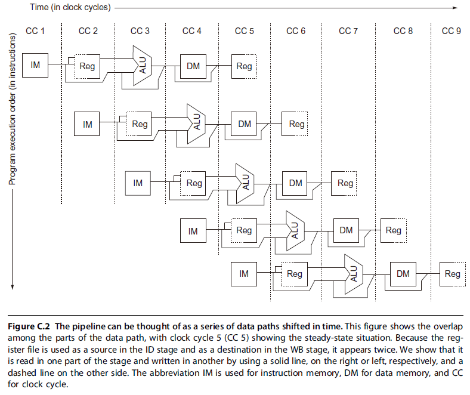{ width="600" }
</figure>

## 2.2 流水线冒险

**Pipeline Hazards**

1. 结构冒险：在重叠执行模式下，如果硬件无法同时支持指令的所有可能组合方式，就会出现资源冲突，从而导致结构冒险
2. 数据冒险
3. 控制冒险

### 2.2.1 Data Hazard

1. RAW：最常见的一种情况，当指令 j 对寄存器 x 的读取发生在指令 i 对寄存器 x 的写入之前。如果这种风险不被预防，指令 j 将使用错误的 x 值
2. WAR：这种风险发生在指令 i 对寄存器 x 的读取发生在指令 j 对寄存器 x 的写入之后。在这种情况下，指令 i 将使用错误的 x 值。==WAR 风险在简单的五级整数流水线中是不可能发生的==
3. WAW：这种风险发生在指令 i 对寄存器 x 的写入发生在指令 j 对寄存器 x 的写入之后。当这种情况发生时，寄存器 x 将向前传递错误的值。==WAW 风险同样在简单的五级整数流水线中是不可能发生的==

<figure markdown="span">
    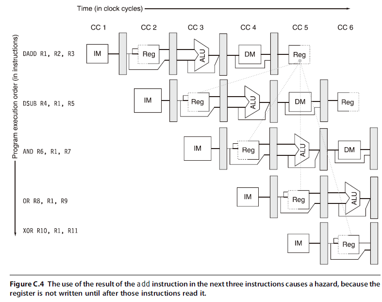{ width="600" }
</figure>

处理数据冒险：

**1.利用 forwarding 技术减少 stall**

<figure markdown="span">
    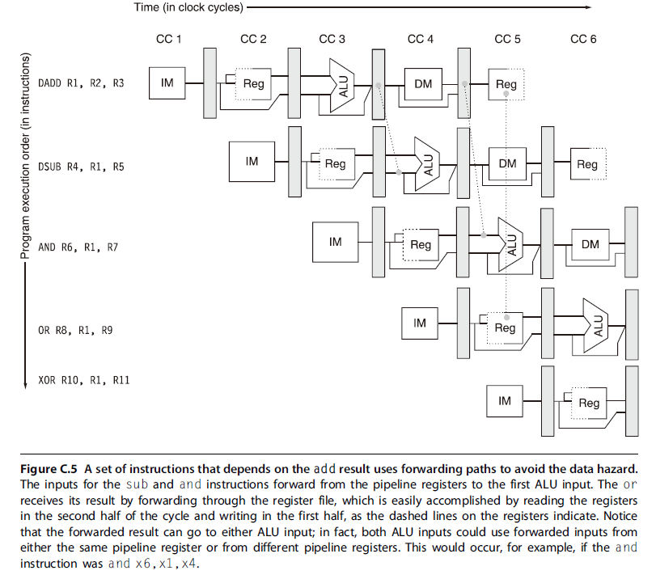{ width="600" }
</figure>

<figure markdown="span">
    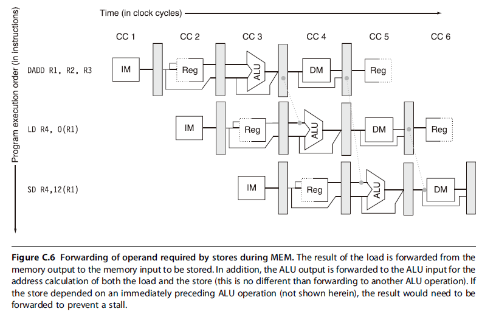{ width="600" }
</figure>

**2.需要 stall 的数据冒险**

<figure markdown="span">
    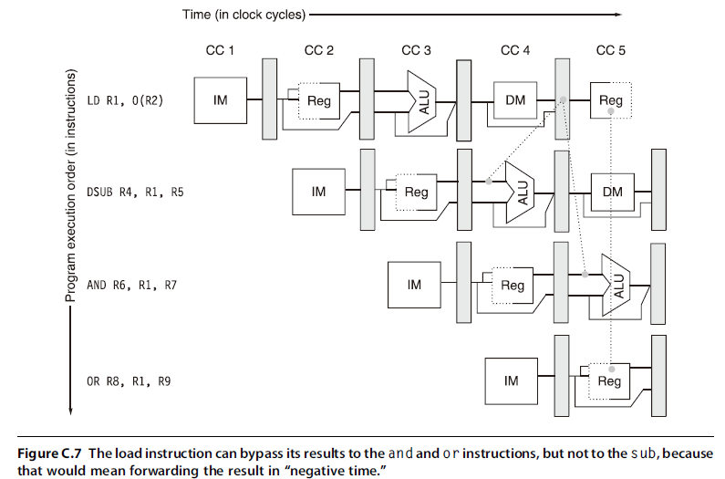{ width="600" }
</figure>

<figure markdown="span">
    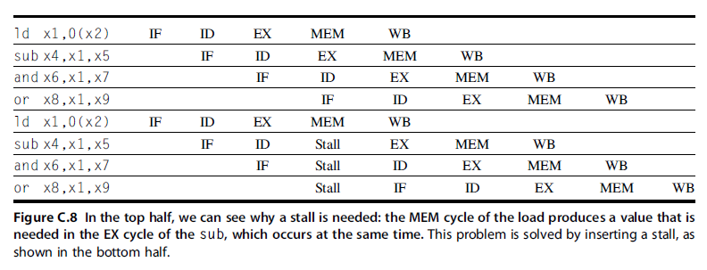{ width="600" }
</figure>

### 2.2.2 Branch Hazard

处理分支的最简单方法是：一旦在 ID 期间检测到分支，就对该分支之后的指令重新取值

<figure markdown="span">
    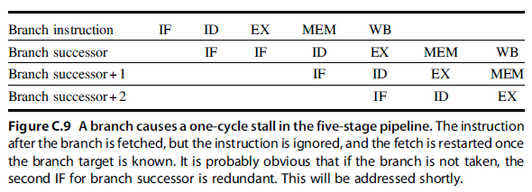{ width="600" }
</figure>

**降低流水线分支代价**

预测分支未发生

<figure markdown="span">
    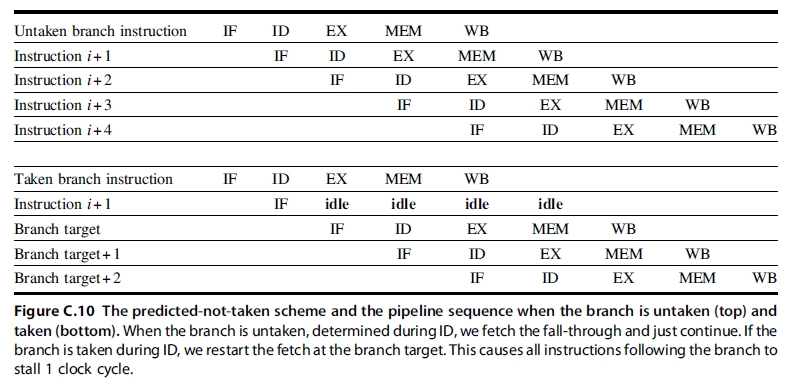{ width="600" }
</figure>

延迟分支

<figure markdown="span">
    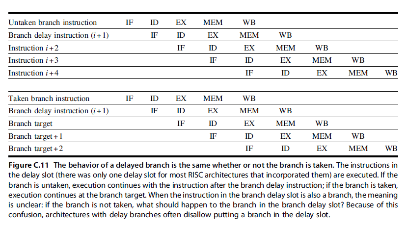{ width="600" }
</figure>

## 2.5 扩展流水线，处理多周期操作

如何扩展 RISC-V 流水线，以处理浮点运算

假定 RISC-V 实现中有以下 4 个独立的功能单元：

1. 主整数单元，处理载入和存储、整型 ALU 操作，还有分支
2. FP 和整数乘法器
3. FP 加法器，处理浮点加、减和转换
4. FP 和整数除法器

<figure markdown="span">
    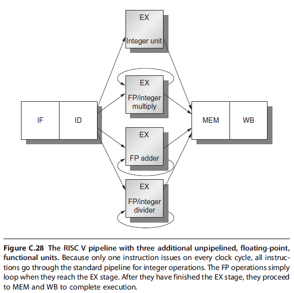{ width="600" }
</figure>

- 功能单元的延迟：生成结果的指令与使用结果的指令之间的周期数
- 功能单元的启动间隔（或重复间隔）：在发生两个给定类型的操作之间必须间隔的周期数

<figure markdown="span">
    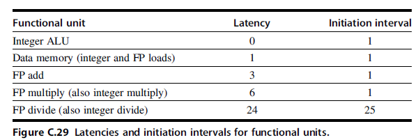{ width="600" }
</figure>

<figure markdown="span">
    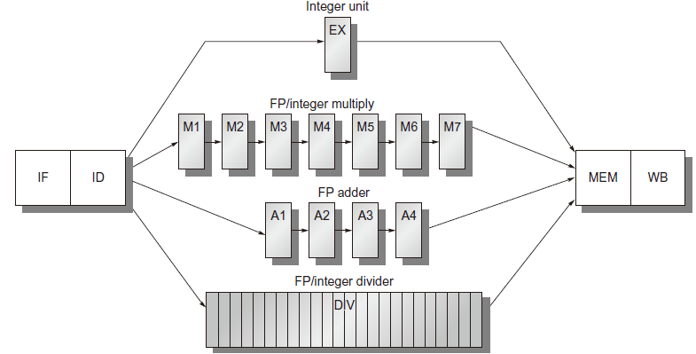{ width="600" }
</figure>

<figure markdown="span">
    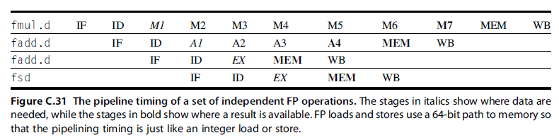{ width="600" }
</figure>

### 2.5.1 长延迟流水线中的冒险与转发

对于上图所示的流水线：

1. 因为除法单元未被完全流水化，所以可能发生结构冒险。需要对这些冒险进行检测，还将需要停顿指令发射
2. 因为指令的运行时间不同，所以一个周期内需要的寄存器写入次数可能会大于 1
3. 由于指令不会循序到达 WB，所以有可能存在写后写 WAW 冒险。注意，==由于寄存器读总是在 ID 中发生，所以不可能存在读后写 WAR 冒险==
4. 指令的完成顺字可能不同于其发射顺序，从而导致异常问题
5. 由于操作的延迟较长，所以 RAW 冒险的停顿将会变得更为频繁

<figure markdown="span">
    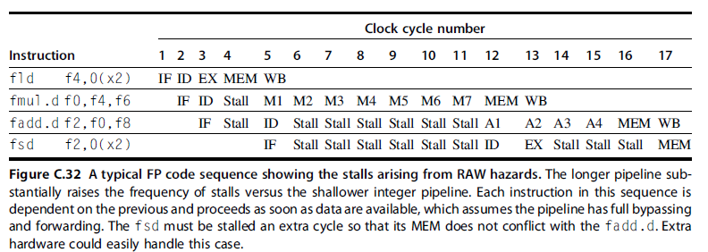{ width="600" }
    <figcaption>由于 RAW 冒险导致的停顿</figcaption>
</figure>

如果假定浮点寄存器堆只有一个写端口，那么浮点操作序列可能导致寄存器写端口的冲突。这便是一种结构冒险

只有主整数单元的 load 操作才会使用到 MEM，因此 MEM 不存在结构冒险

<figure markdown="span">
    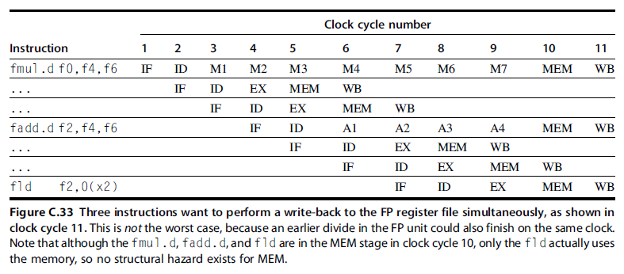{ width="600" }
</figure>

解决方案：

1. 跟踪 ID 级对写端口的使用，并在一条指令发射之前将其停顿
      - 使用一个移位寄存器，这个寄存器可以指示已发射指令将会在何时使用这个寄存器堆。如果 ID 中的指令需要与已发射指令同时使用寄存器堆，那 ID 中的指令将会停顿一个周期
      - 在每个时钟周期，保留寄存器将会移动 1 位
      - 所有互联检测与停顿插入都在 ID 流水级内进行
2. 当一个冲突指令尝试进入 MEM 级或 WB 级时，将其停顿

另一个问题是 WAW 冒险，如果将上图的 L.D 指令提早一个周期，那么会与 ADD.D 产生 WAW 冒险（F2 的值本应该是 L.D 的结果，但是由于 ADD.D 的 WB 阶段在 L.D 的 WB 阶段之后，实际 F2 的值是 ADD.D 的值，产生 WAW 冒险）。但是，只有当 ADD.D 的结果被改写，而且从来没有任何指令使用这一结果时，WAW 冒险才会出现（因为如果在 L.D 和 ADD.D 之间使用到 F2，那么流水线将会因为 RAW 冒险而停顿，碰巧就处理了 WAW 冒险）

解决方案：

1. 延迟载入指令的发射，直到 ADD.D 进入 MEM 为止
2. 废除 ADD.D 的结果：检测冒险并改变控制，使 ADD.D 不会写入其结果

**总结**：

1. 检查结构冒险：一直等到所需要功能单元不再繁忙为止（在这个流水线中，只有除法操作需要），并确保在需要寄存器写端口时可用
2. 检查 RAW 数据冒险：一直等到源寄存器未被列为流水线寄存器中的目的地为止（当这一指令需要结果时，这些寄存器不可用）。这里需要进行大量检查，具体取决于源指令和目标指令，前者决定结果何时可用，后者决定何时需要该取值。例如，如果 ID 中的指令是一个浮点运算，其源寄存器为 F2，那 F2 在 ID/A1、A1/A2或 A2/A3 中不能被列为目的地，它们与一些浮点加法指令相对应，当 ID 中的指令需要结果时，这些指令还不能完成（ID/A1 是 ID 输出寄存器中被发送给 A1 的部分）。如果我们希望重叠执行除法的最后几个周期，由于需要将除法接近完成时的情景作为特殊情况加以处理，所以除法运算需要的技巧性更强一些。实际上，设计师可能会忽略这一优化，以简化发射测试
3. 检查 WAW 数据冒险：判断 A1，...，A4，D，M1，...，M7 中是否有任何指令的目标寄存器与这一指令相同。如果确实如此，则暂停发射 ID 中的指令

## 2.6 MIPS R4000 流水线

1. IF：指令提取的前半部分，PC 选择与指令缓存访问的初始化实际上发生在这里
2. IS：指令提取的后半部分，完成指令缓存访问
3. RF：指令译码与寄存器提取、冒险检查、指令缓存命中检测
4. EX：执行，包括实际地址计算、ALU 操作和分支目标计算与条件判断
5. DF：数据提取，数据缓存访问的前半部分
6. DS：数据提取的后半部分，完成数据缓存访问
7. TC：标记检查，判断数据缓存访问是否命中
8. WB：载入和寄存器-寄存器操作的写回过程

<figure markdown="span">
    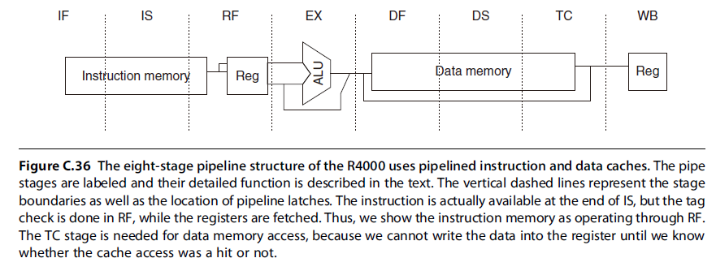{ width="600" }
</figure>

<figure markdown="span">
    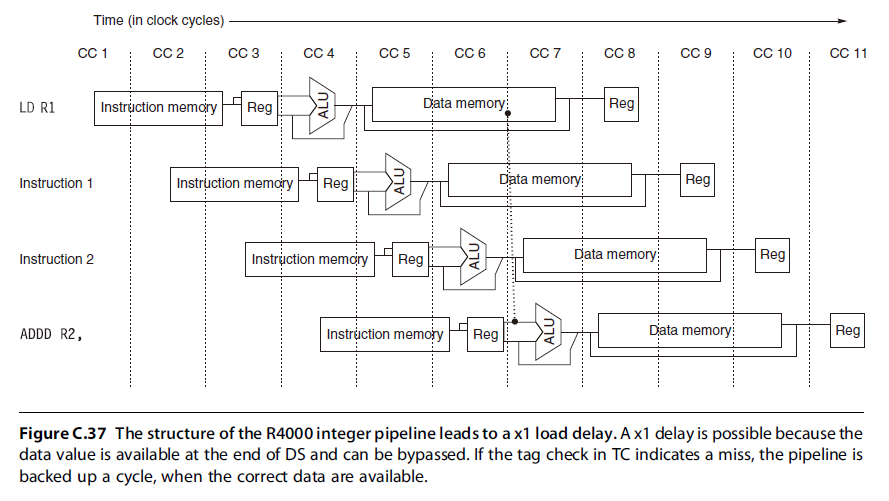{ width="600" }
</figure>

load-use data hazard：

<figure markdown="span">
    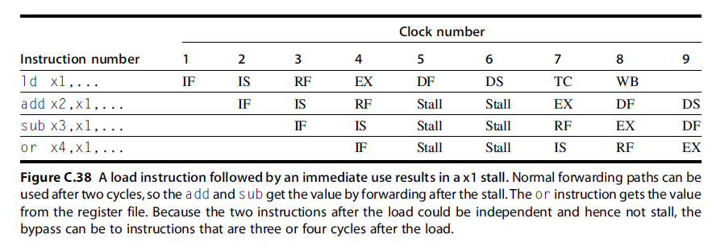{ width="600" }
</figure>

分支条件是在 EX 期间计算的，因此基本分支延迟为 3 个周期

<figure markdown="span">
    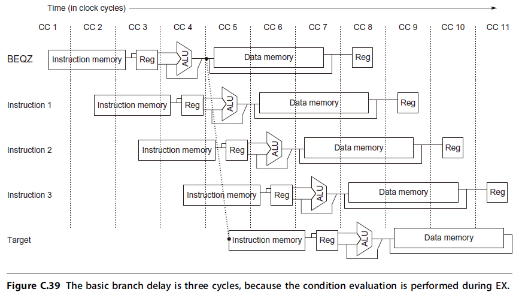{ width="600" }
</figure>

R4000 采取预测不分支的策略，对于未采取的分支，延迟只是一个周期。而对于采取的分支，有一个周期的延迟槽（delay slot），接着是两个空闲周期。延迟槽是指分支指令后的一个指令周期，用于执行一个指令，即使分支被采取

<figure markdown="span">
    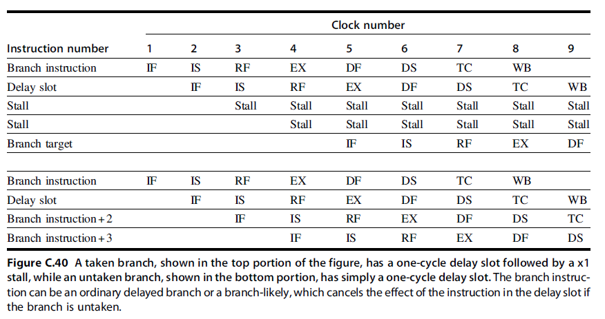{ width="600" }
</figure>

### 2.6.1 浮点流水线

**The Floating-Point Pipeline**

R4000 浮点单元由 3 个功能单元缓存：浮点除法器、浮点乘法器和浮点加法器。加法器逻辑在乘法或除法的最后一个步骤使用。双精度浮点运算可能占用 2 个周期（对于求相反数）到 112 个周期（对于求平方根）。此外，各种单元的起始速度不同。浮点功能单元可以看作拥有 8 个不同流水级。以不同顺序组合这些流水级，即可执行各种浮点运算

<figure markdown="span">
    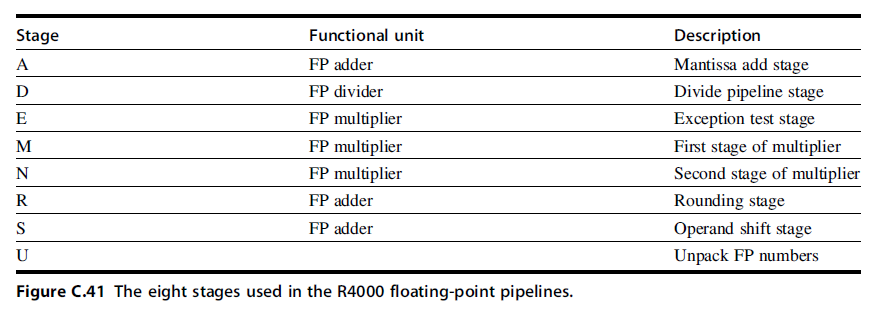{ width="600" }
</figure>

<figure markdown="span">
    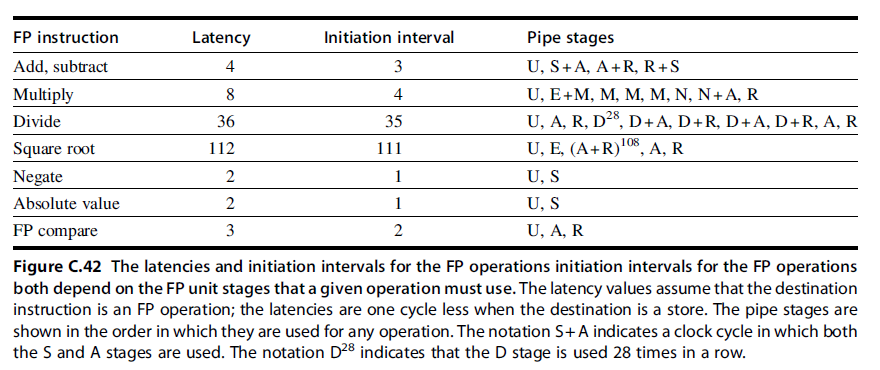{ width="600" }
</figure>

一些 stall 情况：

<figure markdown="span">
    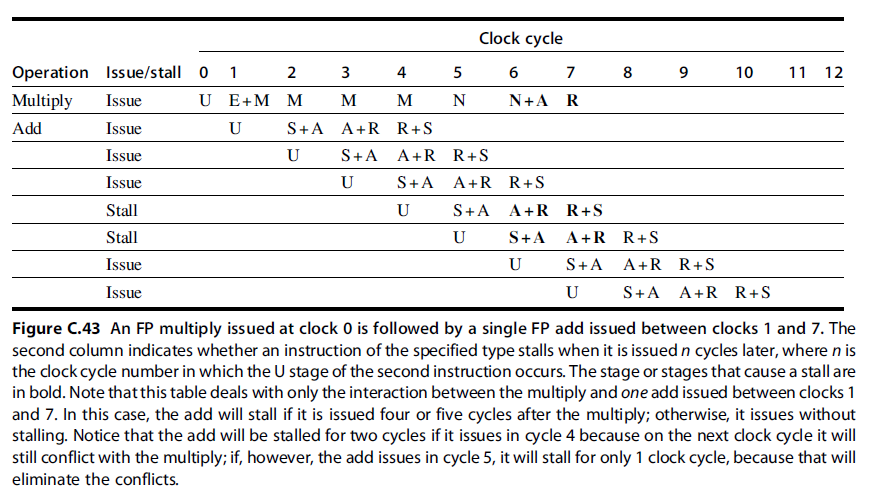{ width="600" }
</figure>

<figure markdown="span">
    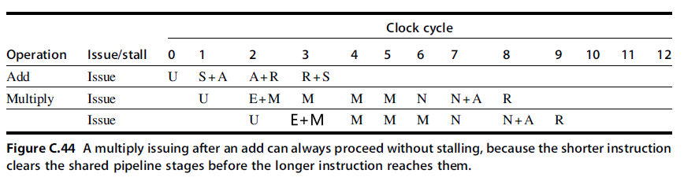{ width="600" }
</figure>

> 课本原图有误，本文档已修正

<figure markdown="span">
    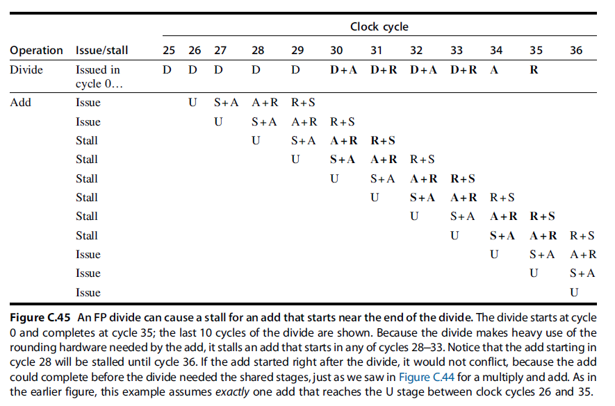{ width="600" }
</figure>

<figure markdown="span">
    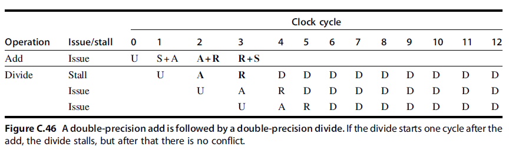{ width="600" }
</figure>
