# 3 Memory Hierarchy Design

<!-- !!! tip "说明"

    本文档正在更新中…… -->

!!! info "说明"

    1. 本文档仅涉及部分内容，仅可用于复习重点知识
    2. 本文档内容对应课本 Chapter 2 和 Appendix B

## 1 引言

memory hierarchy（存储器层次结构）：

principle of locality of reference（局部性原理）：程序在任意时刻通常只访问地址空间的一小部分。为了提高访问速度，可以将最近访问的数据项保存在快速存储器中。这通常通过使用缓存（cache）来实现，缓存是一种小而快速的存储器，用于存储最近或频繁访问的数据，以减少访问较慢的主存储器的次数

1. temporal locality（时间局部性）：最近访问过的数据很可能在不久的将来再次被访问
2. spatial locality（空间局部性）：如果一个数据被访问，那么它附近的数据也可能很快被访问

### 1.1 4 个存储器层次结构问题

如果处理器需要的数据存放在高层存储器中的某个块中，则称为一次 **命中**（hit）。如果在高层存储器中没有找到所需的数据，这次数据请求则称为一次 **缺失**（miss）。随后访问低层存储器来寻找包含所需数据的那一块。**命中率**（hit rate），或命中比率（hit ratio），是在高层存储器中找到数据的存储访问比例，通常被当成存储器层次结构性能的一个衡量标准。**缺失率**（miss rate）（1－命中率）则是数据在高层存储器中没有找到的存储访问比例

追求高性能是我们使用存储器层次结构的主要目的，因而命中和缺失的执行时间就显得尤为重要。**命中时间**（hit time）是指访问存储器层次结构中的高层存储器所需要的时间，包括了判断当前访问是命中还是缺失所需的时间。**缺失代价**（miss penalty）是将相应的块从低层存储器替换到高层存储器中，以及将该信息块传送给处理器的时间之和，由于较高存储层次容量较小并且使用了快速的存储器部件，因此比起对存储层次中较低层的访问，命中时间要少得多，这也是缺失代价的主要组成部分

#### 1.1.1 Block Placement

**一个块可以放在上一级的什么位置**

在 cache 中为主存中每个字分配一个位置的最简单方法就是根据这个字的主存地址进行分配，这种 cache 结构称为 **直接映射**（direct mapped）。每个主存地址对应到 cache 中一个确定的地址

$$
（块地址） mod （cache 中的块数）
$$

**全相联：**（fully associative） 一个块可以被放置在 cache 中的任何位置

**组相联：**（set associative） 每个块可被放置的位置数是固定的（至少两个）

每个块有 n 个位置可放的 cache 被称作 n 路组相联 cache（n-way set-associative cache）。一个 n 路组相联 cache 由很多个组构成，每个组有 n 块。根据索引域，存储器中的每个块对应到 cache 中唯一的组，并且可以放在这个组中的任何一个位置上

在组相联 cache 中，包含存储块的组是这样给出的：

$(Block\ number) mod (number\ of\ sets\ in\ the\ cache)$<br/>
$（块号）mod（cache 中的组数）$

<figure markdown="span">
    { width="600" }
</figure>

#### 1.1.2 Block Identification

**如果一个块在上一级中，如何找到它**

由于 cache 中每个位置可能对应于主存中多个不同的地址，我们如何知道 cache 中的数据项是否是所请求的字呢？即如何知道所请求的字是否在 cache 中？我们可以在 cache 中增加一组 **标记**（tag），标记中包含了地址信息，这些地址信息可以用来判断 cache 中的字是否就是所请求的字。标记只需包含地址的高位，也就是没有用来检索 cache 的那些位。例如，在上图中，标记位只需使用 5 位地址中的高 2 位，地址低 3 位的索引域则用来选择 cache 中的块

我们还需要一种方法来判断 cache 块中确实没有包含有效信息。例如，当一个处理器启动时，cache 中没有数据，标记域中的值没有意义。甚至在执行了一些指令后，cache 中的一些块依然为空。因此，在 cache 中，这些块的标记应该被忽略。最常用的方法就是增加一个 **有效位**（valid bit）来标识一个块是否含有一个有效地址。如果该位没有被设置，则不能使用该块中的内容

#### 1.1.3 Block Replacement

**在缺失时应当替换哪个块**

1. random replacement：随机替换
2. least-recently used（LRU）：最近最少的被替换
3. first in, first out（FIFO）：先进先出法则

#### 1.1.4 Write Strategy

**在写入时会发生什么**

当数据写入 cache 时，数据如何写入主存？

1. **write-through**（写直达法）：将数据同时写入主存和 cache 中。但这样会花费大量的时间，一种解决方法是 write-buffer（写缓冲），当一个数据在等待写入主存时，先将它放入写缓冲中
2. **write-back**（写回机制）：新值仅仅被写入 cache 块中，只有当修改过的块被替换时才需要写到较低层次存储结构中
      1. 需要 valid 和 dirty 位
        - dirty bit 用于标记缓存行（cache line）中的数据是否已被修改但尚未写回到主存中
        - 当一个缓存行中的数据被处理器修改时，dirty bit 会被设置为“1”，表示该缓存行中的数据与主存中的数据不一致（即“脏”）
        - 如果 dirty bit 为“0”，则表示缓存行中的数据与主存中的数据一致（即“干净”）
      2. 当某个块需要被替换时，系统会检查 dirty bit
        - 如果 dirty bit 为“1”，则将该缓存行中的数据写回主存，以确保数据一致性
        - 如果 dirty bit 为“0”，则直接丢弃该缓存行，因为主存中已经存在相同的数据

优点：

1. 写直达
      1. 更容易实现
      2. 下一级存储器中拥有数据的最新副本，从而简化了数据一致性
2. 写回
      1. 写入操作的速度与缓存存储器的速度相同
      2. 使用的存储器带宽较少，使写回策略对多处理器更具吸引力
      3. 写回对存储器层次结构其余部分及存储器互连的使用少于直写，节省功耗，对于嵌入式应用极具吸引力

处理器在直写期间必须等待写入操作的完成，则称该处理器处于写入停顿（write stall）状态。减少此停顿的常见优化方法时写入缓冲区（write buffer），但即使有了此缓冲区，write stall 也可能会发生

当发生写入缺失时（cache 里没有处理器要修改的那个数据地址），如何处理？

1. **write allocate**：将目标数据块从主存加载到缓存，随后在缓存中完成写入。适用于后续可能频繁访问该数据块的场景
2. **write around** / **no-write allocate**：不将数据块加载到缓存，直接写入主存

一般搭配：

1. write-back + write-allocate
2. write-through + write-around

<figure markdown="span">
    { width="600" }
</figure>

> 好家伙，计组没搞懂的东西，终于在这里搞懂了

### 1.2 缓存架构

1. unified cache（统一缓存）：所有内存请求（包括指令和数据）都通过单一的缓存进行处理
      1. 硬件需求较少，设计相对简单
      2. 由于指令和数据共享同一个缓存，可能导致缓存争用，从而降低命中率
2. spilt I & D cache（分离缓存）：使用独立的缓存分别处理指令和数据。指令缓存（I-Cache）和数据缓存（D-Cache）分开
      1. 可以减少指令和数据之间的争用，提高命中率。指令缓存通常是只读的，这简化了设计
      2. 需要更多的硬件资源

<figure markdown="span">
    { width="600" }
</figure>

## 2 Cache Performance

$CPU\ time = (CPU\ execution\ clock\ cycles + Memory\text{-}stall\ clock\ cycles) \times Clock\ cycle\ time$

$Memory\ stall\ cycles = IC\times Mem\ refs\ per\ instruction（每条指令的内存访问次数）\times Miss\ rate\times Miss\ penalty$

$\Rightarrow$

$CPU\ time = IC\times (CPI + \dfrac{MemAccess}{Inst} \times miss\ rate \times miss\ penalty) \times cycle\ time$

$\Rightarrow$

$CPU\ time = IC\times (CPI + \dfrac{MemMisses}{Inst} \times miss\ penalty) \times cycle\ time$

### 2.1 AMAT

存储器平均访问时间（average memory access time）

$AMAT = hit\ time + miss\ rate \times miss\ penalty$

$CPU\ time = IC\times (\dfrac{AluOps}{Inst}\times CPI_{AluOps} + \dfrac{MemAccess}{Inst} \times AMAT) \times cycle\ time$

<figure markdown="span">
    { width="600" }
</figure>

---

<figure markdown="span">
    { width="600" }
</figure>

---

<figure markdown="span">
    { width="600" }
</figure>

> 课本原图有误，本文档已修正

---

<figure markdown="span">
    { width="600" }
</figure>

如上例所示，缓存特性可能会对性能产生巨大影响。此外，对于低 CPI、高时钟频率的处理器，缓存缺失会产生双重影响

1. $CPI_{execution}$ 越低，固定数目的缓存缺失时钟周期产生的相对影响越高
2. 在计算 CPI 时，一次缺失的缓存代价是以处理器时钟周期进行计算的。因此，即使两个计算机的存储器层次结构相同，时钟频率较高的处理器在每次缺失时会占用较多的时钟周期，CPI 的存储器部分也相应较高

<figure markdown="span">
    { width="600" }
</figure>

### 2.2 miss penalty and Out-of-Order Execution Processors

**缺失代价与乱序执行处理器**

对于乱序执行处理器，如何定义“缺失代价”呢？是存储器缺失的全部延迟，还是仅考虑处理器必须停顿时的“暴露”延迟或无重叠延迟？对于那些在完成数据缺失之前必须停顿的处理器，不存在这一问题

重新定义存储器停顿，得到 miss penalty 的一种新定义，将其表示为 non-overlapped latency

$\dfrac{memory\ stall\ cycles}{instruction} = \dfrac{misses}{instruction} \times (total\ miss\ latency - overlapped\ miss\ latency)$

与此类似，由于一些乱序处理器会拉长命中时间，所以性能公式的这一部分可以除以总命中延迟减去重叠命中延迟之差。可以对这一公式进一步扩展，将总缺失延迟分解为没有争用时的延迟和因为争用导致的延迟，以考虑乱序处理器中的存储器资源。我们仅关注缺失延迟

1. length of memory latency（存储器延迟长度）：在乱序处理器中如何确定存储器操作的起止时刻
2. length of latency overlap（延迟重叠的长度）：如何确定与处理器相重叠的起始时刻（或者说，在什么时刻我们说存储器操作使处理器停顿）

由于乱序执行处理器的复杂性，所以不存在单一的准确定义

由于在流水线退出阶段只能看到已提交的操作，所以我们说：如果处理器在一个时钟周期内没有退出（retire）最大可能数目的指令，它就在该时钟周期内停顿。我们将这一停顿记在第一条未退出指令的账上。这一定义绝不像看上去那么简单。例如，为缩短特定停顿时间而应用某一种优化，并不一定总能缩短执行时间，这是因为此时可能会暴露出另一种类型的停顿（原本隐藏在所关注的停顿背后）

关于延迟，我们可以从存储器指令在指令窗口中排队的时刻开始测量，也可以从生成地址的时刻开始，还可以从指令被实际发送给存储器系统的时刻开始。只要保持一致，任何一种选项都是可以的

<figure markdown="span">
    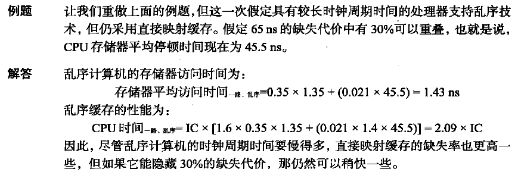{ width="600" }
</figure>

## 3 Optimizations of Cache Performance

1. Reduce the time to hit in the cache：缩短命中时间
      1. small and simple first-level caches
      2. wat prediction
      3. avoiding address translation during index of the cache
      4. trace caches
2. Increase cache bandwidth：增加缓存带宽
      1. pipelined access
      2. nonblocking cache
      3. multibanked caches
      3. multibanked caches
3. Reduce the miss penalty：降低缺失代价
      1. multilevel caches
      2. critical word first and early restart
      3. giving priority to read misses over writes
      4. merging write buffer
4. Reduce the miss rate：降低缺失率
      1. larger block size
      2. larger caches
      3. higher associativity
      4. way prediction and pseudo-associative cache
      5. compiler optimizations
5. Reduce the miss penalty and miss rate via parallelism：通过并行降低缺失代价或缺失率
      1. hardware prefetching of instruction and data
      2. compiler-controlled prefetching

### 3.1 Reduce the time to hit

#### 3.1.1 Small and Simple First-Level Caches

**to reduce hit time and power**

**小而简单的第一级缓存，用以缩短命中时间、降低功率**

1. 实现缓存所需的硬件越少，硬件中的关键路径就越短
2. 直接映射缓存比组相联缓存在读写操作上更快
3. 将缓存与 CPU 集成在同一芯片上对实现快速访问时间也非常重要

<figure markdown="span">
    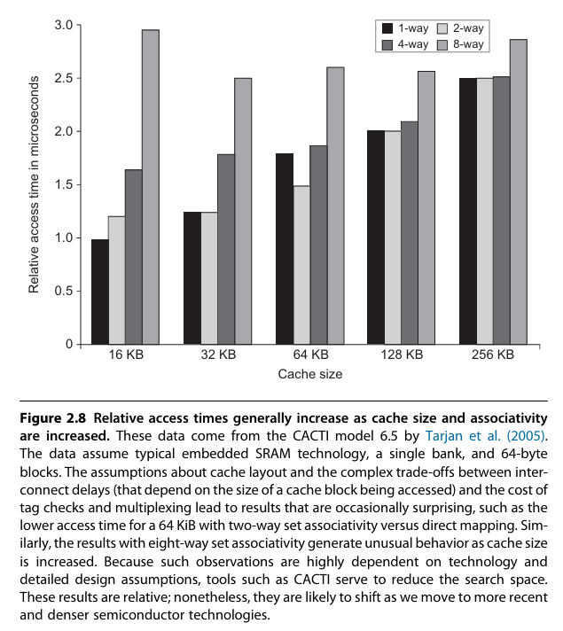{ width="600" }
</figure>

#### 3.1.2 Way Prediction

**to reduce hie time**

**采用路预测以缩短命中时间**

这是另外一种可以减少冲突缺失，同时又能保持直接映射缓存命中速度的方法。在路预测技术中，缓存中另外保存了一些位，用于预测下一次缓存访问组中的路或块。这种预测意味着尽早设定多工选择器，以选择所需要的块，在与缓存数据读取并行的时钟周期内，只执行一次标签比较。如果缺失，则会在下一个时钟周期中查看其他块，以找出匹配项

在一个缓存的每个块中都添加块预测位。根据这些位选定要在下一次缓存访问中优先尝试哪些块。如果预测正确，则缓存访问延迟就等于这一快速命中时间。如果预测错误，则尝试其他块，改变路预测器，延迟会增加一个时钟周期

#### 3.1.3 Avoiding Address Translation During Indexing of the Cache

**to reduce hit time**

**避免在索引缓存期间进行地址转换，以缩短命中时间**

即使一个小而简单的缓存也必须能够将来自处理器的虚拟地址转换为用以访问存储器的物理地址

为了加快这一翻译过程，我们可以使用 TLB

<figure markdown="span">
    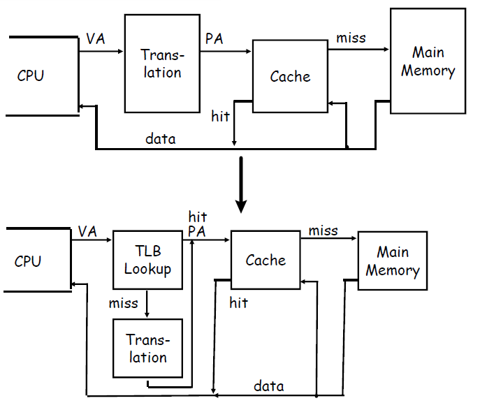{ width="600" }
</figure>

但是

1. TLB 访问延迟：即使 TLB 命中，也需要至少 1 个时钟周期完成地址转换
2. 串行依赖：缓存访问必须等待 TLB 转换完成，导致流水线停顿

为了减少这种延迟，可以采用以下优化方法

**1.虚拟索引缓存**（virtually indexed \ VI）

- 原理：直接使用虚拟地址的一部分作为缓存的索引（Index），而不依赖物理地址
- 优点：缓存访问和 TLB 转换可以并行进行（减少串行依赖）
- 限制
      - 必须确保不同虚拟地址映射到同一物理地址时不会冲突（即避免别名问题，Aliasing）
      - 通常要求缓存大小 ≤ 页大小 × 相联度

**2.物理标记缓存**（physically tagged \ PT）

- 原理：虽然索引使用虚拟地址，但缓存行的标记（Tag）仍然使用物理地址，以确保数据一致性
- 工作流程
      1. 并行操作：虚拟索引直接访问缓存，同时 TLB 转换物理地址
      2. 比较 Tag：缓存返回数据后，用 TLB 转换的物理地址与缓存行的 Tag 比较，确认是否命中
- 优点
      1. 仍然支持多进程共享缓存（因为 Tag 是物理地址）
      2. 减少关键路径延迟（TLB 和缓存访问部分并行）

**3.混合方案：VIPT**（virtually indexed，physically tagged）

- 索引（Index）：使用虚拟地址低位
- 标记（Tag）：使用物理地址（避免别名问题）
- 优点
      1. 几乎消除 TLB 对缓存访问的延迟影响（TLB 和缓存访问并行）
      2. 兼容多进程环境（不同进程的相同虚拟地址不会错误命中）

---

在每次切换进程时，虚拟地址会指向不同的物理地址，需要对缓存进行刷新。一种解决方案是增大缓存地址标志的宽度，增加一个进程识别符标志（process identifier tag / PID）。如果操作系统将这些标志指定给进程，那么只需要在 PID 被回收时才刷新缓存。也就是说，PID 可以区分缓存中的数据是不是为此这个程序准备的

!!! note "AI 解释"

    **1.问题背景：进程切换与缓存刷新**
    
    - **虚拟地址（VA） vs. 物理地址（PA）**：现代操作系统使用虚拟内存机制，每个进程拥有独立的虚拟地址空间，但最终访问的是共享的物理内存
          - **进程切换时**，相同的虚拟地址可能映射到不同的物理地址（例如，进程 A 的 `VA=0x1000` → `PA=0x2000`，进程 B 的 `VA=0x1000` → `PA=0x3000`）
          - **缓存冲突风险**：如果缓存仅用虚拟地址或物理地址索引，新进程可能错误命中旧进程的缓存数据（**别名问题**）。 
    - **传统解决方案：缓存刷新（Flush）**：在进程切换时，清空缓存（如 TLB 刷新、缓存无效化），但会导致性能损失
          - **冷启动延迟**：新进程的缓存初始命中率低，需重新加载数据
          - **频繁切换开销大**（如多任务、多线程环境）
    
    ---
    
    **2.解决方案：扩展缓存标记位，增加 PID 标识符**
    
    **(1) 核心思想**
    
    - **在缓存行的标记（Tag）中增加进程标识符（PID）**：  
          - 缓存不仅存储物理地址 Tag，还存储当前占用该缓存行的进程 PID
          - **访问缓存时**，需同时匹配 **物理地址 Tag + PID**，才能判定命中
    
    **(2) 工作流程**

    1. **缓存存储结构**  
          - 每个缓存行的标记（Tag）扩展为：`| Physical Address Tag | PID | Valid Bit |`
          - **PID 由操作系统分配**（如进程 ID 或地址空间 ID, ASID）
    2. **缓存访问过程**  
          - CPU 访问虚拟地址 → TLB 转换为物理地址 + 当前进程 PID
          - 缓存控制器比较：  
              - 物理地址 Tag 是否匹配？
              - PID 是否匹配？
          - **只有两者均匹配**，才判定为缓存命中
    3. **进程切换时的行为**  
          - **无需刷新缓存**：新进程的 PID 不同，即使虚拟地址相同，也不会错误命中旧进程的数据
          - **PID 回收时刷新**：仅当 PID 被操作系统回收（如进程退出）时，才需清理对应 PID 的缓存行

操作系统和用户程序可能为同一物理地址使用两种不同的虚拟地址。这些重复地址称为同义地址或别名地址，可能会在虚拟缓存中生成同一数据的两个副本；如果其中一个被修改了，另一个就会包含错误值。而采用物理缓存是不可能发生这种情况的，因为这些访问将会首先被转换为相同的物理缓存块

页面着色（Page Coloring） 是一种通过控制物理页帧的分配策略，确保不同虚拟地址映射到同一物理地址时，其缓存索引（Index Bits）相同的技术

核心思想：

- 将物理内存页帧划分为若干“颜色”（Color），每个颜色对应一组特定的缓存索引位。
- 操作系统分配物理页时，强制让同一物理地址的虚拟页具有相同的“颜色”，从而避免别名冲突

!!! note "AI 解释"

    **(1) 缓存与页面的关系**
    
    假设：
    
    - 缓存大小为 \( C \)，组相联度为 \( N \)，每行大小 \( B \)。  
    - 缓存组数 \( S = \frac{C}{N \times B} \)，索引位数为 \( \log_2 S \)。  
    - 物理页大小 \( P \)（如 4KB），页内偏移位数为 \( \log_2 P \)。  
    
    **关键观察**：
    
    - 缓存的索引位（Index）通常来自虚拟地址的 **低位**（如页内偏移部分）
    - 若两个虚拟页的索引位相同，它们会映射到同一缓存组，可能引发别名
    
    **(2) 页面着色机制**
    
    1. **划分颜色**：  
          - 将物理页帧按缓存索引位的可能值划分为 \( K = 2^{\text{Index位数}} \) 种颜色（如 64 组缓存 → 64 种颜色）
          - 例如，若索引位为 6 位（\( 2^6 = 64 \) 组），则颜色编号 0~63 
    2. **分配策略**：  
          - 操作系统分配物理页时，根据进程的虚拟地址索引位 **强制选择对应颜色** 的物理页帧
          - 公式：$\text{物理页帧颜色} = (\text{虚拟地址索引位}) \mod K$
          - 这样，同一物理地址的所有虚拟映射会 **自动对齐到同一缓存组**，避免别名  
    
    **(3) 工作流程示例**
    
    - **场景**：  
          - 缓存：64 组（Index 6 位），页大小 4KB（偏移 12 位）
          - 虚拟地址 `VA1` 和 `VA2` 映射到同一物理页，但 `VA1` 的 Index=5，`VA2` 的 Index=10
    - **传统问题**：  
          - `VA1` 和 `VA2` 会分别映射到缓存组 5 和 10，导致同一数据存两份（别名） 
    - **页面着色解决**：  
          - 强制 `VA1` 和 `VA2` 使用颜色=5 的物理页（即物理页帧的 Index 位固定为 5）  
          - 访问时，无论 `VA1` 还是 `VA2`，均映射到缓存组 5，保证数据唯一性

#### 3.1.4 Trace caches

**to reduce hit time**

**trace caches 缩短命中时间**

**AI 解释**

Trace Cache 是一种用于优化处理器指令缓存性能的高级技术，主要通过在缓存中存储动态指令序列（即“执行轨迹”）来提升指令供给效率

1. 基本概念
      - 传统指令缓存（L1 ICache）：存储静态的指令代码（按内存地址顺序），但无法直接反映程序的实际执行路径（如分支后的指令流）
      - Trace Cache：存储的是处理器实际执行的 **动态指令序列**（称为“trace”），即按程序运行时顺序捕获的指令块（包含分支预测后的路径）
2. 工作原理
      - 动态轨迹记录：当处理器执行指令时，Trace Cache 会记录分支预测后的指令流，形成一个连续的指令块（trace）
          - 例如：循环或条件分支中的指令会被记录为一条线性化的轨迹，即使它们在内存中不连续
      - 索引方式：通过指令的起始地址（如分支指令的PC）和分支历史（全局或局部）作为索引，确保同一段代码在不同执行路径下生成不同的 trace
3. 关键优势
      - **减少取指延迟**：传统缓存需要多次访问（尤其在分支密集代码中），而 Trace Cache 直接提供预测后的指令流，避免重复解码和分支预测
      - **提高指令供给带宽**：每个trace包含多条指令（可能跨基本块），单次访问可获取更多有效指令
      - **缓解解码瓶颈**：存储已解码的微操作（uOps），避免重复解码（在NetBurst架构等中使用）

### 3.2 Increase cache bandwidth

#### 3.2.1 Pipelined Access

**to increase bandwidth**

**实现缓存访问的流水化，以提高缓存带宽**

**AI 解释**

缓存访问流水化是一种通过将缓存访问过程分解为多个流水级（pipeline stages），以提高缓存带宽和处理器整体性能的技术。其核心思想是 **将串行的缓存访问操作拆分成多个并行执行的阶段**，从而在每个时钟周期内处理更多的请求，提升吞吐量

**1.传统缓存访问的瓶颈**

在非流水化的缓存设计中，一次完整的缓存访问通常需要在一个时钟周期内完成以下操作：

1. 地址计算（Address Calculation）
2. 标签匹配（Tag Comparison）
3. 数据读取（Data Access）
4. 数据返回（Data Return）

由于这些步骤是串行执行的，如果缓存访问延迟较高（如大容量缓存或高频率设计），可能会导致：

1. 时钟周期变长（降低处理器频率）
2. 带宽受限（每个周期只能处理一个请求）

**2.缓存访问流水化的基本原理**

流水化缓存访问的核心思想是 **将缓存访问过程拆分成多个阶段**，类似于 CPU 流水线。典型的缓存流水化设计可能包括以下阶段：

| 流水级 | 操作 |
| :--: | :--: |
| Stage 1 | 地址计算（计算索引和标签）|
| Stage 2 | 标签匹配（比较标签是否命中）|
| Stage 3 | 数据读取（从数据阵列中读取数据）|
| Stage 4 | 数据返回（将数据送回 CPU 或下一级缓存）|

1. 每个时钟周期，一个新的缓存请求可以进入流水线的第一级
2. 前一个请求进入下一级流水线，同时新的请求进入第一级
3. 最终，每个时钟周期可以完成一个缓存访问（尽管单个访问仍然需要多个周期）

---

- 优势
      1. 提高缓存带宽
          - 传统缓存每个周期只能处理一个请求，而流水化缓存可以 每个周期接受一个新请求（即使单个访问仍需多个周期完成）
          - 适用于高吞吐量场景（如超标量处理器、多核共享缓存）
      2. 支持更高时钟频率：由于每个流水级逻辑更简单，可以缩短关键路径，提高处理器主频
      3. 提高多级缓存的效率：适用于 L1、L2、L3 缓存，特别是多端口缓存（如同时支持 load/store 请求）
- 挑战
      1. 访问延迟增加
          - 虽然吞吐量提高，但单个请求的延迟可能增加（因为需要多个时钟周期完成）
          - 需要通过预取（prefetching）或乱序执行（OoO）来隐藏延迟
      2. 流水线冲突
          - 如果多个请求访问同一缓存行，可能导致结构冲突（structural hazard）
          - 解决方法
              - 多端口缓存（支持多个并行访问）
              - banked 缓存（将缓存分成多个 bank，允许并行访问不同 bank）
      3. 一致性维护复杂：在多核处理器中，流水化缓存需要处理缓存一致性协议（如 MESI）带来的额外复杂度

#### 3.2.2 Nonblocking Cache

**to increase cache bandwidth**

**采用无阻塞缓存，以提高缓存带宽**

对于允许乱序执行的流水化计算机，其处理器不必因为一次数据缓存缺失而停顿。例如，在等待数据缓存返回缺失数据时，处理器可以继续从指令缓存中提取指令。无阻塞缓存（或称为自由查询缓存）允许数据缓存在一次缺失期间继续提供缓存命中，进一步加强了这种方案的潜在优势。这种“缺失时仍然命中”优化方法在缺失期间非常有用，它不会在此期间忽略处理器的请求，从而降低了实际缺失代价。还有一种精巧而复杂的选项:如果能够重看多个缺失,那缓存就能进一步降低实际缺失代价,这种选项被称为“多次缺失时仍然命中”（hitundermultiple miss）或者“缺失时缺失”（miss under miss）优化方法。只有当存储器系统可以为多次缺失提供服务时，第二种选项才有好处

<figure markdown="span">
    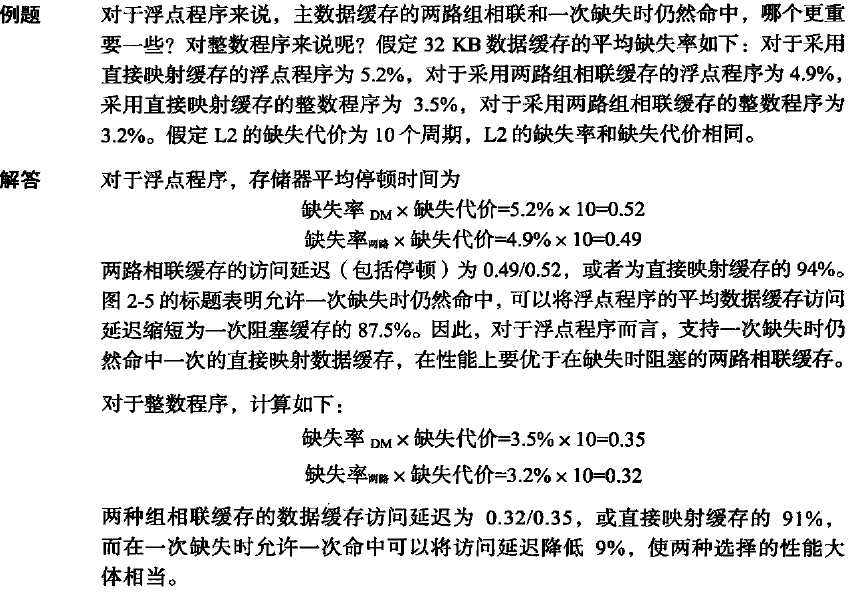{ width="600" }
</figure>

#### 3.2.3 Multibanked Caches

**to increase cache bandwidth**

**采用多种缓存，以提高缓存带宽**

将缓存划分为几个相互独立、支持同时访问的缓存组，而不是将它们看作一个整体

显然，当访问请求很自然地分布在缓存组之间时，分组方式的效果最佳，所以将地址映射到缓存组的方式影响着存储器系统的行为。一种简单有效的映射方式是将缓存块地址按顺序分散在这些缓存组中，这种方式称为顺序交错。例如，如果有 4 个缓存组，0 号缓存组中的所有缓存块地址对 4 求模后余 0，1 号缓存组中的所有缓存块地址对 4 求模后余 1，以此类推

<figure markdown="span">
    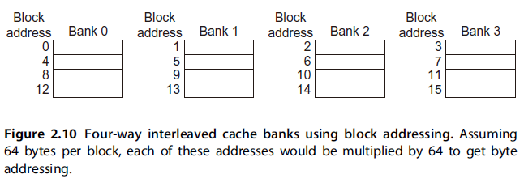{ width="600" }
</figure>

### 3.3 Reduce the miss penalty

#### 3.3.1 Multilevel Caches

**to reduce miss penalty**

**采用多级缓存降低缺失代价**

处理器与存储器之间的性能差距让架构师开始思考这样一个问题:是应当加快缓存速度以与处理器速度相匹配呢？还是让缓存更大一些，以避免加宽处理器与主存储器之间的鸿沟？

一个回答是：两者都要。在原缓存与存储器之间再添加一级缓存可以简化这一决定。第一级缓存可以小到足以与快速处理器的时钟周期时间相匹配。而第二级缓存则大到足以捕获本来可能进入主存储器的访问，从而降低实际缺失代价

尽管再添加一级层次结构的思路非常简单，但它增加了性能分析的复杂程度。第二级缓存的定义也并非总是那么简单。首先让我们为一个二级缓存定义存储器平均访问时间。用下标 L1 和 L2 分别指代第一级、第二级缓存，原公式为：

- $average\ memory\ access\ time = hit\ time_{L1} + miss\ rate_{L1} \times miss\ penalty_{L1}$
- $miss\ penalty_{L1} = hit\ time_{L2} + miss\ rate_{L2} \times miss\ penalty_{L2}$

$\Rightarrow$

$average\ memory\ access\ time = hit\ time_{L1} + miss\ rate_{L1} \times (hit\ time_{L2} + miss\ rate_{L2} \times miss\ penalty_{L2})$

在这个公式中，第二级缺失率是针对第一级缓存未能找到的内容进行测量的。对二级缓存系统采用以下术语

1. local miss rate（局部缺失率）：$\dfrac{缓存中的缺失数}{对该缓存进行存储器访问的总数}$，对于第一级缓存，等于 $miss\ penalty_{L1}$；对于第二级缓存，等于 $miss\ penalty_{L2}$
2. global miss rate（全局缺失率）：$\dfrac{缓存中的缺失数}{处理器生成的存储器访问总数}$，对于第一级缓存，等于 $miss\ penalty_{L1}$；对于第二级缓存，等于 $miss\ penalty_{L1} \times miss\ penalty_{L2}$

在评估第二级缓存时，应当使用全局缓存缺失率

$average\ memory\ stalls\ per\ instruction = misses\ per\ instruction_{L1} \times hit\ time_{L2} + misses\ per\ instruction_{L2} \times miss\ penalty_{L2}$

<figure markdown="span">
    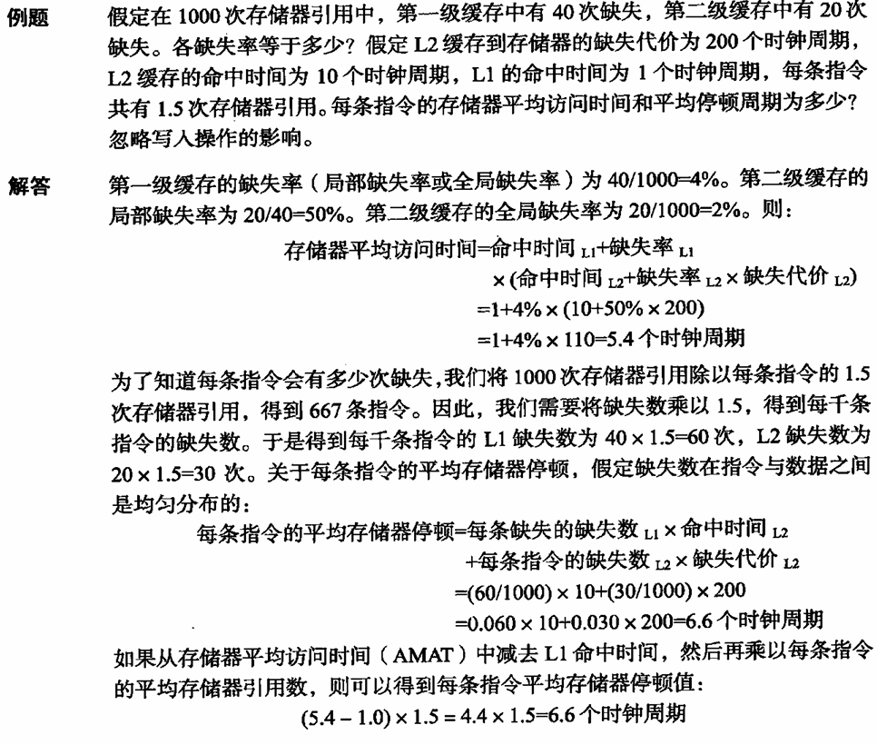{ width="600" }
</figure>

#### 3.3.2 Critical Word First and Early Restart

**to reduce miss penalty**

**关键字优先和提前重启动以降低缺失代价**

这一技术的事实基础是人们观测到处理器在某一时刻通常仅需要缓存块的一个字。这一策略显得“不够耐心”：无须等待完成整个块的载入过程，一旦载入被请求字之后，立即将其发出然后就重启处理器。下面是两个特定策略

1. 关键字优先：首先从存储器中请求缺失的字，在其到达缓存之后立即发给处理器;使处理器能够在载入块中其他字时继续执行
2. 提前重启动：以正常顺序提取字，但只要块中的被请求字到达缓存，就立即将其发送给处理器，让处理器继续执行

通常，只有在采用大型缓存块的设计中，这些技术才有用武之地，如果缓存块很小，它们带来的好处是很低的。注意，在载入某个块中的其余内容时，缓存通常可以继续满足对其他块的访问请求

**AI 解释**

在缓存（Cache）设计中，缺失代价（Miss Penalty）是指处理器因缓存未命中（Cache Miss）而不得不从下级存储（如主存或更高级缓存）加载数据所导致的额外延迟。为了减少缺失代价，现代处理器采用了多种优化技术，其中关键字优先（Critical Word First, CWF）和 提前重启动（Early Restart）是两种重要的方法。它们的核心思想是尽早提供处理器所需的关键数据，而不是等待整个缓存行完全加载

- 缓存行（Cache Line）：缓存的最小存储单元，通常为 64 字节（现代 x86 CPU）
- 缓存缺失（Cache Miss）：当处理器访问的数据不在当前缓存中时，需要从下级存储（如主存或L2缓存）加载整个缓存行
- 缺失代价（Miss Penalty）：加载整个缓存行所需的时间，通常几十到几百个时钟周期

那么问题来了：如果处理器只需要缓存行中的某个字（如 4 字节），为什么必须等待整个 64 字节加载完成呢？

**关键字优先**（CWF）

1. 基本思想
      - 当缓存未命中时，优先加载并返回处理器当前请求的数据（关键字，Critical Word），然后再加载缓存行的其余部分
      - 这样可以让处理器尽早继续执行，而不必等待整个缓存行加载完成
2. 工作流程
      1. 缓存未命中：处理器请求某个字（如 0xABCD1234），但该字不在当前缓存中
      2. 请求下级存储：缓存控制器向主存或下级缓存发送请求，并指定关键字的地址
      3. 关键字优先返回
          - 主存或下级缓存先返回关键字（0xABCD1234），同时后台继续传输缓存行的剩余部分
          - 处理器在收到关键字后立即恢复执行，而不必等待整个缓存行加载完成
      4. 填充剩余数据：缓存行的其余部分稍后加载并存入缓存
3. 优势
      - 显著降低有效缺失代价：处理器只需等待关键字的加载时间，而不是整个缓存行的加载时间
      - 适用于顺序访问模式：如果后续访问的数据仍在传输中，可以利用缓存带宽优化
4. 适用场景
      - 单次访问（如指针解引用）：只需一个关键数据，其余数据可能暂时不需要
      - 乱序执行（OoO）：允许处理器在数据到达后立即继续执行，提高指令级并行度（ILP）

**提前重启动**

1. 基本思想
      - 类似于关键字优先，但不严格区分关键字，而是一旦缓存行的部分数据到达，就立即提供给处理器
      - 适用于顺序访问模式（如数组遍历），处理器可能很快会访问后续数据
2. 工作流程
      1. 缓存未命中：处理器请求某个数据，但缓存未命中
      2. 从下级存储加载：缓存控制器开始加载整个缓存行
      3. 部分数据到达时提前返回：
          - 一旦请求的数据块（可能不是严格的关键字，而是缓存行的一部分）到达，就立即返回给处理器
          - 同时，后台继续加载剩余数据
      4. 处理器继续执行：无需等待整个缓存行加载完成
3. 优势
      - 适用于顺序访问：如果程序按顺序访问数据（如数组遍历），提前返回的数据可能正好是下一个所需数据
      - 减少平均访问延迟：比关键字优先更灵活，适用于连续访问模式

| 特性 | 关键字优先 | 提前重启动 |
| :--: | :--: | :--: |
| 数据返回策略 | 仅优先返回请求的关键字 | 返回任意先到达的部分数据 |
| 适用场景 | 单词随机访问（如指针访问）| 顺序访问（如数组遍历）|
| 实现复杂度 | 需要识别关键字地址 | 只需检测数据是否到达 |

#### 3.3.3 Giving Priority to Read Misses over Writes

**to reduce miss penalty**

**使读取缺失的优先级高于写入缺失，以降低缺失代价**

若给定一个直接映射 + 直写的 cache，现有一指令序列：

```verilog linenums="1"
SM R3, 512(R0)    ; 存储：M[512] ← R3（缓存索引 0）
LM R1, 1024(R0)   ; 加载：R1 ← M[1024]（缓存索引 0）
LM R2, 512(R0)    ; 加载：R2 ← M[512]（缓存索引 0）
```

1. `SM R3, 512(R0)`
      1. 将 R3 的值写入内存地址 512
      2. 直写缓存：数据同时写入缓存和主存，但写入主存可能被缓冲到写入缓冲区（Write Buffer）
      3. 此时写入缓冲区中有一个待完成的写操作（512 → R3）
2. `LM R1, 1024(R0)`
      1. 尝试从 1024 加载数据到 R1
      2. 1024 和 512 映射到同一缓存块（索引 0），导致冲突缺失（Conflict Miss）
      3. 读取缺失时，缓存不会检查写入缓冲区，因此直接从主存读取 1024 的值
      4. 缓存块被替换为 1024 的数据，写入缓冲区中的 512 的写操作可能尚未完成
3. `LM R2, 512(R0)`
      1. 尝试从 512 加载数据到 R2
      2. 由于缓存块当前存储的是 1024 的数据，再次发生缺失
      3. 缓存从主存读取 512 的值：
          1. 如果写入缓冲区尚未将 R3 的值写入主存，则读到的是 旧值（而非 R3 的值）
          2. 因此 R2 ≠ R3

摆脱这一两难境地的最简单方法是让读取缺失一直等待到写人缓冲区为空为止。一种替代方法是在 ==发生读取缺失时检查写入缓冲区的内容，如果没有冲突而且存储器系统可用，则让读取缺失继续==。几乎所有桌面与服务器处理器都使用后一方法，使读取操作的优先级高于写入操作

处理器在 **写回** 缓存中的写入成本也可以降低。假定一次读取缺失将替换一个脏服务器块。我们不是将这个脏块写到存储器中，然后再读取存储器，而是将这个脏块复制到缓冲区中，然后读存储器，然后再写存储器。这样，处理器的读取操作将会很快结束(处理器可能正在等待这一操作的完成)。和前一种情况类似，如果发生了读取缺失，处理器或者停顿到缓冲区为空或者检查缓冲区中各个字的地址，以了解是否存在冲突

!!! tip "AI 解释"

    **传统写回缓存的读取缺失处理**

    在标准写回缓存中，当发生 读取缺失（Read Miss） 且需要替换一个 脏块（Dirty Block，即已被修改但未写回主存的缓存行） 时，流程如下：

    1. 写回脏块：先将脏块写回主存（高延迟操作）
    2. 读取新块：再从主存加载新数据到缓存
    3. 处理器停顿：整个过程中，处理器必须等待这两步完成才能继续执行

    ---

    **优化方法：脏块缓冲（Dirty Block Buffering）**

    为了减少处理器等待时间，提出以下改进方案：

    1. 脏块复制到缓冲区：
          1. 不立即将脏块写回主存，而是先复制到临时缓冲区
          2. 同时立即发起对新数据的读取（从主存加载到缓存）
    2. 异步写回脏块：在主存读取完成后，后台将缓冲区中的脏块写回主存
    3. 处理器无需完全停顿：处理器在新数据加载到缓存后即可继续执行，无需等待脏块写回完成

#### 3.3.4 Merging Write Buffer

**to reduce miss penalty**

**合并写缓冲区以降低缺失代价**

因为所有存储内容都必须发送到层次结构的下一层级，所以直写缓存依赖于写缓冲区。即使是写回缓存，在替代一个块时也会使用一个简单的缓冲区。如果写缓冲区为空，则数据和整个地址被写到缓冲区中，从处理器的角度来看，写入操作已经完成;在写缓冲区准备将字写到存储器时，处理器继续自己的工作。如果缓冲区中包含其他经过修改的块，则检查它们的地址，看看新数据的地址是否与写缓冲区中有效项目的地址匹配。如果匹配，则将新数据与这个项目合并在一起。这种优化方法称为写合并

如果缓冲区已满，而且没有匹配地址，则缓存（和处理器）必须等待，直到缓冲区中拥有空白项目为止。由于多字写入的速度通常快于每次只写入一个字的写入操作，所以这种优化方法可以更高效地使用存储器

这种优化方式还会减少因为写缓冲区已满而导致的停顿。下图显示了一个写缓冲区在采用和不采用写合并时的情况。假定这个写缓冲区中有四项，每一项有 4 个 64 位的字。在采用这一优化方法时，图中的 4 个字可以完全合并，放在写缓冲区的一个项目中，而在不采用这优化方法时，对写缓冲区的连续地址执行 4 次存储操作，将整个缓冲区填满，每个项目中保存一个字

<figure markdown="span">
    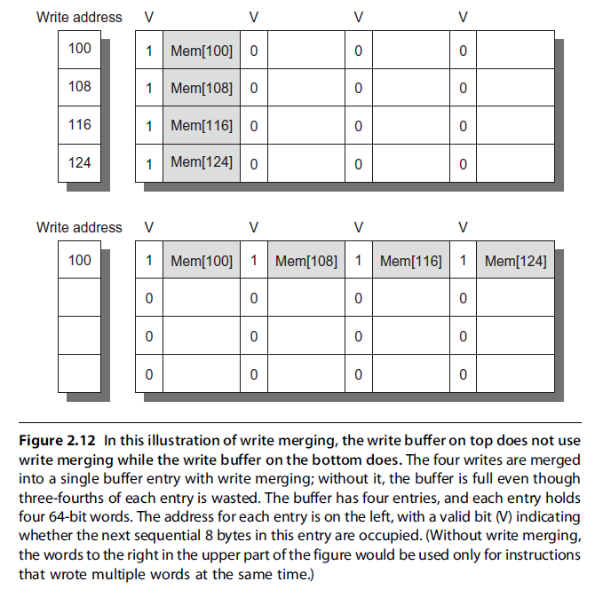{ width="600" }
</figure>

注意，输入/输出设备寄存器经常被映射到物理地址空间。由于 I/O 寄存器是分享的，不能像存储器中的字数组那样操作，所以这些地址不能允许写合并。例如，它们可能要求为每个 I/O 寄存器提供一个地址和一个数据字，而不能只提供一个地址进行多字写入。为了实现这些副作用，通常由缓存将这些页面进行标记，表明其需要采用非合并直写方式

!!! tip "AI 解释"

    **问题背景**

    如果多次写入同一缓存行（或相邻地址），每次单独写入主存效率低下。例如：连续写入 A[0]、A[1]、A[2]，若分 3 次写主存，带宽利用率低
    
    目标：合并多次写入，减少主存访问次数

    ---

    **工作流程**

    1. 写入缓冲区非满
          1. 处理器写入数据到写缓冲区，立即继续执行
          2. 如果新写入的地址与缓冲区中某条目地址连续/属于同一块，则合并数据（而非新增条目）。例如：缓冲区已有 `[A0, A1]`，新写入 `A2` → 合并为 `[A0, A1, A2]`。若写入 `B0`（不连续），则新增条目
    2. 写入缓冲区满
          1. 若缓冲区已满且无法合并，处理器必须等待缓冲区腾出空间
          2. 主存控制器会批量写入合并后的数据（如一次写入 64 字节而非多次写入 4 字节）

#### 3.3.5 Victim Caches

**受害者缓存**

Victim Cache 是一种辅助缓存结构，用于减少冲突缺失（Conflict Misses）和提高缓存命中率，尤其在直接映射（Direct-Mapped）或低相联度（Low Associativity）缓存中效果显著。其核心思想是临时保存被替换出的缓存行，为后续访问提供二次机会

基本工作原理：

1. 主缓存（如 L1）在发生缓存替换时，被替换出的缓存行（称为“受害者”）不直接丢弃，而是暂存到 Victim Cache 中
2. 当主缓存未命中时，优先检查 Victim Cache：
      1. 若命中，则将数据移回主缓存，避免访问下级存储（如 L2 或主存）
      2. 若未命中，再访问下级存储

!!! question "为什么需要 Victim Cache"

    1. 直接映射缓存的缺陷：同一索引的多个地址会互相冲突（如地址 A 和 B 映射到同一缓存行，交替访问会导致频繁替换）
    2. 低相联度缓存的局限性：组相联缓存（如 2-way/4-way）仍可能因冲突导致缺失
    3. Victim Cache 的作用：作为“逃生舱”，保存最近被替换的块，缓解冲突缺失

典型架构：

1. 位置：通常位于 L1 缓存和 L2 缓存之间（或集成在L1中）
2. 容量：较小（如 4-16 条目），全相联（Fully Associative）设计，避免额外索引开销
3. 替换策略：LRU（最近最少使用）或 FIFO

### 3.4 Reduce the miss rate

#### 3.4.1 Where misses come from

1. compulsory miss（强制性缺失）：数据首次被访问时，必然不在缓存中
2. capacity miss（容量缺失）：缓存容量不足，无法容纳所有活跃数据块
3. conflict miss（冲突缺失）：多个地址映射到同一缓存组（如直接映射缓存中地址 A 和 B 索引相同）
4. coherence miss（一致性缺失）：多核系统中，其他核心修改共享数据导致本地缓存块失效

我们无法很大程度上减少 capacity miss 除非把 cache 做的很大。但是我们可以通过很多种方法减少 conflict misses 和 compulsory misses

1. 增大 block size：
      1. 减少 compulsory miss
      2. 增加 capacity miss：固定缓存容量，块越大，总块数越少
2. 增大 cache size：
      1. 显著减少 capacity miss
      2. 间接减少 conflict miss
3. 提高 associativity：
      1. 轻微减少 capacity miss
      2. 显著减少 conflict miss

#### 3.4.2 Larger Block Size

**to reduce miss rate**

**增大块大小以降低缺失率**

通过充分利用 spatial locality 降低 compulsory miss

较大的块也会增加 miss penalty。固定缓存容量，块越大，总块数越少，因此可能会增加 conflict miss

如果缓存很小，还会增加 capacity miss

<figure markdown="span">
    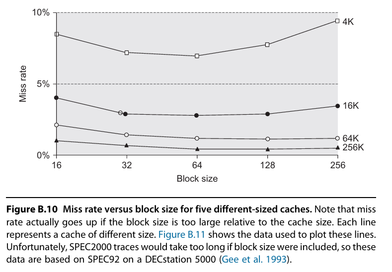{ width="600" }
</figure>

<figure markdown="span">
    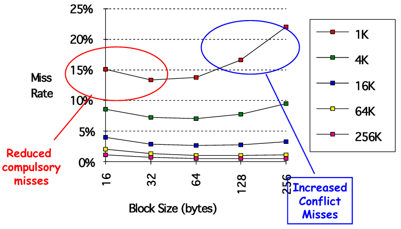{ width="600" }
</figure>

<figure markdown="span">
    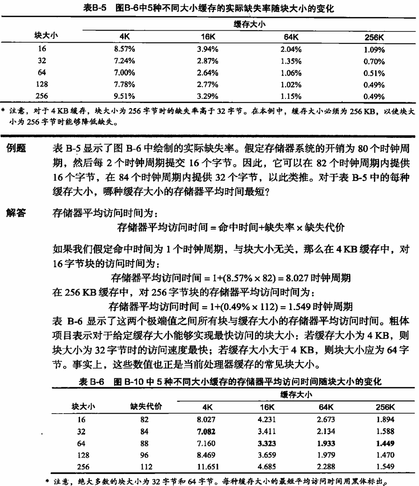{ width="600" }
</figure>

#### 3.4.3 Larger Caches

**to reduce miss rate**

**增大缓存以降低缺失率**

降低 capacity miss

但会增加命中时间、增加成本和功耗

#### 3.4.4 Higher Associativity

**to reduce miss rate**

**提高相联度以降低缺失率**

显著减少 conflict miss

2:1 cache rule of thumb（缓存经验规律）：大小为 $N$ 的直接映射缓存与大小为 $\dfrac{N}{2}$ 的两路组相联缓存具有大体相同的缺失率

<figure markdown="span">
    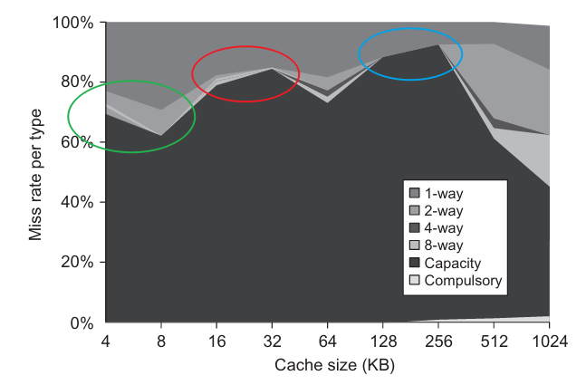{ width="600" }
</figure>

增大相联度可能会延长命中时间

<figure markdown="span">
    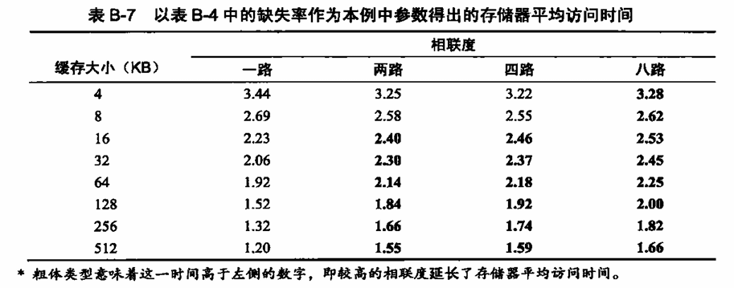{ width="600" }
</figure>

#### 3.4.5 Way Prediction and Pseudo-Associative Cache

**路预测与伪相联缓存**

路预测：

1. 减少 conflict miss：预测成功时，快速命中目标数据，避免因串行比较导致的流水线停顿
2. 间接优化 capacity miss：更快的访问允许缓存更高效地服务请求，减少因延迟导致的替换

---

Pseudo-Associative Cache（伪相联缓存）：

核心思想：

1. 结合直接映射缓存（Direct-Mapped） 的低延迟和 组相联缓存 的低冲突缺失特性
2. 首次访问按直接映射处理，若缺失则触发“二次查找”（类似组相联）

工作原理：

1. 首次访问（直接映射）：
      1. 数据仅映射到唯一位置（如 Index = Address % Cache_Size）
      2. 若命中，访问结束（延迟与直接映射相同）
2. 首次缺失时二次查找（组相联）：
      1. 检查同一 Set 的另一位置（如通过哈希函数生成备用 Index）
      2. 若二次查找命中，数据被返回并可能交换到主位置（优化后续访问）
3. 替换策略：二次查找仍缺失时，按 LRU 等策略替换

对缺失率的影响：

1. 显著减少 conflict miss：直接映射的冲突可通过二次查找缓解（类似 2 路组相联）
2. 保持低延迟：多数情况下（首次命中）维持直接映射的速度

#### 3.4.6 Compiler Optimizations

**to reduce miss rate**

**采用编译器优化以降低缺失率**

##### Merging Arrays

**合并数组**

合并数组指的是将多个独立的数组合并为一个复合数组，或者将多个数据结构字段重新组织为数组结构

提高 spatial locality

**1.Array Packing**（数组打包）

```c linenums="1"
// 合并前
float x[N], y[N], z[N];

// 合并后
struct Point { float x, y, z; };
Point points[N];
```

**2.结构体数组转换**（AoS → SoA）

将"结构体数组"（Array of Structures）转换为"数组结构体"（Structure of Arrays）

```c linenums="1"
// AoS 形式（Array of Structures）
struct Particle {
    float x, y, z;
    float vx, vy, vz;
};
Particle particles[N];

// SoA 形式（Structure of Arrays）
struct Particles {
    float x[N], y[N], z[N];
    float vx[N], vy[N], vz[N];
};
```

##### Loop Interchange

**循环交换**

一些程序中存在嵌套循环，它们会以非连续顺序访问存储器中的数据。只要交换一下这些循环的嵌套顺序，就可能使程序代码按照数据的存储顺序来访问它们。如果缓存中无法容纳这些数组，这一技术可以通过提高空间局域性来减少缺失；通过重新排序，可以使缓存块中的数据在被替换之前，得到最大限度的充分利用。例如，设x是一个大小为 [5000, 100] 的两维数据，其分配方式使得 `x[1, j]` 和 `x[i, j + 1]` 相邻(由于这个数组是按行进行排列的，所以我们说这种顺序是以行为主的)，以下两段代码说明可以怎样来优化访问过程:

<div class="grid" markdown>

```c linenums="1" title="优化前"
for (j = 0; j < 100; j++) {
    for (i = 0; i < 5000; i++) {
        x[i][j] = 2 * x[i][j];
    }
}
```

```c linenums="1" title="优化后"
for (i = 0; i < 5000; i++) {
    for (j = 0; j < 100; j++) {
        x[i][j] = 2 * x[i][j];
    }
}
```

</div>

原代码以 100 个字的步幅跳跃式浏览存储器，而修改后的版本在访问了个缓存块中的所有字之后才进人下一个块。这一优化方法提高了缓存性能，却没有影响到所执行的指令数目

##### Loop Fusion

**循环融合**

循环融合是一种编译器优化技术，它将多个相邻的、具有相同迭代空间的循环合并为单个循环，以减少循环开销和提高数据局部性

<div class="grid" markdown>

```c linenums="1" title="融合前"
// 第一个循环
for (int i = 0; i < N; i++) {
    a[i] = b[i] + c[i];
}

// 第二个循环
for (int i = 0; i < N; i++) {
    d[i] = a[i] * e[i];
}
```

```c linenums="1" title="融合后"
for (int i = 0; i < N; i++) {
    a[i] = b[i] + c[i];
    d[i] = a[i] * e[i];
}
```

</div>

##### Blocking

**分块**

分块技术将大型数据结构或循环迭代空间划分为较小的块（tile），使得每个块能够完全装入 CPU 缓存中。这样可以在处理完一个块的所有数据后，再移动到下一个块，而不是按照原始顺序遍历整个数据结构

当程序访问的数据无法在缓存中找到（缓存未命中）时，必须从主内存加载，这会显著降低性能。分块技术通过确保数据在被重复使用前保留在缓存中，减少了缓存未命中的次数

矩阵乘法：

```c linenums="1" title="无分块"
for (i = 0; i < N; i++) {
    for (j = 0; j < N; j++) {
        for (k = 0; k < N; k++) {
            C[i][j] += A[i][k] * B[k][j];
        }
    }
}
```

```c linenums="1" title="分块优化"
#define BLOCK_SIZE 32

for (ii = 0; ii < N; ii += BLOCK_SIZE) {
    for (jj = 0; jj < N; jj += BLOCK_SIZE) {
        for (kk = 0; kk < N; kk += BLOCK_SIZE) {
            // 处理一个块
            for (i = ii; i < ii + BLOCK_SIZE; i++) {
                for (j = jj; j < jj + BLOCK_SIZE; j++) {
                    for (k = kk; k < kk + BLOCK_SIZE; k++) {
                        C[i][j] += A[i][k] * B[k][j];
                    }
                }
            }
        }
    }
}
```

### 3.5 Reduce the miss penalty and miss rate via parallelism

#### 3.5.1 Hardware Prefetching of Instructions and Data

**to reduce miss penalty or miss rate**

**对指令和数据进行硬件预取，以降低缺失代价或缺失率**

处理器通过监测当前的内存访问模式，预测接下来可能会被访问的内存地址，并在这些数据被实际请求之前，自动将它们从主存预取到缓存中

硬件预取是一种空间换时间的优化

1. 降低 miss penalty
      - 传统情况：当发生缓存缺失时，处理器必须等待数据从慢速的主存加载，造成流水线停顿（stall）
      - 使用预取：所需数据已经被提前加载到缓存中，缺失时可直接从缓存获取，避免等待主存访问
2. 降低 miss rate
      - 传统情况：首次访问新数据必然导致缓存缺失
      - 使用预取：在程序实际需要数据前已经将其加载到缓存，使得"首次访问"变成缓存命中

预取技术依赖于存在可用的额外内存带宽，且不会因占用带宽造成性能损失

#### 3.5.2 Compiler-Controlled Prefetching 

**to reduce miss penalty or miss rate**

**用编译器控制预取，以降低缺失代价或缺失率**

编译器通过分析程序的内存访问模式，在适当位置插入预取指令，提前获取数据，在实际使用数据前启动加载操作

- register prefetch：将数据加载到寄存器
- cache prefetch：将数据加载到缓存

两种类型：

1. 绑定预取（binding prefetch）：类似普通加载指令，但需严格保证地址有效性，否则会触发异常
2. 非绑定预取（non-binding prefetch）：安全推测，即使地址无效也不会报错

不过，发出预取指令会导致指令开销，所以编译器必须非常小心地确保这些开销不会超过所得到的好处。如果程序能够将注意力放在那些可能导致缓存缺失的引用上，就可以避免不必要的预取操作，同时明显缩短存储器平均访问时间

<figure markdown="span">
    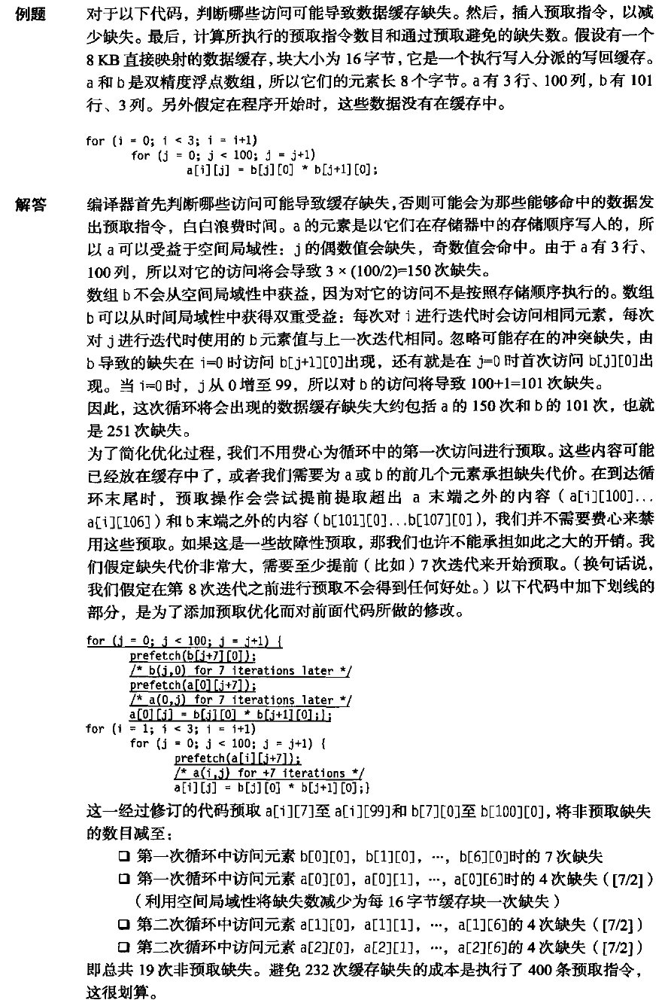{ width="600" }
</figure>

---

<figure markdown="span">
    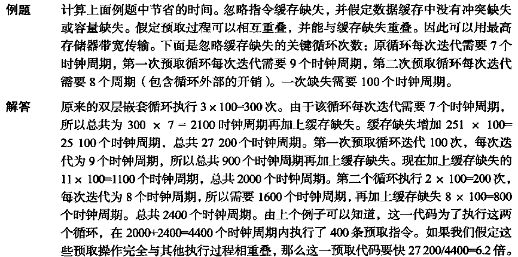{ width="600" }
</figure>

## 4 Memory Technology

main memory（主存储器）是存储层次结构中的下一层，通常由 DRAM 构成，而 cache 则使用 SRAM

main memory performance：

1. latency（延迟）：指从请求数据到数据到达的时间
      1. 降低延迟较为困难，但对缓存至关重要
2. bandwidth（带宽）：指单位时间内传输的数据量
      1. 通过新的组织结构更容易提升带宽
      2. 对 I/O（输入/输出）非常重要
      3. 对于具有二级缓存和更大块大小的缓存也很重要

<div markdown>

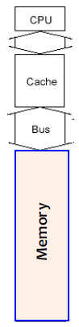{ width="75", align=right }

<div markdown>

一级缓存通常以 1 个字的物理宽度进行组织，因为大多数 CPU 访问的字长就是如此

假设：

1. 发送地址需要 4 个时钟周期
2. 每个字的访问时间为 56 个时钟周期
3. 发送 1 个字的数据需要 4 个时钟周期
4. 块大小为 4 个字
5. 每个字为 8 字节

miss penalty：$4 \times (4 + 56 + 4) = 256\ cycles$<br/>
bandwidth：$\dfrac{4 \times 8}{256} = \dfrac{1}{8}\ bytes/cycle$

</div>
</div>

### 4.1 Higher Bandwidth

#### 4.1.1 Wider Main Memory

**更宽的主存储器**

阿姆达尔定律（Amdahl's law）指出，内存容量应与 CPU 速度线性增长。为满足需求，内存容量每三年增长四倍。然而，CPU 与 DRAM 之间的性能差距是一个问题，DRAM 的性能每年仅提升约 5%

原理：将缓存和主存储器的宽度加倍或四倍化

1. 宽度定义：指内存和缓存一次可并行传输的数据位数（如 64 位 → 128 位或 256 位）
2. 带宽提升：通过增加宽度，单位时间内可传输更多数据（带宽 = 宽度 × 频率），从而直接缓解性能瓶颈

<figure markdown="span">
    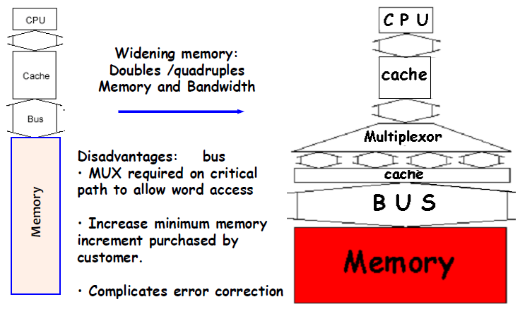{ width="600" }
</figure>

#### 4.1.2 Simpler Interleaved Memory

**简单交错存储**

1. 内存芯片可以组织成多个存储体（bank），以支持同时读写多个字
2. 存储体通常为 1 字宽，因此无需改变总线和缓存的宽度
3. 向多个存储体发送地址，使它们能够同时读取数据

<figure markdown="span">
    { width="400" }
</figure>

内存被划分为多个独立的存储体（如 Bank 0-3），每个存储体可并行操作

<figure markdown="span">
    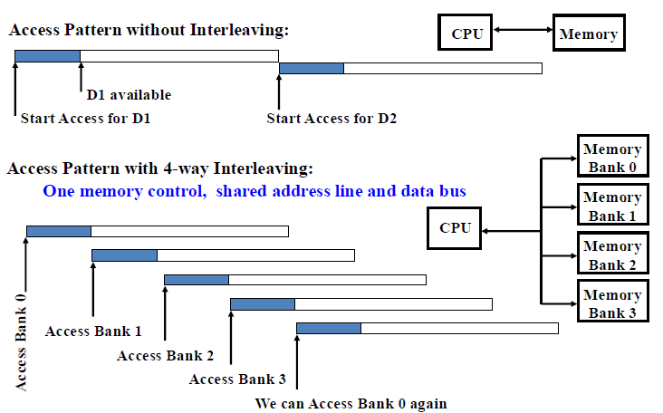{ width="600" }
</figure>

#### 4.1.3 Independent Memory Banks

**独立存储体**

存储体数量 ≥ 访问单个存储体中一个字所需的时钟周期数

独立存储体：交错存储的概念可以进一步扩展，以消除对内存访问的所有限制

1. 每个存储体都有独立的存储控制器
2. 使用独立的地址线和数据总线
3. 这使得顺序访问模式可以交错进行

#### 4.1.4 Avoiding Memory Bank Conflicts

**避免存储体冲突**

在交错存储（interleaved memory）系统中，数据按顺序分布到多个存储体（如 128 个）中。当多个请求同时访问同一个存储体时，会发生存储体冲突，导致并行性下降，性能降低

假设：内存系统包含 128 个存储体（banks），按字（word）为单位交错存储。执行以下代码

```c linenums="1"
int x[256][512];

for (j = 0; j < 512; j = j+1)  
    for (i = 0; i < 256; i = i+1)  
        x[i][j] = 2 * x[i][j];  
```

数组 `x[256][512]` 在内存中是按行优先（row-major）存储的，即 `x[0][0]`、`x[0][1]`...`x[0][511]`、`x[1][0]`...的顺序

此代码的访问顺序：`x[0][0]`, `x[1][0]`, ..., `x[255][0]`, `x[0][1]`, `x[1][1]`, ..., `x[255][511]`

而由于存储体按字交错，`x[i][j]` 的存储体编号通常由地址的低位决定（如 `address % 128`）。数组的每一行（`x[i]`）的起始地址是连续的，且存储体数量（128）与行数（256）有公约数（如 128 是 256 的约数），则内层循环的连续访问（`x[0][j]`, `x[1][j]`, ...）会以固定间隔（如间隔 128）访问存储体，导致所有访问集中在少数存储体上，引发冲突

- 若 `x[0][0]` 在 Bank 0，则 `x[128][0]` 也会在 Bank 0（假设地址间隔为 128 字）
- 这样，`x[i][0]` 和 `x[i+128][0]` 会访问同一存储体，无法并行

**解决方案：**

1. 软件方案（编译器优化）
      1. 循环交换优化（Loop interchange）：调整循环顺序，避免重复访问同一存储体
      2. 调整数组大小：程序员或编译器可以扩展数组的维度，使其不是 2 的幂次（如将 512 改为 513），从而强制将地址分配到不同的存储体
2. 硬件方案：使用质数个存储体：采用 $2^n - 1$ 或 $2^n + 1$ 形式的质数（如 127 或 129 而非 128），减少地址映射的规律性冲突

### 4.2 DRAM and SRAM

- 主存储器采用 DRAM：需要大容量，因此必须保持低成本
- CPU 缓存采用 SRAM：需要高速访问，因此成本更高，受资源限制通常容量较小

相对性能比较：

- 容量：DRAM 是 SRAM 的 4-8 倍
- 成本/周期时间：SRAM 比 DRAM 快 8-16 倍，但也贵 8-16 倍

主存储器 DRAM 的特性：

1. 动态随机存取存储器（Dynamic Random Access Memory）
2. "动态"特性：需要周期性刷新（每 8 毫秒刷新一次，占用约 1% 的时间）
3. 地址分为两部分（存储器被组织为二维矩阵结构）：
      - RAS（行访问选通信号，Row Access Strobe）
      - CAS（列访问选通信号，Column Access Strobe）

### 4.3 Improving DRAM Performance

#### 4.3.1 Fast Page Mode DRAM

**FPM**

通过利用“页”（同一行上的数据）的概念，在首次访问需要完整的 RAS + CAS 周期后，后续同行的访问只需切换 CAS 列地址。行缓冲器自然保存了整行数据（1024-2048 位），利用了这一空间局部性特性

#### 4.3.2 Synchronous DRAM

**SDRAM**

传统 DRAM 与内存控制器的接口是异步的，每次传输都需要同步开销。解决方案是在 DRAM 接口中添加时钟信号，消除重复传输的同步开销

1. 通过引入时钟信号：使 DRAM 操作与系统时钟同步。消除了传统异步 DRAM 每次传输所需的"握手"同步开销
2. 采用突发（burst）传输模式：单次地址指定后连续输出多个数据（如 4/8 个连续数据）。每个时钟周期传输一次数据

#### 4.3.3 Double Data Rate

**DDR**

“双沿触发”技术：在时钟信号的上升沿和下降沿都进行数据传输。相比单数据速率（SDR）SDRAM，在相同时钟频率下带宽翻倍

#### 4.3.4 New DRAM Interface

**RAMBUS RDRAM**

1. 架构创新：
      1. 窄总线设计：采用 16 位总线（相比传统 64 位），通过超高时钟频率（400MHz 起步）补偿带宽
      2. 协议基础：采用基于数据包的通信协议，而非传统 DRAM 的直接控制信号
      3. 双沿触发：与 DDR 类似，在时钟上升沿和下降沿都传输数据
2. 性能特性：
      1. 高带宽：通过高频（如 800MHz 有效频率）实现高传输率
      2. 高延迟：由于协议开销和架构设计，访问延迟比传统 DRAM 高
      3. 流水线化：支持深度流水线操作，可隐藏部分延迟

!!! tip "比较 RAMBUS 和 DDR SDRAM"

    RDRAM 虽然实现了超高时钟频率，但由于高延迟抵消了部分带宽优势、高延迟抵消了部分带宽优势、高延迟抵消了部分带宽优势，没能主导市场

    DDR 的成功在于更平衡的设计：合理提升频率、保持较低延迟、延续传统架构降低成本
    
    在内存技术发展中，整体系统效能比单一指标的最大化更为重要

## 5 Virtual Memory

1. 允许程序执行的存储技术，使得程序可以：
      1. 存放在不连续的物理内存位置
      2. 无需全部常驻内存即可运行
2. 让计算机能够“欺骗”程序，使其认为：
      1. 内存空间是连续的
      2. 可用内存空间大于实际物理内存，创造超大内存的假象

重要性：

1. 经济性：无需购买大量物理 RAM
2. 便利性：免除程序员手动管理内存资源的负担
3. 功能性：支持多道程序、分时系统和内存保护机制

优势：

1. 主存（物理内存）可作为二级存储（磁盘）的高速缓存
2. 创造“更大且连续的物理内存”的假象
3. 通过“页”或“段”实现程序重定位
4. 支持多道程序的内存保护

<figure markdown="span">
    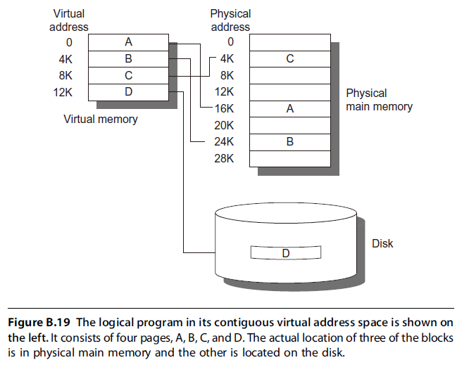{ width="600" }
</figure>

1. virtual address（虚拟地址）：程序员使用的内存地址
2. virtual address space（虚拟地址空间）：所有虚拟地址的集合
3. memory address（物理地址）：实际内存中的字地址

虚拟内存的术语：

1. block → page / segment
2. miss → page fault / address fault

有了虚拟存储器，处理器会给出 virtual address，由软硬件组合方式转换为 physical address（物理地址），再来访问主存储器。这一过程称为 memory mapping / address translation。由虚拟地址控制的两级存储器层次结构为 DRAm 和磁盘

程序启动过程：

1. 操作系统将程序拷贝到 RAM
2. 如果 RAM 不足，OS 停止完整拷贝，仅加载部分程序到 RAM 就开始运行
3. 当程序访问未加载到物理内存的部分时，OS 将该部分从磁盘拷贝到 RAM
4. 为了腾出空间，OS 必须驱逐 RAM 中已有的程序部分
5. 被驱逐的页面如果是“脏页”（即被修改过），OS 会将其写回磁盘

<figure markdown="span">
    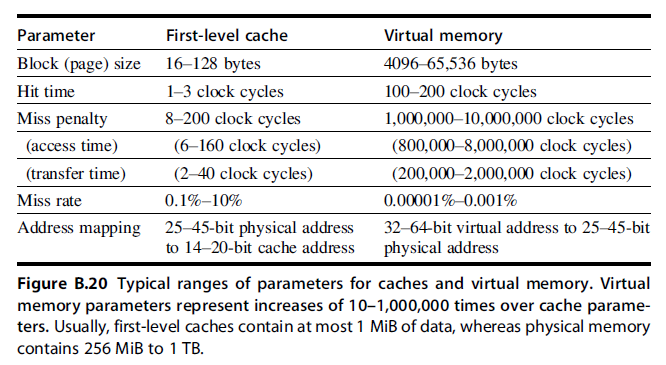{ width="600" }
</figure>

1. page：采用大小固定的块
2. segment：采用大小可变的块

<figure markdown="span">
    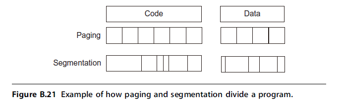{ width="600" }
</figure>

<figure markdown="span">
    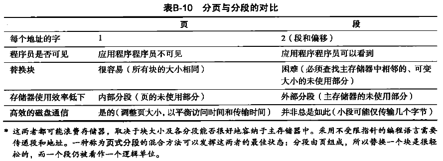{ width="600" }
</figure>

### 5.1 再谈存储器层次结构的 4 个问题

#### 5.1.1 Block Placement

**一个块可以放在主存储器的什么位置**

虚拟存储器的缺失代价涉及旋转磁存储设备的访问，因此非常高。如果在较低缺失率与较简单放置算法之间进行选择，操作系统设计人员通常选择较低缺失率，因为其缺失代价可能会高得离谱。因此，操作系统允许将块放在主存储器中的任意位置。即 **全相联策略**（fully associative）

#### 5.1.2 Block Identification

**如果一个块在主存储器中，如何找到它**

分页和分段都依靠一种按页号或段号索引的数据结构。这种数据结构包含块的物理地址。对于分段方式，会将偏移量加到段的物理地址中，以获得最终物理地址。对于分页方式，该偏移量只是被串接到这一物理分布地址

<figure markdown="span">
    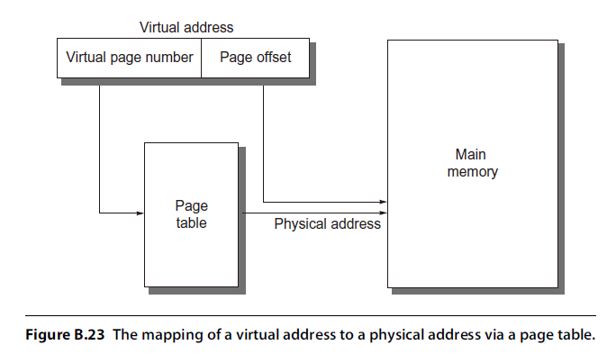{ width="600" }
</figure>

!!! tip "计算 page table 的大小"

    假设：
    
    1. 虚拟地址位数：32 位（地址空间 4GB）
    2. 页大小：4KB
    3. 页表项大小：4 字节

    总页数：$\dfrac{虚拟地址大小}{页大小} = \dfrac{2^{32}}{2^{12}} = 2^{20}$

    page table 大小：$总页数 \times 页表项大小 = 2^{20} \times 2^2 = 2^{22}$

为了缩小这一数据结构，一些计算机向虚拟地址应用了一种散列功能。这种散列允许数据结构的长度等于主存储器中物理页的数目。这一数目可以远小于虚拟页的数目。这种结构被称为 inverted page table（反转分页表）。利用前面的例子，一个 512MB 的物理存储器可能只需要 1MB（8x512 MB/4KB）的反转分页表；每个页表项另外需要 4 字节，用于表示虚拟地址

为了缩短地址转换时间，计算机使用一个专门进行这些地址变换的缓存，称为 translation lookaside buffer（变换旁视缓冲区），或者简称为 translation
buffer（变换缓冲区）

#### 5.1.3 Block Placement

**在虚拟存储器缺失时应当替换哪个块**

前面曾经提到，操作系统的最高指导原则是将页错误降至最低。几乎所有操作系统都与这一指导原则保持一致，尝试替换最近使用最少（LRU）的块，这是因为如果用过去的信息来预测未来，将来用到这种块的可能性最低

为了帮助操作系统评估 LRU，许多处理器提供了一个 use bit（使用位）或 reference bit（参考位），从逻辑上来说，只要访问一个页，就应对其进行置位（为了减少工作，通过仅在发生转换缓冲区缺失时对其进行置位）。操作系统定期对这些使用位清零，之后再记录它们，以判断在一个特定时间段时使用了哪些页。通过这种方式进行跟踪，操作系统可以选择最近引用最少的一个页

#### 5.1.4 Write Strategy

**在写入时发生什么**

主存储器的下一级包含旋转磁盘，其访问会耗时数百万个时钟周期。因此总是采用 write back 策略。由于对低一级的非必需访问会带来如此之高的成本，所以虚拟存储器系统通常会包含一个 dirty bit（重写位）。利用这一重写位，可以仅将上次读取磁盘之后经过修改的块写至磁盘

### 5.2 Techniques for Fast Address Translation

分页表通常很大，从而存储在主存储器中，有时它们本身就是分页的。分页意味着每次存储器访问在逻辑上至少要分两次进行，第一次存储器访问是为了获得物理地址，第二次访问是为了获得数据。第2章曾经提到，我们使用局域性来避免增加存储器访问次数。将地址变换局限在一个特殊缓存中，存储器访问就很少再需要第二次访问来转换数据。这一特殊地址变换缓存被称为变换旁视缓冲区（translation look aside buffer，TLB），有时也称为变换缓冲区（translation buffer，TB）

TLB 项就像是一个缓存项目，其中的标志保存了虚拟地址部分，数据部分保存了特殊页编号、保护字段、有效位，通常还有一个使用位和重写位。要改变页表中某一项的特殊页帧编号或保护字段，操作系统必须确保旧项不在 TLB 中；否则，系统就不能正常运行。注意，这个重写位意昧着对应页曾被改写过，而不是指 TLB  中的地址变换或数据缓存中的特殊块经过改写。操作系统通过改变页表中的值，然后再使相应 TLB 项失效来重置这些位。在从分页表中重新加载该项时，TLB 会获得这些位的准确副本

<figure markdown="span">
    { width="600" }
</figure>

### 5.3 Selecting a Page Size

最显而易见的体系结构参数是页大小。页大小的选择实际就是在偏向较大页与偏向较小页的力量之间进行平衡的问题。以下因素偏向较大尺寸

1. 页表的大小与页大小成反比，因此，增大页的大小可以节省存储器（或其他用于存储器映射的资源）
2. 分页较大时，可以允许缓存命中时间较短的较大缓存
3. 与传递较小页相比，从（向）辅助存储传递较大页（有可能通过网络）的效率更高一些
4. TLB 项目的数量受限，所以分页较大意味着可以高效地映射更多存储器，从而可以降低 TLB 缺失数量

由于最后这个原因，近来的微处理器决定支持多种页大小；对于一些程序，TLB 缺失对 CPI 的重要性可能与缓存缺失相同

采用较小分页的主要动机是节省存储。当虚拟内存的相邻区域不等于页大小的整数倍时，采用较小页可以减少存储的浪费空间。页面中这种未使用存储器的术语名称为 internal fragmentation（内部碎片）。假定每个进程有三个主要段（文本、堆和栈），每个进程的平均浪费存储量为页大小的 1.5 倍。对于有数百 M 存储器、页大小为 4KB 至 8KB 的计算机来说，这点数量是可以忽略的。当然，当页大小非常大（超过 32KB）时，那就可能浪费存储（主存储器和辅助存储器）和 IO 带宽了。最后一项关注是进程启动时间；许多进程都很小，较大的页面可能会延长调用一个进程的时间

### 5.4 Summary of Virtual Memory and Caches

<figure markdown="span">
    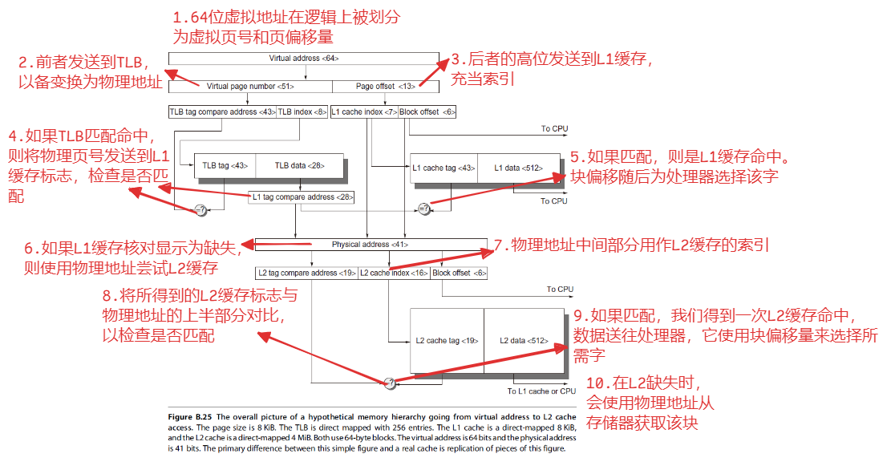{ width="800" }
</figure>

## 6 Protection and Examples of Virtual Memory

**虚拟存储器的保护与示例**

在多重编程中，计算机由几个并行执行的程序共享，它的发明为程序之间的保护和共享提供了新的要求。这些要求与今天计算机中的拟存储器紧密捆绑在一起，所以我们在这里用两个虚拟存储器的示例来介绍这一主题

多重编程导致了 process（进程）概念的出现。打个比方，进程就是程序呼吸的空气和生活的空间即一个正在运行的程序加上持续运行它所需要的所有状态。时分共享是多重编程的一种变体，由儿个同时进行交互的用户来共享处理器和存储器，给人的感觉是所有用户都拥有自己的计算机。因此，它在任何时刻都必须能够从一个进程切换到另一进程。这种交换被称为 process switch（进程切换）或 context switch（上下文切换）

一个进程无论是从头到尾持续执行，还是被反复中断，与其他进程进行切换，其运行都必须正常进行。维护正确进程行为的责任由程序和操作系统的设计者共同分担。计算机设计师必须确保进程状态的处理器部分能够保存和恢复。操作系统设计师必须确保这些进程不会相互干扰对方的计算

保护一个进程的状态免受其他进程损害的最安全方法就是将当前信息复制到磁盘上。但是一次进程切换可能需要几秒的时间 —— 这对时分共享环境来说过长了

这一问题的解决方法是由操作系统对主存储器进行划分，使几个不同进程能够在存储器同时拥有自己的状态。这种划分意味着操作系统设计师需要计算机设计师的帮助，以提供保护使一个进程无法修改其他进程。除了保护之外，计算机还为进程之间共享代码和数据提供了支持，允许进程之间进行通信，或者通过减少相同信息的副本数目来节省存储器

### 6.1 Protecting Processes

**保护进程**

使进程拥有自己的分页表，分别指向存储器的不同页面，这样可以为进程提供保护，避免相互损害。显然，必须防止用户修改它们的分页表，或者以欺骗方式绕过保护措施

根据计算机设计者或购买者的理解，可以逐步升高保护级别。向处理器保护结构中加入 rings（环），可以将存储器访问保护扩展到远远超出最初的两级（用户级和内核级）。就像军用分类系统将信息划分为绝密、机密、秘密和非涉密相似，安全级别的同心环状结构可以让最受信任的人访问所有信息，第二受信任的人访问除最内层级别之外的所有信息，以此类推。“民用”程序是可信度最低的，因此对访问范围的限制也最多。关于存储器中可能包含代码的部分也有一些限制（执行保护），甚至对级别之间的入口点也要提供保护

当设计者因为深入理解而加重安全恐惧时，这些简单的环可能就不够了。要限制程序在内层保密位置的自由度，需要采用一种新的分类系统。除了军用模型之外，还可以将这一系统比作钥匙和锁：没有钥匙的程序是不能对数据访问进行解锁的。为使这些钥匙（或者说能力）发挥作用，硬件和操作系统必须能够明确地在程序之间传送它们，而不允许程序自行伪造它们。为缩短钥匙核对时间，需要为这一核对机制提供大量硬件支持

#### 6.1.1 Protecting with Base and Bounds

使用一对寄存器定义地址范围，检查所有内存访问请求。每次内存引用必须落在基址和界限寄存器指定的地址区间内

有效性判定公式：$base \leqslant address \leqslant bound$

寄存器权限控制：

1. 用户进程无权修改这些寄存器
2. 操作系统在进程切换时必须能更新寄存器值

计算机设计者为支持操作系统进程保护需提供的三项核心功能：

1. 提供至少两种执行模式
      1. 区分当前运行的是用户进程还是操作系统进程
      2. 后者称为内核（kernel）进程、监管（supervisor）进程或执行（executive）进程
2. 提供 CPU 状态保护机制
      1. 允许用户进程读取但不可修改的关键状态包括：
          1. 基址/界限寄存器
          2. 用户/监管模式位
          3. 异常启用/禁用位
      2. 必须阻止用户进程写入这些状态
3. 提供 CPU 在用户模式与监管模式（内核模式）之间切换的机制
      1. 用户态 → 内核态：通常通过系统调用实现，由特殊指令将控制权转移到内核空间的特定位置。保存系统调用时的程序计数器（PC）值。CPU 切换至监管模式
      2. 内核态 → 用户态：类似子程序返回的方式恢复之前的用户/监管模式状态

#### 6.1.2 Fine-grained Protecting

**细粒度保护**

虚拟内存提供更精细的内存保护机制：

1. CPU 地址需从虚拟地址映射到物理地址
2. 该映射过程使硬件能够检测程序错误或实现进程间隔离保护

实现方式：

1. 为每个页或段添加权限标志位：现代程序很少需要修改自身代码，操作系统可通过只读保护检测代码段的意外写入
2. 可扩展页级保护，通过用户/内核模式保护阻止用户程序访问内核专属页面

#### 6.1.3 Page tables Protecting

**页表保护机制**

1. 每个进程拥有独立的页表，指向不同的物理内存页，实现进程间隔离
2. 必须阻止用户程序修改自身页表，否则保护机制将失效

#### 6.1.4 Rings Protecting

**环形保护机制**

1. 在 CPU 保护结构中引入多级安全环（Rings），将内存访问保护从两级（用户/内核）扩展到多级
2. 安全等级示例：绝密 → 机密 → 保密 → 非密
3. 同心圆安全环设计允许：
      1. 最高信任级别可访问所有层级
      2. 次高信任级别可访问除最内层外的所有层级
      3. 普通程序（"民用程序"）信任度最低，访问权限最受限

#### 6.1.5 Key Protecting

**密钥保护机制**

需要对内部安全区域实施新的分类系统来限制程序自由度

密钥与锁机制：

1. 程序必须拥有密钥才能解锁数据访问权限
2. 为使这些密钥（或称能力）有效，硬件和操作系统必须能够显式地在程序间传递密钥