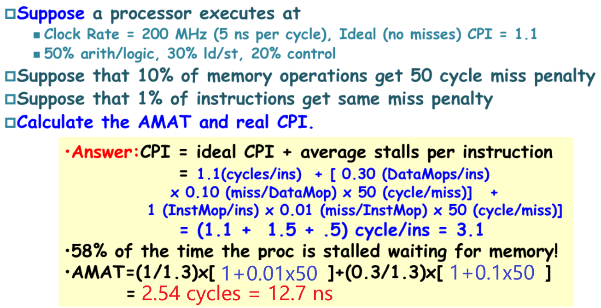

# 3 Memory Hierarchy Design

!!! tip "说明"

    本文档正在更新中……

!!! info "说明"

    1. 本文档仅涉及部分内容，仅可用于复习重点知识
    2. 本文档内容对应课本 Chapter 2 和 Appendix B

## 3.1 引言

memory hierarchy（存储器层次结构）：

principle of locality of reference（局部性原理）：程序在任意时刻通常只访问地址空间的一小部分。为了提高访问速度，可以将最近访问的数据项保存在快速存储器中。这通常通过使用缓存（cache）来实现，缓存是一种小而快速的存储器，用于存储最近或频繁访问的数据，以减少访问较慢的主存储器的次数
      1. temporal locality（时间局部性）：最近访问过的数据很可能在不久的将来再次被访问
      2. spatial locality（空间局部性）：如果一个数据被访问，那么它附近的数据也可能很快被访问

### 3.1.1 4 个存储器层次结构问题

如果处理器需要的数据存放在高层存储器中的某个块中，则称为一次 **命中**（hit）。如果在高层存储器中没有找到所需的数据，这次数据请求则称为一次 **缺失**（miss）。随后访问低层存储器来寻找包含所需数据的那一块。**命中率**（hit rate），或命中比率（hit ratio），是在高层存储器中找到数据的存储访问比例，通常被当成存储器层次结构性能的一个衡量标准。**缺失率**（miss rate）（1－命中率）则是数据在高层存储器中没有找到的存储访问比例

追求高性能是我们使用存储器层次结构的主要目的，因而命中和缺失的执行时间就显得尤为重要。**命中时间**（hit time）是指访问存储器层次结构中的高层存储器所需要的时间，包括了判断当前访问是命中还是缺失所需的时间。**缺失代价**（miss penalty）是将相应的块从低层存储器替换到高层存储器中，以及将该信息块传送给处理器的时间之和，由于较高存储层次容量较小并且使用了快速的存储器部件，因此比起对存储层次中较低层的访问，命中时间要少得多，这也是缺失代价的主要组成部分

#### Block Placement

**一个块可以放在上一级的什么位置**

在 cache 中为主存中每个字分配一个位置的最简单方法就是根据这个字的主存地址进行分配，这种 cache 结构称为 **直接映射**（direct mapped）。每个主存地址对应到 cache 中一个确定的地址

$$
（块地址） mod （cache 中的块数）
$$

**全相联：**（fully associative） 一个块可以被放置在 cache 中的任何位置

**组相联：**（set associative） 每个块可被放置的位置数是固定的（至少两个）

每个块有 n 个位置可放的 cache 被称作 n 路组相联 cache（n-way set-associative cache）。一个 n 路组相联 cache 由很多个组构成，每个组有 n 块。根据索引域，存储器中的每个块对应到 cache 中唯一的组，并且可以放在这个组中的任何一个位置上

在组相联 cache 中，包含存储块的组是这样给出的：

$(Block\ number) mod (number\ of\ sets\ in\ the\ cache)$ 
$（块号）mod（cache 中的组数）$

<figure markdown="span">
    { width="600" }
</figure>

#### Block Identification

**如果一个块在上一级中，如何找到它**

由于 cache 中每个位置可能对应于主存中多个不同的地址，我们如何知道 cache 中的数据项是否是所请求的字呢？即如何知道所请求的字是否在 cache 中？我们可以在 cache 中增加一组 **标记**（tag），标记中包含了地址信息，这些地址信息可以用来判断 cache 中的字是否就是所请求的字。标记只需包含地址的高位，也就是没有用来检索 cache 的那些位。例如，在上图中，标记位只需使用 5 位地址中的高 2 位，地址低 3 位的索引域则用来选择 cache 中的块

我们还需要一种方法来判断 cache 块中确实没有包含有效信息。例如，当一个处理器启动时，cache 中没有数据，标记域中的值没有意义。甚至在执行了一些指令后，cache 中的一些块依然为空。因此，在 cache 中，这些块的标记应该被忽略。最常用的方法就是增加一个 **有效位**（valid bit）来标识一个块是否含有一个有效地址。如果该位没有被设置，则不能使用该块中的内容

#### Block Replacement

**在缺失时应当替换哪个块**

1. random replacement：随机替换
2. least-recently used（LRU）：最近最少的被替换
3. first in, first out（FIFO）：先进先出法则

#### Write Strategy

**在写入时会发生什么**

当数据写入 cache 时，数据如何写入主存？

1. **write-through**（写直达法）：将数据同时写入主存和 cache 中。但这样会花费大量的时间，一种解决方法是 write-buffer（写缓冲），当一个数据在等待写入主存时，先将它放入写缓冲中
2. **write-back**（写回机制）：新值仅仅被写入 cache 块中，只有当修改过的块被替换时才需要写到较低层次存储结构中
      1. 需要 valid 和 dirty 位
        - dirty bit 用于标记缓存行（cache line）中的数据是否已被修改但尚未写回到主存中
        - 当一个缓存行中的数据被处理器修改时，dirty bit 会被设置为“1”，表示该缓存行中的数据与主存中的数据不一致（即“脏”）
        - 如果 dirty bit 为“0”，则表示缓存行中的数据与主存中的数据一致（即“干净”）
      2. 当某个块需要被替换时，系统会检查 dirty bit
        - 如果 dirty bit 为“1”，则将该缓存行中的数据写回主存，以确保数据一致性
        - 如果 dirty bit 为“0”，则直接丢弃该缓存行，因为主存中已经存在相同的数据

优点：

1. 写直达
      1. 更容易实现
      2. 下一级存储器中拥有数据的最新副本，从而简化了数据一致性
2. 写回
      1. 写入操作的速度与缓存存储器的速度相同
      2. 使用的存储器带宽较少，使写回策略对多处理器更具吸引力
      3. 写回对存储器层次结构其余部分及存储器互连的使用少于直写，节省功耗，对于嵌入式应用极具吸引力

处理器在直写期间必须等待写入操作的完成，则称该处理器处于写入停顿（write stall）状态。减少此停顿的常见优化方法时写入缓冲区（write buffer），但即使有了此缓冲区，write stall 也可能会发生

当发生写入缺失时（cache 里没有处理器要修改的那个数据地址），如何处理？

1. **write allocate**：将目标数据块从主存加载到缓存，随后在缓存中完成写入。适用于后续可能频繁访问该数据块的场景
2. **write around** / **no-write allocate**：不将数据块加载到缓存，直接写入主存

一般搭配：

1. write-back + write-allocate
2. write-through + write-around

<figure markdown="span">
    { width="600" }
</figure>

> 好家伙，计组没搞懂的东西，终于在这里搞懂了

### 3.1.2 缓存架构

1. unified cache（统一缓存）：所有内存请求（包括指令和数据）都通过单一的缓存进行处理
      1. 硬件需求较少，设计相对简单
      2. 由于指令和数据共享同一个缓存，可能导致缓存争用，从而降低命中率
2. spilt I & D cache（分离缓存）：使用独立的缓存分别处理指令和数据。指令缓存（I-Cache）和数据缓存（D-Cache）分开
      1. 可以减少指令和数据之间的争用，提高命中率。指令缓存通常是只读的，这简化了设计
      2. 需要更多的硬件资源

<figure markdown="span">
    { width="600" }
</figure>

## 3.2 Cache Performance

$CPU\ time = (CPU\ execution\ clock\ cycles + Memory\text{-}stall\ clock\ cycles) \times Clock\ cycle\ time$

$Memory\ stall\ cycles = IC\times Mem\ refs\ per\ instruction（每条指令的内存访问次数）\times Miss\ rate\times Miss\ penalty$

$\Rightarrow$

$CPU\ time = IC\times (CPI + \dfrac{MemAccess}{Inst} \times miss\ rate \times miss\ penalty) \times cycle\ time$

$\Rightarrow$

$CPU\ time = IC\times (CPI + \dfrac{MemMisses}{Inst} \times miss\ penalty) \times cycle\ time$

### 3.2.1 AMAT

存储器平均访问时间（average memory access time）

$AMAT = hit\ time + miss\ rate \times miss\ penalty$

$CPU\ time = IC\times (\dfrac{AluOps}{Inst}\times CPI_{AluOps} + \dfrac{MemAccess}{Inst} \times AMAT) \times cycle\ time$

<figure markdown="span">
    { width="600" }
</figure>

---

<figure markdown="span">
    { width="600" }
</figure>

---

<figure markdown="span">
    { width="600" }
</figure>

> 课本原图有误，本文档已修正

---

<figure markdown="span">
    { width="600" }
</figure>

如上例所示，缓存特性可能会对性能产生巨大影响。此外，对于低 CPI、高时钟频率的处理器，缓存缺失会产生双重影响

1. $CPI_{execution}$ 越低，固定数目的缓存缺失时钟周期产生的相对影响越高
2. 在计算 CPI 时，一次缺失的缓存代价是以处理器时钟周期进行计算的。因此，即使两个计算机的存储器层次结构相同，时钟频率较高的处理器在每次缺失时会占用较多的时钟周期，CPI 的存储器部分也相应较高

<figure markdown="span">
    { width="600" }
</figure>

### 3.2.2 miss penalty and Out-of-Order Execution Processors

## 3.3 Optimizations of Cache Performance

### 3.3.1 Small and Simple First-Level Caches

**to reduce hit time and power**

**小而简单的第一级缓存，用以缩短命中时间、降低功率**

### 3.3.2 Way Prediction

**to reduce hie time**

**采用路预测以缩短命中时间**

在路预测技术中，缓存中另外保存了一些位，用于预测下一次缓存访问组中的路或块

在一个缓存的每个块中都添加块预测位。根据这些位选定要在下一次缓存访问中优先尝试哪些块

### 3.3.3 Avoiding Address Translation During Indexing of the Cache

**to reduce hit time**

**避免在索引缓存期间进行地址转换，以缩短命中时间**

