# 4 Instruction-Level Parallelism and Its Exploitation

!!! tip "说明"

    本文档正在更新中……

!!! info "说明"

    1. 本文档仅涉及部分内容，仅可用于复习重点知识
    2. 本文档内容对应课本 Chapter 3 和 Appendix C

    > 针不戳，大部分内容看课本就能看懂了

## 1 Instruction-Level Parallelism: Concepts and Challenges

**指令级并行：概念与挑战**

大约 1985 年之后的所有处理器都使用流水线来重叠指令的执行过程，以提高性能。由于指令可以并行执行，所以指令之间可能实现的这种重叠称为 instruction-level parallelism （指令级并行 ILP）

ILP 大体有两种不同开发方法：

1. 依靠硬件来帮助动态发现和开发并行
2. 依靠软件技术在编译时静态发现并行

pipeline CPI = ideal pipeline CPI + structural stalls + data hazard stalls + control stalls

<figure markdown="span">
    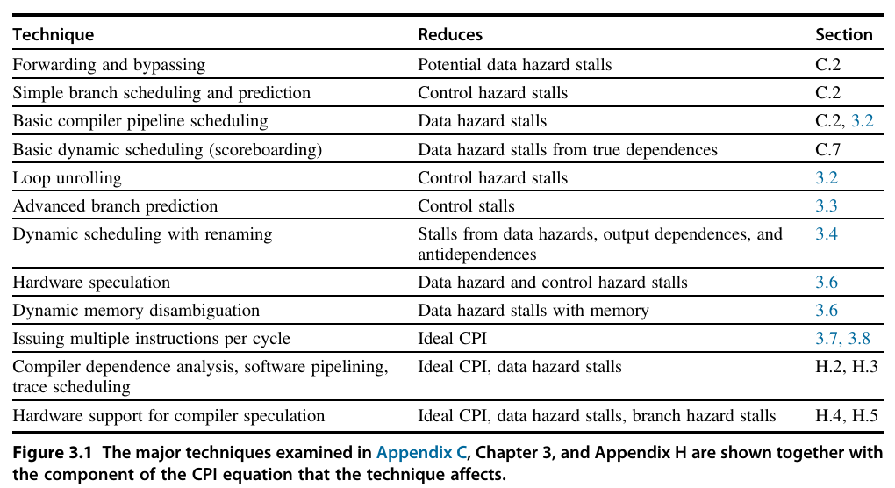{ width="600" }
</figure>

### 1.1 What is Instruction-Level Parallelism

basic block（基本块）：一段顺序执行代码，除入口外没有其他转入分支，除出口外没有其他转出分支

基本块中可以利用的并行数非常有限。对于典型的 MIPS 程序，平均动态分支频率通常介于 15% 到 25% 之间，也就是说在一对分支之间会执行 3~6 条指令。由于这些指令可能相互依赖，所以在基本块中可以开发的重叠数量可能要少于基本块的平均大小。==为了真正地提高性能，我们必须跨越多个基本块开发 ILP==

提高 ILP 的最简单、最常见方法是在循环的各次选代之间开发并行。这种并行经常被称作 loop-level parallelism（循环级并行）。下面是一个简单的循环示例，它对两个分别有 1000 个元素的数组求和，完全可以并行实现：

```c linenums="1"
for (i = 0; i <= 999; i = i + 1) {
    x[i] = x[i] + y[i];
}
```

这个循环的每一次迭代都可以与任意其他选代重叠，当然，在每次循环迭代中进行重叠的机会不大，甚至没有这种机会

### 1.2 Data Dependence and Hazards

共有三种不同类型的相关：

1. data dependences（数据相关），也称 true data dependences（真数据相关）
2. name dependences（名称相关）
3. control dependences（控制相关）

#### 1.2.1 Data Dependence

如果以下任一条件成立，则说指令 j 数据相关于指令 i（An instruction j is data-dependent on instruction i）：

1. 指令 i 生成的结果可能会被指令 j 用到
2. 指令 j 数据相关于指令 k，指令 k 数据相关于指令 i

第二个条件就是说：如果两条指令之间存在第一类型的相关链，那么这两条指令也是相关的。这种相关链可以很长，贯穿整个程序。注意，单条指令内部的相关性（比如 `ADDD R1，R1，R1`）不认为是相关

- 如果 data dependence 导致 stall，则称该 stall 为 RAW hazard

```verilog linenums="1"
i: add r1, r2, r3
j: sub r4, r1, r3
```

Dependences（相关）是 programs（程序）的一种属性。某种给定相关是否会导致检测到实际冒险，这一冒险又是否会实际导致停顿，这都属于流水线结构的性质。这一区别对于理解如何开发指令级并行至关重要

数据相关传递了三点信息：

1. 冒险的可能性
2. 计算结果必须遵循的顺序
3. 可开发并行

#### 1.2.2 Name Dependence

当两条指令使用相同的寄存器或存储器位置（称为 name 名称），但与该名称相关的指令之间并没有数据流动时，就会发生名称相关。在指令 i 和指令 j（按照程序顺序，指令 i 位于指令 j 之前）之间存在两种类型的名称相关

1. 当指令 j 对指令 i 读取的寄存器或存储器位置执行写操作时就会在指令 i 和指令 j 之间发生 antidependence（反相关）。为了确保 i 能读取到正确取值，必须保持原来的顺序
      - 如果 antidependence 导致 stall，则称该 stall 为 WAR hazard
2. 当指令 i 和指令 j 对同一个寄存器或存储器位置执行写操作时，发生 output dependence（输出相关）即 WAW hazard。为了确保最后写入的值与指令 j 相对应，必须保持指令之间的排序
      - 如果 output dependence 导致 stall，则称该 stall 为 WAW hazard 

<div class="grid" markdown>

```verilog linenums="1" title="antidependence"
i: sub r4, r1, r3
j: add r1, r2, r3
```

```verilog linenums="1" title="output dependence"
i: sub r1, r4, r3
j: add r1, r2, r3
```

</div>

由于没有在指令之间传递值，所以反相关和输出相关都是名称相关，与真数据相关相对。因为名称相关不是真正的相关，因此，如果改变这些指令中使用的名称（寄存器号或存储器位置），使这些指令不再冲突，那名称相关中涉及的指令就可以同时执行，或者重新排序

对于寄存器操作数，这一重命名操作更容易实现，这种操作称作寄存器重命名。寄存器重命名既可以由编译器静态完成，也可以由硬件动态完成

#### 1.2.3 Data Hazards

只要指令间存在名称相关或数据相关，而且它们非常接近，足以使执行期间的重叠改变对相关操作数的访问顺序，那就会存在冒险。由于存在相关，必须保持 program order（程序顺序），也就是由原来的源程序决定的指令执行顺序。软、硬件技术的目的都是尽量开发并行方式，**仅在程序顺序会影响程序输出时** 才保持程序顺序。检测和避免冒险可以确保不会打乱必要的程序顺序

### 1.3 Control Dependence

控制相关决定了指令 i 相对于分支指令的顺序，使指令 i 按正确程序顺序执行，而且只会在应当执行时执行。除了程序中第一基本块中的指令之外，其他所有指令都与某组分支存在控制相关，一般来说，为了保持程序顺序，必须保留这些控制相关。控制相关的最简单示例之一就是分支中 if语句的 then 部分中的语句。例如，在以下代码段中:

```c linenums="1"
if p1 {
    s1;
}
if p2 {
    s2;
}
```

s1 与 p1 控制相关，s2 与 p2 控制相关，但与 p1 没有控制相关

一般来说，控制相关会施加下述两条约束条件：

1. 如果一条指令与一个分支控制相关，那就不能把这个指令移到这个分支之前，使它的执行不再受控于这个分支。例如，不能把 if 语句 then 部分中的一条指令拿出来，移到这个 if 语句的前面
2. 如果一条指令与一个分支没有控制相关，那就不能把这个指令移到这个分支之后，使其执行受控于这个分支。例如，不能将 if 之前的一个语句移到它的 then 部分
   
当处理器保持严格的程序顺序时，确保了控制相关也不会破坏。但是，在不影响程序正确性的情况下，我们可能希望执行一些还不应当执行的指令，从而会违犯控制相关。==因此，控制相关并不是一个必须保持的关键特性==

有两个特性对程序正确性是至关重要的，即 exception behavior（异常行为）和 data flow（数据流），通常保持数据相关与控制相关也就保护了这两种特性

#### 1.3.1 Exception Behavior

保护异常行为意味着对指令执行顺序的任何改变都不能改变程序中激发异常的方式。通常会放松这一约束条件，要求改变指令的执行顺序时不得导致程序中生成任何新异常

下面的简单示例说明维护控制相关和数据相关是如何防止出现这类情景的。考虑以下代码序列：

```verilog linenums="1"
DADDU r2, r3, r4
BEQZ r2, l1
LW r1, 0(r2)
```

在这个例子中，可以很容易地看出如果不维护涉及 r2 的数据相关，就会改变程序的结果

还有一个事实没有那么明显：如果我们忽略控制相关，将载入指令移到分支之前，这个载入指令可能会导致存储器保护异常。注意，没有数据相关禁止交换 `BEQZ` 和 `LW`；这只是控制相关。要允许调整这些指令的顺序（而且仍然保持数据相关），我们可能希望在执行这一分支操作时忽略此异常。在下文我们将研究一种可以解决这一异常问题的硬件技术 ——  speculation（推测）

#### 1.3.2 Data Flow

数据流是指数据值在生成结果和使用结果的指令之间进行的实际流动。分支允许一条给定指令从多个不同地方获取源数据，从而使数据流变为动态的。换种说法，由于一条指令可能会与之前的多条指令存在数据相关性，所以仅保持数据相关是不够的。一条指令的数据值究竟由之前哪条指令提供，是由程序顺序决定的。而程序顺序是通过维护控制相关来保证的

例如，考虑以下代码段：

```verilog linenums="1"
DADDU r1, r2, r3
BEQZ r4, L
DSUBU r1, r5, r6
L: OR r7, r1, r8
```

在这个例子中，`OR` 指令使用的 r1 值取决于是否进行了分支转移。单靠数据相关不足以保证正确性。`OR` 指令数据相关于 `DADDU` 和 `DSUBU` 指令，但仅保持这一顺序并不足以保证能够正确执行。在执行这些指令时，还必须保持数据流：

- 如果没有进行分支转移，那么由 `DSUBU` 计算的 r1 值应当由 `OR` 使用
- 如果进行了分支转移，由 `DADDU` 计算的 r1 值则应当由 `OR` 使用

通过保持分支中 `OR` 的控制相关，就能防止非法修改数据流。出于类似原因，`DSUBU` 指令也不能移到分支之前。推测不但可以帮助解决异常问题，还能在仍然保持数据流的同时降低控制相关的影响

有些情况下，我们可以断定违犯控制相关并不会影响异常行为或数据流。考虑以下代码序列:

```verilog linenums="1"
DADDU r1, r2, r3
BEQZ r12, skip
DSUBU r4, r5, r6
DADDU r5, r4, r9
skip: OR r7, r8, r9
```

假定我们知道 `DSUBU` 指令的目标寄存器 r4 在标有 `skip` 的指令之后不再使用（一个值是否会被后续指令使用，这一特性被称为 liveness 活性）如果 r4 不会再被使用，由于它在 `skip` 之后的代码部分变为 dead 死亡（不再具备活性），那么就在这个分支之前改变 r4 的值并不会影响数据流。因此。如果 r4 已经死亡，而且现有 `DSUBU` 指令不会生成异常（处理器会从某些指令处重启同一过程，这些指令除外），那就可以把 `DSUBU` 指令移到分支之前，数据流不会受这一改变的影响

如果进行了分支转移，将会执行 `DSUBU` 指令，之后不再有用，但这样仍然不会影响程序结果。由于编译器在对分支结果进行猜测，所以这种类型的代码调度也是一种推测形式，通常称为 software speculation（软件推测）。在这个例子中，编译器推测通常不会进行分支转移

> 在我们说到“推测”时，通常可以清楚地知道是在说硬件机制，还是软件机制；如果不够明确，最好使用“硬件推测”或“软件推测”加以区分

对导致控制停顿的控制冒险进行检测，可以保持控制相关。控制停顿可以通过各种软硬件技术加以消除或减少，下文会介绍

## 2 Basic Compiler Techniques for Exposing ILP

**揭示 ILP 的基本编译器技术**

### 2.1 Basic Pipeline Scheduling and Loop Unrolling

**基本流水线调度和循环展开**

为使流水线保持满载，必须找出可以在流水线中重叠的不相关指令序列，充分开发指令并行。为了避免流水线停顿，必须将相关指令与源指令的执行隔开一定的时间周期，这一间隔应当等于源指令的流水线延迟。编译器执行这种调度的能力既依赖于程序中可用 ILP 的数目，也依赖于流水线中功能单元的延迟

下表给出了在本章采用的 FP 单元延迟，如果偶尔采用不同延迟，会另行明确说明。假定采用一个标准的 5 级整数流水线，所以分支的延迟为一个时钟周期。假定这些功能单元被完全流水化或复制（复制次数与流水线深度相同），所以在每个时钟周期可以发射任何一个类型的指令，不存在结构性冒险

<figure markdown="span">
    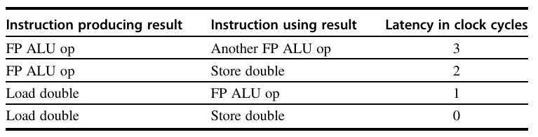{ width="600" }
</figure>

=== "C"

    ```c linenums="1"
    for (i = 999; i >= 0; i = i - 1) {
        x[i] = x[i] + s;
    }
    ```

=== "MIPS"

    ```verilog linenums="1"
    Loop: LD f0, 0(r1)
    ADDD f4, f0, f2
    SD f4, 0(r1)
    SUBI r1, r1, 8
    BNE r1, r2, Loop
    ```

!!! question "写出此循环的执行过程"

    写出在进行 scheduled（调度）与不进行调度的情况下，这个循环在 MIPS 上的执行过程，包括所有停顿或空闲时钟周期。调度时要考虑浮点运算产生的延迟，但忽略延迟分支

    ---

    在不进行任何调度时，共花费 9 个周期

    <figure markdown="span">
        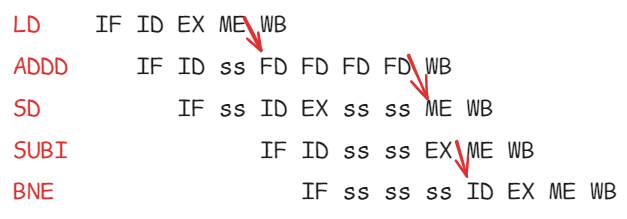{ width="400" }
    </figure>

    我们可以调度这个循环，使其只有 2 次停顿，将花费时间缩短至 7 个周期

    ```verilog linenums="1"
    Loop: LD f0, 0(r1)
    SUBI r1, r1, 8  // 将 SUBI 提前，消除 LD 与 ADDD 间的 stall
    ADDD f4, f0, f2
    SD f4, 8(r1)  // 这里改为了 8(r1)
    BNE r1, r2, Loop
    ```

    <figure markdown="span">
        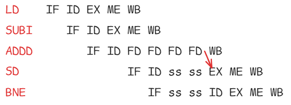{ width="400" }
    </figure>

在上面这个例子中，每 7 个时钟周期完成一次循环迭代，并存回数组元素，但对数组元素进行的实际运算仅占用这 7 个时钟周期中的 3 个（载入、求和与存储）。其余 4 个时钟周期包括循环开销（`DADDUI` 和 `BNE`）和 2 次停顿。为了消除这 4 个时钟周期，需要使循环体中的运算指令数多于开销指令数

要提高运算指令相对于分支和开销指令的数目，一种简单的方案是 loop unrolling（循环展开）。展开就是将循环体复制多次，调整循环的终止代码

循环展开还可用于提高调度效率。由于它消除了分支，因此可以将来自不同选代的指令放在一起调度。在这个例子中，我们通过在循环体内创建更多的独立指令来消除数据使用停顿。如果在展开循环时只是简单地复制这些指令，最后使用的都是同一组寄存器，所以可能会妨碍对循环的有效调度。因此，我们希望为每次选代使用不同寄存器，这就需要增加寄存器的数目

!!! question "使用 loop unrolling"

    展开以上循环，使其包含循环体的 4 个副本，假定 r1-r2（即数组的大小）最初是 32 的倍数，也就是说循环选代的数目是 4 的倍数。消除任何明显的冗余计算，不要重复使用任何寄存器
    
    合并 SUBI 指令，删除在展开期间重复的非必需 `BNE` 运算，得到的结果如下。注意，现在必须对 r2 进行置位，使 `32(r2)` 成为后 4 个元素的起始地址

    ```verilog linenums="1"
    Loop: LD f0, 0(r1)
    ADDD f4, f0, f2
    SD f4, 0(r1)

    LD f6, -8(r1)
    ADDD f8, f6, f2
    SD f8, -8(r1)

    LD f10, -16(r1)
    ADDD f12, f10, f2
    SD f12, -16(r1)

    LD f14, -24(r1)
    ADDD f16, f14, f2
    SD f16, -24(r1)

    SUBI r1, r1, 32
    BNE r1, r2, Loop
    ```

    我们省掉了三次分支转移和对 r1 的三次递减。并对载入和存储指令的地址进行了补偿，以允许合并针对 r1 的 `SUBI` 指令。这一优化看起来似乎微不足道，但实际并非如此；它需要进行符号替换和化简。符号替换和化简将重新整理表达式，以合并其中的常量，比如表达式 `((i+1)+1)` 可以重写为 `(i+(1+1))`，然后化简为 `(i+2)`。这种优化方式消除了相关计算
    
    如果没有调度，展开循环中的每个操作后面都会跟有一个相关操作，从而导致停顿。这个循环将运行 27 个时钟周期（每个 `LD` 有 1 次停顿，每个 `ADDD` 2 次、`SUBI` 1 次，加上 14 个指令发射周期），或者说在 4 个元素的每个元素上平均花费 6.75 个时钟周期（比之前的 7 个周期要短），但通过调度可以显著提高其性能。循环展开通常是在编译过程的早期完成的，所以优化器可以发现并消除冗余运算

在实际程序中，人们通常不知道循环的上限。假定此上限为 n，我们希望展开循坏，制作循环体的 k 个副本。我们生成的是一对连续循环，而不是单个展开后的循环。第一个循环执行 `(n mod k)` 次，其主体就是原来的循环。第二个循环是由外层循环包围的展开循环，迭代 `(n/k)` 次。当 n 值较大时，大多数执行时间都花费在未展开的循环体上

!!! question "调度 loop unrolling 后的代码"

    ```verilog linenums="1"
    Loop: LD f0, 0(r1)
    LD f6, -8(r1)
    LD f10, -16(r1)
    LD f14, -24(r1)
    ADDD f4, f0, f2
    ADDD f8, f6, f2
    ADDD f12, f10, f2
    ADDD f16, f14, f2
    SD f4, 0(r1)
    SD f8, -8(r1)
    SUBI r1, r1, 32  // 提前 SUBI 指令，消除 SUBI 与 BNE 之间的 stall
    SD f12, 16(r1)
    SD f16, 24(r1)
    BNE r1, r2, Loop
    ```

    展开后循环的执行时间已经缩减到总共 14 个时钟周期，或者说每个元素需要 3.5 个时钟周期，而在未进行任何展开或调度之前为每个元素 9 个时钟周期，进行调度但未展开时为 7 个周期

对展开循环进行调度所获得的收益甚至还会大于对原循环进行调度的收益。之所以会这样，是因为展开后的循环暴露了更多可以进行调度的计算，从而可以将停顿时间减至最低；上述代码中就没有任何停顿。要以这种方式调度循环，必须意识到载入指令和存储指令是不相关的，可以交换位置

> 或者说，展开后的循环有更多的优化空间

## 3 Overcoming Data Hazards With Dynamic Scheduling

**用动态调度克服数据竞争**

除非是流水线中的已有指令与要提取的指令之间存在数据相关，而且无法通过旁路或转发来隐藏这一数据相关，否则，简单的静态调度流水线就会提取一条指令并发射出去（转发逻辑可以减少实际流水线延迟，所以某些特定的相关不会导致冒险）。如果存在不能隐藏的数据相关，那些冒险检测软件会从使用该结果的指令开始，将流水线置于停顿状态。在清除这一相关之前不会提取和发射新的指令

在动态调度中，硬件会重新安排指令的执行顺序以减少停顿并同时保持数据流和异常行为

动态调度有几个优点

1. 它允许针对一种流水线编译的代码在不同流水线上高效执行，不需要在使用不同微体系结构时重新进行编译，并拥有多个二进制文件。在当今的计算环境中，大多数软件都来自第三方，而且是以二进制文件形式分发的，这一优势尤其明显
2. 在某些情况下，在编译代码时还不能知道相关性，利用动态调度可以处理某些此类情况；比如，这些相关可能涉及存储器引用或者与数据有关的分支，或者，它们可能源自使用动态链接或动态分发的现代编程环境
3. 可能是最重要的一个优点，它允许处理器容忍一些预料之外的延迟，比如缓存缺失，它可以在等待解决缺失问题时执行其他代码。动态调度的好处是以硬件复杂度的显著提高为代价的

尽管动态调度的处理器不能改变数据流，但它会在存在相关性时尽力避免停顿。相反，由编译器调度的静态流水线也会尽力将停顿时间降至最低，具体方法是隔离相关指令，使它们不会导致冒险。当然，对于那些本来准备在采用动态调度流水线的处理器上运行的代码，也可以使用编译器流水线调度

### 3.1 Dynamic Scheduling: The Idea

**动态调度：思想**

简单流水线技术的一个主要限制是它们使用循序指令发射与执行：指令按程序顺序发射，如果一条指令停顿在流水线中，后续指令都不能继续进行。因此，如果流水线中两条相距很近的指令存在相关性，就会导致冒险和停顿。如果存在多个功能单元，这些单元也可能处于空闲状态。如果指令 j 依赖于长时间运行的指令 i（当前正在流水线中执行），那么 j 之后的所有指令都必须停顿，直到 i 完成、j 可以执行为止。例如，考虑以下代码：

``` verilog linenums="1"
DIVD F0, F2, F4
ADDD F10, FO, F8
SUBD F12, F8, F14
```

由于 `ADDD` 对 `DIVD` 的相关性会导致流水线停顿，所以 `SUBD` 指令不能执行；但是，`SUBD` 流水线中的任何指令都没有数据相关性。这一冒险会对性能造成限制，如果不需要以程序顺序来执行指令，就可以消除这一限制

在经典的五级流水线中，会在指令译码（ID）期间检查结构冒险和数据冒险：当一个指令可以无冒险执行时，知道所有数据冒险都已经解决，从 ID 将其发射出去。为了能够开始执行上面例子中的 `SUBD`，必须将发射过程分为两个部分：检查所有结构冒险和等待数据冒险的消失。因此，我们仍然使用循序指令发射（即，按程序顺序发射指令），但我们希望一条指令能够在其数据操作数可用时立即开始执行。这样一种流水线实际是 out-of-order execution（乱序执行），也就意味着 out-of-order completion（乱序完成）

乱序执行就可能导致 WAR 和 WAW 冒险，在这个五级整数流水线及其循序浮点流水线的逻辑扩展中不存在这些冒险。考虑以下 MIPS 浮点代码序列：

```verilog linenums="1"
DIVD FO, F2, F4
ADDD F6, FO, F8
SUBD F8, F10, F14
MULD F6, F10, F8
```

在 `ADDD` 和 `SUBD` 之间存在反相关，如果流水线在 `ADDD` 之前执行 `SUBD`（`ADDD` 在等待 `DIVD`），将会违犯反相关，产生 WAR 冒险。与此类似，为了避免违犯输出相关，比如由 `MULD` 写入 F6 就必须处理 WAW 冒险。后面将会看到，利用寄存器重命名可以避免这些冒险

乱序完成还会使异常处理变得复杂。采用乱序完成的动态调度必须保持异常行为，使那些在严格按照程序顺序执行程序时会发生的异常仍然会实际发生，也不会发生其他异常。动态调度处理器会推迟发布相关异常的发布，一直等到处理器知道该指令就是接下来要完成的指令为止，通过这一方式来保持异常行为

尽管异常行为必须保持，但动态调度处理器可能生成一些 imprecise（非精确）异常。如果在发生异常时，处理器的状态与严格按照程序顺序执行指令时的状态不完全一致，那就说这一异常是 imprecise（非精确的）

非精确异常可以因为以下两种可能性而发生

1. 流水线在执行导致异常的指令时，可能已经完成了按照程序顺序排在这一指令之后的
指令
2. 流水线在执行导致异常的指令时，可能还没有完成按照程序顺序排在这一指令之前的指令

非精确异常增大了在异常之后重新开始执行的难度

为了能够进行乱序执行，我们将五级简单流水线的 ID 流水线大体分为以下两个阶段

1. Issue（发射 IS） —— 译码指令，检查结构性冒险
2. Read operands（读操作数 RO） —— 一直等到没有数据冒险，然后读取操作数

指令提取阶段位于发射阶段之前，既可以把指令放到指令寄存器中，也可能放到一个待完成指令队列中；然后从寄存器或队列发射这些指令。执行阶段跟在读操作数阶段之后，这一点和五级流水线中一样。执行过程可能需要多个周期，具体数目取决于所执行的操作

我们区分一个指令 begins execution（开始执行）和  completes execution（完成执行）的时刻，在这两个时刻之间，指令 in execution（处于执行过程中）。我们的流水线允许同时执行多条指令，没有这一功能，就会失去动态调度的主要优势。要同时执行多条执行，需要有多个功能单元、流水化功能单元，或者同时需要这两者。由于这两种功能（流水化功能单元和多个功能单元）在流水线控制方面大体相当，所以我们假定处理器拥有多个功能单元

在动态调度流水线中，所有指令都循序经历发射阶段（循序发射）；但是，它们可能在第二阶段（读操作数阶段）停顿或者相互旁路，从而进行乱序执行状态。Scoreboarding（记分板技术）允许在有足够资源和没有数据相关时乱序执行指令，它的名字源于 CDC 6600 记分板，CDC 6600 记分板开发了这一功能

### 3.2 Dynamic Scheduling With a Scoreboard

**采用记分卡的动态调度**

记分卡的目标是：通过尽早执行指令，保持每时钟周期 1 条指令的执行速率（在没有结构性冒险时）。因此，当下一条要执行的指令停顿时，如果其他指令不依赖于任何活动指令或停顿指令，则发射和执行这些指令。记分卡全面负责指令发射与执行，包括所有冒险检测任务。要充分利用乱序执行，需要在其 EX 级中同时有多条指令。这一点可以通过多个功能单元、流水化功能单元或同时利用两者来实现。由于这两种功能（流水化功能单元和多个功能单元）对于流水线控制来说基本上是等价的，所以我们将假定处理器拥有多个功能单元

CDC 6600 拥有 16 个独立的功能单元，包括 4 个浮点单元、5 个存储器引用单元和 7 个整数运算单元。在采用 MIPS 体系结构的处理器上，记分卡主要在浮点单元上发挥作用，因为其他功能单元的延迟非常小。让我们假定一共有两个乘法器、一个加法器、一个除法单元和一个完成所有存储器引用、分支和整数运算的整数单元。尽管这个例子要比 CDC 6600 简单，但它的功能足以演示这些原理，不需要大量细节，也不需要非常长的示例。因为 MIPS 和 CDC 6600 都是载入—存储体系结构，所以这些技术对于这两种技术来说几乎是相同的。下图给出了该处理器的基本结构

<figure markdown="span">
    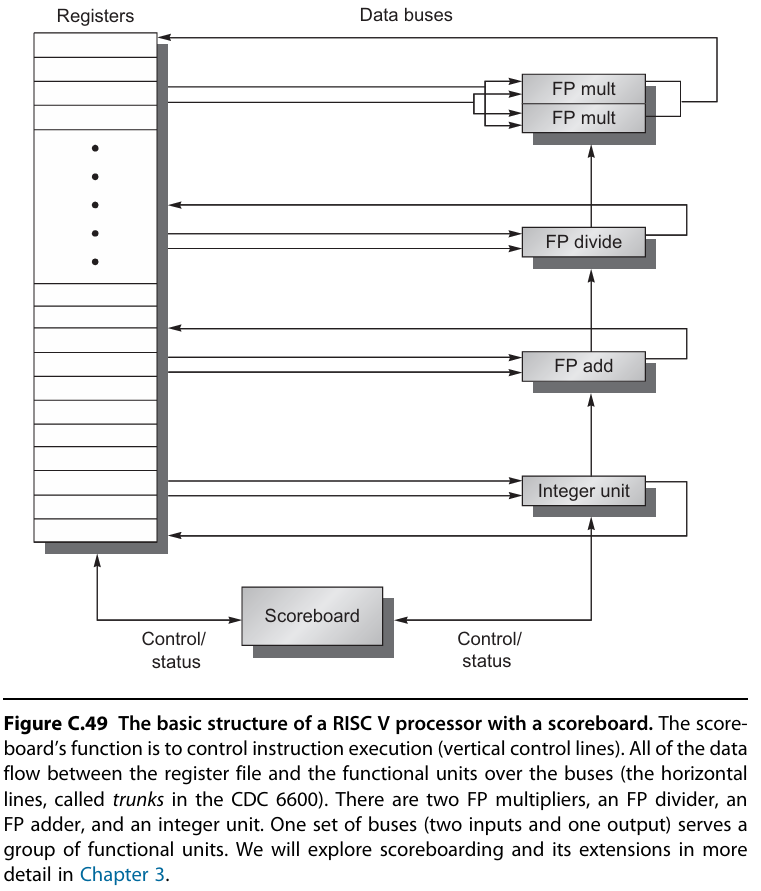{ width="600" }
</figure>

每条指令都进入记分卡，在这里构建一条数据相关性记录；这一步与指令发射相对应，并替换 MIPS 流水线中的 ID 步骤。记分卡随后判断指令什么时候能够读取它的操作数并开始执行。如果记分卡判断该指令不能立即执行，它监控硬件中的所有变化，以判断该指令何时能够执行。记分卡还控制一条指令什么时候能将其结果写到目标寄存器中。因此，所有冒险检测与解决都集中在记分卡

每条指令需要经历 4 个执行步骤（由于我们现在主要考虑浮点运算，所以不考虑存储器访问步骤）。我们先粗略地查看一下这些步骤，然后再详细研究记分卡如何记录一些必要信息，用于判断执行过程何时由一个步骤进行到下一个步骤。这四个步骤代替了标准 MIPS 流水线中的 ID、EX 和 WB 步骤，如下所示：

1. Issue（IS 发射）：如果指令的一个功能单元空闲，没有其他活动指令以同一寄存器为目标寄存器，则记分卡向功能单元发射指令，并更新其内部数据结构。这一步代替了MIPS 流水线中 ID 步骤的一部分。只要确保没有其他活动功能单元希望将自己的结果写入目标寄存器，就能保证不会出现 WAW 冒险。如果存在结构性冒险或 WAW 冒险，则指令发射停顿，在清除这些冒险之前，不会再发射其他指令。当发射级停顿时，会导致指令提取与发射之间的缓冲区填满；如果缓冲区只是一项，则指令提取立即停顿。如果缓冲区是拥有多条指令的队列，则在队列填满后停顿
2. Read operands（RO 读取操作数）：记分卡监视源操作数的可用性。如果先前发射的活动指令都不再写入源操作数，而该源操作数可用。当源操作数可用时，记分卡告诉功能单元继续从寄存器读取操作数，并开始执行。记分卡在这一步动态解决 RAW 冒险，可以发送指令以进行乱序执行。这一步和发射步骤一起，完成了简单 MIPS 流水线中 ID 步骤的功能。
3. Execution（EX 执行）：功能单元接收到操作数后开始执行。结果准备就绪后，它通知记分卡已经完成执行。这一步代替了 MIPS 流水线中的 EX 步骤，在 MIPS 浮点流水线中耗用多个周期
4. Write result（WB 写结果）：一旦记分卡知道功能单元已经完成执行，则检查 WAR 冒险，并在必要时停顿正在完成的指令

```verilog linenums="1"
DIVD f0, f2, f4
ADDD f10, f0, f8
SUBD f8, f8, f14
```

`ADDD` 有一个源操作数为 f8，就是 `SUBD` 的目标寄存器。但 `ADDD` 实际上取决于前面的一条指令。记分卡仍将 `SUBD` 停顿于它的写结果阶段，直到 `ADDD` 读取它的操作数为止

一般来说，在以下情况下，不能允许一条正在执行的指令写入其结果

1. 在正在执行的指令前面（即按发射顺序）有一条指令还没有读取其操作数
2. 这些操作数之一与正执行指令的结果是同一寄存器
 
如果不存在这一 WAR 冒险，或者已经清除，则记分卡会告诉功能单元将其结果存储到目标寄存器中。这一步骤代替了简单 MIPS 流水线中的 W B步骤

乍看起来，记分卡在区分 RAW 和 WAR 冒险时似乎会有困难

因为只有当寄存器堆中拥有一条指令的两个操作数时，才会读取这些操作数，所以记分卡未能利用转发。只有当寄存器都可用时才会进行读取。这一代价并没有读者最初想象得那么严重。这里与我们前面的简单流水线不同，指令会在完成执行之后立即将结果写入寄存器堆（假定没有 WAR 冒险），而不是等待可能间隔几个周期的静态指定写入时隙。由于结果的写入和操作数的读取不能重叠，所以仍然会增加一个周期的延迟。我们需要增加缓冲，以消除这一开销

记分卡根据自己的数据结构，通过与功能单元的沟通来控制指令从一个步骤到下一个步骤的进展。但这种做法有一点点复杂。指向寄存器堆的源操作数总线和结果总线数目是有限的，所以可能会存在结构性冒险。记分卡必须确保允许进入第 2、4 步的功能单元数不会超过可用总线数。这里不会进行深入讨论，仅提及 CDC 6600 在解决这一问题时，将 16 个功能单元分为四组，并为每一组提供一组总线，称为 data trunks（数据干线）。在一个时钟周期内，一个组中只有一个单元可以读取其操作数或写入其结果

记分卡共有三个部分：

1. Instruction Status（指令状态）：指出该指令处于四个步骤中的哪一步
2. Functional Unit Status（功能单元状态）：指出功能单元（FU）的状态，共有 9 个字段用来表示每个功能单元的状态
      1. busy：指示该单元是否繁忙
      2. Op（operation）：在此单元中执行的运算
      3. Fi（destination register）：目标寄存器
      4. Fj，Fk（source register numbers）：源寄存器编号
      5. Qj，Qk（functional units producing）：生成源寄存器 Fj，Fk 的功能单元
      6. Rj，Rk（flags indicating）：指示 Fj，Fk 已准备就绪但尚未读取的标记。在读取操作数后将其设置为“否”
3. Register Result Status（寄存器结果状态）：如果一条活动指令以该寄存器为目标寄存器，则指出哪个功能单元将写入每个寄存器。只要没有向该寄存器写入的未完成指令，则将此字段设置为空

```verilog linenums="1"
LD f6, 34(r2)
LD f2, 45(r3)
MULD f0, f2, f4
SUBD f8, f6, f2
DIVD f10, f0, f6
ADDD f6, f8, f2
```

<figure markdown="span">
    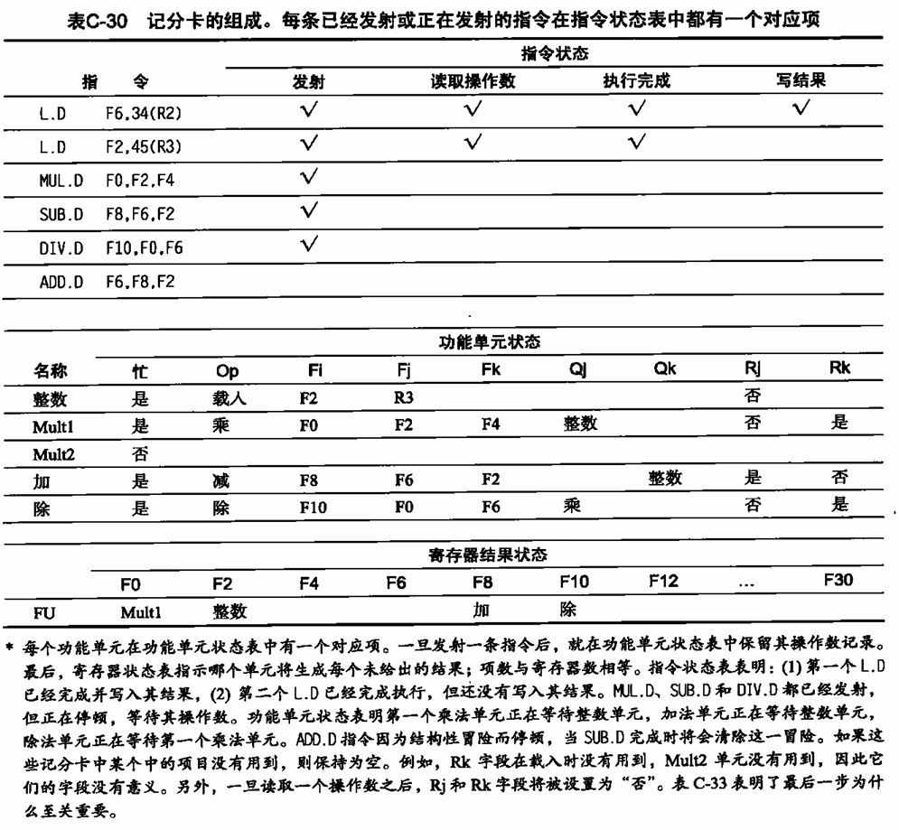{ width="700" }
</figure>

---

记分卡是如何工作的：

<figure markdown="span">
    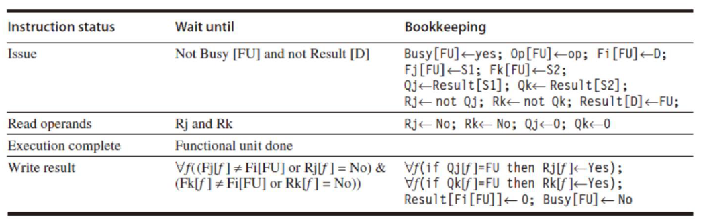{ width="600" }
</figure>

假设 FP 运算的 ADD/SUB EX 阶段需要 3 个时钟周期，MULT 需要 7 个，DIVD 需要 24 个

<figure markdown="span">
    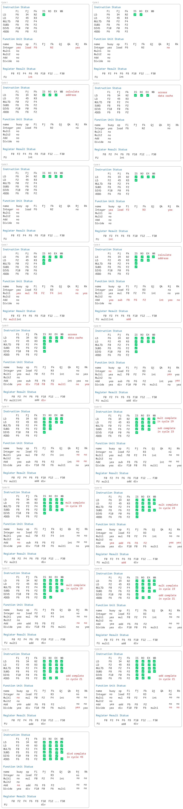{ width="800" }
</figure>

---

记分卡的缺点：

1. 没有 forwarding 机制
2. 基本块限制：仅能动态调度同一基本块（无分支的指令序列）内的指令，无法跨分支预测或扩大调度窗口
3. 由于 FU 数量较少，结构竞争很容易发生
4. 遇到结构冲突时，不发射指令
5. 必须等待 WAR
6. 必须避免 WAW

---

1. ILP：动态调度的效果依赖于程序中独立指令的数量。若指令间依赖性强（如长依赖链），记分板无法显著提升性能
2. 调度窗口（window）：窗口大小限制了 CPU 前瞻调度的范围。基本块内指令有限（无法跨越分支），导致并行机会较少。后续技术（如乱序执行）通过更大窗口和分支预测优化这一点
3. 功能单元资源：功能单元（如 ALU、加载存储单元）的数量不足或类型单一会引发结构冲突（如多条指令争用同一单元），强制流水线停顿
4. 依赖冲突的影响：
      1. RAW（真依赖）：必须等待数据就绪，是本质限制
      2. WAR/WAW（伪依赖）：记分板需保守等待，但可通过寄存器重命名（后续技术）消除，从而提升并行性

在消除停顿方面，记分卡受以下几个因素的影响：

1. 指令间可用并行数：这一因素决定了能否找到要执行的独立指令。如果每条指令都依赖于它前面的指令，那就找不到减少停顿的动态调度方案。如果必须从同一基本模块中选择同时存在于流水线中的指令（在 6600 中就是如此），那这一限制是十分严重的
2. 记分卡的项数：这一因素决定了流水线为了查找不相关指令可以向前查找多少条指令。这组作为潜在执行对象的指令被称为窗口。记分卡的大小决定了窗口的大小。在这一节，我们假定窗口不会超过一个分支，所以窗口（及记分卡）总是包含来自单个基本模块的直行代码
3. 功能单元的数目和类型：这一因素决定了结构性冒险的重要性，它可能会在使用动态调度时增加
4. 存在反相关和输出相关：它们会导致 WAR 和 WAW 停顿

### 3.3 Dynamic Scheduling Using Tomasulo’s Approach

**使用 Tomasulo 算法进行动态调度**

IBM 360/91 浮点单元使用一种支持乱序执行的高级方案。这一方案由 Robert Tomasulo 发明，它会跟踪指令的操作数何时可用，将 RAW 冒险降至最低，并在硬件中引人寄存器重命名功能将 WAW 和 WAR 冒险降至最低。在现代处理器中存在这一方案的许多变体，但跟踪指令相关以允许在操作数可用时立即执行指令、重命名寄存器以避免 WAR和 WAW 冒险，这些核心概念仍然是它们的共同特征

IBM 的目标是从指令集出发、从为整个 360 计算机系列设计的编译器出发来实现高浮点性能，而不是通过采用专门为高端处理器设计的编译器来实现。360 体系结构只有 4 个双精度浮点寄存器，它限制了编译器调度的有效性；这一事实是开发 Tomasulo 方法的另一个动机。此外 IBM 360/91 的内存访问时间和浮点延迟都很长，Tomasulo 算法就是设计用来克服这些问题的

我们将在 MIPS 指令集上下文中解释这一算法，重点放在浮点单元和载入—存储单元。MIPS 与 360 之间的主要区别是后者的体系结构中存在存器—存储器指令。由于 Tomasulo 算法使用一个载入功能单元，所以添加寄存器—存储器寻址模式并不需要进行大量修改。IBM 360/91 还有一点不同，它拥有的是流水化功能单元，而不是多个功能单元，但我们在描述该算法时仍然假定它有多个功能单元。它只是对功能单元进行流水化的概念扩展

如果仅在操作数可用时才执行指令，就可以避免 RAW 冒险，而这正是些简单记分板方法提供的功能。WAR 和 WAW 冒险（源于名称相关）可以通过寄存器重命名来消除。对所有目标寄存器（包括较早指令正在进行读取或写入的寄存器）进行重命名，使乱序写入不会影响到任何依赖某一操作数较早值的指令，从而消除 WAR 和 WAW 冒险

为了更好地理解寄存器重命名如何消除 WAR 和 WAW 冒险，考虑以下可能出现 WAR 和 WAW 冒险的代码序列示例:

```verilog linenums="1"
DIVD F0, F2, F4
ADDD F6, F0, F8
SD F6, 0(R1)
SUBD F8, F10, F14
MULD F6, F10, F8
```

以上代码共有两处反相关：ADDD 与 SUBD 之间，SD 和 MULD 之间。在 ADDD 和 MULD 之间还有一处输出相关，从而一共可能存在 3 处冒险：ADDD 使用 F8 和 SUBD 使用 F6 时的 WAR 冒险，以及因为 ADDD 可能在 MULD 之后完成所造成的 WAW 冒险。还有 3 个真正的数据相关：DIVD 和 ADDD 之间、SUBD 和 MULD 之间、ADDD 和 SD 之间

这 3 个名称相关都可以通过寄存器重命名来消除。为简便起见，假定存在两个临时寄存器：S 和 T。利用 S 和 T，可以对这一序列进行改写，使其没有任何相关，如下所示：

```verilog linenums="1"
DIVD F0, F2, F4
ADDD S, F0, F8
SD S, 0(R1)
SUBD T, F10, F14
MULD F6, F10, T
```

此外，对 F8 的任何后续使用都必须用寄存器 T 来代替。在这个代码段中，可以由编译器静态完成这一重命名过程。要在后续代码中找出所有使用 F8 的地方，需要采用高级编译器分析或硬件支持，这是因为上述代码段与后面使用 F8 的位置之间可能存在插入分支。Tomasulo 算法可以处理跨越分支的重命名问题

在 Tomasulo 方案中，寄存器重命名功能由 reservation stations（保留站）提供，保留站会为等待发射的指令缓冲操作数。其基本思想是：保留站在一个操作数可用时马上提取并缓冲它，这样就不再需要从寄存器中获取该操作数。此外，等待执行的指令会指定保留站，为自己提供输入。最后，在对寄存器连续进行写入操作并且重叠执行时，只会实际使用最后一个操作更新寄存器。在发射指令时，会将待用操作数的寄存器说明符更名，改为保留站的名字，这就实现了寄存器重命名功能

由于保留站的数目可能多于实际寄存器，所以这一技术甚至可以消除因为名称相关而导致的冒险，这类冒险是编译器所无法消除的。在研究 Tomasulo 方案的各个部分时，我们将再次讨论寄存器重命名这一主题，了解重命名究竟如何实现以及它如何消除 WAR 和 WAW 冒险

使用保留站，而不使用集中式寄存器堆，可以导致另外两个重要特性

1. 冒险检测和执行控制是分布式的：每个功能单元保留站中保存的信息决定了一条指令什么时候可以开始在该单元中执行
2. 结果将直接从缓冲它们的保留站中传递给功能单元，而不需要经过寄存器

这一旁路是使用 common result bus（公共结果总线）完成的，它允许同时载入所有等待一个操作数的单元（在 360/91 中，这种总线被称为 common data bus（公共数据总线），或 CDB）。在具有多个执行单元并且每个时钟周期发射多条指令的流水线中，将需要不止一条总线

下图给出了基于 Tomasulo 算法的处理器的基本结构，其中包括浮点单元和载入/存储单元；所有执行控制表均未显示。每个保留站保存一条已经被发射、正在功能单元等待执行的指令，如果已经计算出这一指令的操作数值，则保留这些操作数值，如果还没有计算出，则保留提供这些操作数值的保留站名称

<figure markdown="span">
    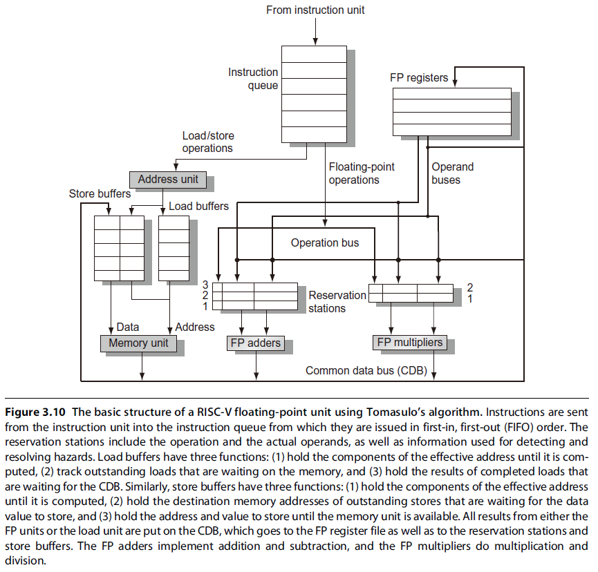{ width="600" }
</figure>

载入缓冲区和存储缓冲区保存来自和进入存储器的数据或地址，其行为方式基本与保留站相同，所以我们仅在必要时才区分它们。浮点寄存器通过一对总线连接到功能单元，由一根总线连接到存储缓冲区。来自功能单元和来自存储器的所有结果都通过公共数据总线发送，它会通向除载入缓冲区之外的所有地方。所有保留站都有标记字段，供流水线控制使用

一条指令所经历的步骤：

**1.Issue**（发射）：从指令队列的头部获取下一条指令，指令队列按 FIFO 顺序维护，以确保能够保持数据流的正确性。如果有一个匹配保留站为空，则将这条指令发送到这个站中，如果操作数值当前已经存在于寄存器，也一并发送到站中。如果没有空保留站，则存在结构性冒险，该指令会停顿，直到有保留站或缓冲区被释放为止。如果操作数不在寄存器中，则一直跟踪将生成这些操作数的功能单元。这一步骤将对寄存器进行重命名，消除 WAR 和 WAW 冒险（在动态调度处理器中，这一阶段有时被称为dispatch（分派））

**2.Execute**（执行）：如果还有一个或多个操作数不可用，则在等待计算的同时监视公共数据总线。当一个操作数变为可用时，就将它放到任何一个正在等待它的保留站中。当所有操作数都可用时，则可以在相应功能单元中执行运算。通过延迟指令执行，直到操作数可用为止，可以避免 RAW 冒险（一些动态调度处理器将这一步骤称为“发射”，但我们使用“执行”一词，在第一个动态调度处理器 CDC 6600 中使用的就是这个名字）

注意，在同一时钟周期，同一功能单元可能会有几条指令同时变为就绪状态。尽管独立功能单元可以在同一时钟周期执行不同指令，如果单个功能单元有多条指令准备就绪，那这个单元就必须从这些指令中进行选择。对于浮点保留站，可以任意作出这一选择；但是载入和存储指令可能要更复杂一些

载入和存储指令的执行过程需要两个步骤

1. 在基址寄存器可用时计算有效地址
2. 将有效地址放在载入缓冲区或存储缓冲区中

载入缓冲区中的载入指令在存储器单元可用时立即执行。存储缓冲区中的存储指令等待要存储的值，然后将其发送给存储器单元。通过有效地址的计算，载入和存储指令保持程序顺序，这样有助于通过存储器来避免冒险

为了保持异常行为，对于任何一条指令，必须要等到根据程序顺序排在这条指令之前的所有分支全部完成之后，才能执行该指令。这一限制保证了在执行期间导致异常的指令实际上已经执行。在使用分支预测的处理器中（就和所有动态调度处理器一样），这意味着处理器在允许分支之后的指令开始执行之前，必须知道分支预测是正确的。如果处理器记录了异常的发生，但没有实际触发，则可以开始执行一条指令，在进入写结果阶段之前没有停顿

**3.Write result**（写结果）：在计算出结果之后，将其写到 CDB 上，再从 CDB 传送给寄存器和任意等待这一结果的保留站（包括存储缓冲区）。存储指令一直缓存在存储缓冲区中，直到待存储值和存储地址可用为止，然后在有空闲存储器单元时，立即写入结果

保留站、寄存器堆和载入/存储缓冲区都采用了可以检测和消除冒险的数据结构，根据对象的不同，这些数据结构中的信息也稍有不同。这些标签实际上就是用于重命名的虚拟寄存器扩展集的名字。在这里的例子中，标签字段包含 4 个数位，用来表示 5 个保留站之一或 5 个载入缓冲区之一。这相当于设定了 10 个可以指定为结果寄存器的寄存器（而 360 体系结构中包含 4 个双精度寄存器）。在拥有更多真正寄存器的处理器中，我们可能希望重命名能够提供更多的虚拟寄存器。标签字段指出哪个保留站中包含的指令将会生成作为源操作数的结果

在指令被发射出去并开始等待源操作数之后，将使用一个保留站编号来引用该操作数，这个保留站中保存着将对寄存器进行写操作的指令。如果使用一个未用作保留站编号的值来引用该操作数（比如 0），则表明该操作数已经在寄存器中准备就绪。由于保留站的数目多于实际寄存器数目，所以使用保留站编号对结果进行重命名，就可以避免 WAW 和 WAR 冒险。在 Tomasulo 方案中，保留站被用作扩展虚拟寄存器，而其他方法可能使用拥有更多寄存器的寄存器集，也可能使用诸如重排序缓冲区这样的结构

在 Tomasulo 方案以及后面将会介绍的支持推测的方法中，结果都是在受保留站监视的总线（CDB）上广播。采用公用结果总线，再由保留站从总线中提取结果，共同实现了静态调度流水线中使用的转发和旁路机制。但在这一做法中，动态调度方案会在源与结果之间引入一个时钟周期的延迟，这是因为要等到“写结果”阶段才能让结果与其应用匹配起来。因此，在动态调度流水线中，在生成结果的指令与使用结果的指令之间至少要比生成该结果的功能单元的延迟长一个时钟周期

一定别忘了，Tomasulo 方案中的标签引用的是将会生成结果的缓冲区或单元；当一条指令发射到保留站之后，寄存器名称将会丢弃（这是 Tomasulo 方案与记分板之间的一个关键区别：在记分板中，操作数保存在寄存器中，只有生成结果的指令已经完成、使用结果的指令做好执行准备之后才会读取操作数）

每个保留站有以下 7 个字段：

1. Op：对源操作数 S1 和 S2 执行的运算
2. Qj，Qk：将生成相应源操作数的保留站；当取值为 0 时，表明已经可以在 Vj 或 Vk 中获得源操作数，或者不需要源操作数
3. Vj，Vk：源操作数的值。注意，对于每个操作数，V 字段和 Q 字段中只有一个是有效的。对于载入指令，Vk 字段用于保存偏移量字段
4. A：用于保存为载入或存储指令计算存储器地址的信息。在开始时，指令的立即数字段存储在这里；在计算地址之后，有效地址存储在这里
5. Busy：指明这个保留站及其相关功能单元正被占用
6. Qi：一个运算的结果应当存储在这个寄存器中，则 Qi 是包含此运算的保留站的编号如果 Qi 的值为空（或 0），则当前没有活动指令正在计算以此寄存器为目的地的结果，也就是说这个值就是寄存器的内容

寄存器堆有一个字段 Qi

载入缓冲区和存储缓冲区各有一个字段 A，一旦完成了第一个执行步骤，这个字段中就包含了有效地址的结果

#### 3.3.1 没看懂在说啥？

**AI 解释：**

**1.Tomasulo 算法的核心组件**

Tomasulo 算法主要依赖以下硬件结构：

1. **保留站（Reservation Stations, RS）**  
      - 每个功能单元（如 ALU、Load/Store 单元）都有自己的保留站，用于暂存 **已发射但未执行的指令** 及其操作数
      - 每个保留站包含：
          - **操作码（Op）**：如 ADD、SUB、LD（Load）、ST（Store）等
          - **操作数（Vj, Vk）**：如果操作数已就绪，则存储实际值；否则，存储其依赖的寄存器标签（用于监听数据）
          - **标签（Qj, Qk）**：如果操作数未就绪，记录哪个功能单元（或 Load Buffer）将产生该数据
          - **Busy**：标记该保留站是否被占用
2. **公共数据总线（Common Data Bus, CDB）**  
      - 用于广播已计算完成的结果，所有依赖该结果的保留站和寄存器可以立即更新
3. **寄存器别名表（Register Alias Table, RAT）**  
      - 记录 **每个寄存器的数据来源**（来自哪个保留站或 Load Buffer），用于解决 WAR/WAW 冲突（寄存器重命名）
4. **Load/Store Buffer**  
      - 用于管理访存操作，避免访存冲突

---

**2.Tomasulo算法的工作流程**

Tomasulo算法的执行分为三个阶段：

1. **发射（Issue）**
      - 从指令队列（窗口）取一条指令，检查是否有空闲的 **保留站**
      - 如果保留站可用：
          - **读取操作数**：
              - 如果操作数在寄存器中且 **未被其他指令占用**（RAT 标记为“就绪”），则直接读取（Vj/Vk）
              - 如果操作数 **尚未就绪**（RAT 标记为某个保留站），则记录其来源（Qj/Qk）
          - **更新 RAT**：
              - 如果该指令是 **写寄存器**（如 ADD R1, R2, R3），则在 RAT 中标记 R1 由当前保留站负责（防止 WAW 冲突）
          - **发射成功**，指令进入保留站等待执行
2. **执行（Execute）**
      - 检查保留站中的指令：
          - 如果 **所有操作数就绪**（Vj/Vk 有效，且 Qj/Qk 为空），则开始执行
          - 如果 **仍有操作数未就绪**（Qj/Qk 不为空），则等待 CDB 广播数据（监听总线）
      - **Load/Store 指令**：
          - Load 指令需等待地址计算完成，然后从内存读取数据
          - Store 指令需等待数据和地址都就绪，然后写入内存
3. **写回（Write-Back）**
      - 功能单元计算完成后，通过 **CDB 广播结果**：
          - 所有 **依赖该结果的保留站**（Qj/Qk 匹配当前保留站）更新其操作数（Vj/Vk）
          - **RAT 更新**：
              - 如果某个寄存器被标记为当前保留站负责，则更新其值，并清除 RAT 中的标记
          - **释放保留站**，使其可接收新指令

---

**3.示例分析**

假设有以下指令序列：

```verilog linenums="1"
1. LD  F1, 0(R2)    ; F1 = Mem[R2 + 0]
2. ADD F4, F1, F2   ; F4 = F1 + F2
3. SUB F6, F1, F3   ; F6 = F1 - F3
4. MUL F1, F4, F6   ; F1 = F4 * F6
```

**Tomasulo 执行过程**：

1. **LD F1**：发射到 Load Buffer，RAT 标记 F1 由 Load Buffer 负责
2. **ADD F4**：发射到加法保留站，发现 F1 未就绪（Qj = Load Buffer），等待
3. **SUB F6**：发射到减法保留站，同样等待 F1
4. **LD F1**：完成，通过 CDB 广播数据：
      - ADD 和 SUB 的 Qj 被清除，操作数更新，开始执行
5. **ADD F4** 和 **SUB F6** 完成后，广播结果：
      - MUL F1 发射，RAT 标记 F1 由乘法保留站负责（避免 WAW 冲突）
6. **MUL F1**：执行并写回，更新寄存器

## 4 Dynamic Scheduling: Examples and the Algorithm

<figure markdown="span">
    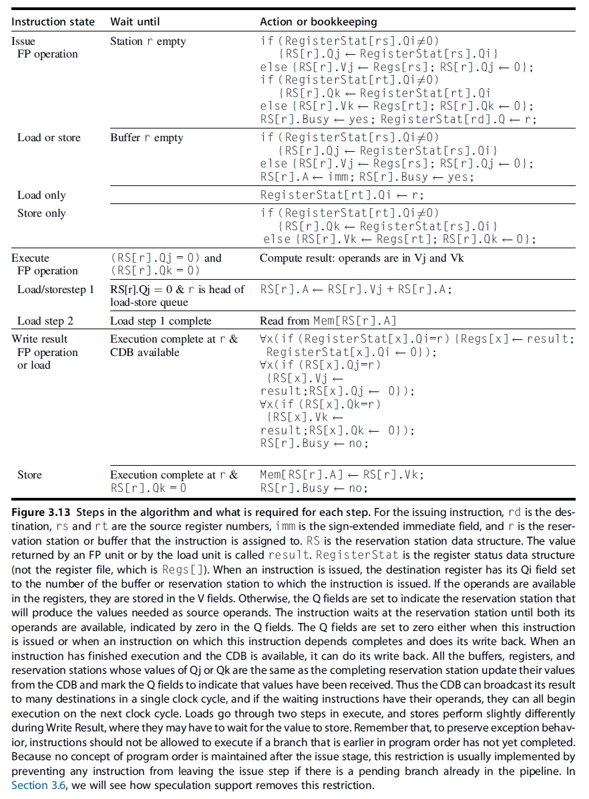{ width="600" }
</figure>

考虑以下指令序列：

```verilog linenums="1"
LD f6, 34(r2)
LD f2, 45(r3)
MULD f0, f2, f4
SUBD f8, f6, f2
DIVD f10, f0, f6
ADDD f6, f8, f2
```

<figure markdown="span">
    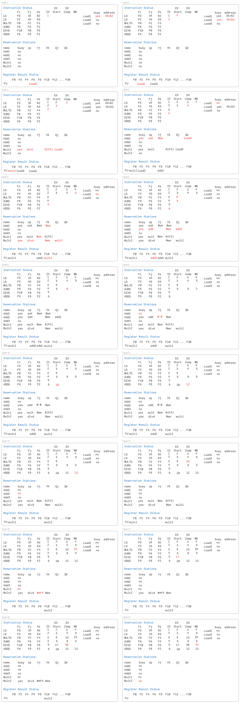{ width="800" }
</figure>

### 4.1 Tomasulo's Algorithm: A Loop-Based Example

考虑以下指令序列：

```verilog linenums="1"
LD f0, 0(r1)
MULD f4, f0, f2
SD f4, 0(r1)
SUBI r1, r1, 8
BNEZ r1, loop
```

提取前两个循环的 LD，MULD，SD 指令

```verilog linenums="1"
1 LD f0, 0(r1)
1 MULD f4, f0, f2
1 SD f4, 0(r1)
2 LD f0, 0(r1)
2 MULD f4, f0, f2
2 SD f4, 0(r1)
```

假设 mult 花费 4 个时钟周期，第一次 load 花费 8 个（因为有 cahce miss），第二次 load 花费 4 个

> 好累，不想画流程图了，但是 ppt 上有

### 4.2 Summary of Tomasulo's Algorithm

### 4.3 Explicit Renaming

## 5 Branch Prediction
