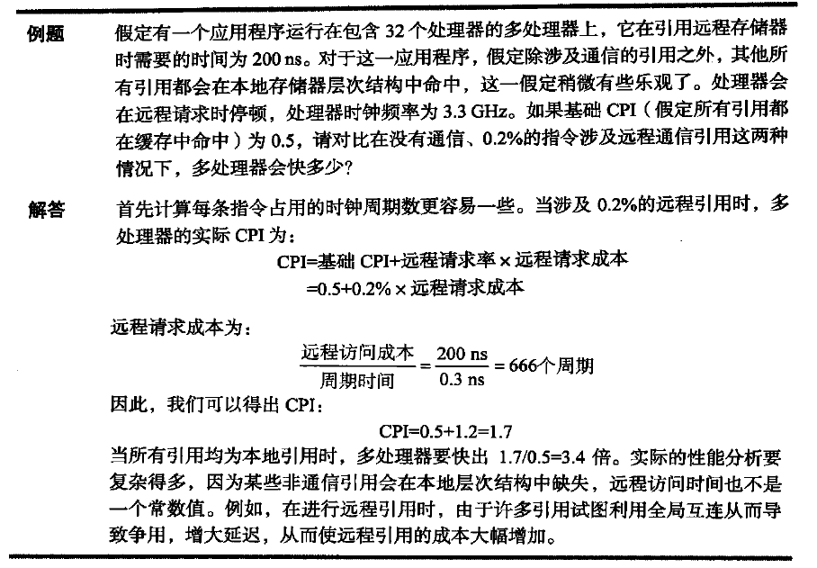

# 5 Thread-Level Parallelism

!!! tip "说明"

    本文档正在更新中……

!!! info "说明"

    1. 本文档仅涉及部分内容，仅可用于复习重点知识
    2. 本文档内容对应课本 Chapter 5
    3. 本章内容看明白具体例子以后，再返回来看前面的表格、状态图就好理解多了

## 1 Introduction

采用 Multiprocessors（多处理器系统）的主要原因：

1. 应用需求：虽然单处理器性能提升很快，但某些高性能计算任务（如科学模拟、大数据处理）需要更强的计算能力
2. 技术可行性：微处理器已成为最高效的 CPU 实现方式，通过集成多个现有处理器来提升性能，比从头设计一个全新架构更实际可行
3. 设计挑战：现代处理器设计日趋复杂，维持性能提升越来越困难，且复杂设计可能导致项目延期
4. 软件支持：虽然发展较慢，但并行编程技术（在科学计算、数据库和操作系统等领域）正在逐步成熟，为多处理器系统提供了软件基础

我们将多处理器定义为由紧耦合处理器组成的计算机，这些处理器的协调与使用由单一处理器系统控制，通过共享地址空间来共享存储器。此类处理器通过两种不同的软件模型来开发线程级并行

1. 运行一组紧密合的线程，协同完成同一项任务，这种情况通常被称为 parallel processing（并行处理）
2. 执行可能由一或多位用户发起的多个相对独立的进程，这是一种 request-level parallelism（请求级并行）形式。请求级并行可以由单个应用程序开发（这个应用程序在多个处理器上运行，比如响应查询请求的数据库程序），也可以由多个独立运行的应用程序开发，通常称为 multiprogramming（多重编程）

### 1.1 Multiprocessor Architecture: Issues and Approach

弗林分类法（Flynn's Taxonomy）

1. SISD：传统串行计算机架构（如普通 CPU），所有现代 CPU 都支持这种模式
2. MISD：理论存在但实际应用极少（仅用于特定容错系统）
3. SIMD：

    - 数据级并行典范（如 GPU/向量处理器）
    - 适合规则数据并行任务（图像处理/科学计算）
    - 现代 CPU 的 SSE/AVX 指令集也属于 SIMD

4. MIMD：
 
    - 最通用的并行模式（如多核 CPU/分布式集群）
    - 每个处理器可独立运行不同程序
    - MIMD 系统中的每个节点本身可能是超标量处理器

<figure markdown="span">
  { width="200" }
  <figcaption>SISD</figcaption>
</figure>

<figure markdown="span">
  { width="600" }
  <figcaption>SIMD</figcaption>
</figure>

<figure markdown="span">
  { width="600" }
  <figcaption>MIMD</figcaption>
</figure>

根据所包含的处理器数量，可以将现有共享存储器的多处理器分为两类，而处理器的数量又决定了存储器的组织方式和互连策略。我们是按照存储器组织方式来称呼多处理器的，因为处理器的数目是多还是少，是可能随时间变化的

第一类称为 **symmetric (shared-memory) multiprocessors**（对称（共享存储器）多处理器）（**SMP**），或 **centralized shared-memory multiprocessors**（集中式共享存储器多处理器），其特点是核心数目较少，通常不超过 8 个。由于此类多处理器中的处理器数目如此之小，所以处理器有可能共享一个集中式存储器，所有处理器能够平等地访问它，这就是对称一词的由来。在多核芯片中，采用一种集中方式在核心之间高效地共享存储器，现有多核心都是 SMP。当连接一个以上的多核心时，每个多核心会有独立的存储器，所以存储器为分布式，而非集中式

SMP 体系结构有时也称为 **uniform memory access**（一致存储器访问）（**UMA**）多处理器，这一名称来自以下事实：所有处理器访问存储器的延迟都是一致的，即使存储器的组织方式被分为多个组时也是如此

<figure markdown="span">
  { width="600" }
  <figcaption>SMP 的体系结构</figcaption>
</figure>

在另一种设计方法中，多处理器采用物理分布式存储器，称为 **distributed shared memory**（分布式共享存储器）（**DSM**）。为了支持更多的处理器，存储器必须分散在处理器之间，而不应当是集中式的；否则，存储器系统就无法在不大幅延长访问延迟的情况下为大量处理器提供带宽支持。随着处理器性能的快速提高以及处理器存储器带宽需求的相应增加，越来越小的多处理器都优选采用分布式存储器。多核心处理器的推广意味着甚至两芯片多处理器都采用分布式存储器。处理器数目的增大也提升了对高宽带互连的需求

将存储器分散在节点之间，既增加了带宽，也缩短了到本地存储器的延迟。DSM 多处理器也被称为 **NUMA**（**nonuniform memory access**，非一致存储器访问），这是因为它的访问时间取决于数据字在存储器中的位置。DSM 的关键缺点是在处理器之间传送数据的过程多少变得更复杂了一些，DSM 需要在软件中多花费一些力气，以充分利用分布式存储器提升的存储器带宽。因为所有多核心多处理器（处理器芯片或插槽多于一个）都使用了分布式存储器，所以我们将从这个角度来解释分布式存储器多处理器的工作方式

<figure markdown="span">
  { width="600" }
  <figcaption>DSM 的体系结构</figcaption>
</figure>

在 SMP 和 DSM 这两种体系结构中，线程之间的通信是通过共享地址空间完成的，也就是说，任何一个拥有正确寻址权限的处理器都可以向任意存储器位置发出存储器引用。与 SMP 和 DSM 相关联的 shared memory（共享存储器）一词是指共享 address space（地址空间）这一事实

### 1.2 Challenges of Parallel Processing

Parallel Processing：强调多个处理器协同工作（如超级计算机/服务器集群），与单机上运行多个程序的"多道程序设计"有本质区别

优势：

1. 突破性能瓶颈：指出单处理器在指令级并行 (ILP) 上面临分支预测错误、数据依赖、内存延迟等根本性限制
2. 经济效益：利用量产的商用处理器构建高性能系统，比定制大型机更经济
3. 弹性扩展：通过增加处理器数量线性提升算力（注：实际中可能受阿姆达尔定律限制）
4. 高可靠性：分布式架构天然具备容错能力

多处理器的两个重要障碍：

1. 程序中可用的并行有限
2. 通信的成本较高：并行处理器进行远程访问所带来的长时延迟

<figure markdown="span">
  { width="800" }
</figure>

<figure markdown="span">
  { width="800" }
</figure>

### 1.3 Parallel Framework

1. Programming Model：

    1. Multiprogramming
    2. Shared address space
    3. Message passing
    4. Data Parallel

2. Communication Abstraction：

    1. Shared address space
    2. Message passing

#### 1.3.1 Shared Address Model

1. 每个处理器可寻址机器中的所有物理内存位置
2. 每个进程可访问所有共享数据
3. 通过加载 (load) 和存储 (store) 指令传输数据
4. 数据传输粒度：字节、字或缓存块
5. 利用虚拟内存技术将虚拟空间映射到本地或远程物理空间
6. 沿用内存层次结构模型：通信将数据传输至本地处理器缓存（如同 load 指令将数据从内存移至缓存）

挑战：

1. data consistency（数据一致性）和保护机制通常是主要挑战
2. 多计算机系统的地址映射需由软件模块（通常作为操作系统组件）实现
3. 延迟取决于底层硬件架构（总线带宽、内存访问时间和地址转换支持）
4. 可扩展性受限（因通信模型与进程地址空间紧密耦合）

#### 1.3.2 Message Passing Model

1. 完整的计算机（CPU、内存、I/O 设备）通过显式的 I/O 操作进行通信
2. 发送操作指定本地缓冲区 + 远程计算机上的接收进程
3. 接收操作指定远程计算机上的发送进程 + 存放数据的本地缓冲区

#### 1.3.3 Shared Memory vs. Message Passing

Shared Memory：

1. 单一共享地址空间
2. 处理器使用常规 load/store 指令访问共享数据
3. 通信可能复杂且动态
4. 更简单的编程模型（与单处理器兼容）
5. 硬件控制的缓存有助于降低延迟和争用

存在缺点：

1. 同步问题
2. 需要更复杂的硬件支持

Message Passing：

1. 每个处理器拥有独立的地址空间
2. 处理器间通过发送和接收消息通信
3. 通信模式显式且精确
4. 显式消息传递迫使程序员进行优化
5. 常用于科学计算（显式通信）
6. 硬件简单
7. 编程模型较复杂

### 1.4 Multiprocessor Trends

1. Shared Memory：更简单、更灵活的编程模型，可对硬件进行更多优化
2. Small-to-medium size UMA systems（2-8 个处理器）
3. Larger NUMAs built from smaller UMAs（由小型 UMA 构建大型 NUMA 系统）

## 2 Centralized Shared-Memory Architectures

**集中式共享存储器体系结构**

特征：

1. 处理器节点数量有限：小规模系统
2. 通过共享总线连接单个物理内存
3. UMA（统一内存访问）：内存访问时间均匀

### 2.1 What Is Multiprocessor Cache Coherence?

**什么是多处理器缓存一致性**

遗憾的是，缓存共享数据会引入一个新的问题，这是因为两个不同的处理器是通过各自的缓存来保留存储器视图的，如果不多加防范，它们最终可能会看到两个不同值。这一难题一般被称为 **cache coherence problem**（缓存一致性问题）。注意，存在一致性问题是因为既拥有全局状态（主要由主存储器决定），又拥有本地状态（由各个缓存确定，它是每个处理器核心专用的）。因此，在一个多核心中，可能会共享某一级别的缓存（比如 L3），而另外一些级别的缓存则是专用的（比如 L1 和 I2），一致性问题仍然存在，必须加以解决

<figure markdown="span">
  { width="600" }
  <figcaption>cache coherence problem 示例</figcaption>
</figure>

通俗地说，如果在每次读取某一数据项时都会返回该数据项的最新写入值，那就说这个存储器系统是一致的。尽管这一定义看起来是正确的，但它有些含混，而且过于简单；实际情况要复杂得多。这一简单定义包含了存储器系统行为的两个方面，这两个方面对于编写正确的共享存储器程序都至关重要

1. coherence（一致性）：它确定了读取操作可能返回什么值
2. consistency（连贯性）：它确定了一个写入值什么时候被读取操作返回

如果存储器系统满足以下条件，则说它是一致的

1. 处理器 P 读取位置 X，在此之前是由 P 对 X 进行写入，在 P 执行的这一写入与读取操作之间，没有其他处理器对位置 X 执行写入操作，此读取操作总是返回 P 写入的值
2. 一个处理器向位置 X 执行写入操作之后，另一个处理器读取该位置，如果读写操作的间隔时间足够长，而且在两次访问之间没有其他处理器向 X 写入，那该读取操作将返回写入值
3. 对同一位置执行的写入操作被串行化，也就是说，在所有处理器看来，任意两个处理器对相同位置执行的两次写入操作看起来都是相同顺序。例如，如果数值 1、数值 2 被依次先后写到一个位置，那处理器永远不可能先从该位置读取到数值 2，之后再读取到数值 1

第一个特性只是保持了程序顺序 —— 即使在单处理器中，我们也希望具备这一特性。第二个特性定义了一致性存储器视图的含义：如果处理器可能持续读取到一个旧数据值，我们就明确地说该存储器是不一致的

对写操作申行化的要求更加微妙，但却同等重要。假定我们没有实现写操作的电行化，而且处理器 P1 先写入地址 X，然后是 P2 写入地址 X。对写操作进行串行化可以确保每个处理器在某一时刻看到的都是由 P2 写入的结果。如果没有对写入操作进行串行化，那某些处理器可能会首先看到 P2 的写入结果，然后看到 P1 的写入结果，并将 P1 写入的值无限期保存下去。避免此类难题的最简单方法是确保对同一位置执行的所有写入操作，在所有处理器看来都是同一顺序；这一特性被称为 write serialization（写入操作串行化）

尽管上述三条属性足以确保一致性了，但什么时候才能看到写入值也是一个很重要的问题。比如，我们不能要求在某个处理器向 X 中写入一个取值之后，另一个读取 X 的处理器能够马上看到这个写入值。比如，如果一个处理器对 X 的写入操作仅比另一个处理器对 X 的读取操作提前很短的一点时间，那就不可能确保该读取操作会返回这个写入值，因为写入值当时甚至可能还没有离开处理器。写入值到底在多久之后必须能被读取操作读到？这一问题由 memory consistency model（存储器连贯性模型）回答

一致性和连贯性是互补的：

1. 一致性确定了向同一存储器位置的读写行为
2. 连贯性则确定了有关访问其他存储器位置的读写行为

现在，作出以下两条假定：

1. 只有在所有处理器都能看到写入结果之后，写入操作才算完成（并允许进行下一次写入）
2. 处理器不能改变有关任意其他存储器访问的任意写入顺序

这两个条件是指：如果一个处理器先写入位置 A，然后再写入位置 B，那么任何能够看到 B 中新值的处理器也必须能够看到 A 的新值。这些限制条件允许处理器调整读取操作的顺序，但强制要求处理器必须按照程序顺序来完成写入操作

### 2.2 Basic Schemes for Enforcing Coherence

**一致性的基本实现方案**

在一致性多处理器中，缓存提供了共享数据项的 migration（迁移）和 replication（复制）

1. 一致性缓存提供了迁移，可以将数据项移动到本地缓存中，并以透明方式加以使用。这种迁移既缩短了访问远程共享数据项的延迟，也降低了对共享存储器的带宽要求
2. 一致性缓存还为那些被同时读取的共享数据提供复制功能，在本地缓存中制作数据项的一个副本。复制功能既缩短了访问延迟，又减少了对被读共享数据项的争用

支持迁移与复制功能对于共享数据的访问性能非常重要。因此，多处理器没有试图通过软件来避免这一问题的发生，而是采用了一种硬件解决方案，通过引入协议来保持缓存的一致性

为多个处理器保持缓存一致性的协议被称为 **cache coherence protocols**（缓存一致性协议）。实现缓存一致性协议的关键在于跟踪数据块的所有共享状态。目前使用的协议有两类，分别采用不同技术来跟踪共享状态

1. Directory based（目录式）：特定物理存储器块的共享状态保存的位置称为 directory（目录）。共有两种不同类型的目录式缓存一致性，它们的差异很大。在 SMP 中，可以使用一个集中目录，与存储器或其他某个串行化点相关联，比如多核心中的最外层缓存。在 DSM 中，使用单个目录没有什么意义，因为这种方法会生成单个争用点，当多核心中拥有 8 个或更多个核心时，由于其存储器要求的原因，很难扩展到许多个多核芯片。分布式目录要比单个目录更复杂
2. Snooping（监听式）：如果一个缓存拥有某一物理存储器块中的数据副本，它就可以跟踪该块的共享状态，而不是将共享状态保存在同一个目录中。在 SMP 中，所有缓存通常都可以通过某种广播介质访问（比如将各核心的缓存连接至共享缓存或存储器的总线），所有缓存控制器都监听这一介质，以确定自己是否拥有该总线或交换访问上所请求块的副本。监听协议也可用作多芯片多处理器的一致性协议，有些设计在每个多核心内部目录协议的顶层支持监听协议

### 2.3 Snooping Coherence Protocols

**监听一致性协议**

有两种方法可以满足上一小节讨论的一致性需求

一种方法式确保处理器在写入某一数据项之前，获取对该数据项的独占访问。这种类型的协议被称为 **write invalid protocol**（写入失效协议），因为它在执行写入操作时会使其他副本失效。到目前为止，这是最常用的协议。独占式访问确保在写入某数据项时，不存在该数据项的任何其他可读或可写副本：这一数据项的所有其他缓存副本都作废

下图给出了一个失效协议的例子，它采用了写回缓存。为了了解这一协议如何确保一致性，我们考虑在处理器执行写入操作之后由另一个处理器进行读取的情景：由于写操作需要独占访问，所以进行读取的处理器所保留的所有副本都必须失效（这就是这一协议名称的来历）。因此，在进行读取操作时，会在缓存中发生缺失，将被迫提取此数据的新副本。对于写入操作，我们需要执行写入操作的处理器拥有独占访问，禁止任何其他处理器同时写入。如果两个处理器尝试同时写入同一数据，其中一个将会在竟赛中获胜，从而导致另一处理器的副本失效。另一处理器要完成自己的写入操作，必须获得此数据的新副本，其中现在必须包含更新后的取值。因此，这一协议实施了写入串行化

<figure markdown="span">
  { width="600" }
  <figcaption>write invalid protocol 示例</figcaption>
</figure>

失效协议的一种替代方法是在写入一个数据项时更新该数据项的所有缓存副本。这种类型的协议被称为 write update（写入更新）或 **write broadcast**（写入广播）协议。由于写入更新协议必须将所有写入操作都广播到共享缓存线上，所以它要占用相当多的带宽。为此，最近的多处理器已经选择实现第一种写失效协议

### 2.4 Basic Implementation Techniques

实现失效协议的关键在于使用总线或其他广播介质来执行失效操作。在较早的多芯片多处理器中，用于实现一致性的总线是共享存储器访问总线。在多核心处理器中，总线可能是专用缓存和共亭外部缓存之间的连接。为了执行一项失效操作，处理器只获得总线访问，并在总线上广播要使其失效的地址。所有处理器持续监听该总线，观测这些地址。处理器检查总线上的地址是否在自己的缓存中。如果在，则使缓存中的相应数据失效

在写入一个共享块时，执行写入操作的处理器必须获取总线访问权限来广播其失效。如果两个处理器尝试同时写入共享块，当它们争用总线时，会串行安排它们广播其失效操作的尝试。第一个获得总线访问权限的处理器会使它正写入块的所有其他副本失效。如果这些处理器尝试写入同一块，则由总线实现这些写入操作的串行化。这一机制有一层隐含意思：在获得总线访问权限之前，无法实际完成共享数据项的写入操作。所有一致性机制都需要某种方法来串行化对同一缓存块的访问，具体方式可以是串行化对通信介质的访问，也可以是对另一共享结构访问的串行化

除了使被写入缓存块的副本失效之外，还需要在发生缓存缺失时定位数据项

在直写缓存中，可以很轻松地找到一个数据项的最近值，因为所有写入数据都会发回存储器，所以总是可以从存储器中找到数据项的最新值（对缓冲区的写入操作可能会增加一些复杂度，必须将其作为额外的缓存项目加以有效处理）

对于写回缓存，查找最新数据值的问题解决起来要困难一些，因为数据项的最新值可能放在专用缓存中，而不是共享缓存或存储器中。令入开心的是，写回缓存可以为缓存缺失和写入操作使用相同的监听机制：每个处理器都监听放在共享总线上的所有地址。如果处理器发现自已拥有被请求缓存块的脏副本，它会提供该缓存块以回应读取请求，并中止存储器（或 L3）访问。由于必须从另一个处理器的专用缓存（L1 或 L2）提取缓存块，所以增加了复杂性，这一提取过程花费的时间通常长于从 L3 进行提取的时间。由于写回缓存对存储器带宽的需求较低所以它们可以支持更多、更快速的处理器。结果，所有多核处理器都在缓存的最外层级别使用写回缓存，接下来研究以写回缓存来实现缓存的方法

通常的缓存标记可用于实施监听过程，每个块的有效位使失效操作的实施非常轻松。读取缺失（无论是由失效操作导致，还是某一其他事件导致）的处理也非常简单，因为它们就是依赖于监听功能的。对于写入操作，我们希望知道是否缓存了写入块的其他副本，如果不存在其他缓存副本，那在写回缓存中就不需要将写入操作放在总线上。如果不用发送写入操作，既可以缩短写入时间，还可以降低所需带宽。若要跟踪缓存块是否被共享，可以为每个缓存块添加一个相关状态位，就像有效位和重写标志位（dirty bit）一样。通过添加 1 个位来指示该数据块是否被共享，可以判断写入操作是否必须生成失效操作。在对处于共享状态的块进行写入时，该缓存在总线上生成失效操作，将这个块标记为 exclusive（独占）。这个核心不会再发送其他有关该块的失效操作。如果一个缓存块只有唯一副本，则拥有该唯一副本的核心通常被称为该缓存块的拥有者

在发送失效操作时，拥有者缓存块的状态由共享改为非共享（或改为独占）。如果另一个处理器稍后请求这一缓存块，必须再次将状态改为共享。由于监听缓存也能看到所有缺失，所以它知道另一处理器什么时候请求了独占缓存块，应当将状态改为共享

每个总线事务都必须检查缓存地址标记，这些标记可能会干扰处理器缓存访问。减少这种干扰的一种方法就是复制这些标记，并将监听访问引导至这些重复标记。另一种方法是在共享的 L3 缓存使用一个目录，这个目录指示给定块是否被共享，哪些核心可能拥有它的副本。利用目录信息，可以仅将失效操作发送给拥有该缓存块副本的缓存。这就要求 L3 必须总是拥有 L1 或 L2 中所有数据项的副本，这一属性被称为 inclusion（包含）

### 2.5 An Example Protocol

监听一致性协议通常是通过在每个核心中整合有限状态控制器来实施的。这个控制器回应由核心中的处理器和由总线（或其他广播介质）发出的请求，改变所选缓存块的状态，并使用总线访问数据或使其失效。从逻辑上来说，可以看作每个块有一个相关联的独立控制器；也就是说，对不同块的监听操作或缓存请求可以独立进行。在实际实施中，单个控制器允许交错行以不同块为目标的多个操作（也就是说，即使仅允许同时执行一个缓存访问或一个总线访问也可以在一个操作尚未完成之前启动另一个操作）。另外别忘了，尽管我们在以下介绍中以总线为例，但在实现监听协议时可以使用任意互连网络，只要其能够向所有一致性控制器及其相关专用缓存进行广播即可

我们考虑的简单协议有三种状态：

1. invalid（无效）：表明专用缓存中的块可能被共享
2. share（共享）
3. modified（已修改）：表明已经在专用缓存中更新了这个块。注意，已修改状态隐含表明这个块是独占的

这一协议是针对写回缓存的，但可以很轻松地将其改为针对直写缓存：对于直写缓存，只需要将已修改状态重新解读为独占状态，并在执行写入操作时以正常方式更新缓存。这一基本协议的最常见扩展是添加一种独占状态，这一状态表明块未被修改，但仅有一个专用缓存保存了这个块

<figure markdown="span">
  { width="600" }
  <figcaption>缓存一致性机制接收来自核心处理器和共享总线的请求，并根据请求类型、它在本地缓存中是命中还是缺失、请求中指定的本地缓存块状态来作出回应</figcaption>
</figure>

在将一个失效动作或写入缺失放在总线上时，任何一个核心，只要其专用缓存中拥有这个缓存块的副本，就会使这些副本失效。对于写回缓存中的写入缺失，如果这个块仅在一个专用缓存中是独占的，那么缓存也会写回这个块；否则，将从这个共享缓存或存储器中读取该数据

下图显示了单个专用缓存块的有限状态转换图，它采用了写入失效协议和写回缓存。为简单起见，我们将复制这个协议的三种状态，用以表示根据处理器请求进行的状态转换（左图对应于上表的上半部分），和根据总线请求进行的状态转换（右图对应于上表的下半部分）。图中使用黑体字来区分总线动作，与状态转换所依赖的条件相对。每个节点的状态代表着选定专用缓存块的状态，这一状态由处理器或总线请求指定

<figure markdown="span">
  { width="800" }
</figure>

<figure markdown="span">
  { width="600" }
  <figcaption>左右两图合并</figcaption>
</figure>

**Example**：

<figure markdown="span">
  { width="800" }
</figure>

### 2.6 Extensions to the Basic Coherence Protocol

我们刚刚介绍的一致性协议是一种简单的三状态协议，经常用这些状态的第一个字母来称呼这一协议 —— MSI (Modifed、Shared、Invalid) 协议。这一基本协议有许多扩展，在本节图形标题中提到了这些扩展。这些扩展是通过添加更多的状态和转换来创建的，这些添加内容对特定行为进行优化，可能会使性能得到改善。下面介绍两种最常见的扩展

MESI 向基本的 MSI 协议中添加了 “独占” (Exclusive) 状态，用于表示缓存块仅驻存在一个缓存中，而且是清洁的。如果块处于独占状态，就可以对其进行写入而不会产生任何失效操作，当一个块由单个缓存读取，然后再由同一缓存写入时，可以通过这一独占状态得以优化。当然，处于独占状态的块产生读取缺失时，必须将这个块改为共享状态，以保持一致性。因为所有后续访问都会被监听，所以有可能保持这一状态的准确性。具体来说，如果另一个处理器发射一个读取缺失，则状态会由独占改为共享。添加这一状态的好处在于：在由同一核心对处于独占状态的块进行后续写入时，不需要访问总线，也不会生成失效操作，因为处理器知道这个块在这个本地缓存中是独占的；处理器只是将状态改为已修改。添加这一状态非常简单，只需要使用 1 个位对这个一致状态进行编码，表示为独占状态，并使用重写标志位表示这个块已被修改。流行的 MESI 协议就采用了这一结构，这一协议是用它所包含的 4 种状态命名的，即已修改 (Modified)、独占 (Exclusive)、共享 (Shared) 和无效 (Invalid)。Intel i7 使用了 MESI 协议的一种变体，称为 MESIF，它添加了一个状态 (Forward)，用于表示应当由哪个共享处理器对请求作出回应。这种协议设计用来提高分布式存储器组成结构的性能

MOESI 向 MESI 协议中添加了 “拥有” (Owned) 状态，用于表示相关块由该缓存拥有在存储器中已经过时。在 MSI 和 MESI 协议中，如果尝试共享处于“已修改”状态的块，会将其状态改为“共享” (在原共享缓存和新共享缓存中都会做此修改)，必须将这个块写回存储器中。而在 MOESI 协议中，会在原缓存中将这个块的状态由“已修改”改为“拥有”，不再将其写到存储器中。(新共享这个块的) 其他缓存使这个块保持共享状态：只有原缓存保持“拥有”状态，表示主存储器副本已经过期，指定缓存成为其拥有者。这个块的拥有者必须在发生缺失时提供该块，因为存储器中没有最新内容，如果替换了这个块，则必须将其写回存储器中

#### 2.6.1 MESI

<figure markdown="span">
  { width="600" }
</figure>

## 4 Distributed Shared-Memory and Directory-Based Coherence

**分布式共享存储器和目录式一致性**

如前所述，监听式一致性协议的替代方法是 **directory protocol**（目录式协议）。**目录** 中保存了每个可缓存块的状态。这个目录中的信息包括哪些缓存 (或缓存集合) 拥有这个块的副本，它是否需要更新，等等

在一个拥有共享最外层缓存 (即 L3) 的多核心中，实现目录机制比较容易：只需要为每个 L3 块保存一个位向量，其大小等于核心的数目。这个位向量表示哪些专用缓存的 L3 中可能拥有一个块的副本，失效操作仅会发送给这些缓存。如果 L3 是包含性的，那这一方法对于单个多核心是非常有效的

<figure markdown="span">
  { width="600" }
</figure>

最简单的目录实现方法是将每个存储器块与目录中的一项相关联。在这种实现方式中，信息量与存储器块数 (每个块的大小与 L2 或 L3 缓存块相同) 和节点数的乘积成正比，其中一个节点就是在内部实施一致性的单个多核心处理器或一小组处理器。对于处理器少于数百个的多外理器而言 (每个处理器可能是多核的)，这一开销不会导致问题，因为当块大小比较合理时目录开销是可以忍受的。对于大型多处理器，需要一些方法来高效地扩展目录结构，不过，只有超级计算机规模的系统才需要操心这一点

### 4.1 Directory-Based Cache Coherence Protocols: The Basics

和监听式协议一样，目录式协议也必须实现两种主要操作：处理读取缺失和处理共享、清洁缓存块的写入操作 (对于当前正被共享的块,其写入缺失的处理就是上述两种操作的组)。为实现这些操作，目录必须跟踪每个缓存块的状态。在简单协议中，这些状态可能为下列各项之一

1. shared：一个或多个节点缓存了这个块，存储器的值是最新的 (所有缓存中也是如此)
2. uncached（未缓存）：所有节点都没有这个缓存块的副本
3. modified：只有一个节点有这个缓存块的副本，它已经对这个块进行了写操作，所以存储器副本已经过期。这个处理器被称为这个块的拥有者

除了跟踪每个潜在共享存储器块的状态之外，我们还必须跟踪哪些节点拥有这个块的副本在进行写入操作时需要使这些副本失效。最简单的方法是为每个存储器块保存一个 bit vector（位向量），当这个块被共享时，这个向量的每一位指明相应的原处理器芯片 (它可能是一个多核心) 是否拥有这个块的副本。当存储器块处于独占状态时，我们还可以使用这个位向量来跟踪块的拥有者。为了提高效率，还会跟踪各个缓存中每个缓存块的状态

1. local node（本地节点）：发出请求的节点
2. home node（主节点）：一个地址的存储器位置及目录项所在的节点。物理地址空间是静态分布的，所以事先知道哪个节点中包含给定物理地址的存储器与目录。例如，高阶位可以提供节点编号，低阶位提供节点上存储器内的偏移。本地节点也可能是主节点。当主节点是本地节点时，由于副本可能存储于第三节点上（称为远程节点），所以必须访问该目录
3. remote node（远程节点）：远程节点是拥有缓存块副本的节点，这一副本可能独占（在此情况下只有一个副本），也可能共享。远程节点也可能与本地节点或主节点相同。在此类情况下，基本协议不会改变，但处理器之间的消息可能会被处理器内部的消息代替

<figure markdown="span">
  { width="600" }
  <figcaption>在节点之间为保证一致性而发送的可能消息，以及源节点和目标节点、消息内容（P = 发出请求的节点编号，A = 所请求的地址，D = 数据内容）</figcaption>
</figure>

### 4.2 An Example Directory Protocol

<figure markdown="span">
  { width="600" }
  <figcaption>目录式系统中一个具体缓存块的状态转换图</figcaption>
</figure>

在目录式协议中，目录实现了一致性协议的另一半。发向目录的一条消息会导致两种不同类型的操作：更新目录状态；发送附加消息以满足请求。目标中的状态表示一个块的三种标准状态；但与监听机制中不同的是，目录状态表示一个存储器块所有缓存副本的状态，而不是表
示单个缓存块的相应信息

存储器块可能未由任何节点缓存，可能缓存于多个节点中并可读 (共享)，也可能仅在一个节点中独占缓存并可写。除了每个块的状态之外，目录还会跟踪拥有某一缓存块副本的节点集合；我们使用名为 Sharers（共享器）的集合来执行这一功能。在节点数少于 64 的多处理器中 (每个节点可能表示 4~8 倍的处理器)，这一集合通常表示为位向量。目录请求需要更新这个 set Sharers（共享器集合），还会读取这个集合，以执行失效操作

<figure markdown="span">
  { width="600" }
  <figcaption>目录的状态转移图</figcaption>
</figure>

上图给出了在目录中为回应所接收消息而采取的操作。目录接收三种不同请求：读取缺失、写入缺失和数据写回。目录发送的回应消息用粗体表示，而集合“共享器”的更新用黑色表示。因为所有激励消息都来自外部，所以所有操作都以灰色表示。我们的简化协议假定一些操作是原子操作，比如请求某个值并将其发送给另一个节点；实际实现时不能采用这一假定

为了理解这些目录操作，让我们逐个状态查看所接收的请求和所采取的操作

当块处于未缓存状态时，存储器中的副本就是当前值，所以对这个块的请求只能是以下两种

1. 读取缺失：从存储器向发出请求的节点发送其请求的数据，请求者成为唯一的共享节点。块的状态变为共享
2. 写入缺失：向发送请求的节点传送取值，该节点变为共享节点。这个块变为独占状态，表明缓存了唯一有效副本。共享器指明拥有者的身份

当块处于共享状态时，存储器值是最新的，所以可能出现相同的两个请求

1. 读取缺失：从存储器向发出请求的节点发送其请求的数据，请求者被添加到共享集合中
2. 写入缺失：向请求节点发送取值。向共享者集合中的所有节点发送失效消息，共享者集合将包含发出请求的节点的身份。这个块的状态变为独占状态

当块处于独占状态时，这个块的值保存在一个节点的缓存中，这个节点由共享者 (拥有者) 集合识别，所以共有 3 种可能的目录请求

1. 读取缺失：向拥有者发送数据提取消息，它会将拥有者缓存中这个块的状态转变为共享，拥有者将数据发送给目录，再在这里将其写到存储器中，并发给提出请求的处理器。将发出请求的节点的身份添加到共享者集合中，这个集合中仍然包含拥有者处理器的身份 (因为这个处理器仍然拥有可读副本)
2. 数据写回：拥有者正在替换这个块，因此必须将其写回。这个写回操作会更新存储器副本 (主目录实际上变为拥有者)，这个块现在未被缓存，共享者集合为空
3. 写入缺失：这个块有一个新的拥有者。向旧拥有者发送一条消息，将其缓存中的这个块失效，并将值发送给目录，从目录中发送给提出请求的节点，这个节点现在变成新的拥有者。共享者被设定为新拥有者的身份，这个块仍然保持独占状态

**Example 1：**

<figure markdown="span">
  { width="600" }
</figure>

**Example 2：**

<figure markdown="span">
  { width="600" }
</figure>

**Example 3：**

<figure markdown="span">
  { width="800" }
</figure>

### 4.3 Implementation of Directory-Base Coherence

为实现简化所做的假设：

1. 点对点有序传输：消息不会乱序或丢失，确保可靠性
2. 无限缓冲：忽略网络拥塞或缓冲区溢出的问题，简化流量控制
3. 有限时延：消息最终必达，排除无限延迟或丢包情况
4. 控制器冗余：每个缓存块有独立控制器，避免共享资源冲突
5. 同步完成条件：状态转换需严格依赖消息交互的完成，确保一致性
6. 省略 pending 状态：可能指忽略中间等待状态，简化状态机设计
7. 异步消息处理：允许发送与接收操作解耦，提升并发性

**1.Deadlock**

假设 P1 和 P2 分别独占持有缓存块 X1 和 X2 的副本，且这些块属于不同的主目录

| 由 P1 活动引发的事件 | 由 P2 活动引发的事件 |
| :--: | :--: |
| P1 对 X2 发生读缺失（read miss） | P2 对 X1 发生读缺失（read miss） |
| X2 的主目录收到读缺失请求，生成一个获取（fetch）请求并发送给 P2 | X1 的主目录收到读缺失请求，生成一个获取（fetch）请求并发送给 P1 |
| 获取请求到达 P1，等待其原子性读缺失操作完成 | 获取请求到达 P2，等待其原子性读缺失操作完成 |

死锁过程：

1. 步骤 1：P1 尝试读取 P2 持有的 X2，触发读缺失，向 X2 的主目录请求数据
2. 步骤 2：X2 的主目录要求 P2 返回 X2 的数据（发送 Fetch 请求）
3. 同时：P2 尝试读取 P1 持有的 X1，同样触发读缺失，向 X1 的主目录请求数据
4. 步骤 3：X1 的主目录要求 P1 返回 X1 的数据（发送 Fetch 请求）
5. 僵局：P1 和 P2 均在等待对方响应自己的 Fetch 请求，但双方又因处理对方的 Fetch 请求而阻塞，形成循环依赖，导致死锁

解决方案：duplicate coherence controller（复制一致性控制器）：为每个缓存块分配独立的一致性控制器，解除控制器资源的共享依赖。这样，P1 和 P2 可以并行处理不同块的 Fetch 请求，避免相互阻塞

**2.How to Assure Write Serialization**

**如何确保写入序列化**

通过主目录（Home Directory）实现序列化独占访问

1. 缓冲所有请求（写缺失/无效化请求）
2. 按顺序处理请求
3. 只有在完成前一个请求后，才开始处理新请求

**3.How to Solve the Race**

**如何解决“竞争”问题**

1. 确定竞争获胜者：当多个处理器同时请求修改同一数据时（如写缺失或无效化操作）主目录（Home Directory）作为仲裁者，通过以下消息通知获胜者：

    1. Data Reply：针对写缺失请求，返回最新数据，表示该处理器获得写入权限
    2. Explicit ACK：针对无效化请求，发送显式确认，表示无效化操作已被接受

2. 处理失败者：主目录向竞争失败的处理器发送 NAK（Negative Acknowledgement），通知其请求被拒绝，需退避或重试
3. 确认无效化完成：在广播无效化请求（如 MESI 协议中的 Invalidate）后，系统需确保所有副本均被无效化，两种实现方式：

    1. 目录收集法：目录节点汇总所有远程节点的 ACK，再通知请求者操作完成
    2. 主节点直接收集法：主节点（数据所有者）直接统计 ACK，减少目录的参与

**4.Buffer Requirement**

1. 大量缓冲区需求：在缓存一致性协议中，处理写缺失或无效化操作时需要大量缓冲区来存储消息
2. 写缺失的连锁反应：一次写缺失可能触发大量无效化消息（例如广播无效化其他缓存副本），进一步增加缓冲区压力
3. 预取机制：通过预取数据减少缺失次数，间接缓解缓冲区压力
4. 未处理的缺失：系统中可能存在多个未完成的缓存缺失请求，需要缓冲区支持并行处理
5. 实际限制：硬件资源有限，缓冲区不能无限扩展，需优化设计

**5.Avoid Deadlock with Limited Buffering**

死锁的三个根源：

1. 多资源依赖：单个事务（如缓存一致性操作）需要多个资源（如请求缓冲区、回复缓冲区等）。需为不同消息类型（请求、回复、接收）分配独立缓冲区
2. 非原子事务：资源会一直被占用，直到事务完成（例如等待远程节点的 ACK）
3. 无全局顺序：资源的获取没有固定顺序，可能导致循环等待（如A 等 B，B 等 A）

解决方法：

1. 资源隔离策略：独立网络通道：将请求和响应消息通过物理或逻辑上分离的通道传输，避免因共享资源（如缓冲区）导致的拥塞或死锁
2. 资源预留机制：

    1. 预先分配响应空间：在发送请求时，立即为对应的响应分配缓冲区，确保响应不会被丢弃（即使系统繁忙）
    2. 响应方释放缓冲：响应方（如目录节点）在完成响应后可回收缓冲区，提高资源利用率

3. NAK（否定应答）规则：

    1. 请求可被拒绝：控制器可对无法立即处理的请求发送NAK（如缓冲区不足），但必须保证响应（如Data Reply）永远不被拒绝
    2. 自动重试：收到NAK的请求方直接重试，无需复杂回滚逻辑，简化设计

**6.Multithreaded Directory to Handle Multiple Blocks**

**多线程目录处理多数据块**

1. 可重入（reentrant）目录控制器：支持并发处理针对不同缓存块的请求，即使前一个请求尚未完成（例如等待远程节点响应）。类似多线程编程中的可重入函数，需避免全局状态冲突
2. 状态保存与恢复：在处理未完成的 fetch 或 fetch/invalidate 操作时，需保存当前控制状态（如块状态、请求者信息），以便后续恢复并继续处理其他请求。确保中断后能正确恢复上下文
3. 优化数据传递路径：直连请求者：所有者节点（当前持有数据的节点）可直接将数据发送给请求者，同时通知主目录（Home Directory）更新状态，减少主目录的带宽压力并降低延迟
4. 流量控制机制：通过 NAK（否定应答）拒绝新请求，限制系统中未完成事务的数量，防止缓冲区溢出或资源耗尽

**7.How to Deal with NAK**

识别原始事务：

1. 方法 1：处理器维护一个列表，记录所有已发出但未完成的请求（outstanding requests），当收到 NAK 时，根据上下文匹配原始请求
2. 方法 2：NAK 消息中直接携带原始请求的详细信息（如请求类型、目标地址等），便于处理器直接解析并重试
3. 方法 3：为每个请求预留的返回缓冲区中不仅存储返回数据，还保存请求的元数据（如事务ID），实现快速匹配

自动恢复机制：通过上述方法，处理器在收到 NAK 后能明确需要重试的请求，无需复杂的状态回滚或超时机制

## 5 Synchronization: The Basics

定义：同步是指协调多个并发执行的线程或进程，确保它们按照正确的顺序执行，避免因无序访问共享资源导致的"竞争条件"（即多个线程同时修改数据引发的错误）

1. forks and joins（分支与合并）：这是并行编程中的基本模式。一个主进程可以"分叉"(fork)出多个子进程并行执行，然后通过"合并"(join)等待所有子进程完成后再继续
2. producer-consumer（生产者-消费者）：经典的同步问题模型。生产者生成数据放入缓冲区，消费者从缓冲区取数据，两者需要同步以避免消费者读取空缓冲区或生产者覆盖未消费的数据
3. exclusive use of a resource（资源独占）：操作系统通过同步机制（如锁、信号量等）确保关键资源（如打印机、文件等）一次只被一个进程使用，防止冲突

### 5.1 Basic Hardware Primitives

**基本硬件原语**

在多处理器中实施同步时所需要的关键功能就是一组能够以原子方式读取和修改存储器位置的硬件原语。没有这一功能，构建基本同步原语的成本就会过高，并随着处理器数目的增大而增大。基本硬件原语有许多替代方式，所有这些方式都能够以原子形式读取和修改一个位置，还有某种方法可以判断读取和写入是否以原子形式执行。这些硬件原语是一些基本构建模块，用于构建各种用户级别的同步操作，包括诸如锁和屏障之类的内容。一般情况下，架构师不希望用户利用基本硬件原语，而是希望这些原语由系统程序员用来构建同步库，这个过程通常比较复杂，需要一些技巧。我们首先来看这样一个硬件原语，说明如何用它来构建某些基本的同步操作

一种用于构建同步操作的典型操作就是 atomic exchange（原子交换），它会将寄存器中的一个值与存储器的一个值进行交换。为了明白如何利用这一操作来构建基本的同步操作，假定我们希望构建一个简单锁，数值 0 表示这个锁可以占用，数值 1 表示这个锁不可用。处理器尝试对这个锁进行置位，具体做法是将寄存器中的 1 与这个锁的相应存储器地址进行交换。如果其他某个处理器已经申请了访问权，则这一交换指令将返回 1，否则返回 0。在后一种情况下，这个值也被改变为 1，以防止任意进行竞争的交换指令也返回 0

例如，考虑两个处理器，每个处理器都尝试同时进行交换：只有一个处理器将会首先执行交换操作，并返回数值 0，第二个处理器进行交换时将会返回 1，所以不会存在竞争问题。使用交换原语来实现同步的关键是这个操作具有原子性：这一交换是不可分的，两个同时交换将由写入串行化机制进行排序。如果两个处理器尝试以这种方式对同步变量进行置位，它们不可能认为自己同时对这个变量进行了置位

还有大量其他原子原语可用于实现同步。它们都拥有一个关键特性：它们读取和更新存储器值的方式可以让我们判断这两种操作是不是以原子形式执行的。在许多较旧的多处理器中存在一种名为 test-and-set（测试并置位）的操作，它会测试一个值，如果这个值通过测试则对其进行置位。比如，我们可以定义一个操作，它会检测 0，并将其值设定为 1，其使用方式与使用原子交换的方式类似。另一个原子同步原语是 fetch-and-increment（提取并递增）；它返回存储器位置的值，并以原子方式使其递增。我们用 0 值来表示同步变量未被声明，可以像使用交换一样使用提取与递增。稍后将会看到，还有其他一些类似于“提取并递增”的操作用法

实现单个原子存储器操作会引入一些挑战，因为它需要在单个不可中断的指令中进行存储器读取与写入操作。这一要求增加了一致性实施的复杂性，因为硬件不允许在读取与写入之间插入任何其他操作，而且不能死锁

替代方法是利用一对指令，其中第二条指令可以返回一个值，根据这个值，可以判断这一对指令是否以原子形式执行。如果任一处理器执行的所有其他指令要么在这对指令之前执行，要么在这对指令之后执行，那就可以认为这对指令具有原子性。因此，如果一个指令对具有原子特性，那所有其他处理器都不能在这个指令对之间改变取值

这种指令对包含一种名为 load reserved（链接载入）或 load locked（锁定载入）的特殊载入指令和一种名为 store conditional（条件存储）的特殊存储指令。这些指令是按顺序使用的：对于链接载入指令指定的存储器位置，如果其内容在对同一位置执行条件存储之前发生了改变，那条件存储就会失败。如果在两条指令之间进行了上下文切换，那么存储条件也会失败。条件存储的定义是在成功时返回 1，失败时返回 0。由于链接载入返回了初始值，而条件存储仅在成功时才会返回 1，所以以下序列对 R1 内容指定的存储器位置实现了一次原子交换

```verilog linenums="1"
try: MOV R3, R4;  // 将 R4 的值移动到 R3（R3 = R4，准备交换的值）
// 从内存地址 (R1 + 0) 加载值到 R2，并标记该地址为“被监视”（由硬件记录）
// 如果其他线程/进程修改了该地址，后续的 SC 会失败
LL R2, 0(R1);
// 尝试将 R3 的值存储到 (R1 + 0)
// 如果从上次 LL 后该地址未被修改（即“监视”未被触发），则存储成功，R3 = 1，并更新内存
// 如果地址被修改过（例如其他线程写入），则存储失败，R3 = 0，内存不变
SC R3, 0(R1);  
BEQZ R3, try;  // 如果 R3 == 0（存储失败），跳转回 try 重试
MOV R4, R2;  // 将之前加载的旧值（R2）存入 R4，完成交换（R4 = *R1 的旧值）
```

这段代码实现了原子交换：

1. 将 R4 的值（新值）写入内存地址 (R1 + 0)
2. 将内存地址 (R1 + 0) 的旧值读入 R4
3. 整个过程是原子的：如果中途被其他线程修改，操作会重试，直到成功

链接载入/条件存储机制的益处之一就是它能用于构建其他同步原语。例如，下面是原子的“提取并递增”：

```verilog linenums="1"
// 从内存地址 (R1 + 0) 加载值到 R2，并标记该地址为“被监视”（由硬件记录）
// 如果其他线程/进程修改了该地址，后续的 SC 会失败
try: LL R2, 0(R1);
DADDUI R3, R2, #1;  // R3 = R2 + 1（递增操作）
// 尝试将 R3 的值存储回 (R1 + 0)
// 如果从上次 LL 后该地址未被修改（即“监视”未被触发），则存储成功，R3 = 1，并更新内存
// 如果地址被修改过（例如其他线程写入），则存储失败，R3 = 0，内存不变
SC R3, 0(R1);
BEQZ R3, try;  // 如果 R3 == 0（存储失败），跳转回try重试
```

这些指令通常是通过在寄存器中跟踪 LL 指令指定的地址来实现的，这个寄存器称为 reserved register（链接寄存器）。如果发生了中断，或者与链接寄存器中地址匹配的缓存块失效（比如，另一条 SC 使其失效），链接寄存器将被清除。SC 指令只是核查它的地址与链接寄存器中的地址是否匹配。如果匹配，SC 将会成功；否则就会失败。在再次尝试向链接载入地址进行存储之后，或者在任何异常之后，条件存储将会失败，所以在选择向两条指令之间插入的指令时必须非常小心。具体来说，只有寄存器-寄存器指令才是安全的；否则，就有可能造成死锁情景，处理器永远无法完成 SC。此外，链接载入和条件存储之间的指令数应当很小，以尽可能减少无关事件或竞争处理器导致条件存储频繁失败的情景

### 5.2 Implementing Locks Using Coherence

**使用一致性实现锁**

在拥有原子操作之后，就可以使用多处理器的一致性机制来实施自旋锁（spin lock）—— 处理器持续用循环来尝试获取锁，直到成功为止。在两种情况下会用到自旋锁，一种是程序员希望短时间拥有这个锁，另一种情况是程序员希望当这个锁可用时，锁定过程的延迟较低。因为自旋锁会阻塞处理器，在循环中等待锁被释放，所以在某些情况下不适合采用

最简单的实施方法是在存储器中保存锁变量，在没有缓存一致性时将会使用这种实施方式。处理器可能使用原子操作持续尝试获得锁，测试这一交换过程是否返回了可用锁。为释放锁，处理器只需要在锁中存储数值 0 即可。下面的代码序列使用原子交换来锁定自旋锁，其地址在 R1 中：

```verilog linenums="1"
DADDUI R2, R0, #1;  // R2 = 1（R0 是零寄存器，DADDUI 是无符号立即数加法）
// 原子交换指令，将 R2 的值与内存地址 (R1 + 0) 的值交换
// 这是一个原子操作，不会被其他线程中断
// 如果 *R1 = 0（锁空闲），交换后 R2 = 0，*R1 = 1（锁被占用）
// 如果 *R1 = 1（锁已被占用），交换后 R2 = 1，*R1 = 1（锁状态不变）
lockit: EXCH R2, 0(R1);
BNEZ R2, lockit;  // // 如果 R2 ≠ 0，跳回 lockit 继续尝试
```

如果多处理器支持缓存一致性，就可以使用一致性机制将锁放在缓存中，保持锁值的一致性。将锁放在缓存中有两个好处

1. 它允许采用一种实施方式，允许针对本地缓存副本完成“自旋”过程（在一个紧凑循环中尝试测试和获取锁），不需要在每次尝试获取锁时都请求全局存储器访问
2. 第二个好处来自以下观察结果：锁访问中经常存在局域性；也就是说，上次使用了一个锁的处理器，很可能会在不远的将来再次用到它。在此类情况下，锁值可以驻存在这个处理器的缓存中，大幅缩短获取锁所需要的时间

要实现第一个好处（能够针对本地缓存副本进行循环，不需要在每次尝试获取锁时都生成存储器请求），需要对这个简单的自旋过程进行一点修改。上述循环中每次尝试进行交换时都需要一次写入操作。如果多个处理器尝试获取这个锁，会分别生成这一写入操作。这些写入操作大多会导致写入缺失，因为每个处理器都是尝试获取处于独占状态的锁变量

因此，应当修改自旋锁过程，使其在自旋过程中读取这个锁的本地副本，直到看到该锁可用为止。然后它尝试通过交换操作来获取这个锁。处理器首先读取锁变量，以检测其状态。处理器不断地读取和检测，直到读取的值表明这个锁未锁定为止。这个处理器随后与所有其他正在进行“自旋等待”的处理器展开竞赛，看谁能首先锁定这个变量。所有进程都使用一条交换指令，这条指令读取旧值，并将数值 1 存储到锁变量中。唯一的获胜者将会看到 0，而失败者将会看到由获胜者放在里面的 1（失败者会继续将这个变量设置到锁定值，但这已经无关紧要了）。获胜的处理器在锁定之后执行代码，完成后将 0 存储到锁定变量中，以释放这个锁，然后再从头开始竞赛。下面的代码执行这一自旋锁（别忘了，0 是未锁定，1 是锁定）：

```verilog linenums="1"
lockit: LD R2, 0(R1);  // 加载内存地址 (R1 + 0) 的值到 R2（R2 = *R1）
// 如果 R2 != 0（锁已被占用），跳回 lockit 继续等待
// 优化点：这一步是非原子的检查，可能与其他线程产生竞态条件
BNEZ R2, lockit;
DADDUI R2, R0, #1;  // R2 = 1（R0 是零寄存器）
EXCH R2, 0(R1);  // 原子交换：R2 ↔ *R1（尝试获取锁）
BNEZ R2, lockit;  // 如果 R2 != 0（交换失败，锁被抢占），跳回 lockit 重试
```

让我们看看这一“自旋锁”机制是如何使用缓存一致性机制的。下表显示了当多个进程尝试使用原子交换来锁定一个变量时的处理器和总线（或目录）操作。一旦拥有锁的处理器将 0 存储到锁中，所有其他缓存都将失效，必须提取新值以更新它们保存的锁副本。这种缓存首先获取未定值（0）的一个副本，并执行交换。在满足其他处理器的缓存缺失之后，它们发现这个变量已经被锁定，所以必须回过头来进行检测和自旋

<figure markdown="span">
  { width="800" }
</figure>

这个例子显示了链接载入/条件存储原语的另一个好处：读取操作与写入操作是明确独立的。链接载入不一定导致任何总线通信。这一事实允许采用以下简单代码序列，它的特性与使用交换的优化版本一样（R1 拥有锁的地址，LL 代替了 LD，SC 代替了 EXCH）：

```verilog linenums="1"
lockit: LL R2, 0(R1);  // 原子加载: R2 = *R1，并标记内存地址 (R1+0) 为"被监视"
BNEZ R2, lockit;  // 如果 R2 != 0（锁已被占用），跳回 lockit 继续自旋等待
DADDUI R2, R0, #1;  // R2 = 1（R0 是零寄存器，准备写入锁的"占用"状态）
SC R2, 0(R1);  // 尝试原子存储: 若 *R1 未被其他线程修改，则 *R1 = R2 = 1，R2 = 1（成功）；否则 R2 = 0（失败）
BEQZ R2, lockit;  // 如果 R2 == 0（存储失败），跳回 lockit 重试
```

第一个分支构成了自旋循环，第二个分支化解当两个处理器同时看到锁可用时的竞赛

### 5.3 Barrier Synchronization

**屏障同步**

屏障：强制所有进程等待，直到所有进程都到达屏障后，才释放所有进程继续执行

1. 在并行计算中，屏障是一种同步机制，用于确保所有并行任务（线程/进程）在某个关键点同步
2. 所有任务必须到达屏障后才能继续执行后续代码，避免某些任务提前进入下一阶段而导致数据不一致

实现方式：

1. shared counter：共享计数器

    1. 使用一个共享变量（计数器）记录已到达屏障的任务数量
    2. 每个任务到达屏障时，原子性地递增计数器，并检查是否所有任务都已到达（如 `count == N`）
    3. 如果未全部到达，则等待；否则，释放所有任务

2. spin waiting for release signal：自旋等待

    1. 任务在屏障处循环检查释放信号（如 `while (!release_signal)`），直到所有任务到达后才继续
    2. 适用于短时间等待的场景，避免线程切换的开销

```c linenums="1"
lock(counter_lock);  
if (count == 0) release = 0;  // 第一个任务重置 release  
count++;  
if (count == total) {  
    release = 1;  // 最后一个任务设置 release  
    count = 0;    // 重置计数器  
    unlock(counter_lock);  
} else {  
    unlock(counter_lock);  
    spin(release == 1);  // 其他任务等待  
}  
```

改进屏障同步的替代方案

1. 离开屏障时重新计数

    1. 设置另一个共享计数器来递减计算仍在屏障中的进程数
    2. 禁止任何进程在所有进程离开前屏障前重新进入
    3. 缺点：会引入额外的长延迟

2. 感知反转屏障 (Sense-reversing barrier)：使用私有变量 `Local_sense`

```c linenums="1"
Local_sense = !Local_sense; // 反转 local_sense
lock (counterlock); // 确保原子更新
count = count + 1; // 统计到达数
if (count == total) { // 全部到达
    count = 0; // 重置计数器
    release = local_sense; // 用 local_sense 值释放进程
}
unlock (counterlock); // 释放锁
spin(release == local_sense); // 等待信号
```

#### 5.4.1 Queuing Lock

显式地将锁所有权从一个等待处理器传递给下一个。同步机制与内存控制器或目录控制器集成

工作原理：

1. 首次缓存未命中时，请求被发送至同步控制器
2. 若锁空闲：直接返回给请求处理器
3. 若锁被占用：创建节点请求记录，返回锁的当前占用值

当锁可用时，选择一个处理器并更新/使其缓存中的锁变量失效

#### 5.4.2 Barrier Using Fetch & Increment

```c linenums="1"
Local_sense = !Local_sense; // 反转 local_sense
fetch_and_increment(count);
if (count == total) { // 全部到达
    count = 0; // 重置计数器
    release = local_sense; // 用 local_sense 值释放进程
} else {
    spin(release == local_sense);
}
```

## 6 Models of Memory Consistency: An Introduction

**存储器连贯性模型：简介**

缓存一致性保证了多个处理器看到的存储器内容是一致的。但它并没有回答这些存储器内容应当保持何种程度的一致性。我们问“何种程度的一致性”时，实际是在问一个处理器必须在什么时候看到另一个处理器更新过的值？由于处理器通过共享变量进行通信（用于数据值和同步两种目的），于是这个问题便简化为：处理器必须以何种顺序来观测另一个处理器的数据写入？由于“观测另一处理器写入操作”的唯一方法就是通过读取操作，所以问题现在变为：在不同处理器对不同位置执行读取和写入操作时，必须保持哪些特性？

“保持何种程度的一致性”这一问题看起来非常简单，实际上却非常复杂，我们通过一个简单例子来了解一下。下面是来自处理器 P1 和 P2 的两段代码，并排列出如下：

<div class="grid" markdown>

```c linenums="1"
P1: A = 0;
    ...
    A = 1;
L1: if (B == 0)...
```

```c linenums="1"
P2: B = 0;
    ...
    B = 1;
L2: if (A == 0)...
```

</div>

假定这些进程运行在不同处理器上，位置 A 和 B 最初由两个处理器进行缓存，初始值为 0。如果写入操作总是立刻生效，而且马上会被其他处理器看到，那两个 IF 语句（标有 L1 和 L2）不可能将其条件计算为真，因为能够到达 IF 语句，说明 A 或 B 中必然已经被指定了数值 1。我们假定写入失效被延迟，处理器可以在这一延迟期间继续执行。因此，P1 和 P2 在它们尝试读取数值之前，可能还没有（分别）看到 B 和 A 的失效。现在的问题是，是否应当允许这一行为？如果应当允许，在何种条件下允许？

存储器连贯性的最简单模型称为 sequential consistency（顺序连贯性模型）。顺序连贯性要求任何程序每次执行的结果都是一样的，就像每个处理器是按顺序执行存储器访问操作的，而且不同处理器之间的访问任意交错在一起。有了顺序连贯性，就不可能再出现上述示例中的某些不明执行情况，因为必须完成赋值操作之后才能启动 IF 语句

实现顺序连贯性模型的最简单方法是要求处理器推迟完成所有存储器访问，直到该访问操作所导致的全部失效均告知完成为止。当然，如果推迟下一个存储器访问操作，直到前一访问操作完成为止，这种做法同样有效。别忘了，存储器连贯性涉及不同变量之间的操作：两个必须保持顺序的访问操作实际上访问的是不同的存储器位置。在我们的例子中，必须延迟对 A 或 B 的读取（`A == 0` 或 `B == 0`），直到上一次写入操作完成为止（`B = 1` 或 `A = 1`）。比如，根据顺序连贯性，我们不能简单地将写入操作放在写入缓冲区中，然后继续执行读取操作

尽管顺序连贯性模型给出了一种简单的编程范例，但它可能会降低性能，特别是当多处理器的处理器数目很大或者互连延迟很长时尤为如此，如下例所示

!!! example "例题"

    假定有一个处理器，一次写入缺失需要 50 个时钟周期来确定拥有权，在确定拥有权之后发射每个失效操作需要 10 个时钟周期，在发射之后，失效操作的完成与确认需要 80 个时钟周期。假定其他 4 个处理器共享一个缓存块，如果处理器保持顺序连贯性，一次写入缺失会使执行写入操作的处理器停顿多长时间（假定必须明确确认失效操作之后，一致性控制器才能知道它们已经完成）？假定在为写入缺失获得拥有者之后可以继续执行，不需要等待失效，该写入操作需要多长时间？

    ??? question "AI 解答"

        我们有一个多处理器系统，其中多个处理器共享缓存块。具体来说，一个处理器在执行写入操作时，如果发生缓存缺失（write miss），需要经历以下步骤：

        1. 确定拥有权（Obtaining Ownership）：需要 50 个时钟周期
        2. 发射失效操作（Invalidation Operations）：在确定拥有权之后，向其他共享该缓存块的处理器发射失效操作（即通知其他处理器该缓存块已无效）。每个失效操作的发射需要 10 个时钟周期
        3. 完成与确认失效操作（Completion and Acknowledgment of Invalidations）：在所有失效操作发射之后，需要80个时钟周期来完成这些操作并收到确认
        
        假设有其他4个处理器共享这个缓存块（即共有5个处理器，包括当前执行写入的处理器），并且系统保持顺序连贯性（sequential consistency）。我们需要回答两个问题：
        
        1. 如果处理器必须等待所有失效操作明确确认之后才能继续（即严格顺序连贯性），那么一次写入缺失会使执行写入操作的处理器停顿多长时间？
        2. 如果在获得拥有权之后可以继续执行，不需要等待失效操作完成（即宽松的连贯性模型），那么该写入操作需要多长时间？

        ---

        在严格顺序连贯性下，处理器必须等待所有一致性操作（包括失效操作的发射和确认）完成后才能继续执行。因此，写入停顿时间是所有阶段的总和：50 + 4 x 10 + 80 = 170 个时钟周期

        如果处理器在获得拥有权后即可继续执行，不需要等待失效操作完成，那么写入操作的延迟仅仅是获得拥有权的时间，即：50 个时钟周期

### 6.1 The Programmer’s View

尽管顺序连贯性模型有性能方面的不足，但从程序员的角度来看，它拥有简单性这一优点。挑战在于，要开发一种编程模型，既便于解释，又支持高性能实施方式

有这样一种支持更高效实施方式的编程模型，它假定程序是 synchronized（同步的）。如果对共享数据的所有访问都由同步操作进行排序，那就说这个程序同步的。如果满足以下条件，就说数据引用是由同步操作进行排序的：在所有可能的执行情景中，一个处理器对某一变量的写入操作与另一个处理器对这个变量的访问（或者为读取，或者为写入）之间由一对同步操作隔离开来，其中一个同步操作在写入处理器执行写入操作之后执行，另一个同步操作在第二个处理器执行访问操作之前执行。如果变量可以在未由同步操作进行排序的情况下更新，此类情景称为 data races（数据竞赛），因为操作的执行结果取决于处理器的相对速度，和硬件设计中的竞赛相似，其输出是不可预测的，由此给出另一种同步程序的名字：data-race-free（无数据竞赛）

给出一个简单的例子，变量由两个不同处理器读取和更新。每个处理器用锁定和解锁操作将读取和更新操作包围起来，这两种操作是为了确保更新的互斥和读取操作的连贯性。显然，每个写入操作与另一个处理器的读取操作之间现在都由一对同步操作隔离开来：一个是解锁（在写入操作之后），一个是锁定（在读取操作之前）。当然，如果两个处理器正在写入一个变量，中间没有插入读取操作，那这些写入操作之间也必须由同步操作隔离开

人们普遍认同“大多数程序都是同步的”这一事实。这一观察结果之所以正确，主要是因为：如果这些访问是非同步的，那么到底哪个处理器赢得数据竞赛就由执行速度决定，从而会影响到程序结果，那程序的行为就可能是不可预测的。即使有了顺序连贯性，也很难理清此类程序

程序员可能尝试通过构造自己的同步机制来确保排序，但这种做法需要很强的技巧性，可能导致充满漏洞的程序，而且在体系结构上可能不受支持，也就是说在以后各代多处理器中可能无法工作。因此，几乎所有的程序员都选择使用同步库，这些库正确无误，而且针对多处理器和同步类型进行了优化

最后，标准同步原语的使用可以确保：即使体系结构实现了一种比顺序连贯性模型更宽松的连贯性模型，同步程序也会像硬件实施了顺序连贯性一样运行

### 6.2 Relaxed Consistency Models: The Basics and Release Consistency

**宽松连贯性模型：基础知识**

宽松连贯性模型的关键思想是允许乱序执行读取和写入操作，但使用同步操作来实施排序，因此，同步程序的表现就像处理器具备顺序连贯性一样。这些宽松模型是多种多样的，可以根据它们放松了哪种读取和写入顺序来进行分类。我们利用一组规则来指定顺序，其形式为 X → Y，也就是说必须在完成操作 X 之后才能执行操作 Y。顺序连贯性模型需要保持所有 4 种可能顺序：R → W、R → R、W → R 和 W → W。宽松模型的确切是看它们放松了这 4 种顺序中的哪一种

1. 放松 W → R 顺序，将会得到一种称为 total store ordering（完全存储排序，TSO）或 processor consistency（处理器连贯性）的模型。由于这种排序保持了写入操作之间的顺序，所以许多根据顺序连贯性运行的程序也能在这一模型下运行，不用添加同步
2. 放松 W → W 顺序，将会得到一种称为 partial store order（部分存储顺序的模型，PSO）
3. 放松 R → W 和 R → R 顺序，将会得到许多模型，包括 weak ordering（弱排序，WO）、PowerPC 连贯性模型和 release consistency（释放连贯性，RC），具体取决于排序约束条件的细节和同步操作实施排序的方式

通过放松这些排序，处理器有可能获得显著的性能提升。但是，在描述宽松连贯性模型时存在许多复杂性，包括放松不同顺序的好处与复杂性、准确定义写入完成的含义、决定处理器什么时候看到它自己写入的值

#### 6.2.1 Total Store Ordering (TSO)

定义：

- 所有存储（Store）操作对所有处理器保持全局顺序一致，但允许处理器本地写缓冲区（Write Buffer）优化，即读操作可能绕过未提交的写操作（Store → Load乱序）
- Load → Load 和 Load → Store 必须保持顺序

特点：

- 类似 顺序一致性（SC），但性能更高（允许写缓冲区优化）
- x86架构（如 Intel/AMD CPU）默认使用 TSO

```c linenums="1"
// 初始值: x=0, y=0
Processor 1:        Processor 2:
x = 1;             while (y == 0);  // 循环等待
y = 1;             print(x);       // 可能输出0（因Store→Load乱序）
```

在 TSO 下，Processor 2 可能看到 `y = 1` 但 `x = 0`（因 `x = 1` 还在 Processor 1 的写缓冲区中）

#### 6.2.2 Partial Store Order (PSO)

定义：

- 同一处理器的 Store 操作对不同地址可能乱序执行（Store → Store 乱序），但 Load 操作仍按顺序执行
- 需要显式屏障（Memory Barrier）保证 Store 顺序

特点：

- 比 TSO 更宽松，性能更高
- SPARC 架构支持 PSO

```c linenums="1"
// 初始值: x=0, y=0
Processor 1:        Processor 2:
x = 1;             while (y == 0);
y = 1;             print(x);       // 可能输出0（Store→Store乱序）
```

若没有屏障，`y = 1` 可能先于 `x = 1` 提交到内存，导致 Processor 2 看到 `y = 1` 但 `x = 0`

#### 6.2.3 Weak Ordering (WO)

定义：

- 所有内存操作分为同步（Synchronization）和非同步（Data）操作
- 非同步操作（普通 Load/Store）可以任意乱序，但同步操作（如锁、屏障）会强制排序

特点：

- 编程需显式同步，性能极高，但易出错
- GPU（如 CUDA/OpenCL）常用此模型

```c linenums="1"
// 初始值: x=0, flag=0
Processor 1:        Processor 2:
x = 42;            while (flag == 0);
flag = 1;          print(x);      // 可能输出0或42
```

若 `flag = 1` 和 `x = 42` 乱序执行，Processor 2 可能读到未更新的 x。需用同步操作（如 `__syncthreads()`）强制顺序

#### 6.2.4 Release Consistency (RC)

定义：

- 同步操作分为 Acquire（获取）和 Release（释放）：

    - Acquire（如锁获取）：确保之后的所有操作不会被重排到它之前
    - Release（如锁释放）：确保之前的所有操作不会被重排到它之后

- 非同步操作仍可乱序

特点：

- 平衡性能和易用性，现代多核 CPU（如 ARM/POWER）常用
- C++11 的 `std::atomic` 和 Java 的 `volatile` 实现类似语义

```cpp linenums="1"
// C++11示例，使用atomic实现RC
std::atomic<int> x(0), flag(0);

// Processor 1:
x.store(42, std::memory_order_relaxed);  // 非同步操作（可乱序）
flag.store(1, std::memory_order_release); // Release：保证x=42在此前完成

// Processor 2:
while (flag.load(std::memory_order_acquire) == 0); // Acquire：保证之后的操作看到Processor 1的修改
std::cout << x.load(std::memory_order_relaxed);    // 必输出42
```

`Release` 和 `Acquire` 配对确保 `x = 42` 对 Processor 2 可见

> 嗯 ~ o(\*￣▽￣\*)o，AI 真好用，但是依旧看不明白 －_－b