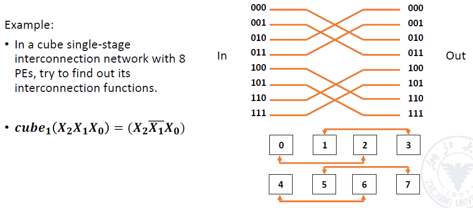

# 6 Data-Level Parallelism in Vector, SIMD, and GPU Architectures

!!! tip "说明"

    本文档正在更新中……

!!! info "说明"

    1. 本文档仅涉及部分内容，仅可用于复习重点知识
    2. 本文档内容对应课本 Chapter 4
    
    > 忙活半天，也不知道这章在干嘛

## 1 Vector Processor

vector processor（矢量处理器）：支持矢量数据（如数组）和矢量指令（如同时操作多个数据）的流水线处理器，典型代表是 SIMD（单指令多数据）架构

scalar processor（标量处理器）：仅支持单个数据操作的流水线处理器，无矢量处理能力

矢量流水线的特点：

1. 低相关性：矢量运算中的元素通常独立，便于并行处理（如矩阵加法）
2. 潜在问题：若矢量处理不当（如数据依赖或资源冲突），可能导致性能下降或功能切换开销

矢量流水线处理需解决的问题：如何优化对矢量/数组的操作（如数据预取、并行计算），以充分发挥流水线的并行性能

矢量处理方式分类：

1. horizontal processing（水平处理）：逐元素顺序计算，适合标量处理器，但效率低（需多次功能切换）
2. vertical processing（垂直处理）：按列并行计算（需硬件支持），适合矢量处理器，可同时处理多列数据
3. vertical and horizontal processing（混合处理）：结合两者优势，分组并行（如 SIMD 指令集）

!!! example "示例"

    计算 D = A x (B + C)，（A，B，C，D 为长度为 N 的矢量）

    **水平处理**

    矢量按行从左到右逐元素计算：

    1. d1 ← a1 x (b1 + c1)
    2. d2 ← a2 x (b2 + c2)
    3. ...
    4. dn ← an x (bn + cn)

    需编写循环程序处理：

    1. ki ← bi + ci
    2. di ← ai x ki

    data related（数据相关）次数：N 次

    Function switching（功能切换）次数：2N 次

    **混合处理**

    1. 数据分组：将长矢量（N）划分为 S 个组（每组 n 个元素），剩余元素（r）单独成组，共 S + 1 个组
    2. 组内垂直处理：每组内所有元素并行计算（如 SIMD 同时计算 n 个 bi + ci）
    3. 组间水平处理：各组串行处理（依次处理第 1 组 → 第 2 组 → … → 第 S + 1 组）

水平处理存在的问题：

1. 计算每个分量时会出现 RAW（写后读）相关，导致流水线效率低下
2. 若使用静态多功能流水线，需频繁切换流水线功能，其吞吐率甚至低于顺序串行执行
3. 水平处理方式不适用于矢量处理器

矢量处理器的 memory-memory structure（内存-内存结构）：直接操作内存中的矢量数据（无需显式加载/存储），但需中间结果写回内存

1. 从内存读取矢量数据到缓冲器
2. 流水线从缓冲器获取数据并行计算
3. 结果经缓冲器写回内存

<figure markdown="span">
  { width="600" }
  <figcaption>内存-内存结构</figcaption>
</figure>

混合处理优势：平衡并行效率与硬件限制（如寄存器容量）

矢量处理器的 register-register structure（寄存器-寄存器结构）：高速存储矢量数据，减少内存访问延迟。运算单元直接与矢量寄存器交互，避免内存带宽瓶颈

### 1.1 CRAY-1

CRAY-1 采用寄存器-寄存器结构，其矢量寄存器（V0-V7）可存储 64 个 64 位元素，支持高速并行计算

<figure markdown="span">
  { width="600" }
  <figcaption>CRAY-1 结构</figcaption>
</figure>

#### 1.1.1 Features of CRAY-1

每个矢量寄存器（V0-V7）与 6 个功能单元（如加法、乘法）直连，实现：数据并行传输（避免总线竞争），功能单元并行运算（如同时执行加法和乘法）

冲突类型：

1. Vi 冲突（寄存器冲突）：当两条指令同时需要读写同一 Vi 时发生
2. 功能单元冲突：多个指令竞争同一运算单元（如两条乘法指令需等待串行执行）

RAW 相关：

1. V0 ← V1 + V2
2. V3 ← V0 + V4

RAR 相关（无冲突）：

1. V0 ← V1 + V2
2. V3 ← V1 x V4

功能单元冲突（都需要乘法单元）：

1. V3 ← V1 x V2
2. V5 ← V4 x V6

只有当第一条矢量指令的最后一个分量执行完毕，浮点乘法功能单元释放后，第二条矢量指令才能开始执行

<figure markdown="span">
  { width="600" }
</figure>

#### 1.1.2 Improve the Performance of Vector Processor

1. 设置多功能单元并行工作：这些功能单元可并行运作，且各自采用流水线方式工作，从而形成多条并行操作流水线

    - 例如：CRAY-1 矢量处理器包含 4 组共 12 条单功能流水线：

        1. 矢量组件：矢量加法、移位、逻辑运算
        2. 浮点组件：浮点加法、乘法、倒数计算
        3. 标量组件：标量加法、移位、逻辑运算、数值"1"/计数
        4. 地址计算组件：整数加法、乘法

2. 采用 link technology（链接技术）加速矢量指令串行执行：针对存在"写后读"相关的两条指令，在功能单元和源矢量无冲突的情况下，可将功能单元链接形成流水处理，从而达到加速执行的目的
3. 使用循环挖掘技术加速循环处理
4. 采用多处理器系统进一步提升性能：现代矢量处理器系统普遍采用多处理器架构

    - CRAY-2：包含 4 个矢量处理器

!!! example "链接技术示例"

    计算表达式：D = A × (B + C)

    假设条件：

    1. 矢量长度：N ≤ 64
    2. 矢量元素为浮点数
    3. 矢量 B 和 C 已存储在 V0 和 V1 寄存器

    实现步骤：

    4. V3 ← memory  // 加载矢量 A
    5. V2 ← V0 + V1  // 浮点加法
    6. V4 ← V2 x V3  // 浮点乘法

    第 1、2 步可并行处理
    
!!! example "例题"

    计算表达式：D = A × (B + C)，A/B/C/D 均为长度 N ≤ 64 的矢量

    使用 3 条指令完成：

    1. V3 ← A (从内存加载)
    2. V2 ← V0 + V1 (矢量加法)
    3. V4 ← V2 × V3 (矢量乘法)

    三种执行方式的时钟周期对比：

    1. 串行执行：3N + 22

        1. 内存加载：(1 + 6 + 1) + N - 1 = 8 + N - 1
        2. 矢量加法：(1 + 6 + 1) + N - 1 = 8 + N - 1
        3. 矢量乘法：(1 + 7 + 1) + N - 1 = 9 + N - 1

    2. 1、2 并行：2N + 15

        - max{(8 + N - 1), (8 + N - 1)} + 9 + N - 1

    3. 使用 link technology：N + 16

        - max{8, 8} + 9 + N - 1

segmented vector（分段矢量技术）：当矢量长度超过矢量寄存器容量时如何处理？

1. 将长矢量分割成固定长度的段（segment）
2. 通过循环处理每个矢量段
3. 每次循环仅处理一个矢量段

## 2 Array Processor

**阵列处理器**

包含大量同构处理单元（PE，processing elements），通过特定方式互连形成阵列结构

所有 PE 同步执行相同指令，适用于规则数据并行计算（如图像处理、矩阵运算）

根据系统中存储器的组成方式，阵列处理器可分为两种基本结构：

1. Distributed memory：分布式内存结构
2. Centralized shared memory：集中式共享内存结构

### 2.1 Parallel Computer Design

并行计算机的 communication architecture（通信架构）是系统核心：

1. 底层的互连网络
2. 上层语言、软件工具包、编译器和操作系统提供的通信支持

并行计算机系统设计问题

1. 互连网络设计
2. 系统性能问题
3. 软件支持问题

互连网络位于并行计算机系统内部，由交换单元按特定拓扑和控制模式组成的网络，用于实现计算机系统内多个处理器或多个功能组件间的互联。在工作原理、概念和术语方面与计算机网络有许多相似之处。某些并行计算机系统的互连网络就是高速以太网和 ATM 网络

#### 2.1.1 Interconnection Network

**互连网络**

互连网络通常包含以下五个部分：

1. CPU：计算处理单元
2. 内存：数据存储单元
3. interface（接口）：信息收发设备（如网卡）
4. link（链路）：物理传输通道（电缆/光纤）
5. switch node（交换节点）：多端口数据交换控制设备

关键要素：

1. 拓扑结构

    1. Static topology：节点间具有固定连接路径，且在程序执行期间连接关系保持不变的网络
    2. Dynamic topology：由交换机构成的网络，可根据应用需求动态改变连接状态。例如总线、交叉开关、多级交换网络等

2. 时序模式

    1. Synchronization system（同步系统）
    2. Asynchronous system（异步系统）

3. 交换方式

    1. Circuit switching（电路交换）
    2. Packet switching（分组交换）

4. 控制策略

    1. Centralized control mode
    2. Distributed control mode

互连网络设计目标：通过有限数量的连接方式，使任意两个处理单元 (PE) 能够在一步或少数几步内完成信息传输，以实现特定问题求解算法

互连网络实现方式：

1. Single-stage interconnection network（单级互连网络）：仅通过有限数量的单层连接实现任意两个处理单元间的信息传输
2. Multi-stage interconnection network（多级互连网络）：由多个单级网络串联组成，实现任意处理单元间的连接

interconnection function（互连函数）原理：

1. 对于互连网络的 N 个输入终端（0, 1, ..., j, ..., N - 1），每个输入终端 j 与输出终端 f(j) 存在函数映射关系
2. 输入 j 和输出 f(j) 通常采用二进制编码，两者编码间存在可推导的对应规律，这个规律就是互连函数

#### 2.1.2 Single-Stage Interconnection Network

单级互连网络类型：

1. Cube Single-Stage Interconnection Network
2. Hyper Cube Interconnection Network
3. PM2I Single-Stage Interconnection Network
4. Shuffle Exchange Network

单级互连网络特征：

1. 结构简单，成本低廉
2. 连接灵活，可适配不同算法需求
3. 传输跳数少，提升阵列运算速度
4. 规则化与模块化程度高，增强系统可扩展性
5. 有利于大规模集成电路实现

##### Cube Single-Stage Interconnection Network

**立方体单级互连网络**

立方体互连函数定义：将 N 个输入输出端口用 n 位二进制编码表示（$n = log₂N$），记为 $Pₙ₋₁...P₁P₀$

存在 n 种不同的互连函数：

$Cube_i(Pₙ₋₁...P_i...P₀) = P_{n-1}...\bar{P_i}...P_0$（即将第 i 位取反）

<figure markdown="span">
  { width="600" }
</figure>

<figure markdown="span">
  { width="600" }
</figure>

<figure markdown="span">
  { width="600" }
</figure>

<figure markdown="span">
  { width="200" }
</figure>

##### Hyper Cube Interconnection Network

**超立方体互连网络**

当维度 n > 3 时，立方体网络称为超立方体网络

互连函数定义：

$Cube_i(Pₙ₋₁...P_i...P₀) = P_{n-1}...\bar{P_i}...P_0$（其中 $0 \leqslant i \leqslant n-1$）

网络特性：

1. n 维超立方体单级网络的最大距离为 n
2. 最多经过 n 次传输即可实现任意两个处理单元 (PE) 间的数据传输

##### PM2I Single-Stage Interconnection Network

**PM2I 单级互连网络技术**

互连函数定义 (2n 个函数)：

$PM2_{+i}(j) = (j+2^i) \mod N$<br/>
$PM2_{-i}(j) = (j-2^i) \mod N$

1. $N$：网络节点总数
2. $0 ≤ j ≤ N-1$（节点编号）
3. $0 ≤ i ≤ log₂N -1$（位移指数）

<figure markdown="span">
  { width="600" }
</figure>

<figure markdown="span">
  { width="600" }
</figure>

<figure markdown="span">
  { width="600" }
</figure>

<figure markdown="span">
  { width="600" }
</figure>

<figure markdown="span">
  { width="600" }
</figure>

<figure markdown="span">
  { width="600" }
</figure>

##### Shuffle Exchange Network

**混洗交换网络**

由两部分构成：混洗 (Shuffle) + 交换 (Exchange)

n 维混洗函数定义：

$shuffle(P_{n-1}P_{n-2}...P_1P_0) = P_{n-2}...P_1P_0P_{n-1}$（$n = \log_2N$）

<figure markdown="span">
  { width="600" }
</figure>

<figure markdown="span">
  { width="600" }
</figure>

<figure markdown="span">
  { width="600" }
</figure>

混洗函数关键特性：经过 N 次混洗操作后，所有 N 个处理单元 (PE) 将恢复初始排列顺序

最大传输距离：从全"0"节点到全"1"节点的数据传输最多需要：n 次交换 + (n-1) 次混洗

网络最大直径：2n-1（n=log₂N）

#### 2.1.3 Array Structure

<figure markdown="span">
  { width="800" }
</figure>

##### Linear Array

**线性阵列**

N 个节点组成的线性阵列包含 N-1 条链路

关键参数：

1. diameter（直径）（最大节点距离）：N-1
2. degree（节点度）：2
3. asymmetry（非对称结构）
4. equal division width（等分带宽）：1

> equal division width（等分带宽）：至少需要切断几条边才能将网络分成两个相等部分

缺点：当 N 较大时通信效率极低

<figure markdown="span">
  { width="400" }
</figure>

##### Circular Array

**环形阵列**

Two-way ring（双向环）：

1. 链路数：N
2. 直径：⌈N/2⌉
3. 节点度：2
4. 对称结构
5. 等分带宽：2

Unidirectional ring（单向环）：

1. 链路数：N
2. 直径：N-1
3. 节点度：2
4. 对称结构
5. 等分带宽：2

<figure markdown="span">
  { width="400" }
</figure>

##### Loop with Chord Array

**带弦环结构**

以 12 节点为例

节点度 = 3 版本

1. 链路数：18 条
2. 直径：4 跳（如图红色节点路径）
3. 非对称结构
4. 等分带宽：2

节点度 = 4 版本

1. 链路数：24 条
2. 直径：3 跳（如图红色节点路径）
3. 对称结构
4. 等分带宽：8

<figure markdown="span">
  { width="400" }
</figure>

##### Tree Array

**完全二叉树**

1. K 层完全二叉树包含 $N=2ᴷ-1$ 个节点
2. 最大节点度：3（根节点）
3. 直径：2(K-1)（最右叶节点到最左叶节点）
4. 非对称结构
5. 等分带宽：1

<figure markdown="span">
  { width="400" }
</figure>

<figure markdown="span">
  { width="400" }
</figure>

##### Star Array

**星型阵列**

本质为二级树结构（如右图所示）

N 个节点组成的星型网络包含：

1. 链路数：N-1 条
2. 直径：2 跳
3. 最大节点度：N-1（中心节点）
4. 非对称结构
5. 等分带宽：1

<figure markdown="span">
  { width="400" }
</figure>

##### Grid

**网格阵列**

r×r 网格（$N=r²$ 个节点）包含：

1. 链路数：2N-2r 条
2. 直径：2(r-1) 跳
3. 节点度：4
4. 非对称结构
5. 等分带宽：r

<figure markdown="span">
  { width="400" }
</figure>

##### 2D Torus

**二维环面**

r×r 网络（$N=r²$ 个节点）包含：

1. 链路数：2N 条
2. 直径：2⌊r/2⌋ 跳
3. 节点度：4
4. 非对称结构

<figure markdown="span">
  { width="400" }
</figure>

##### Hypercube

**超立方体**

n 维立方体包含 $N=2ⁿ$ 个节点：

1. 节点分布：n 维空间，每维 2 节点
2. 直径：n 跳
3. 节点度：n
4. 对称结构

<figure markdown="span">
  { width="400" }
</figure>

##### Cube with Loop

**环状超立方体**

1. 由 $N=2ⁿ$ 个节点环构成
2. 每个节点环包含 n 个节点，形成环形连接
3. 总节点数：$n2ⁿ$
4. 节点度：3
5. 对称结构

<figure markdown="span">
  { width="400" }
</figure>

#### 2.1.4 Network Characteristics

动态网络核心特征

1. 连接关系非固定，可根据程序执行需求动态重构
2. 网络交换单元主动可控，通过开关状态重置链路
3. 仅边界交换单元可连接处理器
4. 主要类型：总线、交叉开关、多级互连网络

总线架构特性

1. 物理本质：连接处理器/内存/I/O的导线与插座组合
2. 传输特性：同一时间仅支持单组源-目的数据传输
3. 仲裁机制：多设备请求时需总线仲裁，CPU 超 32 个时竞争激烈

linear array（线性阵列）与 bus（总线）差异：

| 特性 | 线性阵列 | 总线架构 |
| :--: | :--: | :--: |
| 并发能力 | 多节点可并行使用不同段 | 严格时分复用 |
| 扩展性 | 受限于线延迟 | 受限于仲裁开销 |

<figure markdown="span">
  { width="600" }
</figure>

#### 2.1.4 Multi-Stage Interconnection Network

**多级互连网络**

switch unit（交换单元）记为 m×m（m=2k）

2×2 交换单元按功能可分为：

1. 双功能交换器（2 种合法状态）
2. 四功能交换器（4 种合法状态）

<figure markdown="span">
  { width="600" }
</figure>

<figure markdown="span">
  { width="600" }
</figure>

实现 PE 互连的三种方式：

1. Circular interconnection network（循环互连网络）：通过单级网络多次循环实现全连接
2. Multi-level interconnection network（多级互连网络）：将多个单级网络串联组成
3. Multi-level circular interconnection network（多级循环互连网络）：在多级网络基础上进行多次循环

多级网络差异维度：

1. 交换单元功能差异
2. 交换控制方式差异
3. 拓扑结构差异

---

**Switching Unit**

2 输入/2 输出交换单元是多级互连网络的基本构建模块

端口标识规则：

1. 上方端口标记为 i
2. 下方端口标记为 j

支持四种工作状态：

1. 直连（Straight）
2. 交叉（Exchange）
3. 上广播（Upper broadcast）
4. 下广播（Lower broadcast）

<figure markdown="span">
  { width="400" }
</figure>

- 双功能交换单元：仅支持直连和交叉两种状态
- 四功能交换单元：支持全部四种基础功能

多端交换单元增强，新增功能模块：

1. 广播 (Broadcast) 功能
2. 组播 (Multicast) 功能

<figure markdown="span">
  { width="400" }
</figure>

---

多级网络拓扑类型:

1. Multi-stage cube（多级立方体网络）
2. Multi-stage shuffle exchange（多级混洗交换网络）
3. Multi-stage PM2I（多级 PM2I 网络）
4. 上述网络的组合拓扑

多级立方体互连网络三大特征：

1. 交换单元：采用双功能交换单元（直连/交叉）
2. 控制方式：

    1. 级控制（Stage Control）
    2. 部分级控制（Part Stage Control）
    3. 单元控制（Unit Control）

3. 拓扑结构：立方体连接架构

##### Multi-Stage Cube Interconnection Network

**多级立方体网络**

多级立方体网络构建步骤：

1. 确定网络级数：根据 n=log₂N 计算立方体维度数
2. 级编号规则：从输入到输出依次编号为 0,1,...,n-1 级
3. 交换单元布置：每级布置 N/2 个双功能交换单元
4. 端口编址规则：第 i 级交换单元的输入/输出端口按 Cube 关系编号
5. 级间连接：同级同编号交换单元端口互连

<figure markdown="span">
  { width="600" }
</figure>

多级立方体网络分类：

1. Switched network（交换网络）
2. Mobile number network（移数网络）

Flip Network：

1. 采用级控制方式的多级立方体网络
2. 仅能实现交换功能（数据位置互换）

交换函数定义：对称交换组内元素：当组内包含 $2ˡ$ 个元素时，将第 k 个元素与第 $[2ˡ-(k+1)]$ 个元素互换

<figure markdown="span">
  { width="600" }
</figure>

##### Multi-Stage Shuffle Exchange Network

**多级混洗交换网络**

多级混洗交换网络（又称 Omega 网络）具有以下特征：

1. 交换功能：采用四功能交换单元（直连/交叉/上广播/下广播）
2. 拓扑结构：混洗拓扑 + 四功能交换的组合架构
3. 控制方式：单元级独立控制（Unit Control）

<figure markdown="span">
  { width="600" }
</figure>

基础架构参数：

1. 网络级数：$n=log₂N$（N 为处理单元总数）
2. 级编号规则：从输入到输出依次为 n-1, ..., 1, 0 级
3. 交换单元数：每级 N/2 个四功能交换单元
4. 拓扑组合：混洗连接 + 四功能交换

<figure markdown="span">
  { width="600" }
</figure>

当限制 Omega 网络仅使用"直连"和"交叉"功能时，该网络即成为 n 立方体网络的逆网络

<figure markdown="span">
  { width="600" }
</figure>

<figure markdown="span">
  { width="600" }
</figure>

Omega 网络与 n 立方体网络对比：

1. 数据流级别顺序

    1. Omega 网络：n-1, n-2,...,1,0（倒序）
    2. n 立方体网络：0,1,...,n-1（正序）

2. 交换单元功能

    1. Omega 网络：四功能交换单元（直连/交叉/上广播/下广播）
    2. n 立方体网络：双功能交换单元（仅直连/交叉）

3. 广播支持能力

    1. Omega 网络：支持一对多广播
    2. n 立方体网络：不支持广播功能

<figure markdown="span">
  { width="600" }
</figure>

---

<figure markdown="span">
  { width="800" }
</figure>

## 3 GPU

**Graphical Processing Units**

1. Heterogeneous（异构）执行模型：CPU 作为主机(host)，GPU 作为设备(device)
2. 专用编程语言：开发类 C 语言的 GPU 编程语言
3. 统一并行抽象：将所有 GPU 并行形式统一为 CUDA 线程
4. 编程模型："单指令多线程" (SIMT) 执行模型

CUDA 架构本质

1. 全称：计算统一设备架构 (Compute Unified Device Architecture)
2. 核心思想：硬件通过多线程 SIMD 处理器执行整块线程
3. 本质定义：GPU 实质是多线程 SIMD 处理器

线程组织层次：

1. 线程 (Thread)：与每个数据元素关联的基本执行单元
2. 线程块 (Block)：由多个线程组成（通常 ≤ 1024 线程）
3. 网格 (Grid)：由多个线程块组成的全局执行单元

内存层次结构：

| 内存类型 | 作用域 | 典型容量 | 延迟周期 |
| :--: | :--: | :--: | :--: |
| 全局内存 GPU memory | 全网格共享 | GB 级 | 200-300 |
| 局部内存 Local memory | 线程块内共享 | KB 级 | 20-30 |
| 私有内存 Private memory | 单个 CUDA 线程独享 | 寄存器级 | 1 |

NVIDIA GPU 与向量机的对比

相似点:

1. 数据级并行：擅长处理数据并行问题
2. 内存操作：支持分散-聚集 (scatter-gather) 传输
3. 掩码寄存器：支持条件执行
4. 大寄存器文件：减少内存访问延迟

差异:

1. 架构设计：

    1. GPU 无独立标量处理器
    2. 采用多线程隐藏内存延迟

2. 执行单元：

    1. GPU 含大量功能单元
    2. 向量机使用少量深度流水单元

## 4 Loop-Level Parallelism

**LLP**

循环级并行的重要性:

1. 程序循环是多种并行性的源泉
2. 发掘和利用循环级并行对开发以下技术至关重要：

    1. 数据级并行 (DLP)
    2. 线程级并行 (TLP)
    3. 激进静态指令级并行 (如 VLIW)

循环级并行性分析的重点在于判断后续迭代的数据访问是否依赖于前面迭代产生的数据值，即是否存在循环携带依赖 (Loop-carried dependence)

无循环携带依赖：

```c linenums="1"
for (i = 999; i >= 0; i = i - 1)
    x[i] = x[i] + s;  // 每次迭代独立
```

复杂依赖关系：

```c linenums="1"
for (i = 0; i < 100; i = i + 1) {
    A[i+1] = A[i] + C[i];    /* S1 */
    B[i+1] = B[i] + A[i+1];  /* S2 */ 
}
```

依赖关系：

1. S1 使用前次迭代 S1 计算的结果
2. S2 使用同次迭代 S1 计算的结果

非循环依赖的并行模式：

<div class="grid" markdown>

```c linenums="1" title="原始循环"
for (i=0; i<100; i=i+1) {
    A[i] = A[i] + B[i];     /* S1 */
    B[i+1] = C[i] + D[i];   /* S2 */
}
```

```c linenums="1" title="等效展开形式"
A[0] = A[0] + B[0];  // 初始迭代
for (i=0; i<99; i=i+1) {
    B[i+1] = C[i] + D[i];
    A[i+1] = A[i+1] + B[i+1];
}
B[100] = C[99] + D[99];  // 最终迭代
```

</div>

S1 使用前次迭代 S2 计算的 B[i] 值，依赖关系非环形（单向数据流），因此该循环仍可并行化