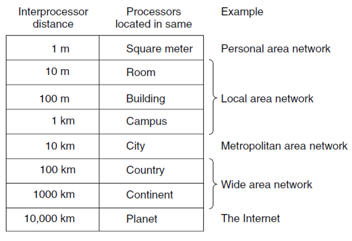

# 1 Introduction

<!-- !!! tip "说明"

    本文档正在更新中…… -->

!!! info "说明"

    本文档仅涉及部分内容，仅可用于复习重点知识

## 1 Uses of Computer Networks

##### 1.1 Access to Information

client-server model

<figure markdown="span">
    { width="600" }
</figure>

<figure markdown="span">
    { width="600" }
</figure>

peer-to-peer communication：没有固定的 server 和 client

<figure markdown="span">
    { width="600" }
</figure>

##### 1.2 Person-to-Person Communication

instant messaging

##### 1.3 Electronic Commerce

##### 1.4 Entertainment

##### 1.5 The Internet of Things

**物联网**（IoT）

## 2 Types of Computer Networks

##### 2.1 Broadband Access Networks

**宽带接入网络**

Metcalfe's law：网络的价值与用户数量的平方成正比

宽带接入通过铜线（copper）、同轴电缆（coaxial cable）或者光纤（optical fiber）进入家庭

##### 2.2 Mobile and Wireless Access Networks

IEEE 802.11 标准：WiFi

Mobile computing 和 Wireless networking 并不是相同的概念

<figure markdown="span">
    { width="600" }
</figure>

##### 2.3 Content Provider Networks

**Data-center Network（数据中心网络）**

CDN（Content Delivery Network）是大量服务器的集合，在地理上分布于各处

##### 2.4 Transit Networks

ISP（Internet Service Provider）之间的连接通常依赖于一个传输网络

##### 2.5 Enterprise Networks

VPN（Virtual Private Network，虚拟专用网络）

VoIP（Voice over IP，IP 语音）

## 3 Network Technology: from local to global

分类 networks 的两个维度：

1. transmission technology

    1. broadcast links (Multicasting)
    2. point-to-point links (Unicasting)

2. scale

<figure markdown="span">
    { width="600" }
</figure>

the transmission rate of a link measured in **bits/second**

##### 3.1 Personal Area Networks

**PAN（个域网）**

##### 3.2 Local Area Networks

**LAN（局域网）**

静态方式分配资源：

多址接入技术的核心目的就是：让多个用户能够共享同一个通信信道而不会相互干扰

1. FDMA（频分多址）：

    1. **分频率**。把总的可用频带划分成多个互不重叠的、更窄的频率子带，每个用户分配一个专用的子带（频率）进行整个通话过程
    2. 这就像一条宽阔的高速公路被划分成了多条平行的车道。每辆车（用户）始终行驶在自己的专属车道上，互不侵占

2. TDMA（时分多址）：

    1. **分时间**。所有用户共享同一个频率带宽，但时间被划分成重复的帧，每一帧又分成若干个时隙（time slot）。每个用户在一个周期内被分配一个特定的时隙来传输数据
    2. 这就像只有一个演讲台（共享频率），但为不同的人分配了不同的发言时间段（时隙）。A 在 1-2 分钟说，B 在 2-3 分钟说，C 在 3-4 分钟说，如此循环。由于切换得非常快，用户感觉像是在持续通信

3. CDMA（码分多址）：

    1. **分编码**。这是最巧妙的一种方式。所有用户同时使用整个可用的频率带宽进行传输。通过为每个用户分配一个唯一的、正交的编码序列（伪随机码） 来区分不同用户的信息

        1. 发送端：将原始数据信号与独有的编码序列进行“混合”（相乘），生成一个扩频信号后再发射
        2. 接收端：使用与发送端完全相同的编码序列对接收到的信号进行“解码”。只有匹配编码的信号才会被还原成强大的原始数据，其他用户的信号则被视为低功率的背景噪音

    2. 这就像一个鸡尾酒会，很多人（用户）在同一个房间（频率）里同时用不同的语言（编码）交谈。一个只懂英语的人（接收器）可以从一片嘈杂声中筛选出英语对话并理解它，而其他语言对他来说只是无意义的背景音

动态方式分配资源：动态分配意味着信道的使用权不是预先固定分配的，而是根据节点的实时需求进行分配。这对比于静态分配（如 FDMA、TDMA 中固定划分资源）能实现更高的资源利用效率

1. centralized：存在一个中央控制器（或称主站、基站、接入点（Access Point， AP））。这个控制器拥有全局信息，并全权负责信道的分配决策
2. decentralized：没有中央控制器。所有网络节点地位平等（对等），通过一套预先定义好的规则（协议）自行决定何时可以传输

##### 3.4 Metropolitan Area Network

**MAN（城域网）**

最有名的例子：cable television（有线电视网）

<figure markdown="span">
    { width="600" }
</figure>

##### 3.5 Wide Area Network

**WAN（广域网）**

subnet（子网）由两个不同部分组成：

1. transmission line：传输线路
2. switching element：交换设备（交换机）

<figure markdown="span">
    { width="600" }
</figure>

1. 使用 VPN 的 WAN
2. 使用 ISP 网络的 WAN

    1. routing algorithm（路由算法）：一个网络决定该使用哪一条路径的过程
    2. forwarding algorithm（转发算法）：每台路由器决定将一个数据包接下来发送到哪里的过程

<figure markdown="span">
    { width="600" }
</figure>

<figure markdown="span">
    { width="600" }
</figure>

cellular telephone network（蜂窝电话网络）是采用 wireless 技术的 WAN 的例子

##### 3.6 Internetworks

**互联网络**

gateway（网关）：将两个或多个网络连接起来并提供必要的转译设备，其硬件和软件两方面合起来的总称

## 4 Examples of Networks

##### 4.1 The Internet

1. Internet born in 1969, called ARPANET
2. NSFNET：1986
3. 1991：Tim Berners - Lee 发布 World Wide Web（www）
4. 1993：Mosaic（后来成为 netscape）

<figure markdown="span">
    { width="600" }
</figure>

##### 4.2 Mobile Networks

<figure markdown="span">
    { width="600" }
</figure>

蜂窝网络：在一个蜂窝内，为用户分配互相不干扰的信道。这使得相邻蜂窝中的频谱得以很好地重复使用，既频率复用，从而增加了整个网络的容量

<figure markdown="span">
    { width="600" }
</figure>

当用户移出一个蜂窝基站的覆盖范围，进入另一个蜂窝基站的覆盖范围时，数据流必须从旧蜂窝基站重新路由到新蜂窝基站。这一技术称为 handover（移交）或 handoff（转交）

有可能在与旧基站断开连接之前就连接到了新基站，这样可以提高移动连接的质量。移动设备在很短的一瞬间实际上连接了两个基站，这样的移交方式称为 soft handover（软移交）

<figure markdown="span">
    { width="600" }
</figure>

##### 4.3 Wireless Networks

multipath fading（多径衰减）：无线电信号的回波可能相互抵消或增强，造成接收到的信号出现大幅波动

解决方法时 path diversity（路径多样性）

## 5 Network Protocols

##### 5.1 Design Goals

1. reliability
2. resource allocation
3. evolvability
4. security

##### 5.2 Protocol Layering

protocol stack（协议栈）：每一层一个协议

##### 5.3 Connections and Reliability

每一层可以向上面的层提供两种类型的服务：

1. connection-oriented service（面向连接）：两端直接建立连接
2. connectionless service（无连接）：通过中间节点，一步一步的传输数据

<figure markdown="span">
    { width="600" }
</figure>

##### 5.4 Service Primitives

**服务原语**

<figure markdown="span">
    { width="600" }
</figure>

<figure markdown="span">
    { width="600" }
</figure>

##### 5.5 The Relationship of Services to Protocols

<figure markdown="span">
    { width="600" }
</figure>

## 6 Reference Models

##### 6.1 The OSI Reference Model

ISO（International Standards Organization，国际标准化组织）

OSI（Open Systems Interconnection，开放系统互连）参考模型

<figure markdown="span">
    { width="600" }
</figure>

##### 6.2 The TCP/IP Reference Model

<figure markdown="span">
    { width="600" }
</figure>

1. link layer
2. internet layer：IP（internet protocol），ICMP（internet control message protocol）
3. transport layer

    1. TCP（transport control protocol）：可靠的、面向连接的
    2. UDP（user datagram protocol）：不可靠的、无连接的

4. application layer：HTTP，SMTP，RTP，DNS

<figure markdown="span">
    { width="600" }
</figure>

##### 6.5 The Model Used in This Book

<figure markdown="span">
    { width="200" }
</figure>

## 7 Standardization

## 8 Policy, Legal and Social Issues

## 9 Metric Units

<figure markdown="span">
    { width="600" }
</figure>