# 2 The Physical Layer

<!-- !!! tip "说明"

    本文档正在更新中…… -->

!!! info "说明"

    本文档仅涉及部分内容，仅可用于复习重点知识

物理层是网络协议栈中最底层、最基础的一层。它负责在物理媒介上实际传输原始的比特流。它规定了通信接口的电气特性（如电压水平）、时序特性（如同步时钟）等机械和电气规范。其核心任务是将数据链路层传来的比特转换成可以通过某种传输介质（如网线、光纤、无线电波）传播的信号（如光信号、电信号、电磁波）

衡量物理信道性能的三个关键参数：

1. throughput（吞吐量）：指信道在单位时间内能成功传输的数据量，通常用 bps（比特每秒）衡量，代表了信道的"速度"或"容量"
2. latency（延迟）：指一个比特或数据包从发送端到接收端所需的时间。低延迟对于实时应用（如语音、视频通话）至关重要
3. error rate（误码率）：指在传输过程中发生错误的比特所占的比例。它衡量了信道的传输可靠性

## 1 The Theoretical Basis for Data Communication

### 1.1 Fourier Series

Fourier Series：任何复杂的、周期性的信号或函数，都可以看作是由一系列简单的正弦波和余弦波（这些波具有不同的频率和振幅）叠加而成的

作用：

1. 分析与分解（fourier analysis）：它能够揭示一个复杂周期信号内部隐藏的“频率成分”。通过计算 Fourier 系数，我们可以知道哪些频率的波在信号中占主导地位，它们的振幅和相位各是多少
2. 合成与重建（fourier synthesis）：既然复杂信号可以被分解为简单正弦波的叠加，那么反过来，用这些简单正弦波也可以重新构造出原始信号

### 1.2 Bandwidth-limited Signals

没有任何通信信道能在传输信号的过程中不损失一些功率。如果所有的傅里叶分量都被同等程度地减弱，那么产生的信号幅度会减小，但形状不会失真。但是，大多数实际通信信道对不同频率分量的影响是不同的

通常，对于一根导线，频率从 0 到某个 **cutoff frequency**（截止频率）$f_c$ 的信号，其振幅在传输过程中基本不受衰减，而所有高于此截止频率的信号都会衰减

未被显著衰减的频率范围的宽度被称为 **bandwidth**（带宽）。带宽是传输介质的 **物理属性**，它取决于例如导线或光纤的构造、粗细和长度

<figure markdown="span">
    { width="600" }
</figure>

- baseband signals（基带信号）：指未经频率搬移的原始信号，其频率成分从零频率开始，一直延伸到某个最大频率
- passband signals（通带信号）：指将基带信号通过 **调制** 技术，将其频谱搬移到一个更高的、指定的频率范围上所形成的信号。它的频谱不再从零开始，而是集中在某个 **载波频率** 附近的一个频带内

<figure markdown="span">
    { width="600" }
</figure>

<figure markdown="span">
    { width="600" }
</figure>

- analogue bandwidth（模拟带宽）：

    - 电气工程 / 物理学领域
    - 信道能够有效传输的频率范围的宽度。这是一个描述物理信道本身固有特性的指标
    - 单位：Hz

- digital bandwidth（数字带宽）：

    - 计算机科学 / 网络领域
    - 信道能够传输数据的最大速度，即数据速率。这是一个描述信道信息传输能力的性能指标
    - 单位：bit / s

> 将通信信道比作一条水管。模拟带宽相当于水管的直径。它描述了水管本身的物理属性：能容纳多“宽”的水流；数字带宽相当于单位时间内通过水管的水量。它描述了水管实际的输送能力

因此，一个信道的物理特性（模拟带宽）从根本上限制了它所能达到的最大数据速率（数字带宽）

### 1.3 The Maximum Data Rate of a Channel

Channel Capacity（信道容量）：表示在特定的物理条件下，一条信道所能可靠传输信息的最高速度（单位：bps）。这是一个理论极限值，实际通信系统的数据速率只能无限接近，但无法超过它

1. data rate：这是我们希望达到的目标，即实际的数据传输速度（bps）
2. bandwidth：信道的频率宽度（Hz）。它受两方面影响：物理限制和法规 / 设计限制
3. noise：信道中不希望存在的随机干扰信号
4. error rate：衡量传输可靠性的指标，即错误比特占总比特数的比例。它是数据速率和噪声水平共同作用的表现

### 1.4 Nyquist Bandwidth

**奈奎斯特准则**：解决了在 **理想无噪声** 信道中如何实现最高速率且无失真的传输问题

即使信道是完美的（没有任何噪声），其传输容量也不是无限的。这个极限并非来自噪声，而是来自信道本身的 **带宽限制**

研究的问题是：给定一个带宽为 $B\ Hz$ 的信道，每秒最多能发送多少个脉冲符号而不产生混淆？

!!! tip "关键问题：inter-symbol interference"

    **码间干扰**（ISI）：由于信道带宽有限，脉冲在传输过程中会被展宽，导致当前脉冲的“尾巴”会蔓延到后续脉冲的时间段内，从而在接收端采样时对相邻脉冲的判决造成干扰

    产生原因：数字信号最初通常由理想的矩形脉冲表示（例如，高电压代表‘1’，低电压代表‘0’）。然而，数学分析（傅里叶变换）表明，这种时间上完美的“方波”包含了无限宽的频率成分（频谱无限延伸）

    <figure markdown="span">
        { width="600" }
    </figure>

    而任何物理信道都有有限的带宽，它只允许低于截止频率的成分通过，会截断矩形脉冲的高频成分。这就会导致被截断后的脉冲在时域上不再是干净的矩形。它会产生拖尾，蔓延到本属于其他符号的时间段内，产生了码间干扰

    > 矩形方波（时域上矩形，频域上无限延伸）$\xrightarrow[高于截止频率的成分被截断]{经过一个物理信道}$ $\xrightarrow{再根据频谱分析出时谱}$ 在时域上不再是干净的矩形，产生拖尾，影响其他符号

最优脉冲形状：sinc 函数：$\dfrac{\sin2\pi Bt}{2\pi Bt}$

1. 频谱受限：它的频率成分完美地限制在 $[-B,B]\ Hz$ 的范围内，完全符合信道带宽要求
2. 无 ISI：在它自己的中心采样点值为 1，而在所有其他符号的采样时刻值恰好为 0

**奈奎斯特速率**：使用这样的脉冲，每秒最多能传输 $2B$ 个符号。这个上限 $R_s = 2B\ symbols / s$ 就被称为奈奎斯特速率

因此，信道带宽 $B$ 直接决定了无码间干扰的最大符号速率

如果每个符号能够携带 2 个离散值（即二进制，1 bit），那么最大比特率就是 $2B$ bps。现在假设每个符号能够携带 $V$ 个离散值，即每个符号携带 $\log_2 V$ 比特的信息，那么最大比特率就是

$C = 2B \log_2 V$

> - $C$：就是信道容量，最大比特率
> - $V$：调制电平数

意义：在带宽固定的情况下，可以通过提高 $V$ 来线性地提升数据速率

!!! tip "无限制提高电平数"

    1. 增加接收端负担：在二进制系统中，接收机只需判断信号是‘高’还是‘低’。而在多电平系统中，接收机必须能非常精确地区分出信号细微的电压（或相位）差异。这对接收机的硬件精度和稳定性要求更高
    2. 噪声的限制：此公式是在无噪声前提下成立的。现实中，信道永远存在噪声

### 1.5 Shannon Capacity

$V$ 可以安全地增加到多大呢，这就是香农定理告诉我们的，答案是信道的 **信噪比**

$C = B\log_2(1+SNR)\ bit / s$

> 该公式仅考虑白噪声，未考虑衰减、延迟或脉冲噪声

!!! tip "SNR"

    $SNR$：信噪比，使用线性标度（而非分贝 $dB$）
    
    $SNR_{db} = 10\log_{10}(\dfrac{\text{signal power}}{\text{noise power}}) = 10\log_{10}(SNR)$

意义：这个公式给出了在带宽为 $B$、信噪比为 $SNR$ 的特定信道上，无论采用多么先进的编码或调制技术，都无法超过的无差错传输速率上限

1. 高 SNR 情况（$SNR \gg 1$）：$C = B\log_2(SNR)$。此时，**增加带宽** 是提高容量的更有效手段
2. 低 SNR 情况（$SNR \ll 1$）：$C = B\dfrac{SNR}{\ln 2} = \dfrac{B}{\ln 2} \dfrac{P}{N_0B} = \dfrac{P}{N_0 \ln 2}$（$N_0$ 是单边噪声功率谱密度，$P$ 是信号功率）。在信号被噪声淹没的“极差”信道中，容量的提升与 $SNR$ 呈线性关系，但与带宽 $B$ 几乎无关。此时，**提高发射功率** 或 **降低噪声** 比增加带宽更有效

> 香农容量是一个理论极限，实际系统由于编码复杂度、开销等因素，无法达到该极限，只能无限接近

## 2 There Kinds of Transmission Media

### 2.1 Guided Transmission Media

**导向型传输介质**

##### 2.1.1 Persistent Storage

**持久存储**：（如硬盘、磁带、大容量固态硬盘）本身被视作一种物理传输容器。数据不是通过信号在线路中传播，而是通过运输存储介质本身来完成传递

优势：极高的带宽，极低的成本

> 永远不要低估一辆飞驰在高速公路上的、装满磁带的旅行车的带宽

对于传输海量非实时数据（如数据中心之间的备份、科研机构交换天文或基因组数据），这种方式的每比特成本可能远低于构建一条超高速专用网络线路

弱点：极高的延迟。通常是小时、天甚至周级

##### 2.1.2 Twisted Pairs

**双绞线**：由两根绝缘的铜导线组成，导线像 DNA 分子一样以螺旋形式绞合在一起

!!! tip "绞合的目的"

    抗电磁干扰：这是最关键的设计。平行线会形成“环路天线”，极易接收外部电磁干扰。绞合可以确保每一小段导线受到的干扰强度平均化，使得噪声在两根导线上产生的效应基本一致

信号传输方式：差分信号。信号不是以单根线对地的电压来代表，而是以两根线之间的 **电压差** 来代表。当外部噪声同时耦合到两根线上时，虽然它们的绝对电压会波动，但两者之间的电压差保持不变，从而有效抵消了共模噪声

双绞线的带宽取决于线径（越粗损耗越小）和距离（越短速率越高），是典型的带宽受限信道

<figure markdown="span">
    { width="600" }
</figure>

通信模式：

1. simplex（单工）（单行道）：数据只能在一个方向上传输
2. half duplex（半双工）（对讲机，一方说完另一方才能说）：数据可以双向传输，但不能同时进行。使用两对线，各管一个方向。100-Mbps 以太网
3. full duplex（全双工）（电话通话，双方可以同时听和说）：数据可以同时进行双向传输。使用全部四对线，通过电路技术消除自身发送信号的干扰。1-Gbps 以太网	

UTP 是最常用的类型，成本低，柔韧性好

##### 2.1.3 Coaxial Cable

**同轴电缆**

通常用于有线电视、城域网以及为家庭提供高速互联网接入

现代同轴电缆的带宽最高可达数 GHz

<figure markdown="span">
    { width="600" }
</figure>

##### 2.1.4 Power Lines

**电力线**

数据信号被叠加在低频电力信号上

使用家庭电力线组网面临的困难在于，电力线最初是为输送电力而设计的。不同房屋的布线电气特性各不相同，并且会随着电器的开关而发生变化，这会导致数据信号在线路中反射。电器开关时产生的瞬态电流会在很宽的频率范围内产生电气噪声

<figure markdown="span">
    { width="600" }
</figure>

##### 2.1.5 Fiber Optics

**光纤**

光波的频率极高，这意味着其潜在可用的频带宽度巨大，能够承载的数据量几乎是“无限”的

核心考量：成本。尤其是在 “最后一英里”

1. 网络骨干网：长途干线几乎已全部光纤化，因为其单位距离的传输成本远低于铜缆
2. “最后一英里”：指从运营商的网络节点到用户家庭的最终连接段。这是部署成本最高、最复杂的部分（需要挖沟、穿管、入户施工）。虽然光纤本身不贵，但安装的人工和工程成本很高。这也是为什么光纤到户的普及需要一个过程

应用场景：

1. 长途骨干传输
2. 高速局域网
3. 高速互联网接入

一个基本的光纤通信系统需要：

1. light source：将电信号转换为光信号（LED，半导体激光器）
2. transmission medium：即光纤本身，一种极细的玻璃或塑料纤维，通过全反射原理引导光波传播
3. detector：在接收端将光信号转换回电信号

光信号在光纤中传输时，其功率会随着距离增加而逐渐减弱，这种现象称为衰减。它是限制光纤无中继传输距离的最主要因素

光在玻璃中的衰减并非对所有颜色的光都一样。它强烈依赖于光的 **波长**。存在特定的 “低损耗窗口” ，在这些窗口内，光的衰减最小

<figure markdown="span">
    { width="600" }
</figure>

<figure markdown="span">
    { width="600" }
</figure>

纤芯由玻璃包层包裹，包层的折射率低于纤芯，以便将光限制在纤芯内传播

- multimode fiber（多模光纤）：众多不同角度的光射线会在其中以不同角度反射传播
- single-mode fiber（单模光纤）：光只能以直线方式传播

<figure markdown="span">
    { width="600" }
</figure>

光纤相对于铜线的优势：

1. 支持更高的带宽
2. 不受电源浪涌、电磁干扰、电源故障、腐蚀性化学物质的影响
3. 纤细且轻便
4. 不会泄漏光信号
5. 难以被窃听

光纤的劣势：

1. 技术相对不普及，需要特定的工程技能
2. 光纤过度弯曲时易损坏

### 2.2 Wireless

<figure markdown="span">
    { width="600" }
</figure>

大多数传输使用一个相对窄的频带，它们将信号集中在这个窄带内，以高效利用频谱，并通过发射足够的功率来获得合理的数据速率

然而，在某些情况下，会使用更宽的频带，主要有三种变体：

1. 跳频扩频（frequency hopping spread spectrum）：发射机以每秒数百次的速率在不同的频率之间跳跃。该技术已被商业化应用，例如在蓝牙和旧版本的 802.11 中
2. 直接序列扩频：CDMA（码分多址）
3. UWB（超宽带）：UWB 发送一系列极快的脉冲，通过改变脉冲的位置来传递信息。这种快速的跳变导致信号能量被稀疏地散布在一个非常宽的频带上

##### 2.2.1 Radio Transmission

无线电波易于产生，能够长距离传播，并且容易穿透建筑物，因此被广泛用于室内和室外通信。无线电波是全向的（omnidirectional），这意味着它们从源点向所有方向传播，因此发射机和接收机无需在物理上精确对准

无线电波的特性与频率相关：

1. 在低频率下，无线电波能很好地穿透障碍物，但其功率随距离源头的距离增加而急剧衰减。这种衰减称为路径损耗（path loss）
2. 在高频率下，无线电波倾向于直线传播并会从障碍物上反射

对于光纤、同轴电缆和双绞线，信号每单位距离衰减的比例是固定的，而对于无线电，信号在距离加倍时衰减的比例是固定的。这种行为意味着无线电波能够进行长距离传输，但同时也导致用户间干扰成为一个问题

<figure markdown="span">
    { width="600" }
</figure>

##### 2.2.2 Microwave Transmission

在 100 MHz 以上，电波几乎沿直线传播，因此可以被窄波束聚焦。通过抛物面天线将所有能量集中到一个小的波束中，可以获得高得多的信噪比，但收发天线必须精确对准

微波沿直线传播，因此如果塔间距过远，地球的曲率会阻挡信号。所以，需要周期性地设置中继站。中继站之间的距离大致与塔高的平方根成正比

延迟到达的波可能与直达波相位相反，从而导致信号抵消。这种效应称为多径衰落（multipath fading）

##### 2.2.3 Infrared Transmission

**红外传输**

非导向性的红外波被广泛用于短距离通信。它们具有较强的方向性、成本低廉且易于制造，但有一个主要缺点：无法穿透固体物体

与必须获得许可才能使用 ISM 频段以外频率的无线电系统不同，使用红外系统无需政府许可证

##### 2.2.4 Light Transmission

<figure markdown="span">
    { width="600" }
</figure>

与微波传输不同，光传输不需要获得政府批准。对流气流（如风、温度变化、雾等）会干扰激光通信系统

### 2.3 Satellites

<figure markdown="span">
    { width="600" }
</figure>

<figure markdown="span">
    { width="600" }
</figure>

MEO（中地球轨道）卫星：

- 位于较低的高度，在两个范艾伦辐射带之间
- 在经度上缓慢漂移（绕地球一圈约 6 小时）
- 当它们划过天空时，地面站必须进行跟踪
- 在地面上的覆盖范围（足迹）较小
- 到达它们所需的发射器功率较低

用于导航系统：大约由 30 颗 GPS（全球定位系统）卫星组成的星座，在约 20,200 公里的高度运行

通信卫星在一些光纤无法胜任的主要利基市场中占据优势：

1. 快速部署
2. 用于地面基础设施不发达地区的通信
3. 当广播至关重要时

## 3 Digital Modulation and Multiplexing

物理世界（信道）是模拟的（连续变化的波形），计算机世界（数据）是数字的（离散的 0 和 1）

**digital modulation** 就是连接这两个世界的桥梁。它的任务是将比特流转换成适合在特定信道（如电缆、空中、光纤）中传输的模拟波形

- baseband transmission（用于有线信道）：直接改变电压水平来表示比特
- passband transmission（用于无线和光信道）：通过调整载波信号的 **amplitude**、**phase** 和 **frequency** 来传递比特。这就是调幅 (ASK)、调频 (FSK)、调相 (PSK) 的基础

**Multiplexing**（多路复用）：允许多个独立的信号共享同一物理信道的技术，从而极大地提高了信道的利用率

### 3.1 Baseband Transmission

<figure markdown="span">
    { width="600" }
</figure>

> Bipolar encoding：0 则低电平，1 则正电平或负电平

信道带宽是有限的资源，在有限的带宽内实现更高的数据速率的一种策略是使用两个以上的信号电平，即多电平调制

在相同的比特率下，使用的电平数越多，符号率（波特率，baud rate）就越低。更低的符号率意味着信号变化更慢，所需的基础带宽也就越窄，从而实现了带宽效率的提升

> baud rate：单位时间内传输的符号数量

#### 3.1.1 Manchester Encoding

当发送端将多个比特编码成一个符号（例如，多电平调制）或简单地以固定速率发送比特流时，接收端需要一个与发送端完全同步的时钟。它必须精确地知道应该在哪个时间点对信号进行采样，以判断当前是哪个符号或哪个比特

解决这个同步问题的方法：

1. 使用一根专门的线路来传输时钟信号：不现实
2. 将时钟信息嵌入数据信号：通过编码规则，确保数据信号本身包含丰富的时钟信息，使接收端能够从中提取出同步时钟。**manchester** 编码便使用这个方法

> 从上图可以看出，Manchester 编码是 NRZ 和 Clock 异或的结果

其缺点则是所需的带宽是 NRZ 编码的两倍

!!! quote ""

    许多 Ethernet 技术使用 Manchester 编码

#### 3.1.2 NRZI

如果出现长串的 `0`，信号会陷入长时间不变的状态，接收端难以分辨出信息

解决方法：Scrambling（加扰）。发送端将一个伪随机二进制序列与原始数据流进行按位异或操作，生成一个看起来近似随机的“加扰”后的数据流，然后再进行线路编码；接收端使用相同的伪随机序列对接收到的信号再次进行异或操作。由于异或操作的特性和相同的序列，可以完美地恢复出原始数据

作用：

1. 避免电磁干扰：如果数据是重复的模式，经过线路编码后，信号会呈现出很强的周期性。这种周期性在频域上表现为能量集中在几个单一的、非常尖锐的频率分量上（就像一根根“能量尖刺”）。这些强能量尖刺会像小型无线电发射器一样，辐射出强烈的电磁干扰，影响其他电子设备。加扰破坏了数据的周期性，将集中的能量“打散”，使其平均分布在整个频带上，频谱形状更平坦，类似于白噪声，从而显著降低了电磁辐射
2. 有助于接收端同步：虽然加扰的主要目的不是同步，但一个近似随机的信号通常能提供比重复性信号更丰富的电平跳变，间接有利于接收端保持时钟同步

!!! quote ""

    用于连接计算机外设的流行标准 USB（通用串行总线）就使用了 NRZI 编码

#### 3.1.3 Bipolar Encoding

Balanced signals：一个信号，如果在一段时期内（哪怕是很短的时间），其正电压的“量”和负电压的“量”相等，即电压平均值（DC component，直流分量）为零，那么这个信号就是平衡信号

没有直流分量是一个优点：

1. 避免信道对 DC 分量的衰减：某些信道（如同轴电缆或带有变压器的线路）由于其物理特性，会强烈衰减直流分量
2. 便于电容耦合：电容具有“隔直通交”的特性。它阻挡直流分量，只允许交流分量通过。使用电容耦合是一种简单、廉价的连接方式。如果信号本身是平衡的，就可以直接使用电容耦合而不用担心信号失真

而 Bipolar Encoding 就是一种实现平衡信号的编码方法

- `0`：用 0 V 表示
- `1`：交替地用 +V（正电压）和 -V（负电压）表示

### 3.2 Passband Transmission

为了有效地辐射电磁波，天线的物理尺寸通常需要与信号的波长处于同一数量级。而一个信号的频率越低，其波长越长，需要天线的物理尺寸越大，成本就会变大

因此，我们需要一个能将信号频率变大的方法

Passband Transmission：将原本占据 0 到 $B\ Hz$ 的 baseband 信号进行搬移，使其占据 $S$ 到 $S + B\ Hz$ 的通带，而不改变其携带的信息量。在接收端，可以将其搬移回基带

数字调制是通过调节或调制一个位于通带内的 **载波信号**（carrier signal）来完成的

1. ASK（amplitude shift keying）：用载波振幅的变化来表示数字信息
2. FSK：用载波频率的变化来表示数字信息
3. PSK：用载波相位的变化来表示数字信息。这是最重要、最常用的一类调制方式

    - BPSK：每符号携带 1 比特信息（2 个相位状态）
    - QPSK：每符号携带 2 比特信息（4 个相位状态）。将输入比特流每 2 比特分为一组（00, 01, 10, 11），每组对应一个特定的载波相位（如 45°, 135°, 225°, 315°）。在相同的符号速率下，QPSK 的比特率是 BPSK 的两倍，而所需的带宽与 BPSK 基本相同，极大地提高了带宽利用率

<figure markdown="span">
    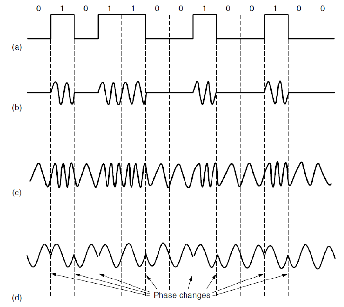{ width="600" }
</figure>

我们还可以通过调幅 + 调相的方式来联合调制，这样 1 个符号所携带的 bit 信息就更多了

<figure markdown="span">
    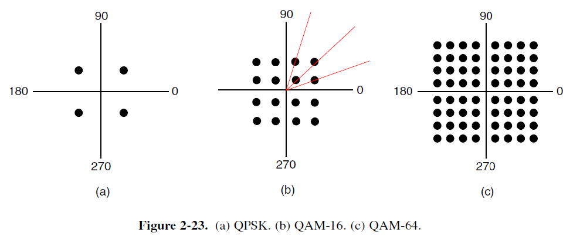{ width="600" }
</figure>

> - 横轴（I）：同相分量，与载波相位一致或相差 0 度的信号分量
> - 纵轴（Q）：正交分量，与载波相位相差 90 度（即正交）的信号分量

QAM-16：电平数 $V = 16$

1. 相位 30°：表示 (1, 3) 那个点
2. 相位 45° 且幅度较小的：表示 (1, 1) 那个点
3. 相位 45° 且幅度较大的：表示 (3, 3) 那个点

这些点的编码方式是：相邻的点的编码只有 1 位是不同的（gray code）。这可以降低误码率

<figure markdown="span">
    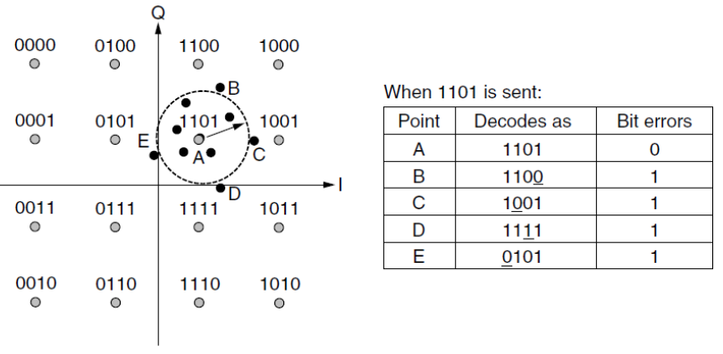{ width="600" }
</figure>

#### 3.2.1 FDM

将频谱划分为多个频带，每个用户独占某个频带以发送其信号。为了防止相邻信道的信号相互干扰，在分配的子频带之间必须设置一定的频率间隔，这个间隔称为防护频带

<figure markdown="span">
    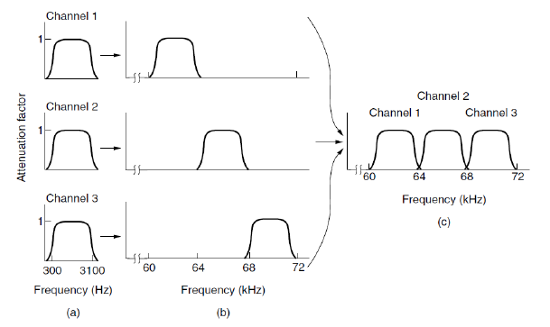{ width="600" }
</figure>

接收端：使用一个带通滤波器，只允许属于目标用户的那个特定频带的信号通过，然后通过解调将信号搬回基带，恢复出原始信息

##### OFDM

<figure markdown="span">
    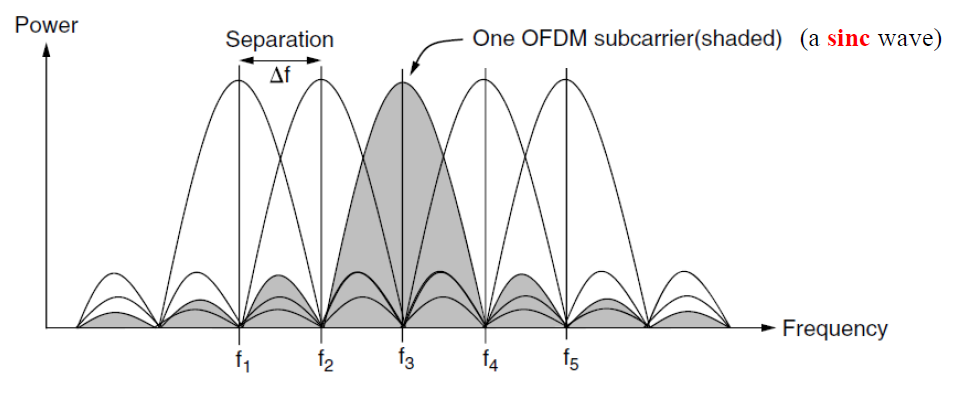{ width="600" }
</figure>

信道带宽被划分为多个子载波，每个子载波独立地发送数据。**每个子载波在相邻子载波的中心频率处为零**。为了实现这一点，需要一个保护时间（guard time），即在时域上重复符号信号的一部分，以使其具有所需的频率响应

#### 3.2.2 TDM

TDM 将整个信道的使用时间划分成一系列周期性的、长度固定的时间间隔，称为帧。每一帧又进一步划分成更小的、固定数量的时隙（time slot）

每个用户被固定地分配一个或多个时隙。在一个帧周期内，所有用户轮流、独占性地使用整个信道的全部带宽，但每个用户只能在自己专属的时隙内发送数据

<figure markdown="span">
    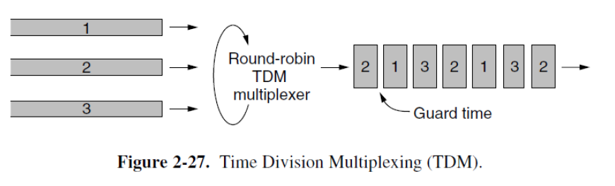{ width="600" }
</figure>

各数据流必须在时间上同步。如果接收端的时序与发送端有细微偏差，它就无法准确判断一个时隙从何时开始、到何时结束。这会导致它取错数据（例如，把用户 1 时隙的末尾当作用户 2 时隙的开头），造成所有信道的数据全部错乱，即时隙错位

#### 3.2.3 CDM

通过为每个用户分配一个独特的、彼此正交的“代码”来区分不同用户的信息

1. 发送端：将原始窄带数据信号的频谱，通过与其独有的码片序列进行相乘（或类似运算），极大地扩展到一个非常宽的频带上。这个过程称为扩频。扩展后的信号功率很低，看起来就像背景噪声
2. 传输：所有用户的扩频信号同时在同一个宽频带内传输
3. 接收端：使用与目标发送端完全相同的码片序列对接收到的混合信号进行相关解调。由于代码的正交性，只有目标信号会被“解扩”回原始的窄带信号并被恢复出来，而其他用户的信号由于代码不匹配，在解扩后仍然保持宽频带（低功率噪声）的特性，从而被滤除

在 CDMA 中，每个比特时间被细分为 m 个短的间隔，称为 **chip**（码片）。**chip sequence** 就相当于用户的“身份证”。它是一个由 `+1` 和 `-1` 组成的、具有良好自相关和互相关特性的伪随机序列。其唯一性和正交性是区分不同用户的基础

由于 CDMA 是一种扩频技术，所以极大地增加了所需的带宽

由于所有用户共享同一频段，虽然理论上可以通过编码区分，但随着用户数量增加，用户间的干扰会累积。意味着 CDMA 系统的最大用户容量不取决于固定的带宽大小，而是取决于所有用户产生的总干扰水平

同样的，CDM 有着同步问题。在实际无线环境中，由于传输延迟的不确定性，实现和维持所有用户信号的精确同步极其困难。如果不同步，码字的正交性就会被破坏，其他用户的信号就不再是“类似噪声”，而会变成严重的干扰。因此，实际的 CDMA 系统（如 3G）需要非常复杂的同步信道、功率控制和 rake 接收机等技术来克服这一挑战

<figure markdown="span">
    { width="600" }
</figure>

> 不同的用户使用不同的、正交性或准正交性良好的码字，接收端可以从中分离出特定用户的信号：上图中叠加后的信号和 C 的 chip sequence 做内积，可以得到 C 的原始信号

## 4 Three examples of communication examples

### 4.1 Public Switch Telephone Network

<figure markdown="span">
    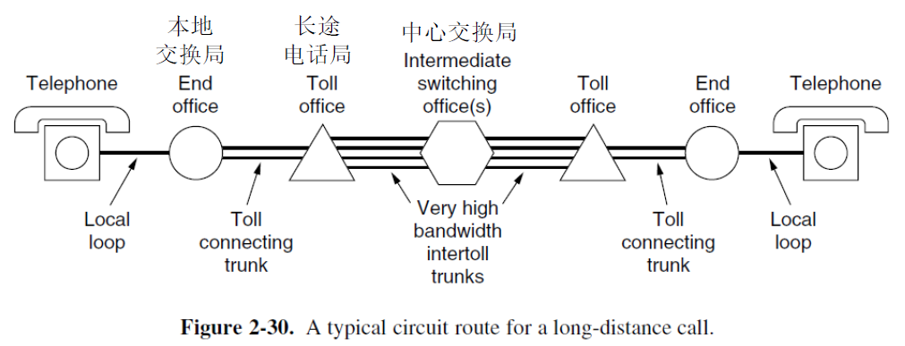{ width="600" }
</figure>

该电话系统包含三个主要组成部分：

1. local loops：telephone modem, ADSL, fiber
2. trunks（中继器）：连接交换局的数字光纤链路。主要考虑的问题是复用（FDM 和 TDM）
3. switching offices（交换局）：呼叫从一个中继线转移到另一个中继线的地方

#### 4.1.1 Local Loop

modem（调制解调器）：将数字信号与模拟信号相互转换的设备

在时域上采样：

<figure markdown="span">
    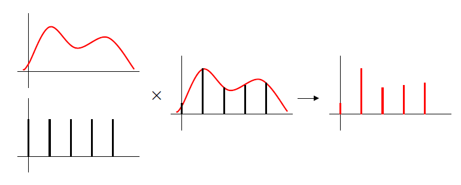{ width="600" }
</figure>

在频域上采样：

<figure markdown="span">
    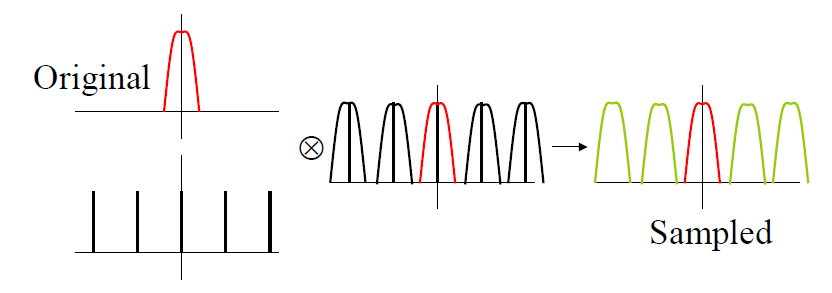{ width="600" }
</figure>

从频域中重建：利用一个 low-passing filter

<figure markdown="span">
    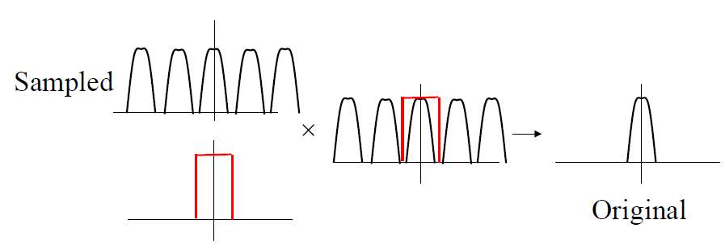{ width="600" }
</figure>

从时域上重建：

<figure markdown="span">
    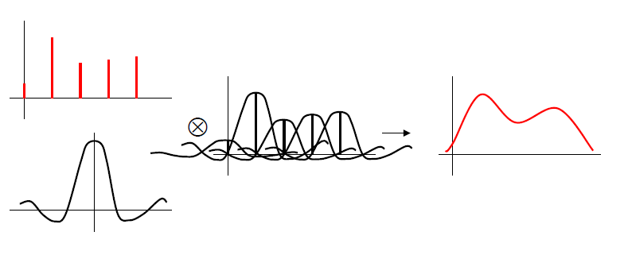{ width="600" }
</figure>

##### Nyquist Sampling

为了无失真地用一个数字序列表示一个连续信号，采样频率必须至少是原始信号中最高频率分量的两倍。如果满足这个条件，就可以从采样值中完美地重建出原始连续信号

1. 采样频率过低：无法准确重建原始信号，因为采样点捕获的信息不足
2. 采样频率过高：从完美重建的角度看，超过两倍最高频率的采样点并不提供新的、用于重建的关键信息，反而会增加数据量

重要前提：被采样的原始信号必须是带限的，即其频率成分被限制在某个有限的最高频率之内。如果信号不是带限的，那么理论上就需要无限高的采样频率才能避免信息丢失，这在实际中是不可能的。因此，在采样之前，通常会用抗混叠滤波器来人为地将信号变成带限的

---

考虑到相邻信道间的防护频带，一个完整的电话信道在频谱上占据 4000 Hz 的宽度。根据奈奎斯特定理，要无失真地采样一个最高频率为 4000 Hz 的信道，所需的采样率至少是其两倍，即 8000 次/秒（每秒 8000 个样本）。这正是电话系统中标准采用的采样率

在美国，每个样本用 8 位（比特）表示，但其中 1 位被用于网络信令和控制，因此只有 7 位用于用户数据。所以用户数据速率 = 8000 样本/秒 × 7 比特/样本 = 56 kbps。这就是经典的"56K 调制解调器"速率的由来

在欧洲，同样使用8位样本，但所有位都用于用户数据。所以用户数据速率 = 8000 样本/秒 × 8 比特/样本 = 64 kbps。这就是数字电话系统中一个标准话路的数据速率

由于大多数家庭用户的网络行为主要是从互联网下载数据，因此其下行（下载）速率高于上行（上传）速率

##### DSL

Digital Subscriber Lines：数字用户线路

电话系统是为传输人声（频率范围约 300-3400 Hz）而优化的。为了实现这一优化，系统中使用了一个滤波器（在用户端通常位于分离器中），将传输频率严格限制在这个语音范围内。这保证了通话质量，但也人为地将线路的传输能力限制在了约 4 kHz的带宽

xDSL 技术的关键在于"绕过"或"移除"这个语音滤波器。当不使用这个滤波器时，信号可以利用电话线本身所能支持的更高频率进行传输。一根典型的双绞电话线，其物理特性实际上可以支持高达约 1 MHz 的频率。这个 1 MHz 的带宽远比语音所需的 4 kHz 宽得多。xDSL 技术正是利用这额外的频率空间（即高频段）来传输数字数据

ADSL 技术将大约 1.1 MHz 的总频带宽度分割成 256 个非常窄的、独立的子信道。每个子信道的宽度约为 4.3125 kHz。这种将宽带信道划分为多个窄带子信道的技术是 OFDM（正交频分复用）的核心思想。在 ADSL 的具体实现中，这种技术被称为 DMT

信道分配方案：

1. 信道 0：专门用于传统的电话语音服务，确保即使没有网络，电话也能正常使用
2. 信道 1-5：作为保护频带。这是一个空白的隔离区，位于低频的语音信号和高频的数据信号之间，目的是防止两者相互干扰
3. 控制信道：从剩余的信道中分出两个

    1. 一个用于上行控制（用户到网络），负责传输如错误校正、功率控制等管理信息
    2. 一个用于下行控制（网络到用户），负责传输如信道状态、速率适配等管理信息

4. 用户数据信道：最后剩下的 248 个信道全部用于传输实际的用户数据（如上网页、视频内容等）

<figure markdown="span">
    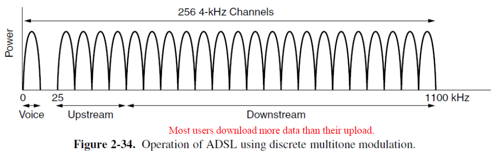{ width="600" }
</figure>

##### Fiber to The Home

传统的铜质电话线（本地回路）的物理性能限制了 ADSL 等技术的速度。用性能更高的光纤直接替换到用户家门口（FTTH），这是电话公司的升级方向

采用点对多点的树形结构。从端局引出一根光纤，通过无源光分路器（一种不需要供电的光学器件）分成多路，连接至多达 100 个用户

数据传输方式：

1. 下行（广播）：从端局发出的信号通过分路器（optical splitter）广播到所有连接的家庭。因此，为了安全，必须对数据进行加密，确保只有目标用户才能解密读取
2. 上行（时分复用）：所有家庭共享同一根光纤向上发送数据。为了避免信号冲突，PON（无源光网络）系统采用时分多址（TDMA） 技术，即为每个用户分配特定的时间片来发送数据，这需要精密的同步机制。光合路器（optical combiners）将各用户的信号合并到一根光纤传回端局

为了在同一根光纤中实现双向通信，PON 使用不同的波长（即不同颜色的光）。通常，一个波长用于下行传输，另一个波长用于上行传输。这样两路信号就不会相互干扰

<figure markdown="span">
    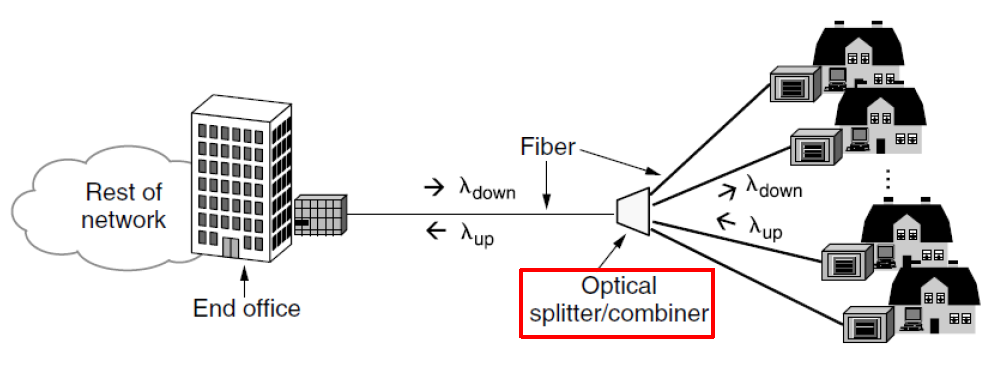{ width="600" }
</figure>

#### 4.1.2 Trunks

中继与本地回路的根本区别：

1. 数字化：网络核心传输的不再是原始的模拟语音信号，而是已经数字化了的比特流。这提高了抗干扰能力和传输效率
2. 大规模复用：核心网络的核心任务就是通过复用技术，将海量用户的通话和数据汇聚到一条高速链路上同时传输，以实现极高的效率和规模经济

复用技术：主要通过 TDM 和 FDM 及其演进技术实现

1. TDM：具体代表是 SONET（同步光网络）。这是一种非常精确的时分复用技术，它将时间划分为固定长度的时间帧和时隙，每个通话或数据流周期性地占用一个特定的时隙，从而在一条光纤上实现大量信号的同步传输
2. FDM：在光纤上的应用被称为波分复用（WDM）。这是频分复用原理在光域的应用。它使用不同波长的光在同一根光纤中并行传输多个独立的数据流。每个波长信道就像一个独立的"虚拟光纤"，极大地提升了单根光纤的总传输容量

> 在数字技术成熟之前，电话网络的核心也传输模拟信号。因此采用 FDM，但它依赖于模拟电路（如调制器、滤波器和放大器）来操作连续的频率信号。这些电路更易受噪声和失真的影响。而 TDM 处理的是离散的比特流，可以完全由数字电路（如门电路、存储器和处理器）完成，具有更高的可靠性、精确性和集成度

PCM：将模拟语音信号转换为数字比特流的核心过程

1. 采样：以 8000 Hz 的固定速率测量模拟信号的瞬时幅度。每次采样的时间间隔为 125 μs
2. 量化：将每个采样得到的连续幅度值，近似转换为最接近的离散电平。若使用 8 位二进制数来表示这个电平，这意味着有 256 个可能的量化电平
3. 编码：将这个离散的电平值（即 8 位二进制数）输出，形成数字比特流

##### TDM

T1 载波系统，也称为 DS1 格式，主要用于北美和日本的电话网络中

<figure markdown="span">
    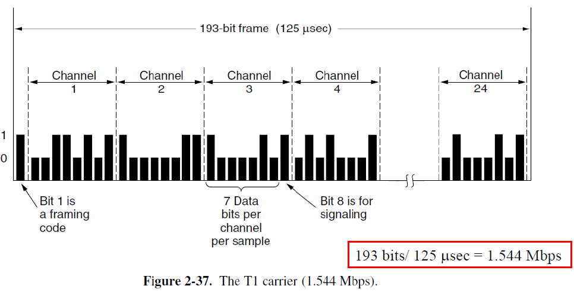{ width="600" }
</figure>

时分复用允许将多个 T1 载波复用为更高级别的载波，把多个低速信号合并成一个高速信号，以提高传输效率

<figure markdown="span">
    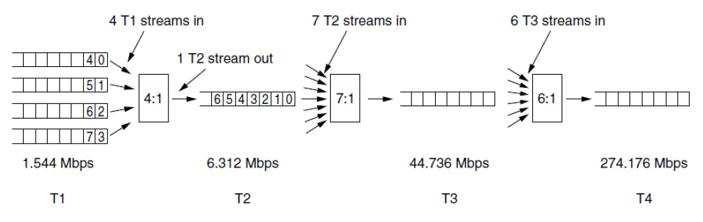{ width="600" }
</figure>

---

SONET/SDH：一种光学时分复用（TDM）系统的标准化方案。其数据传输的基本单位是帧。一个基本帧（STS-1）被组织成一个 9 行 × 90 列的字节矩阵，总共 810 字节

关键点在于，这个帧是每 125 微秒生成并发送一个。这个时间间隔直接来源于 PCM 语音采样的标准。这使得 SONET 能够轻松地承载和同步传统的 64 kbps 数字语音信道

- 每帧比特数：810 字节/帧 × 8 比特/字节 = 6480 比特/帧
- 帧速率：1 帧 / 125 μs = 8000 帧/秒
- 总数据率：6480 比特/帧 × 8000 帧/秒 = 51.84 Mbps

<figure markdown="span">
    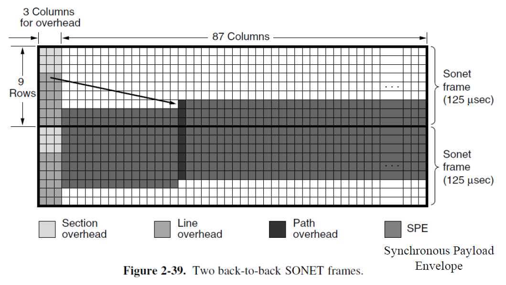{ width="600" }
</figure>

##### WDM

<figure markdown="span">
    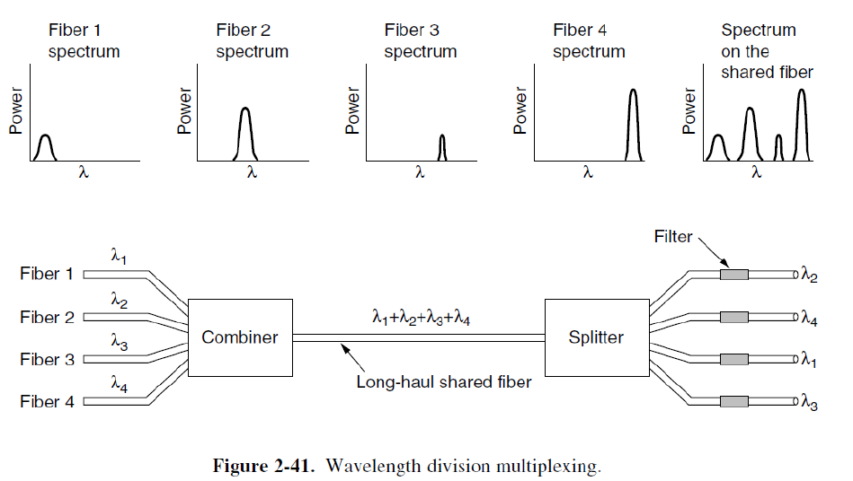{ width="600" }
</figure>

#### 4.1.3 Switching

Circuit switching（电路交换）：在通信开始之前，网络必须首先在呼叫方和被呼叫方之间建立一条专用的、端到端的物理连接路径。这条路径在整个通信过程中被独占，即使双方没有说话（没有数据传输），其他通信也无法使用这条路径的资源

- 优点：延迟低且稳定：一旦路径建立，数据（在电话网络中就是语音）传输的唯一延迟是信号在物理介质中的传播延迟。这使得它非常适合像语音通话这样的实时、连续的通信
- 缺点：

    1. 建立连接需要时间：呼叫建立过程会引入初始延迟
    2. 资源效率低：由于路径是独占的，在静默期会造成网络资源的浪费

Packet switching（分组交换）：通信开始前不需要建立端到端的专用连接。数据被分割成一个个独立的数据包。网络中的每个路由器会接收（存储）整个数据包，检查其目标地址，然后根据当前网络状况（通过路由协议计算出的路径）独立地决定下一个转发方向。每个数据包通往目的地的路径可能不同

- 优点：

    1. 资源利用率高：网络带宽被所有用户的数据包共享，只有在有数据需要传送时才占用资源，避免了电路交换中静默期的资源浪费
    2. 健壮性/灵活性：如果某条链路出现故障，路由器可以自动为后续的数据包选择其他可用路径

- 缺点：

    1. 可变延迟（抖动）：由于数据包需要在路由器的队列中等待处理，会引入排队延迟。当网络繁忙时，会出现拥塞，导致延迟增加甚至丢包。这使得它对于需要极稳定延迟的实时语音通话（在没有优化的情况下）不如电路交换稳定
    2. 数据包大小限制：为了公平共享和防止单个长数据包过度占用链路，网络对数据包的最大尺寸有严格限制。大的消息必须被分割成多个符合要求的数据包

<figure markdown="span">
    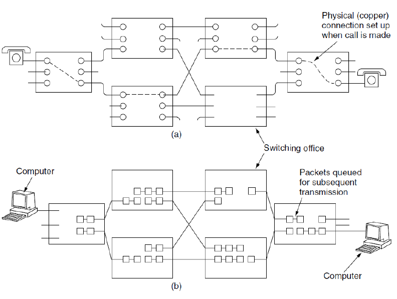{ width="600" }
</figure>

<figure markdown="span">
    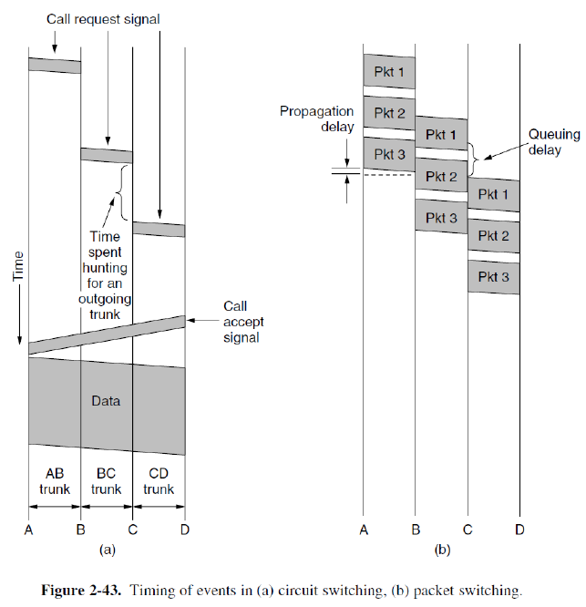{ width="600" }
</figure>

<figure markdown="span">
    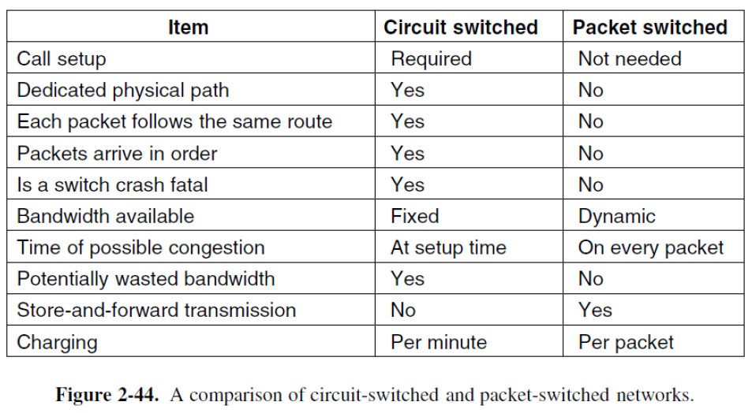{ width="600" }
</figure>

### 4.2 Cellular Networks

1. 1G：提供模拟语音服务，是纯粹的电路交换
2. 2G：引入数字语音，提高了语音质量和安全性，核心网络仍主要基于电路交换
3. 3G：开始支持数据业务（如互联网接入、电子邮件），但通常采用混合模式，语音通话可能仍使用电路交换，数据业务使用分组交换
4. 4G：完全基于分组交换
5. 5G：极高的速率，高密度连接，超低延迟

<figure markdown="span">
    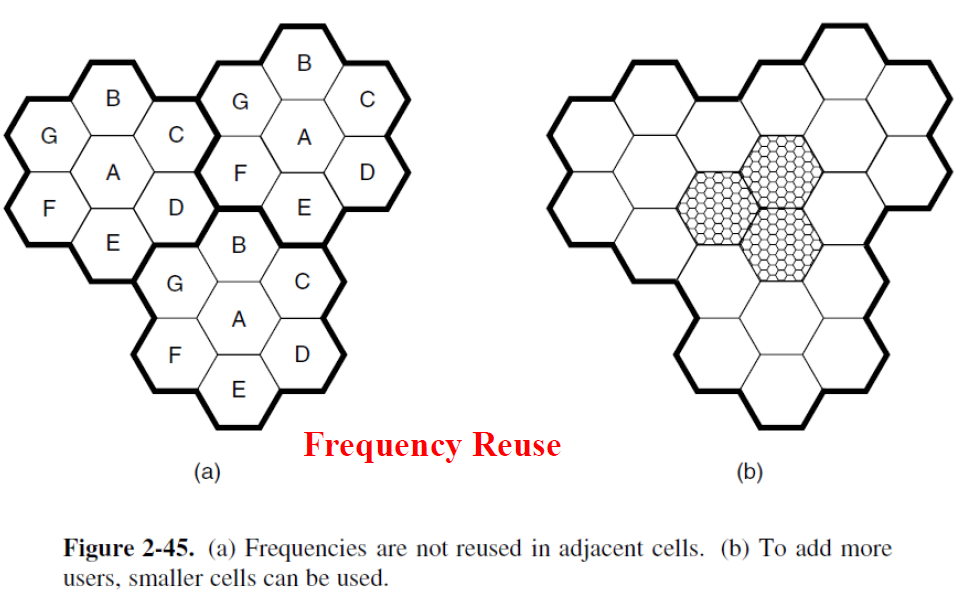{ width="600" }
</figure>

GSM 蜂窝网络系统：

1. SIM 卡：存储用户的身份信息和加密密钥
2. HLR：中心数据库，位于用户注册的归属网络。永久存储用户的主要信息，包括用户身份、订阅的服务、以及当前大致的位置信息（例如，用户当前位于哪个VLR的服务区）
3. VLR：临时性的本地数据库，位于用户当前访问的移动交换中心。当用户进入一个新的网络覆盖区域时，该区域的 VLR 会临时存储该用户的详细信息（通常从 HLR 获取）
4. 数据库的协同工作与更新：当手机开机、移动或接到呼叫时，它会与网络通信。这个过程会更新 VLR 和 HLR，确保网络始终知道用户当前连接在哪个 VLR 之下，从而能够将来电、短信等正确地路由到用户所在的准确位置

handoff（切换）面临的问题：

1. 无缝切换
2. 最小化切换延迟
3. 最小化切换频率及对 QoS 的影响
4. 最小化掉线概率
5. 最小化呼叫阻塞效应：指新呼叫或切换请求因目标基站资源不足而被网络拒绝。良好的准入控制策略需要平衡新呼叫和正在切换的呼叫的优先级

切换策略：

1. relative signal strength：当目标基站的信号强度超过当前基站的信号强度时，立即发起切换
2. relative signal strength with threshold：只有当前基站的信号强度低于某个预设阈值，并且目标基站的信号更强时，才进行切换
3. relative signal strength with hysteresis（带滞回的相对信号强度）：只有当目标基站的信号强度比当前基站的信号强度强出一定差值时，才进行切换
4. relative signal strength with hysteresis and threshold：结合了 2 和 3 的策略。切换需满足两个条件：当前信号低于阈值且目标信号强于当前信号一个滞回差值
5. prediction techniques：利用移动设备的速度、方向、信号变化趋势等历史数据进行预测，智能地提前发起切换至最合适的基站，以实现更优的性能

Soft handoff：

<figure markdown="span">
    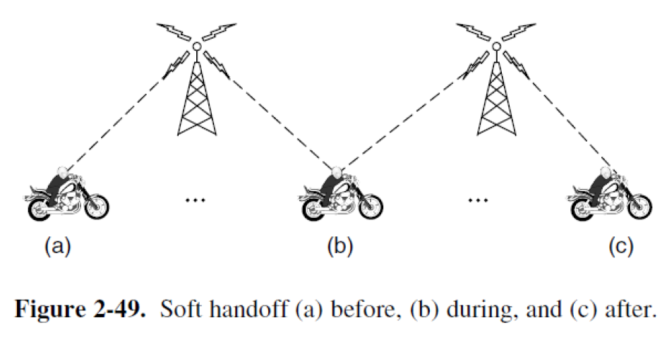{ width="600" }
</figure>

##### 4.2.1 4G

4G 的官方技术标准称为 IMT-Advanced。其最根本的特征是完全基于分组交换技术。所有信息，包括语音，都被当作数据来处理

核心架构 EPC：

1. 简化的全 IP 网络：它构建了一个统一的 IP 网络。虽然底层是统一的 IP 数据流，但网络逻辑上能够区分并优先处理对延迟敏感的语音流量和普通数据流量
2. 承载语音与数据：在 4G 网络中，语音通话不再占用专用的电路，而是被转换为 VoIP 数据包，与其他互联网数据（如网页、视频）一样在 IP 网络上传输
3. 采用统计复用：这正是分组交换高效率的来源。网络资源（带宽）不再是预先固定分配的，而是根据所有用户的瞬时需求进行动态共享
4. 核心挑战与管理：EPC 必须具备强大的资源管理能力，通过服务质量机制为语音数据包提供更高的优先级和保障，以确保即使在网络繁忙时也能保持清晰的通话质量

##### 4.2.2 5G

推动 5G 发展的两个主要因素是追求更高的数据速率和更低的延迟

实现容量提升的关键技术：

1. 超密集组网和流量分流：通过部署更多、更密集的小型基站来分担宏基站的流量，增加单位面积的网络容量
2. 毫米波：使用更高频率的无线电波（毫米波段），提供了更宽的"道路"（带宽），从而能够传输更多数据
3. 大规模 MIMO：在基站安装大量天线，通过先进的信号处理技术，同时与多个用户设备通信，极大地提高了频谱利用效率（即在相同的频率资源上传输更多数据）

网络切片：允许在同一个物理 5G 网络上，创建多个端到端的、逻辑上独立的虚拟网络。每个"切片"可以根据特定应用的需求进行定制。这使得网络能够灵活地支持多样化的应用场景

MVNO 的兴起：MVNO 是不拥有无线电频谱和物理网络基础设施的移动运营商，它们从主流运营商购买网络服务然后转售给用户

### 4.3 Cable Networks

共用天线电视：

1. 大型天线：安装在制高点上，用于接收远处电视台发射的、质量较差的无线电视信号
2. 前端：这是网络的核心节点。它接收天线信号并进行放大、处理，然后通过电缆系统分发出去
3. 同轴电缆：负责将经过前端处理后的电视信号广播式地传输到社区内的各个家庭

<figure markdown="span">
    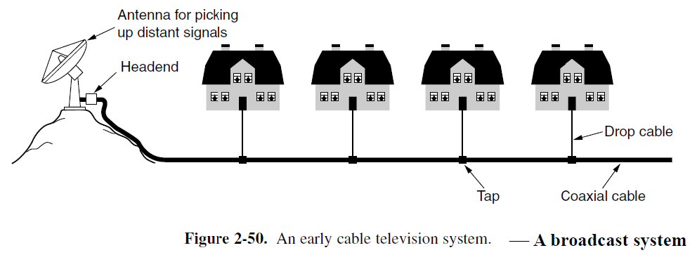{ width="600" }
</figure>

Hybrid fiber-coax cable network（HFC）

<figure markdown="span">
    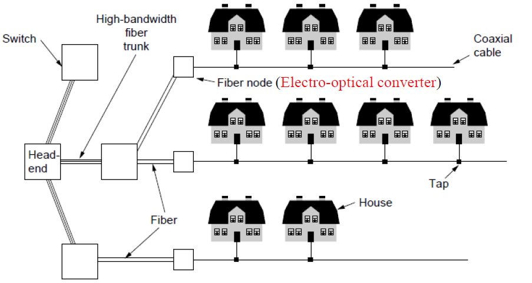{ width="600" }
</figure>

fixed telephone system：

<figure markdown="span">
    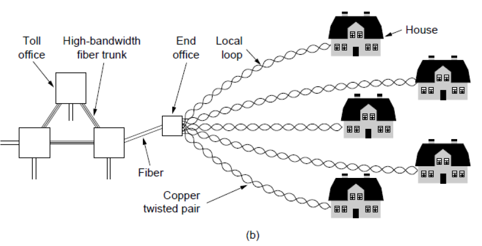{ width="600" }
</figure>

为了让电视和互联网在同一个电缆上和平共存，其解决方案建立在频分复用的基础上

1. 电视信号：占据 54-550 MHz 这个相对居中且较宽的频段，用于下行传输传统的模拟或数字电视节目
2. 互联网数据：

    1. 下行信道：使用高频段来传输从网络到用户的数据（如下载、观看视频）。这个频段带宽大，速度高
    2. 上行信道：使用 5-42 MHz 这个低频段来传输从用户到网络的数据

<figure markdown="span">
    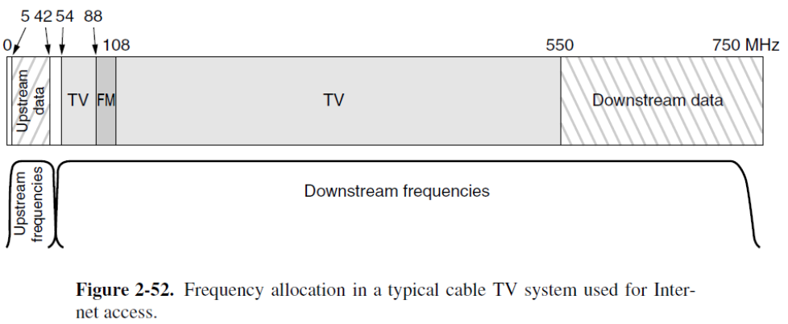{ width="600" }
</figure>

last-mile connectivity technology：有线运营商主要采用 HFC，进入社区或楼宇的最后一段则使用原有的同轴电缆。此外，也辅以无线等方式作为补充

技术标准 DOCSIS：定义如何通过有线电视网络传输数据的国际标准。引入了 OFDM 技术，更宽的信道带宽和更高的效率，使得每个家庭能有超过 1Gbps 的下行容量。后续扩展了全双工操作和低延迟

用户需要电缆调制解调器才能接入有线互联网。该设备必须符合 DOCSIS 标准，并支持特定的调制方案，如 QAM-64 和 QAM-256

HFC 系统中，许多家庭共享同一根电缆。由于 HFC 的上行信道是共享的，当多个家庭用户同时向上发送数据时，就会产生竞争问题。需要一种机制来协调，避免数据"撞车"或公平地分配资源

> 下行信道：由于数据是从运营商单向广播到所有家庭的，不存在竞争问题，管理相对简单

1. ALOHA：一种简单的随机接入协议，允许用户随时发送数据，但如果发生碰撞（即多个数据包同时发送导致冲突），则需要重传
2. CDMA：一种更复杂的技术，通过给每个用户分配独特的编码来区分信号，允许多个用户在同一时间、同一频率上发送数据而不会相互干扰
