# 2 The Physical Layer

!!! tip "说明"

    本文档正在更新中……

!!! info "说明"

    本文档仅涉及部分内容，仅可用于复习重点知识

物理层是网络协议栈中最底层、最基础的一层。它负责在物理媒介上实际传输原始的比特流。它规定了通信接口的电气特性（如电压水平）、时序特性（如同步时钟）等机械和电气规范。其核心任务是将数据链路层传来的比特转换成可以通过某种传输介质（如网线、光纤、无线电波）传播的信号（如光信号、电信号、电磁波）

衡量物理信道性能的三个关键参数：

1. throughput（吞吐量）：指信道在单位时间内能成功传输的数据量，通常用 bps（比特每秒）衡量，代表了信道的"速度"或"容量"
2. latency（延迟）：指一个比特或数据包从发送端到接收端所需的时间。低延迟对于实时应用（如语音、视频通话）至关重要
3. error rate（误码率）：指在传输过程中发生错误的比特所占的比例。它衡量了信道的传输可靠性

## 1 The Theoretical Basis for Data Communication

### 1.1 Fourier Series

Fourier Series：任何复杂的、周期性的信号或函数，都可以看作是由一系列简单的正弦波和余弦波（这些波具有不同的频率和振幅）叠加而成的

作用：

1. 分析与分解（fourier analysis）：它能够揭示一个复杂周期信号内部隐藏的“频率成分”。通过计算 Fourier 系数，我们可以知道哪些频率的波在信号中占主导地位，它们的振幅和相位各是多少
2. 合成与重建（fourier synthesis）：既然复杂信号可以被分解为简单正弦波的叠加，那么反过来，用这些简单正弦波也可以重新构造出原始信号

### 1.2 Bandwidth-limited Signals

没有任何通信信道能在传输信号的过程中不损失一些功率。如果所有的傅里叶分量都被同等程度地减弱，那么产生的信号幅度会减小，但形状不会失真。但是，大多数实际通信信道对不同频率分量的影响是不同的

通常，对于一根导线，频率从 0 到某个 **cutoff frequency**（截止频率）$f_c$ 的信号，其振幅在传输过程中基本不受衰减，而所有高于此截止频率的信号都会衰减

未被显著衰减的频率范围的宽度被称为 **bandwidth**（带宽）。带宽是传输介质的 **物理属性**，它取决于例如导线或光纤的构造、粗细和长度

<figure markdown="span">
    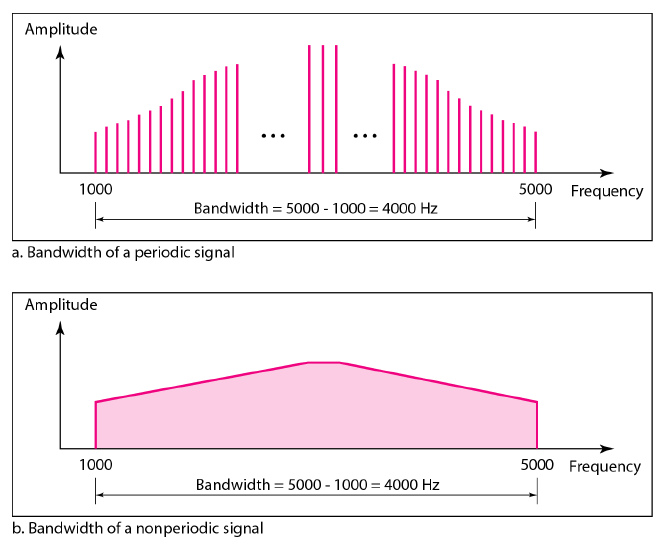{ width="600" }
</figure>

- baseband signals（基带信号）：指未经频率搬移的原始信号，其频率成分从零频率开始，一直延伸到某个最大频率
- passband signals（通带信号）：指将基带信号通过 **调制** 技术，将其频谱搬移到一个更高的、指定的频率范围上所形成的信号。它的频谱不再从零开始，而是集中在某个 **载波频率** 附近的一个频带内

<figure markdown="span">
    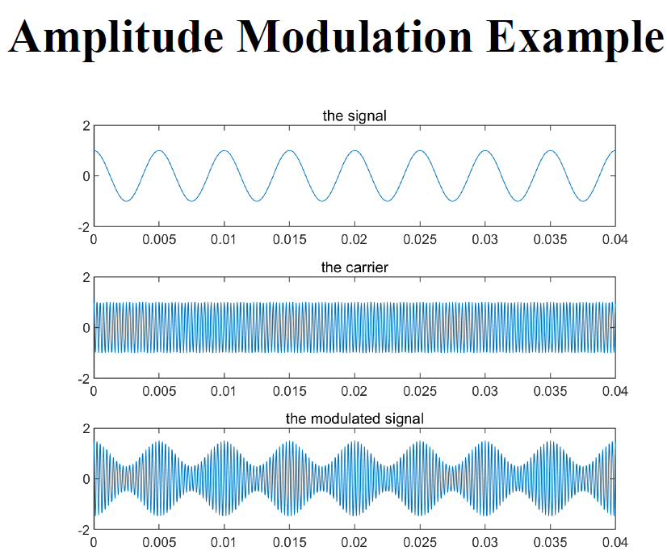{ width="600" }
</figure>

<figure markdown="span">
    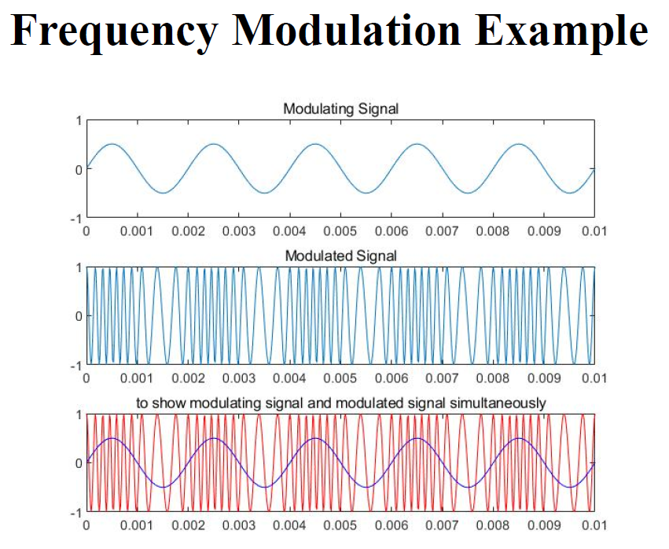{ width="600" }
</figure>

- analogue bandwidth（模拟带宽）：

    - 电气工程 / 物理学领域
    - 信道能够有效传输的频率范围的宽度。这是一个描述物理信道本身固有特性的指标
    - 单位：Hz

- digital bandwidth（数字带宽）：

    - 计算机科学 / 网络领域
    - 信道能够传输数据的最大速度，即数据速率。这是一个描述信道信息传输能力的性能指标
    - 单位：bit / s

> 将通信信道比作一条水管。模拟带宽相当于水管的直径。它描述了水管本身的物理属性：能容纳多“宽”的水流；数字带宽相当于单位时间内通过水管的水量。它描述了水管实际的输送能力

因此，一个信道的物理特性（模拟带宽）从根本上限制了它所能达到的最大数据速率（数字带宽）

### 1.3 The Maximum Data Rate of a Channel

Channel Capacity（信道容量）：表示在特定的物理条件下，一条信道所能可靠传输信息的最高速度（单位：bps）。这是一个理论极限值，实际通信系统的数据速率只能无限接近，但无法超过它

1. data rate：这是我们希望达到的目标，即实际的数据传输速度（bps）
2. bandwidth：信道的频率宽度（Hz）。它受两方面影响：物理限制和法规 / 设计限制
3. noise：信道中不希望存在的随机干扰信号
4. error rate：衡量传输可靠性的指标，即错误比特占总比特数的比例。它是数据速率和噪声水平共同作用的表现

### 1.4 Nyquist Bandwidth

**奈奎斯特准则**：解决了在 **理想无噪声** 信道中如何实现最高速率且无失真的传输问题

即使信道是完美的（没有任何噪声），其传输容量也不是无限的。这个极限并非来自噪声，而是来自信道本身的 **带宽限制**

研究的问题是：给定一个带宽为 $B\ Hz$ 的信道，每秒最多能发送多少个脉冲符号而不产生混淆？

!!! tip "关键问题：inter-symbol interference"

    **码间干扰**（ISI）：由于信道带宽有限，脉冲在传输过程中会被展宽，导致当前脉冲的“尾巴”会蔓延到后续脉冲的时间段内，从而在接收端采样时对相邻脉冲的判决造成干扰

    产生原因：数字信号最初通常由理想的矩形脉冲表示（例如，高电压代表‘1’，低电压代表‘0’）。然而，数学分析（傅里叶变换）表明，这种时间上完美的“方波”包含了无限宽的频率成分（频谱无限延伸）

    <figure markdown="span">
        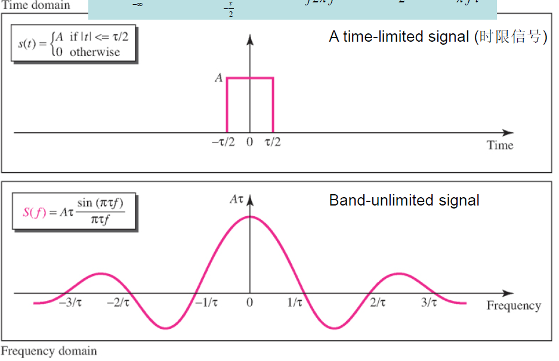{ width="600" }
    </figure>

    而任何物理信道都有有限的带宽，它只允许低于截止频率的成分通过，会截断矩形脉冲的高频成分。这就会导致被截断后的脉冲在时域上不再是干净的矩形。它会产生拖尾，蔓延到本属于其他符号的时间段内，产生了码间干扰

    > 矩形方波（时域上矩形，频域上无限延伸）$\xrightarrow[高于截止频率的成分被截断]{经过一个物理信道}$ $\xrightarrow{再根据频谱分析出时谱}$ 在时域上不再是干净的矩形，产生拖尾，影响其他符号

最优脉冲形状：sinc 函数：$\dfrac{\sin2\pi Bt}{2\pi Bt}$

1. 频谱受限：它的频率成分完美地限制在 $[-B,B]\ Hz$ 的范围内，完全符合信道带宽要求
2. 无 ISI：在它自己的中心采样点值为 1，而在所有其他符号的采样时刻值恰好为 0

**奈奎斯特速率**：使用这样的脉冲，每秒最多能传输 $2B$ 个符号。这个上限 $R_s = 2B\ symbols / s$ 就被称为奈奎斯特速率

因此，信道带宽 $B$ 直接决定了无码间干扰的最大符号速率

如果每个符号能够携带 2 个离散值（即二进制，1 bit），那么最大比特率就是 $2B$ bps。现在假设每个符号能够携带 $V$ 个离散值，即每个符号携带 $\log_2 V$ 比特的信息，那么最大比特率就是

$C = 2B \log_2 V$

> - $C$：就是信道容量，最大比特率
> - $V$：调制电平数

意义：在带宽固定的情况下，可以通过提高 $V$ 来线性地提升数据速率

!!! tip "无限制提高电平数"

    1. 增加接收端负担：在二进制系统中，接收机只需判断信号是‘高’还是‘低’。而在多电平系统中，接收机必须能非常精确地区分出信号细微的电压（或相位）差异。这对接收机的硬件精度和稳定性要求更高
    2. 噪声的限制：此公式是在无噪声前提下成立的。现实中，信道永远存在噪声

### 1.5 Shannon Capacity

$V$ 可以安全地增加到多大呢，这就是香农定理告诉我们的，答案是信道的 **信噪比**

$C = B\log_2(1+SNR)\ bit / s$

> 该公式仅考虑白噪声，未考虑衰减、延迟或脉冲噪声

!!! tip "SNR"

    $SNR$：信噪比，使用线性标度（而非分贝 $dB$）
    
    $SNR_{db} = 10\log_{10}(\dfrac{\text{signal power}}{\text{noise power}}) = 10\log_{10}(SNR)$

意义：这个公式给出了在带宽为 $B$、信噪比为 $SNR$ 的特定信道上，无论采用多么先进的编码或调制技术，都无法超过的无差错传输速率上限

1. 高 SNR 情况（$SNR \gg 1$）：$C = B\log_2(SNR)$。此时，**增加带宽** 是提高容量的更有效手段
2. 低 SNR 情况（$SNR \ll 1$）：$C = B\dfrac{SNR}{\ln 2} = \dfrac{B}{\ln 2} \dfrac{P}{N_0B} = \dfrac{P}{N_0 \ln 2}$（$N_0$ 是单边噪声功率谱密度，$P$ 是信号功率）。在信号被噪声淹没的“极差”信道中，容量的提升与 $SNR$ 呈线性关系，但与带宽 $B$ 几乎无关。此时，**提高发射功率** 或 **降低噪声** 比增加带宽更有效

> 香农容量是一个理论极限，实际系统由于编码复杂度、开销等因素，无法达到该极限，只能无限接近

## 2 There Kinds of Transmission Media

### 2.1 Guided Transmission Media

**导向型传输介质**

#### 2.1.1 Persistent Storage

**持久存储**：（如硬盘、磁带、大容量固态硬盘）本身被视作一种物理传输容器。数据不是通过信号在线路中传播，而是通过运输存储介质本身来完成传递

优势：极高的带宽，极低的成本

> 永远不要低估一辆飞驰在高速公路上的、装满磁带的旅行车的带宽

对于传输海量非实时数据（如数据中心之间的备份、科研机构交换天文或基因组数据），这种方式的每比特成本可能远低于构建一条超高速专用网络线路

弱点：极高的延迟。通常是小时、天甚至周级

#### 2.1.2 Twisted Pairs

**双绞线**：由两根绝缘的铜导线组成，导线像 DNA 分子一样以螺旋形式绞合在一起

!!! tip "绞合的目的"

    抗电磁干扰：这是最关键的设计。平行线会形成“环路天线”，极易接收外部电磁干扰。绞合可以确保每一小段导线受到的干扰强度平均化，使得噪声在两根导线上产生的效应基本一致

信号传输方式：差分信号。信号不是以单根线对地的电压来代表，而是以两根线之间的 **电压差** 来代表。当外部噪声同时耦合到两根线上时，虽然它们的绝对电压会波动，但两者之间的电压差保持不变，从而有效抵消了共模噪声

双绞线的带宽取决于线径（越粗损耗越小）和距离（越短速率越高），是典型的带宽受限信道

<figure markdown="span">
    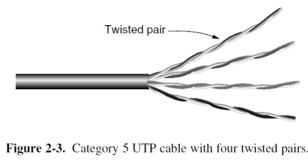{ width="600" }
</figure>

通信模式：

1. simplex（单工）（单行道）：数据只能在一个方向上传输
2. half duplex（半双工）（对讲机，一方说完另一方才能说）：数据可以双向传输，但不能同时进行。使用两对线，各管一个方向。100-Mbps 以太网
3. full duplex（全双工）（电话通话，双方可以同时听和说）：数据可以同时进行双向传输。使用全部四对线，通过电路技术消除自身发送信号的干扰。1-Gbps 以太网	

UTP 是最常用的类型，成本低，柔韧性好

#### 2.1.3 Coaxial Cable

**同轴电缆**

通常用于有线电视、城域网以及为家庭提供高速互联网接入

现代同轴电缆的带宽最高可达数 GHz

<figure markdown="span">
    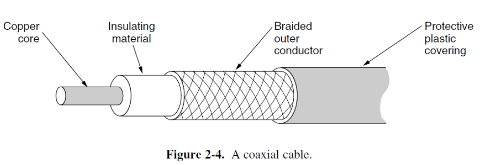{ width="600" }
</figure>

#### 2.1.4 Power Lines

**电力线**

数据信号被叠加在低频电力信号上

使用家庭电力线组网面临的困难在于，电力线最初是为输送电力而设计的。不同房屋的布线电气特性各不相同，并且会随着电器的开关而发生变化，这会导致数据信号在线路中反射。电器开关时产生的瞬态电流会在很宽的频率范围内产生电气噪声

<figure markdown="span">
    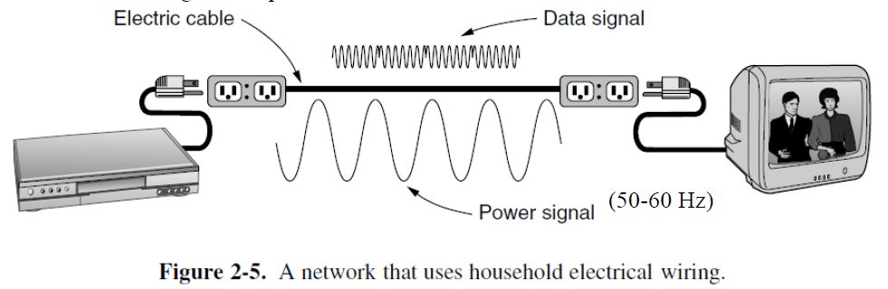{ width="600" }
</figure>

#### 2.1.5 Fiber Optics

**光纤**

光波的频率极高，这意味着其潜在可用的频带宽度巨大，能够承载的数据量几乎是“无限”的

核心考量：成本。尤其是在 “最后一英里”

1. 网络骨干网：长途干线几乎已全部光纤化，因为其单位距离的传输成本远低于铜缆
2. “最后一英里”：指从运营商的网络节点到用户家庭的最终连接段。这是部署成本最高、最复杂的部分（需要挖沟、穿管、入户施工）。虽然光纤本身不贵，但安装的人工和工程成本很高。这也是为什么光纤到户的普及需要一个过程

应用场景：

1. 长途骨干传输
2. 高速局域网
3. 高速互联网接入

一个基本的光纤通信系统需要：

1. light source：将电信号转换为光信号（LED，半导体激光器）
2. transmission medium：即光纤本身，一种极细的玻璃或塑料纤维，通过全反射原理引导光波传播
3. detector：在接收端将光信号转换回电信号

光信号在光纤中传输时，其功率会随着距离增加而逐渐减弱，这种现象称为衰减。它是限制光纤无中继传输距离的最主要因素

光在玻璃中的衰减并非对所有颜色的光都一样。它强烈依赖于光的 **波长**。存在特定的 “低损耗窗口” ，在这些窗口内，光的衰减最小

<figure markdown="span">
    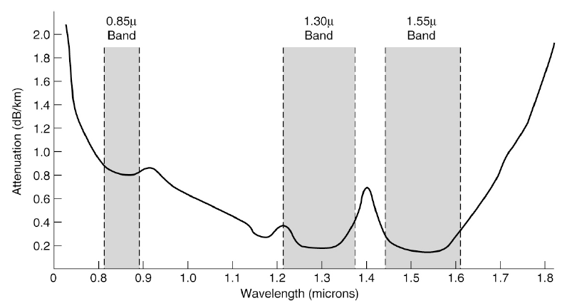{ width="600" }
</figure>

<figure markdown="span">
    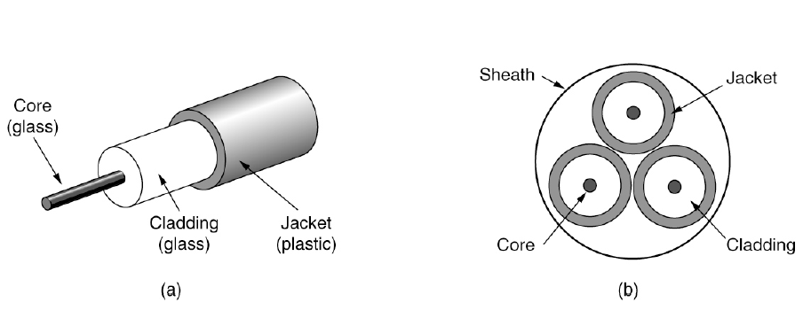{ width="600" }
</figure>

纤芯由玻璃包层包裹，包层的折射率低于纤芯，以便将光限制在纤芯内传播

- multimode fiber（多模光纤）：众多不同角度的光射线会在其中以不同角度反射传播
- single-mode fiber（单模光纤）：光只能以直线方式传播

<figure markdown="span">
    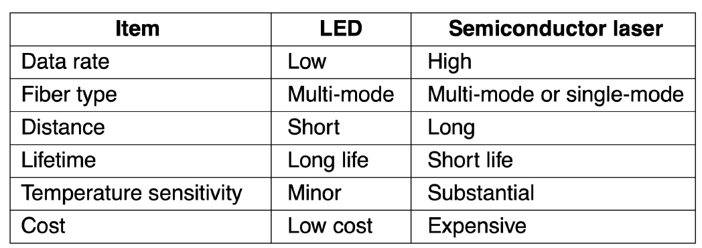{ width="600" }
</figure>

光纤相对于铜线的优势：

1. 支持更高的带宽
2. 不受电源浪涌、电磁干扰、电源故障、腐蚀性化学物质的影响
3. 纤细且轻便
4. 不会泄漏光信号
5. 难以被窃听

光纤的劣势：

1. 技术相对不普及，需要特定的工程技能
2. 光纤过度弯曲时易损坏

### 2.2 Wireless

<figure markdown="span">
    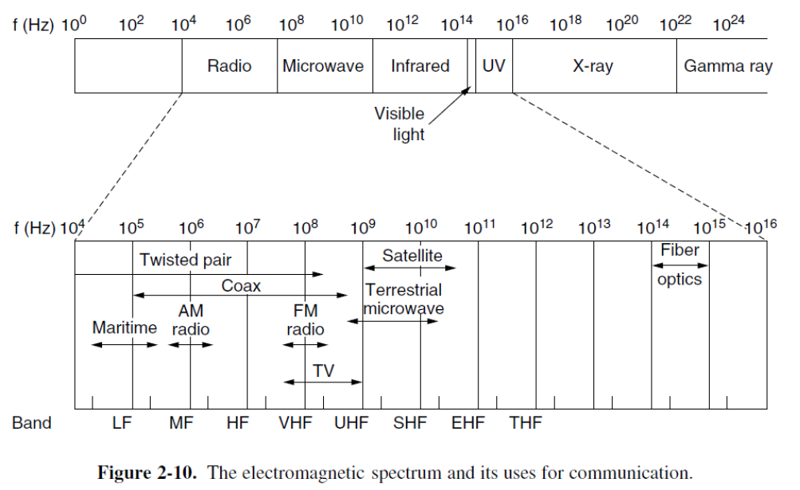{ width="600" }
</figure>

大多数传输使用一个相对窄的频带，它们将信号集中在这个窄带内，以高效利用频谱，并通过发射足够的功率来获得合理的数据速率

然而，在某些情况下，会使用更宽的频带，主要有三种变体：

1. 跳频扩频（frequency hopping spread spectrum）：发射机以每秒数百次的速率在不同的频率之间跳跃。该技术已被商业化应用，例如在蓝牙和旧版本的 802.11 中
2. 直接序列扩频：CDMA（码分多址）
3. UWB（超宽带）：UWB 发送一系列极快的脉冲，通过改变脉冲的位置来传递信息。这种快速的跳变导致信号能量被稀疏地散布在一个非常宽的频带上

#### 2.2.1 Radio Transmission

无线电波易于产生，能够长距离传播，并且容易穿透建筑物，因此被广泛用于室内和室外通信。无线电波是全向的（omnidirectional），这意味着它们从源点向所有方向传播，因此发射机和接收机无需在物理上精确对准

无线电波的特性与频率相关：

1. 在低频率下，无线电波能很好地穿透障碍物，但其功率随距离源头的距离增加而急剧衰减。这种衰减称为路径损耗（path loss）
2. 在高频率下，无线电波倾向于直线传播并会从障碍物上反射

对于光纤、同轴电缆和双绞线，信号每单位距离衰减的比例是固定的，而对于无线电，信号在距离加倍时衰减的比例是固定的。这种行为意味着无线电波能够进行长距离传输，但同时也导致用户间干扰成为一个问题

<figure markdown="span">
    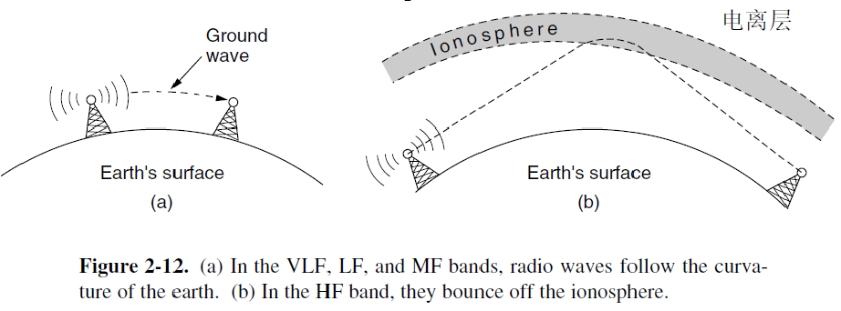{ width="600" }
</figure>

#### 2.2.2 Microwave Transmission

在 100 MHz 以上，电波几乎沿直线传播，因此可以被窄波束聚焦。通过抛物面天线将所有能量集中到一个小的波束中，可以获得高得多的信噪比，但收发天线必须精确对准

微波沿直线传播，因此如果塔间距过远，地球的曲率会阻挡信号。所以，需要周期性地设置中继站。中继站之间的距离大致与塔高的平方根成正比

延迟到达的波可能与直达波相位相反，从而导致信号抵消。这种效应称为多径衰落（multipath fading）

#### 2.2.3 Infrared Transmission

**红外传输**

非导向性的红外波被广泛用于短距离通信。它们具有较强的方向性、成本低廉且易于制造，但有一个主要缺点：无法穿透固体物体

与必须获得许可才能使用 ISM 频段以外频率的无线电系统不同，使用红外系统无需政府许可证

#### 2.2.4 Light Transmission

<figure markdown="span">
    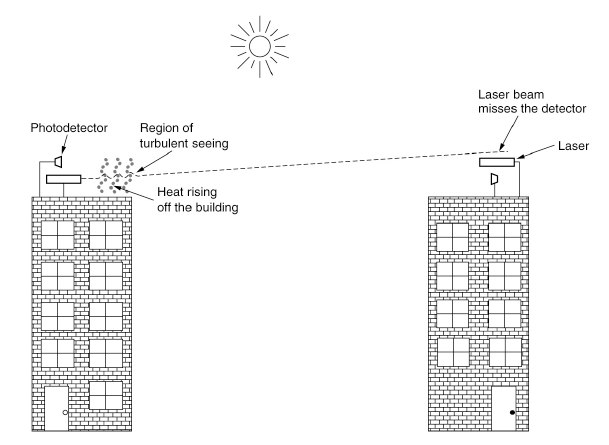{ width="600" }
</figure>

与微波传输不同，光传输不需要获得政府批准。对流气流（如风、温度变化、雾等）会干扰激光通信系统

### 2.3 Satellites

<figure markdown="span">
    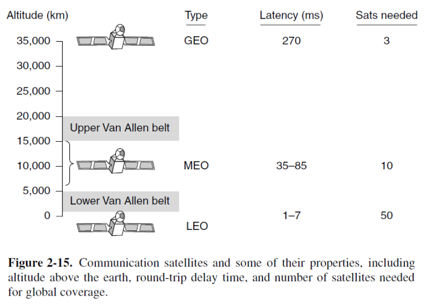{ width="600" }
</figure>

<figure markdown="span">
    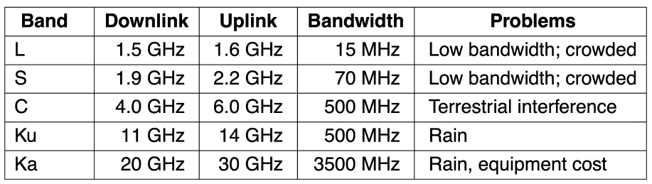{ width="600" }
</figure>

MEO（中地球轨道）卫星：

- 位于较低的高度，在两个范艾伦辐射带之间
- 在经度上缓慢漂移（绕地球一圈约 6 小时）
- 当它们划过天空时，地面站必须进行跟踪
- 在地面上的覆盖范围（足迹）较小
- 到达它们所需的发射器功率较低

用于导航系统：大约由 30 颗 GPS（全球定位系统）卫星组成的星座，在约 20,200 公里的高度运行

通信卫星在一些光纤无法胜任的主要利基市场中占据优势：

1. 快速部署
2. 用于地面基础设施不发达地区的通信
3. 当广播至关重要时

## 3 Digital Modulation and Multiplexing

物理世界（信道）是模拟的（连续变化的波形），计算机世界（数据）是数字的（离散的 0 和 1）

**digital modulation** 就是连接这两个世界的桥梁。它的任务是将比特流转换成适合在特定信道（如电缆、空中、光纤）中传输的模拟波形

- baseband transmission（用于有线信道）：直接改变电压水平来表示比特
- passband transmission（用于无线和光信道）：通过调整载波信号的 amplitude、phase 和 frequency 来传递比特。这就是调幅 (ASK)、调频 (FSK)、调相 (PSK) 的基础

Multiplexing（多路复用）：允许多个独立的信号共享同一物理信道的技术，从而极大地提高了信道的利用率

<figure markdown="span">
    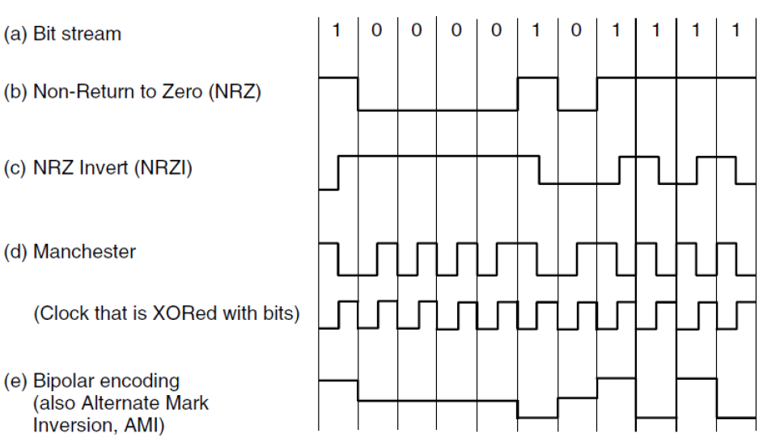{ width="600" }
</figure>
