# 3 The Data Link Layer

!!! tip "说明"

    本文档正在更新中……

!!! info "说明"

    本文档仅涉及部分内容，仅可用于复习重点知识

## 1 Overview of Data Link Layer

核心目标：在直接相连的两个网络节点（即"相邻机器"）之间，提供可靠、高效的数据传输服务。其关键在于维持一个"类导线"的信道，保证数据接收顺序与发送顺序完全一致

数据链路层建立在物理层（第一层）之上，物理层负责实际的比特流传输

实际通信信道的三个固有特性：

1. errors
2. finite data rate
3. propagation delay

而数据链路层的三大功能是：

1. **framing**：将物理层传来的原始比特流划分成具有明确边界、可管理的逻辑单元，称为 **帧**
2. dealing with errors：**error detection**（差错检测）and **error correction**（差错纠正）
3. **flow control**（流量控制）：防止发送方的发送速率超过接收方的处理能力，避免接收方缓冲区溢出导致数据包丢失

    1. feedback-based（数据链路层）：接收方向发送方主动发送"反馈"信息，动态地控制发送方的发送行为。发送方必须等待接收方的"许可"才能继续发送
    2. rate-based（传输层）：协议本身为发送方设定一个明确的数据传输速率上限。发送方会按照这个预设的、固定的速率进行发送

数据链路层的实现位置：

1. 在路由器中：在 line card 上实现
2. 在主机中：通过软硬件结合的方式实现

    1. 硬件部分（主要部分）：在 NIC（network adapter / network interface card，网卡）中，网络适配器的核心是 link-layer controller（链路层控制器），通常是一个单一的专用芯片，它实现了许多链路层服务
    2. 软件部分（辅助部分）：在主机 CPU 和内存中运行的程序。负责处理那些需要更高层逻辑或与操作系统交互的任务

数据链路层提供的三种主要服务类型：

1. Unacknowledged connectionless service：发送方直接发送数据帧，不等待接收方的确认。适用于网络质量高、错误率低且需要快速传输的场景，如局域网中的以太网
2. Acknowledged connectionless service：每发送一帧都要求接收方返回确认，但没有预先建立的连接。适用于无线网络等不可靠环境，如 WiFi
3. Acknowledged connection-oriented service：在数据传输前需先建立连接，传输结束后释放连接。提供了最可靠的数据传输保障，适用于高错误率、长距离的通信链路，如卫星通信

## 2 Framing

数据链路层接收来自网络层的 packets，并将其封装成 **frames** 进行传输

通用帧格式：

1. header：包含控制信息
2. payload field：实际传输的数据
3. trailer：通常包含差错检测信息

<figure markdown="span">
    { width="600" }
</figure>

物理层负责接收原始比特流并尝试将其传送到目的地。但由于信道存在噪声，物理层会向其信号添加一些 redundancy，以将误码率降低到可容忍的水平。数据链路层的通常做法是将比特流分割成离散的帧，为每个帧计算一个称为 **checksum**（校验和）的短令牌，并在传输时将其包含在帧中。当帧到达目的地时，会重新计算校验和。如果新计算的校验和与帧中包含的校验和不同，数据链路层就知道发生了错误，并采取措施处理（丢弃或返回错误报告）

将比特流分割成帧是很困难的，一个优秀的设计必须让接收方能够轻松找到新帧的 **起始位置**，同时只占用很少的信道带宽

方法：

1. Byte Count
2. Flag Byte with Byte Stuffing
3. Flag Bits with Bit Stuffing
4. Physical Layer Coding Violations

### 2.1 Byte Count

在每个帧的头部添加一个字段，明确指出该帧有多少个字节。接收端根据这个数值来正确地解析数据帧

<figure markdown="span">
    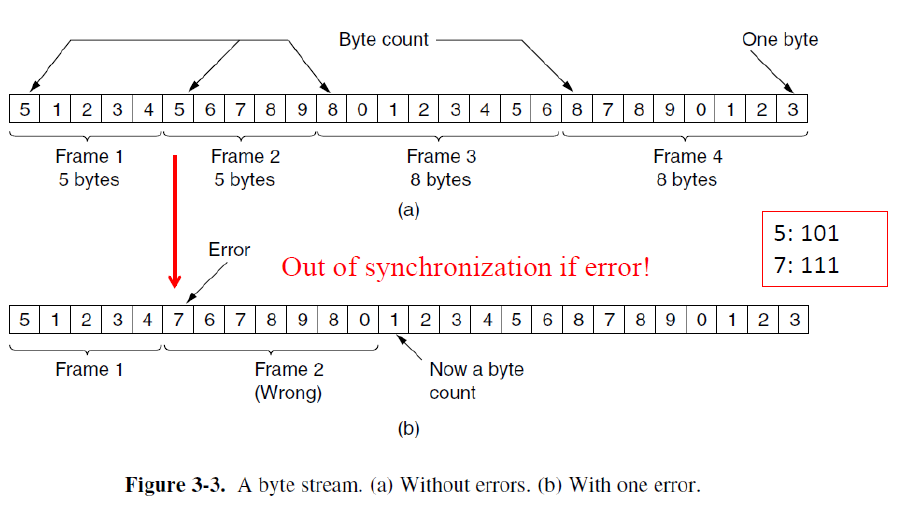{ width="600" }
</figure>

### 2.2 Flag Byte with Byte Stuffing

使用特殊字节作为帧的起始和结束标记。即使发生传输错误，接收端也能通过搜索这些特殊字节来恢复同步

**flag byte** 是一个约定好的特殊值，在协议中被定义为帧的边界，所有帧都以这个标志字节开头和结尾。那么两个连续的标志字节表示一个帧的结束和下一个帧的开始

但如果某个数据字段中恰好出现了 FLAG 字节，为了避免被误认为是帧边界，需要进行“字节填充”处理。当发送方检测到数据中出现 FLAG 字节时，会在其前面插入一个转义字节（如 ESC），这样接收方就知道这不是真正的帧边界

但如果转义字节本身也出现在原始数据中，同样需要使用转义字节进行转义

!!! example ""

    PPP 协议（Point-to-Point Protocol）广泛使用这种字节填充机制

<figure markdown="span">
    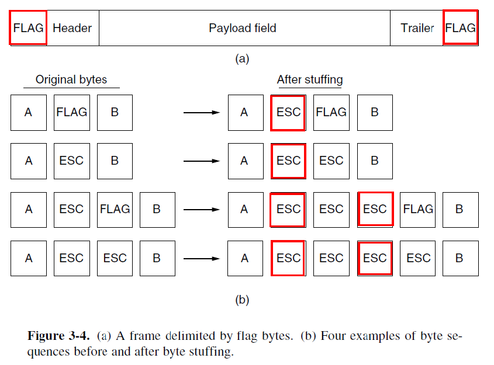{ width="600" }
</figure>

### 2.3 Flag Bits with Bit Stuffing

HDLC（high-level data link control）protocol：使用固定的比特序列 `01111110`（十六进制 `0x7E`）作为帧的起始和结束定界符

当数据部分连续出现五个"1"时，发送方自动插入一个"0"；接收方检测到连续五个"1"后的"0"时，会将其删除，恢复原始数据

这种填充方式的作用：

1. 同步维护：通过强制插入比特，确保传输信号有足够的电平变化，帮助接收方时钟保持同步
2. 透明度：允许数据字段包含任意比特模式，不会与标志位混淆
3. 可靠性：有效区分帧边界和数据内容

!!! example ""

    USB 使用比特填充

<figure markdown="span">
    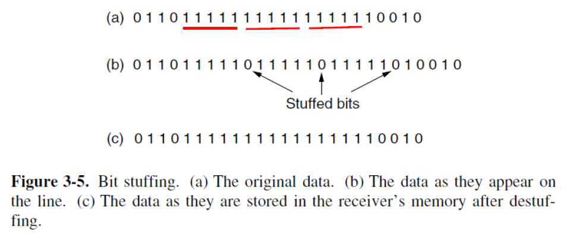{ width="600" }
</figure>

### 2.4 Physical Layer Coding Violations

许多物理层编码方案（如 4B/5B、8B/10B）包含未使用的编码组合，将这些编码组合用作帧边界标记，不需要像比特/字节填充那样改变实际数据，避免了填充开销

---

许多数据链路协议结合使用上述的方法：

以太网和 802.11 让帧以一个明确定义的称为 **preamble**（前导码）的模式开始。该模式可能相当长（802.11 通常为 72 比特），以便接收方为传入的数据包做好准备。前导码之后是头部中的一个 **长度**（即计数）字段，用于定位帧的结束

> 前导码提供充分的同步时间，长度字段确保帧边界准确识别

## 3 Error Control

两种处理错误的基本策略，这两种策略都向发送的数据添加冗余信息：

1. error-correcting codes（纠错码）：在数据中添加大量冗余信息，使接收方不仅能发现错误，还能自动纠正错误。适用于不可靠信道（如无线链路、卫星通信）
2. error-detecting codes（检错码）：添加适量冗余信息，只能检测错误发生，无法自动纠正。检测到错误会请求 retransmission（重传）适用于高可靠性信道（如光纤）

无论是纠错码还是检错码，都无法处理所有可能的错误，因为提供保护的冗余比特与数据比特一样可能在接收时出错

!!! tip "error models"

    错误产生机制：

    1. 随机错误：由热噪声的极端值引起的，这些极端值会短暂且偶尔地淹没信号，导致孤立的单比特错误，错误之间相互独立
    2. 突发错误：由信号深度衰落、瞬时电磁干扰、设备故障等引起，错误集中出现，连续多个比特受影响

!!! quote ""

    无论是纠错码还是检错码，都不仅用于数据链路层，还广泛应用于其他层，因为 reliability 是一个整体性的关注点

    1. 纠错码：物理层、应用层
    2. 检错码：数据链路层、网络层、传输层

### 3.1 Error Correcting

Block code（块码）：每个块包含 m 个数据位（原始信息）和 r 个校验位（根据数据位通过某种算法生成，用于检错和纠错）。总长度 n = m + r

- Codeword（码字）：就是这个长度为 n 比特的序列
- Code rate（码率）：m / n，表示有效信息所占比例

    - 越高的码率 → 更少的冗余 → 更高效率（但纠错能力弱）
    - 越低的码率 → 更多冗余 → 更强纠错能力（但传输效率低）

!!! example ""

    因此在噪声较大的信道中，使用低码率，增强抗干扰能力；在高质量信道中，使用高码率，提高吞吐量

两种编码方式：

1. Systematic Code（系统码）：原始数据位在编码后仍然保留原样，直接出现在码字中，后面附加校验位（信息明文传输）
2. Linear Code（线性码）：校验位是数据位的线性组合。线性码可以是系统码，也可以不是，即数据位也被变换

#### 3.1.1 Hamming Codes

**Hamming distance**：两个等长码字在不同比特位置的数量

意义：如果两个合法码字之间的汉明距离为 d，则要将其中一个误变为另一个，至少需要发生 d 个比特错误。因此，汉明距离越大，纠错能力越强

> 错的越多，越容易发现

**minimum hamming distance**：根据编码规则，生成所有合法的码字，计算任意两个合法码字之间的汉明距离，找出其中最小的距离，这就是该编码方案的最小汉明距离。这个值决定了编码的检错和纠错能力

!!! tip ""

    1. 要检测 d 个错误，最小汉明距离至少为 d + 1
    2. 要纠正 d 个错误，最小汉明距离至少为 2d + 1

我们要设计一种编码方式，使得当传输中发生任意一个比特翻转（单比特错误）时，接收端仍能准确恢复原始信息（即能够纠正所有单比特错误）

总共有 $2^m$ 个可能的信息组合，每个合法消息对应一个唯一的合法码字，对于每一个合法码字，存在 n 个与其汉明距离为 1 的非法码字。所以，每个合法码字需要“负责”自己本身以及所有可能的单比特错误版本，即每个合法码字总共需要占用 n + 1 个不同的比特模式

所有可能的 n 比特二进制序列总数为 $2^n$，所有合法码字及其对应的单比特错误版本总共需要的空间是：$(n+1) \times 2^m$。为了不超过总空间，必须满足 $(n+1)2^m \leqslant 2^n$，代入 $n = m + r$，可得 

$m+r+1 \leqslant 2^r$

这就是 hamming bound 的简化形式

结论：根据这个公式，我们能够得知纠正单比特错误所需校验位数的理论下限

> r 需要足够大，才能提供足够的冗余来区分所有可能的单比特错误情况

!!! example "m = 4"

    我们想用 m = 4 个信息位，设计一个能纠正单比特错误的码。根据公式可得，至少需要 r = 3 个校验位，总长度为 n = 7

    这就是经典的 (7, 4) 汉明码，可以纠正任意一个比特错误

汉明码的编码过程：

1. 校验位放置：放置在 2 的幂次方的位置，数据位填充剩余位置
2. 校验位计算：遍历所有数据位，记录值为 1 的比特位置，将这些位置编号用二进制表示并进行异或运算，异或结果就是校验位的值

汉明码的解码过程：

1. 伴随式（syndrome word）计算：接收方用同样方法重新计算校验位，与接收到的校验位进行异或比较，得到伴随式
2. 错误定位：伴随式为 0 则无错误；伴随式非 0，其数值直接指示错误位置（如果是检验位发生了错误，则无需进行纠正；如果是数据位发生了错误，则通过反转该数据位进行纠正）

<figure markdown="span">
    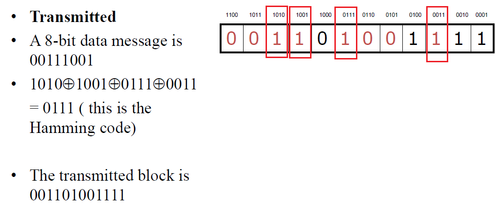{ width="600" }
</figure>

<figure markdown="span">
    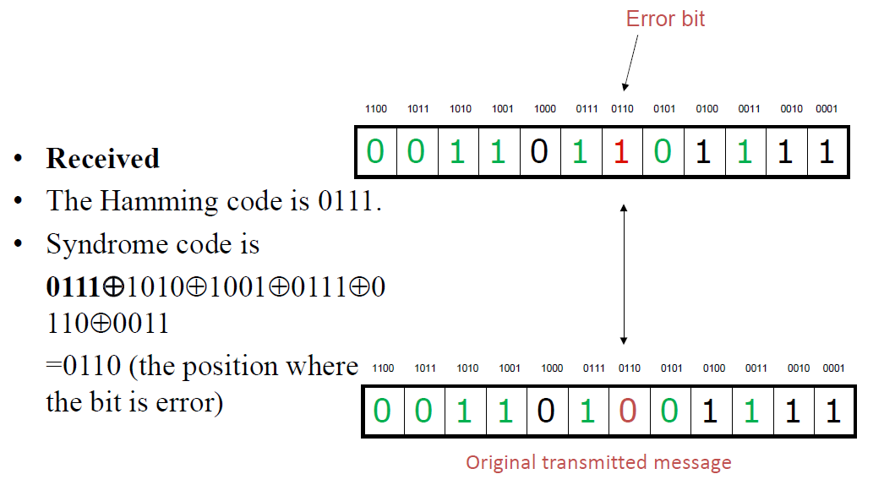{ width="600" }
</figure>

#### 3.1.2 Convolutional Code

卷积码与分组码不同。卷积码将 m 比特的输入映射为一个 n 比特的码字，因此原始信息比特不会原封不动地出现在输出码字中

**记忆性**：卷积码编码器的输出不仅由当前输入的 m 个比特决定，还受到在此之前输入的若干比特的影响

而影响当前输出的过去输入比特的数量（通常包括当前比特）称为 **constraint length**（约束长度）$K$。$K$ 值越大，编码器的记忆越长，通常编码性能越好，但编 / 解码复杂度也越高

表示方法：$(n,m,K)$

- $n$：输出的码字长度
- $m$：每次输入的原始数据比特数
- $K$：约束长度

<figure markdown="span">
    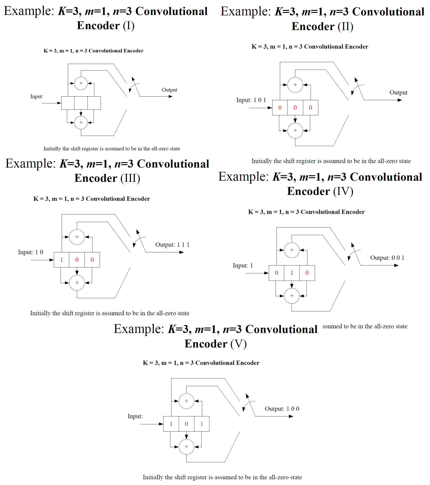{ width="800" }
</figure>

卷积码解码器的任务是从接收到的（可能含有错误的）输出码字序列中，反推出最有可能被发送的原始输入数据序列

**The Viterbi algorithm**：

1. 构造一个 trellis diagram（网格图）：将时间展开成多个时刻，每个时刻对应一个输入比特。每个节点表示一个编码器状态。从每个状态出发，有两个分支，一个输入比特为 1，一个输入比特为 0。每条边上的数字是对应的输出比特
2. 在接收端，我们观察到一串输出比特。维特比算法通过遍历这个网格图，寻找一条最可能的路径（即与接收到的序列汉明距离最小的路径）。它维护每一步每个状态下的“最可能路径”，并逐步淘汰不可能路径。最终选择终点处累积错误最少的路径作为原始输入比特序列

<figure markdown="span">
    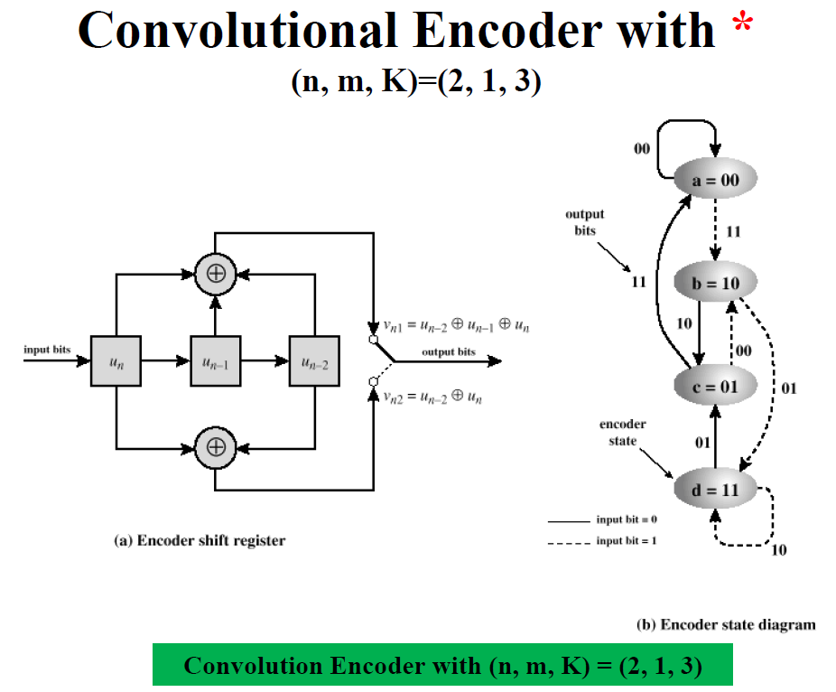{ width="600" }
</figure>

<figure markdown="span">
    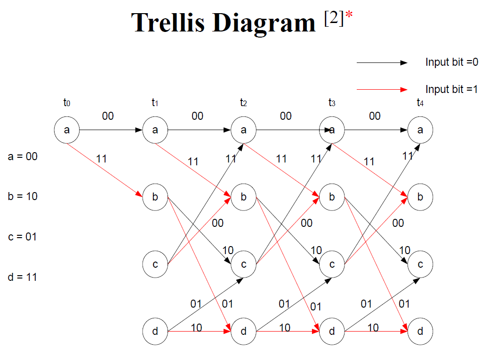{ width="600" }
</figure>

### 3.2 Error Detecting

由于无线链路不稳定的传播环境，噪声干扰大，误码率高。因此，通常采用前向纠错码，在接收端直接纠正错误，以避免频繁重传带来的巨大开销和延迟

而在有线链路如光纤或高质量铜缆中，信道质量高，误码率极低。在这种情况下，为偶尔出现的错误而持续使用复杂的纠错码不划算。更高效的策略是使用简单的差错检测码，一旦发现错误，就通过 **retransmission** 机制来纠正。这种方式在可靠信道上整体开销更小

#### 3.2.1 Parity

**奇偶校验**

在要发送的原始数据块末尾添加一个额外的比特，即奇偶校验位。这个校验位的值不是随意的，而是根据数据块中"1"的个数和所选的校验规则（偶校验或奇校验）来决定的

- even parity：确保整个码字（数据位 + 校验位）中"1"的总数为偶数
- odd parity：确保整个码字中"1"的总数为奇数

!!! example "示例"

    数据：`1011010`

    - 采用偶校验：校验位添加 `0`，码字变为 `10110100`
    - 采用奇校验：检验位添加 `1`，码字变为 `10110101`

使用单个奇偶校验位的码其码距为 2，因为任何单比特错误都会产生一个具有错误奇偶性的码字。因此，它可以检测出所有的单比特错误

> 码距为 2 意味着任何有效的码字之间至少有两个比特不同
>
> 如果发生偶数个比特错误，"1"的总数的奇偶性可能保持不变，错误就无法被检测出来

!!! example "分析 parity 的优势"

    假设一个信道的误码率为 $10^{-10}$，每个数据块包含 1000 比特的数据

    1. 纠错码（汉明码）：根据 hamming bound 的公式，可得每个数据块需要 10 个校验位。那么传输 1 兆比特数据，就需要总共 10000 比特的校验位
    2. 检错码（奇偶检验）+ 重传：每个数据块仅需 1 个校验位。传输 1 兆比特数据，所需的奇偶校验位总数为 1000 比特。而根据信道的误码率，大约每 1000 个数据块中会有 1 个块出错需要重传。因此，总开销为 1000（校验位） + 1001（重传块的 1000 数据位和 1 校验位） = 2001 比特

    所以，在误码率很低的可靠信道上，采用简单的差错检测配合重传机制，其效率远高于使用复杂的前向纠错机制

奇偶校验的局限性：简单奇偶校验能有效检测单比特错误，但对于突发错误，即连续多个比特发生错误，其检测能力会急剧下降。在随机噪声导致的长突发错误场景下，发生"未被检测出的错误"的概率大约是 50%。这个漏检率对于绝大多数需要可靠通信的系统来说是不可接受的

解决方案有：

1. Interleaving：在发送端，数据比特被按照某种规则重新排列（例如，按矩阵的列写入），然后再计算和传输。在接收端，进行相反的解交错操作，恢复原始顺序。一个长的突发错误在传输过程中会破坏连续比特，但经过解交错后，这些错误比特在数据流中就被分散开了，变成了单个或短小的错误，从而使得简单的奇偶校验也能有效地检测到它们
2. Two-dimensional parity：将数据比特排列成一个矩阵（二维阵列）。不仅为每一行计算一个行奇偶校验位，也为每一列计算一个列奇偶校验位。一个突发错误可能会破坏矩阵中的连续几行，但它在每一行中可能只造成一两个错误。这样，行校验有可能检测到部分行的错误，而列校验则几乎肯定能检测到这些错误，因为错误比特分布在不同列中。这大大提高了检测突发错误（乃至多种错误模式）的能力

<figure markdown="span">
    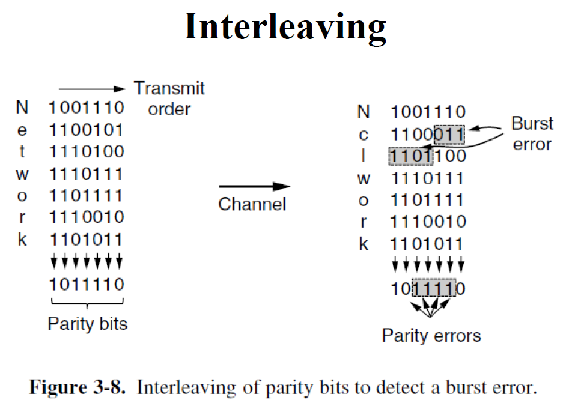{ width="600" }
</figure>

<figure markdown="span">
    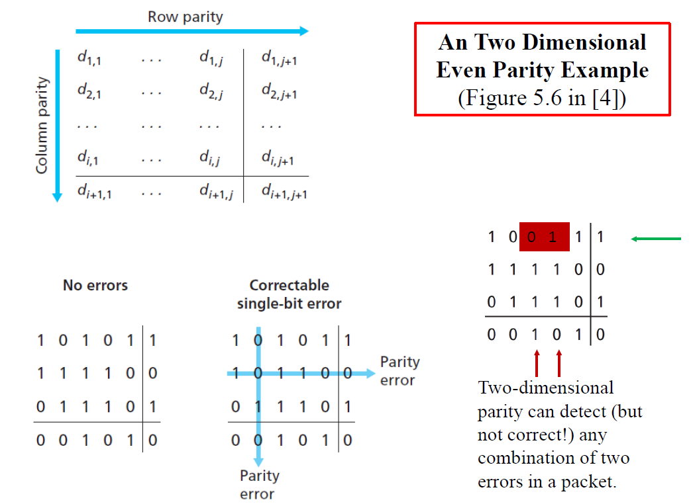{ width="600" }
</figure>

#### 3.2.2 Checksum

**校验和**

!!! example ""

    广泛应用于 TCP / IP / UDP

16-bit Internet checksum：采用 one's complement 加法

而现在计算机一般都是用 tow's complement，反码求和等价于将所有 16 位数据相加后取模 $2^{16}$，并将高位溢出的部分加回到低位上

发送端计算校验和：

1. 将待发送的数据（不包括校验和字段本身）划分为连续的 16 位字。如果数据长度不是 16 位的整数倍，需要进行填充
2. 将校验和字段本身视为 `0000`，然后与所有其他的 16 位数据字进行求和
3. 将上一步求和产生的任何高位进位加回到结果的低位，从而得到所有数据字的反码和
4. 对上一步得到的 16 位反码和执行按位取反操作，取反后的值就是最终计算出的校验和

!!! example "示例"

    1. 0001 + f203 + f4f5 + f6f7 = 2ddf0
    2. 2 是高位溢出的，加回到低位，ddf2
    3. 取反后得到校验和 220d

接收端计算校验和：

1. 将待发送的数据（不包括校验和字段本身）划分为连续的 16 位字。如果数据长度不是 16 位的整数倍，需要进行填充
2. 接收端的校验和字段非零，与所有其他的 16 位数据字进行求和
3. 将上一步求和产生的任何高位进位加回到结果的低位，从而得到所有数据字的反码和
4. 对上一步得到的 16 位反码和执行按位取反操作，如果结果为 0，则说明接受到的数据无误

!!! example "示例"

    1. 0001 + f203 + f4f5 + f6f7 + 220d = 2fffd
    2. 2 是高位溢出的，加回到低位，ffff
    3. 取反后得到 0000，说明接收到的数据无误

因特网校验和的本质是一个简单的算术和。这种设计使其计算效率高、实现简单，但也导致了其检错能力存在固有的弱点

1. 无法检测零数据的增删：如果在数据流中增加或删除若干字节的 0，由于 0 加上任何值都不改变总和，所以最终的校验和结果可能保持不变，从而导致这些错误无法被检测出来
2. 无法检测数据部分的交换：如果消息中的两个或多个 16 位字的位置被交换，校验和的结果同样不会改变

#### 3.2.3 Cyclic Redundancy Check

**循环冗余校验**（CRC）

CRC 是一种基于二进制多项式除法的、非常强大的差错检测码。它通过在数据块后添加一个冗余的 **frame check sequence**（FCS，帧校验序列）来实现检错

发送端操作：

1. 输入：一个长度为 m 比特的原始数据块
2. 处理：发送端根据一个双方预先约定好的生成多项式，对原始数据进行计算
3. 输出：计算生成一个长度为 n - m 比特的 FCS。将 FCS 附加到原始数据之后，形成一个总长度为 n 比特的完整帧

这个完整的 n 比特帧，在数学上可以被那个生成多项式整除（模 2 除法），没有余数。生成多项式必须满足其最高次项和常数项（即比特模式的首位和末位）的系数都为 1

接收端操作：

1. 验证：接收端收到这个 n 比特的帧后，使用相同的生成多项式对它进行模 2 除法运算
2. 判断：如果余数为零，说明传输过程中极有可能没有发生错误，数据被接受；如果余数不为零，则肯定发生了传输错误，接收端会丢弃该帧或请求重传

参数定义：

1. $T$：最终传输的 n 比特长度的数据
2. $D$：长度为 m 比特的原始数据
3. $F$：由 CRC 算法计算出的校验码，长度为 n - m
4. $P$：双方预先约定的比特模式，也称为生成多项式。长度为 n - m + 1
5. $Q$：商
6. $R$：余数

<figure markdown="span">
    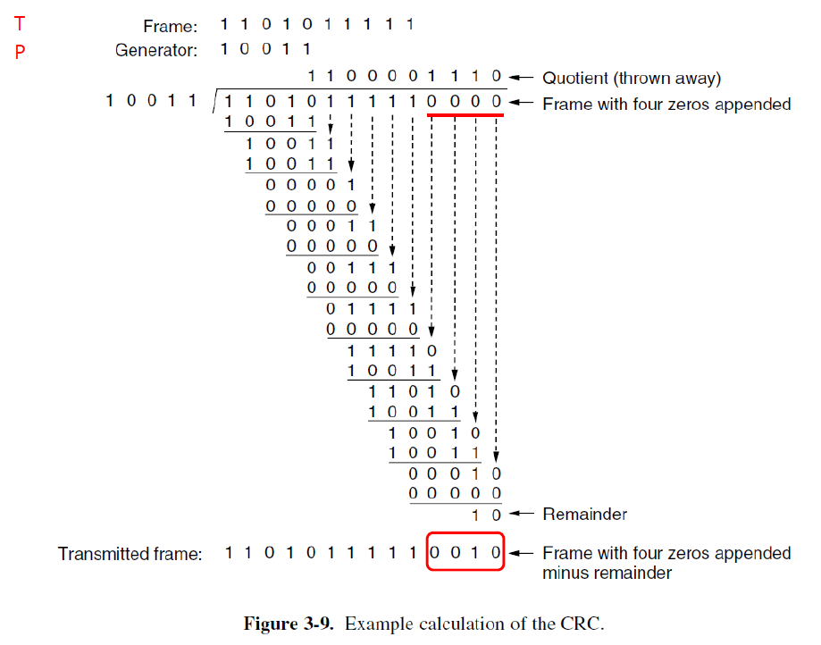{ width="600" }
</figure>

## 4 Elementary Data Link Protocols

**A utopian simplex protocol**（乌托邦式单工协议）：理想化通信模型

1. 单向传输：数据只从一方流向另一方
2. 始终就绪：假设发送方和接收方的上层（网络层）随时都能立即处理数据
3. 忽略处理时间：假设数据在发送端和接收端的封装、解封装、计算等处理时间为零
4. 无限缓冲区：假设发送和接收方有永远用不完的缓存空间来存储数据
5. 无损信道：这是最不切实际的假设，认为物理信道是完美的，帧永远不会出错或丢失

---

**A simplex stop-and-wait protocol for an error-free channel**（用于无差错信道的单工停止-等待协议）

解决流量控制的问题：即使信道是完美的（无差错），如果发送方发送帧的速度快于接收方处理（例如，将数据上传给网络层）的速度，接收方的缓冲区最终会被填满，导致帧被丢弃

解决方案：引入 **feedback** 机制。接收方通过向发送方发送一个 **dummy frame**（哑帧，确认帧，ACK）来主动控制发送方的节奏

工作流程：发送方发送一帧数据，然后停止并等待。接收方成功接收该帧并将其上传给网络层后，发回一个 ACK。发送方收到 ACK 后，才被允许发送下一帧

该协议对信道的要求：由于通信是单向的（数据一个方向，ACK 反方向），且同一时间只有一个方向在传输，因此半双工信道（可以双向通信但不能同时）就足够了

---

**A simplex stop-and-wait protocol for a noisy channel**（用于噪声信道的单工停止-等待协议）

解决信道噪声的问题：信道不是完美的。数据帧可能在传输过程中发生比特错误（损坏） 或完全丢失

解决方案：超时重传机制。在发送方引入一个 timer（计时器）

工作流程：发送方发送一帧，并同时启动计时器。如果发送方没有在预定的时间内收到 ACK 消息，发送方就认为帧传输失败。发送方于是重新发送原来的那一帧，并重启计时器。这个过程一直重复，直到发送方最终收到对应的 ACK 为止

缺陷：**duplicate**，重复帧问题。如果接收方发给发送方的 ACK 丢失了，那么发送方会再次发送一个同样的数据包，导致数据重复

<figure markdown="span">
    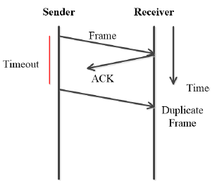{ width="400" }
</figure>

!!! question "关于 stop-and-wait 协议的两个问题"

    1. 超时时间应设置多长？

        1. 必须预留足够的时间，让帧能够到达接收方、让接收方在最坏情况下完成处理、并且让确认帧能够传回发送方
        2. 如果超时间隔设置过短，发送方会传输不必要的帧（即重复帧）
        3. 如果超时间隔设置过长，信道将会处于空闲状态，降低效率

    2. 如何避免将重复帧当作新帧接收？接收方必须能够判断收到的帧是一个新帧还是一个重复帧

关于第 2 个问题的解决方案：为帧分配 sequence number（序列号）

具体实现：每个发出的数据帧都带有一个序列号。接收方返回的确认帧也携带它所确认的那个数据帧的序列号。对于最简单的停止-等待协议（每次只发一帧），由于在任何时刻只有一个未确认的帧，因此只需要两个序列号（0 和 1）循环使用就足够了。这只需要 1 个比特来表示

接收方检查收到的数据帧序列号。如果序列号与期望接收的下一个新帧的序列号相同，则接收并上传给网络层，然后更新期望的序列号。如果序列号是旧的（与期望的不符），则说明是重复帧，直接丢弃，但仍为这个重复帧发送一个 ACK（以防之前的 ACK 丢失）

序列号的位置在每个数据帧的头部。但头部空间非常宝贵，为了减少开销（提高效率），我们希望序列号字段尽可能小

!!! question "在 stop-and-wait 协议中，序列号所需的最小比特数是多少"

    只有在收到对当前帧（设为帧 m）的确认后，才会发送下一帧（帧 m+1）。如果发送方在准备发送帧 m+1，那它必定已经收到了帧 m 的确认。而发送方之前能发送帧 m，又意味着它必定已经收到了帧 m-1 的确认。

    因此，在正常情况下，帧 m-1、m、m+1 的发送和确认是一个严格顺序、没有重叠的过程

    需要区分的对象永远只在两个连续的序列号之间（即当前期望的帧和它的前一个或后一个帧），那么只需要两个不同的序列号标签就足够了

    1 个比特恰好可以提供两个序列号：0 和 1。让序列号在这两个值之间交替，就足以让接收方明确判断

<figure markdown="span">
    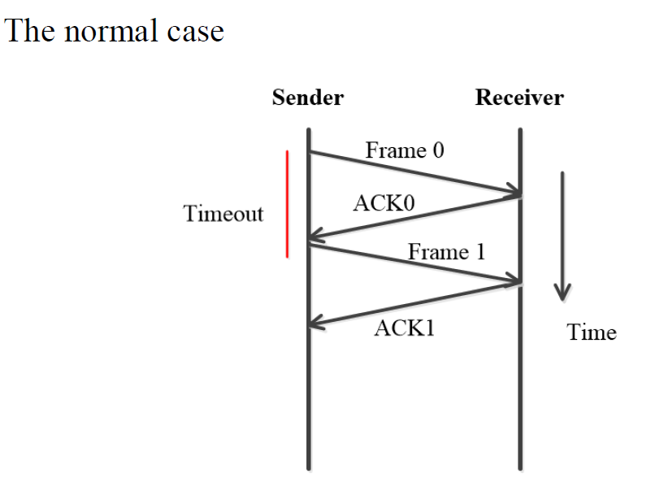{ width="600" }
</figure>

<figure markdown="span">
    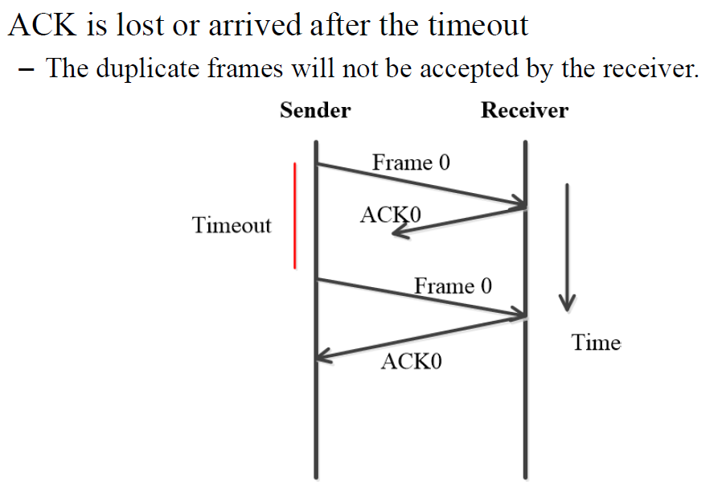{ width="600" }
</figure>

<figure markdown="span">
    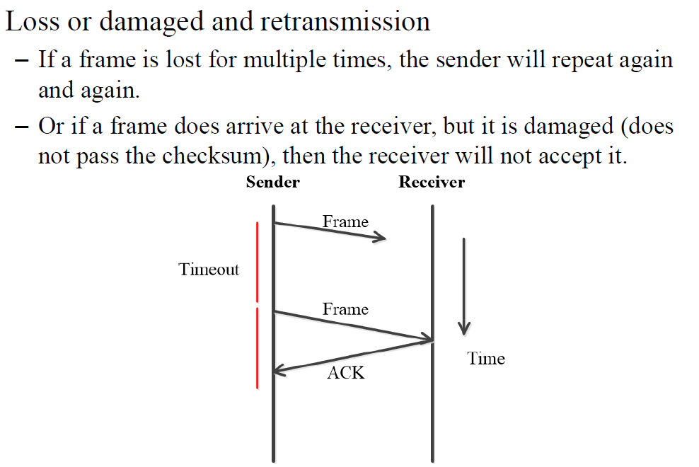{ width="600" }
</figure>

<figure markdown="span">
    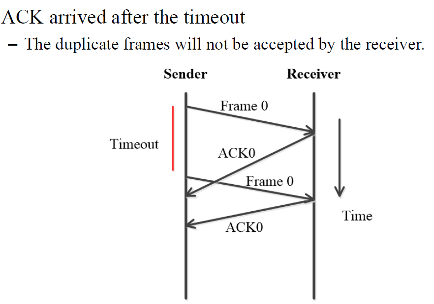{ width="600" }
</figure>

## 5 Sliding Window Protocols

**滑动窗口协议**：适用于全双工通信，即 A 和 B 可以同时互相发送数据。因此，从 A 到 B 的链路上，既会有 A 发给 B 的数据帧，也会有 B 发给 A 的确认帧。这两个方向的流量是混合在一起的

**Piggybacking**（稍带确认，驮运）：当 B 需要向 A 发送数据并且同时需要确认之前从 A 收到的数据时，它不会单独发送一个纯粹的确认帧。相反，它会将确认信息（ACK）放入它要发给 A 的数据帧的头部字段中

B 在准备好要发送给 A 的数据帧后，会稍微等待一个极短的时间（延迟发送）。如果在这段等待时间内，有需要确认的 A 发来的数据帧到达，B 就会将这个确认信息"捎带"在自己即将发出的数据帧里，一起发送给 A

!!! question "那么这个极短的等待时间具体是多久呢"

    设置一个固定的等待计时器。如果在计时器超时之前，本机恰好有数据要发送给对端，那么确认信息就可以完美地捎带在这个数据帧上发出。如果在计时器超时之后，仍然没有反向数据，为了不耽误确认，数据链路层会立即发送一个独立的、专门的确认帧，以避免发送方因等待 ACK 而超时

三种主要的滑动窗口协议：

1. A one-bit sliding window protocol：实质上就是停止-等待协议在全双工场景下的实现。发送窗口大小为 1，效率最低，但实现最简单，缓冲区需求最小
2. A protocol using go back N：发送窗口大于 1，允许连续发送多个帧。如果某个帧出错，发送方会回退并从出错的帧开始重传所有后续帧。效率高于停止-等待，但重传开销可能较大
3. A protocol using selective repeat：发送窗口大于 1。它只选择性地重传那些真正出错或丢失的帧。效率最高，但实现最复杂，因为接收方需要更大的缓冲区来缓存乱序到达的帧

在任意时刻，发送方维护一组序列号，这些序列号对应于它被允许发送的数据帧。这些帧被称为落在 the sending window（发送窗口）内

发送窗口指发送方当前可以发送的一组连续帧的序列号范围。这些帧要么已经发出但还没收到确认，要么是还可以发送的新帧

由于当前在发送方窗口内的帧可能在传输过程中丢失或损坏，发送方必须在内存中保留所有这些帧，以便可能进行重传

每一个未被确认的帧都需要占用一个缓冲区空间，如果最大窗口大小为 n，则发送方需要 n 个缓冲区来存放未被确认的帧。如果窗口增长到最大尺寸，发送方数据链路层必须强制关闭网络层，否则会导致缓冲区溢出（也就是发送方暂停从网络层接收新的数据包）。这就是 **flow control**（流量控制）

类似地，接收方也维护一个 receiving window（接收窗口），定义了接收方愿意接受的帧的序列号范围

1. 选择性接受：任何落在窗口内的帧都会被放入接收方的缓冲区，而任何落在窗口外的帧都会被丢弃
2. 顺序处理：当接收到序列号等于窗口下边界的帧时，该帧会被传递给网络层，同时窗口向前滑动一个位置

如果窗口大小为 1，意味着数据链路层只按顺序接受帧。而如果窗口大小大于 1，可以乱序接受，但需要额外机制保证最终顺序

发送方窗口和接收方窗口的上下边界不需要相同，甚至大小也可以不同。在某些协议中，窗口大小是固定的，但在其他协议中，随着帧的发送和接收，窗口大小可以随时间增长或缩小

<figure markdown="span">
    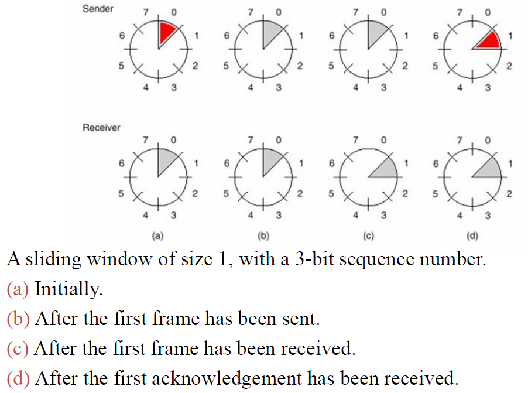{ width="600" }
</figure>

### 5.1 One-Bit Sliding Window Protocol

<figure markdown="span">
    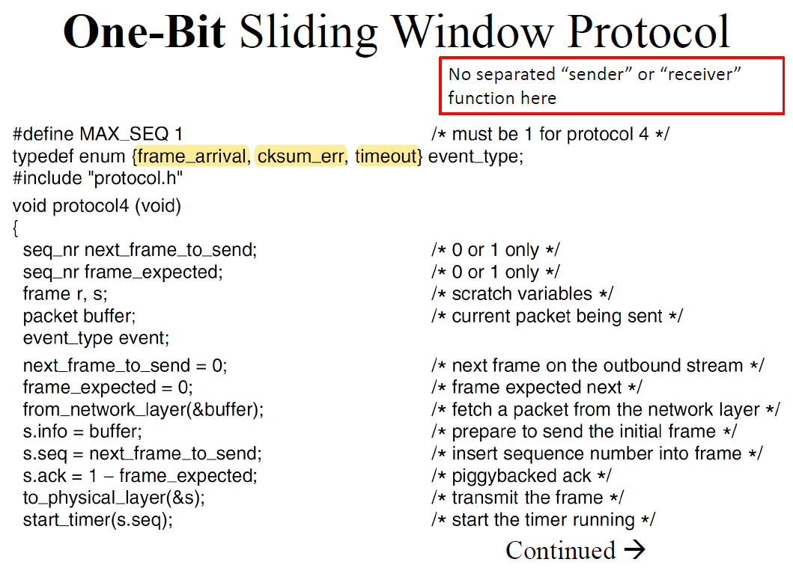{ width="800" }
</figure>

<figure markdown="span">
    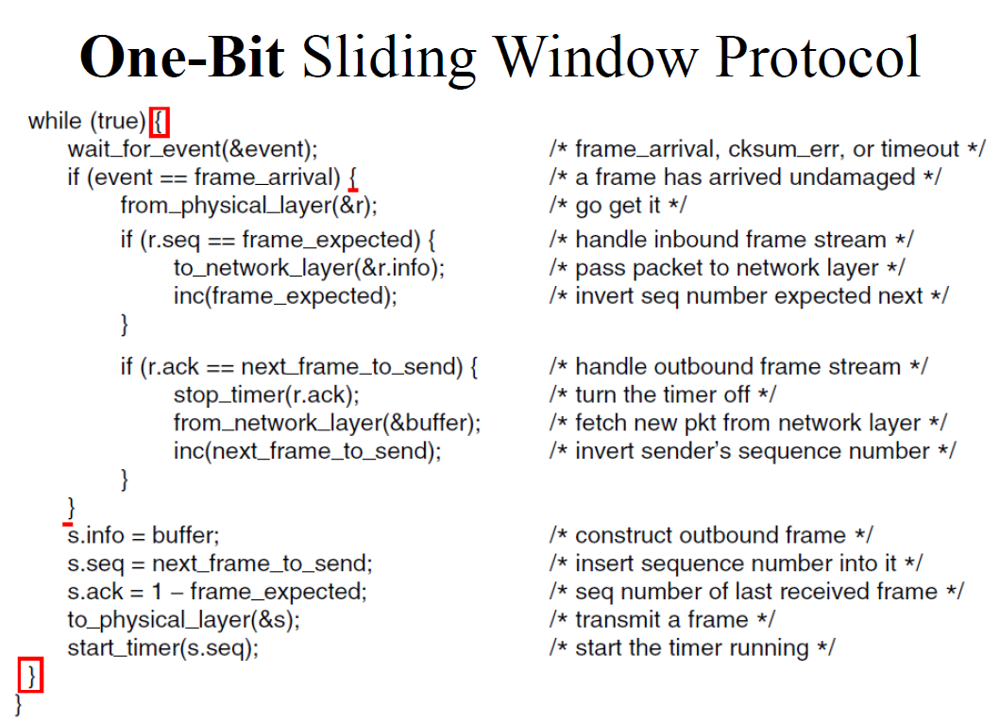{ width="800" }
</figure>

<figure markdown="span">
    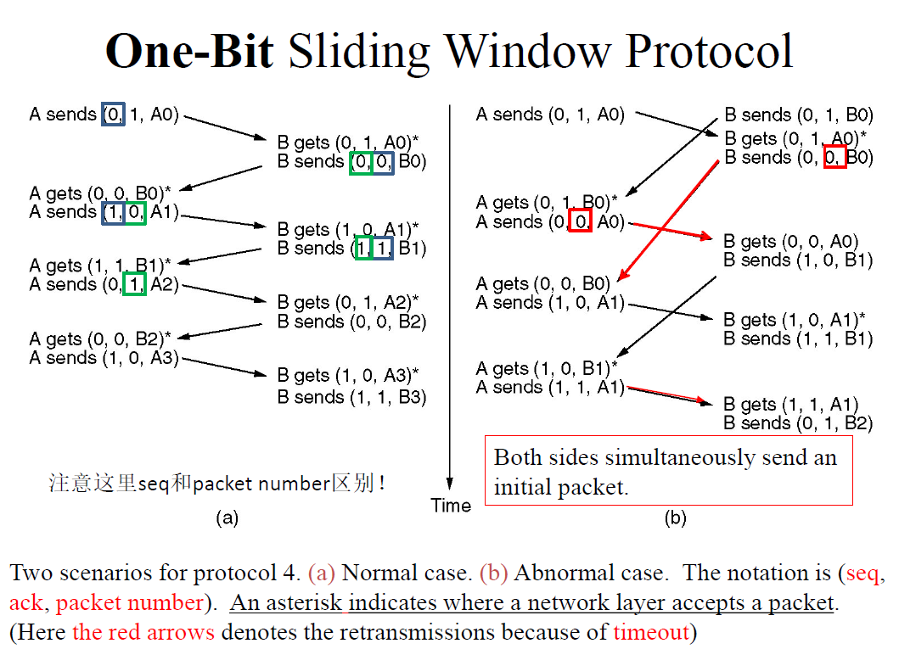{ width="800" }
</figure>

!!! example "示例"

    考虑一个 50 kbps 的卫星信道，其往返传播延迟为 500 毫秒。假设我们尝试使用该协议通过卫星发送 1000 比特的帧

    在 $t = 0$ 时，发送方开始发送第一帧，在 $t = \dfrac{1000\ bit }{50\ kbps} = 20\ ms$ 时，该帧已完全发送。直到 $t = \dfrac{500}{2} + 20 = 270\ ms$ 时，该帧才完全到达接收方，并且在最佳情况下，直到 $t = 520 ms$ 时 ACK 才返回发送方

    而发送方只能在收到 ACK 后才能发送下一帧，但在这 520 ms 中，发送方只用了前 20 ms 发送数据，其余 500 ms 都在等待

因此，该协议在长传输时间、高带宽、短帧长度的情况下效率极低

!!! example "解决方案"

    > 这个解决方案不是 One-Bit Sliding Window Protocol，而是 A Protocol Using Go Back N
    >
    > 这里是为了引入 A Protocol Using Go Back N

    发送方不再等待每个帧的 ACK 才发下一个，而是可以连续发送多个帧（最多 w 个），直到窗口满为止。发送方只需在收到某个帧的 ACK 后，就可继续发送新帧，从而充分利用信道带宽

    如何计算合适的 w：

    1. 计算 bandwidth-delay product（带宽-延迟积）：链路的带宽 × 单向传播时间，即 $50\ kbps \times 500\ ms / 2 = 12500\ bits$。这个值代表了在单向传播时间内，链路上可以承载的数据量
    2. 换算成帧数：用总比特数除以每帧比特数，得到帧的数量。$BD = \dfrac{12500\ bits}{1000\ bits/frame} = 12.5\ frames$。在单向传播时间内，可以发送 12.5 个帧进入信道
    3. 确定窗口大小 w：$w$ 应设为 $2BD + 1$。2BD 表示在往返时间内，最多有 2BD 帧在传输中。而 ACK 是在接收完一整帧后才发出的，所以最后那个 ACK 可能稍晚，为了确保不会出现序号混淆，需要额外 +1。在这个例子中 $w = 26$

### 5.2 A Protocol Using Go Back N

pipelining 是指发送方可以连续发送多个帧，而不需要等待每个帧的确认（ACK），这些帧像流水一样依次在信道上传输。但网络是不可靠的，帧可能因噪声、干扰等原因被损坏或丢失，而该协议的目标是保证无差错、有序交付

面临的问题：

1. 中间帧出错怎么办？
2. 接收方如何处理后面的正确帧？

因为接收端的数据链路层有义务按顺序将数据包交给网络层

<figure markdown="span">
    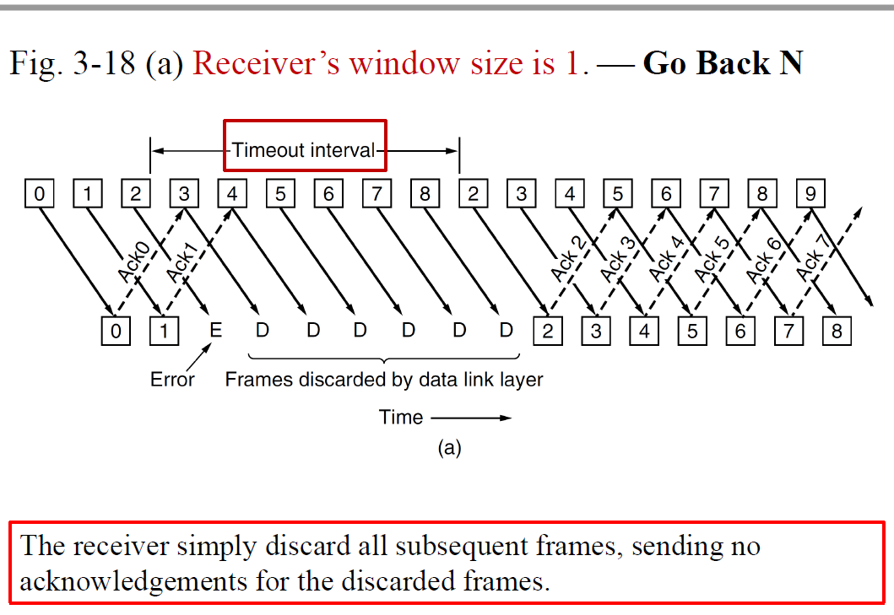{ width="600" }
</figure>

Go Back N 协议的特性：

1. 发送窗口大小为 w
2. 接收窗口大小为 1（只接受按序到达的帧）
3. ACK 类型：cumulative ACK（当收到对帧 n 的 ACK 时，帧 n-1，n-2 等也自动被确认），支持 piggybacking
4. 错误处理：若某帧未收到 ACK 或检测到错误，则从该帧起全部重传
5. 定时器机制：每个帧发送后启动超时定时器

<figure markdown="span">
    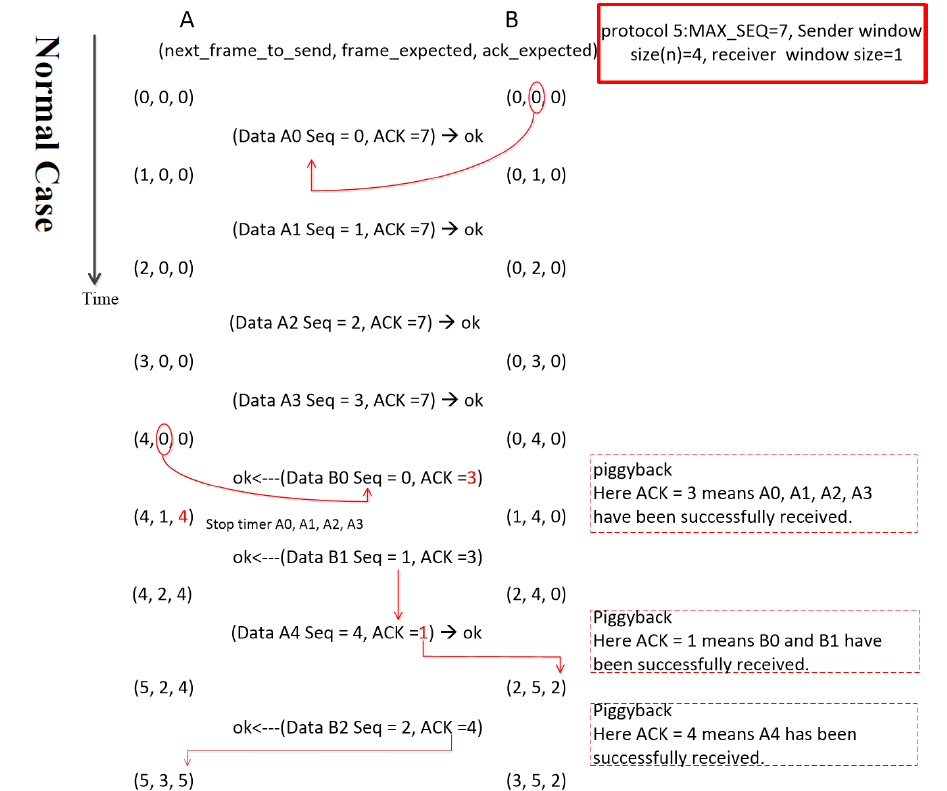{ width="800" }
</figure>

<figure markdown="span">
    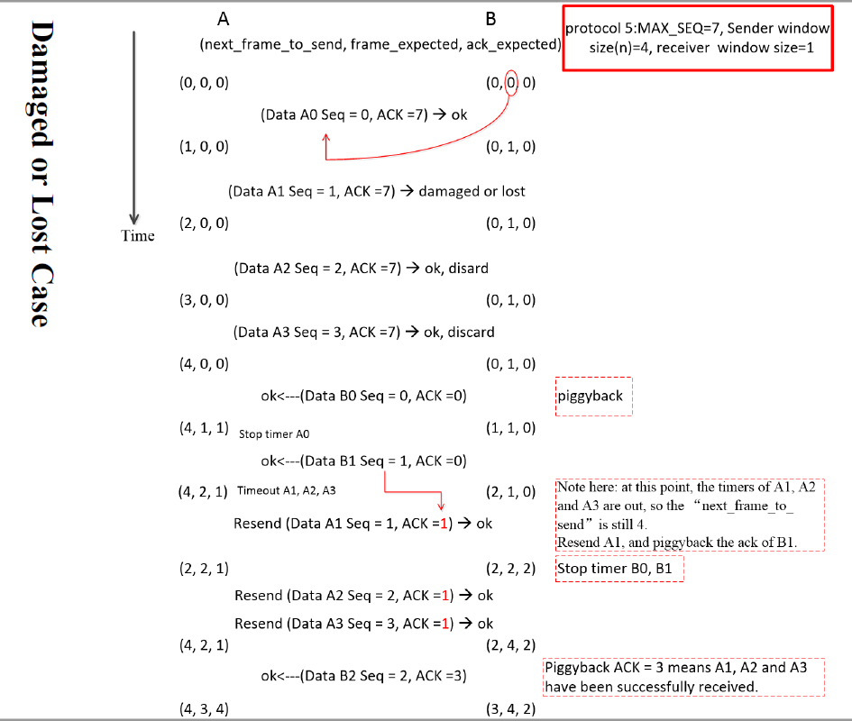{ width="800" }
</figure>

使用 `MAX_SEQ + 1` 个不同的序列号，未确认的帧数量不能超过 `MAX_SEQ`，因此发送方窗口大小必须小于等于 `MAX_SEQ`

!!! example "假设 `MAX_SEQ = 7`，发送窗口大小为 8"

    1. 发送方发送帧 0 到 7
    2. 帧 7 的 piggybacking ACK 最终返回给发送方
    3. 发送方再次发送另外 8 个帧，序列号仍为 0 到 7

        1. case 1：第 2 批次的所有 8 个帧全部丢失
        2. case 2：第 2 批次的所有 8 个帧都成功到达

    4. 发送方又收到一个帧 7 的 piggybacking ACK，此时会产生歧义：

        1. case 1：接收方发送的 piggybacking ACK 为 7
        2. case 2：同样发送的 ACK 为 7

    这导致发送方无法判断这个 ACK = 7 是来自第 1 批次还是第 2 批次，无法确认第 2 批次的帧有没有被接收方接收

!!! example "假设 `MAX_SEQ = 7`，发送窗口大小为 7"

    1. 发送方发送帧 0 到 6
    2. 帧 6 的 piggybacking ACK 最终返回给发送方
    3. 发送方再次发送另外 7 个帧，序列号为 7 0 1 2 3 4 5

        1. case 1：全部丢失
        2. case 2：全部成功到达

    4. 发送方收到一个 piggybacking ACK，两种情况不会产生歧义

        1. case 1：ACK = 6
        2. case 2：ACK = 5

逻辑上来说一个帧需要一个定时器，每个帧的超时事件与其他帧无关

<figure markdown="span">
    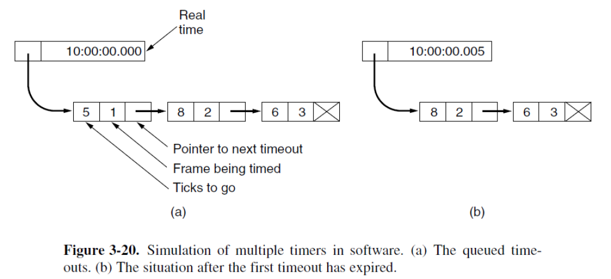{ width="600" }
</figure>

发送方为每一个已发送但未确认的帧维护一个缓冲区。每个缓冲区对应一个定时器（或共享一个主定时器）。因此，需要的定时器数量取决于发送方缓冲区的数量（即窗口大小），而不是整个序列号空间的大小

正常情况下，接收方不会专门发送一个 ACK 帧来确认收到数据，而是将 ACK 信息“捎带”在下一个要发送给发送方的数据帧中。这样可以节省带宽，但如果没有反向流量（即接收方不需要向发送方发数据），就无法发送 ACK

**解决方案**：引入辅助定时器 `start_ack_timer`。当接收方收到一个按序到达的数据帧时，立即启动一个辅助定时器 `start_ack_timer`，如果在定时器超时之前，接收方仍然没有机会发送其他数据（即没有反向流量），那么它就会主动发送一个独立的 ACK 帧。而由辅助定时器超时引起的事件叫做 `ack_timeout`

### 5.3 A Protocol Using Selective Repeat

go back N 协议在错误较少时表现良好，但如果信道质量差，它会因为大量重传帧而浪费大量带宽。而 Selective Repeat 协议允许接收方接受并缓存那些在损坏或丢失帧之后到达的帧。也就是接收方可以乱序接收帧，并按顺序将数据包交给网络层

假设条件：

1. 双向传输数据：使用 piggybacking ACK 或者独立的 ACK
2. 噪声信道
3. 来自网络层的数据流有限
4. NACK packets：Negative Acknowledgment。当接收方发现帧丢失或错误时，发送 NACK 给发送方

<figure markdown="span">
    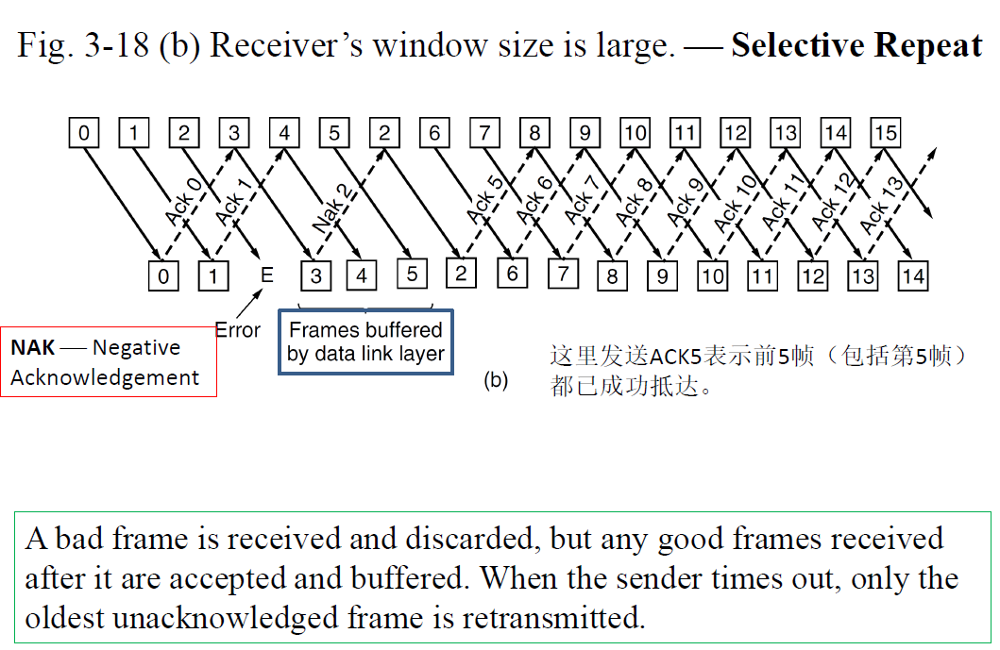{ width="600" }
</figure>

发送窗口的大小从 0 开始，逐渐增长到某个预定义的最大值。接收窗口的大小始终是固定的，并等于预先设定的最大值。接受方为窗口内每个可能的序列号准备一个独立缓冲区，每个缓冲区有一个标志位 `arrived`，用于标记该缓冲区是否已满。每当一个帧到达时，会使用一个 `between` 函数检查其是否落在接收窗口范围内，如果确实落在范围内，则可以接收并存储

当收到一个损坏的帧或不是预期中的帧（可能是丢失的帧）时，接收方会向发送方发送一个 negative acknowledgement（NAK）。这个帧的作用是请求发送方重新传输 NAK 中指定的帧

如果接收方多次检测到同一帧缺失，可能会重复发送 NAK。为了避免浪费带宽和混淆发送方，接收方需要记录是否已发送过 NAK 给某个帧。引入变量 `no_ack`，当其值为 `true` 时，表示尚未为此帧发送 NAK；当其值为 `false` 时，表示已发送过 NAK，就不会重复发送 NAK

即使 NAK 本身在网络中被损坏或丢失了，也不会导致系统崩溃或数据丢失。因为发送方仍然会在一定时间内等待确认。如果长时间没有收到 ACK 或 NAK，就会触发超时机制，然后自动重传该帧

那么 A Protocol Using Selective Repeat 的接收窗口的大小应该如何设置呢？

!!! example 分析"

    假设 `MAXSEQ`，发送窗口和接受窗口（最大）大小均为 7

    正常情况：

    1. 发送方发送：F₀, F₁, F₂, F₃, F₄, F₅, F₆
    2. 接收方成功接收到所有帧，并发送确认：Ack₆
    3. 接收方将窗口向前滑动，现在它期望下一个帧是 F₇
    4. 它的接收窗口变为：[7, 0, 1, ..., 5]

    如果 Ack₆ 在网络中丢失了
    
    1. 发送方没有收到确认，超时后，发送方需要重传之前发送过的帧：F₀⁰ … F₆⁶（上角标表示同一帧的重复）
    2. 而接收方当前窗口是 [7, 0,1,...,5]，它仍然接受序列号为 0~5 的帧。所以当发送方重传 F₀~F₅ 时，接收方会再次接收它们。如果接收方不知道这是重传，它可能会把它们当作“新帧”来处理

    核心问题：overlap（序列号空间重叠）。当接收方滑动窗口后，新的有效序列号范围（如 7, 0~5）和原来的范围（如 0~6）产生了重叠区域（0~5）。如果这个重叠区域内有帧被重传，接收方无法判断它是新的还是旧的

因此，接收窗口大小应该小于等于 `(MAXSEQ + 1) / 2`

这样，接收窗口最多占据一半的序列号空间，就不会与旧窗口重叠

## 6 Examples of Data Link Protocols

使用数据链路层协议的两种常见场景：

1. 广域网中的 SONET 光纤链路：主要用于连接互联网服务提供商（ISP）网络中位于不同地理位置的路由器，构建覆盖范围广阔的骨干网络
2. 互联网边缘的 ADSL 链路：ADSL 是一种利用传统电话线进行宽带上网的技术。其特点是"非对称"，即下载速度通常远高于上传速度。它运行在"本地环路"上，也就是从用户家庭或办公室到电话公司端局的那段线路

Point-to-Point Protocol（PPP，点对点协议）：它是一个标准的数据链路层协议，用于在点对点链路上直接连接的两个节点之间传输数据包，同时也是一个封装（成帧）机制，可以承载多种网络层协议（如 IP、IPX 等）的数据包，并在多种物理介质上运行

PPP 的核心功能：

1. 成帧与差错检测：PPP 定义了数据帧的开始和结束位置，解决了如何在连续的比特流中正确分离出一个个独立的数据帧的问题。同时通过帧内的校验和字段，接收方可以检测数据在传输过程中是否出错
2. 链路控制协议（LCP）：负责在数据传输前建立、配置和测试数据链路连接（例如，认证用户名密码），并在通信结束后优雅地终止连接
3. 网络控制协议：PPP 本身不关心网络层用什么协议，它为每种支持的网络层协议提供了一个对应的 NCP。NCP 用于在链路建立后，独立地协商和配置特定网络层协议所需的参数

### 6.1 Packet Over SONET

SONET 是一个物理层协议。这意味着它关注的是如何在物理介质上传输原始的比特流。它是现代通信网络（如互联网骨干网、电话系统）核心高速光纤链路上最常用的技术

1. 恒定速率比特流：SONET 提供的是一个以非常精确和稳定的速率运行的比特流。这为高速数据传输提供了可靠且可预测的通道
2. 同步结构：它将比特流组织成一种重复出现的、固定时长（125 微秒）的帧结构。每个帧内包含固定大小的字节作为有效载荷。这个 125 µs 的节奏是绝对固定不变的，无论当前是否有用户数据需要发送。如果某个时刻没有数据，帧内相应的位置就会填充空数据

PPP 在 IP 路由器上运行以提供传输机制

<figure markdown="span">
    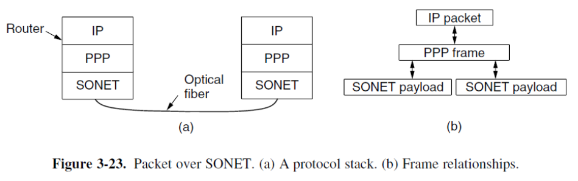{ width="600" }
</figure>

#### 6.1.1 The PPP Frame Format

PPP 帧格式：使用 byte stuffing，并且所有帧都是整数字节

<figure markdown="span">
    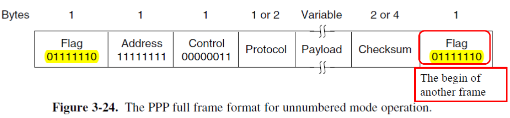{ width="600" }
</figure>

**flag byte**：固定的 0x7E 用于明确标识一个 PPP 帧的开始和结束

字节填充：为了解决有效载荷数据中可能出现的 0x7E 被误认为是帧边界的问题，PPP 使用了转义机制

1. 发送端：当有效载荷中出现 0x7E 时，将其转换为两个字节：0x7D 后跟 0x5E。这个 0x5E 是通过将原始的 0x7E 与 0x20 进行异或计算得到的
2. 接收端：当接收到 0x7D 时，就知道这是一个转义序列。接收方会移除 0x7D，并将其后面的字节与 0x20 进行异或操作，从而恢复出原始数据

**address field**：该字段值固定为 11111111，这是一个广播地址。因为在点对点 链路上只有两个设备（一端发送，另一端接收），不需要复杂的寻址。这个固定值简单地指示"链路上的对端设备请接收此帧"

**control filed**：默认值为 00000011，这表示这是一个 "无编号帧"。在 HDLC 协议族中，"无编号帧"意味着该帧不包含序列号，也不需要接收方进行确认

**protocol field**：这是一个"多路复用"字段，用于标识有效载荷中封装的上层协议类型。接收方根据此字段的值来决定将数据交给哪个上层协议处理

- 如果该字段值的最高位是 0，则表示有效载荷是网络层数据包，如 IPv4、IPv6 等
- 如果最高位是 1，则表示有效载荷用于 PPP 本身的控制和管理，如用于链路协商的 LCP 包或用于网络层配置的 NCP 包

**payload field**：可变长，默认最大长度与以太网相同，为 1500 字节（可通过协商改变）

PPP 有效载荷在插入 SONET 有效载荷之前会进行 scrambled（加扰）。在发送前，用一个已知的伪随机序列与 PPP 有效载荷进行异或操作。这能将长串的 0 或 1 "打散"，变成看起来随机的 0/1 序列。接收端再用相同的伪随机序列进行相同的异或操作，即可解扰，恢复原始数据

目的：加扰不是为了加密，而是为了确保物理链路上的比特流有足够的电平转换（0 和 1 的变化）。像 SONET 这样的物理层接收端需要依赖频繁的 0/1 跳变来恢复时钟信号，保持发送方和接收方的同步。语音信号本身充满变化，但数据通信中，用户可能发送一长串连续的 0（例如，一个全零的数据块或静默期），这会导致物理线路上长时间没有电平变化，从而使接收端时钟失步，最终导致误码

**checksum field**：用于差错检测。接收方会重新计算校验和并与收到的值比较，如果不一致，则丢弃该帧。通常使用 2 字节的 CRC 校验

#### 6.1.2 PPP Link Up & Down

<figure markdown="span">
    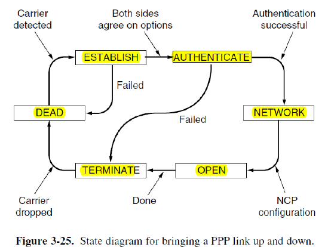{ width="600" }
</figure>

1. 初始状态 DEAD：这是链路的起点。表示物理层没有连接（例如，网线没插好，调制解调器未通电或未同步）
2. 物理连接建立 DEAD → ESTABLISH：在此状态下，通信双方开始使用 LCP 数据包进行对话，协商数据链路层的各种参数
3. 认证阶段 ESTABLISH → AUTHENTICATE：如果 LCP 协商成功，并且协商内容中包含需要认证，则链路进入认证状态。在此状态，双方根据在 LCP 阶段商定的认证协议交换凭证，进行身份验证

    1. 如果认证成功，链路转移到 NETWORK 状态
    2. 如果认证失败，链路会转移到 TERMINATE 状态，准备关闭连接

4. 网络状态 NETWORK：PPP 使用网络控制协议来配置和启用网络层协议。NCP 不是单一的协议，而是一个协议族。每个网络层协议都有其对应的 NCP（例如，IP 对应 IPCP，IPv6 对应 IPV6CP）。这些 NCP 负责处理特定网络层协议在点对点链路上所需的配置，例如为接口分配和管理 IP 地址
5. 开放状态 OPEN：这是 PPP 链路的完全操作状态，也是最终目标。当所有 NCP 配置完成后，链路就进入此状态。在此状态下，链路准备就绪，可以开始传输用户数据。具体来说，IP 数据包被封装到 PPP 帧中，然后通过底层的物理介质进行传输
6. 终止状态 TERMINATE：当通信完成或需要断开连接时，链路进入 TERMINATE 状态。在此状态下，PPP（通常通过交换 LCP 终止数据包）会优雅地关闭数据链路层的连接。之后，随着物理层连接的断开（例如，光信号中断），链路状态最终回归到初始的 DEAD 状态，完成一个完整的生命周期

### 6.2 ADSL

**Asymmetric Digital Subscriber Loop**（非对称数字用户环路）

ADSL 物理层：其基础是 OFDM（正交频分复用）数字调制技术。这种技术将信道划分为大量子载波，能有效对抗家庭电话线（双绞线）环境中的干扰，实现高速数据传输

DSLAM：是安装在电话公司端局的多路复用设备，是所有用户 ADSL 线路的汇聚点。它的关键作用是终结 ADSL 连接，从来自用户的数据流中提取出 IP数 据包，并将其送入 ISP 的骨干网络，最终路由至互联网

<figure markdown="span">
    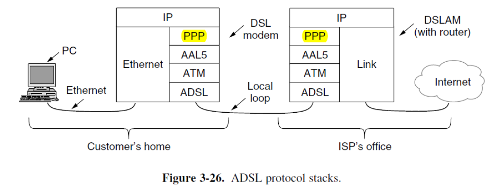{ width="600" }
</figure>

1. ADSL（物理层）
2. ATM & AAL5（数据链路子层）：在 PPP 层之下，数据先被封装到 ATM 信元中。AAL5 是 ATM 适配层的一种，负责将上层的数据包分割并装入固定长度的 ATM 信元进行传输，并在接收端重新组装
3. PPP (数据链路层)：PPP 的功能保持不变。它仍然负责链路的建立、认证、配置，并为 IP 数据包提供成帧机制
4. IP（网络层）：最终需要传输的用户数据包

ATM（Asynchronous Transfer Mode）：

1. 信元交换：ATM 的基本传输单位是固定长度的 cells（信元）。这与可变长度的"帧"或"包"不同
2. 异步性：这里的"异步"指信元可以根据需要动态分配带宽，而不像 SONET 那样占用固定的、周期性的时隙。这使其更灵活地适应突发性数据流量
3. connection-oriented（面向连接）：在数据传输前，必须首先建立一条 virtual circuit（虚电路）。每个信元都携带标识该电路的 VCI（virtual circuit identifier），网络设备根据 VCI 进行交换和转发，确保了服务质量
4. 信元结构：固定为 53 字节，其中 5 字节为信元头（包含 VCI 等控制信息），48 字节为有效载荷。这种小尺寸固定长度有助于减少传输延迟和抖动，适合实时业务

由于上层协议（如 IP/PPP）使用变长的数据包，而 ATM 网络只传输固定 53 字节的信元。就需要 adaptation layer（适配层）来弥合这一差异

AAL5 适配层：

1. 发送端（分段）：AAL5 接收来自上层的变长数据包（例如一个完整的 PPP 帧），将其分割成若干个 48 字节的块，并分别加上 ATM 信元头，组装成一系列 ATM 信元进行传输
2. 接收端（重组）：AAL5 接收 ATM 信元，去掉信元头，将 48 字节的有效载荷重新组合成原始的上层数据包

<figure markdown="span">
    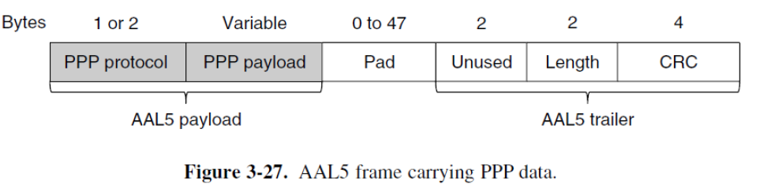{ width="600" }
</figure>

寻址功能由底层 ATM 信元头中的虚电路标识符 完成。每个 ATM 信元都带有 VCI，网络设备根据 VCI 将信元转发到正确的目的地。因此 AAL5 帧本身不需要源和目的地址

尾部：

1. Length：指示 PPP 有效载荷的实际长度（不包括填充和其他字段），以便接收方在重组时能准确提取原始数据
2. CRC：用于检测 AAL5 帧在传输过程中是否出现错误

Pad：为了使整个 AAL5 帧的有效载荷部分（从 PPP 协议字段到 CRC 字段之前）的总长度成为 48 字节的整数倍而添加的空数据。这是关键步骤，因为 ATM 信元的有效载荷是固定的 48 字节，必须确保 AAL5 帧能被精确分割

PPP protocol：标识封装在后面的 PPP payload 中数据的类型（例如，是 IP 数据包还是 LCP 控制包）

### 6.3 DOCSIS

**Data Over Cable Service Interface Specification**（电缆数据服务接口规范）

DOCSIS 协议架构：

1. 物理层：负责在有线电视电缆这种特定物理介质上传输原始的比特流
2. MAC 层：负责控制对共享信道的访问，这是数据链路层的一个关键功能

在物理层之上，DOCSIS 承担了数据链路层的核心职责，包括：

1. 带宽分配：由于信道是共享的，DOCSIS 需要一种机制来协调多个用户设备（电缆调制解调器）对上行和下行信道的同时使用，避免冲突并保证服务质量，这实质上是一种流量控制
2. framing
3. error correction

当电缆调制解调器（cable modem）加电后，它会自动寻找并与运营商端的 CMTS 设备建立连接。在这个过程中，CMTS 会为它分配通信所需的资源，包括上行/下行信道和加密密钥（以保证通信安全）

- 下行信道：从 CMTS 到所有用户调制解调器的信道是广播式的，所有用户都能收到数据，但只提取发送给自己的数据
- 上行信道：所有用户调制解调器共享同一个上行信道向 CMTS 发送数据。因此，必须有一套严格的规则（由 MAC 层定义）来协调各个设备的上传时机，防止数据碰撞。这种共享性是有线电缆网络与电话线点对点连接（如 ADSL）的一个根本区别

<figure markdown="span">
    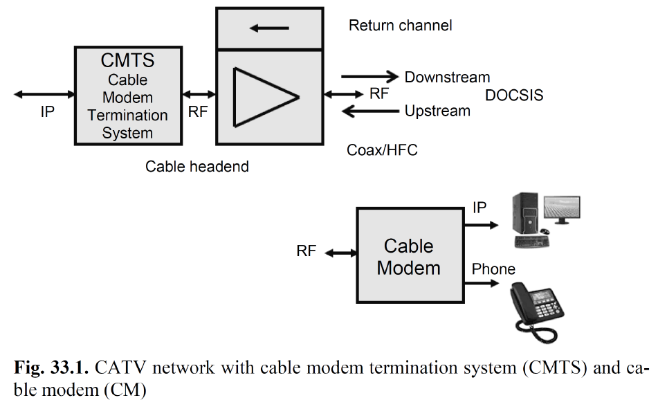{ width="600" }
</figure>

DOCSIS 3.1 之前版本的下行帧结构：

1. 帧格式：下行数据被封装在 188 字节的 MPEG 帧中
2. 帧构成：

    1. 4 字节头部：包含控制信息
    2. 184 字节有效载荷：用于承载实际的数据内容

除了数据本身，CMTS 还会定期向电缆调制解调器发送管理信息，这些信息包括测距、信道分配以及其他与信道分配相关的任务信息

modulation profiles（调制配置文件）：定义了如何利用 OFDM 技术的多个子载波。每个子载波可以根据信道质量独立地采用不同的调制阶数

数据包首先根据其业务流标识和 QoS 参数被分类，convergence layer（汇聚层）将具有相同调制配置文件要求的数据包汇聚到同一个发送缓冲区中。通常，每个配置文件对应一个发送缓冲区，每个缓冲区深度较浅，以避免产生显著的延迟

随后，码字构建器将每个 DOCSIS 帧映射到相应的 FEC 码字（在发送前，DOCSIS 帧会被码字构建器处理，添加纠错码，形成 FEC 码字）

- 下行：结合使用 BCH 码 和 LDPC 码，提供强大的错误保护能力
- 上行：使用 LDPC 码 进行错误保护

CMTS 采用字节填充：如果在下行方向没有可用的 DOCSIS 帧，CMTS 会向 OFDM 符号中插入填充零比特的子载波，或者简单地将一连串的 1 填充到码字中

从 3.0 版本开始，DOCSIS 支持一种称为 channel bonding（信道绑定）的技术，该技术允许单个用户同时使用多个上行和下行信道

<figure markdown="span">
    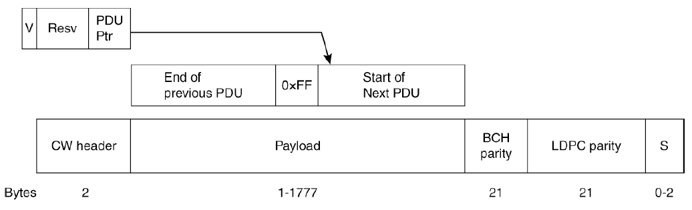{ width="600" }
</figure>
