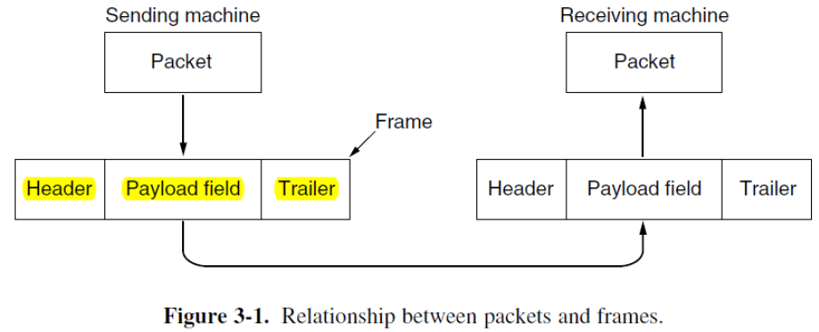

# 3 The Data Link Layer

!!! tip "说明"

    本文档正在更新中……

!!! info "说明"

    本文档仅涉及部分内容，仅可用于复习重点知识

## 1 Overview of Data Link Layer

核心目标：在直接相连的两个网络节点（即"相邻机器"）之间，提供可靠、高效的数据传输服务。其关键在于维持一个"类导线"的信道，保证数据接收顺序与发送顺序完全一致

数据链路层建立在物理层（第一层）之上，物理层负责实际的比特流传输

实际通信信道的三个固有特性：

1. errors
2. finite data rate
3. propagation delay

而数据链路层的三大功能是：

1. **framing**：将物理层传来的原始比特流划分成具有明确边界、可管理的逻辑单元，称为 **帧**
2. dealing with errors：**error detection**（差错检测）and **error correction**（差错纠正）
3. **flow control**（流量控制）：防止发送方的发送速率超过接收方的处理能力，避免接收方缓冲区溢出导致数据包丢失

    1. feedback-based（数据链路层）：接收方向发送方主动发送"反馈"信息，动态地控制发送方的发送行为。发送方必须等待接收方的"许可"才能继续发送
    2. rate-based（传输层）：协议本身为发送方设定一个明确的数据传输速率上限。发送方会按照这个预设的、固定的速率进行发送

数据链路层的实现位置：

1. 在路由器中：在 line card 上实现
2. 在主机中：通过软硬件结合的方式实现

    1. 硬件部分（主要部分）：在 NIC（network adapter / network interface card，网卡）中，网络适配器的核心是 link-layer controller（链路层控制器），通常是一个单一的专用芯片，它实现了许多链路层服务
    2. 软件部分（辅助部分）：在主机 CPU 和内存中运行的程序。负责处理那些需要更高层逻辑或与操作系统交互的任务

数据链路层提供的三种主要服务类型：

1. Unacknowledged connectionless service：发送方直接发送数据帧，不等待接收方的确认。适用于网络质量高、错误率低且需要快速传输的场景，如局域网中的以太网
2. Acknowledged connectionless service：每发送一帧都要求接收方返回确认，但没有预先建立的连接。适用于无线网络等不可靠环境，如 WiFi
3. Acknowledged connection-oriented service：在数据传输前需先建立连接，传输结束后释放连接。提供了最可靠的数据传输保障，适用于高错误率、长距离的通信链路，如卫星通信

## 2 Framing

数据链路层接收来自网络层的 packets，并将其封装成 **frames** 进行传输

通用帧格式：

1. header：包含控制信息
2. payload field：实际传输的数据
3. trailer：通常包含差错检测信息

<figure markdown="span">
    { width="600" }
</figure>

物理层负责接收原始比特流并尝试将其传送到目的地。但由于信道存在噪声，物理层会向其信号添加一些 redundancy，以将误码率降低到可容忍的水平。数据链路层的通常做法是将比特流分割成离散的帧，为每个帧计算一个称为 **checksum**（校验和）的短令牌，并在传输时将其包含在帧中。当帧到达目的地时，会重新计算校验和。如果新计算的校验和与帧中包含的校验和不同，数据链路层就知道发生了错误，并采取措施处理（丢弃或返回错误报告）

将比特流分割成帧是很困难的，一个优秀的设计必须让接收方能够轻松找到新帧的 **起始位置**，同时只占用很少的信道带宽

方法：

1. Byte Count
2. Flag Byte with Byte Stuffing
3. Flag Bits with Bit Stuffing
4. Physical Layer Coding Violations

### 2.1 Byte Count

在每个帧的头部添加一个字段，明确指出该帧有多少个字节。接收端根据这个数值来正确地解析数据帧

<figure markdown="span">
    { width="600" }
</figure>

### 2.2 Flag Byte with Byte Stuffing

使用特殊字节作为帧的起始和结束标记。即使发生传输错误，接收端也能通过搜索这些特殊字节来恢复同步

**flag byte** 是一个约定好的特殊值，在协议中被定义为帧的边界，所有帧都以这个标志字节开头和结尾。那么两个连续的标志字节表示一个帧的结束和下一个帧的开始

但如果某个数据字段中恰好出现了 FLAG 字节，为了避免被误认为是帧边界，需要进行“字节填充”处理。当发送方检测到数据中出现 FLAG 字节时，会在其前面插入一个转义字节（如 ESC），这样接收方就知道这不是真正的帧边界

但如果转义字节本身也出现在原始数据中，同样需要使用转义字节进行转义

!!! example ""

    PPP 协议（Point-to-Point Protocol）广泛使用这种字节填充机制

<figure markdown="span">
    { width="600" }
</figure>

### 2.3 Flag Bits with Bit Stuffing

HDLC（high-level data link control）protocol：使用固定的比特序列 `01111110`（十六进制 `0x7E`）作为帧的起始和结束定界符

当数据部分连续出现五个"1"时，发送方自动插入一个"0"；接收方检测到连续五个"1"后的"0"时，会将其删除，恢复原始数据

这种填充方式的作用：

1. 同步维护：通过强制插入比特，确保传输信号有足够的电平变化，帮助接收方时钟保持同步
2. 透明度：允许数据字段包含任意比特模式，不会与标志位混淆
3. 可靠性：有效区分帧边界和数据内容

!!! example ""

    USB 使用比特填充

<figure markdown="span">
    { width="600" }
</figure>

### 2.4 Physical Layer Coding Violations

许多物理层编码方案（如 4B/5B、8B/10B）包含未使用的编码组合，将这些编码组合用作帧边界标记，不需要像比特/字节填充那样改变实际数据，避免了填充开销

---

许多数据链路协议结合使用上述的方法：

以太网和 802.11 让帧以一个明确定义的称为 **preamble**（前导码）的模式开始。该模式可能相当长（802.11 通常为 72 比特），以便接收方为传入的数据包做好准备。前导码之后是头部中的一个 **长度**（即计数）字段，用于定位帧的结束

> 前导码提供充分的同步时间，长度字段确保帧边界准确识别

## 3 Error Control

两种处理错误的基本策略，这两种策略都向发送的数据添加冗余信息：

1. error-correcting codes（纠错码）：在数据中添加大量冗余信息，使接收方不仅能发现错误，还能自动纠正错误。适用于不可靠信道（如无线链路、卫星通信）
2. error-detecting codes（检错码）：添加适量冗余信息，只能检测错误发生，无法自动纠正。检测到错误会请求 retransmission（重传）适用于高可靠性信道（如光纤）

无论是纠错码还是检错码，都无法处理所有可能的错误，因为提供保护的冗余比特与数据比特一样可能在接收时出错

!!! tip "error models"

    错误产生机制：

    1. 随机错误：由热噪声的极端值引起的，这些极端值会短暂且偶尔地淹没信号，导致孤立的单比特错误，错误之间相互独立
    2. 突发错误：由信号深度衰落、瞬时电磁干扰、设备故障等引起，错误集中出现，连续多个比特受影响

!!! quote ""

    无论是纠错码还是检错码，都不仅用于数据链路层，还广泛应用于其他层，因为 reliability 是一个整体性的关注点

    1. 纠错码：物理层、应用层
    2. 检错码：数据链路层、网络层、传输层

### 3.1 Error Correcting

Block code（块码）：每个块包含 m 个数据位（原始信息）和 r 个校验位（根据数据位通过某种算法生成，用于检错和纠错）。总长度 n = m + r

- Codeword（码字）：就是这个长度为 n 比特的序列
- Code rate（码率）：m / n，表示有效信息所占比例

    - 越高的码率 → 更少的冗余 → 更高效率（但纠错能力弱）
    - 越低的码率 → 更多冗余 → 更强纠错能力（但传输效率低）

!!! example ""

    因此在噪声较大的信道中，使用低码率，增强抗干扰能力；在高质量信道中，使用高码率，提高吞吐量

两种编码方式：

1. Systematic Code（系统码）：原始数据位在编码后仍然保留原样，直接出现在码字中，后面附加校验位（信息明文传输）
2. Linear Code（线性码）：校验位是数据位的线性组合。线性码可以是系统码，也可以不是，即数据位也被变换

#### 3.1.1 Hamming Codes

**Hamming distance**：两个等长码字在不同比特位置的数量

意义：如果两个合法码字之间的汉明距离为 d，则要将其中一个误变为另一个，至少需要发生 d 个比特错误。因此，汉明距离越大，纠错能力越强

> 错的越多，越容易发现

**minimum hamming distance**：根据编码规则，生成所有合法的码字，计算任意两个合法码字之间的汉明距离，找出其中最小的距离，这就是该编码方案的最小汉明距离。这个值决定了编码的检错和纠错能力

!!! tip ""

    1. 要检测 d 个错误，最小汉明距离至少为 d + 1
    2. 要纠正 d 个错误，最小汉明距离至少为 2d + 1

我们要设计一种编码方式，使得当传输中发生任意一个比特翻转（单比特错误）时，接收端仍能准确恢复原始信息（即能够纠正所有单比特错误）

总共有 $2^m$ 个可能的信息组合，每个合法消息对应一个唯一的合法码字，对于每一个合法码字，存在 n 个与其汉明距离为 1 的非法码字。所以，每个合法码字需要“负责”自己本身以及所有可能的单比特错误版本，即每个合法码字总共需要占用 n + 1 个不同的比特模式

所有可能的 n 比特二进制序列总数为 $2^n$，所有合法码字及其对应的单比特错误版本总共需要的空间是：$(n+1) \times 2^m$。为了不超过总空间，必须满足 $(n+1)2^m \leqslant 2^n$，代入 $n = m + r$，可得 

$m+r+1 \leqslant 2^r$

这就是 hamming bound 的简化形式

结论：根据这个公式，我们能够得知纠正单比特错误所需校验位数的理论下限

> r 需要足够大，才能提供足够的冗余来区分所有可能的单比特错误情况

!!! example "m = 4"

    我们想用 m = 4 个信息位，设计一个能纠正单比特错误的码。根据公式可得，至少需要 r = 3 个校验位，总长度为 n = 7

    这就是经典的 (7, 4) 汉明码，可以纠正任意一个比特错误

汉明码的编码过程：

1. 校验位放置：放置在 2 的幂次方的位置，数据位填充剩余位置
2. 校验位计算：遍历所有数据位，记录值为 1 的比特位置，将这些位置编号用二进制表示并进行异或运算，异或结果就是校验位的值

汉明码的解码过程：

1. 伴随式（syndrome word）计算：接收方用同样方法重新计算校验位，与接收到的校验位进行异或比较，得到伴随式
2. 错误定位：伴随式为 0 则无错误；伴随式非 0，其数值直接指示错误位置（如果是检验位发生了错误，则无需进行纠正；如果是数据位发生了错误，则通过反转该数据位进行纠正）

<figure markdown="span">
    { width="600" }
</figure>

<figure markdown="span">
    { width="600" }
</figure>

### 3.2 Error Detecting

## 4 Elementary Data Link Protocols

## 5 Sliding Window Protocols

## 6 Examples of Data Link Protocols